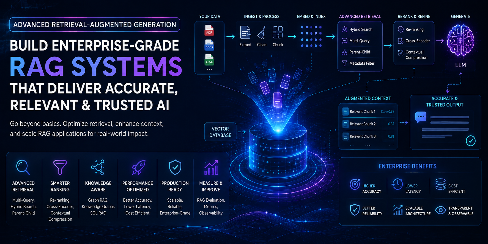

# Part V — Advanced Retrieval-Augmented Generation

> Master enterprise-grade Retrieval-Augmented Generation (RAG) architectures by building scalable, accurate, and production-ready AI systems with advanced retrieval, optimization, evaluation, and observability techniques.

---

## 📖 Overview

Retrieval-Augmented Generation (RAG) has become the foundation of enterprise AI applications by combining the reasoning capabilities of Large Language Models (LLMs) with organization-specific knowledge.

While basic RAG systems demonstrate the core concept, enterprise deployments require significantly more sophisticated retrieval pipelines to improve relevance, reduce hallucinations, optimize latency, control costs, and support large-scale knowledge bases.

This module focuses on advanced retrieval techniques, retrieval optimization, enterprise RAG architectures, evaluation methodologies, and production best practices for building highly reliable AI systems.

Designed for software engineers, backend developers, cloud engineers, solution architects, and AI engineers, this module bridges the gap between basic RAG applications and enterprise-scale knowledge systems.

---

## 🎯 Learning Outcomes

After completing this module, you will be able to:

- Understand advanced Retrieval-Augmented Generation architectures
- Design scalable enterprise RAG pipelines
- Apply Hybrid Search and advanced retrieval strategies
- Optimize retrieval quality using reranking techniques
- Implement Parent-Child, Multi-Vector, and Multi-Query retrieval
- Build Graph RAG and SQL RAG systems
- Design metadata-aware retrieval pipelines
- Evaluate RAG systems using industry-standard metrics
- Optimize latency, accuracy, and operational cost
- Build observable, reliable, and production-ready RAG applications

---

## 🛣️ Recommended Learning Path

This module is designed as a progressive learning journey. We recommend studying the chapters in the order presented, gradually progressing from advanced retrieval techniques to enterprise-scale Retrieval-Augmented Generation architectures.

| Chapter | Status |
|---------|:------:|
| **[01. Advanced Retrieval Fundamentals](01-advanced-retrieval-fundamentals.md)** | 🚧 |
| **[02. Hybrid Search](02-hybrid-search.md)** | 🚧 |
| **[03. Metadata Filtering](03-metadata-filtering.md)** | 🚧 |
| **[04. Parent-Child Retrieval](04-parent-child-retrieval.md)** | 🚧 |
| **[05. Multi-Vector Retrieval](05-multi-vector-retrieval.md)** | 🚧 |
| **[06. Multi-Query Retrieval](06-multi-query-retrieval.md)** | 🚧 |
| **[07. Contextual Compression](07-contextual-compression.md)** | 🚧 |
| **[08. Re-ranking Techniques](08-reranking-techniques.md)** | 🚧 |
| **[09. Graph RAG](09-graph-rag.md)** | 🚧 |
| **[10. SQL RAG](10-sql-rag.md)** | 🚧 |
| **[11. Knowledge Graphs for RAG](11-knowledge-graphs-for-rag.md)** | 🚧 |
| **[12. Agentic RAG](12-agentic-rag.md)** | 🚧 |
| **[13. RAG Evaluation & Benchmarking](13-rag-evaluation-and-benchmarking.md)** | 🚧 |
| **[14. Performance & Cost Optimization](14-performance-and-cost-optimization.md)** | 🚧 |
| **[15. Building Production RAG Systems](15-building-production-rag-systems.md)** | 🚧 |

---

## 🏢 Enterprise Perspective

Enterprise RAG systems power the next generation of AI-driven knowledge applications by combining intelligent retrieval with powerful Foundation Models.

Some common enterprise applications include:

- Enterprise Knowledge Assistants
- AI Search Platforms
- Customer Support Copilots
- Intelligent Document Processing
- Legal & Compliance Assistants
- Financial Research Platforms
- Healthcare Knowledge Systems
- Enterprise Chatbots
- Developer Copilots
- Research Assistants
- Technical Documentation Search
- Enterprise Knowledge Graphs

Throughout this module, you'll learn how enterprise organizations build Retrieval-Augmented Generation systems that are scalable, observable, secure, cost-efficient, and capable of delivering accurate, trustworthy, and context-aware responses.

The concepts learned in this module provide the foundation for the next module, where you'll build intelligent AI Agents capable of reasoning, planning, memory management, and tool utilization.

---

## 🚀 Start Learning

Ready to build enterprise-grade Retrieval-Augmented Generation systems?

➡️ Continue with **[01. Advanced Retrieval Fundamentals](01-advanced-retrieval-fundamentals.md)**.

---

Fixed issue in navigation

> **Enterprise AI Engineering Handbook**  
> *Building Production-Grade Enterprise AI Systems — One Chapter at a Time.*