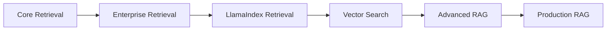
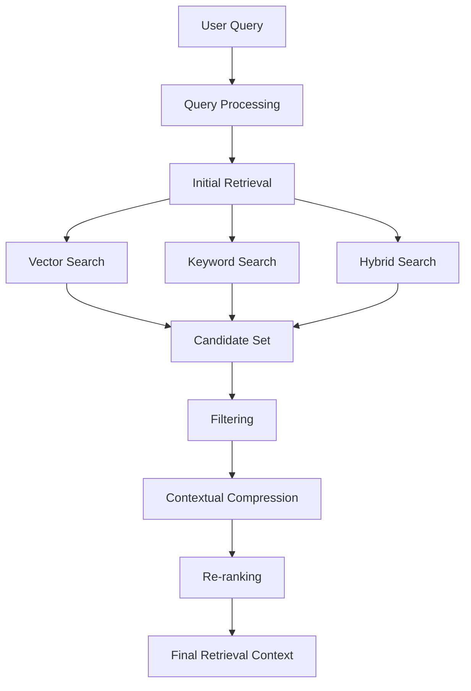
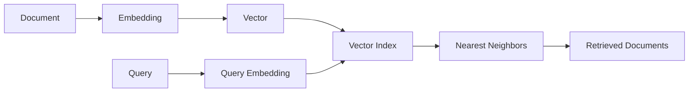
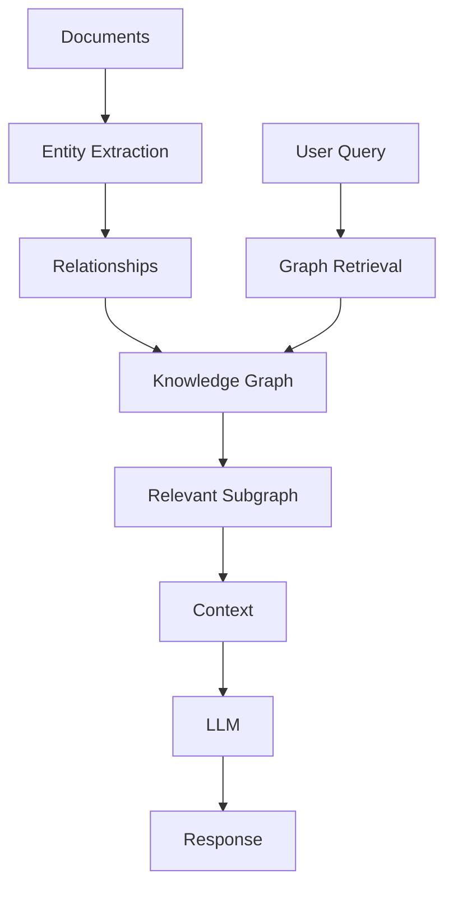
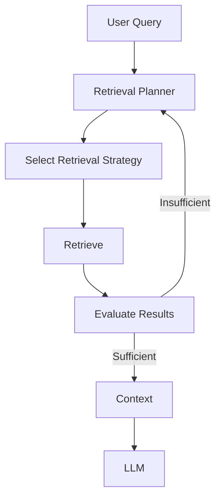
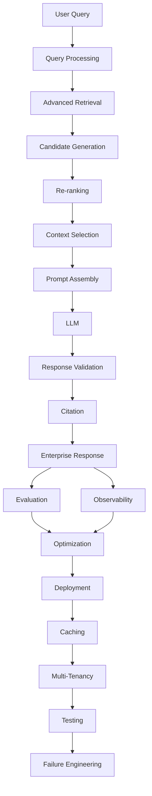
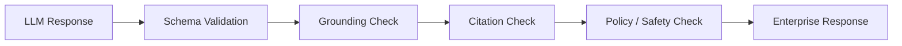
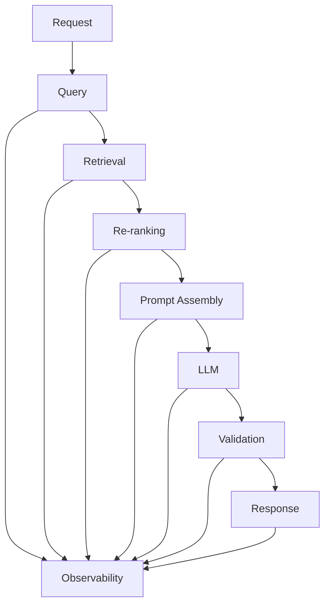
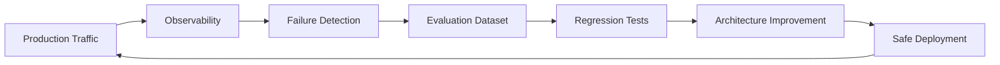

# Part V — Advanced Retrieval-Augmented Generation

> Master enterprise-grade Retrieval-Augmented Generation (RAG) by progressing from advanced retrieval techniques to scalable, observable, evaluated, and production-ready AI systems.


---

## 📖 Overview

Part IV introduced the foundations of Retrieval-Augmented Generation:

```text
User Query
    ↓
Embedding
    ↓
Vector Search
    ↓
Retrieved Context
    ↓
LLM
    ↓
Response
```

Enterprise RAG systems require much more than a basic vector search pipeline.

They need sophisticated retrieval strategies, multiple knowledge sources, ranking and filtering, context engineering, response validation, citations, evaluation, observability, performance optimization, and production architecture.

Part V takes RAG from:

```text
Basic RAG
    ↓
Advanced Retrieval
    ↓
Production RAG
```

The overall production pipeline becomes:

```text
User Query
    ↓
Query Processing
    ↓
Advanced Retrieval
    ↓
Candidate Generation
    ↓
Re-ranking
    ↓
Context Selection
    ↓
Prompt Assembly
    ↓
LLM
    ↓
Response Validation
    ↓
Citation & Attribution
    ↓
Enterprise Response
    ↓
Evaluation
    ↓
Observability
    ↓
Performance & Cost Optimization
    ↓
Deployment
    ↓
Caching
    ↓
Multi-Tenancy
    ↓
Testing
    ↓
Failure Engineering
```

---

## 🎯 Learning Outcomes

After completing this module, you will be able to:

- Design advanced Retrieval-Augmented Generation architectures
- Implement and compare different retriever strategies
- Understand Core and Enterprise Retrieval patterns
- Implement Multi-Query and Self-Query Retrieval
- Implement Parent-Document Retrieval
- Apply Contextual Compression
- Implement Ensemble and Multi-Vector Retrieval
- Apply Time-Weighted Retrieval
- Build Hybrid Search systems
- Apply HyDE-based retrieval
- Design Router and Multi-Stage Retrieval
- Implement Agentic Retrieval
- Apply Re-ranking techniques
- Understand MMR and diversity-aware retrieval
- Build metadata-aware retrieval pipelines
- Apply advanced query rewriting
- Understand LlamaIndex retrieval architectures
- Understand FAISS and vector indexes
- Understand HNSW-based vector search
- Compare vector search technologies
- Build Graph RAG systems
- Understand Knowledge Graphs for RAG
- Build SQL RAG systems
- Design Multimodal RAG systems
- Understand Agentic RAG
- Design production prompt assembly pipelines
- Engineer effective context selection
- Validate generated responses
- Implement citation and source attribution
- Design enterprise response contracts
- Evaluate and benchmark RAG systems
- Implement RAG observability
- Optimize RAG performance
- Optimize RAG costs
- Design production retrieval architectures
- Build complete production-grade RAG systems
- Design RAG deployment patterns
- Implement RAG caching strategies
- Design secure multi-tenant RAG systems
- Build RAG testing frameworks
- Diagnose and engineer for common RAG failure patterns

---

# 🧭 Learning Journey



The progression is:

```text
Core Retrieval
      ↓
Enterprise Retrieval
      ↓
Framework-Based Retrieval
      ↓
Vector Search Engineering
      ↓
Advanced RAG Architectures
      ↓
Production RAG Engineering
```

---

# 📚 01 — Core Retrieval Engineering

This section introduces the fundamental retriever architectures used in advanced RAG systems.

| Chapter | Status |
| --- | :---: |
| **[01. VectorStore Retriever](01-core-retrieval-engineering/01-vectorstore-retriever.md)** | ✅ |
| **[02. Multi-Query Retriever](01-core-retrieval-engineering/02-multi-query-retriever.md)** | ✅ |
| **[03. Self-Query Retriever](01-core-retrieval-engineering/03-self-query-retriever.md)** | ✅ |
| **[04. Parent-Document Retriever](01-core-retrieval-engineering/04-parent-document-retriever.md)** | ✅ |
| **[05. Retriever Comparison](01-core-retrieval-engineering/05-retriever-comparison.md)** | ✅ |

### Retrieval progression

```text
VectorStore Retriever
        ↓
Multi-Query Retriever
        ↓
Self-Query Retriever
        ↓
Parent-Document Retriever
        ↓
Retriever Selection
```

---

# 🔎 02 — Enterprise Retrieval Engineering

This section introduces advanced retrieval strategies for improving relevance, diversity, contextual quality, and retrieval flexibility.

| Chapter | Status |
| --- | :---: |
| **[01. Contextual Compression Retriever](02-enterprise-retrieval-engineering/01-contextual-compression-retriever.md)** | ✅ |
| **[02. Ensemble Retriever](02-enterprise-retrieval-engineering/02-ensemble-retriever.md)** | ✅ |
| **[03. Multi-Vector Retriever](02-enterprise-retrieval-engineering/03-multivector-retriever.md)** | ✅ |
| **[04. Time-Weighted Retriever](02-enterprise-retrieval-engineering/04-timeweighted-retriever.md)** | ✅ |
| **[05. Hybrid Search Retriever](02-enterprise-retrieval-engineering/05-hybrid-search-retriever.md)** | ✅ |
| **[06. HyDE Retriever](02-enterprise-retrieval-engineering/06-hyde-retriever.md)** | ✅ |
| **[07. Router Retriever](02-enterprise-retrieval-engineering/07-router-retriever.md)** | ✅ |
| **[08. Multi-Stage Retrieval](02-enterprise-retrieval-engineering/08-multi-stage-retrieval.md)** | ✅ |
| **[09. Agentic Retrieval](02-enterprise-retrieval-engineering/09-agentic-retrieval.md)** | ✅ |
| **[10. Re-ranking Techniques](02-enterprise-retrieval-engineering/10-reranking-techniques.md)** | ✅ |
| **[11. MMR & Diversity-Aware Retrieval](02-enterprise-retrieval-engineering/11-mmr-and-diversity-aware-retrieval.md)** | ✅ |
| **[12. Metadata-Aware Retrieval](02-enterprise-retrieval-engineering/12-metadata-aware-retrieval.md)** | ✅ |
| **[13. Advanced Query Rewriting](02-enterprise-retrieval-engineering/13-advanced-query-rewriting.md)** | ✅ |

### Enterprise retrieval architecture



### Re-ranking

```text
Query
  ↓
Initial Retrieval
  ↓
Top 50 Candidates
  ↓
Re-ranker
  ↓
Top 5–10 Results
  ↓
Context Selection
```

Re-ranking separates:

```text
Recall
  ↓
Find enough candidates
```

from:

```text
Precision
  ↓
Select the most relevant candidates
```

---

# 🧩 03 — LlamaIndex Retrieval Engineering

LlamaIndex is used here to demonstrate retrieval concepts and advanced retrieval implementations.

The focus remains on retrieval engineering rather than becoming a generic framework tutorial.

| Chapter | Status |
| --- | :---: |
| **[01. LlamaIndex Retrievers Overview](03-llamaindex-retrieval-engineering/01-llamaindex-retrievers-overview.md)** | ✅ |
| **[02. LlamaIndex Indexes](03-llamaindex-retrieval-engineering/02-llamaindex-indexes.md)** | ✅ |
| **[03. Vector Index Retriever](03-llamaindex-retrieval-engineering/03-vector-index-retriever.md)** | ✅ |
| **[04. BM25 Retriever](03-llamaindex-retrieval-engineering/04-bm25-retriever.md)** | ✅ |
| **[05. Document Summary Retriever](03-llamaindex-retrieval-engineering/05-document-summary-retriever.md)** | ✅ |
| **[06. Recursive Retriever](03-llamaindex-retrieval-engineering/06-recursive-retriever.md)** | ✅ |
| **[07. Query Fusion Retriever](03-llamaindex-retrieval-engineering/07-query-fusion-retriever.md)** | ✅ |
| **[08. Auto-Merging Retriever](03-llamaindex-retrieval-engineering/08-auto-merging-retriever.md)** | ✅ |

### Framework implementation model

```text
Retrieval Concept
       ↓
Framework-Agnostic Design
       ↓
LlamaIndex Implementation
       ↓
Production Retrieval Pattern
```

General framework architecture and framework comparisons remain in **Part VIII — AI Engineering Frameworks & Tooling**.

---

# 🗄️ 04 — Vector Search Engineering

This section focuses on the underlying vector-search infrastructure used by RAG systems.

| Chapter | Status |
| --- | :---: |
| **[01. FAISS Fundamentals](04-vector-search-engineering/01-faiss-fundamentals.md)** | ✅ |
| **[02. FAISS Indexes](04-vector-search-engineering/02-faiss-indexes.md)** | ✅ |
| **[03. HNSW and Index Selection](04-vector-search-engineering/03-ish-and-hnsw.md)** | ✅ |
| **[04. FAISS vs ChromaDB vs Milvus](04-vector-search-engineering/04-faiss-vs-chromadb-vs-milvus.md)** | ✅ |

### Vector search architecture



---

# 🧠 05 — Advanced RAG Architecture

This section expands RAG beyond conventional vector retrieval.

| Topic | Status |
| --- | :---: |
| **[01. Advanced RAG Architecture](05-advanced-rag-architecture/01-advanced-rag-architecture.md)** | ✅ |
| **[02. Graph RAG](05-advanced-rag-architecture/02-graph-rag.md)** | ✅ |
| **[03. Knowledge Graphs for RAG](05-advanced-rag-architecture/03-knowledge-graphs-for-rag.md)** | ✅ |
| **[04. SQL RAG](05-advanced-rag-architecture/04-sql-rag.md)** | ✅ |
| **[05. Multimodal RAG](05-advanced-rag-architecture/05-multimodal-rag.md)** | ✅ |
| **[06. Agentic RAG](05-advanced-rag-architecture/06-agentic-rag.md)** | ✅ |

---

## Graph RAG



---

## SQL RAG

```text
Natural Language
      ↓
Query Understanding
      ↓
SQL Generation
      ↓
SQL Validation
      ↓
Enterprise Database
      ↓
Structured Results
      ↓
LLM
      ↓
Response
```

---

## Multimodal RAG

```text
Text
Images
Tables
Charts
PDFs
      ↓
Multimodal Processing
      ↓
Multimodal Retrieval
      ↓
Context
      ↓
Multimodal Model
      ↓
Response
```

---

## Agentic RAG



Agentic RAG focuses on **intelligent retrieval decisions**. General AI Agent architecture is covered in Part VI.

---

# 🏭 06 — Production RAG Engineering

This section brings advanced retrieval into a complete production pipeline, covering deployment, caching, multi-tenancy, testing, and failure engineering.

| Chapter | Status |
| --- | :---: |
| **[01. Prompt Assembly](06-production-rag-engineering/01-prompt-assembly.md)** | ✅ |
| **[02. Context Selection & Context Engineering](06-production-rag-engineering/02-context-selection-and-context-engineering.md)** | ✅ |
| **[03. Response Validation](06-production-rag-engineering/03-response-validation.md)** | ✅ |
| **[04. Citation & Source Attribution](06-production-rag-engineering/04-citation-and-source-attribution.md)** | ✅ |
| **[05. Enterprise Response](06-production-rag-engineering/05-enterprise-response.md)** | ✅ |
| **[06. RAG Evaluation & Benchmarking](06-production-rag-engineering/06-rag-evaluation-and-benchmarking.md)** | ✅ |
| **[07. RAG Observability](06-production-rag-engineering/07-rag-observability.md)** | ✅ |
| **[08. RAG Performance Optimization](06-production-rag-engineering/08-rag-performance-optimization.md)** | ✅ |
| **[09. RAG Cost Optimization](06-production-rag-engineering/09-rag-cost-optimization.md)** | ✅ |
| **[10. Production Retrieval Architecture](06-production-rag-engineering/10-production-retrieval-architecture.md)** | ✅ |
| **[11. Building Production RAG Systems](06-production-rag-engineering/11-building-production-rag-systems.md)** | ✅ |
| **[12. RAG Deployment Patterns](06-production-rag-engineering/12-rag-deployment-patterns.md)** | ✅ |
| **[13. RAG Caching Strategies](06-production-rag-engineering/13-rag-caching-strategies.md)** | ✅ |
| **[14. Multi-Tenant RAG](06-production-rag-engineering/14-multi-tenant-rag.md)** | ✅ |
| **[15. RAG Testing Frameworks](06-production-rag-engineering/15-rag-testing-frameworks.md)** | ✅ |
| **[16. RAG Failure Patterns](06-production-rag-engineering/16-rag-failure-patterns.md)** | ✅ |

### Production RAG flow



---

## Prompt Assembly

```text
System Instructions
        +
User Query
        +
Retrieved Context
        +
Conversation History
        +
Metadata
        +
Response Requirements
        ↓
Prompt Assembly
        ↓
LLM
```

---

## Response Validation



---

## Citation & Source Attribution

```text
Generated Answer
      ↓
Supporting Citation
      ↓
Document
      ↓
Section / Page / Chunk
```

---

## Enterprise Response

A production RAG API should return an application-level response rather than raw model text.

```json
{
  "answer": "Enterprise response...",
  "citations": [],
  "metadata": {},
  "trace_id": "trace-123"
}
```

---

## RAG Evaluation

```text
Retrieval Quality
       +
Generation Quality
       +
Grounding
       +
Citation Accuracy
       +
Operational Quality
```

Example evaluation dimensions:

| Area | Examples |
| --- | --- |
| Retrieval | Precision@K, Recall@K, MRR, NDCG |
| Generation | Correctness, Relevance, Faithfulness |
| Context | Context Relevance, Context Recall |
| Attribution | Citation Accuracy |
| Operations | Latency, Cost, Reliability |

---

## RAG Observability



Important telemetry includes:

```text
Latency
Retrieval Scores
Retrieved Documents
Re-ranking Scores
Token Usage
Prompt Size
Model Usage
Errors
Trace IDs
Cost
```

---

## Performance & Cost Optimization

```text
RAG Quality
    +
Latency
    +
Scalability
    +
Cost
```

Optimization areas include:

- Retrieval latency
- Vector index performance
- Re-ranking latency
- Parallel retrieval
- Caching
- Context reduction
- Model selection
- Token optimization
- Infrastructure optimization
- Batch processing

---

# 🚀 07 — RAG Deployment Patterns

Production RAG requires deliberate deployment architecture.

Key deployment considerations include:

```text
Application Deployment
        ↓
RAG Service Deployment
        ↓
Retriever Deployment
        ↓
Vector Database Deployment
        ↓
LLM Integration
        ↓
Scaling
        ↓
Availability
        ↓
Disaster Recovery
```

Deployment patterns include:

- Monolithic RAG applications
- Modular RAG services
- Microservice-based RAG
- Serverless RAG
- Containerized RAG
- Kubernetes-based RAG
- Managed cloud RAG
- Hybrid RAG
- Multi-region RAG
- Active-active architectures
- Active-passive architectures
- Blue-green deployments
- Canary deployments

The focus is not merely:

> **"How do I deploy RAG?"**

but:

> **"How do I deploy RAG reliably at enterprise scale?"**

---

# ⚡ 08 — RAG Caching Strategies

Caching is a major production optimization mechanism.

A RAG platform can potentially cache:

```text
Query Results
        ↓
Embedding Results
        ↓
Retrieval Results
        ↓
Reranking Results
        ↓
Context
        ↓
LLM Response
```

However, caching introduces correctness and security concerns.

Important considerations:

```text
Cache Key
Tenant
Authorization Scope
Document Version
Index Version
Model Version
Prompt Version
TTL
Invalidation
```

Caching must therefore be treated as:

```text
Performance Engineering
+
Correctness Engineering
+
Security Engineering
```

---

# 🏢 09 — Multi-Tenant RAG

Enterprise RAG platforms frequently serve multiple organizations, departments, or customers.

The architecture must enforce:

```text
Tenant Isolation
        ↓
Authorization
        ↓
Data Isolation
        ↓
Retrieval Isolation
        ↓
Cache Isolation
        ↓
Configuration Isolation
        ↓
Observability Isolation
```

A typical request path becomes:

```text
User
 ↓
Identity
 ↓
Tenant Resolution
 ↓
Authorization
 ↓
Tenant-Aware Retrieval
 ↓
Tenant-Aware Context
 ↓
LLM
 ↓
Tenant-Aware Response
```

Critical concerns include:

- Tenant isolation
- Cross-tenant leakage
- Tenant-aware indexes
- Metadata filtering
- Tenant-aware cache keys
- Tenant quotas
- Noisy-neighbor protection
- Tenant-level observability
- Tenant-level cost attribution
- Data residency
- Tenant-specific configuration

---

# 🧪 10 — RAG Testing Frameworks

Production RAG requires more than traditional unit tests.

Testing should cover:

```text
Unit Testing
      ↓
Integration Testing
      ↓
Retrieval Testing
      ↓
Evaluation Testing
      ↓
Security Testing
      ↓
Performance Testing
      ↓
Regression Testing
      ↓
Production Testing
```

Important test categories include:

- Retrieval tests
- Context tests
- Generation tests
- Citation tests
- Hallucination tests
- Prompt injection tests
- Authorization tests
- Multi-tenant isolation tests
- Performance tests
- Load tests
- Cost tests
- Regression tests
- Adversarial tests
- Failure injection tests

The objective is to make RAG behavior:

```text
Testable
Repeatable
Measurable
Regression-Proof
```

---

# 🚨 11 — RAG Failure Patterns

RAG systems can fail even when:

```text
API = Healthy
Vector DB = Healthy
LLM = Healthy
```

A production RAG failure can originate from:

```text
Data
 ↓
Parsing
 ↓
Chunking
 ↓
Embedding
 ↓
Indexing
 ↓
Query Understanding
 ↓
Retrieval
 ↓
Filtering
 ↓
Reranking
 ↓
Context
 ↓
Prompt
 ↓
LLM
 ↓
Validation
 ↓
Citation
 ↓
Cache
 ↓
Security
 ↓
Infrastructure
```

Common failure categories include:

- Missing documents
- Stale documents
- Parsing failures
- OCR failures
- Chunking failures
- Embedding mismatch
- Indexing failures
- Query rewriting failures
- Retrieval failures
- Reranking failures
- Context overload
- Context truncation
- Hallucination
- Citation errors
- Prompt injection
- Authorization failures
- Cross-tenant leakage
- Cache leakage
- Cache stampede
- Freshness failures
- Dependency failures
- Retry storms
- Agent loops
- Cost explosions
- Latency failures
- Configuration drift
- Deployment regressions
- Disaster recovery failures

The engineering objective becomes:

```text
Prevent
  ↓
Detect
  ↓
Contain
  ↓
Recover
  ↓
Learn
```

---

# 🏗️ Production RAG Capability Map

```mermaid
flowchart TD

    A["Production RAG"] --> B["Reliability"]
    A --> C["Security"]
    A --> D["Performance"]
    A --> E["Cost"]
    A --> F["Scalability"]
    A --> G["Evaluation"]
    A --> H["Operations"]

    B --> B1["Validation"]
    B --> B2["Failure Handling"]
    B --> B3["Fallback"]
    B --> B4["Recovery"]

    C --> C1["Authorization"]
    C --> C2["Tenant Isolation"]
    C --> C3["Prompt Injection Defense"]
    C --> C4["Data Protection"]

    D --> D1["Caching"]
    D --> D2["Parallel Retrieval"]
    D --> D3["Index Optimization"]
    D --> D4["Context Optimization"]

    E --> E1["Token Optimization"]
    E --> E2["Model Selection"]
    E --> E3["Caching"]
    E --> E4["Resource Optimization"]

    F --> F1["Horizontal Scaling"]
    F --> F2["Multi-Tenant"]
    F --> F3["Multi-Region"]
    F --> F4["Load Management"]

    G --> G1["Retrieval Evaluation"]
    G --> G2["Answer Evaluation"]
    G --> G3["Regression"]
    G --> G4["Production Feedback"]

    H --> H1["Observability"]
    H --> H2["Deployment"]
    H --> H3["Testing"]
    H --> H4["Incident Response"]
```



---

# 🏢 Enterprise RAG Maturity Model

## Level 1 — Prototype

```text
LLM
 ↓
Vector Search
 ↓
Context
 ↓
Answer
```

Characteristics:

- Basic vector retrieval
- Minimal evaluation
- No sophisticated observability
- Limited security controls

---

## Level 2 — Structured RAG

```text
Ingestion
 ↓
Chunking
 ↓
Embedding
 ↓
Vector Store
 ↓
Retriever
 ↓
LLM
```

Characteristics:

- Better document processing
- Metadata
- Basic evaluation
- Structured retrieval

---

## Level 3 — Advanced RAG

```text
Hybrid
+
Multi-Query
+
Reranking
+
Context Engineering
+
Evaluation
```

Characteristics:

- Better retrieval quality
- Better context selection
- Retrieval benchmarking
- Performance optimization

---

## Level 4 — Production RAG

```text
Security
+
Observability
+
Caching
+
Deployment
+
Testing
+
Failure Handling
```

Characteristics:

- Production deployment
- Monitoring
- Resilience
- Cost optimization
- Multi-tenant support

---

## Level 5 — Enterprise RAG Platform

```text
Multi-Tenant
+
Multi-Region
+
Governance
+
Security
+
Evaluation
+
FinOps
+
Reliability
+
Platform Engineering
```

Characteristics:

- Enterprise-scale RAG
- Tenant isolation
- Centralized platform capabilities
- Automated evaluation
- Advanced observability
- Disaster recovery
- Governance
- Continuous improvement

---

# 🧠 Production RAG Mental Model

```text
                PRODUCTION RAG

                     User
                      │
                      ▼
                 API Gateway
                      │
                      ▼
               Identity / Auth
                      │
                      ▼
                Query Engine
                      │
                      ▼
             Retrieval Orchestrator
                      │
          ┌───────────┼───────────┐
          ▼           ▼           ▼
       Vector       Hybrid       SQL
          │           │           │
          └───────────┼───────────┘
                      ▼
                   Reranker
                      │
                      ▼
               Context Engine
                      │
                      ▼
                Prompt Assembly
                      │
                      ▼
                     LLM
                      │
                      ▼
               Response Validator
                      │
                      ▼
                   Citation
                      │
                      ▼
              Enterprise Response
                      │
          ┌───────────┼───────────┐
          ▼           ▼           ▼
       Cache       Metrics      Traces
          │           │           │
          └───────────┼───────────┘
                      ▼
                Observability
                      │
                      ▼
              Continuous Evaluation
```

---

# 🔐 Production RAG Security Boundary

Security must surround the entire retrieval pipeline.

```text
Authentication
      ↓
Authorization
      ↓
Tenant Resolution
      ↓
Metadata Filtering
      ↓
Retrieval
      ↓
Context Authorization
      ↓
LLM
      ↓
Response Validation
      ↓
Citation Authorization
```

Never rely solely on:

```text
Prompt Instructions
```

for:

```text
Authorization
Tenant Isolation
Data Protection
Business Rules
```

---

# 📊 Production RAG Metrics

A mature production system should monitor multiple dimensions.

## Retrieval

```text
Recall@K
Precision@K
MRR
NDCG
Hit Rate
```

## Generation

```text
Faithfulness
Groundedness
Correctness
Completeness
```

## System

```text
p50 Latency
p95 Latency
p99 Latency
Throughput
Error Rate
Availability
```

## Operations

```text
Index Lag
Ingestion Backlog
Cache Hit Rate
Fallback Rate
Queue Depth
```

## Cost

```text
Cost / Request
Cost / Tenant
Token Usage
Embedding Cost
LLM Cost
Infrastructure Cost
```

## Security

```text
Authorization Failures
Prompt Injection Attempts
PII Events
Cross-Tenant Violations
Security Incidents
```

---

# 🔄 Continuous Improvement Loop



This creates a continuous engineering loop:

```text
Build
 ↓
Deploy
 ↓
Observe
 ↓
Evaluate
 ↓
Identify Failure
 ↓
Improve
 ↓
Test
 ↓
Deploy Again
```

---

# 🏗️ Production RAG Engineering Principles

### Principle 1 — Start Simple

Begin with:

```text
Vector Retrieval
```

and add complexity only when evaluation demonstrates a need.

---

### Principle 2 — Retrieval Quality Comes First

A better LLM cannot compensate indefinitely for missing evidence.

```text
Bad Retrieval
      ↓
Bad Context
      ↓
Bad Answer
```

---

### Principle 3 — Security Is Independent

Authorization should not depend on:

```text
Retriever Type
LLM Behavior
Prompt Instructions
```

---

### Principle 4 — Every Optimization Has a Trade-Off

```text
Quality
Latency
Cost
Complexity
```

must be evaluated together.

---

### Principle 5 — Measure Before Optimizing

Do not introduce:

```text
Caching
Reranking
Multi-Query
Agents
Hybrid Search
```

without measuring the actual problem.

---

### Principle 6 — Failure Is a Design Requirement

A production system must explicitly define:

```text
What happens when retrieval fails?

What happens when the LLM fails?

What happens when the cache fails?

What happens when the index is stale?

What happens when authorization fails?

What happens when a tenant overloads the platform?
```

---

### Principle 7 — Make Every Critical Component Observable

You should be able to answer:

```text
What did we retrieve?

Why did we retrieve it?

What context reached the LLM?

Which model generated the response?

What citations were returned?

How long did it take?

How much did it cost?

Why did the system fail?
```

---

### Principle 8 — Production RAG Is a Platform

At enterprise scale, RAG becomes:

```text
Data Platform
+
Retrieval Platform
+
LLM Platform
+
Security Platform
+
Evaluation Platform
+
Observability Platform
```

rather than simply:

```text
Vector Database + LLM
```

---

# 🧭 Relationship with Previous Sections

The overall RAG learning journey is:

```text
Part IV
RAG Fundamentals
        ↓
Part V
Advanced Retrieval-Augmented Generation
        ↓
01 Core Retrieval Engineering
        ↓
02 Enterprise Retrieval Engineering
        ↓
03 LlamaIndex Retrieval Engineering
        ↓
04 Vector Search Engineering
        ↓
05 Advanced RAG Architecture
        ↓
06 Production RAG Engineering
```

The current module therefore represents the transition from:

```text
Advanced RAG Techniques
```

to:

```text
Production RAG Engineering
```

---

# 🔗 Complete Production RAG Path

```text
01 Prompt Assembly
        ↓
02 Context Selection & Context Engineering
        ↓
03 Response Validation
        ↓
04 Citation & Source Attribution
        ↓
05 Enterprise Response
        ↓
06 RAG Evaluation & Benchmarking
        ↓
07 RAG Observability
        ↓
08 RAG Performance Optimization
        ↓
09 RAG Cost Optimization
        ↓
10 Production Retrieval Architecture
        ↓
11 Building Production RAG Systems
        ↓
12 RAG Deployment Patterns
        ↓
13 RAG Caching Strategies
        ↓
14 Multi-Tenant RAG
        ↓
15 RAG Testing Frameworks
        ↓
16 RAG Failure Patterns
```

---

# 📚 What This Module Completes

By the end of this section, the RAG journey has progressed from:

```text
Basic RAG
```

to:

```text
Advanced Retrieval
```

to:

```text
Production Retrieval
```

to:

```text
Production RAG
```

to:

```text
Enterprise RAG Platform
```

The progression is:

```text
Retrieve
  ↓
Optimize
  ↓
Validate
  ↓
Evaluate
  ↓
Observe
  ↓
Optimize Performance
  ↓
Optimize Cost
  ↓
Deploy
  ↓
Cache
  ↓
Isolate Tenants
  ↓
Test
  ↓
Engineer for Failure
  ↓
Operate at Scale
```

---

# 🧭 Chapter Navigation

**Previous Section:**  
[04. Retrieval Augmented Generation](../04-retrieval-augmented-generation/index.md)

**Current Section:**  
**05. Advanced Retrieval Augmented generation**

**Next Section:**  
[06. AI Agents ](../06-ai-agents/index.md)

---

# 🚀 Start Learning

Begin with:

**[01. Vectorstore Retriever](01-vectorstore-retriever.md)**

Then progress sequentially through:

```text
01 → 02 → 03 → 04 → 05
        ↓
06 → 07 → 08 → 09
        ↓
10 → 11
        ↓
12 → 13 → 14 → 15 → 16
```

The final destination is:

> **Designing RAG systems that are not only accurate, but secure, observable, scalable, cost-efficient, testable, deployable, and resilient in production.**

---

> **Enterprise AI Engineering Handbook**  
> *Building Production-Grade Enterprise AI Systems — One Chapter at a Time.*