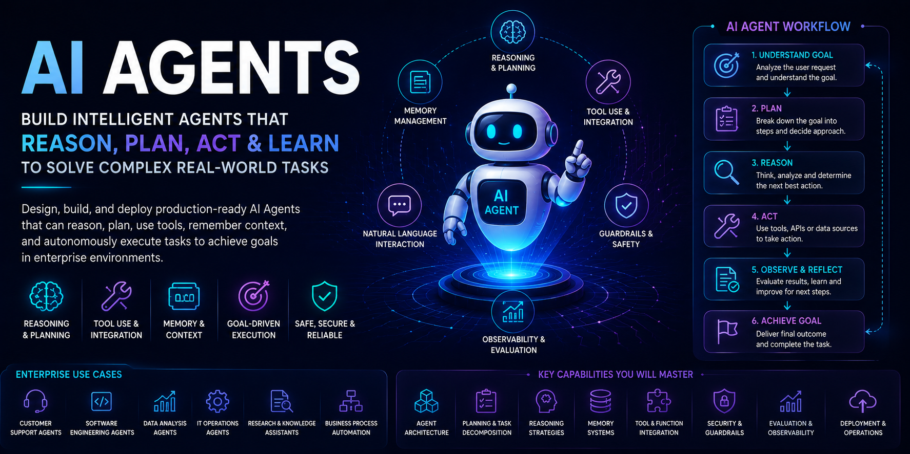

# Part VI — AI Agents

> Learn how intelligent AI Agents are designed, built, deployed, and operated to solve complex tasks using reasoning, planning, memory, tool integration, communication, observability, and security in enterprise environments.


---

## 📖 Overview

AI Agents represent the next evolution of intelligent software systems.

Unlike traditional AI applications that primarily generate responses, AI Agents can:

```text
Understand
   ↓
Reason
   ↓
Plan
   ↓
Use Tools
   ↓
Execute Actions
   ↓
Maintain State & Memory
   ↓
Observe Results
   ↓
Reflect
   ↓
Adapt
```

This module focuses on the engineering foundations required to build reliable AI Agent systems.

The learning journey progresses through:

```text
AI Agent Fundamentals
        ↓
Planning & Reasoning
        ↓
Tool Calling & Tool Engineering
        ↓
Agent Memory
        ↓
Agent Communication
        ↓
Agent Evaluation
        ↓
Agent Observability
        ↓
Agent Security
        ↓
Agent Deployment
        ↓
Enterprise AI Agent Architecture
```

The module is designed for:

- Software Engineers
- Backend Engineers
- Cloud Engineers
- AI Engineers
- Solution Architects
- Cloud AI Architects
- Enterprise Architects

The objective is to bridge the gap between:

```text
LLM Applications
       ↓
RAG Systems
       ↓
AI Agents
       ↓
Enterprise Agent Systems
```

The concepts developed here provide the foundation for **Part VII — Agentic AI & Multi-Agent Systems**, where the focus expands to autonomous multi-agent systems, collaboration, supervision, long-running agents, Agentic RAG, enterprise agent platforms, and agent communication protocols.

---

# 🎯 Learning Outcomes

After completing this module, you will be able to:

- Understand the architecture of modern AI Agents
- Understand how AI Agents differ from traditional LLM applications
- Design AI Agent systems around tools, memory, communication, and execution
- Design agents capable of planning and task decomposition
- Understand reasoning strategies used by AI Agents
- Apply reflection and self-correction patterns
- Understand Tool Calling and Function Calling
- Build and orchestrate tools for AI Agents
- Understand manual and framework-assisted tool calling
- Apply agent design best practices
- Design enterprise AI Agent architectures
- Understand different types of agent memory
- Design short-term and long-term memory
- Understand working, episodic, and semantic memory
- Design memory storage and retrieval patterns
- Apply memory compression and optimization strategies
- Understand communication between AI Agents
- Implement message-passing patterns
- Understand shared-memory communication
- Design event-driven agent architectures
- Apply publish-subscribe patterns
- Coordinate agents and agent-driven workflows
- Understand agent negotiation and conflict resolution
- Evaluate agent task completion and behavior
- Understand agent evaluation metrics and methodologies
- Design observable AI Agent systems
- Implement agent logging and tracing
- Monitor agent execution and behavior
- Define meaningful agent metrics
- Debug complex agent workflows
- Monitor agent cost
- Implement agent alerting
- Design secure AI Agent systems
- Protect agents against prompt injection
- Secure agent tools
- Implement agent authentication and authorization
- Manage secrets securely
- Protect enterprise data and privacy
- Apply agent sandboxing and guardrails
- Manage agent risk
- Understand AI Agent runtime and deployment architectures
- Design scalable and resilient agent deployments
- Build production-ready AI Agents using enterprise best practices

---

# 🛣️ Recommended Learning Path

This module is organized into six engineering areas.

```text
01 — AI Agent Fundamentals
             ↓
02 — Agent Memory
             ↓
03 — Agent Communication
             ↓
04 — Agent Observability
             ↓
05 — Agent Security
             ↓
06 — Agent Deployment
```

The recommended learning progression is:

```text
Understand the Agent
        ↓
Plan & Reason
        ↓
Use Tools
        ↓
Maintain Memory
        ↓
Communicate
        ↓
Reflect & Correct
        ↓
Evaluate
        ↓
Observe
        ↓
Secure
        ↓
Deploy
        ↓
Operate
```

---

# 🤖 01 — AI Agent Fundamentals

This section establishes the foundation for understanding how AI Agents work and how they can be engineered as intelligent software systems.

| Chapter | Status |
| --- | :---: |
| **[01. AI Agent Fundamentals](01-ai-agent-fundamentals/01-ai-agent-fundamentals.md)** | ✅ |
| **[02. Tool Calling & Function Calling](01-ai-agent-fundamentals/02-tool-calling-and-function-calling.md)** | ✅ |
| **[03. Building & Orchestrating Tools](01-ai-agent-fundamentals/03-building-and-orchestrating-tools.md)** | ✅ |
| **[04. ICL & Manual Tool Calling](01-ai-agent-fundamentals/04-icel-and-manual-tool-calling.md)** | ✅ |
| **[05. LangChain Built-in Agents](01-ai-agent-fundamentals/05-langchain-built-in-agents.md)** | ✅ |
| **[06. AI Agent Design Best Practices](01-ai-agent-fundamentals/06-ai-agent-design-best-practices.md)** | ✅ |
| **[07. Enterprise AI Agent Architecture](01-ai-agent-fundamentals/07-enterprise-ai-agent-architecture.md)** | ✅ |
| **[08. Planning & Task Decomposition](01-ai-agent-fundamentals/08-planning-and-task-decomposition.md)** | ✅ |
| **[09. Agent Reasoning](01-ai-agent-fundamentals/09-agent-reasoning.md)** | ✅ |
| **[10. Reflection & Self-Correction](01-ai-agent-fundamentals/10-reflection-and-self-correction.md)** | ✅ |

---

## Agent Fundamentals

The fundamental agent execution model can be represented as:

```text
                ┌──────────────┐
                │     Goal     │
                └──────┬───────┘
                       ↓
                ┌──────────────┐
                │   Reason     │
                └──────┬───────┘
                       ↓
                ┌──────────────┐
                │    Plan      │
                └──────┬───────┘
                       ↓
                ┌──────────────┐
                │ Select Tool  │
                └──────┬───────┘
                       ↓
                ┌──────────────┐
                │ Execute Tool │
                └──────┬───────┘
                       ↓
                ┌──────────────┐
                │    Observe   │
                └──────┬───────┘
                       ↓
                ┌──────────────┐
                │ Reflect /    │
                │ Self-Correct │
                └──────┬───────┘
                       │
                       └───────────────┐
                                       ↓
                                  Next Step
```

---

## Planning & Task Decomposition

Planning transforms a high-level goal into executable steps.

```text
Goal
 ↓
Task Analysis
 ↓
Task Decomposition
 ↓
Subtasks
 ↓
Execution Plan
 ↓
Tool / Action Selection
```

Planning establishes the bridge between:

```text
User Objective
      ↓
Agent Reasoning
      ↓
Executable Actions
```

---

## Agent Reasoning

Reasoning enables the agent to determine:

```text
What is the goal?
      ↓
What information is required?
      ↓
What actions are available?
      ↓
Which action should be performed?
      ↓
What should happen next?
```

The focus is on engineering reasoning behavior rather than exposing private chain-of-thought.

---

## Reflection & Self-Correction

Reflection allows an agent to evaluate intermediate results and determine whether corrective action is required.

```text
Plan
 ↓
Execute
 ↓
Observe
 ↓
Evaluate Result
 ↓
 ┌───────────────┐
 │               │
Correct       Incorrect
 │               │
 ↓               ↓
Continue      Re-plan
                 ↓
              Re-execute
```

This provides a foundation for more advanced autonomous behavior explored in Part VII.

---

# 🧠 02 — Agent Memory

AI Agents require mechanisms for maintaining information across steps and, depending on the use case, across sessions.

This section explores different memory models and production memory engineering patterns.

| Chapter | Status |
| --- | :---: |
| **[01. Agent Memory Overview](02-agent-memory/01-agent-memory-overview.md)** | ✅ |
| **[02. Short-Term Memory](02-agent-memory/02-short-term-memory.md)** | ✅ |
| **[03. Long-Term Memory](02-agent-memory/03-long-term-memory.md)** | ✅ |
| **[04. Working Memory](02-agent-memory/04-working-memory.md)** | ✅ |
| **[05. Episodic Memory](02-agent-memory/05-episodic-memory.md)** | ✅ |
| **[06. Semantic Memory](02-agent-memory/06-semantic-memory.md)** | ✅ |
| **[07. Memory Storage Patterns](02-agent-memory/07-memory-storage-patterns.md)** | ✅ |
| **[08. Memory Retrieval Patterns](02-agent-memory/08-memory-retrieval-patterns.md)** | ✅ |
| **[09. Memory Compression](02-agent-memory/09-memory-compression.md)** | ✅ |
| **[10. Memory Optimization](02-agent-memory/10-memory-optimization.md)** | ✅ |

---

## Agent Memory Architecture

```text
                    AI Agent
                       │
          ┌────────────┼────────────┐
          ↓            ↓            ↓
    Working Memory  Short-Term   Long-Term
                       │            │
                       └─────┬──────┘
                             ↓
                       Memory Store
                             │
                             ↓
                      Memory Retrieval
                             │
                             ↓
                           Agent
```

---

## Memory Types

The module covers:

```text
Short-Term Memory
        ↓
Working Memory
        ↓
Episodic Memory
        ↓
Semantic Memory
        ↓
Long-Term Memory
```

These memory types address different requirements around:

- Current task state
- Conversation context
- Previous interactions
- Learned information
- Persistent knowledge

---

## Production Memory Engineering

The later chapters focus on:

```text
Memory Storage
      ↓
Memory Retrieval
      ↓
Memory Compression
      ↓
Memory Optimization
```

This moves memory from a conceptual feature into an engineering component of an AI Agent platform.

---

# 🔗 03 — Agent Communication

As AI systems become more sophisticated, agents may need to communicate with other agents and services.

This section introduces communication patterns that form the foundation for more advanced multi-agent systems.

| Chapter | Status |
| --- | :---: |
| **[01. Agent Communication Overview](03-agent-communication/01-agent-communication-overview.md)** | ✅ |
| **[02. Message Passing](03-agent-communication/02-message-passing.md)** | ✅ |
| **[03. Shared Memory](03-agent-communication/03-shared-memory.md)** | ✅ |
| **[04. Event-Driven Agents](03-agent-communication/04-event-driven-agents.md)** | ✅ |
| **[05. Publish-Subscribe Pattern](03-agent-communication/05-publish-subscribe-pattern.md)** | ✅ |
| **[06. Agent Coordination](03-agent-communication/06-agent-coordination.md)** | ✅ |
| **[07. Agent Negotiation](03-agent-communication/07-agent-negotiation.md)** | ✅ |
| **[08. Conflict Resolution](03-agent-communication/08-conflict-resolution.md)** | ✅ |

---

## Agent Communication Model

```text
                 Agent A
                    │
                    │ Message
                    ▼
              Communication
                 Layer
                    │
        ┌───────────┼───────────┐
        ▼           ▼           ▼
    Agent B      Agent C      Service
        │           │           │
        └───────────┼───────────┘
                    ▼
                 Results
```

---

## Communication Patterns

The section covers:

```text
Message Passing
      ↓
Shared Memory
      ↓
Event-Driven Communication
      ↓
Publish / Subscribe
      ↓
Agent Coordination
      ↓
Agent Negotiation
      ↓
Conflict Resolution
```

These patterns provide the communication foundation for the more advanced **Multi-Agent Systems** covered in Part VII.

---

# 📊 04 — Agent Observability

Production AI Agents are dynamic systems.

Unlike conventional request-response applications, an agent may perform multiple reasoning steps, tool calls, retries, state transitions, and decisions before producing a final result.

This makes observability a core architectural capability.

| Chapter | Status |
| --- | :---: |
| **[01. Agent Observability Overview](04-agent-observability/01-agent-observability-overview.md)** | ✅ |
| **[02. Agent Logging](04-agent-observability/02-agent-logging.md)** | ✅ |
| **[03. Agent Tracing](04-agent-observability/03-agent-tracing.md)** | ✅ |
| **[04. Agent Monitoring](04-agent-observability/04-agent-monitoring.md)** | ✅ |
| **[05. Agent Metrics](04-agent-observability/05-agent-metrics.md)** | ✅ |
| **[06. Agent Debugging](04-agent-observability/06-agent-debugging.md)** | ✅ |
| **[07. Agent Evaluation Metrics](04-agent-observability/07-agent-evaluation-metrics.md)** | ✅ |
| **[08. Agent Cost Monitoring](04-agent-observability/08-agent-cost-monitoring.md)** | ✅ |
| **[09. Agent Alerting](04-agent-observability/09-agent-alerting.md)** | ✅ |
| **[10. Agent Evaluation](04-agent-observability/10-agent-evaluation.md)** | ✅ |

---

## Agent Observability Architecture

```text
                    Agent Request
                         │
                         ▼
                  Agent Execution
                         │
        ┌────────────────┼────────────────┐
        ▼                ▼                ▼
      Logs            Traces           Metrics
        │                │                │
        └────────────────┼────────────────┘
                         ▼
                  Observability
                     Platform
                         │
        ┌────────────────┼────────────────┐
        ▼                ▼                ▼
     Monitoring       Debugging        Alerting
                         │
                         ▼
                    Evaluation
```

---

## Agent Telemetry

Important observability dimensions include:

```text
Agent Runs
    ↓
Reasoning Steps
    ↓
Tool Calls
    ↓
Tool Results
    ↓
State Changes
    ↓
Retries
    ↓
Latency
    ↓
Token Usage
    ↓
Cost
    ↓
Errors
```

The objective is to make agent behavior:

```text
Visible
    ↓
Understandable
    ↓
Debuggable
    ↓
Measurable
    ↓
Operable
```

---

# 🔐 05 — Agent Security

AI Agents introduce a new security boundary because they can reason, access tools, retrieve information, maintain memory, and potentially execute actions.

This section focuses on securing agents throughout their lifecycle.

| Chapter | Status |
| --- | :---: |
| **[01. Agent Security Overview](05-agent-security/01-agent-security-overview.md)** | ✅ |
| **[02. Prompt Injection](05-agent-security/02-prompt-injection.md)** | ✅ |
| **[03. Tool Security](05-agent-security/03-tool-security.md)** | ✅ |
| **[04. Agent Authentication](05-agent-security/04-agent-authentication.md)** | ✅ |
| **[05. Agent Authorization](05-agent-security/05-agent-authorization.md)** | ✅ |
| **[06. Secrets Management](05-agent-security/06-secrets-management.md)** | ✅ |
| **[07. Data Privacy](05-agent-security/07-data-privacy.md)** | ✅ |
| **[08. Agent Sandboxing](05-agent-security/08-agent-sandboxing.md)** | ✅ |
| **[09. Agent Guardrails](05-agent-security/09-agent-guardrails.md)** | ✅ |
| **[10. Agent Risk Management](05-agent-security/10-agent-risk-management.md)** | ✅ |

---

## Agent Security Boundary

```text
User
 ↓
Identity
 ↓
Authentication
 ↓
Authorization
 ↓
Agent
 ↓
Policy / Guardrails
 ↓
Tool Authorization
 ↓
Tool Execution
 ↓
Enterprise System
```

Security must therefore be applied across:

```text
Identity
   +
Agent
   +
Tools
   +
Memory
   +
Data
   +
Execution
```

---

## Security Topics

The section covers:

- Agent security architecture
- Prompt injection
- Tool security
- Authentication
- Authorization
- Secrets management
- Data privacy
- Sandboxing
- Guardrails
- Risk management

The objective is to build agents that are not only capable, but also:

```text
Secure
Controlled
Auditable
Governed
Resilient
```

---

# 🚀 06 — Agent Deployment

AI Agents must ultimately run as reliable production software.

This section focuses on the runtime and deployment engineering required to move agents from development environments into production.

| Chapter | Status |
| --- | :---: |
| **[01. Agent Deployment Overview](06-agent-deployment/01-agent-deployment-overview.md)** | ✅ |
| **[02. Agent Runtime & Execution](06-agent-deployment/02-agent-runtime-and-execution.md)** | ✅ |
| **[03. Agent Scaling & Resilience](06-agent-deployment/03-agent-scaling-and-resilience.md)** | ✅ |
| **[04. Production Agent Deployment](06-agent-deployment/04-production-agent-deployment.md)** | ✅ |

---

## Agent Deployment Architecture

```text
                    Client
                      │
                      ▼
                API Gateway
                      │
                      ▼
                Agent Service
                      │
          ┌───────────┼───────────┐
          ▼           ▼           ▼
       Memory       Tools        LLM
       Service      Services     Gateway
          │           │           │
          └───────────┼───────────┘
                      ▼
                Agent Runtime
                      │
          ┌───────────┼───────────┐
          ▼           ▼           ▼
       Logging      Metrics      Tracing
```

---

## Agent Runtime

The runtime is responsible for executing the agent loop:

```text
Receive Task
     ↓
Load State
     ↓
Plan
     ↓
Reason
     ↓
Select Action
     ↓
Execute Tool
     ↓
Observe Result
     ↓
Update State
     ↓
Continue / Complete
```

---

## Scaling & Resilience

Production agents must account for:

- Concurrent requests
- Long-running executions
- Tool latency
- LLM latency
- Retry behavior
- Timeouts
- Failure recovery
- Horizontal scaling
- Queue-based execution
- Backpressure
- Rate limiting
- Resource isolation

The goal is:

```text
Agent Capability
      +
Reliability
      +
Scalability
      +
Resilience
```

---

# 🏢 Enterprise AI Agent Architecture

The concepts across all six sections come together into an enterprise agent architecture.

```text
                         User
                           │
                           ▼
                    API / Agent Gateway
                           │
                           ▼
                    Authentication
                           │
                           ▼
                    Authorization
                           │
                           ▼
                      AI Agent
                           │
          ┌────────────────┼────────────────┐
          ▼                ▼                ▼
       Planning          Memory           Tools
          │                │                │
          └────────────────┼────────────────┘
                           ▼
                  Agent Communication
                           │
                           ▼
                    Agent Execution
                           │
             ┌─────────────┼─────────────┐
             ▼             ▼             ▼
          Logging        Tracing       Metrics
             │             │             │
             └─────────────┼─────────────┘
                           ▼
                    Observability
                           │
                           ▼
                     Evaluation
                           │
                           ▼
                      Guardrails
                           │
                           ▼
                     Agent Runtime
                           │
                           ▼
                  Enterprise Systems
```

---

# 🧩 Part VI Capability Map

```mermaid
flowchart TD

    A["AI Agent"] --> B["Fundamentals"]
    A --> C["Memory"]
    A --> D["Communication"]
    A --> E["Observability"]
    A --> F["Security"]
    A --> G["Deployment"]

    B --> B1["Planning"]
    B --> B2["Reasoning"]
    B --> B3["Tool Calling"]
    B --> B4["Function Calling"]
    B --> B5["Reflection"]
    B --> B6["Self-Correction"]
    B --> B7["Agent Architecture"]

    C --> C1["Short-Term"]
    C --> C2["Long-Term"]
    C --> C3["Working"]
    C --> C4["Episodic"]
    C --> C5["Semantic"]
    C --> C6["Storage"]
    C --> C7["Retrieval"]
    C --> C8["Compression"]

    D --> D1["Message Passing"]
    D --> D2["Shared Memory"]
    D --> D3["Event Driven"]
    D --> D4["Publish / Subscribe"]
    D --> D5["Coordination"]
    D --> D6["Negotiation"]
    D --> D7["Conflict Resolution"]

    E --> E1["Logging"]
    E --> E2["Tracing"]
    E --> E3["Monitoring"]
    E --> E4["Metrics"]
    E --> E5["Debugging"]
    E --> E6["Evaluation"]
    E --> E7["Cost Monitoring"]
    E --> E8["Alerting"]

    F --> F1["Prompt Injection"]
    F --> F2["Tool Security"]
    F --> F3["Authentication"]
    F --> F4["Authorization"]
    F --> F5["Secrets"]
    F --> F6["Privacy"]
    F --> F7["Sandboxing"]
    F --> F8["Guardrails"]
    F --> F9["Risk Management"]

    G --> G1["Agent Runtime"]
    G --> G2["Execution"]
    G --> G3["Scaling"]
    G --> G4["Resilience"]
    G --> G5["Production Deployment"]
```



---

# 🔄 AI Agent Engineering Lifecycle

```text
Design
  ↓
Build
  ↓
Plan
  ↓
Reason
  ↓
Integrate Tools
  ↓
Add Memory
  ↓
Communicate
  ↓
Reflect / Correct
  ↓
Evaluate
  ↓
Secure
  ↓
Observe
  ↓
Deploy
  ↓
Operate
  ↓
Improve
```

This lifecycle establishes the engineering mindset required for production AI Agents.

---

# 🧠 Relationship with RAG

Part V focuses primarily on **knowledge retrieval and grounded generation**.

Part VI introduces agents that can use those capabilities as part of a larger execution loop.

```text
                  Part V
              Advanced RAG
                   │
                   ▼
             Retrieval / RAG
                   │
                   ▼
                AI Agent
                   │
        ┌──────────┼──────────┐
        ▼          ▼          ▼
      Tools      Memory     APIs
        │          │          │
        └──────────┼──────────┘
                   ▼
              Agent Action
```

More advanced **Agentic RAG** is intentionally explored in **Part VII — Agentic AI & Multi-Agent Systems**.

---

# 🚀 From AI Agents to Agentic AI

Part VI focuses on the engineering foundations of individual AI Agents.

The next progression is:

```text
Part VI
AI Agents
      ↓
Part VII
Agentic AI
      ↓
Multi-Agent Systems
      ↓
Supervisor Patterns
      ↓
Hierarchical Agents
      ↓
Collaborative Agents
      ↓
Long-Running Agents
      ↓
Agentic RAG
      ↓
Enterprise Agent Platforms
      ↓
Agent Communication Protocols
```

Part VII will extend the concepts learned here into larger autonomous systems.

Protocols such as **A2A and other agent communication protocols** belong to Part VII and are intentionally excluded from Part VI.

---

# 📚 What This Module Establishes

By completing Part VI, you will have developed the foundations required to understand:

```text
AI Agent Fundamentals
        ↓
Planning & Reasoning
        ↓
Tool Integration
        ↓
Agent Memory
        ↓
Agent Communication
        ↓
Reflection & Self-Correction
        ↓
Agent Evaluation
        ↓
Agent Observability
        ↓
Agent Security
        ↓
Agent Deployment
        ↓
Enterprise AI Agent Architecture
```

This provides the foundation for building more advanced:

```text
Agentic AI
Multi-Agent Systems
Autonomous Workflows
Agentic RAG
Enterprise Agent Platforms
Agent Communication Protocols
```

---

# 🧭 Part VI Architecture

The complete learning architecture is:

```text
                 PART VI — AI AGENTS

                         AI Agent
                            │
          ┌─────────────────┼─────────────────┐
          ▼                 ▼                 ▼
      Fundamentals        Memory        Communication
          │                 │                 │
          ▼                 ▼                 ▼
    Planning &          Memory Store    Agent Messaging
     Reasoning               │                 │
          │                  │                 │
          └──────────────────┼─────────────────┘
                             ▼
                       Agent Runtime
                             │
                    ┌────────┴────────┐
                    ▼                 ▼
               Evaluation        Observability
                    │                 │
                    └────────┬────────┘
                             ▼
                          Security
                             │
                             ▼
                         Deployment
                             │
                             ▼
                  Enterprise Architecture
```

---

# 🔗 Part V → Part VI → Part VII

The broader architecture of the handbook is:

```text
Part V
Advanced Retrieval-Augmented Generation
              │
              ▼
        Grounded Knowledge
              │
              ▼
Part VI
AI Agents
              │
              ▼
       Intelligent Execution
              │
              ▼
Part VII
Agentic AI & Multi-Agent Systems
              │
              ▼
      Autonomous Collaboration
              │
              ▼
Part VIII
AI Engineering Frameworks & Tooling
              │
              ▼
       Framework Implementations
```

---

# 🧭 Chapter Navigation

**Previous Part:**  
[Part V — Advanced Retrieval-Augmented Generation](../05-advanced-rag/)

**Current Part:**  
**Part VI — AI Agents**

**Next Part:**  
[Part VII — Agentic AI & Multi-Agent Systems](../07-agentic-ai/)

---

# 🚀 Start Learning

Begin with:

**[01. AI Agent Fundamentals](01-ai-agent-fundamentals/01-ai-agent-fundamentals.md)**

Then progress through:

```text
01 — AI Agent Fundamentals
          ↓
02 — Agent Memory
          ↓
03 — Agent Communication
          ↓
04 — Agent Observability
          ↓
05 — Agent Security
          ↓
06 — Agent Deployment
```

The final destination is:

> **Designing AI Agents that can reason, plan, use tools, maintain memory, communicate, reflect, self-correct, be evaluated, operate securely, and run reliably as enterprise software systems.**

---

> **Enterprise AI Engineering Handbook**  
> *Building Production-Grade Enterprise AI Systems — One Chapter at a Time.*