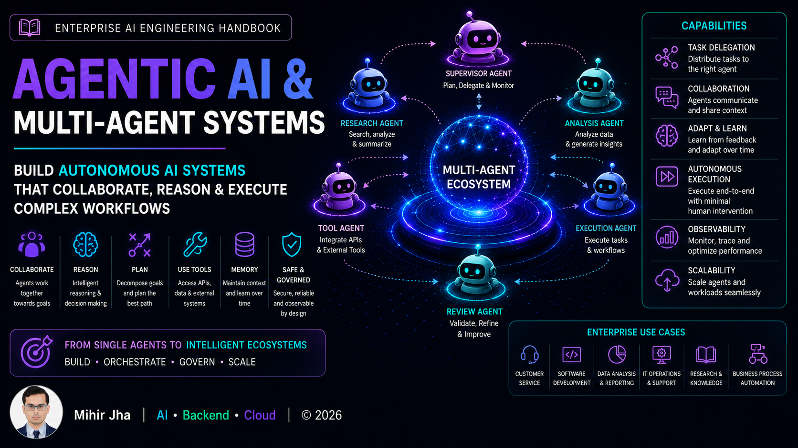

# Part VII — Agentic AI & Multi-Agent Systems

> Design, orchestrate, and deploy autonomous AI systems that collaborate, reason, plan, and execute complex workflows across enterprise environments.

---

## 📖 Overview

Agentic AI represents the next generation of Enterprise AI systems, where multiple intelligent agents collaborate to solve complex, long-running, and dynamic business problems with minimal human intervention.

Unlike individual AI Agents, Agentic AI systems consist of multiple specialized agents that communicate, coordinate, reason, delegate tasks, and continuously improve their execution through planning, reflection, and feedback loops.

This module provides a production-focused introduction to Agentic AI and Multi-Agent Systems, covering collaborative agent architectures, orchestration strategies, communication protocols, workflow automation, governance, observability, security, and enterprise deployment patterns.

Designed for software engineers, backend developers, cloud engineers, solution architects, and AI engineers, this module prepares you to design scalable, autonomous, and production-ready AI systems capable of operating across enterprise applications.

---

## 🎯 Learning Outcomes

After completing this module, you will be able to:

- Understand the principles of Agentic AI
- Differentiate AI Agents from Agentic AI systems
- Design collaborative Multi-Agent architectures
- Implement agent orchestration strategies
- Build supervisor, hierarchical, and swarm-based agent systems
- Design Human-in-the-Loop (HITL) workflows
- Understand Agent-to-Agent (A2A) communication
- Build long-running autonomous workflows
- Apply governance, security, and observability to Agentic AI systems
- Design and deploy enterprise-grade Multi-Agent platforms

---

## 🚧 Module Status

> **Status:** 🚧 **Under Active Development**

The roadmap for this module has been finalized, and content is currently being developed.

Each chapter will include:

- 📖 Production-focused explanations
- 🏗️ Enterprise architecture diagrams
- 💻 Hands-on implementation examples
- ⚡ Best practices & optimization techniques
- ⚠️ Common pitfalls & troubleshooting guidance
- ❓ Interview questions
- 📝 Quick revision notes
- 📚 References & further reading

New chapters will be published regularly as the handbook evolves.

---

> **Enterprise AI Engineering Handbook**  
> *Building Production-Grade Enterprise AI Systems — One Chapter at a Time.*