# 01 — LangChain Fundamentals

> Understand LangChain as a modern AI application framework for building LLM-powered applications and Agents, and learn how its abstractions fit into production-grade Enterprise AI architectures.

---

## 📖 Overview

Large Language Model applications often begin with a simple model invocation:

```text
Application
    ↓
LLM API
    ↓
Response
```

Production AI applications quickly become more complex.

They may require:

```text
Models
   +
Prompts
   +
Structured Outputs
   +
Tools
   +
Retrieval
   +
Memory
   +
Agents
   +
State
   +
Observability
   +
Guardrails
   +
Enterprise APIs
```

Managing these capabilities independently can result in duplicated integration code and tightly coupled application logic.

LangChain provides a framework layer for composing these capabilities into AI applications and Agents.

The current LangChain architecture provides:

- Model integrations
- Tool integrations
- Agent abstractions
- Structured output
- Middleware
- Retrieval integrations
- Application composition
- Integration with the broader LangGraph runtime
- Integration with LangSmith for tracing and evaluation

The objective of this chapter is not simply to learn LangChain APIs.

The goal is to understand:

```text
What LangChain provides
        ↓
What abstractions it introduces
        ↓
How those abstractions work
        ↓
Where LangChain fits in an Enterprise AI architecture
        ↓
When to use it
        ↓
When not to use it
```

---

# 🎯 Learning Objectives

After completing this chapter, you will be able to:

- Understand what LangChain is
- Understand why AI application frameworks are needed
- Understand LangChain's core architecture
- Understand LangChain's major abstractions
- Understand model integration
- Understand message and prompt handling
- Understand tools and tool calling
- Understand structured output
- Understand retrieval integration
- Understand Agent execution at a high level
- Understand middleware
- Understand LangChain's relationship with LangGraph
- Understand LangChain's relationship with LangSmith
- Build a basic LangChain application
- Design a production-oriented LangChain architecture
- Identify common LangChain mistakes
- Understand when LangChain is appropriate
- Understand when direct provider SDKs may be preferable

---

# 1. What Is LangChain?

LangChain is an open-source framework for building applications and Agents powered by Large Language Models.

At a high level:

```text
LangChain
    │
    ├── Models
    ├── Tools
    ├── Prompts / Messages
    ├── Structured Output
    ├── Retrieval
    ├── Agents
    └── Middleware
```

The framework provides integrations and abstractions that allow developers to compose these capabilities into applications.

A simplified view:

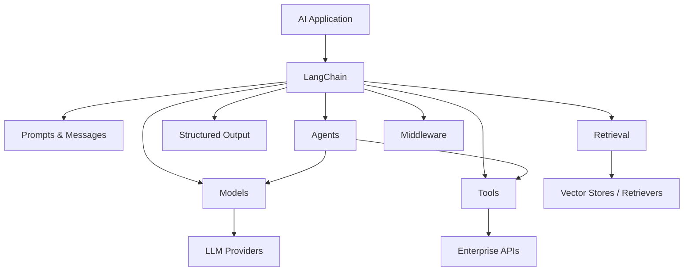

---

# 2. Why Do We Need AI Frameworks?

A simple LLM application may look like:

```text
Application
    ↓
Provider SDK
    ↓
Model
```

As functionality increases:

```text
Application
    ↓
Prompt Management
    ↓
Model
    ↓
Tool Calling
    ↓
Database
    ↓
Retrieval
    ↓
Model
    ↓
Structured Output
    ↓
Validation
```

The application starts accumulating infrastructure-specific code.

For example:

```python
response = client.responses.create(
    model="...",
    input="..."
)
```

Then:

```python
if tool_call:
    execute_tool()

if retrieval_required:
    search_vector_store()

if response_invalid:
    retry()

if context_too_large:
    compress_context()
```

Eventually the application becomes tightly coupled to implementation details.

Frameworks attempt to provide reusable abstractions around these recurring patterns.

---

# 3. AI Framework vs Provider SDK

This distinction is important.

A provider SDK generally provides direct access to a specific AI provider.

```text
Application
    ↓
Provider SDK
    ↓
Provider
    ↓
Model
```

An AI framework provides a higher-level application abstraction.

```text
Application
    ↓
AI Framework
    ↓
Provider Adapter
    ↓
Provider SDK
    ↓
Model
```

Conceptually:

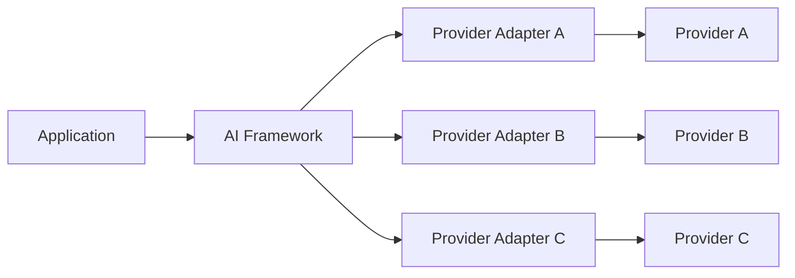

This can make provider changes easier, but introduces another abstraction layer.

That trade-off becomes important in production architectures.

---

# 4. LangChain's Role

LangChain can sit between the application and the underlying AI infrastructure.

```text
Enterprise Application
        ↓
Application Services
        ↓
LangChain
        ↓
AI / Data / Tool Integrations
        ↓
Infrastructure
```

A more complete architecture:

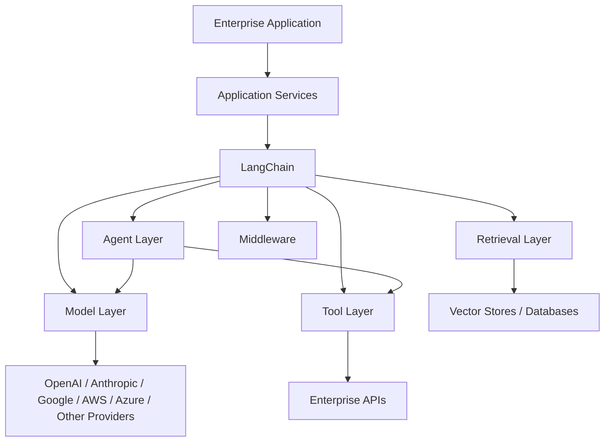

---

# 5. LangChain Is Not the Model

A common misconception is:

> LangChain is an AI model.

It is not.

The relationship is:

```text
LangChain
    ↓
Model Integration
    ↓
LLM Provider
    ↓
Model
```

For example:

```text
LangChain
    ↓
Chat Model Integration
    ↓
OpenAI
    ↓
GPT Model
```

or:

```text
LangChain
    ↓
Chat Model Integration
    ↓
Anthropic
    ↓
Claude Model
```

---

# 6. LangChain Is Not a Vector Database

Similarly:

```text
LangChain ≠ Vector Database
```

Instead:

```text
LangChain
    ↓
Vector Store Integration
    ↓
FAISS / Chroma / Milvus / Pinecone / etc.
```

The framework can integrate with retrieval infrastructure.

The actual storage system remains a separate component.

---

# 7. LangChain Is Not an LLM Provider

The distinction:

```text
LangChain
    = Application Framework

OpenAI / Anthropic / Google
    = AI Providers

GPT / Claude / Gemini
    = Models
```

This separation is important when designing enterprise architectures.

---

# 8. Core LangChain Concepts

At a high level, LangChain applications can be built from several reusable capabilities.

```text
Model
Prompt / Messages
Tool
Retriever
Structured Output
Agent
Middleware
State
```

Conceptually:

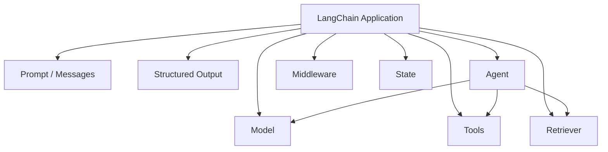

---

# 9. Models

The model is responsible for generating or transforming information.

Conceptually:

```text
Input
  ↓
Model
  ↓
Output
```

Example:

```python
from langchain_openai import ChatOpenAI

model = ChatOpenAI(
    model="your-model"
)

response = model.invoke(
    "Explain microservices architecture."
)

print(response.content)
```

The exact model and provider package depend on the provider being used.

---

# 10. Provider Integrations

Modern LangChain integrations are distributed across provider-specific packages.

For example, conceptually:

```text
LangChain
    │
    ├── OpenAI Integration
    ├── Anthropic Integration
    ├── Google Integration
    ├── AWS Integration
    ├── Azure Integration
    └── Other Integrations
```

This separation allows provider integrations to evolve independently.

Example installation:

```bash
pip install -U langchain
pip install -U langchain-openai
```

For another provider:

```bash
pip install -U langchain-anthropic
```

---

# 11. Basic Model Invocation

A minimal application:

```python
from langchain_openai import ChatOpenAI

model = ChatOpenAI(
    model="your-model"
)

response = model.invoke(
    "What is Retrieval-Augmented Generation?"
)

print(response.content)
```

Execution flow:

```text
Application
    ↓
LangChain Model Abstraction
    ↓
Provider Integration
    ↓
Provider API
    ↓
LLM
    ↓
Response
```

---

# 12. Message-Based Interaction

Modern chat models work with messages rather than only plain strings.

Typical message roles include:

```text
System
Human
AI
Tool
```

Conceptually:

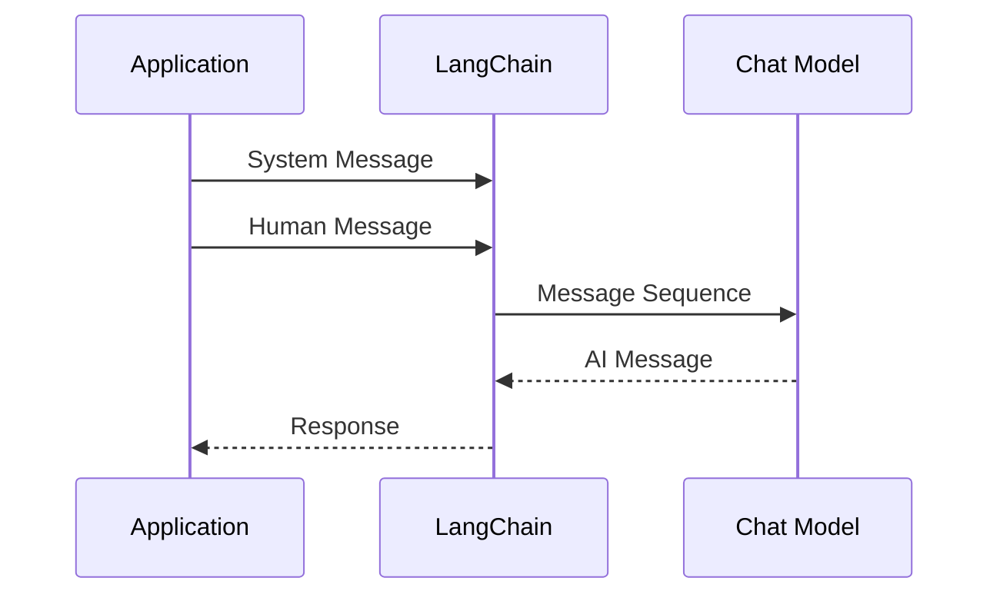

Example:

```python
from langchain_core.messages import SystemMessage, HumanMessage
from langchain_openai import ChatOpenAI

model = ChatOpenAI(
    model="your-model"
)

messages = [
    SystemMessage(
        content="You are an enterprise architecture assistant."
    ),
    HumanMessage(
        content="Explain event-driven architecture."
    ),
]

response = model.invoke(messages)

print(response.content)
```

---

# 13. Prompts

Prompts define the instructions and context provided to the model.

A simple prompt:

```text
Explain:
{topic}
```

A production application may use:

```text
System Instructions
+
User Input
+
Retrieved Context
+
Application State
+
Tool Results
```

Conceptually:

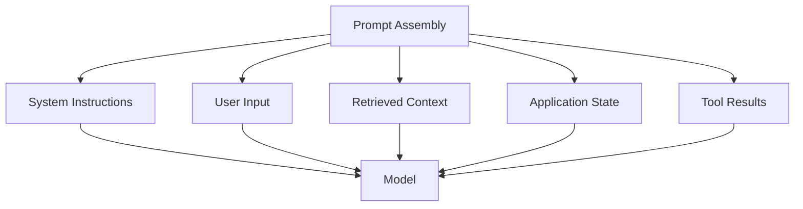

---

# 14. Structured Prompt Templates

Prompt templates allow applications to reuse prompt structures.

Conceptually:

```python
from langchain_core.prompts import ChatPromptTemplate

prompt = ChatPromptTemplate.from_messages([
    (
        "system",
        "You are an enterprise AI architect."
    ),
    (
        "human",
        "Explain {topic} for a backend engineer."
    ),
])

messages = prompt.invoke({
    "topic": "event-driven architecture"
})

print(messages)
```

The important architectural concept is:

```text
Static Prompt Structure
        +
Dynamic Variables
        ↓
Runtime Prompt
```

---

# 15. Tools

Tools extend what an Agent can do.

A tool can represent:

```text
Function
API
Database Query
Search
Calculation
Enterprise Service
File Operation
```

Conceptually:

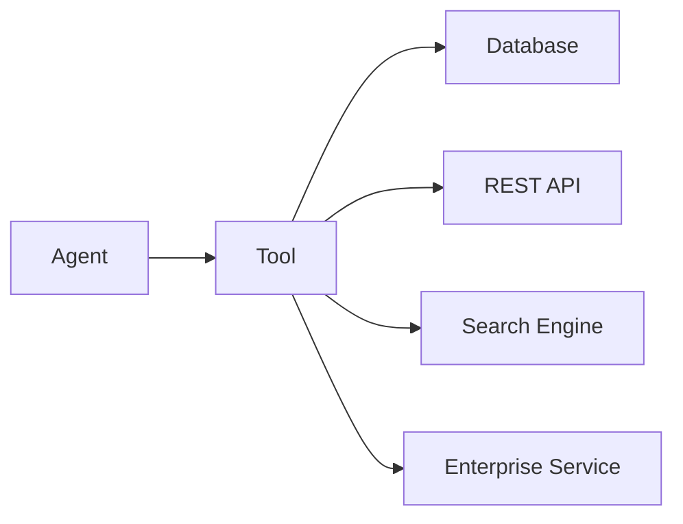

---

# 16. Creating a Tool

A basic tool can be created using the `@tool` decorator.

```python
from langchain.tools import tool

@tool
def calculate_tax(amount: float, rate: float) -> float:
    """Calculate tax for an amount using the supplied rate."""
    return amount * rate
```

The tool exposes:

```text
Name
Description
Input Schema
Function
```

The function's description is important because the model uses tool metadata to understand when and how the tool should be used.

---

# 17. Tool Schema

A tool can have structured inputs.

Example:

```python
from langchain.tools import tool

@tool
def get_customer(
    customer_id: str,
) -> str:
    """Retrieve customer information by customer ID."""
    return f"Customer: {customer_id}"
```

Conceptual representation:

```text
Tool
 │
 ├── Name
 ├── Description
 ├── Input Schema
 └── Execution Logic
```

---

# 18. Tool Calling

The model does not necessarily execute the tool itself.

The flow is:

```text
User
 ↓
Model
 ↓
Tool Call
 ↓
Application / Runtime
 ↓
Tool
 ↓
Tool Result
 ↓
Model
 ↓
Final Response
```

Architecture:

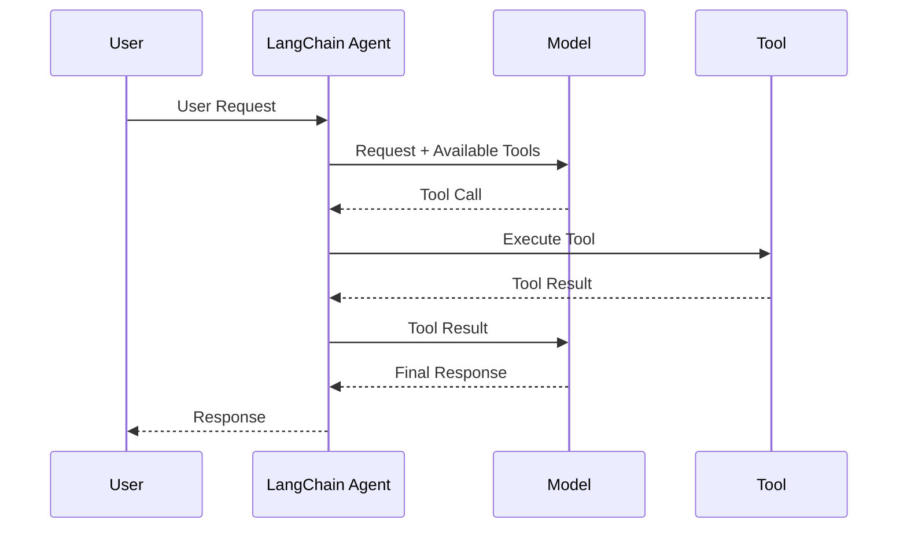

---

# 19. Retrieval

LangChain can integrate with retrieval systems.

A simplified RAG architecture:

```text
Documents
    ↓
Chunking
    ↓
Embeddings
    ↓
Vector Store
    ↓
Retriever
    ↓
Relevant Context
    ↓
Model
    ↓
Answer
```

Architecture:

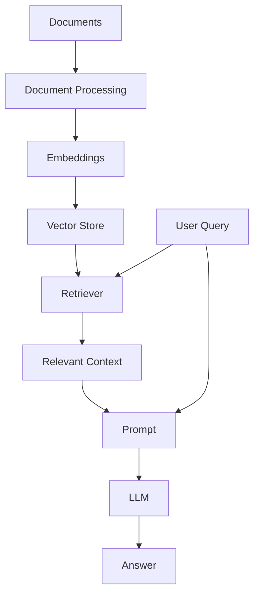

Part V of this handbook already covers Production RAG Engineering in depth.

Therefore, in Part VIII, the emphasis is on **how LangChain implements and integrates retrieval**, rather than re-teaching RAG architecture from scratch.

---

# 20. Structured Output

LLMs often return natural language.

Enterprise applications frequently require structured responses.

For example:

```json
{
  "customer_id": "C123",
  "risk_level": "HIGH",
  "reason": "Multiple failed payment attempts"
}
```

Structured output allows the application to work with predictable schemas.

Conceptual flow:

```text
User Input
    ↓
Model
    ↓
Structured Output
    ↓
Schema Validation
    ↓
Application
```

---

# 21. Why Structured Output Matters

Without structured output:

```text
LLM
 ↓
Free-form text
 ↓
Parsing
 ↓
Potential errors
```

With structured output:

```text
LLM
 ↓
Schema
 ↓
Validated Object
 ↓
Application Logic
```

This is especially useful for:

- APIs
- Database operations
- Workflow routing
- Classification
- Decision support
- Enterprise integrations

---

# 22. Agents

LangChain provides a high-level Agent abstraction.

An Agent combines:

```text
Model
+
Tools
+
Execution Loop
```

Conceptually:

```text
User Goal
    ↓
Agent
    ↓
Model
    ↓
Decision
    ↓
Tool
    ↓
Observation
    ↓
Model
    ↓
Decision
    ↓
Final Response
```

---

# 23. Agent Loop

A simplified Agent loop:

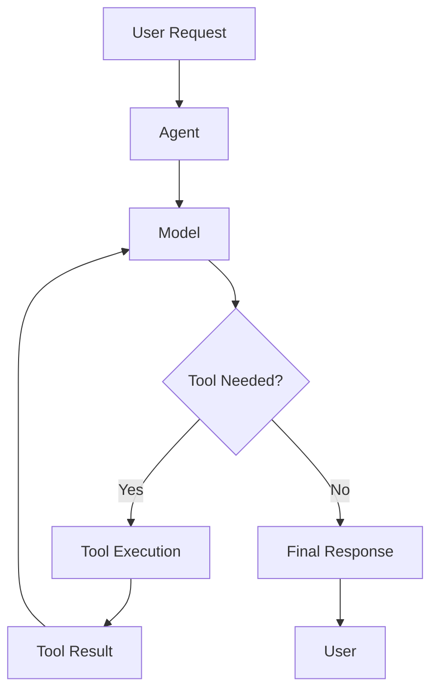

The current LangChain Agent implementation uses a graph-based runtime built on LangGraph.

This is an important architectural relationship:

```text
LangChain Agent API
        ↓
LangGraph Runtime
```

---

# 24. Creating a Basic Agent

A current LangChain Agent can be created using `create_agent`.

Example:

```python
from langchain.agents import create_agent

def get_weather(city: str) -> str:
    """Get weather information for a city."""
    return f"The weather in {city} is sunny."

agent = create_agent(
    model="your-model",
    tools=[get_weather],
)

result = agent.invoke({
    "messages": [
        {
            "role": "user",
            "content": "What is the weather in Kolkata?"
        }
    ]
})

print(result)
```

The exact model configuration depends on the provider integration.

---

# 25. Agent Execution Model

A simplified execution model:

```text
                    ┌─────────────┐
                    │ User Input  │
                    └──────┬──────┘
                           ↓
                    ┌─────────────┐
                    │    Model    │
                    └──────┬──────┘
                           ↓
                    Tool Required?
                       /       \
                     Yes       No
                     ↓          ↓
                Tool Call     Final
                     ↓        Response
                Tool Result
                     ↓
                   Model
```

The model and tools form the basic Agent loop.

---

# 26. Middleware

Middleware provides an extension point for controlling Agent execution.

Middleware can be used for:

```text
Logging
Analytics
Debugging
Prompt Transformation
Tool Selection
Output Formatting
Retries
Fallbacks
Rate Limits
Guardrails
PII Detection
Human Approval
Early Termination
```

Architecture:

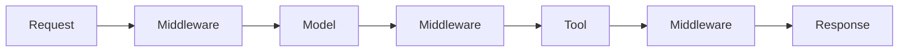

---

# 27. Middleware Execution

Conceptually:

```text
Request
   ↓
before_agent
   ↓
before_model
   ↓
Model
   ↓
after_model
   ↓
Tool Execution
   ↓
after_agent
   ↓
Response
```

Middleware can therefore provide cross-cutting runtime behavior without putting all of that logic directly into Agent business logic.

---

# 28. Example Middleware Concept

A simplified custom middleware concept:

```python
from langchain.agents.middleware import AgentMiddleware

class LoggingMiddleware(AgentMiddleware):

    def before_model(self, state, runtime):
        print("Calling model")
        return None

    def after_model(self, state, runtime):
        print("Model call completed")
        return None
```

The exact middleware API should be implemented according to the current LangChain version and hook being used.

---

# 29. Built-In Middleware Capabilities

Current LangChain middleware capabilities include patterns such as:

```text
Summarization
Human-in-the-Loop
Model Call Limits
Tool Call Limits
Model Fallback
PII Detection
Task / To-Do Support
```

These capabilities are particularly relevant to production Agent systems.

---

# 30. Context Engineering

Agent applications must control what context reaches the model.

Potential context:

```text
Conversation History
+
User Information
+
Retrieved Documents
+
Tool Results
+
Application State
+
System Instructions
```

Too much context can increase:

```text
Latency
Token Usage
Cost
Noise
```

Therefore:

```text
Context Selection
        ↓
Context Transformation
        ↓
Context Delivery
```

becomes an important engineering concern.

---

# 31. Context Engineering Flow

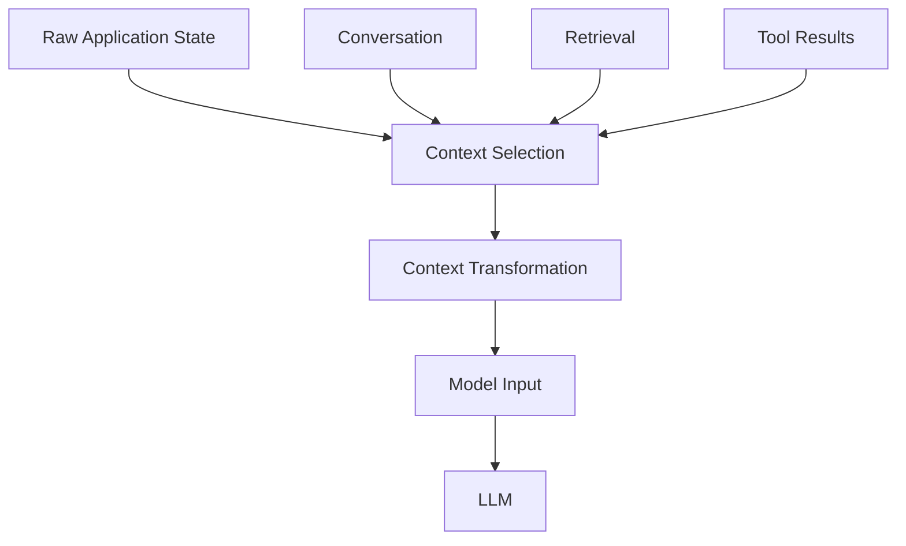

---

# 32. Memory and State

An Agent needs state to maintain execution context.

At a basic level:

```text
Messages
    ↓
Agent State
```

State may include:

```text
Conversation
User Preferences
Task Information
Tool Results
Intermediate Results
Application Metadata
```

Conceptually:

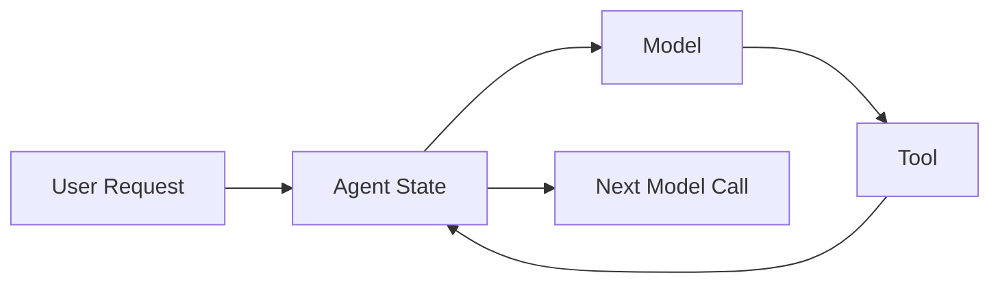

---

# 33. Short-Term vs Long-Term Memory

A useful conceptual distinction:

### Short-Term Memory

```text
Current Conversation
Current Task
Current Execution State
```

### Long-Term Memory

```text
User Preferences
Historical Information
Persistent Knowledge
Previous Interactions
```

LangChain can participate in architectures implementing both, but the actual storage and persistence architecture should be designed explicitly.

---

# 34. LangChain and LangGraph

This relationship is especially important for this handbook.

```text
LangChain
    ↓
High-Level AI Application / Agent Abstractions
    ↓
LangGraph
    ↓
Low-Level Stateful Orchestration Runtime
```

LangGraph focuses on:

```text
State
Durable Execution
Human-in-the-Loop
Long-Running Workflows
Graph-Based Orchestration
```

LangChain provides higher-level Agent and application abstractions.

---

# 35. LangChain + LangGraph Architecture

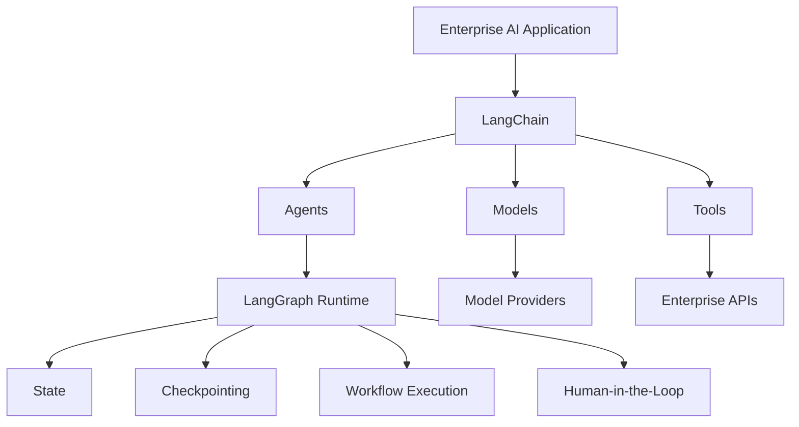

This distinction will be explored deeply in the dedicated LangGraph chapters of Part VIII.

---

# 36. LangChain and LangSmith

LangSmith is part of the broader LangChain ecosystem and provides capabilities for:

```text
Tracing
Debugging
Evaluation
Monitoring
Testing
```

A conceptual architecture:

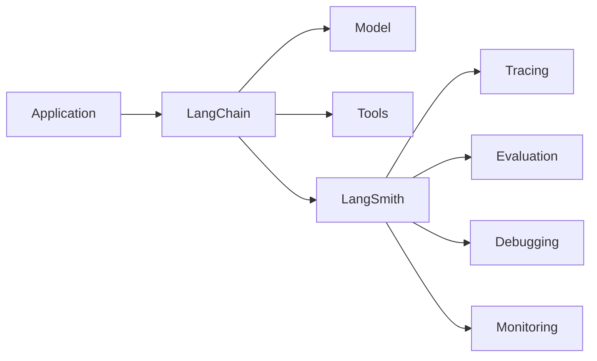

For production AI systems, observing multi-step execution is important because one user request may involve:

```text
Multiple Model Calls
+
Multiple Tool Calls
+
Retrieval
+
Retries
+
State Transitions
```

---

# 37. Simple LangChain Application

A basic application can be represented as:

```text
User
 ↓
Application
 ↓
Prompt
 ↓
LangChain Model
 ↓
Provider
 ↓
Response
```

Example:

```python
from langchain_openai import ChatOpenAI
from langchain_core.prompts import ChatPromptTemplate

model = ChatOpenAI(
    model="your-model"
)

prompt = ChatPromptTemplate.from_messages([
    (
        "system",
        "You are an enterprise software architect."
    ),
    (
        "human",
        "Explain {topic}."
    ),
])

messages = prompt.invoke({
    "topic": "event-driven architecture"
})

response = model.invoke(messages)

print(response.content)
```

---

# 38. Simple Tool-Enabled Application

```python
from langchain.agents import create_agent
from langchain.tools import tool

@tool
def get_order_status(order_id: str) -> str:
    """Return the status of an order."""
    return f"Order {order_id}: SHIPPED"

agent = create_agent(
    model="your-model",
    tools=[get_order_status],
)

result = agent.invoke({
    "messages": [
        {
            "role": "user",
            "content": "Check order ORD-1001."
        }
    ]
})

print(result)
```

Execution:

```text
User
 ↓
Agent
 ↓
Model
 ↓
Tool Call
 ↓
get_order_status()
 ↓
Tool Result
 ↓
Model
 ↓
Response
```

---

# 39. Enterprise Example — Customer Support Agent

Consider an enterprise customer-support Agent.

Requirements:

```text
Understand Customer Question
        ↓
Retrieve Customer
        ↓
Retrieve Order
        ↓
Check Delivery
        ↓
Generate Response
```

Possible tools:

```text
get_customer()
get_order()
get_delivery_status()
create_support_ticket()
```

Architecture:

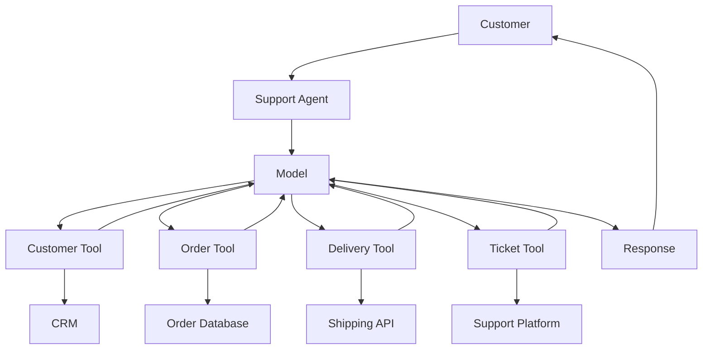

---

# 40. Enterprise Example — Internal Knowledge Assistant

Another use case:

```text
Employee
   ↓
Enterprise AI Assistant
   ↓
Retrieval
   ↓
Internal Knowledge
   ↓
LLM
   ↓
Answer
```

LangChain can integrate:

```text
Document Loaders
+
Text Splitters
+
Embeddings
+
Vector Stores
+
Retrievers
+
Models
```

The underlying RAG architecture remains a separate design concern.

---

# 41. Enterprise Example — Order Management Agent

A more advanced Agent:

```text
User
 ↓
Order Agent
 ↓
Understand Request
 ↓
Retrieve Order
 ↓
Check Payment
 ↓
Check Inventory
 ↓
Update Order
 ↓
Confirm
```

Architecture:

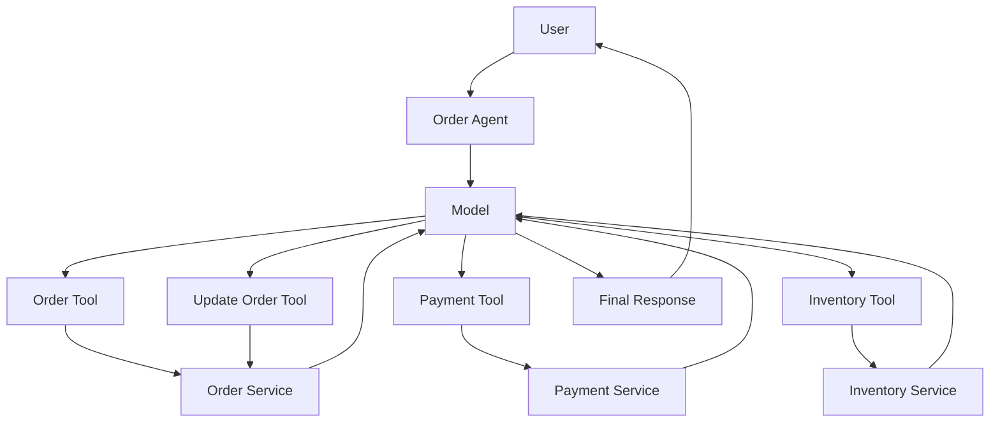

For side-effecting operations, authorization, idempotency, guardrails, and human approval must be designed explicitly.

---

# 42. LangChain Application Layers

A production application should not put everything into one Agent definition.

A better structure:

```text
API Layer
    ↓
Application Service
    ↓
Agent / AI Service
    ↓
LangChain
    ↓
Capability Adapters
    ↓
Enterprise Infrastructure
```

Example:

```text
REST Controller
      ↓
CustomerSupportService
      ↓
SupportAgent
      ↓
LangChain
      ↓
ToolProvider
      ↓
CRM / Order / Ticket Systems
```

---

# 43. Suggested Project Structure

A Python-based enterprise application could use:

```text
src/
├── api/
│   └── routes/
│
├── application/
│   └── services/
│
├── domain/
│   ├── models/
│   └── interfaces/
│
├── ai/
│   ├── agents/
│   ├── prompts/
│   ├── tools/
│   ├── retrieval/
│   ├── middleware/
│   └── models/
│
├── infrastructure/
│   ├── providers/
│   ├── databases/
│   ├── vectorstores/
│   └── external_services/
│
└── config/
```

The exact structure should follow the application's architectural needs.

---

# 44. Capability-Based Architecture

A framework-independent enterprise design can define capabilities.

```text
ModelProvider
RetrievalProvider
ToolProvider
MemoryProvider
AgentProvider
```

Then implement framework adapters:

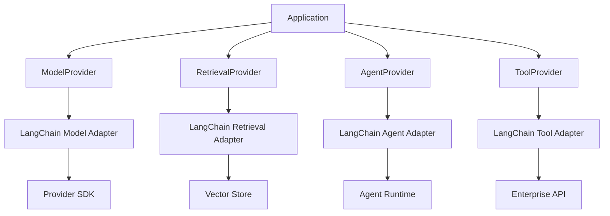

This can reduce framework coupling.

---

# 45. Why Framework Abstraction Matters

Without a boundary:

```text
Business Service
     ↓
LangChain API
     ↓
Provider
```

The entire application becomes framework-dependent.

With an abstraction boundary:

```text
Business Service
     ↓
Application Interface
     ↓
LangChain Adapter
     ↓
Provider
```

The framework becomes replaceable.

However, abstraction should be justified.

Over-abstraction can introduce unnecessary complexity.

---

# 46. LangChain Dependency Boundary

A useful enterprise rule:

```text
Business Domain
        │
        │ Avoid direct framework dependencies
        ↓
Application Layer
        │
        ↓
AI Capability Interfaces
        │
        ↓
LangChain Adapter
        │
        ↓
LangChain
```

This is particularly useful for large systems expected to evolve over time.

---

# 47. Configuration

Do not hard-code production configuration.

Avoid:

```python
model = ChatOpenAI(
    model="production-model"
)
```

everywhere in the application.

Instead centralize configuration:

```python
from dataclasses import dataclass
import os

@dataclass
class AIConfig:
    model_name: str
    temperature: float

config = AIConfig(
    model_name=os.getenv("AI_MODEL"),
    temperature=float(
        os.getenv("AI_TEMPERATURE", "0")
    ),
)
```

Then:

```python
model = ChatOpenAI(
    model=config.model_name,
    temperature=config.temperature,
)
```

---

# 48. Environment Configuration

Typical configuration:

```text
AI_MODEL
AI_TEMPERATURE
AI_TIMEOUT
AI_MAX_RETRIES
AI_PROVIDER
```

Secrets should not be stored directly in source code.

Use:

```text
Environment Variables
Secret Manager
Vault
Cloud Secret Store
Workload Identity
```

depending on the deployment architecture.

---

# 49. Error Handling

AI applications can fail at multiple layers.

```text
Application
 ↓
LangChain
 ↓
Provider
 ↓
Network
 ↓
Model
```

Tools introduce additional failure paths:

```text
Agent
 ↓
Tool
 ↓
Enterprise API
 ↓
Database
```

Therefore errors should be classified.

```text
Transient
Permanent
Validation
Authorization
Rate Limit
Timeout
Provider
Tool
```

---

# 50. Retry Strategy

A production application should avoid blindly retrying every exception.

Bad:

```python
for _ in range(10):
    try:
        response = model.invoke(...)
        break
    except Exception:
        pass
```

Better:

```text
Error
 ↓
Classify
 ↓
Transient?
 ├── No → Fail / Escalate
 └── Yes
      ↓
Bounded Retry
      ↓
Exponential Backoff
      ↓
Jitter
```

Retry policy should be designed according to the dependency.

---

# 51. Timeouts

Every external dependency should have appropriate timeouts.

```text
Model Timeout
Tool Timeout
Database Timeout
HTTP Timeout
Agent Runtime Timeout
```

Without timeouts:

```text
Slow Dependency
 ↓
Blocked Worker
 ↓
Growing Queue
 ↓
Resource Exhaustion
```

---

# 52. Rate Limiting

Production AI applications may encounter provider limits.

```text
Application
    ↓
Rate Limiter
    ↓
Model Provider
```

Rate limiting may be required at:

```text
Application
Tenant
User
Agent
Tool
Provider
```

levels.

---

# 53. Cost Control

LLM applications are cost-sensitive.

Potential controls:

```text
Token Limits
Model Selection
Caching
Prompt Optimization
Context Reduction
Tool Limits
Agent Step Limits
```

Conceptually:

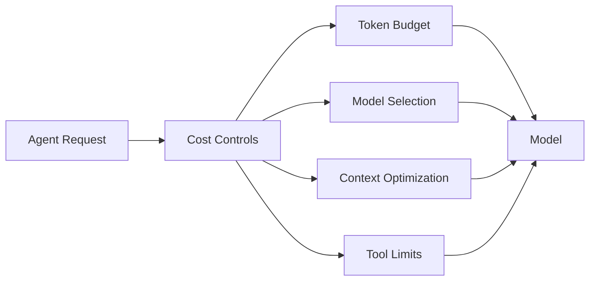

---

# 54. Observability

A production LangChain application should expose enough information to answer:

```text
What happened?
Why did it happen?
Which model was called?
How many times?
Which tools were called?
How long did they take?
How many tokens were used?
Where did the request fail?
```

Useful telemetry:

```text
Request ID
Trace ID
Agent ID
Model
Tool
Latency
Token Usage
Error
Retry Count
Cost
```

---

# 55. Tracing

A multi-step Agent execution can look like:

```text
Trace
 ├── Agent Invocation
 │
 ├── Model Call
 │
 ├── Tool Call
 │
 ├── Model Call
 │
 ├── Retrieval
 │
 ├── Model Call
 │
 └── Final Response
```

This is significantly easier to debug than a single application log line.

---

# 56. Testing

LangChain applications should be tested at multiple levels.

```text
Unit Tests
    ↓
Integration Tests
    ↓
Agent Tests
    ↓
Evaluation
    ↓
Production Monitoring
```

---

# 57. Unit Testing Tools

Tools should be independently testable.

Example:

```python
def test_get_order_status():
    result = get_order_status.invoke({
        "order_id": "ORD-1001"
    })

    assert result is not None
```

The exact test strategy depends on the tool implementation.

---

# 58. Integration Testing

Test:

```text
Application
 ↓
LangChain
 ↓
Model Provider
 ↓
Tool
 ↓
Enterprise Service
```

Integration tests should avoid relying exclusively on real production systems.

Use:

```text
Mocks
Stubs
Test Containers
Sandbox APIs
Controlled Test Models
```

where appropriate.

---

# 59. Agent Evaluation

Traditional unit tests cannot fully measure Agent quality.

Evaluate:

```text
Task Completion
Tool Selection
Tool Arguments
Response Quality
Safety
Latency
Cost
```

A production Agent should be evaluated against representative scenarios.

---

# 60. Regression Testing

A prompt or model change can change Agent behavior.

```text
Prompt v1
    ↓
Agent Behavior A
```

After change:

```text
Prompt v2
    ↓
Agent Behavior B
```

Therefore maintain regression datasets.

```text
Test Cases
    ↓
Agent
    ↓
Expected Properties
    ↓
Evaluation
```

---

# 61. Security

LangChain does not automatically make an Agent secure.

Production security remains an application architecture responsibility.

Consider:

```text
Authentication
Authorization
Least Privilege
Input Validation
Tool Authorization
Secrets Management
PII Protection
Prompt Injection
Output Validation
Audit
```

---

# 62. Tool Security

A dangerous design:

```text
Agent
 ↓
Full Database Access
```

Better:

```text
Agent
 ↓
Restricted Tool
 ↓
Validated Operation
 ↓
Authorized Resource
```

Example:

```text
Agent
 ↓
get_customer_order(order_id)
 ↓
Authorization
 ↓
Order Service
```

rather than:

```text
Agent
 ↓
execute_arbitrary_sql()
```

---

# 63. Guardrails

Guardrails can be applied around:

```text
Input
Model
Tool Calls
Output
```

Conceptually:

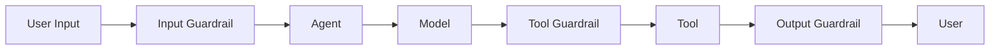

Middleware can provide useful enforcement points for these controls.

---

# 64. Human-in-the-Loop

High-risk operations should sometimes require human approval.

Example:

```text
Agent
 ↓
Create Refund
 ↓
Human Approval
 ↓
Execute
```

Architecture:

```mermaid
flowchart TD

    A[Agent] --> B[Decision]

    B --> C{High Risk?}

    C -->|No| D[Execute]
    C -->|Yes| E[Human Approval]

    E --> F{Approved?}

    F -->|Yes| D
    F -->|No| G[Reject]

    D --> H[Result]
```

---

# 65. Production Architecture

A production-oriented LangChain architecture can look like:

```mermaid
flowchart TD

    A[Client] --> B[API Gateway]

    B --> C[Application Service]

    C --> D[LangChain Agent]

    D --> E[Model]
    D --> F[Tools]
    D --> G[Retriever]
    D --> H[Middleware]

    E --> I[Model Provider]

    F --> J[Tool Gateway]
    J --> K[Enterprise APIs]

    G --> L[Vector Store]
    G --> M[Document Store]

    D --> N[State / Persistence]

    C --> O[Observability]

    D --> O
    E --> O
    F --> O
```

---

# 66. Production Request Flow

```text
Client
  ↓
API Gateway
  ↓
Authentication
  ↓
Application Service
  ↓
LangChain Agent
  ↓
Middleware
  ↓
Model
  ↓
Tool / Retrieval
  ↓
Model
  ↓
Validation
  ↓
Response
```

---

# 67. Enterprise Multi-Tenant Architecture

For multi-tenant applications:

```mermaid
flowchart TD

    A[Clients] --> B[API Gateway]

    B --> C[Tenant Resolution]

    C --> D[Authorization]

    D --> E[Agent Service]

    E --> F[LangChain Runtime]

    F --> G[Model]
    F --> H[Tools]
    F --> I[Retrieval]

    H --> J[Enterprise Services]

    I --> K[Tenant-Aware Data]

    F --> L[Tenant State]

    E --> M[Cost / Usage Tracking]
```

Tenant isolation should be enforced independently of the framework.

---

# 68. Scaling

LangChain itself is not the complete scaling solution.

The deployed system must scale:

```text
API
 ↓
Agent Workers
 ↓
Model Provider
 ↓
Tools
 ↓
Databases
 ↓
Vector Stores
```

For asynchronous workloads:

```text
Request
 ↓
Queue
 ↓
Agent Worker
 ↓
LangChain Runtime
```

This architecture allows Agent execution capacity to scale independently from API capacity.

---

# 69. Deployment

A production LangChain application can be deployed as:

```text
Container
   ↓
Kubernetes
```

or:

```text
Serverless
   ↓
Function
```

or:

```text
API
   ↓
Queue
   ↓
Worker
```

The deployment model depends on:

```text
Task Duration
Traffic
Concurrency
State
Latency
Cost
Availability
```

---

# 70. Containerized Architecture

```mermaid
flowchart TD

    A[Git Repository] --> B[CI Pipeline]

    B --> C[Tests]
    C --> D[Container Build]
    D --> E[Image Registry]

    E --> F[Kubernetes]

    F --> G[Agent Pod A]
    F --> H[Agent Pod B]
    F --> I[Agent Pod C]

    G --> J[LangChain Runtime]
    H --> J
    I --> J
```

---

# 71. Production Configuration

Configuration should be externalized.

Example:

```text
LANGCHAIN_MODEL
LANGCHAIN_TIMEOUT
LANGCHAIN_MAX_RETRIES
LANGCHAIN_TEMPERATURE
LANGCHAIN_MAX_TOKENS
```

Provider credentials should come from a secure secret mechanism.

---

# 72. Common Mistake — Framework Everywhere

Bad architecture:

```text
Every Service
 ↓
LangChain
 ↓
LangChain Objects Everywhere
```

This makes the business application tightly coupled to the framework.

Better:

```text
Business Logic
 ↓
AI Capability Interface
 ↓
LangChain Adapter
```

---

# 73. Common Mistake — Using LangChain for Everything

Not every AI application needs a framework.

For a simple application:

```text
REST API
 ↓
Provider SDK
 ↓
Model
```

may be sufficient.

Introducing LangChain may add unnecessary complexity if there are no meaningful framework capabilities being used.

---

# 74. Common Mistake — Ignoring Framework Versions

AI frameworks evolve quickly.

Potential problems:

```text
API Changes
Package Changes
Integration Changes
Deprecated APIs
Provider Changes
```

Use:

```text
Pinned Dependencies
+
Automated Tests
+
Controlled Upgrades
```

---

# 75. Common Mistake — Hiding Network Calls

A framework abstraction can make network calls look like local function calls.

For example:

```python
result = model.invoke(...)
```

may involve:

```text
Network
 ↓
Provider
 ↓
Model
 ↓
Network
```

Developers must understand the actual execution boundary.

---

# 76. Common Mistake — Uncontrolled Agent Loops

An Agent may perform:

```text
Model
 ↓
Tool
 ↓
Model
 ↓
Tool
 ↓
Model
 ↓
Tool
 ↓
...
```

Production systems should impose:

```text
Maximum Steps
Maximum Tool Calls
Maximum Runtime
Maximum Token Budget
```

---

# 77. Common Mistake — Treating Tool Calls as Safe

Tools can cause side effects.

Examples:

```text
Send Email
Delete Record
Issue Refund
Create Payment
Update Customer
Deploy Application
```

These actions require:

```text
Authorization
Validation
Audit
Idempotency
Human Approval
```

where appropriate.

---

# 78. Common Mistake — No Observability

This is problematic:

```text
Agent failed.
```

The team needs to know:

```text
Which Model?
Which Prompt?
Which Tool?
Which Input?
Which Step?
Which Error?
How Many Retries?
How Much Cost?
```

Tracing becomes essential as Agent complexity increases.

---

# 79. Common Mistake — Confusing LangChain With LangGraph

Simplified distinction:

```text
LangChain
    ↓
Higher-Level AI Application / Agent Framework

LangGraph
    ↓
Lower-Level Stateful Agent Orchestration
```

They are complementary rather than mutually exclusive.

---

# 80. Common Mistake — Rebuilding Framework Features

If a framework already provides:

```text
Tool Schema
Structured Output
Middleware
Model Integration
Agent Loop
```

reimplementing the same capabilities manually may increase maintenance burden.

However, teams should still understand the underlying behavior before adopting an abstraction.

---

# 81. When LangChain Is a Good Fit

LangChain can be a strong fit when an application needs:

```text
Multiple Model Providers
Tools
Agents
Retrieval
Structured Output
Reusable AI Components
Middleware
Framework Integrations
```

It can be especially useful when the application is evolving beyond a simple model call.

---

# 82. When Direct SDK May Be Better

A direct provider SDK may be preferable when:

```text
Application Is Very Simple
        ↓
Single Provider
        ↓
Few Integrations
        ↓
No Complex Agent Workflow
        ↓
Minimal Abstraction Needed
```

Example:

```text
REST API
 ↓
Provider SDK
 ↓
LLM
 ↓
Response
```

The framework should solve a real engineering problem.

---

# 83. LangChain Decision Framework

```mermaid
flowchart TD

    A[Need AI Application?] --> B{Simple Model Call?}

    B -->|Yes| C[Consider Direct SDK]
    B -->|No| D{Need Multiple AI Capabilities?}

    D -->|Yes| E{Need Framework Abstractions?}
    D -->|No| C

    E -->|Yes| F[Consider LangChain]
    E -->|No| C

    F --> G{Complex Stateful Orchestration?}

    G -->|Yes| H[Consider LangGraph]
    G -->|No| I[LangChain Application]
```

---

# 84. LangChain vs Direct SDK

| Capability | Direct SDK | LangChain |
|---|---|---|
| Provider API Access | Strong | Strong |
| Abstraction Level | Low | Higher |
| Multi-Provider | Usually custom | Built around integrations |
| Tool Integration | Provider-specific | Framework abstraction |
| Retrieval | Custom | Integrations |
| Agents | Provider/framework dependent | Built-in Agent abstraction |
| Middleware | Custom | Framework support |
| Framework Overhead | Lower | Higher |
| Provider-Specific Features | Direct | May require integration support |
| Portability | Custom work | Easier at framework abstraction level |

No column should be interpreted as universally better.

---

# 85. LangChain vs LangGraph

| Area | LangChain | LangGraph |
|---|---|---|
| Primary Role | AI application framework | Stateful orchestration/runtime |
| Abstraction | Higher | Lower |
| Models | Strong integration | Often uses LangChain components |
| Tools | Strong integration | Can execute tools in graphs |
| Agent Creation | High-level | Low-level control |
| State | Supported | Core concept |
| Durable Execution | Through runtime ecosystem | Core capability |
| Complex Workflows | Possible | Strong fit |
| Human-in-the-Loop | Supported | Strong control |
| Graph Control | Limited at high level | Core feature |

---

# 86. Framework Composition

A production architecture can use multiple layers:

```text
Application
    ↓
LangChain
    ↓
LangGraph
    ↓
Provider SDK
    ↓
Model
```

For example:

```mermaid
flowchart TD

    A[Enterprise Application]

    A --> B[LangChain Agent]

    B --> C[LangGraph Runtime]

    C --> D[Model]
    C --> E[Tools]
    C --> F[State]

    D --> G[Provider SDK]

    E --> H[Enterprise APIs]
    F --> I[Persistence]
```

This layered architecture is important to understand before studying the dedicated LangGraph chapters.

---

# 87. Framework Lock-In

Framework adoption introduces a potential dependency:

```text
Application
 ↓
Framework
 ↓
Provider
```

If framework-specific types spread throughout the application:

```text
Business Domain
 ↓
Framework Types
```

migration becomes harder.

A capability-based architecture can reduce this risk.

---

# 88. Production Checklist

## Architecture

- [ ] AI application boundary defined
- [ ] Framework responsibilities identified
- [ ] Provider boundary defined
- [ ] Tool boundary defined
- [ ] Retrieval boundary defined
- [ ] State architecture defined

## Model

- [ ] Model selected
- [ ] Provider integration configured
- [ ] Timeout configured
- [ ] Retry strategy defined
- [ ] Rate limits understood
- [ ] Token limits defined

## Tools

- [ ] Tool schemas defined
- [ ] Tool authorization implemented
- [ ] Tool timeouts configured
- [ ] Tool retries controlled
- [ ] Side effects protected
- [ ] Tool calls audited

## Agents

- [ ] Agent stop conditions defined
- [ ] Maximum steps configured
- [ ] Tool call limits configured
- [ ] Token budget configured
- [ ] State strategy defined

## Security

- [ ] Authentication
- [ ] Authorization
- [ ] Least privilege
- [ ] Secrets management
- [ ] Input validation
- [ ] Output validation
- [ ] Guardrails
- [ ] Audit

## Observability

- [ ] Logs
- [ ] Metrics
- [ ] Traces
- [ ] Model usage
- [ ] Tool usage
- [ ] Latency
- [ ] Errors
- [ ] Cost

## Operations

- [ ] Dependency versions pinned
- [ ] CI/CD configured
- [ ] Containerization where appropriate
- [ ] Deployment strategy defined
- [ ] Rollback strategy defined
- [ ] Load testing completed
- [ ] Failure testing completed

---

# 89. Production Readiness Flow

```mermaid
flowchart TD

    A[LangChain Application]

    A --> B[Functional Testing]
    B --> C[Integration Testing]
    C --> D[Agent Evaluation]
    D --> E[Security Testing]
    E --> F[Load Testing]
    F --> G[Observability Validation]
    G --> H[Staging]
    H --> I[Canary / Controlled Release]
    I --> J[Production]
    J --> K[Continuous Monitoring]
```

---

# 90. Interview Questions

## Beginner

### 1. What is LangChain?

LangChain is an open-source framework for building LLM-powered applications and Agents using reusable abstractions and integrations.

### 2. Is LangChain an LLM?

No.

```text
LangChain ≠ LLM
```

LangChain integrates with LLM providers.

### 3. Is LangChain a vector database?

No.

It provides integrations with retrieval and vector-store technologies.

### 4. Why use LangChain?

To simplify composition of:

```text
Models
Tools
Retrieval
Agents
Structured Output
Middleware
```

---

## Intermediate

### 5. What is a Tool in LangChain?

A Tool is a callable operation with defined inputs and outputs that an Agent can invoke.

### 6. What is an Agent?

An Agent combines a model with tools and an execution loop so the model can decide which tools to use while working toward a goal.

### 7. What is Middleware?

Middleware provides hooks around Agent execution for concerns such as:

```text
Logging
Guardrails
Retries
Fallbacks
PII Detection
Human Approval
```

### 8. How is LangChain related to LangGraph?

Current LangChain Agent execution uses LangGraph as its underlying graph-based runtime.

---

## Advanced

### 9. When would you choose LangGraph over a high-level LangChain Agent?

When the application needs more explicit control over:

```text
State
Routing
Durable Execution
Long-Running Workflows
Human-in-the-Loop
Complex Orchestration
```

### 10. When might a direct SDK be preferable?

For simple applications where framework abstractions do not provide enough value to justify their additional dependency and complexity.

### 11. How would you prevent framework lock-in?

Use:

```text
Capability Interfaces
+
Adapter Pattern
+
Framework-Specific Infrastructure Layer
```

### 12. What should be monitored in a production LangChain Agent?

At minimum:

```text
Model Calls
Tool Calls
Latency
Errors
Retries
Tokens
Cost
Task Success
```

---

# 91. Quick Revision

```text
LangChain
    ↓
AI Application Framework
```

Core concepts:

```text
Models
Prompts
Messages
Tools
Retrieval
Structured Output
Agents
Middleware
State
```

Agent flow:

```text
User
 ↓
Agent
 ↓
Model
 ↓
Tool?
 ├── Yes → Tool → Model
 └── No  → Response
```

Production flow:

```text
API
 ↓
Application Service
 ↓
LangChain
 ↓
Model / Tools / Retrieval
 ↓
Enterprise Systems
```

Enterprise principle:

```text
Business Logic
      ↓
Capability Interfaces
      ↓
Framework Adapter
      ↓
LangChain
      ↓
Infrastructure
```

---

# 92. Key Takeaways

- LangChain is an AI application framework, not an LLM.
- LangChain is not a vector database.
- LangChain provides abstractions and integrations for building AI applications and Agents.
- Model integrations allow applications to work with multiple providers.
- Tools allow Agents to interact with external systems.
- Retrieval integrations allow LangChain applications to participate in RAG architectures.
- Structured output is important when LLM responses need to enter deterministic application workflows.
- Agents combine models and tools with an execution loop.
- Middleware provides an important extension point for runtime controls.
- Current LangChain Agent execution is built on the LangGraph runtime.
- LangGraph provides lower-level orchestration capabilities for stateful and complex Agent workflows.
- LangSmith belongs to the broader LangChain ecosystem and provides tracing and evaluation capabilities.
- LangChain should not automatically be introduced into every AI application.
- Simple applications may be better served by a direct provider SDK.
- Framework abstractions can improve productivity but introduce another dependency layer.
- Enterprise applications should consider framework boundaries carefully.
- Capability-based interfaces can reduce framework coupling.
- Production LangChain systems require proper security, observability, testing, evaluation, scaling, and cost controls.
- Agent systems must control steps, tools, tokens, retries, and execution time.
- Tool authorization is as important as model authorization when Agents can perform real-world actions.
- Framework selection should follow architecture and business requirements rather than popularity alone.

---

# 93. Production Mental Model

The most important mental model for LangChain is:

```text
                 ENTERPRISE APPLICATION
                           │
                           ▼
                  APPLICATION SERVICES
                           │
                           ▼
                       LANGCHAIN
                           │
          ┌────────────────┼────────────────┐
          ▼                ▼                ▼
        MODEL             TOOLS          RETRIEVAL
          │                │                │
          ▼                ▼                ▼
      PROVIDERS       ENTERPRISE APIs   DATA SYSTEMS
                           │
                           ▼
                      STATE / MEMORY

        Cross-Cutting:
        ─────────────────
        Security
        Guardrails
        Observability
        Evaluation
        Cost
        Governance
```

The framework is one layer of the architecture.

It is not the architecture itself.

---

# 94. Part VIII Learning Progression

This chapter establishes the foundation for the remaining LangChain chapters:

```text
01 — LangChain Fundamentals
       ↓
02 — LangChain Models & Prompts
       ↓
03 — LangChain Tools & Function Calling
       ↓
04 — LangChain Retrieval & RAG
       ↓
05 — LangChain Memory & State
       ↓
06 — LangChain Agents
       ↓
07 — LangChain Production Patterns
       ↓
08 — LangChain Limitations & Trade-offs
```

The same production-oriented approach will then be applied to:

```text
LlamaIndex
    ↓
LangGraph
    ↓
Semantic Kernel
    ↓
CrewAI
    ↓
AutoGen
    ↓
DSPy
    ↓
Haystack
    ↓
Provider SDKs
    ↓
Framework Comparisons
```

---

# 🔗 Related Topics

### Next

**[02. LangChain Models & Prompts](02-langchain-models-and-prompts.md)**

### Related

- [03. LangChain Tools & Function Calling](03-langchain-tools-and-function-calling.md)
- [04. LangChain Retrieval & RAG](04-langchain-retrieval-and-rag.md)
- [05. LangChain Memory & State](05-langchain-memory-and-state.md)
- [06. LangChain Agents](06-langchain-agents.md)
- [07. LangChain Production Patterns](07-langchain-production-patterns.md)
- [08. LangChain Limitations & Trade-offs](08-langchain-limitations-and-tradeoffs.md)

### Previous Handbook Topics

- Part V — Production RAG Engineering
- Part VI — AI Agents
- Part VII — Agentic AI & Multi-Agent Systems

---

# 📚 References & Further Reading

The following official documentation should be used for current API details and version-specific implementation guidance:

- LangChain Documentation
- LangChain Python Documentation
- LangChain Agents Documentation
- LangChain Tools Documentation
- LangChain Middleware Documentation
- LangGraph Documentation
- LangSmith Documentation

> APIs and integrations in the LangChain ecosystem evolve rapidly. Always verify implementation details against the current official documentation before using them in production.

---

> **Enterprise AI Engineering Handbook**  
> *Building Production-Grade Enterprise AI Systems — One Chapter at a Time.*