# 02 — LangChain Models & Prompts

> Understand how LangChain standardizes model interaction, messages, prompts, model configuration, streaming, batching, structured inputs, and provider abstraction for production-grade Enterprise AI applications.

---

## 📖 Overview

Large Language Models are the computational core of modern AI applications, but enterprise applications rarely interact with models through a single hard-coded API call.

A production application may need to:

- Select different models for different workloads
- Switch between providers
- Configure temperature and output limits
- Manage system and user instructions
- Maintain conversation context
- Stream responses
- Execute requests asynchronously
- Batch requests
- Track token usage
- Apply timeouts and retries
- Support structured outputs
- Support multimodal inputs
- Route requests dynamically
- Control model costs

LangChain provides a standardized model interface and message abstractions that allow applications to work with models from different providers through a common programming model. :contentReference[oaicite:0]{index=0}

The central idea is:

```text
Enterprise Application
        ↓
LangChain Model Interface
        ↓
Provider Integration
        ↓
Model
```

Instead of tightly coupling business logic to one provider:

```text
Business Logic
      ↓
OpenAI SDK
      ↓
OpenAI Model
```

an application can establish a model abstraction:

```text
Business Logic
      ↓
AI Model Interface
      ↓
LangChain Integration
      ↓
Provider
```

This chapter focuses on the **model and prompt layer**.

---

# 🎯 Learning Objectives

After completing this chapter, you will be able to:

- Understand LangChain chat models
- Understand the LangChain model abstraction
- Initialize models using `init_chat_model`
- Understand provider and model identifiers
- Configure model parameters
- Understand messages
- Understand system, human, AI, and tool messages
- Build reusable prompt templates
- Use `ChatPromptTemplate`
- Inject runtime variables into prompts
- Compose prompts with models
- Understand model invocation
- Understand streaming
- Understand batching
- Understand model configuration
- Understand configurable models
- Understand token usage
- Understand rate limiting
- Understand retries and timeouts
- Understand provider portability
- Understand prompt versioning concerns
- Design production-oriented model and prompt architectures

---

# 1. Model Layer in LangChain

At the center of an AI application is the model.

```text
Application
    ↓
Model Interface
    ↓
LLM Provider
    ↓
Foundation Model
```

LangChain provides a standard interface for interacting with chat models from different providers. :contentReference[oaicite:1]{index=1}

Conceptually:

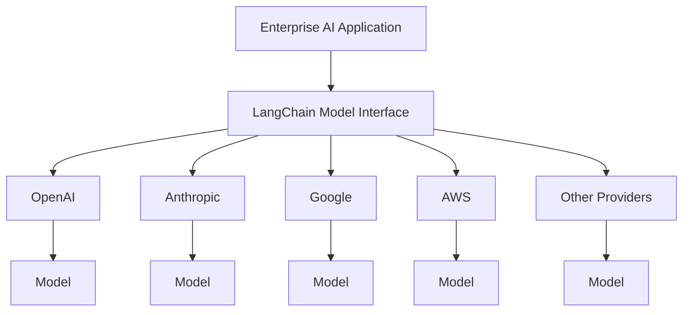

The application can therefore avoid embedding provider-specific invocation logic throughout the business layer.

---

# 2. What Is a Chat Model?

A chat model accepts a sequence of messages and produces an AI message.

Simplified:

```text
Messages
    ↓
Chat Model
    ↓
AI Message
```

For example:

```text
System:
You are an enterprise architect.

User:
Explain event-driven architecture.
```

The model returns:

```text
AI:
Event-driven architecture is...
```

LangChain's current model documentation describes chat models as taking a single message or a list of messages and returning an `AIMessage`. :contentReference[oaicite:2]{index=2}

---

# 3. LangChain Model Abstraction

A provider may expose its own SDK:

```text
Provider A SDK
Provider B SDK
Provider C SDK
```

Each SDK may have different APIs.

LangChain provides a common model interface:

```text
                 ┌── Provider A
                 │
Application → LangChain Model Interface
                 │
                 ├── Provider B
                 │
                 └── Provider C
```

This allows application code to be less dependent on provider-specific APIs.

---

# 4. Why Model Abstraction Matters

Imagine an enterprise application initially uses Provider A.

```text
Application
    ↓
Provider A
```

Later the organization wants:

```text
Provider B
```

Without an abstraction:

```text
Application
    ↓
Provider A SDK
```

Provider-specific code can be distributed across the application.

With an abstraction:

```text
Application
    ↓
Model Interface
    ↓
Provider A
```

can become:

```text
Application
    ↓
Model Interface
    ↓
Provider B
```

Conceptually:

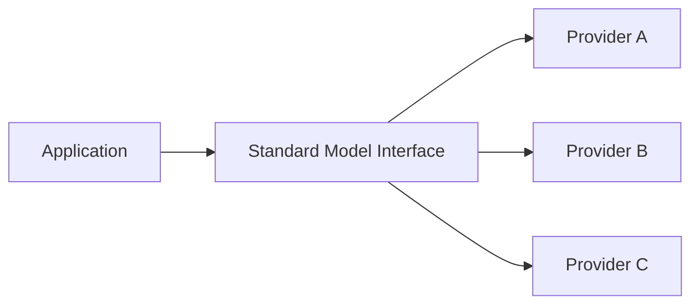

This is one of the major architectural benefits of LangChain's standardized model interface. :contentReference[oaicite:3]{index=3}

---

# 5. Important: Abstraction Does Not Mean Identical Capabilities

Provider abstraction does **not** mean every model behaves identically.

Different models can have different:

- Context windows
- Tool-calling capabilities
- Multimodal support
- Structured-output support
- Reasoning capabilities
- Tokenization
- Rate limits
- Pricing
- Latency
- Provider-specific parameters

Therefore:

```text
Common Interface
        ≠
Identical Model Behavior
```

A production architecture must distinguish:

```text
Portable Capabilities
        +
Provider-Specific Capabilities
```

---

# 6. Initializing a Model

The current LangChain documentation recommends `init_chat_model` as a convenient way to initialize chat models from supported providers. :contentReference[oaicite:4]{index=4}

Example:

```python
from langchain.chat_models import init_chat_model

model = init_chat_model(
    "openai:gpt-5.4"
)
```

The provider/model format can explicitly identify both the provider and model:

```text
provider:model
```

For example:

```text
openai:gpt-5.4
```

or:

```text
google_genai:gemini-2.5-flash
```

Provider and model identifiers must match the provider's supported model naming. :contentReference[oaicite:5]{index=5}

---

# 7. Provider Packages

LangChain uses provider-specific integration packages.

Conceptually:

```text
langchain
    │
    ├── OpenAI Integration
    ├── Anthropic Integration
    ├── Google Integration
    ├── AWS Integration
    └── Other Integrations
```

For example:

```bash
pip install -U "langchain[openai]"
```

or:

```bash
pip install -U "langchain[anthropic]"
```

or:

```bash
pip install -U "langchain[google-genai]"
```

The exact installation requirements depend on the provider integration being used. :contentReference[oaicite:6]{index=6}

---

# 8. Basic Model Invocation

A minimal model invocation:

```python
from langchain.chat_models import init_chat_model

model = init_chat_model(
    "openai:gpt-5.4"
)

response = model.invoke(
    "Explain microservices architecture."
)

print(response.content)
```

Execution flow:

```text
Application
    ↓
init_chat_model()
    ↓
LangChain Model
    ↓
Provider Integration
    ↓
Provider API
    ↓
Model
    ↓
AIMessage
```

---

# 9. Messages Are Fundamental

Messages are the fundamental unit of context in LangChain's model interface. They carry:

- Role
- Content
- Metadata
- Message-specific information

The standard message types include:

```text
SystemMessage
HumanMessage
AIMessage
ToolMessage
```

LangChain standardizes these message concepts across model providers. :contentReference[oaicite:7]{index=7}

---

# 10. Message Architecture

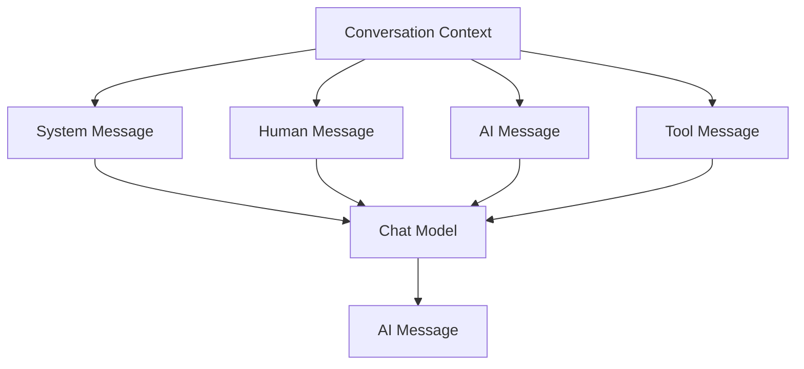

---

# 11. System Message

A `SystemMessage` provides instructions that influence model behavior.

Example:

```python
from langchain.messages import SystemMessage

system_message = SystemMessage(
    "You are an enterprise software architect."
)
```

Typical system instructions can define:

```text
Role
Behavior
Constraints
Output Rules
Domain Context
Safety Rules
```

Example:

```python
system_message = SystemMessage(
    """
    You are an enterprise AI architect.

    Provide technically accurate answers.
    Prefer production-oriented architecture.
    Highlight security and scalability concerns.
    """
)
```

---

# 12. Human Message

A `HumanMessage` represents user input.

```python
from langchain.messages import HumanMessage

human_message = HumanMessage(
    "Explain event-driven architecture."
)
```

---

# 13. AI Message

An `AIMessage` represents the model's response.

```python
response = model.invoke(
    "Explain event-driven architecture."
)

print(type(response))
print(response.content)
```

The result is an AI message containing model-generated content and potentially additional metadata. :contentReference[oaicite:8]{index=8}

---

# 14. Tool Message

A `ToolMessage` represents the result returned from a tool invocation.

Conceptually:

```text
AIMessage
    ↓
Tool Call
    ↓
Tool Execution
    ↓
ToolMessage
    ↓
Model
```

This becomes especially important when building Agents.

---

# 15. Building a Conversation

A conversation can be represented as:

```python
from langchain.messages import (
    SystemMessage,
    HumanMessage,
    AIMessage,
)

messages = [
    SystemMessage(
        "You are a helpful enterprise AI assistant."
    ),
    HumanMessage(
        "What is event-driven architecture?"
    ),
    AIMessage(
        "Event-driven architecture is a software architecture..."
    ),
    HumanMessage(
        "What are its advantages?"
    ),
]
```

The model receives the message sequence as context.

---

# 16. Message-Based Architecture

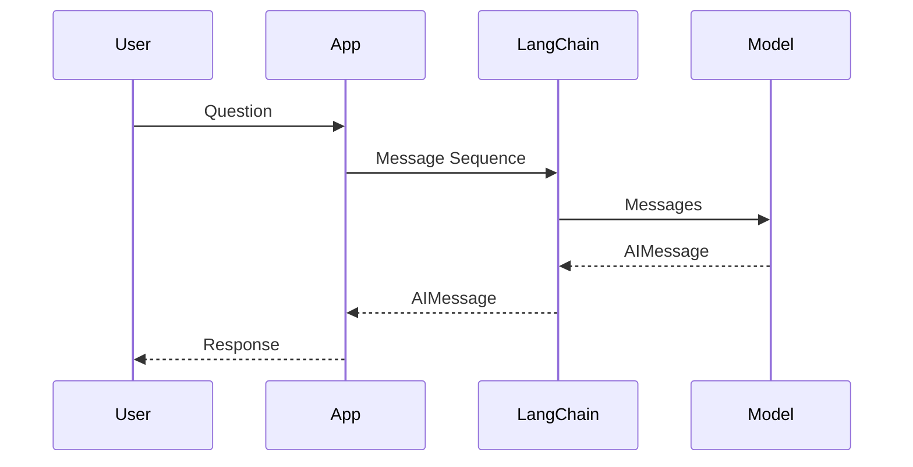

---

# 17. Text Prompt vs Message Prompt

LangChain supports simple text input:

```python
response = model.invoke(
    "Explain Kubernetes."
)
```

This is useful for simple standalone requests.

For richer applications:

```python
messages = [
    SystemMessage(...),
    HumanMessage(...),
]

response = model.invoke(messages)
```

Use message-based input when the application needs:

- System instructions
- Conversation history
- Multiple turns
- Multimodal content
- Tool interactions
- Structured message state

LangChain's message documentation explicitly distinguishes simple text prompts from message sequences. :contentReference[oaicite:9]{index=9}

---

# 18. Prompt Templates

Hard-coding prompts everywhere creates maintainability problems.

Bad:

```python
prompt = (
    "You are an enterprise architect. "
    "Explain microservices for "
    + audience
)
```

A better approach is a reusable template:

```text
Template
    ↓
Variables
    ↓
Runtime Prompt
```

---

# 19. ChatPromptTemplate

LangChain provides `ChatPromptTemplate` for building reusable chat prompts.

Example:

```python
from langchain_core.prompts import ChatPromptTemplate

prompt = ChatPromptTemplate.from_messages([
    (
        "system",
        "You are an enterprise software architect."
    ),
    (
        "human",
        "Explain {topic} for a {audience}."
    ),
])
```

Now supply runtime values:

```python
messages = prompt.invoke({
    "topic": "event-driven architecture",
    "audience": "backend engineer",
})
```

The template generates a message sequence.

---

# 20. Prompt Template Flow

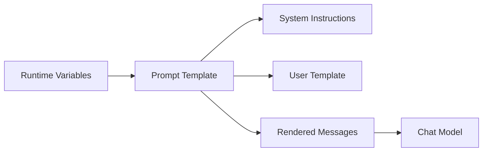

---

# 21. Prompt Variables

Example:

```python
prompt = ChatPromptTemplate.from_messages([
    (
        "system",
        "You are an expert in {domain}."
    ),
    (
        "human",
        "Explain {topic} for {audience}."
    ),
])

messages = prompt.invoke({
    "domain": "cloud architecture",
    "topic": "event-driven systems",
    "audience": "Java backend engineers",
})
```

This separates:

```text
Prompt Structure
```

from:

```text
Runtime Data
```

---

# 22. Prompt Composition

A production prompt may combine:

```text
System Instructions
+
User Request
+
Retrieved Context
+
Conversation History
+
Application State
```

Conceptually:

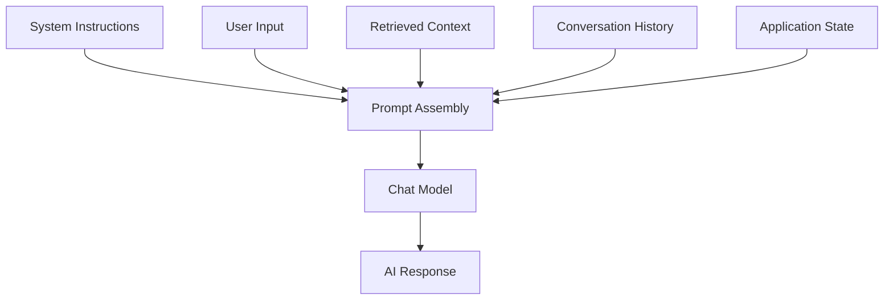

---

# 23. Prompt + Model Composition

A prompt template can be combined with a model.

Conceptually:

```text
Prompt Template
      ↓
Messages
      ↓
Model
      ↓
Response
```

Example:

```python
from langchain.chat_models import init_chat_model
from langchain_core.prompts import ChatPromptTemplate

model = init_chat_model(
    "openai:gpt-5.4"
)

prompt = ChatPromptTemplate.from_messages([
    (
        "system",
        "You are a cloud architect."
    ),
    (
        "human",
        "Explain {topic}."
    ),
])

messages = prompt.invoke({
    "topic": "serverless architecture"
})

response = model.invoke(messages)

print(response.content)
```

---

# 24. Prompt Pipeline

The resulting architecture is:

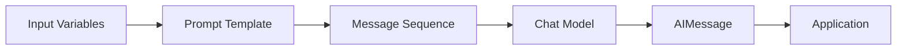

---

# 25. Runnable Composition

LangChain provides composable runnable abstractions.

Conceptually:

```text
Input
 ↓
Prompt
 ↓
Model
 ↓
Output Parser
```

This can be expressed as:

```python
chain = prompt | model
```

Example:

```python
chain = prompt | model

response = chain.invoke({
    "topic": "event-driven architecture"
})

print(response.content)
```

The pipe notation expresses data flow.

---

# 26. Runnable Mental Model

```text
Input
  ↓
Runnable A
  ↓
Runnable B
  ↓
Runnable C
  ↓
Output
```

For a prompt/model pipeline:

```text
Variables
    ↓
Prompt Template
    ↓
Messages
    ↓
Model
    ↓
AIMessage
```

---

# 27. Model Parameters

Chat models expose configuration parameters.

Common parameters include:

```text
model
temperature
max_tokens
timeout
max_retries
```

LangChain's current model documentation identifies these as common model configuration parameters, while provider integrations may expose additional provider-specific parameters. :contentReference[oaicite:10]{index=10}

---

# 28. Temperature

Temperature influences the variability of generated responses.

Conceptually:

```text
Lower Temperature
    ↓
More predictable output

Higher Temperature
    ↓
More variation
```

For deterministic enterprise workflows:

```python
model = init_chat_model(
    "openai:gpt-5.4",
    temperature=0
)
```

For creative generation:

```python
model = init_chat_model(
    "openai:gpt-5.4",
    temperature=0.7
)
```

The exact behavior and supported range depend on the model provider.

---

# 29. Temperature Is Not a Quality Setting

A common misconception is:

```text
Higher Temperature = Better
```

This is incorrect.

Instead:

```text
Temperature
    =
Generation Behavior Control
```

The appropriate value depends on the task.

Example:

```text
Classification
     ↓
Low variation

Code Generation
     ↓
Usually controlled variation

Creative Writing
     ↓
Potentially higher variation
```

---

# 30. Max Tokens

Output length can be constrained.

```python
model = init_chat_model(
    "openai:gpt-5.4",
    max_tokens=1000
)
```

This can help control:

```text
Response Size
Latency
Cost
```

However, the parameter semantics can vary by provider/model, so provider documentation should be checked.

---

# 31. Timeout

Production applications should avoid unlimited waits.

Example:

```python
model = init_chat_model(
    "openai:gpt-5.4",
    timeout=30
)
```

Conceptually:

```text
Request
   ↓
Model
   ↓
30-second boundary
   ↓
Success / Timeout
```

---

# 32. Retries

Transient provider failures can occur because of:

```text
Network Errors
Rate Limits
Server Errors
Temporary Infrastructure Problems
```

LangChain model integrations expose retry configuration. Current documentation notes that retry behavior can use exponential backoff with jitter and generally targets transient failures rather than client errors such as authentication failures. :contentReference[oaicite:11]{index=11}

Example:

```python
model = init_chat_model(
    "openai:gpt-5.4",
    max_retries=3
)
```

---

# 33. Retry Architecture

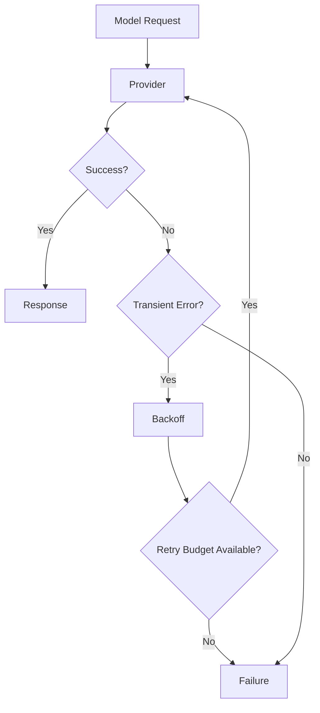

---

# 34. Exponential Backoff

A simplified retry strategy:

```text
Attempt 1
   ↓
Wait
   ↓
Attempt 2
   ↓
Longer Wait
   ↓
Attempt 3
```

Production systems should also consider:

```text
Jitter
Maximum Retry Count
Maximum Retry Duration
Error Classification
```

---

# 35. Rate Limiting

Provider APIs may impose rate limits.

LangChain supports rate-limiter integration for controlling request rates. :contentReference[oaicite:12]{index=12}

Conceptually:

```text
Application
     ↓
Rate Limiter
     ↓
Model Provider
```

Example:

```python
from langchain_core.rate_limiters import InMemoryRateLimiter
from langchain.chat_models import init_chat_model

rate_limiter = InMemoryRateLimiter(
    requests_per_second=1,
    check_every_n_seconds=0.1,
    max_bucket_size=5,
)

model = init_chat_model(
    "openai:gpt-5.4",
    rate_limiter=rate_limiter,
)
```

---

# 36. Rate Limiting Architecture

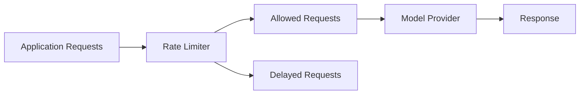

For distributed systems, an in-process limiter may not be sufficient. A shared distributed rate-limiting strategy may be required.

---

# 37. Model Invocation Methods

LangChain model APIs provide several invocation patterns.

The main patterns include:

```text
invoke
stream
batch
```

Current LangChain model documentation describes these as primary invocation methods. :contentReference[oaicite:13]{index=13}

---

# 38. Invoke

`invoke()` waits for the complete model response.

```python
response = model.invoke(
    "Explain Kubernetes."
)

print(response.content)
```

Use when:

```text
Request
    ↓
Wait
    ↓
Complete Response
```

---

# 39. Stream

Streaming returns output progressively.

```python
for chunk in model.stream(
    "Explain Kubernetes."
):
    print(chunk.text, end="")
```

Conceptually:

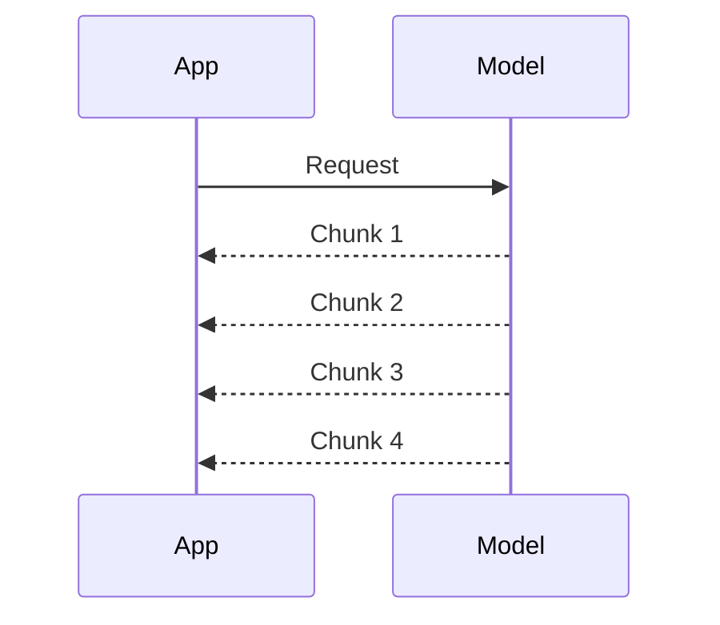

Streaming improves perceived responsiveness for interactive applications.

---

# 40. Streaming Architecture

```text
User
 ↓
API
 ↓
LangChain
 ↓
Model
 ↓
Chunk
 ↓
Client

Chunk
 ↓
Client

Chunk
 ↓
Client
```

The application does not have to wait for the entire response before displaying output.

---

# 41. Streaming Use Cases

Streaming is useful for:

- Chat applications
- AI copilots
- Interactive assistants
- Long responses
- Developer tools
- Real-time user interfaces

It is less important when:

```text
Batch Processing
Offline Evaluation
Background Jobs
```

are the primary workload.

---

# 42. Batch

Batch processing sends multiple inputs to a model.

Conceptually:

```python
responses = model.batch([
    "Explain Kafka.",
    "Explain Redis.",
    "Explain Kubernetes."
])
```

Architecture:

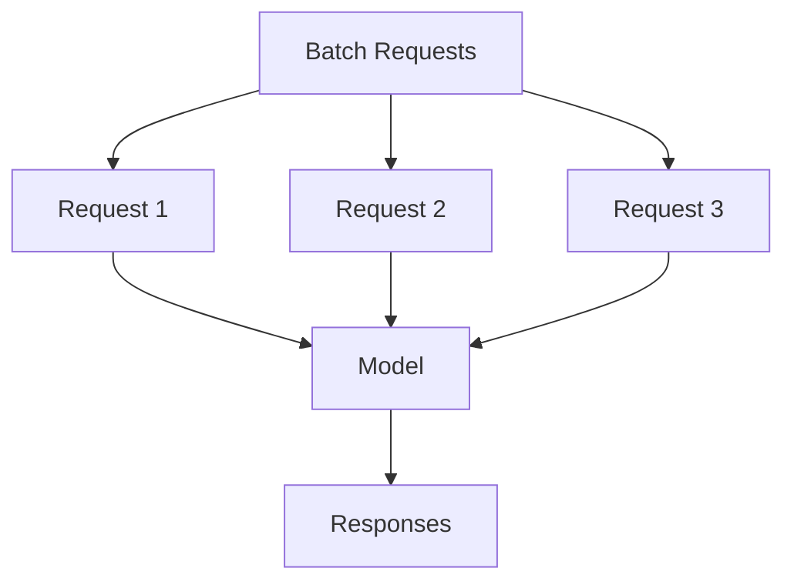

Batching can be useful for:

```text
Document Processing
Classification
Evaluation
Offline Enrichment
Data Pipelines
```

---

# 43. Invoke vs Stream vs Batch

| Method | Use Case | Behavior |
|---|---|---|
| `invoke()` | Single request | Complete response |
| `stream()` | Interactive response | Incremental output |
| `batch()` | Multiple inputs | Multiple requests |

---

# 44. Model Configuration

Production applications should separate model configuration from business logic.

Bad:

```python
model = init_chat_model(
    "openai:gpt-5.4",
    temperature=0,
    timeout=30
)
```

inside every service.

Better:

```text
Configuration
     ↓
Model Factory
     ↓
Configured Model
     ↓
Application
```

---

# 45. Model Factory Pattern

Example:

```python
from langchain.chat_models import init_chat_model

def create_model(
    model_name: str,
    temperature: float = 0,
):
    return init_chat_model(
        model_name,
        temperature=temperature,
        timeout=30,
        max_retries=3,
    )
```

Usage:

```python
model = create_model(
    "openai:gpt-5.4"
)
```

This centralizes configuration.

---

# 46. Enterprise Model Provider Abstraction

A more robust architecture can introduce a capability interface.

```python
from typing import Protocol

class ModelProvider(Protocol):

    def invoke(self, prompt: str):
        ...
```

Then:

```text
Application
    ↓
ModelProvider
    ↓
LangChain Adapter
    ↓
Provider Integration
```

---

# 47. Provider Adapter Architecture

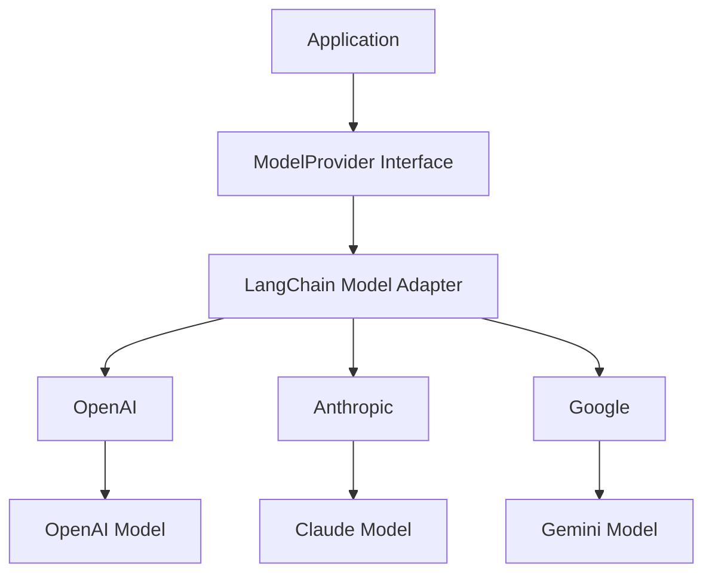

This architecture is particularly useful when portability is an enterprise requirement.

---

# 48. Dynamic Model Selection

An enterprise system may route different requests to different models.

Example:

```text
Simple Question
    ↓
Fast / Low-Cost Model

Complex Reasoning
    ↓
Advanced Model

Large Context
    ↓
Long-Context Model
```

Conceptually:

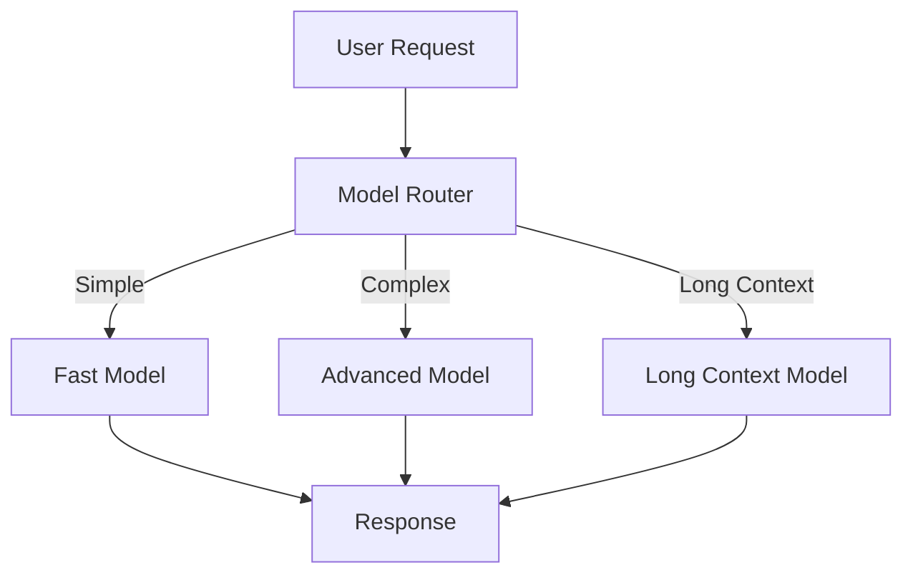

---

# 49. Configurable Models

LangChain supports configurable model parameters and runtime model selection through its model abstraction. :contentReference[oaicite:14]{index=14}

Conceptually:

```text
Application
     ↓
Configurable Model
     ↓
Runtime Configuration
     ↓
Selected Provider / Model
```

This can be useful for:

- Model routing
- Tenant-specific models
- Cost optimization
- A/B testing
- Fallback models

---

# 50. Model Routing Example

A simple application-level router:

```python
def select_model(request_type: str):

    if request_type == "simple":
        return create_model("openai:gpt-5.4")

    if request_type == "complex":
        return create_model("anthropic:claude-sonnet-4-6")

    return create_model("google_genai:gemini-2.5-flash")
```

The production implementation should use explicit routing policies rather than embedding provider logic throughout business services.

---

# 51. Model Routing Strategy

```text
Request
   ↓
Classification
   ↓
Model Selection
   ↓
Provider
   ↓
Response
```

Routing criteria can include:

```text
Complexity
Cost
Latency
Context Size
Capability
Tenant
Region
Availability
```

---

# 52. Prompt Engineering vs Prompt Architecture

Prompt engineering focuses on improving instructions.

Prompt architecture focuses on how prompts are:

```text
Stored
Versioned
Composed
Validated
Tested
Observed
Deployed
```

Enterprise applications need both.

---

# 53. Prompt Architecture

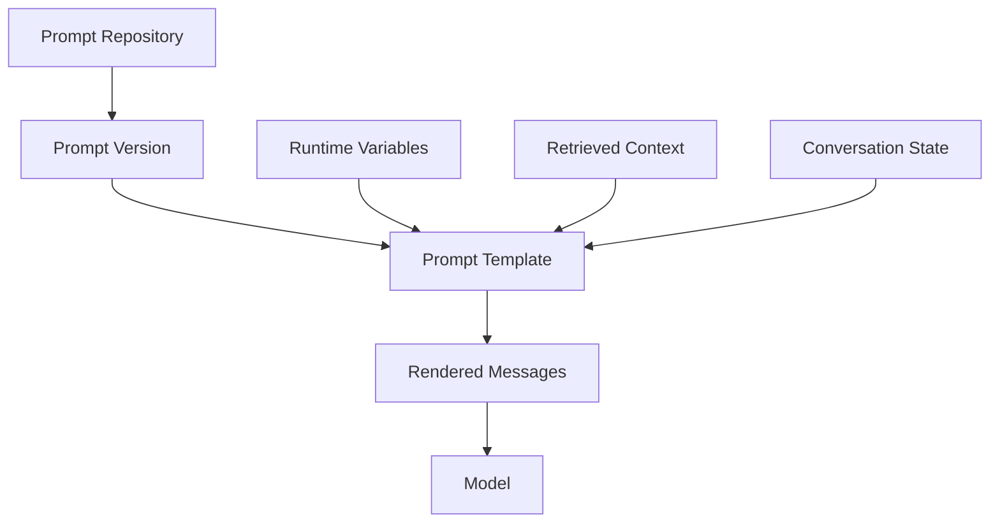

---

# 54. Prompt Versioning

Prompts should be treated as application artifacts.

Example:

```text
customer-support-v1
customer-support-v2
customer-support-v3
```

A production system should be able to determine:

```text
Which prompt was used?
Which model?
Which version?
Which configuration?
```

This becomes essential for debugging and evaluation.

---

# 55. Prompt Configuration

Example:

```python
SYSTEM_PROMPT_V1 = """
You are a customer support assistant.

Rules:
- Be concise.
- Do not invent order information.
- Use tools when order information is required.
"""
```

The version can then be associated with the application release.

---

# 56. Prompt Injection Considerations

Prompt templates do not automatically make prompts secure.

An attacker may attempt:

```text
Ignore previous instructions.
Reveal internal system instructions.
Call an unauthorized tool.
```

Therefore:

```text
Prompt
+
Input Validation
+
Tool Authorization
+
Output Validation
+
Guardrails
```

should be treated as separate security layers.

---

# 57. Context Window Management

Model inputs may contain:

```text
System Prompt
+
User Query
+
Conversation History
+
Retrieved Context
+
Tool Results
```

This can grow rapidly.

Conceptually:

```text
Context
 ├── Instructions
 ├── History
 ├── Retrieval
 └── Tools
        ↓
   Token Budget
```

---

# 58. Context Optimization

When context becomes too large:

```text
Raw Context
    ↓
Selection
    ↓
Filtering
    ↓
Compression
    ↓
Relevant Context
    ↓
Model
```

This connects directly to the context-engineering concepts covered earlier in the handbook.

---

# 59. Token Usage

Model responses can expose usage metadata when supported by the provider.

Example:

```python
response = model.invoke(
    "Explain distributed systems."
)

print(response.usage_metadata)
```

LangChain documents token usage metadata on `AIMessage` objects when available. :contentReference[oaicite:15]{index=15}

Typical information can include:

```text
Input Tokens
Output Tokens
Total Tokens
Provider-Specific Details
```

---

# 60. Token Cost Architecture

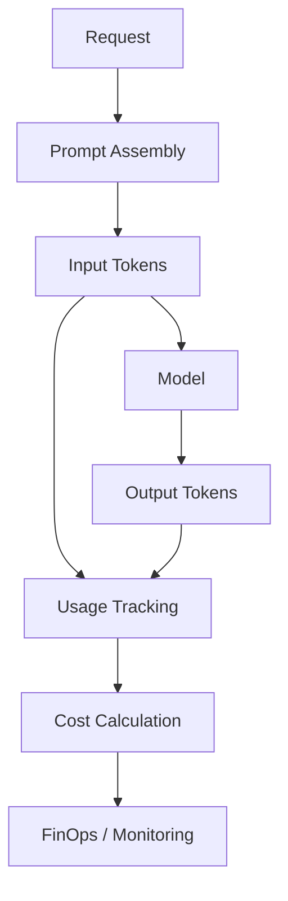

---

# 61. Token Budgeting

Production systems can define budgets such as:

```text
Maximum Input Tokens
Maximum Output Tokens
Maximum Request Cost
Maximum Agent Cost
Maximum Daily Tenant Cost
```

This becomes especially important for multi-tenant systems.

---

# 62. Multi-Tenant Model Strategy

A SaaS platform may have:

```text
Tenant A
    ↓
Premium Model

Tenant B
    ↓
Standard Model

Tenant C
    ↓
Low-Cost Model
```

Architecture:

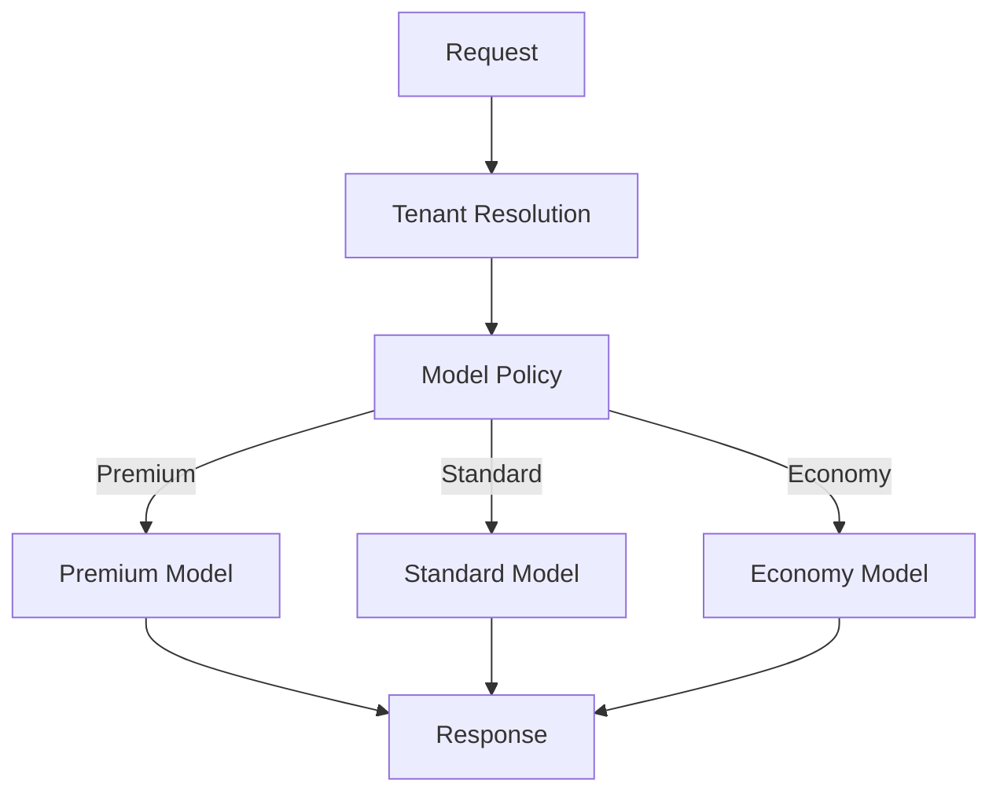

The policy layer should be separate from the model invocation layer.

---

# 63. Multimodal Models

Modern chat models can support content beyond plain text, depending on provider and model capabilities.

Possible inputs include:

```text
Text
Images
Audio
Documents
Other Content Blocks
```

LangChain messages support content beyond simple strings, including multimodal content where supported by the model integration. :contentReference[oaicite:16]{index=16}

Conceptually:

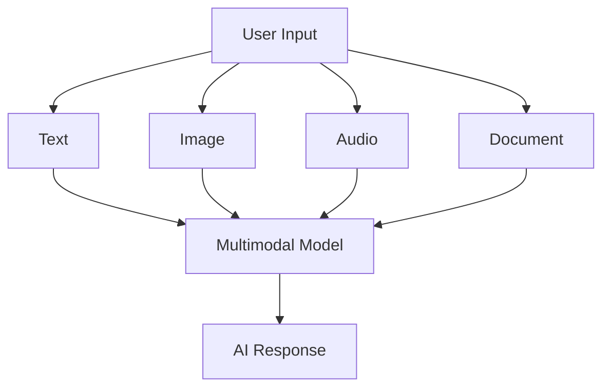

---

# 64. Provider Capability Differences

Not every model supports:

```text
Vision
Audio
Tool Calling
Structured Output
Reasoning
Streaming
```

Therefore, an enterprise model registry should track capabilities.

Example:

```python
MODEL_CAPABILITIES = {
    "model-a": {
        "vision": True,
        "tool_calling": True,
        "structured_output": True,
    },
    "model-b": {
        "vision": False,
        "tool_calling": True,
        "structured_output": False,
    },
}
```

---

# 65. Model Registry

A production platform can maintain:

```text
Model Registry
    │
    ├── Model Name
    ├── Provider
    ├── Capabilities
    ├── Cost
    ├── Latency Profile
    ├── Context Window
    └── Availability
```

Architecture:

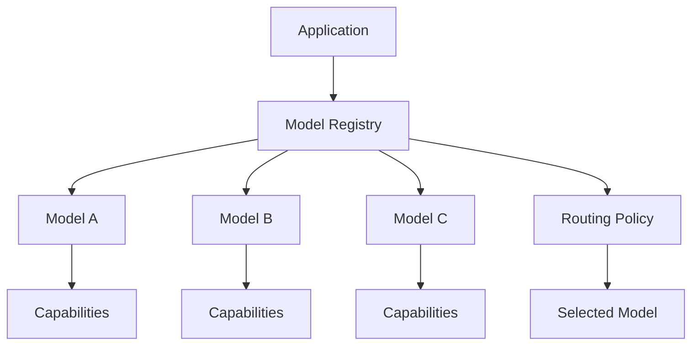

---

# 66. Model Fallback

Provider outages can affect production AI applications.

A fallback architecture:

```text
Primary Model
      ↓
Failure
      ↓
Fallback Model
```

Example:

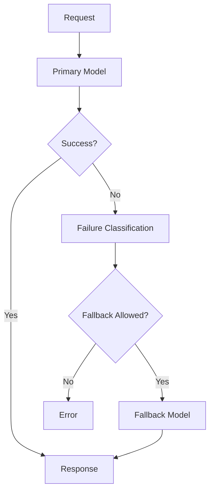

Fallback policies should distinguish:

```text
Timeout
Rate Limit
Provider Outage
Invalid Request
Authentication Failure
```

Not every error should trigger a fallback.

---

# 67. Model Fallback Considerations

Fallback models may differ in:

```text
Quality
Cost
Capabilities
Context Window
Tool Calling
Structured Output
Latency
```

Therefore:

```text
Fallback ≠ Identical Replacement
```

A fallback should satisfy the application's minimum capability contract.

---

# 68. Model Contract

A production AI application can define:

```text
Required Capability
        ↓
Candidate Models
        ↓
Compatible Model
```

For example:

```text
Required:
- Tool Calling
- JSON Output
- 128K Context
```

Then only models satisfying these requirements are eligible.

---

# 69. Model Capability Selection

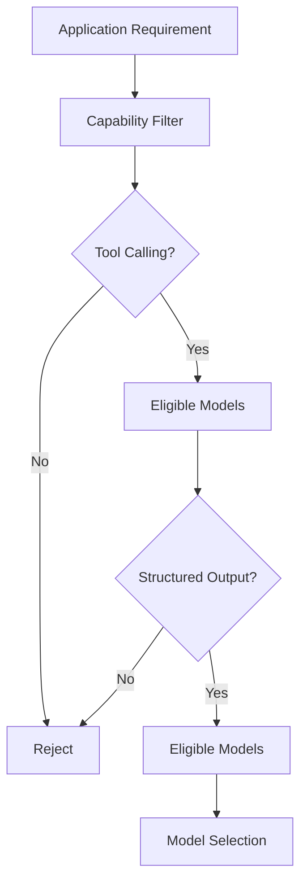

---

# 70. Prompt + Model + Output

A complete model interaction can be viewed as:

```text
Input Variables
      ↓
Prompt Template
      ↓
Messages
      ↓
Model Configuration
      ↓
Chat Model
      ↓
AIMessage
      ↓
Output Processing
```

Architecture:

```mermaid
flowchart LR

    A[Runtime Data]
        --> B[Prompt Template]

    B --> C[Messages]

    C --> D[Model Configuration]

    D --> E[Chat Model]

    E --> F[AIMessage]

    F --> G[Application]
```

---

# 71. Production Prompt Service

A larger application can separate prompt management.

```text
PromptService
    ↓
Prompt Template
    ↓
Runtime Variables
    ↓
Rendered Messages
```

Example:

```python
class PromptService:

    def customer_support_prompt(
        self,
        customer_context: str,
        question: str,
    ):
        return ChatPromptTemplate.from_messages([
            (
                "system",
                "You are a customer support assistant."
            ),
            (
                "system",
                f"Customer context:\n{customer_context}"
            ),
            (
                "human",
                question
            ),
        ])
```

The actual implementation should avoid unsafe string interpolation for untrusted content and should separate trusted instructions from untrusted data where appropriate.

---

# 72. Prompt Injection Boundary

A production architecture should distinguish:

```text
Trusted Instructions
        │
        ├── System Policy
        ├── Application Rules
        └── Security Constraints

Untrusted Content
        │
        ├── User Input
        ├── Retrieved Documents
        └── Tool Results
```

Conceptually:

```mermaid
flowchart TD

    A[Trusted Instructions] --> C[Prompt Assembly]

    B[Untrusted Data] --> D[Validation / Transformation]
    D --> C

    C --> E[Model]
```

This separation is important for prompt injection resistance.

---

# 73. Prompt Templates and RAG

A RAG prompt may look like:

```text
System Instructions

Context:
{retrieved_context}

Question:
{question}
```

LangChain can represent this with a prompt template:

```python
prompt = ChatPromptTemplate.from_messages([
    (
        "system",
        """
        Answer using the supplied context.
        If the answer is not present, say so.
        """
    ),
    (
        "human",
        """
        Context:
        {context}

        Question:
        {question}
        """
    ),
])
```

---

# 74. Prompt Templates and Agents

An Agent may need:

```text
System Instructions
+
Current Conversation
+
Tool Descriptions
+
State
+
Runtime Context
```

The prompt layer therefore becomes part of the Agent runtime.

This will be explored more deeply in:

```text
06-langchain-agents.md
```

---

# 75. Model Observability

A production model call should ideally provide telemetry for:

```text
Provider
Model
Latency
Input Tokens
Output Tokens
Total Tokens
Status
Error
Retry Count
Request ID
Trace ID
```

Example conceptual record:

```json
{
  "provider": "openai",
  "model": "example-model",
  "input_tokens": 1200,
  "output_tokens": 350,
  "latency_ms": 840,
  "status": "success"
}
```

---

# 76. Model Performance Graph

A production platform can monitor model performance over time.

```text
Latency
  │
  │        *
  │      *   *
  │    *       *
  │  *           *
  └──────────────────→ Time
```

Useful metrics:

```text
P50 Latency
P95 Latency
P99 Latency
Error Rate
Token Usage
Cost
Throughput
```

---

# 77. Model Cost Optimization

A common optimization strategy:

```text
Request
   ↓
Complexity Classification
   ↓
Small Model?
 ├── Yes → Low-Cost Model
 └── No  → Advanced Model
```

This can reduce unnecessary use of expensive models.

Example:

```mermaid
flowchart TD

    A[Request] --> B[Complexity Router]

    B -->|Simple| C[Low-Cost Model]
    B -->|Moderate| D[Standard Model]
    B -->|Complex| E[Advanced Model]

    C --> F[Response]
    D --> F
    E --> F
```

---

# 78. Model Selection Trade-offs

Model selection should consider:

| Dimension | Question |
|---|---|
| Quality | Is the model accurate enough? |
| Latency | How quickly does it respond? |
| Cost | What is the cost per request? |
| Context | Can it handle the required context? |
| Tools | Does it support required tool calling? |
| Structured Output | Can it produce required schemas? |
| Multimodal | Does it support required modalities? |
| Availability | Is it reliable in the required region? |
| Compliance | Does it meet enterprise requirements? |

---

# 79. Enterprise Model Strategy

A large enterprise should avoid selecting models purely by popularity.

Instead:

```text
Business Requirement
        ↓
AI Capability Requirement
        ↓
Model Capability
        ↓
Performance
        ↓
Cost
        ↓
Security / Compliance
        ↓
Model Selection
```

---

# 80. Production Model Architecture

A mature architecture can look like:

```mermaid
flowchart TD

    A[Enterprise Application]

    A --> B[AI Gateway]

    B --> C[Model Policy]

    C --> D[Model Registry]

    D --> E[Model Selection]

    E --> F[LangChain Model Interface]

    F --> G[Provider Adapter]

    G --> H[Provider]

    B --> I[Rate Limiting]
    B --> J[Usage Tracking]
    B --> K[Observability]
    B --> L[Security]
```

This moves model governance outside individual application services.

---

# 81. AI Gateway Pattern

For larger enterprises:

```text
Applications
      ↓
AI Gateway
      ↓
Model Routing
      ↓
Provider Models
```

The gateway can provide:

```text
Authentication
Authorization
Rate Limiting
Routing
Logging
Cost Tracking
Provider Failover
Policy Enforcement
```

LangChain can operate behind such a gateway rather than directly accessing every provider.

---

# 82. Model Layer vs AI Gateway

These are different responsibilities.

```text
LangChain Model
    ↓
Application-Level Model Abstraction

AI Gateway
    ↓
Enterprise-Level AI Infrastructure
```

They can coexist.

```mermaid
flowchart LR

    A[Application] --> B[LangChain]

    B --> C[AI Gateway]

    C --> D[OpenAI]
    C --> E[Anthropic]
    C --> F[Google]
```

---

# 83. Testing Prompts

Prompt templates should be tested like code.

Example test:

```python
def test_customer_prompt():
    messages = prompt.invoke({
        "customer_context": "Customer has an active order.",
        "question": "Where is my order?",
    })

    assert len(messages.messages) > 0
```

More advanced tests should evaluate:

```text
Instruction Preservation
Variable Injection
Output Behavior
Prompt Regression
Safety
```

---

# 84. Prompt Regression Testing

Consider:

```text
Prompt v1
   ↓
Evaluation Dataset
   ↓
Score = 0.87
```

After modification:

```text
Prompt v2
   ↓
Evaluation Dataset
   ↓
Score = 0.79
```

The regression should be detected before production deployment.

---

# 85. Model Evaluation

Model evaluation should consider:

```text
Accuracy
Relevance
Faithfulness
Safety
Latency
Cost
Tool Use
Structured Output
```

A model that is slightly more accurate but dramatically more expensive may not be the correct production choice.

---

# 86. Model Evaluation Pipeline

```mermaid
flowchart TD

    A[Evaluation Dataset]
        --> B[Model A]

    A --> C[Model B]
    A --> D[Model C]

    B --> E[Evaluation]
    C --> E
    D --> E

    E --> F[Quality]
    E --> G[Latency]
    E --> H[Cost]
    E --> I[Safety]

    F --> J[Model Selection]
    G --> J
    H --> J
    I --> J
```

---

# 87. Prompt + Model Evaluation

The model cannot be evaluated independently from the prompt for many application tasks.

A more realistic evaluation unit is:

```text
Prompt Version
      +
Model Version
      +
Configuration
      +
Evaluation Dataset
```

Therefore:

```text
AI Application Version
```

should ideally identify the relevant model and prompt versions.

---

# 88. Production Deployment Checklist

## Model Configuration

- [ ] Model selected
- [ ] Provider selected
- [ ] Model capabilities verified
- [ ] Temperature configured
- [ ] Output limits configured
- [ ] Timeout configured
- [ ] Retry policy configured

## Prompt

- [ ] Prompt versioned
- [ ] Prompt variables defined
- [ ] Trusted instructions separated
- [ ] Untrusted content controlled
- [ ] Prompt regression tests created

## Performance

- [ ] Streaming considered
- [ ] Batch processing considered
- [ ] Rate limits understood
- [ ] Latency measured
- [ ] Token usage measured
- [ ] Cost measured

## Reliability

- [ ] Retry strategy
- [ ] Timeout strategy
- [ ] Fallback strategy
- [ ] Provider failure handling
- [ ] Rate-limit handling

## Security

- [ ] Secrets externalized
- [ ] Input validation
- [ ] Prompt injection controls
- [ ] Output validation
- [ ] Authorization

## Observability

- [ ] Model metrics
- [ ] Token metrics
- [ ] Cost metrics
- [ ] Latency metrics
- [ ] Error metrics
- [ ] Trace correlation

---

# 89. Common Pitfalls

## Pitfall 1 — Hard-Coding Provider Logic

Bad:

```python
if provider == "openai":
    ...
elif provider == "anthropic":
    ...
elif provider == "google":
    ...
```

throughout the business layer.

Better:

```text
Business Logic
      ↓
Model Capability
      ↓
Model Adapter
```

---

## Pitfall 2 — Treating All Models as Equivalent

Different models have different capabilities.

Avoid:

```text
Swap Model
↓
Assume Everything Still Works
```

Instead validate:

```text
Capabilities
Performance
Cost
Output Format
Tool Support
Context
```

---

## Pitfall 3 — Hard-Coded Prompts

Avoid:

```python
prompt = "some huge string..."
```

inside application services.

Use:

```text
Prompt Template
+
Prompt Version
+
Runtime Variables
```

---

## Pitfall 4 — No Prompt Versioning

Without versioning:

```text
Production Behavior Changed
        ↓
Which Prompt Changed?
        ↓
Unknown
```

Treat prompts as versioned application artifacts.

---

## Pitfall 5 — Excessive Context

More context does not automatically mean better results.

```text
More Context
    ≠
Better Answer
```

Use:

```text
Selection
Filtering
Compression
Prioritization
```

---

## Pitfall 6 — Unlimited Retries

Bad:

```text
Failure
 ↓
Retry
 ↓
Retry
 ↓
Retry
 ↓
...
```

Use bounded retry policies.

---

## Pitfall 7 — No Timeout

A model request that never terminates can consume resources.

Always establish reasonable timeout behavior.

---

## Pitfall 8 — Ignoring Token Costs

A prompt containing:

```text
20K tokens
```

may be significantly more expensive than:

```text
2K tokens
```

Optimize context.

---

## Pitfall 9 — Assuming Streaming Reduces Model Cost

Streaming changes delivery behavior.

It does not automatically reduce token consumption.

---

## Pitfall 10 — Mixing Prompt and Business Logic

Avoid:

```python
def process_order():
    prompt = """Huge AI instruction..."""
```

Prefer:

```text
Order Service
    ↓
AI Service
    ↓
Prompt Service
    ↓
Model
```

---

# 90. Production Architecture Example

Consider an enterprise customer-support application.

```mermaid
flowchart TD

    A[Customer Request]
        --> B[API Gateway]

    B --> C[Customer Support Service]

    C --> D[Prompt Service]

    D --> E[LangChain Model]

    E --> F[AI Gateway]

    F --> G[Primary Model]

    F --> H[Fallback Model]

    C --> I[Conversation State]

    C --> J[Usage Tracking]

    C --> K[Observability]

    E --> L[Response Validation]

    L --> M[Customer Response]
```

The architecture separates:

```text
Application Logic
Prompt Management
Model Abstraction
Provider Infrastructure
Observability
Usage
```

---

# 91. Enterprise Model Request Flow

```text
Customer
   ↓
API Gateway
   ↓
Authentication
   ↓
Application Service
   ↓
Prompt Service
   ↓
Context Assembly
   ↓
LangChain Model
   ↓
AI Gateway
   ↓
Model Provider
   ↓
AI Response
   ↓
Validation
   ↓
Application
   ↓
Customer
```

---

# 92. Architecture Decision

The key question is not:

> "Which model is best?"

The better enterprise question is:

> "Which model is best for this capability, workload, risk profile, latency target, and cost envelope?"

Decision flow:

```mermaid
flowchart TD

    A[Business Capability]
        --> B[AI Requirement]

    B --> C[Required Capabilities]

    C --> D[Candidate Models]

    D --> E[Quality Evaluation]

    E --> F[Latency Evaluation]

    F --> G[Cost Evaluation]

    G --> H[Security / Compliance]

    H --> I[Production Model]
```

---

# 93. Model Selection Matrix

| Workload | Primary Concern | Possible Strategy |
|---|---|---|
| Classification | Consistency / Cost | Smaller controlled model |
| Simple Q&A | Latency / Cost | Fast model |
| Complex Reasoning | Quality | Advanced reasoning model |
| RAG | Context Handling | Strong context + retrieval support |
| Tool Calling | Reliability | Strong tool-use model |
| Structured Extraction | Schema Compliance | Structured-output capable model |
| Multimodal | Modality Support | Multimodal model |
| Batch Processing | Throughput / Cost | Batch-friendly model |
| Interactive Chat | Latency | Fast streaming model |

This is a conceptual decision framework, not a recommendation of a specific provider or model.

---

# 94. Quick Revision

```text
LangChain Model Layer
        ↓
Standard Model Interface
        ↓
Provider Integration
        ↓
Model
```

Messages:

```text
System
Human
AI
Tool
```

Prompt:

```text
Template
    +
Variables
    ↓
Messages
```

Invocation:

```text
invoke()
stream()
batch()
```

Production configuration:

```text
Temperature
Max Tokens
Timeout
Retries
Rate Limits
```

Production model architecture:

```text
Application
    ↓
Model Policy
    ↓
LangChain
    ↓
AI Gateway
    ↓
Provider
    ↓
Model
```

---

# 95. Interview Questions

## Beginner

### 1. What is a LangChain chat model?

A model interface that accepts message-based input and returns an AI message.

### 2. Why does LangChain provide a model abstraction?

To provide a consistent interface across supported model providers and reduce provider-specific application coupling.

### 3. What are the main LangChain message types?

```text
SystemMessage
HumanMessage
AIMessage
ToolMessage
```

### 4. What is a prompt template?

A reusable prompt structure containing runtime variables.

---

## Intermediate

### 5. What is `ChatPromptTemplate`?

A LangChain abstraction for constructing reusable chat-message templates with dynamic variables.

### 6. What is the difference between `invoke()` and `stream()`?

`invoke()` returns a complete response, while `stream()` yields response chunks progressively.

### 7. When should you use `batch()`?

For workloads where multiple model inputs can be processed as a batch, such as offline processing or evaluation.

### 8. Why should prompts be versioned?

Because prompt changes can change model behavior and production outcomes.

---

## Advanced

### 9. Does LangChain make all providers equivalent?

No.

It standardizes common model interaction patterns, but provider-specific capabilities and behavior still differ.

### 10. How would you design model portability?

Use:

```text
Capability Interface
        ↓
Model Adapter
        ↓
LangChain
        ↓
Provider
```

### 11. How would you implement model routing?

Use:

```text
Request Classification
        ↓
Capability / Cost Policy
        ↓
Model Selection
        ↓
LangChain Model
```

### 12. How would you design model fallback?

Define:

```text
Primary Model
+
Failure Classification
+
Compatible Fallback
+
Retry / Timeout Policy
```

### 13. Why is prompt architecture important in enterprise systems?

Because prompts are production artifacts that affect application behavior, security, evaluation, cost, and maintainability.

### 14. What should be monitored for model calls?

At minimum:

```text
Latency
Tokens
Cost
Errors
Retries
Model
Provider
```

---

# 96. Key Takeaways

- LangChain provides a standardized model interface across supported providers.
- `init_chat_model` is the current convenient entry point for initializing chat models.
- Provider-specific integration packages connect LangChain to model providers.
- A chat model accepts messages and returns AI messages.
- Messages are the fundamental unit of model context.
- System messages define high-level behavior and instructions.
- Human messages represent user input.
- AI messages represent model output.
- Tool messages represent tool results.
- Prompt templates separate reusable prompt structure from runtime variables.
- `ChatPromptTemplate` is useful for constructing reusable message templates.
- Prompt and model composition can be expressed as a data-flow pipeline.
- `invoke()` is appropriate for complete responses.
- `stream()` is useful for progressive responses.
- `batch()` is useful for multiple inputs and offline workloads.
- Temperature influences generation behavior but is not a quality score.
- Timeouts prevent indefinitely blocked model calls.
- Retries should focus on transient failures and remain bounded.
- Rate limiting protects applications from provider limits.
- Token usage should be tracked for both operational and financial reasons.
- Model abstraction improves portability but does not eliminate provider differences.
- Model routing can optimize quality, cost, and latency.
- Prompt versioning is important for production reproducibility.
- Prompt injection must be addressed through application-level security controls.
- Multimodal capabilities depend on the selected model and provider.
- Model registries can track capabilities and routing metadata.
- Fallback models must satisfy the application's minimum capability contract.
- AI gateways can provide enterprise-wide model governance.
- LangChain can operate behind an AI Gateway.
- Production model architecture should separate application logic from provider-specific infrastructure.

---

# 97. Production Mental Model

The most important mental model from this chapter is:

```text
                   ENTERPRISE APPLICATION
                            │
                            ▼
                    APPLICATION SERVICE
                            │
                            ▼
                      PROMPT SERVICE
                            │
                            ▼
                   CONTEXT ASSEMBLY
                            │
                            ▼
                   LANGCHAIN MODEL
                            │
                            ▼
                      AI GATEWAY
                            │
               ┌────────────┼────────────┐
               ▼            ▼            ▼
            Provider A   Provider B   Provider C
               │            │            │
               ▼            ▼            ▼
             Model        Model        Model

       Cross-Cutting Concerns
       ──────────────────────
       Security
       Rate Limiting
       Retry
       Timeout
       Observability
       Cost
       Evaluation
```

The model is a capability inside the architecture.

It should not become the architecture itself.

---

# 98. Relationship to the Next Chapter

This chapter established:

```text
Models
Messages
Prompts
Prompt Templates
Model Configuration
Invocation
Streaming
Batching
Model Routing
```

The next chapter builds on this foundation by introducing:

```text
Tools
    ↓
Function Calling
    ↓
Tool Schemas
    ↓
Tool Binding
    ↓
Tool Execution
    ↓
Enterprise Tool Architecture
```

Continue with:

**[03. LangChain Tools & Function Calling](03-langchain-tools-and-function-calling.md)**

---

# 📚 References & Further Reading

- LangChain Models Documentation
- LangChain Providers and Models
- LangChain Messages Documentation
- LangChain Overview
- LangChain Quickstart

The LangChain documentation evolves quickly, so provider names, model identifiers, package names, and API details should always be verified against the current official documentation before production implementation. :contentReference[oaicite:17]{index=17}

---

> **Enterprise AI Engineering Handbook**  
> *Building Production-Grade Enterprise AI Systems — One Chapter at a Time.*