# 03 — LangChain Tools & Function Calling

> Understand how LangChain enables LLMs to interact with external capabilities through tools and function calling, and learn how to design, execute, secure, observe, and scale tool-enabled Enterprise AI applications.

---

## 📖 Overview

An LLM by itself is primarily a reasoning and generation engine.

It can:

```text
Understand
Reason
Generate
Summarize
Classify
Extract
```

But an enterprise AI application often needs to **do things**:

```text
Query a database
Call a REST API
Search documents
Check an order
Retrieve customer information
Calculate values
Create a ticket
Send an email
Trigger a workflow
Execute an approved business operation
```

Tools provide this connection between the model and the external world.

LangChain defines tools as callable functions with well-defined inputs and outputs that can be presented to a chat model. The model can decide when a tool should be invoked and what arguments should be supplied. :contentReference[oaicite:0]{index=0}

The fundamental architecture is:

```text
User
  ↓
LLM
  ↓
Tool Call
  ↓
Tool Execution
  ↓
Tool Result
  ↓
LLM
  ↓
Final Response
```

This chapter focuses on the **tool layer** and **function/tool calling mechanism**.

Agent orchestration itself is covered separately in the AI Agents and LangChain Agent chapters.

---

# 🎯 Learning Objectives

After completing this chapter, you will be able to:

- Understand what a LangChain Tool is
- Understand Tool Calling
- Understand Function Calling terminology
- Create custom tools
- Define tool schemas
- Use type hints and docstrings effectively
- Bind tools to models
- Inspect model-generated tool calls
- Execute tools manually
- Return tool results to models
- Understand `ToolMessage`
- Understand tool call IDs
- Handle multiple tool calls
- Understand parallel tool execution
- Understand tool calling with streaming
- Understand tool errors
- Design secure enterprise tools
- Apply authorization and validation
- Understand tool idempotency
- Design tool gateways
- Observe tool execution
- Control tool costs and latency
- Understand server-side tools
- Understand tool state and runtime context
- Design production-ready tool architectures

---

# 1. What Is a Tool?

A tool is a callable capability that an AI model can request.

Examples:

```text
get_customer()
get_order()
search_products()
get_weather()
calculate_tax()
create_ticket()
query_database()
send_notification()
```

Conceptually:

```text
Tool
 ├── Name
 ├── Description
 ├── Input Schema
 └── Execution Logic
```

LangChain's documentation describes a tool as a callable function with well-defined inputs and outputs that are passed to a chat model. :contentReference[oaicite:1]{index=1}

---

# 2. Why Do LLMs Need Tools?

An LLM has limited access to external state.

For example, suppose a user asks:

```text
Where is my order ORD-1001?
```

The model cannot reliably know the current order status from its training data.

It needs:

```text
Order Service
```

Therefore:

```text
User
 ↓
LLM
 ↓
get_order_status()
 ↓
Order Service
 ↓
Current Order Status
 ↓
LLM
 ↓
Answer
```

---

# 3. LLM Without Tools

```text
User
  ↓
LLM
  ↓
Generated Knowledge
  ↓
Response
```

The model can only work with:

```text
Prompt
+
Conversation
+
Provided Context
```

---

# 4. LLM With Tools

```text
User
  ↓
LLM
  ↓
Tool Selection
  ↓
External System
  ↓
Tool Result
  ↓
LLM
  ↓
Response
```

Architecture:

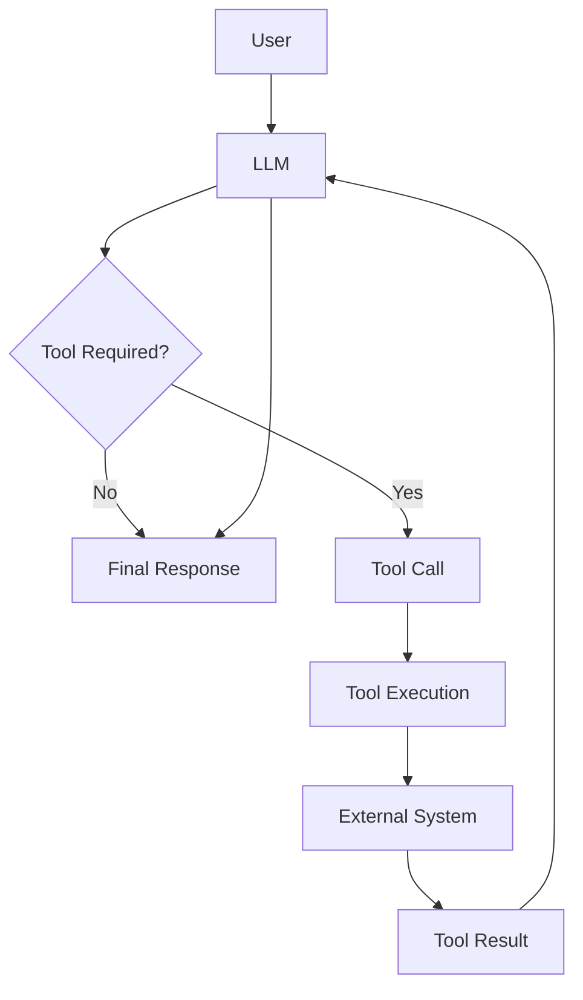

---

# 5. Tool Calling vs Function Calling

You will often see both terms:

```text
Tool Calling
Function Calling
```

In modern LangChain documentation, these terms are used interchangeably for the model capability of requesting a callable operation. :contentReference[oaicite:2]{index=2}

Historically, some providers called this capability:

```text
Function Calling
```

LangChain commonly uses:

```text
Tool Calling
```

The underlying idea is:

```text
Model
  ↓
Structured Request
  ↓
Application
  ↓
Function / Tool
```

---

# 6. Tool Calling Is Not Tool Execution

This distinction is extremely important.

The model does **not necessarily execute the function**.

The model produces a request:

```text
Tool:
get_order_status

Arguments:
order_id = ORD-1001
```

Then the application/runtime executes it.

Therefore:

```text
Model
    ↓
Tool Call
    ↓
Runtime
    ↓
Tool Execution
```

not:

```text
Model
    ↓
Direct Database Access
```

---

# 7. Tool Calling Architecture

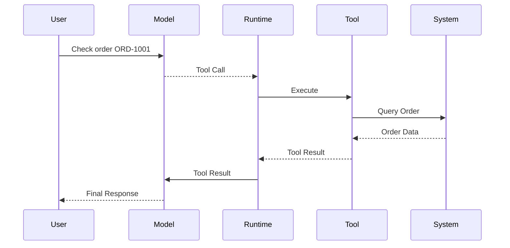

---

# 8. Creating a Basic Tool

LangChain provides the `@tool` decorator for defining tools. The function's type hints define its input schema, while the docstring provides information that helps the model understand the tool's purpose. :contentReference[oaicite:3]{index=3}

Example:

```python
from langchain.tools import tool


@tool
def get_weather(location: str) -> str:
    """Get the current weather for a location."""
    return f"The weather in {location} is sunny."
```

The resulting tool conceptually contains:

```text
Name:
get_weather

Description:
Get the current weather for a location.

Input:
location: string
```

---

# 9. Tool Schema

A tool's schema tells the model:

```text
What is this tool?
What arguments does it accept?
What type should each argument have?
```

Example:

```python
@tool
def get_customer(
    customer_id: str,
) -> str:
    """Retrieve customer information using the customer ID."""
    return f"Customer information for {customer_id}"
```

Schema:

```text
Tool:
get_customer

Input:
customer_id: string
```

---

# 10. Multiple Arguments

Tools can expose multiple parameters.

```python
@tool
def calculate_shipping(
    weight_kg: float,
    destination: str,
) -> str:
    """Calculate shipping cost for a package."""
    return f"Shipping cost for {weight_kg}kg to {destination}"
```

Conceptually:

```text
calculate_shipping
    │
    ├── weight_kg: float
    └── destination: string
```

---

# 11. Type Hints Matter

LangChain uses Python type hints to define tool input schemas. :contentReference[oaicite:4]{index=4}

Prefer:

```python
@tool
def get_order(
    order_id: str,
) -> str:
    ...
```

rather than:

```python
@tool
def get_order(
    order_id,
) -> str:
    ...
```

The first provides the model with explicit schema information.

---

# 12. Tool Descriptions Matter

The tool description helps the model decide when the tool should be used.

Weak:

```python
"""Order."""
```

Better:

```python
"""
Retrieve the current status of an order
using the order ID.
"""
```

The model needs to understand:

```text
Purpose
When to use
Required inputs
Expected behavior
```

---

# 13. Tool Naming

Use clear tool names.

Preferred:

```text
get_customer
get_order_status
search_products
create_support_ticket
```

Avoid ambiguous names:

```text
do_task
helper
process
execute
operation
```

LangChain's current documentation recommends `snake_case` tool names and notes that some providers have compatibility issues with spaces or special characters. :contentReference[oaicite:5]{index=5}

---

# 14. Tool Naming Convention

Recommended:

```text
<verb>_<resource>
```

Examples:

```text
get_customer
get_order
search_products
create_ticket
update_address
cancel_order
```

For actions:

```text
create_
update_
delete_
send_
approve_
```

For retrieval:

```text
get_
search_
find_
list_
```

---

# 15. Read vs Write Tools

A useful enterprise distinction:

### Read Tools

```text
get_customer()
get_order()
search_products()
get_balance()
```

### Write Tools

```text
create_ticket()
update_customer()
cancel_order()
issue_refund()
```

Write tools have higher risk because they can change external state.

---

# 16. Tool Risk Classification

A production system can classify tools:

```text
LOW
 ├── Read-only search

MEDIUM
 ├── Update metadata

HIGH
 ├── Financial transaction
 ├── Delete record
 └── Send external communication
```

Architecture:

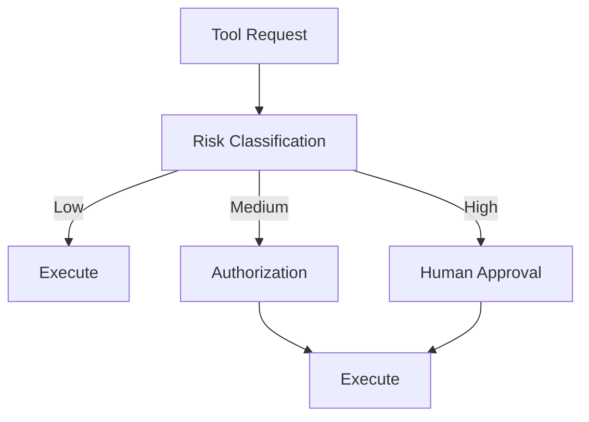

---

# 17. Binding Tools to a Model

Defining a tool is not enough.

The model must be made aware of the available tools.

LangChain uses `bind_tools()` to make tools available to a model. :contentReference[oaicite:6]{index=6}

Example:

```python
from langchain.tools import tool
from langchain.chat_models import init_chat_model


@tool
def get_weather(location: str) -> str:
    """Get the weather at a location."""
    return f"It's sunny in {location}."


model = init_chat_model(
    "openai:gpt-5.4"
)

model_with_tools = model.bind_tools(
    [get_weather]
)
```

---

# 18. Tool Binding Flow

```text
Tool Definition
      ↓
bind_tools()
      ↓
Model
      ↓
Tool-Aware Model
```

Architecture:

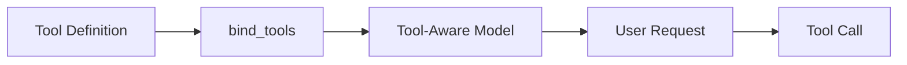

---

# 19. Invoking a Tool-Aware Model

```python
response = model_with_tools.invoke(
    "What's the weather in Kolkata?"
)
```

The model may decide:

```text
Tool:
get_weather

Arguments:
location = Kolkata
```

The response contains tool-call information.

---

# 20. Inspecting Tool Calls

LangChain's `AIMessage` can contain `tool_calls`.

Example:

```python
for tool_call in response.tool_calls:
    print("Tool:", tool_call["name"])
    print("Arguments:", tool_call["args"])
    print("ID:", tool_call["id"])
```

Current LangChain documentation describes tool calls as containing fields such as:

```text
name
args
id
```

:contentReference[oaicite:7]{index=7}

---

# 21. Tool Call Structure

Conceptually:

```json
{
  "name": "get_weather",
  "args": {
    "location": "Kolkata"
  },
  "id": "call_123"
}
```

This is a request to execute a tool.

It is not yet the result.

---

# 22. Tool Call Lifecycle

```text
1. User Request
        ↓
2. Model
        ↓
3. AIMessage with tool_calls
        ↓
4. Tool Execution
        ↓
5. ToolMessage
        ↓
6. Model
        ↓
7. Final AIMessage
```

---

# 23. Manual Tool Execution

When using a model directly rather than a higher-level Agent, the application is responsible for executing the requested tool and returning its result to the model. :contentReference[oaicite:8]{index=8}

Example:

```python
messages = [
    {
        "role": "user",
        "content": "What's the weather in Kolkata?"
    }
]

ai_msg = model_with_tools.invoke(messages)

messages.append(ai_msg)

for tool_call in ai_msg.tool_calls:
    tool_result = get_weather.invoke(tool_call)
    messages.append(tool_result)

final_response = model_with_tools.invoke(messages)

print(final_response.content)
```

---

# 24. Complete Tool Calling Flow

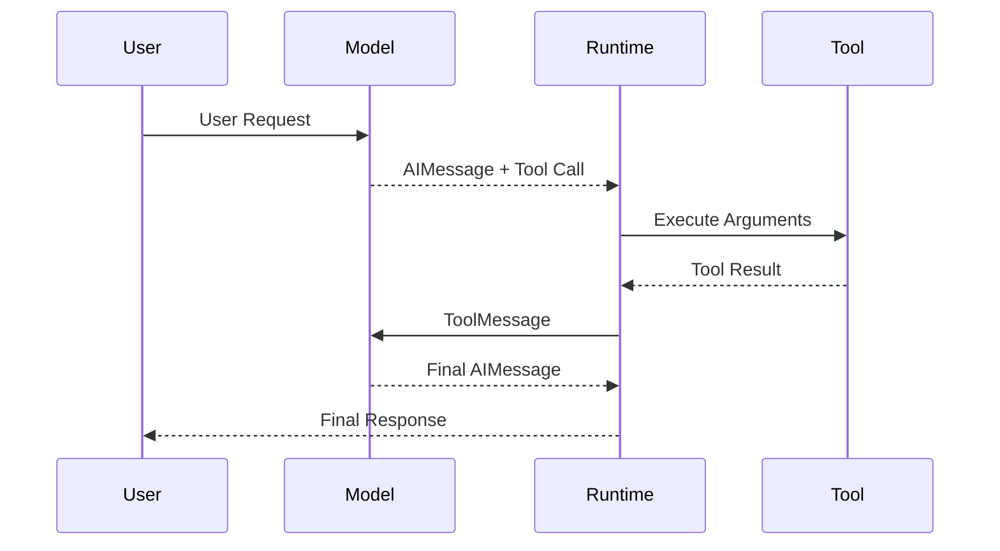

---

# 25. ToolMessage

A `ToolMessage` carries the result of a tool execution back to the model.

Conceptually:

```text
AIMessage
    ↓
tool_calls
    ↓
Tool Execution
    ↓
ToolMessage
```

A `ToolMessage` must correlate with the original tool call.

The key identifier is:

```text
tool_call_id
```

LangChain documentation specifies that this ID matches the corresponding tool call ID. :contentReference[oaicite:9]{index=9}

---

# 26. Tool Call ID

Example:

```text
AIMessage

tool_call:
    id = call_123
```

Tool result:

```text
ToolMessage

tool_call_id = call_123
```

Relationship:

```text
call_123
   │
   ├── AIMessage Tool Call
   │
   └── ToolMessage Result
```

This prevents tool results from becoming disconnected from the requested operation.

---

# 27. Why Tool Call IDs Matter

Imagine the model requests:

```text
get_customer(C100)
get_order(O200)
```

Two tools may execute.

The application must know:

```text
Which result belongs to which request?
```

Tool call IDs provide correlation.

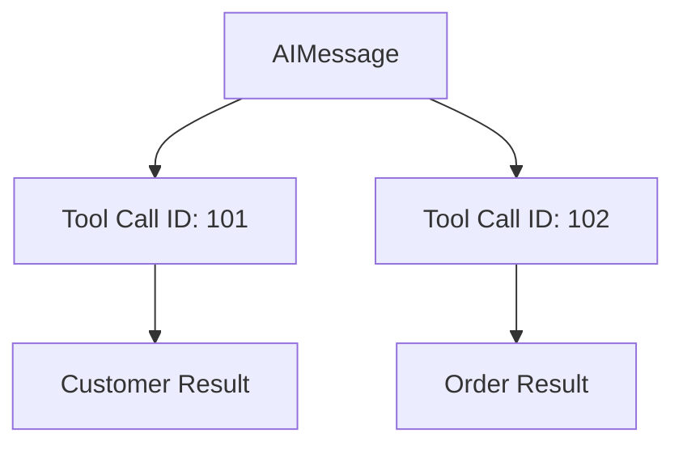

---

# 28. Multiple Tool Calls

A model may request multiple tools in a single response.

Example:

```text
User:
Compare the weather in Kolkata and Delhi.
```

The model may generate:

```text
get_weather(Kolkata)
get_weather(Delhi)
```

Current LangChain documentation notes that many models support parallel tool calls. :contentReference[oaicite:10]{index=10}

---

# 29. Parallel Tool Calling

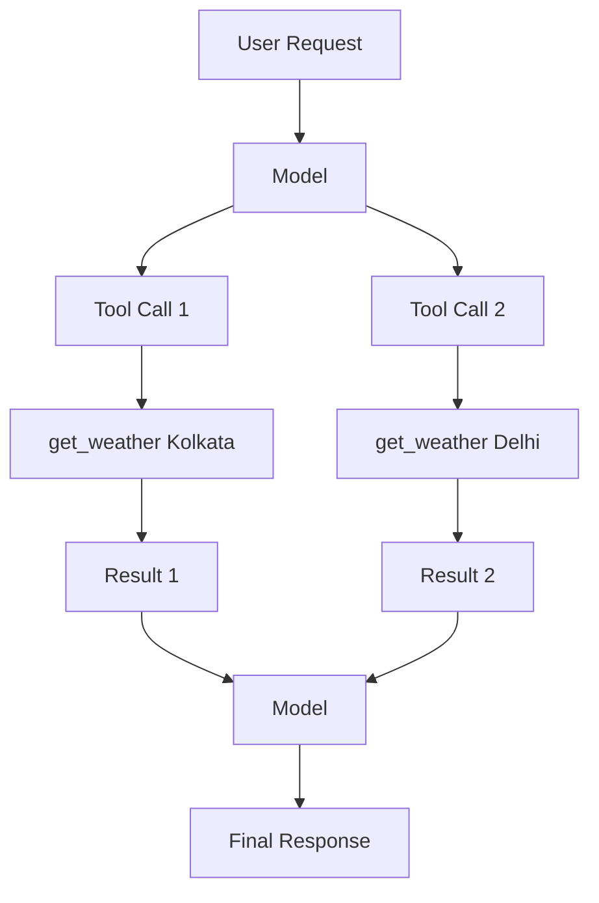

Instead of:

```text
Tool 1
 ↓
Tool 2
 ↓
Tool 3
```

independent tools can potentially execute concurrently.

---

# 30. Parallel Tool Calls and Safety

Parallel execution is appropriate only when operations are independent.

Good:

```text
get_weather(Kolkata)
get_weather(Delhi)
```

Potentially unsafe:

```text
create_payment()
update_balance()
```

if the second operation depends on the first.

Therefore:

```text
Parallelism
    ↓
Requires Dependency Analysis
```

---

# 31. Disabling Parallel Tool Calls

Some model integrations allow parallel tool calls to be disabled.

Conceptually:

```python
model_with_tools = model.bind_tools(
    [get_weather],
    parallel_tool_calls=False,
)
```

Support and exact behavior depend on the model/provider integration. :contentReference[oaicite:11]{index=11}

---

# 32. Tool Choice

By default:

```text
Model
 ↓
Decides whether to use a tool
```

But some applications may require tool use.

LangChain supports tool-choice configuration where the underlying model supports it. :contentReference[oaicite:12]{index=12}

Conceptually:

```python
model_with_tools = model.bind_tools(
    [get_weather],
    tool_choice="any",
)
```

This should be used only when the application logic requires it.

---

# 33. Tool Choice Strategies

Conceptually:

```text
AUTO
 ↓
Model decides

ANY
 ↓
At least one tool

SPECIFIC
 ↓
Particular tool
```

The exact supported choices vary by provider/model.

---

# 34. Tool Return Values

Tools can return:

```text
String
Object
Command
```

LangChain's current tools documentation describes these as distinct patterns. :contentReference[oaicite:13]{index=13}

---

# 35. String Tool Result

Use a string when the model primarily needs human-readable information.

```python
@tool
def get_weather(city: str) -> str:
    """Get weather for a city."""
    return f"Sunny in {city}"
```

The result becomes tool output visible to the model. :contentReference[oaicite:14]{index=14}

---

# 36. Structured Tool Result

A tool can return structured data.

```python
@tool
def get_weather_data(city: str) -> dict:
    """Get structured weather information."""
    return {
        "city": city,
        "temperature_c": 27,
        "conditions": "sunny",
    }
```

This can be useful when downstream model reasoning needs specific fields. :contentReference[oaicite:15]{index=15}

---

# 37. Tool Result Architecture

```text
Tool
 ↓
Structured Result
 ↓
ToolMessage
 ↓
Model
```

Example:

```json
{
  "city": "Kolkata",
  "temperature_c": 27,
  "conditions": "sunny"
}
```

---

# 38. Tool Artifacts

A tool may produce information that should be available to the application but does not need to be sent to the model.

LangChain's `ToolMessage` supports an `artifact` field for supplementary data not sent to the model. :contentReference[oaicite:16]{index=16}

Example concept:

```python
ToolMessage(
    content="Found three relevant documents.",
    tool_call_id="call_123",
    artifact={
        "document_ids": [
            "doc-1",
            "doc-2",
            "doc-3"
        ]
    }
)
```

---

# 39. Why Artifacts Matter

Consider a search tool.

The model may only need:

```text
Relevant passage
```

The application may also need:

```text
Document ID
Page Number
Source URL
Confidence
Metadata
```

Architecture:

```text
Tool
 ├── Model Content
 │      ↓
 │   ToolMessage
 │
 └── Application Metadata
        ↓
      Artifact
```

This is useful for:

```text
Citation
UI Rendering
Audit
Debugging
Source Attribution
```

---

# 40. Tool Errors

Tools can fail.

Examples:

```text
API Timeout
Database Failure
Invalid Input
Authorization Failure
Resource Not Found
Rate Limit
Business Rule Violation
```

A production Agent must handle these failures explicitly.

---

# 41. Tool Error Flow

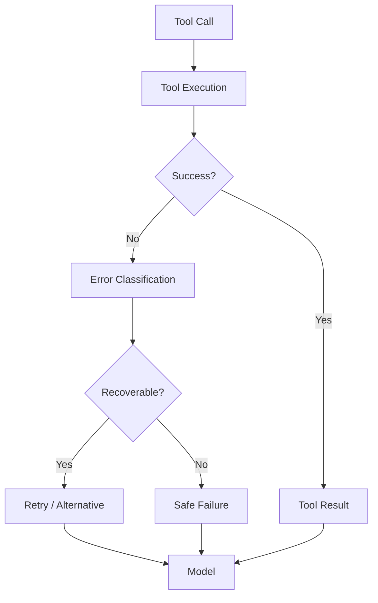

---

# 42. Tool Error Handling

LangChain's `ToolNode` supports configurable tool error handling, including catching all errors, specific exception types, or using a custom error handler. :contentReference[oaicite:17]{index=17}

Conceptually:

```python
from langgraph.prebuilt import ToolNode

tool_node = ToolNode(
    tools,
    handle_tool_errors=True,
)
```

This is particularly relevant when tools are executed inside LangGraph workflows.

---

# 43. Do Not Hide All Errors

Bad:

```text
Every Tool Failure
      ↓
"Something went wrong"
```

The model may need to know whether:

```text
Resource does not exist
```

versus:

```text
Temporary service unavailable
```

Error messages should be:

```text
Useful
Safe
Non-sensitive
Actionable
```

---

# 44. Tool Validation

Tool inputs are model-generated.

Therefore:

```text
Model Output
    ↓
Validation
    ↓
Tool Execution
```

not:

```text
Model Output
    ↓
Trusted Execution
```

---

# 45. Input Validation Example

Suppose:

```python
@tool
def get_customer(customer_id: str) -> str:
    ...
```

The application should still validate:

```text
Format
Length
Allowed Characters
Authorization
Tenant
Existence
```

before accessing the backend.

---

# 46. Authorization

Authentication answers:

```text
Who is the user?
```

Authorization answers:

```text
What is the user allowed to do?
```

An Agent must not bypass authorization.

Bad:

```text
Agent
 ↓
get_customer(any_customer_id)
```

Better:

```text
Agent
 ↓
Tool
 ↓
Authorization
 ↓
Tenant / User Scope
 ↓
Customer Service
```

---

# 47. Tool Authorization Architecture

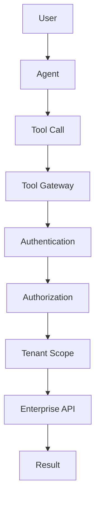

---

# 48. Least Privilege

Tools should expose the minimum capability required.

Bad:

```text
execute_sql()
```

Better:

```text
get_customer()
get_order()
search_orders()
```

The principle is:

```text
Minimum Capability
        +
Minimum Data
        +
Minimum Permissions
```

---

# 49. Dangerous Tools

Examples:

```text
execute_shell()
execute_sql()
delete_database()
send_email()
issue_refund()
transfer_money()
deploy_application()
```

These require stronger controls.

---

# 50. High-Risk Tool Architecture

```text
Agent
 ↓
Tool Request
 ↓
Risk Classification
 ↓
Authorization
 ↓
Validation
 ↓
Human Approval?
 ↓
Execution
 ↓
Audit
```

---

# 51. Idempotency

Write tools should consider idempotency.

Example:

```text
issue_refund(order_id)
```

If the Agent retries:

```text
issue_refund(O100)
issue_refund(O100)
```

the customer should not receive two refunds.

Therefore:

```text
Tool
 ↓
Idempotency Key
 ↓
Business Service
```

---

# 52. Idempotent Tool Architecture

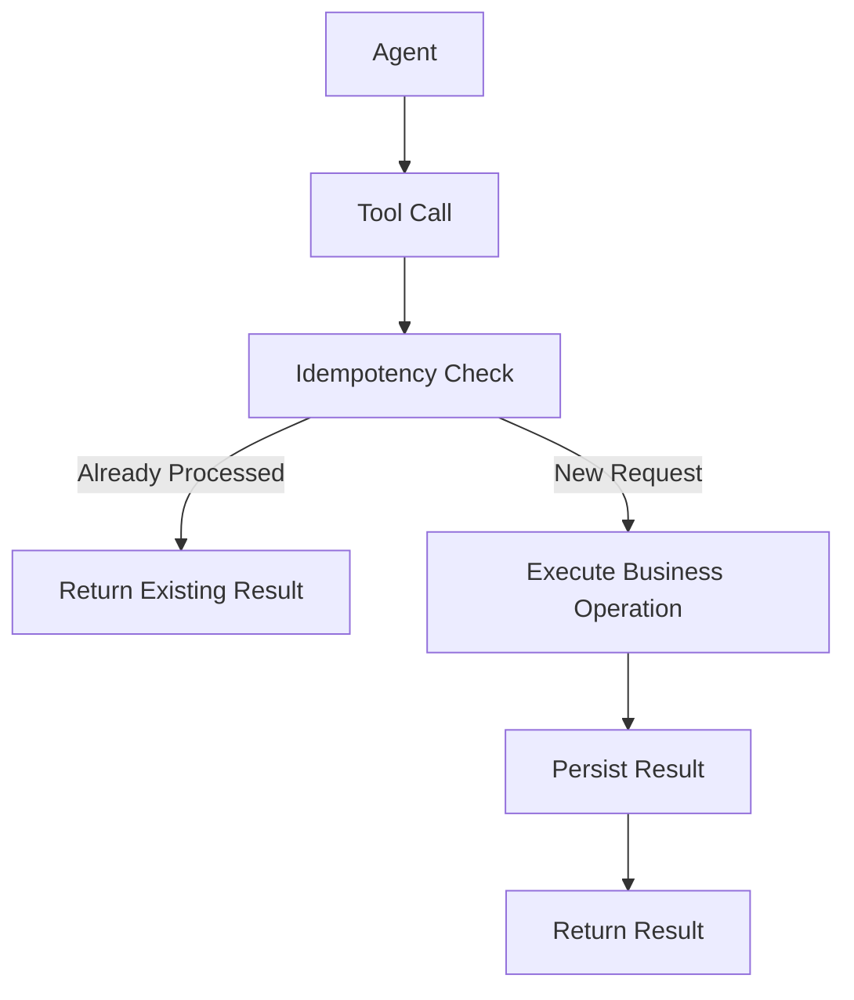

---

# 53. Tool Timeouts

Every external tool should have an appropriate timeout.

Examples:

```text
Database Timeout
HTTP Timeout
Search Timeout
Payment Timeout
```

Without timeouts:

```text
Agent
 ↓
Tool
 ↓
Hanging Service
 ↓
Agent Hangs
```

---

# 54. Tool Retry Policy

Retries should be selective.

Safe candidates:

```text
Temporary Network Error
HTTP 503
Transient Timeout
```

Unsafe candidates:

```text
Invalid Input
Authorization Failure
Business Rule Failure
Duplicate Write
```

---

# 55. Tool Retry Architecture

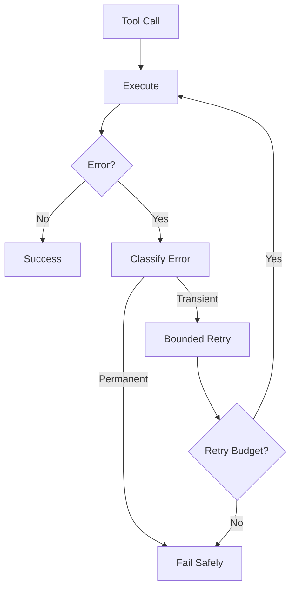

---

# 56. Tool Observability

For every tool execution, consider recording:

```text
Tool Name
Tool Call ID
User ID
Tenant ID
Arguments Metadata
Start Time
Duration
Status
Error
Retry Count
Result Size
```

Avoid logging sensitive tool arguments unnecessarily.

---

# 57. Tool Trace

A complete Agent trace might look like:

```text
Trace: request-123

Agent
 ├── Model Call
 │
 ├── Tool: get_customer
 │    ├── Duration: 120ms
 │    └── Success
 │
 ├── Tool: get_order
 │    ├── Duration: 250ms
 │    └── Success
 │
 └── Model Call
```

This makes debugging significantly easier.

---

# 58. Tool Metrics

Useful metrics include:

```text
tool_calls_total
tool_errors_total
tool_latency
tool_timeout_total
tool_retries_total
tool_success_rate
```

Break them down by:

```text
Tool
Tenant
Environment
Region
Service
```

---

# 59. Tool Cost

Some tools have direct costs.

Examples:

```text
External Search API
Payment API
Cloud AI API
Database Query
Third-Party SaaS
```

Therefore:

```text
Tool Usage
    ↓
Usage Tracking
    ↓
Cost Attribution
```

---

# 60. Tool Rate Limiting

A tool can have its own rate limit.

Example:

```text
Agent
 ↓
Search Tool
 ↓
100 requests/minute
```

The model may generate many calls.

Therefore tool-level protection is required.

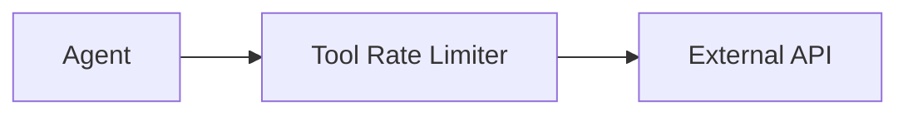

---

# 61. Tool Quotas

Enterprise systems may define:

```text
Per User
Per Tenant
Per Agent
Per Tool
Per Hour
Per Day
```

Example:

```text
Tenant A
    ↓
Search API
    ↓
10,000 calls/day
```

---

# 62. Tool Gateway Pattern

Instead of allowing every Agent to directly access enterprise APIs:

```text
Agent
 ↓
Tool Gateway
 ↓
Enterprise Services
```

The gateway can enforce:

```text
Authentication
Authorization
Rate Limiting
Validation
Audit
Routing
Observability
```

---

# 63. Enterprise Tool Gateway

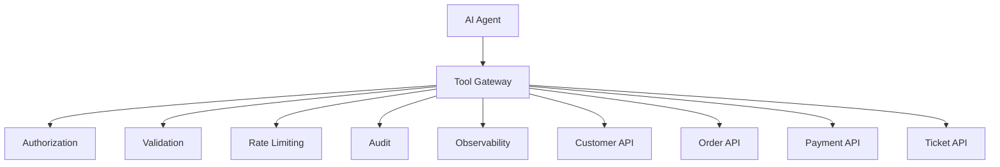

---

# 64. Tool Registry

Large enterprises may have hundreds of tools.

A tool registry can maintain:

```text
Tool Name
Description
Version
Owner
Risk Level
Required Permissions
Input Schema
Output Schema
Availability
Rate Limit
```

Example:

```text
Tool Registry

get_customer
 ├── Version: 2
 ├── Risk: LOW
 ├── Permission: customer.read
 └── Owner: CRM Team

issue_refund
 ├── Version: 3
 ├── Risk: HIGH
 ├── Permission: payment.refund
 └── Owner: Payments Team
```

---

# 65. Tool Discovery

Agents should not necessarily receive every available enterprise tool.

Instead:

```text
User Request
      ↓
Capability Matching
      ↓
Relevant Tools
      ↓
Model
```

This reduces:

```text
Prompt Size
Tool Confusion
Security Exposure
Latency
```

---

# 66. Tool Selection Architecture

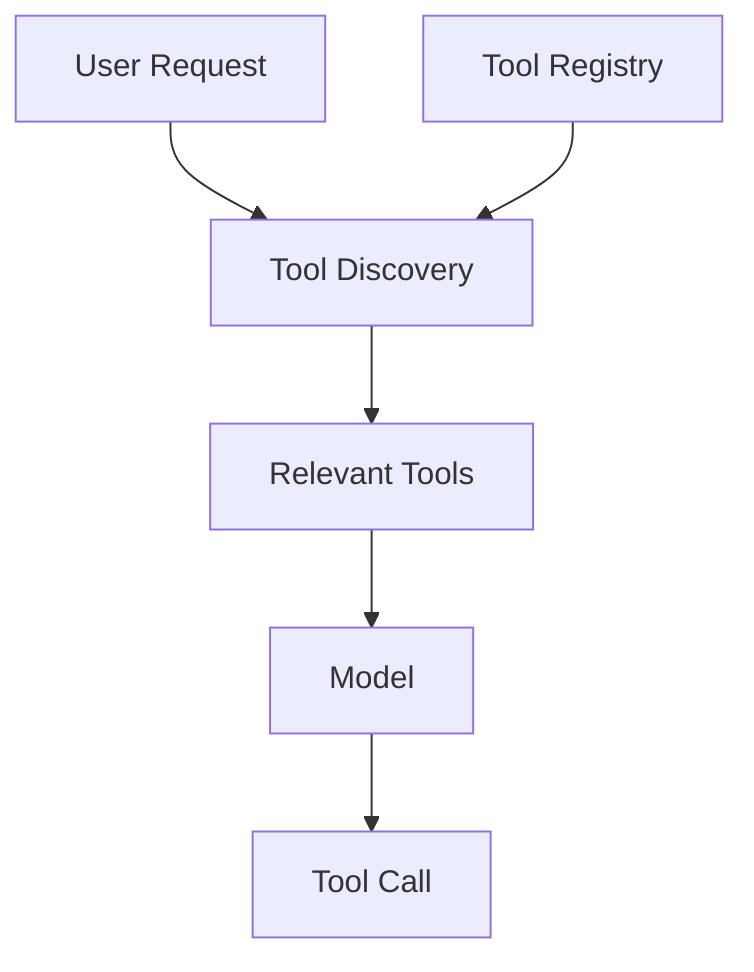

---

# 67. Tool Description Quality

A tool description should answer:

```text
What does it do?
When should it be used?
What does the input mean?
What does it return?
What limitations exist?
```

Example:

```python
@tool
def search_orders(
    customer_id: str,
    status: str | None = None,
) -> dict:
    """
    Search orders belonging to a customer.

    Use this tool when the user asks about
    previous or current orders.

    Args:
        customer_id: Authenticated customer identifier.
        status: Optional order status filter.
    """
    ...
```

---

# 68. Tool Description as Model Interface

Think of the tool description as part of the model-facing API.

```text
Tool Schema
     +
Description
     ↓
Model Decision
```

Therefore poor descriptions can cause:

```text
Wrong Tool
Wrong Arguments
Unnecessary Tool Calls
```

---

# 69. Tool Schema Design

Good schema:

```text
customer_id: string
order_id: string
limit: integer
```

Bad schema:

```text
data: object
```

whenever the object could be more explicitly defined.

Prefer precise schemas.

---

# 70. Tool Granularity

A tool should usually represent a meaningful capability.

Too coarse:

```text
execute_business_operation()
```

Too fine:

```text
get_customer_id()
get_customer_name()
get_customer_email()
```

Better:

```text
get_customer()
```

with a structured result.

---

# 71. Tool Granularity Model

```text
Too Broad
     ↓
Hard to Control

Too Narrow
     ↓
Too Many Tool Calls

Balanced
     ↓
Business Capability Tool
```

---

# 72. Tool Composition

A tool may internally call multiple services.

Example:

```text
get_customer_360()
    ↓
CRM
Billing
Orders
Support
```

The model sees:

```text
get_customer_360()
```

instead of:

```text
get_crm_customer()
get_billing_customer()
get_orders()
get_tickets()
```

This can simplify Agent behavior.

---

# 73. Tool Composition Architecture

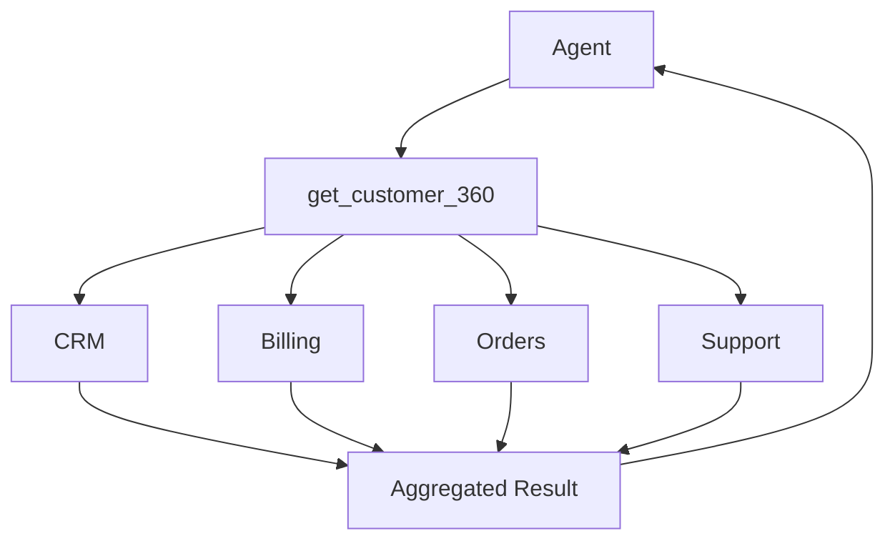

---

# 74. Tools vs APIs

A REST API is not automatically an AI Tool.

```text
REST API
    ↓
Enterprise Interface
```

A Tool is:

```text
AI-Facing Capability
    ↓
Schema
+
Description
+
Execution
```

Therefore:

```text
API
 ↓
Tool Adapter
 ↓
AI Agent
```

---

# 75. Tool Adapter Pattern

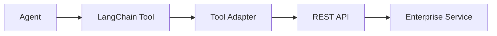

This prevents Agent code from becoming tightly coupled to infrastructure APIs.

---

# 76. Tool Security Boundary

The Tool should be treated as a security boundary.

```text
LLM Output
    ↓
UNTRUSTED
    ↓
Tool Validation
    ↓
Authorization
    ↓
Trusted Business Service
```

This principle is extremely important.

---

# 77. Tool Runtime Context

Modern LangChain tools can access runtime information through `ToolRuntime`.

Runtime information can include:

```text
State
Context
Store
Stream Writer
Execution Information
Server Information
Config
Tool Call ID
```

The `runtime` parameter is injected and hidden from the model's tool schema. :contentReference[oaicite:18]{index=18}

---

# 78. Tool State

A tool may need conversation state.

Example:

```python
from langchain.tools import tool, ToolRuntime


@tool
def get_last_user_message(
    runtime: ToolRuntime,
) -> str:
    """Return the most recent user message."""
    messages = runtime.state["messages"]

    for message in reversed(messages):
        if message.type == "human":
            return message.content

    return "No user message found."
```

The model does not need to provide `runtime`.

The runtime injects it automatically. :contentReference[oaicite:19]{index=19}

---

# 79. Tool Context

Context is useful for immutable runtime information.

Examples:

```text
User ID
Tenant ID
Session ID
Region
Application Configuration
```

Conceptually:

```text
Agent Invocation
      ↓
Runtime Context
      ↓
Tool
```

This is preferable to asking the model to generate security-sensitive identity information.

---

# 80. Never Trust Model-Supplied Identity

Bad:

```text
Agent
 ↓
get_customer(
    customer_id="C123"
)
```

and assume:

```text
C123 belongs to current user
```

Better:

```text
Authenticated Request
       ↓
Runtime Context
       ↓
Authorized Customer ID
       ↓
Tool
```

---

# 81. Tenant Isolation

For multi-tenant systems:

```text
Tool Call
    ↓
Tenant Context
    ↓
Authorization
    ↓
Tenant Data
```

Architecture:

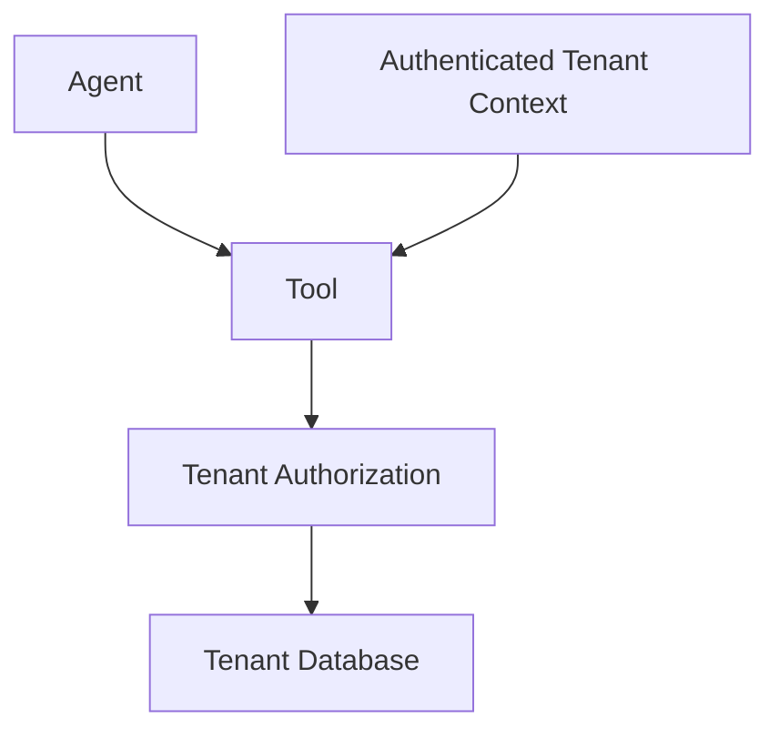

Never rely only on the model to preserve tenant boundaries.

---

# 82. State Updates From Tools

Some tools do more than return information.

They may update Agent state.

LangChain tools can return a `Command` to update graph state in appropriate LangGraph-based workflows. :contentReference[oaicite:20]{index=20}

Conceptually:

```text
Tool
 ↓
Command
 ↓
State Update
 ↓
Next Agent Step
```

---

# 83. Tool State Mutation

Example concept:

```python
from langchain.tools import tool, ToolRuntime
from langgraph.types import Command


@tool
def set_language(
    language: str,
    runtime: ToolRuntime,
) -> Command:
    """Set the user's preferred language."""

    return Command(
        update={
            "preferred_language": language
        }
    )
```

State-mutating tools should be designed carefully, especially when multiple tools can execute concurrently. :contentReference[oaicite:21]{index=21}

---

# 84. Tool Execution and LangGraph

LangChain's `ToolNode` is a prebuilt LangGraph component for executing tools.

It provides capabilities including:

```text
Parallel Tool Execution
Error Handling
State Injection
Tool Execution
```

:contentReference[oaicite:22]{index=22}

Conceptually:

```text
LangChain Tools
      ↓
ToolNode
      ↓
LangGraph
      ↓
Agent Workflow
```

---

# 85. ToolNode Architecture

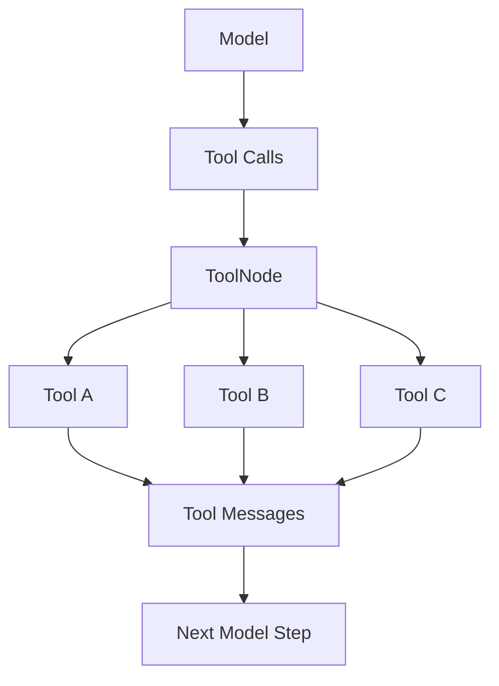

The detailed LangGraph implementation is covered later in the dedicated LangGraph section.

---

# 86. Server-Side Tools

Not every tool has to be implemented by your application.

Some model providers expose built-in tools such as:

```text
Web Search
Code Interpreter
```

that are executed server-side by the provider. LangChain's documentation distinguishes these from user-defined tools. :contentReference[oaicite:23]{index=23}

Architecture:

```text
Application
    ↓
Model Provider
    ↓
Provider-Managed Tool
    ↓
Result
```

---

# 87. Client-Side vs Server-Side Tools

| Aspect | Client/Application Tool | Server-Side Tool |
|---|---|---|
| Execution | Your application | Provider |
| Control | High | Provider-dependent |
| Custom Enterprise APIs | Strong | Usually limited |
| Security Boundary | Your infrastructure | Provider infrastructure |
| Observability | Your responsibility | Provider-dependent |
| Deployment | Your responsibility | Provider-managed |

---

# 88. Streaming Tool Calls

Tool calls can also be streamed.

Instead of receiving the complete tool call immediately:

```text
Tool:
get_weather

Arguments:
{"location":"Kolkata"}
```

the application may receive chunks.

LangChain exposes streamed tool-call chunks for supported models. :contentReference[oaicite:24]{index=24}

Conceptually:

```text
Tool
 ↓
{"loc
 ↓
ation":
 ↓
"Kolk
 ↓
ata"}
```

The chunks can then be accumulated into the complete tool call.

---

# 89. Streaming Architecture

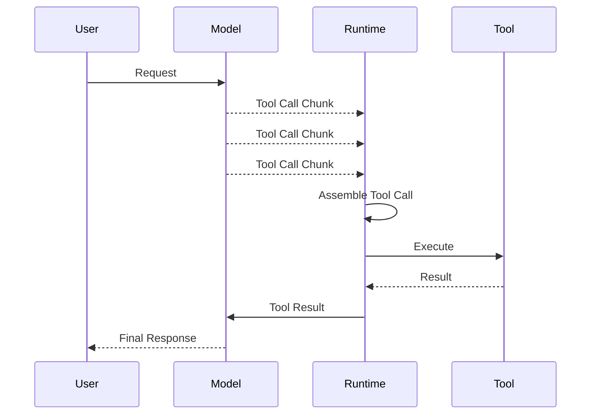

---

# 90. Tool Calling with Structured Arguments

Tool arguments should be strongly typed.

Example:

```python
@tool
def transfer_money(
    source_account: str,
    destination_account: str,
    amount: float,
) -> str:
    """Transfer money between authorized accounts."""
    ...
```

But schema alone is insufficient.

The application must still validate:

```text
Account Ownership
Amount
Currency
Transaction Limits
Authorization
Fraud Rules
Idempotency
```

---

# 91. Financial Tool Example

Consider:

```text
transfer_money()
```

Architecture:

```text
User
 ↓
Agent
 ↓
Tool Call
 ↓
Schema Validation
 ↓
Authorization
 ↓
Fraud Checks
 ↓
Human Approval?
 ↓
Payment Service
 ↓
Audit
```

---

# 92. High-Risk Tool Flow

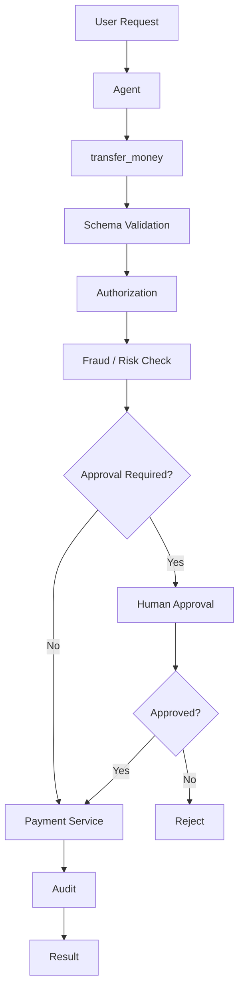

---

# 93. Tool Security Checklist

For every tool ask:

```text
Who can call it?
What can it access?
What data can it return?
What side effects can it create?
Can it be retried?
Is it idempotent?
What happens if it fails?
What should be logged?
Does it require approval?
```

---

# 94. Tool Testing

Tools should be independently testable.

Example:

```python
def test_get_weather():
    result = get_weather.invoke({
        "location": "Kolkata"
    })

    assert result is not None
```

For enterprise tools, also test:

```text
Authorization
Validation
Timeout
Retry
Error Handling
Idempotency
Tenant Isolation
```

---

# 95. Tool Contract Testing

A tool should have a stable contract:

```text
Input Schema
      ↓
Execution
      ↓
Output Schema
```

Test:

```text
Valid Input
Invalid Input
Missing Input
Boundary Input
Unauthorized Input
```

---

# 96. Tool Integration Testing

Example:

```text
Agent
 ↓
Tool
 ↓
Order Service
 ↓
Database
```

Test that the complete interaction behaves correctly.

Use:

```text
Mocks
Stubs
Sandbox APIs
Test Containers
Controlled Test Data
```

where appropriate.

---

# 97. Tool Evaluation

Agent evaluation should measure not only final response quality but also tool behavior.

Metrics:

```text
Correct Tool Selection
Correct Arguments
Unnecessary Tool Calls
Tool Call Count
Tool Failure Recovery
Task Completion
```

---

# 98. Tool Evaluation Example

User:

```text
Where is order ORD-1001?
```

Expected:

```text
get_order_status(
    order_id="ORD-1001"
)
```

Incorrect:

```text
search_products()
```

or:

```text
get_customer()
```

The Agent can produce a correct final answer while still using an inefficient or incorrect tool path.

Therefore tool-level evaluation matters.

---

# 99. Tool Efficiency

A production Agent should minimize unnecessary calls.

Bad:

```text
Model
 ↓
get_customer
 ↓
Model
 ↓
get_order
 ↓
Model
 ↓
get_shipping
 ↓
Model
```

Potentially better:

```text
Model
 ↓
get_order_360
 ↓
Model
```

provided the aggregated tool has the right semantics and acceptable latency.

---

# 100. Tool Latency

If:

```text
Tool A = 100 ms
Tool B = 150 ms
Tool C = 500 ms
```

Sequential execution may approach:

```text
750 ms
```

Independent parallel execution can potentially approach the slowest dependency rather than the sum.

Conceptually:

```text
Sequential:

A → B → C

Parallel:

A ─┐
B ─┼→ Result
C ─┘
```

Actual latency depends on runtime and infrastructure.

---

# 101. Tool Dependency Graph

Before parallelizing tools, identify dependencies.

Example:

```mermaid
flowchart TD

    A[get_customer] --> B[get_order]

    B --> C[get_shipping]

    D[get_product_catalog]
```

Here:

```text
get_customer
    ↓
get_order
    ↓
get_shipping
```

is sequential.

But:

```text
get_product_catalog
```

may be independent.

---

# 102. Tool Concurrency

Production systems should control concurrency.

Potential controls:

```text
Maximum Concurrent Tools
Per Agent
Per Tenant
Per Tool
Per Service
```

This prevents an Agent from generating excessive concurrent requests.

---

# 103. Tool Circuit Breaker

If an external dependency is failing:

```text
Agent
 ↓
Tool
 ↓
Service
 ↓
Repeated Failures
```

a circuit breaker can prevent additional traffic.

```mermaid
flowchart TD

    A[Tool Request] --> B[Circuit Breaker]

    B --> C{Circuit Open?}

    C -->|No| D[External Service]
    C -->|Yes| E[Fast Failure]

    D --> F{Healthy?}

    F -->|Yes| G[Success]
    F -->|No| H[Failure Count]

    H --> B
```

---

# 104. Tool Fallback

A tool may have an alternative.

Example:

```text
Primary Search API
        ↓
Failure
        ↓
Secondary Search API
```

However, fallback behavior must preserve semantic correctness.

---

# 105. Tool Versioning

Tools can evolve.

Example:

```text
get_customer_v1
get_customer_v2
```

Changes to:

```text
Input Schema
Output Schema
Behavior
Authorization
```

can affect Agent behavior.

Therefore tool contracts should be versioned carefully.

---

# 106. Tool Governance

Large organizations should govern tools through:

```text
Tool Registry
+
Ownership
+
Permissions
+
Versioning
+
Risk Classification
+
Audit
```

Example:

```text
Tool:
issue_refund

Owner:
Payments Team

Risk:
HIGH

Permission:
payment.refund

Version:
v3
```

---

# 107. Tool Lifecycle

```mermaid
flowchart LR

    A[Design] --> B[Develop]
    B --> C[Test]
    C --> D[Security Review]
    D --> E[Register]
    E --> F[Deploy]
    F --> G[Monitor]
    G --> H[Version]
    H --> I[Retire]
```

---

# 108. Enterprise Tool Platform

A mature enterprise may create a centralized tool platform:

```text
                AI Applications
                       │
                       ▼
                 Tool Gateway
                       │
             ┌─────────┼─────────┐
             ▼         ▼         ▼
          Tool A    Tool B    Tool C
             │         │         │
             ▼         ▼         ▼
           CRM       Orders    Payments
```

This allows central governance without forcing every Agent to understand backend infrastructure.

---

# 109. Tool Gateway Responsibilities

A Tool Gateway may provide:

```text
Authentication
Authorization
Schema Validation
Rate Limiting
Quota
Routing
Audit
Observability
Idempotency
Circuit Breaking
```

---

# 110. Tool Architecture for Enterprise AI

A production architecture:

```mermaid
flowchart TD

    A[User] --> B[AI Application]

    B --> C[Agent]

    C --> D[Model]

    C --> E[Tool Selection]

    E --> F[Tool Gateway]

    F --> G[Authentication]
    F --> H[Authorization]
    F --> I[Validation]
    F --> J[Rate Limiting]
    F --> K[Audit]
    F --> L[Observability]

    F --> M[Customer Service]
    F --> N[Order Service]
    F --> O[Payment Service]
    F --> P[Search Service]

    M --> Q[Result]
    N --> Q
    O --> Q
    P --> Q

    Q --> C
```

---

# 111. Production Request Flow

```text
User
 ↓
API Gateway
 ↓
Authentication
 ↓
Application
 ↓
Agent
 ↓
Model
 ↓
Tool Call
 ↓
Tool Gateway
 ↓
Authorization
 ↓
Validation
 ↓
Enterprise Service
 ↓
Tool Result
 ↓
Model
 ↓
Response Validation
 ↓
User
```

---

# 112. Tool vs Retrieval

RAG retrieval can itself be exposed as a tool.

Example:

```text
search_enterprise_documents()
```

The model decides:

```text
Need enterprise knowledge?
        ↓
Use retrieval tool
```

This connects the tool architecture to the RAG architecture covered earlier in the handbook.

---

# 113. Tool vs RAG

Conceptually:

```text
Retrieval
 ↓
Find Information

Tool
 ↓
Perform Capability
```

However, retrieval can be implemented behind a tool interface.

---

# 114. Tool vs Agent

A Tool:

```text
Performs a capability.
```

An Agent:

```text
Decides how and when to use capabilities.
```

Architecture:

```text
Agent
 ├── Tool A
 ├── Tool B
 └── Tool C
```

---

# 115. Tool vs Function

A Python function:

```python
def get_weather(city):
    ...
```

is just application code.

A LangChain Tool adds:

```text
Schema
Description
Model-facing Interface
Execution Contract
```

Therefore:

```text
Python Function
      +
AI Tool Metadata
      ↓
LangChain Tool
```

---

# 116. Common Pitfall — Exposing Too Many Tools

Bad:

```text
Agent
 ↓
500 Tools
```

Problems:

```text
Large Tool Context
Tool Confusion
Higher Token Usage
Wrong Tool Selection
Security Exposure
```

Prefer:

```text
Request
 ↓
Tool Discovery
 ↓
Relevant Tools
 ↓
Model
```

---

# 117. Common Pitfall — Vague Tool Names

Bad:

```text
process()
execute()
helper()
```

Better:

```text
get_order_status()
create_support_ticket()
search_customer_orders()
```

---

# 118. Common Pitfall — Vague Descriptions

Bad:

```python
"""Do order stuff."""
```

Better:

```python
"""
Retrieve the current status of an order.

Use this tool when the user asks about
order processing, shipment, or delivery status.
"""
```

---

# 119. Common Pitfall — Trusting Tool Arguments

Never assume:

```text
LLM-generated arguments
=
Trusted input
```

Instead:

```text
LLM Arguments
 ↓
Schema Validation
 ↓
Business Validation
 ↓
Authorization
 ↓
Execution
```

---

# 120. Common Pitfall — Giving Tools Excessive Permissions

Avoid:

```text
Agent
 ↓
Database Admin
```

Prefer:

```text
Agent
 ↓
Restricted Business Tool
 ↓
Authorized Service
```

---

# 121. Common Pitfall — Non-Idempotent Writes

If the model retries:

```text
create_payment()
```

the operation could execute twice.

Use:

```text
Idempotency Key
+
Transaction Boundary
+
Duplicate Detection
```

---

# 122. Common Pitfall — Logging Sensitive Arguments

Tool calls can contain:

```text
Customer IDs
Account Information
Personal Data
Financial Data
Authentication Information
```

Do not blindly log every argument.

Instead:

```text
Structured Audit
+
Redaction
+
Data Classification
```

---

# 123. Common Pitfall — Tool Result Too Large

A tool might return:

```text
10,000 database records
```

Sending all of them back to the model is inefficient.

Better:

```text
Database
 ↓
Filtering
 ↓
Aggregation
 ↓
Relevant Result
 ↓
Model
```

---

# 124. Common Pitfall — Tool Performs Too Much

A tool like:

```text
execute_business_workflow()
```

may hide too many operations.

This can make:

```text
Authorization
Observability
Debugging
Evaluation
```

more difficult.

Prefer meaningful capability boundaries.

---

# 125. Common Pitfall — No Tool Timeout

Every network-bound tool should have a bounded execution time.

---

# 126. Common Pitfall — No Tool Error Contract

Define how failures appear:

```text
Success
Validation Error
Authorization Error
Not Found
Transient Error
Permanent Error
```

This makes Agent behavior more predictable.

---

# 127. Common Pitfall — Assuming Parallelism Is Always Better

Parallel calls can improve latency but increase:

```text
Concurrency
Cost
Load
Rate-Limit Pressure
Side Effects
```

Use parallelism only where appropriate.

---

# 128. Tool Testing Matrix

| Test | Example |
|---|---|
| Valid Input | Correct customer ID |
| Invalid Input | Malformed ID |
| Missing Input | Missing required field |
| Unauthorized | Another tenant's customer |
| Timeout | Slow service |
| Rate Limit | Too many requests |
| Retry | Transient failure |
| Duplicate | Same write twice |
| Large Result | Excessive response |
| Security | Injection attempt |

---

# 129. Tool Evaluation Matrix

| Metric | Question |
|---|---|
| Tool Selection | Was the correct tool selected? |
| Arguments | Were arguments correct? |
| Necessity | Was the tool actually needed? |
| Efficiency | Were unnecessary tools called? |
| Parallelism | Were independent calls parallelized appropriately? |
| Reliability | Did failures recover correctly? |
| Safety | Were dangerous operations controlled? |
| Completion | Did the tool help complete the task? |

---

# 130. Production Tool Checklist

## Tool Definition

- [ ] Clear name
- [ ] Clear description
- [ ] Strong type hints
- [ ] Explicit input schema
- [ ] Defined output
- [ ] Appropriate granularity

## Security

- [ ] Authentication
- [ ] Authorization
- [ ] Tenant isolation
- [ ] Least privilege
- [ ] Input validation
- [ ] Sensitive data controls

## Reliability

- [ ] Timeout
- [ ] Retry policy
- [ ] Error handling
- [ ] Circuit breaker where required
- [ ] Idempotency for writes

## Performance

- [ ] Rate limiting
- [ ] Concurrency limits
- [ ] Result-size limits
- [ ] Caching where appropriate
- [ ] Parallel execution where safe

## Observability

- [ ] Tool call ID
- [ ] Trace ID
- [ ] Latency
- [ ] Status
- [ ] Error metrics
- [ ] Usage metrics
- [ ] Audit

---

# 131. Production Tool Design Pattern

The recommended mental model is:

```text
                 MODEL
                   │
                   ▼
              TOOL CALL
                   │
                   ▼
             TOOL ADAPTER
                   │
                   ▼
          VALIDATION LAYER
                   │
                   ▼
          AUTHORIZATION LAYER
                   │
                   ▼
          BUSINESS SERVICE
                   │
                   ▼
          ENTERPRISE SYSTEM
```

The model should not directly own business authorization.

---

# 132. Enterprise Tool Architecture

```mermaid
flowchart TD

    A[LLM] --> B[Tool Call]

    B --> C[Tool Adapter]

    C --> D[Schema Validation]

    D --> E[Policy Enforcement]

    E --> F[Authorization]

    F --> G[Business Service]

    G --> H[Database / API / Platform]

    H --> I[Tool Result]

    I --> J[ToolMessage]

    J --> A
```

---

# 133. End-to-End Example — Customer Support Agent

User:

```text
Where is my order ORD-1001?
```

Available tools:

```text
get_customer()
get_order()
get_order_status()
create_support_ticket()
```

The model may select:

```text
get_order_status(
    order_id="ORD-1001"
)
```

Execution:

```text
User
 ↓
Agent
 ↓
Model
 ↓
get_order_status
 ↓
Order Service
 ↓
ToolMessage
 ↓
Model
 ↓
"Your order has shipped."
```

---

# 134. Customer Support Architecture

```mermaid
flowchart TD

    A[Customer] --> B[Support Agent]

    B --> C[Model]

    C --> D[get_order_status]

    D --> E[Authorization]

    E --> F[Order Service]

    F --> G[Order Database]

    F --> H[Tool Result]

    H --> C

    C --> I[Response]

    I --> A
```

---

# 135. End-to-End Example — Financial Operation

User:

```text
Transfer ₹50,000 to account X.
```

A safe Agent should not simply execute:

```text
transfer_money()
```

Instead:

```text
User
 ↓
Agent
 ↓
Tool Call
 ↓
Schema Validation
 ↓
Authorization
 ↓
Risk Evaluation
 ↓
Human Approval
 ↓
Payment Service
 ↓
Audit
 ↓
Result
```

This illustrates why tool calling is fundamentally an **enterprise systems integration problem**, not merely an LLM feature.

---

# 136. Tool Calling Architecture — Complete View

```mermaid
flowchart TD

    A[User] --> B[AI Application]

    B --> C[Agent / Model]

    C --> D[Tool Selection]

    D --> E[Tool Call]

    E --> F[Tool Gateway]

    F --> G[Schema Validation]
    F --> H[Authorization]
    F --> I[Rate Limiting]
    F --> J[Audit]
    F --> K[Observability]

    F --> L[Business Service]

    L --> M[Enterprise System]

    M --> N[Tool Result]

    N --> O[ToolMessage]

    O --> C

    C --> P[Final Response]
```

---

# 137. Quick Revision

```text
Tool
 ↓
Callable Capability
```

Tool definition:

```text
Name
+
Description
+
Input Schema
+
Execution
```

Tool calling:

```text
User
 ↓
Model
 ↓
Tool Call
 ↓
Tool
 ↓
Tool Result
 ↓
Model
 ↓
Response
```

Key LangChain APIs:

```text
@tool
bind_tools()
tool_calls
ToolMessage
ToolRuntime
ToolNode
```

Production controls:

```text
Validation
Authorization
Timeout
Retry
Rate Limit
Idempotency
Audit
Observability
```

---

# 138. Interview Questions

## Beginner

### 1. What is a LangChain Tool?

A callable capability with a defined input/output contract that can be made available to a model.

### 2. What is tool calling?

A model capability where the model produces a structured request to invoke a tool.

### 3. Is tool calling the same as tool execution?

No.

The model requests the operation; the application/runtime normally executes it.

### 4. What is `@tool`?

A LangChain decorator used to turn a Python function into a tool.

---

## Intermediate

### 5. Why are type hints important?

They help define the tool's input schema.

### 6. Why are tool descriptions important?

They help the model understand when and how a tool should be used.

### 7. What does `bind_tools()` do?

It makes tools available to a model so the model can generate tool calls for them.

### 8. What is `ToolMessage`?

A message containing the result of a tool execution that is passed back to the model.

### 9. Why is `tool_call_id` important?

It correlates the tool result with the corresponding tool request.

---

## Advanced

### 10. Can a model execute tools directly?

The model generally emits tool calls; the runtime/application executes user-defined tools. Some providers also offer server-side tools executed by the provider.

### 11. What is parallel tool calling?

The model can request multiple independent tool calls in one response, which can potentially be executed concurrently.

### 12. How would you secure a financial tool?

Use:

```text
Authentication
Authorization
Schema Validation
Risk Controls
Idempotency
Human Approval
Audit
```

### 13. Why should tools use least privilege?

Because an Agent is an AI-driven caller and model-generated tool arguments must not automatically receive broad infrastructure permissions.

### 14. How would you prevent duplicate financial operations?

Use:

```text
Idempotency Key
+
Transaction Boundary
+
Duplicate Detection
```

### 15. How would you design an enterprise Tool Gateway?

```text
Tool Gateway
 ├── Authentication
 ├── Authorization
 ├── Validation
 ├── Rate Limiting
 ├── Audit
 ├── Observability
 └── Routing
```

### 16. How would you evaluate Agent tool usage?

Measure:

```text
Tool Selection
Argument Accuracy
Unnecessary Calls
Tool Failures
Latency
Task Completion
Safety
```

---

# 139. Key Takeaways

- Tools allow LLMs to interact with external capabilities.
- Tool calling and function calling refer to closely related concepts.
- A tool is not simply a Python function; it also has a model-facing schema and description.
- Type hints help define tool input schemas.
- Tool descriptions influence model tool selection.
- `bind_tools()` makes tools available to a model.
- A model produces a tool call request rather than necessarily executing the tool itself.
- Tool calls are represented in `AIMessage`.
- `tool_calls` contains the requested tool name, arguments, and identifier.
- `ToolMessage` carries the result back to the model.
- `tool_call_id` correlates the result with the original request.
- Multiple tools can sometimes be called in parallel.
- Parallelism should only be used when operations are appropriately independent.
- Tool outputs can be strings, structured objects, or state-updating commands in supported workflows.
- `ToolMessage.artifact` can carry application metadata that does not need to enter model context.
- Tools can access runtime state and context through `ToolRuntime`.
- Tool inputs are model-generated and must be treated as untrusted.
- Authorization must happen outside the model's reasoning.
- Tool permissions should follow least-privilege principles.
- Read and write tools should be treated differently.
- Side-effecting tools require idempotency and stronger controls.
- Tool failures need explicit error handling.
- Tool execution needs timeouts and bounded retries.
- Tool gateways can centralize enterprise security and governance.
- Tool registries can manage large tool ecosystems.
- Tool discovery can reduce unnecessary tool exposure.
- Tool observability should track latency, errors, calls, and correlation IDs.
- Tool evaluation should measure tool selection and argument correctness, not just final answer quality.
- Server-side tools are different from application-hosted tools.
- `ToolNode` provides a prebuilt tool execution component in LangGraph.
- Tools are the bridge between LLM reasoning and enterprise system capabilities.

---

# 140. Production Mental Model

The most important mental model from this chapter is:

```text
                         USER
                           │
                           ▼
                    AI APPLICATION
                           │
                           ▼
                         MODEL
                           │
                           ▼
                     TOOL DECISION
                           │
                           ▼
                       TOOL CALL
                           │
                           ▼
                    ┌──────────────┐
                    │ TOOL GATEWAY │
                    └──────┬───────┘
                           │
              ┌────────────┼────────────┐
              ▼            ▼            ▼
          Validation   Authorization  Rate Limit
              │            │            │
              └────────────┼────────────┘
                           ▼
                    BUSINESS SERVICE
                           │
                           ▼
                  ENTERPRISE SYSTEM
                           │
                           ▼
                      TOOL RESULT
                           │
                           ▼
                      TOOL MESSAGE
                           │
                           ▼
                         MODEL
                           │
                           ▼
                    FINAL RESPONSE
                           │
                           ▼
                         USER
```

The critical enterprise principle is:

> **The LLM decides what capability it wants to use; the application decides whether that capability is actually allowed to execute.**

---

# 141. Relationship to the Next Chapter

This chapter established:

```text
Tools
Tool Schemas
Tool Descriptions
Tool Binding
Tool Calls
Tool Messages
Tool Execution
Parallel Tool Calls
Tool Runtime
Tool Security
Tool Governance
```

The next chapter applies these concepts to:

```text
Retrieval
    ↓
Document Loaders
    ↓
Embeddings
    ↓
Vector Stores
    ↓
Retrievers
    ↓
RAG Pipelines
    ↓
LangChain RAG Architecture
```

Continue with:

**[04. LangChain Retrieval & RAG](04-langchain-retrieval-and-rag.md)**

---

# 📚 References & Further Reading

- LangChain Tools Documentation
- LangChain Models — Tool Calling
- LangChain Messages Documentation
- LangChain Tool Integrations
- LangGraph ToolNode Documentation

The LangChain ecosystem evolves quickly. Verify current provider capabilities, tool-choice options, package names, and runtime APIs against the official documentation before using them in production. :contentReference[oaicite:25]{index=25}

---

> **Enterprise AI Engineering Handbook**  
> *Building Production-Grade Enterprise AI Systems — One Chapter at a Time.*