# 04 — LangChain Retrieval & RAG

> Learn how LangChain connects enterprise data to Large Language Models through document loading, text splitting, embeddings, vector stores, retrievers, prompt assembly, and Retrieval-Augmented Generation pipelines.

---

## 📖 Overview

Large Language Models are powerful reasoning and generation engines, but they cannot directly know every piece of enterprise information.

Enterprise applications commonly need to work with:

- Internal documentation
- Policies
- Product manuals
- Customer records
- Knowledge bases
- PDFs
- Websites
- Databases
- Cloud storage
- Support tickets
- Technical documentation

Retrieval-Augmented Generation (RAG) solves this problem by retrieving relevant external information at query time and providing it to the model as context.

The core LangChain retrieval architecture can be represented as:

```text
Document Loaders
      ↓
Documents
      ↓
Text Splitters
      ↓
Chunks
      ↓
Embeddings
      ↓
Vector Store
      ↓
Retriever
      ↓
Retrieved Documents
      ↓
Prompt
      ↓
LLM
      ↓
Grounded Response
```

---

# 🎯 Learning Objectives

After completing this chapter, you will be able to:

- Understand LangChain's retrieval architecture
- Understand the `Document` abstraction
- Load enterprise data using document loaders
- Understand document metadata
- Split documents into chunks
- Select appropriate chunking strategies
- Generate embeddings
- Store embeddings in vector stores
- Perform similarity search
- Use vector stores as retrievers
- Understand retriever abstractions
- Build semantic search systems
- Build basic RAG pipelines
- Understand prompt assembly for RAG
- Implement retrieval with LangChain Runnables
- Understand 2-Step RAG architecture
- Understand retrieval quality
- Add metadata filtering
- Understand MMR retrieval
- Handle large document collections
- Add citations and source metadata
- Test retrieval pipelines
- Observe retrieval pipelines
- Optimize retrieval latency and cost
- Design production-grade LangChain RAG systems

---

# 1. What Is Retrieval?

Retrieval is the process of finding relevant information from an external knowledge source based on a user's query.

Example:

```text
User:
What is our employee remote work policy?
```

The application searches:

```text
Enterprise Knowledge Base
        ↓
Relevant Documents
        ↓
Remote Work Policy
```

The retrieved information is then passed to the LLM.

---

# 2. Retrieval vs Generation

These are two separate capabilities.

```text
Retrieval
    ↓
Find relevant information

Generation
    ↓
Produce an answer
```

RAG combines them:

```text
Question
   ↓
Retrieval
   ↓
Relevant Context
   ↓
LLM
   ↓
Answer
```

---

# 3. Why RAG Is Required

LLMs have important limitations:

```text
1. Finite Context
2. Static Training Knowledge
```

Enterprise data changes continuously.

Examples:

```text
New policies
New customers
New products
New contracts
New tickets
New documentation
```

RAG allows the application to retrieve current external information at query time.

---

# 4. Basic RAG Architecture

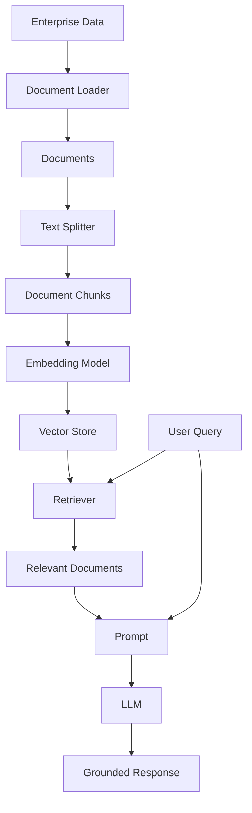

---

# 5. LangChain Retrieval Building Blocks

The core retrieval stack can be represented as:

```text
Document Loader
       ↓
Document
       ↓
Text Splitter
       ↓
Chunks
       ↓
Embedding Model
       ↓
Vector Store
       ↓
Retriever
       ↓
Context
       ↓
LLM
```

These components allow the individual stages of the retrieval architecture to be replaced or evolved independently.

---

# 6. The Document Abstraction

LangChain uses a `Document` representation for retrieved content.

Conceptually:

```text
Document
 ├── page_content
 └── metadata
```

Example:

```python
from langchain_core.documents import Document

doc = Document(
    page_content="Employees may work remotely up to three days per week.",
    metadata={
        "source": "employee-handbook.pdf",
        "page": 42,
        "department": "HR"
    }
)
```

---

# 7. Document Content

The main text is stored in:

```python
document.page_content
```

Example:

```python
print(document.page_content)
```

Output:

```text
Employees may work remotely up to three days per week.
```

---

# 8. Document Metadata

Metadata provides additional information about a document.

Examples:

```text
source
page
document_id
department
tenant_id
document_type
created_at
updated_at
security_level
```

Example:

```python
metadata = {
    "source": "employee-handbook.pdf",
    "page": 42,
    "department": "HR",
    "document_type": "policy"
}
```

---

# 9. Why Metadata Matters

Metadata becomes extremely important in enterprise RAG.

Suppose:

```text
User:
What is the leave policy?
```

The system may need to retrieve only:

```text
department = HR
country = India
document_type = policy
```

Therefore:

```text
Semantic Search
+
Metadata Filtering
```

can provide more precise retrieval.

---

# 10. Document Loader

A document loader converts external data into LangChain `Document` objects.

Examples include:

```text
PDF
CSV
Web Pages
Markdown
HTML
Cloud Storage
Databases
Enterprise Knowledge Bases
```

Architecture:

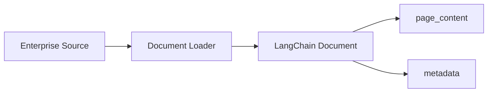

---

# 11. Loading a Text File

Example:

```python
from langchain_community.document_loaders import TextLoader

loader = TextLoader("employee-handbook.txt")

documents = loader.load()

print(len(documents))
print(documents[0].page_content)
```

---

# 12. Loading a PDF

Example:

```python
from langchain_community.document_loaders import PyPDFLoader

loader = PyPDFLoader(
    "employee-handbook.pdf"
)

documents = loader.load()

for document in documents:
    print(document.metadata)
```

A PDF loader typically produces one or more `Document` objects while preserving useful source metadata.

---

# 13. Lazy Loading

Large datasets should not always be loaded entirely into memory.

Document loaders can support:

```text
load()
lazy_load()
```

Example:

```python
for document in loader.lazy_load():
    process(document)
```

Conceptually:

```text
Large Dataset
      ↓
Lazy Loader
      ↓
Document
      ↓
Process
      ↓
Next Document
```

---

# 14. Batch Ingestion

A production ingestion pipeline may look like:

```text
S3 / Blob / GCS / Database
          ↓
Document Loader
          ↓
Normalization
          ↓
Chunking
          ↓
Embedding
          ↓
Vector Store
```

For large datasets:

```text
Source
 ↓
Batch Processing
 ↓
Embedding
 ↓
Indexing
```

---

# 15. Text Splitting

Large documents should generally be divided into smaller retrievable units.

Example:

```text
100-page PDF
      ↓
Document
      ↓
500 Chunks
```

Each chunk can then be embedded and retrieved independently.

---

# 16. Why Chunking Matters

Bad chunking:

```text
Chunk
 ├── Beginning of policy
 ├── Unrelated section
 └── Beginning of another topic
```

Good chunking:

```text
Chunk
 ↓
Coherent semantic unit
```

Chunking directly influences retrieval quality.

---

# 17. Chunking Pipeline

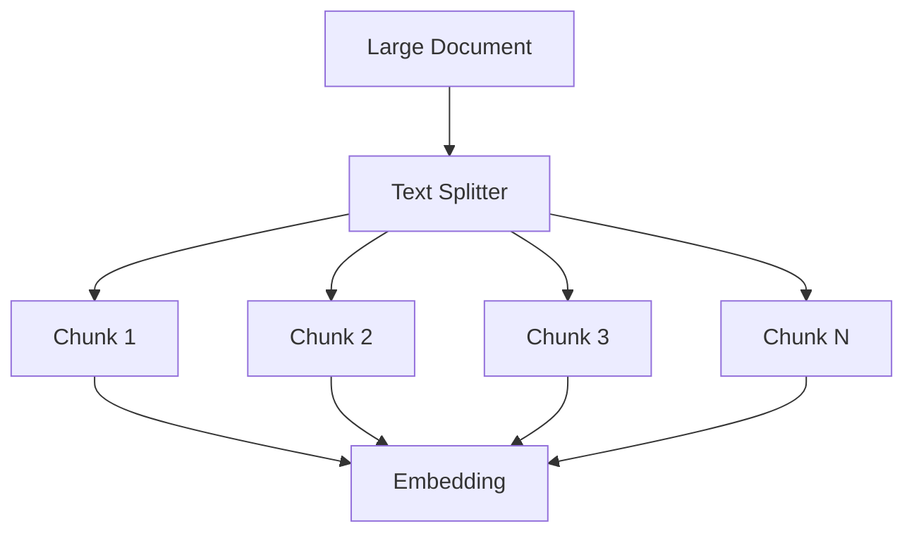

---

# 18. RecursiveCharacterTextSplitter

`RecursiveCharacterTextSplitter` is a useful general-purpose starting point for many text-splitting use cases.

Example:

```python
from langchain_text_splitters import (
    RecursiveCharacterTextSplitter
)

splitter = RecursiveCharacterTextSplitter(
    chunk_size=1000,
    chunk_overlap=200
)

chunks = splitter.split_documents(
    documents
)
```

---

# 19. How Recursive Splitting Works

Conceptually:

```text
Document
   ↓
Paragraph
   ↓
Sentence
   ↓
Word
```

The splitter attempts to preserve larger natural boundaries before falling back to smaller separators.

---

# 20. Chunk Size

Chunk size controls how much content each chunk contains.

Small chunks:

```text
Better precision
Less context
More chunks
```

Large chunks:

```text
More context
Potentially lower precision
Fewer chunks
```

There is no universal optimal value.

Chunk size should be evaluated against the actual corpus and retrieval workload.

---

# 21. Chunk Overlap

Overlap preserves context across chunk boundaries.

Example:

```text
Chunk 1
AAAAAAAAAAAAAAAA

Chunk 2
        AAAAAAAABBBBBBBB

Chunk 3
                BBBBBBBBCCCCCCCC
```

The repeated region represents:

```text
Chunk Overlap
```

---

# 22. Chunking Trade-Off

```text
Smaller Chunks
     │
     ├── Precision ↑
     ├── Context ↓
     └── Index Size ↑

Larger Chunks
     │
     ├── Precision ↓
     ├── Context ↑
     └── Index Size ↓
```

---

# 23. Structure-Aware Splitting

Some documents have natural structure.

Examples:

```text
Markdown
HTML
JSON
Source Code
```

Structure-aware splitters can preserve logical boundaries.

Example:

```text
Markdown

# Authentication

## OAuth

## JWT

# Authorization

## RBAC
```

A structure-aware splitter can preserve relationships between:

```text
Heading
Subheading
Content
```

---

# 24. Token-Based Splitting

Sometimes token limits are more important than character count.

Conceptually:

```text
Document
 ↓
Tokenizer
 ↓
Token Count
 ↓
Chunk
```

Token-aware splitting can be useful when model context limits are a major design constraint.

---

# 25. Chunk Metadata

When splitting documents, preserve useful metadata.

Example:

```python
splitter = RecursiveCharacterTextSplitter(
    chunk_size=1000,
    chunk_overlap=200,
    add_start_index=True
)
```

Metadata such as source and position can later help with:

```text
Citations
Debugging
Source Attribution
Document Updates
```

---

# 26. Embeddings

An embedding model converts text into a numerical vector.

Conceptually:

```text
Text
 ↓
Embedding Model
 ↓
[0.12, -0.83, 0.41, ...]
```

Similar meanings tend to produce vectors that are close in embedding space.

---

# 27. Embedding Architecture

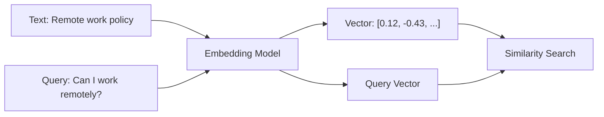

---

# 28. Embedding Model Example

Example:

```python
from langchain_openai import OpenAIEmbeddings

embeddings = OpenAIEmbeddings(
    model="text-embedding-3-small"
)
```

The exact provider and model should be selected according to:

```text
Quality
Latency
Cost
Language Support
Data Residency
Security
Deployment Model
```

---

# 29. Embedding Provider Abstraction

LangChain supports integrations across many embedding providers.

A production architecture should isolate the embedding implementation behind a provider boundary where appropriate:

```text
Application
     ↓
Embedding Interface
     ↓
Provider Adapter
     ├── OpenAI
     ├── Azure
     ├── Google
     ├── AWS
     ├── HuggingFace
     └── Other Providers
```

This reduces provider coupling.

---

# 30. Embedding Consistency

One critical production rule:

```text
Index Embedding Model
        =
Query Embedding Model
```

Do not casually index documents with:

```text
Embedding Model A
```

and query them with:

```text
Embedding Model B
```

without validating compatibility and re-indexing requirements.

---

# 31. Vector Store

A vector store stores:

```text
Document
+
Embedding
+
Metadata
```

and supports similarity search.

Conceptually:

```text
Chunk
 ↓
Embedding
 ↓
Vector Store
```

---

# 32. Vector Store Architecture

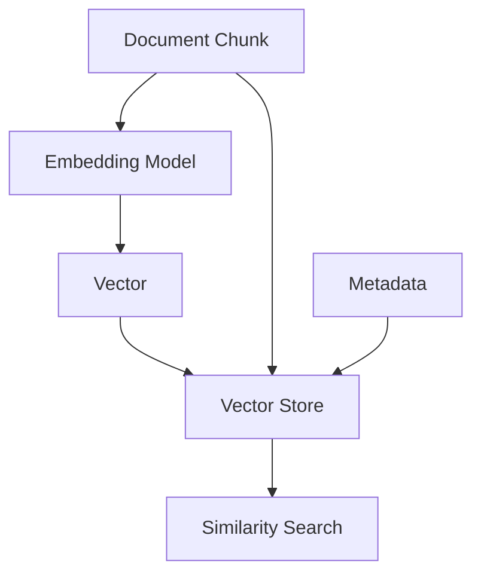

---

# 33. Example Vector Store

For local experimentation:

```python
from langchain_core.vectorstores import (
    InMemoryVectorStore
)

vector_store = InMemoryVectorStore(
    embedding=embeddings
)
```

For production, the application can use an appropriate persistent vector database or vector-enabled search platform.

---

# 34. Adding Documents

```python
vector_store.add_documents(
    documents=chunks
)
```

Conceptually:

```text
Documents
   ↓
Embedding
   ↓
Vector Store
```

---

# 35. Similarity Search

Example:

```python
results = vector_store.similarity_search(
    "What is the remote work policy?",
    k=4
)

for document in results:
    print(document.page_content)
```

---

# 36. Similarity Search Flow

```text
User Query
    ↓
Query Embedding
    ↓
Vector Similarity
    ↓
Top K
    ↓
Documents
```

---

# 37. Top-K Retrieval

`k` determines how many documents are retrieved.

Example:

```python
results = vector_store.similarity_search(
    query,
    k=5
)
```

Conceptually:

```text
100,000 Documents
       ↓
Similarity Search
       ↓
Top 5
       ↓
LLM
```

---

# 38. The K Trade-Off

Small `k`:

```text
Less context
Lower latency
Lower token cost
Potentially lower recall
```

Large `k`:

```text
More context
Higher latency
Higher token cost
Potentially more noise
```

The correct value must be evaluated against the target workload.

---

# 39. Vector Store to Retriever

A vector store can be converted into a retriever.

Example:

```python
retriever = vector_store.as_retriever(
    search_kwargs={
        "k": 4
    }
)
```

The distinction is important:

```text
Vector Store
 ↓
Stores + Searches Vectors

Retriever
 ↓
Provides a Document Retrieval Interface
```

---

# 40. Retriever

A retriever accepts an unstructured query and returns documents.

Conceptually:

```text
Query
 ↓
Retriever
 ↓
List[Document]
```

A retriever is a broader abstraction than vector search.

It can represent:

```text
Vector Search
Search Engine
Database Search
External API
Custom Retrieval Logic
```

---

# 41. Retriever Architecture

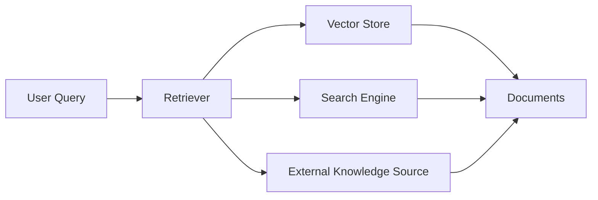

---

# 42. Retriever as Runnable

LangChain retrievers implement the Runnable interface.

This allows them to participate in composable execution pipelines.

Conceptually:

```text
Query
 ↓
Retriever.invoke()
 ↓
Documents
```

The same abstraction can be composed with:

```text
Prompt
Model
Parser
```

---

# 43. Basic Retriever Example

```python
retriever = vector_store.as_retriever(
    search_kwargs={
        "k": 4
    }
)

documents = retriever.invoke(
    "What is the remote work policy?"
)

for document in documents:
    print(document.page_content)
```

---

# 44. Retrieval Pipeline

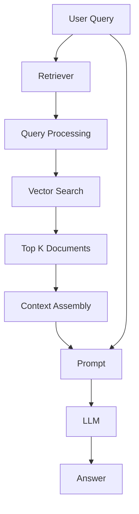

---

# 45. RAG vs Semantic Search

Semantic search:

```text
Query
 ↓
Retriever
 ↓
Relevant Documents
```

RAG:

```text
Query
 ↓
Retriever
 ↓
Relevant Documents
 ↓
Prompt
 ↓
LLM
 ↓
Answer
```

Therefore:

```text
RAG = Retrieval + Generation
```

---

# 46. Minimal RAG

A minimal RAG pipeline can be:

```text
User Query
     ↓
Retriever
     ↓
Documents
     ↓
Prompt
     ↓
LLM
     ↓
Answer
```

---

# 47. RAG Prompt

Example:

```python
from langchain_core.prompts import ChatPromptTemplate

prompt = ChatPromptTemplate.from_template(
    """
    Answer the question using only the provided context.

    Context:
    {context}

    Question:
    {question}
    """
)
```

---

# 48. Context Formatting

Retrieved documents need to be converted into prompt context.

Example:

```python
def format_docs(documents):
    return "\n\n".join(
        document.page_content
        for document in documents
    )
```

Then:

```python
context = format_docs(documents)
```

---

# 49. Runnable RAG Pipeline

LangChain's Runnable model allows retrieval and generation steps to be composed.

Example:

```python
from langchain_core.runnables import (
    RunnablePassthrough
)

rag_chain = (
    {
        "context": retriever | format_docs,
        "question": RunnablePassthrough(),
    }
    | prompt
    | model
)
```

---

# 50. Complete Minimal RAG

```python
response = rag_chain.invoke(
    "What is the remote work policy?"
)

print(response.content)
```

Flow:

```text
Question
   │
   ├───────────────┐
   │               │
   ▼               ▼
Retriever       Question
   │               │
   ▼               │
Context            │
   │               │
   └───────┬───────┘
           ▼
        Prompt
           ↓
          LLM
           ↓
        Response
```

---

# 51. Complete RAG Architecture

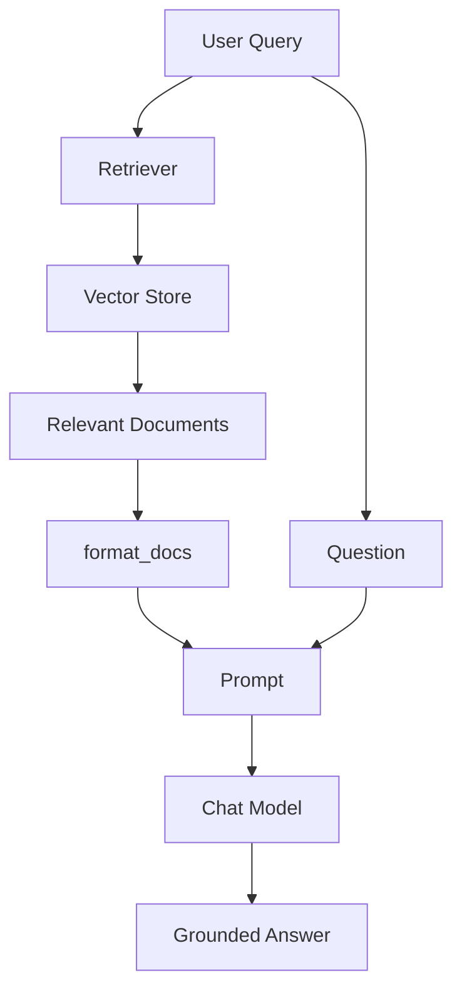

---

# 52. Two-Phase RAG

The system can be divided into:

```text
Offline Ingestion
+
Online Query
```

---

# 53. Offline Ingestion

```text
Enterprise Data
      ↓
Load
      ↓
Split
      ↓
Embed
      ↓
Index
```

This happens before the user asks a question.

---

# 54. Online Query

```text
User Query
      ↓
Query Embedding
      ↓
Retrieve
      ↓
Context
      ↓
Prompt
      ↓
LLM
      ↓
Answer
```

---

# 55. Complete RAG Lifecycle

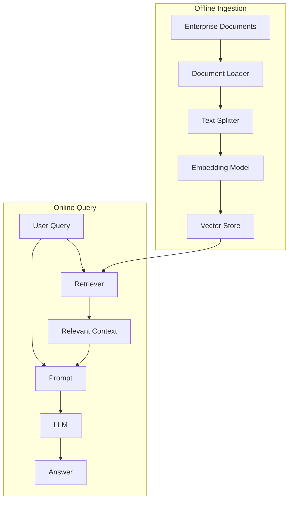

---

# 56. Metadata Filtering

Metadata can narrow retrieval.

Example metadata:

```python
{
    "department": "finance",
    "country": "india",
    "document_type": "policy"
}
```

Conceptually:

```text
Query
+
Metadata Filter
       ↓
Retriever
       ↓
Relevant Documents
```

---

# 57. Why Metadata Filtering Matters

Without filtering:

```text
Search Entire Enterprise Corpus
```

With filtering:

```text
Search
 ↓
Country = India
 ↓
Department = Finance
 ↓
Document Type = Policy
 ↓
Semantic Search
```

This can improve:

```text
Precision
Performance
Security
```

---

# 58. Enterprise Metadata

Recommended metadata may include:

```text
document_id
tenant_id
source
department
country
language
document_type
classification
created_at
updated_at
version
access_level
```

---

# 59. Tenant-Aware RAG

For multi-tenant applications:

```text
User
 ↓
Tenant Context
 ↓
Retriever
 ↓
Tenant Filter
 ↓
Vector Store
```

Never rely only on the LLM to preserve tenant isolation.

---

# 60. Tenant-Aware Architecture

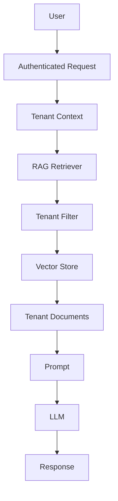

---

# 61. Similarity Search

The most basic retrieval strategy is:

```text
Query
 ↓
Embedding
 ↓
Similarity
 ↓
Top K
```

Vector stores provide similarity-search capabilities.

---

# 62. Maximum Marginal Relevance

Similarity alone can return highly redundant documents.

Example:

```text
Result 1 = Remote Work Policy
Result 2 = Remote Work Policy
Result 3 = Remote Work Policy
Result 4 = Remote Work Policy
```

Maximum Marginal Relevance (MMR) can balance:

```text
Similarity
+
Diversity
```

---

# 63. MMR Concept

```text
Query
 ↓
Candidate Documents
 ↓
Similarity
+
Diversity
 ↓
Selected Documents
```

---

# 64. MMR Example

Conceptually:

```python
retriever = vector_store.as_retriever(
    search_type="mmr",
    search_kwargs={
        "k": 4,
        "fetch_k": 20
    }
)
```

Exact support and parameters depend on the vector store integration.

---

# 65. Similarity vs MMR

| Strategy | Strength | Risk |
|---|---|---|
| Similarity | High semantic relevance | Redundant results |
| MMR | Relevance + diversity | Slightly more computation |

---

# 66. Retriever Search Strategies

At a high level:

```text
Similarity
MMR
Metadata Filter
Custom Retriever
External Search
Hybrid Retrieval
```

Advanced retrieval strategies are covered more deeply in Part V.

---

# 67. RAG Prompt Assembly

A basic prompt contains:

```text
System Instructions
+
Retrieved Context
+
User Question
```

Example:

```text
SYSTEM
You are an enterprise assistant.

CONTEXT
[Retrieved documents]

QUESTION
[User question]
```

---

# 68. Grounded Generation

The model should be instructed to use retrieved context.

Example:

```python
prompt = ChatPromptTemplate.from_template(
    """
    You are an enterprise knowledge assistant.

    Answer only using the provided context.

    If the answer cannot be found in the context,
    say that the information is unavailable.

    Context:
    {context}

    Question:
    {question}
    """
)
```

---

# 69. Preventing Hallucination

RAG does not automatically eliminate hallucinations.

Bad:

```text
Retriever
 ↓
Poor Context
 ↓
LLM
 ↓
Confident Hallucination
```

Better:

```text
Retriever
 ↓
Relevant Context
 ↓
Grounded Prompt
 ↓
LLM
 ↓
Validation
 ↓
Response
```

---

# 70. Context Quality

RAG quality depends heavily on:

```text
Retrieval Quality
+
Context Quality
+
Prompt Quality
+
Model Quality
```

A powerful LLM cannot fully compensate for poor retrieval.

---

# 71. Retrieval Quality

Consider:

```text
Question:
What is our maternity leave policy?
```

Bad retrieval:

```text
General Leave Policy
Holiday Calendar
Sick Leave Policy
```

Good retrieval:

```text
Maternity Leave Policy
```

Therefore retrieval evaluation is critical.

---

# 72. Recall vs Precision

Retrieval has two important dimensions.

### Recall

Did we retrieve the relevant information?

### Precision

How much of what we retrieved is actually relevant?

Conceptually:

```text
High Recall
+
High Precision
=
Good Retrieval
```

---

# 73. Retrieval Failure

```text
User Query
    ↓
Retriever
    ↓
Wrong Documents
    ↓
LLM
    ↓
Wrong Answer
```

This is why LLM quality alone is not a sufficient RAG metric.

---

# 74. RAG Evaluation

Important retrieval metrics include:

```text
Recall@K
Precision@K
MRR
NDCG
Hit Rate
```

Generation metrics may include:

```text
Faithfulness
Answer Relevance
Correctness
Citation Accuracy
```

Detailed RAG evaluation is covered in the dedicated RAG evaluation chapters in Part V.

---

# 75. Retrieval Debugging

When an answer is wrong, inspect:

```text
Question
 ↓
Retriever Input
 ↓
Retrieved Documents
 ↓
Scores / Metadata
 ↓
Prompt Context
 ↓
Model Response
```

Do not immediately blame the model.

---

# 76. LangSmith Observability

Production RAG systems often require tracing across:

```text
Retriever
Embedding
Vector Store
Prompt
LLM
```

A tracing platform such as LangSmith can help inspect multi-step LangChain applications.

---

# 77. RAG Trace

Conceptually:

```text
Trace
 ├── User Query
 ├── Retriever
 │    ├── Search
 │    └── Documents
 ├── Prompt
 ├── LLM
 └── Response
```

---

# 78. Observability Architecture

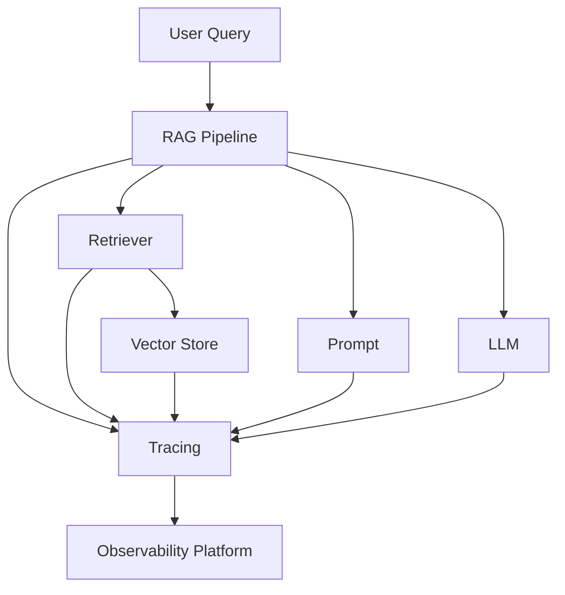

---

# 79. Retrieval Latency

A RAG request may contain:

```text
Embedding Latency
+
Vector Search Latency
+
Prompt Construction
+
LLM Latency
```

Example:

```text
Embedding      20 ms
Retrieval      40 ms
Prompt          5 ms
LLM            900 ms
--------------------
Total          965 ms
```

---

# 80. Retrieval Performance Optimization

Possible strategies:

```text
Reduce Top-K
Use Metadata Filtering
Use Appropriate Vector Index
Cache Embeddings
Cache Frequent Queries
Use Batch Embedding
Use Async Retrieval
Reduce Context Size
```

Advanced performance optimization is covered in Part V.

---

# 81. RAG Cost

Cost can come from:

```text
Document Embeddings
Query Embeddings
Vector Database
LLM Input Tokens
LLM Output Tokens
Observability
Storage
Network
```

---

# 82. Cost Optimization

A simple strategy:

```text
Retrieve Only Relevant Context
        ↓
Reduce Prompt Tokens
        ↓
Reduce LLM Input Cost
```

Other strategies:

```text
Embedding Model Selection
Caching
Batching
Chunk Optimization
Top-K Optimization
Model Routing
```

---

# 83. Production Ingestion Architecture

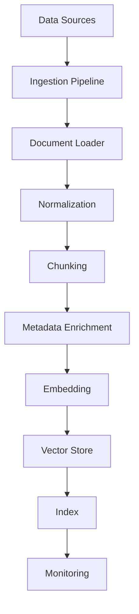

---

# 84. Production Query Architecture

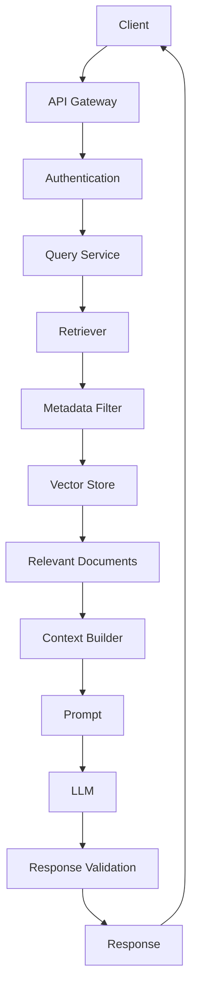

---

# 85. RAG Security

Enterprise RAG must protect:

```text
Documents
Metadata
Embeddings
Queries
Prompts
Responses
```

Potential threats:

```text
Unauthorized Retrieval
Cross-Tenant Data Leakage
Prompt Injection
Sensitive Data Exposure
Malicious Documents
Over-Permissioned Retrieval
```

---

# 86. Document-Level Authorization

A document may be accessible to:

```text
Employee A
```

but not:

```text
Employee B
```

Therefore retrieval must enforce:

```text
User Permissions
+
Document Permissions
```

---

# 87. Secure Retrieval

```text
User
 ↓
Authentication
 ↓
Authorization
 ↓
Retriever
 ↓
Permission Filter
 ↓
Vector Store
 ↓
Allowed Documents
```

Never:

```text
Vector Store
 ↓
Retrieve Everything
 ↓
Filter After LLM
```

Access control should happen before sensitive content reaches the model.

---

# 88. Secure RAG Architecture

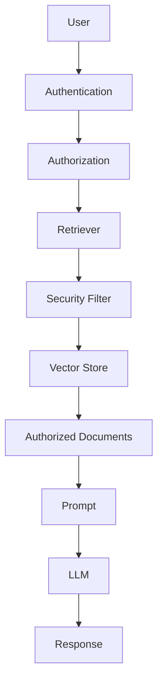

---

# 89. Metadata as Security Boundary

Example:

```python
{
    "tenant_id": "tenant-123",
    "classification": "internal",
    "department": "finance"
}
```

The retriever can use these attributes to restrict retrieval.

However, metadata filtering should be backed by authoritative authorization controls rather than being treated as the only security mechanism.

---

# 90. RAG Ingestion Versioning

Documents change.

Example:

```text
Policy v1
Policy v2
Policy v3
```

A production ingestion pipeline should track:

```text
Document ID
Version
Timestamp
Source
Hash
Embedding Version
Chunk Version
```

---

# 91. Incremental Indexing

Do not always re-index the entire corpus.

Instead:

```text
Document Change
      ↓
Detect Change
      ↓
Reprocess Document
      ↓
Delete Old Chunks
      ↓
Embed New Chunks
      ↓
Index New Version
```

---

# 92. Incremental Ingestion Architecture

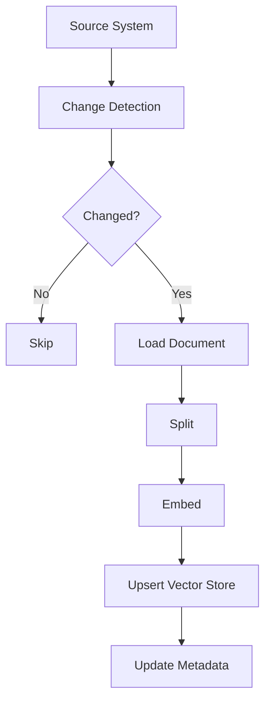

---

# 93. Document IDs

Use stable identifiers.

Example:

```text
document_id:
policy-remote-work

version:
2026-03

chunk_id:
policy-remote-work-042
```

This helps with:

```text
Updates
Deletes
Citations
Auditing
Debugging
```

---

# 94. Source Attribution

Retrieved documents should preserve:

```text
Source
Page
Document ID
Section
URL
Version
```

Example:

```python
{
    "source": "employee-handbook.pdf",
    "page": 42,
    "document_id": "handbook-2026",
    "section": "Remote Work"
}
```

---

# 95. RAG Citation Flow

```text
Retriever
 ↓
Document
 ↓
Metadata
 ↓
Context
 ↓
LLM
 ↓
Answer
+
Sources
```

---

# 96. RAG with Citations

Conceptually:

```text
Answer:

Employees can work remotely up to
three days per week.

Sources:
[1] Employee Handbook, page 42
```

Citation implementation depends on the application's response contract and validation layer.

---

# 97. Context Window Management

Retrieving too many documents can create:

```text
Large Prompt
+
High Cost
+
High Latency
+
Noise
```

Therefore:

```text
Retrieve
 ↓
Filter
 ↓
Select
 ↓
Compress
 ↓
Prompt
```

Advanced contextual compression is covered separately in Part V.

---

# 98. Basic Context Selection

```python
documents = retriever.invoke(query)

documents = documents[:4]

context = format_docs(documents)
```

In production, selection should generally be based on retrieval quality rather than blindly truncating results.

---

# 99. RAG Pipeline Composition

LangChain's Runnable architecture allows components to be composed.

Conceptually:

```text
Retriever
   ↓
Formatter
   ↓
Prompt
   ↓
Model
   ↓
Parser
```

This creates a modular pipeline.

---

# 100. RAG Runnable Graph

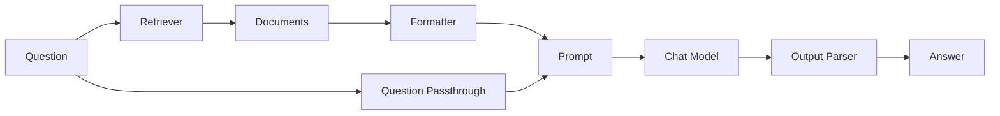

---

# 101. Output Parsing

The model response can be passed through an output parser.

Example:

```python
from langchain_core.output_parsers import StrOutputParser

chain = (
    rag_chain
    | StrOutputParser()
)
```

This can normalize model output into:

```text
String
JSON
Structured Object
```

depending on the application.

---

# 102. RAG with Structured Output

Some applications require:

```json
{
  "answer": "Employees can work remotely up to three days per week.",
  "sources": [
    {
      "document_id": "doc-123",
      "page": 42
    }
  ]
}
```

Structured output can make downstream processing more reliable.

---

# 103. Retrieval as a Tool

Retrieval can also be exposed to an Agent as a Tool.

Example:

```text
Agent
 ↓
search_enterprise_knowledge()
 ↓
Retriever
 ↓
Vector Store
 ↓
Documents
```

This creates a bridge between:

```text
LangChain Retrieval
```

and:

```text
LangChain Agents
```

---

# 104. 2-Step RAG vs Agentic RAG

At a high level:

### 2-Step RAG

```text
Query
 ↓
Retrieval
 ↓
Generation
```

### Agentic RAG

```text
Query
 ↓
Agent
 ↓
Decides when/how to retrieve
 ↓
Tools
 ↓
Generation
```

Agentic RAG belongs to the advanced RAG/Agentic AI topics rather than this foundational retrieval chapter.

---

# 105. 2-Step RAG Architecture


---

# 106. When to Use 2-Step RAG

Good use cases:

```text
Enterprise FAQ
Documentation Assistant
Policy Assistant
Product Knowledge
Internal Search
Customer Support Knowledge
```

Advantages:

```text
Predictable
Simple
Fast
Easy to Observe
Easy to Test
```

---

# 107. When RAG Is Not Required

Not every application needs RAG.

Examples:

```text
Simple summarization of user-provided text
Pure classification
Text transformation
General conversation
```

Do not introduce retrieval unnecessarily.

---

# 108. RAG vs Long Context

Modern models can accept large contexts, but that does not mean:

```text
Put entire enterprise corpus into prompt
```

A retrieval layer provides:

```text
Relevance
Access Control
Cost Control
Latency Control
Source Attribution
```

---

# 109. RAG vs Fine-Tuning

RAG is generally useful for:

```text
Frequently Changing Knowledge
Private Enterprise Knowledge
Source Attribution
Document Grounding
```

Fine-tuning is generally aimed at:

```text
Behavior
Style
Task Adaptation
Domain Patterns
```

These are different mechanisms.

---

# 110. RAG Pipeline Testing

Test each stage independently.

```text
Loader Test
 ↓
Chunking Test
 ↓
Embedding Test
 ↓
Retriever Test
 ↓
Prompt Test
 ↓
Generation Test
```

---

# 111. Retrieval Unit Test

Example:

```python
def test_retrieval():
    results = retriever.invoke(
        "remote work policy"
    )

    assert len(results) > 0
```

---

# 112. Retrieval Relevance Test

A simple example:

```python
def test_remote_policy_retrieval():
    results = retriever.invoke(
        "remote work policy"
    )

    contents = [
        document.page_content.lower()
        for document in results
    ]

    assert any(
        "remote" in content
        for content in contents
    )
```

For production, use a labeled evaluation dataset and retrieval metrics rather than relying only on keyword assertions.

---

# 113. RAG Integration Test

```text
Question
 ↓
Retriever
 ↓
Context
 ↓
Prompt
 ↓
Model
 ↓
Response
```

Verify:

```text
Relevant context was retrieved
+
Answer is grounded
+
Sources are preserved
```

---

# 114. Common Pitfall — Poor Chunking

Symptoms:

```text
Wrong Documents
Missing Context
Incomplete Answers
```

Possible improvements:

```text
Review Chunk Boundaries
Review Chunk Size
Review Overlap
Use Structure-Aware Splitting
```

---

# 115. Common Pitfall — Wrong Embedding Model

Symptoms:

```text
Low Semantic Similarity
Poor Retrieval
Unexpected Results
```

Possible improvements:

```text
Evaluate Embedding Model
Use Compatible Query/Index Embeddings
Track Embedding Versions
Re-index When Required
```

---

# 116. Common Pitfall — Too Many Retrieved Documents

Symptoms:

```text
Large Prompts
Higher Cost
More Irrelevant Context
Model Confusion
```

Possible improvements:

```text
Optimize K
Use Filtering
Use MMR
Use Reranking
Use Contextual Compression
```

Advanced approaches belong to Part V.

---

# 117. Common Pitfall — Too Few Documents

Symptoms:

```text
Missing Evidence
Incomplete Answers
Low Recall
```

Possible improvements:

```text
Increase K
Improve Chunking
Improve Embeddings
Use Query Transformation
Use Hybrid Retrieval
```

---

# 118. Common Pitfall — No Metadata

Without metadata:

```text
Everything looks like plain text
```

With metadata:

```text
Source
Department
Tenant
Version
Page
Security
```

Metadata improves production control and traceability.

---

# 119. Common Pitfall — No Access Control

Bad:

```text
User
 ↓
Retriever
 ↓
All Documents
```

Better:

```text
User
 ↓
Authorization
 ↓
Tenant / ACL Filter
 ↓
Retriever
 ↓
Allowed Documents
```

---

# 120. Common Pitfall — Treating RAG as a Single Component

RAG is not:

```text
Vector Database
```

RAG is a system:

```text
Ingestion
+
Chunking
+
Embedding
+
Indexing
+
Retrieval
+
Context Engineering
+
Generation
+
Validation
+
Observability
```

---

# 121. Production RAG Mental Model

```text
                 ENTERPRISE DATA
                       │
                       ▼
                   INGESTION
                       │
                       ▼
                    CHUNKING
                       │
                       ▼
                    EMBEDDING
                       │
                       ▼
                   VECTOR STORE
                       │
                       │
USER ───────► RETRIEVAL
                       │
                       ▼
                    CONTEXT
                       │
                       ▼
                     PROMPT
                       │
                       ▼
                      LLM
                       │
                       ▼
                   VALIDATION
                       │
                       ▼
                    RESPONSE
```

---

# 122. Enterprise RAG Architecture

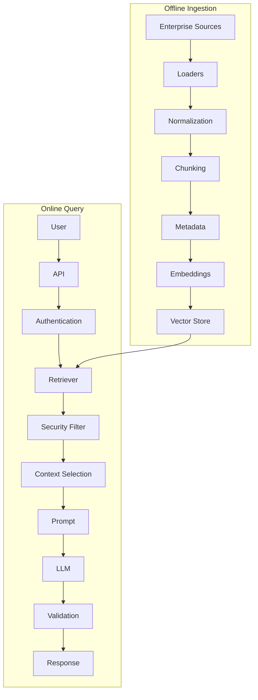

---

# 123. Production Checklist

## Ingestion

- [ ] Document loaders selected
- [ ] Large files processed incrementally
- [ ] Metadata preserved
- [ ] Document IDs stable
- [ ] Versioning implemented
- [ ] Incremental indexing supported

## Chunking

- [ ] Chunk strategy evaluated
- [ ] Chunk size evaluated
- [ ] Overlap evaluated
- [ ] Structure-aware splitting considered
- [ ] Metadata preserved

## Embeddings

- [ ] Embedding model selected
- [ ] Query/index compatibility verified
- [ ] Embedding dimensions known
- [ ] Cost evaluated
- [ ] Model version tracked

## Retrieval

- [ ] Retriever selected
- [ ] Top-K evaluated
- [ ] Metadata filtering implemented
- [ ] Tenant isolation enforced
- [ ] Retrieval quality evaluated
- [ ] MMR considered

## Generation

- [ ] Prompt grounding implemented
- [ ] Context size controlled
- [ ] Output format defined
- [ ] Citations considered
- [ ] Response validation implemented

## Security

- [ ] Authentication
- [ ] Authorization
- [ ] Document ACLs
- [ ] Tenant isolation
- [ ] Sensitive data controls
- [ ] Prompt injection controls

## Observability

- [ ] Retrieval latency
- [ ] Retrieved documents
- [ ] Retrieval scores where available
- [ ] Prompt trace
- [ ] Model latency
- [ ] Token usage
- [ ] Error tracking

---

# 124. Interview Questions

## Beginner

### 1. What is RAG?

RAG combines retrieval of external information with LLM generation.

### 2. Why is RAG useful?

It allows LLM applications to use current, private, or domain-specific information at query time.

### 3. What is a LangChain Document?

A structured representation containing:

```text
page_content
+
metadata
```

### 4. What is a document loader?

A component that loads external data into LangChain `Document` objects.

### 5. What is a text splitter?

A component that divides large documents into smaller retrievable chunks.

---

## Intermediate

### 6. What is an embedding?

A numerical vector representation of content used for semantic similarity.

### 7. What is a vector store?

A system for storing embeddings and performing vector similarity searches.

### 8. What is a retriever?

An interface that accepts a query and returns relevant documents.

### 9. How is a retriever different from a vector store?

A vector store manages storage/search of embeddings; a retriever is a broader document-retrieval abstraction.

### 10. What is metadata filtering?

Restricting retrieval based on document attributes such as tenant, department, or document type.

---

## Advanced

### 11. What happens during RAG ingestion?

```text
Load
 ↓
Split
 ↓
Embed
 ↓
Index
```

### 12. What happens during a RAG query?

```text
Query
 ↓
Retrieve
 ↓
Context
 ↓
Prompt
 ↓
LLM
 ↓
Answer
```

### 13. Why is chunking important?

Because retrieval operates on chunks, and poor chunk boundaries can reduce semantic relevance and lose important context.

### 14. Why can retrieving too many documents hurt RAG?

It increases:

```text
Noise
Token Cost
Latency
Context Competition
```

### 15. How would you secure enterprise RAG?

Use:

```text
Authentication
Authorization
Tenant Isolation
Metadata / ACL Filtering
Secure Retrieval
Response Controls
```

### 16. How would you debug a wrong RAG answer?

Inspect:

```text
Query
 ↓
Retrieved Documents
 ↓
Metadata
 ↓
Context
 ↓
Prompt
 ↓
Model Response
```

### 17. What is MMR?

Maximum Marginal Relevance balances relevance with diversity when selecting retrieved documents.

### 18. Why should embeddings be versioned?

Changing embedding models can change vector representations and may require re-indexing.

---

# 125. Key Takeaways

- RAG connects LLMs with external enterprise knowledge.
- LangChain provides abstractions for retrieval pipelines.
- `Document` represents content plus metadata.
- Document loaders convert external data into `Document` objects.
- Text splitters create retrievable chunks.
- `RecursiveCharacterTextSplitter` is a useful general-purpose starting point.
- Embedding models convert content into vectors.
- Vector stores store and search those vectors.
- Retrievers provide a broader document-retrieval abstraction.
- Vector stores can be converted into retrievers.
- Similarity search retrieves semantically similar documents.
- MMR can improve result diversity.
- Metadata filtering improves precision and enterprise control.
- RAG generally has offline ingestion and online query phases.
- Prompt construction combines the user query with retrieved context.
- RAG does not automatically eliminate hallucinations.
- Retrieval quality is critical to final answer quality.
- Secure RAG requires authorization before sensitive content reaches the model.
- Tenant isolation must be enforced outside the LLM.
- Production RAG requires observability across retrieval and generation.
- RAG performance depends on chunking, embeddings, retrieval, context size, and model latency.
- RAG cost includes embeddings, vector storage, retrieval, and LLM token usage.
- Retrieval should be tested independently from generation.
- LangChain's Runnable abstraction allows retrieval and generation components to be composed into pipelines.
- Advanced retrieval techniques such as hybrid retrieval, reranking, contextual compression, parent-child retrieval, multi-query retrieval, Graph RAG, SQL RAG, and Agentic RAG belong to the dedicated advanced RAG material in Part V.

---

# 126. LangChain Retrieval Mental Model

The most important architecture to remember is:

```text
                     ENTERPRISE DATA
                           │
                           ▼
                    DOCUMENT LOADER
                           │
                           ▼
                       DOCUMENT
                           │
                           ▼
                     TEXT SPLITTER
                           │
                           ▼
                        CHUNKS
                           │
                           ▼
                    EMBEDDING MODEL
                           │
                           ▼
                     VECTOR STORE
                           │
                           ▼
                       RETRIEVER
                           ▲
                           │
                      USER QUERY
                           │
                           ▼
                    RELEVANT CONTEXT
                           │
                           ▼
                        PROMPT
                           │
                           ▼
                          LLM
                           │
                           ▼
                    GROUNDED ANSWER
```

---

# 127. Relationship to Previous Chapter

The previous chapter covered:

```text
LangChain Tools
Tool Schemas
Tool Calling
Tool Execution
Tool Messages
Tool Runtime
Tool Security
```

This chapter adds:

```text
Document Loaders
Documents
Text Splitters
Embeddings
Vector Stores
Retrievers
Semantic Search
RAG
```

Together:

```text
                 LANGCHAIN
                    │
        ┌───────────┴───────────┐
        │                       │
      TOOLS                  RETRIEVAL
        │                       │
        ▼                       ▼
   External Actions       External Knowledge
        │                       │
        └───────────┬───────────┘
                    ▼
                  LLM
                    │
                    ▼
             AI Application
```

---

# 128. Relationship to Part V

Part V covers advanced RAG engineering in depth:

```text
Advanced RAG Architecture
Graph RAG
Knowledge Graphs
SQL RAG
Multimodal RAG
Agentic RAG
Prompt Assembly
Context Engineering
Response Validation
Citation
Evaluation
Observability
Performance
Cost Optimization
Production Retrieval
Deployment
Caching
Multi-Tenant RAG
Testing
Failure Patterns
```

This chapter intentionally focuses on:

```text
LangChain Retrieval Foundations
```

rather than duplicating those advanced production RAG topics.

---

# 129. Next Chapter

Now that we understand LangChain's retrieval foundations, the next chapter can build on these concepts with more advanced LangChain pipeline composition.

Continue with:

**[05. LangChain Memory & State](05-langchain-memory-and-state.md)**

---

# 📚 References & Further Reading

- LangChain Retrieval Documentation
- LangChain Knowledge Base / Semantic Search
- LangChain Retriever Documentation
- LangChain Document Loader Integrations
- LangChain Text Splitter Integrations
- LangChain Vector Store Integrations
- LangChain Provider Integrations

Official documentation:

- https://docs.langchain.com/oss/python/langchain/retrieval
- https://docs.langchain.com/oss/python/langchain/knowledge-base
- https://docs.langchain.com/oss/python/integrations/retrievers
- https://docs.langchain.com/oss/python/integrations/document_loaders
- https://docs.langchain.com/oss/python/integrations/splitters
- https://docs.langchain.com/oss/python/integrations/vectorstores

LangChain evolves quickly. Verify current package names, integrations, provider APIs, and method signatures against the official documentation before using examples in production.

---

> **Enterprise AI Engineering Handbook**
>
> *Building Production-Grade Enterprise AI Systems — One Chapter at a Time.*