# 05 — LangChain Memory & State

> Understand how modern LangChain applications manage conversation history, short-term memory, long-term memory, runtime context, persistent state, checkpoints, and context windows when building production-grade AI applications and agents.

---

## 📖 Overview

AI applications often need to remember information across interactions.

A simple LLM call is stateless:

```text
User
 ↓
LLM
 ↓
Response
```

The next request does not automatically contain the previous interaction.

Memory introduces continuity:

```text
User
 ↓
Conversation
 ↓
Memory / State
 ↓
LLM
 ↓
Response
```

Modern LangChain applications distinguish between several forms of context and persistence.

The most important concepts are:

```text
Runtime Context
       ↓
Short-Term Memory / State
       ↓
Long-Term Memory / Store
       ↓
Model Context
```

A production architecture therefore needs to answer:

- What should be remembered?
- For how long?
- For which conversation?
- For which user?
- Where should it be stored?
- When should it be retrieved?
- When should old information be removed?
- What information should be exposed to the model?

LangChain's current memory model uses LangGraph persistence underneath agents. Short-term memory is thread-scoped state persisted through a checkpointer, while long-term memory is stored separately and can span conversations and sessions. :contentReference[oaicite:0]{index=0}

---

# 🎯 Learning Objectives

After completing this chapter, you will be able to:

- Understand memory in AI applications
- Understand LangChain's modern memory architecture
- Differentiate state, short-term memory, long-term memory, and runtime context
- Understand conversation history
- Implement short-term memory
- Understand thread-based persistence
- Use checkpointers
- Understand `thread_id`
- Persist agent state
- Customize agent state
- Store custom state fields
- Manage long conversations
- Trim messages
- Delete messages
- Summarize conversations
- Understand long-term memory
- Use persistent stores
- Understand namespaces and keys
- Read memory from tools
- Write memory from tools
- Separate transient and persistent context
- Control what information reaches the model
- Design enterprise memory architectures
- Understand memory security and privacy
- Avoid uncontrolled memory growth
- Test memory behavior
- Observe memory operations
- Design scalable production memory systems

---

# 1. What Is Memory?

Memory allows an AI application to use information from previous interactions.

Without memory:

```text
Request 1
   ↓
LLM
   ↓
Response 1

Request 2
   ↓
LLM
   ↓
No knowledge of Request 1
```

With memory:

```text
Request 1
   ↓
Memory
   ↓
Response 1

Request 2
   ↓
Memory
   ↓
LLM
   ↓
Response 2
```

---

# 2. Why Memory Matters

Consider:

```text
User:
My name is Mihir.
```

Later:

```text
User:
What is my name?
```

A stateless LLM may not know the answer unless the application provides the previous interaction.

A memory-enabled application can maintain:

```text
User
 ↓
"My name is Mihir."
 ↓
Stored State
 ↓
Future Request
 ↓
LLM
```

---

# 3. Memory Is Not the Same as Model Knowledge

A model's training knowledge is:

```text
Training Data
      ↓
Model Parameters
```

Memory is:

```text
Application Data
      ↓
State / Store
      ↓
Model Context
```

Therefore:

```text
Model Knowledge
≠
Application Memory
```

---

# 4. Modern LangChain Memory Model

Modern LangChain distinguishes between:

```text
Runtime Context
Short-Term Memory
Long-Term Memory
```

These have different scopes and responsibilities.

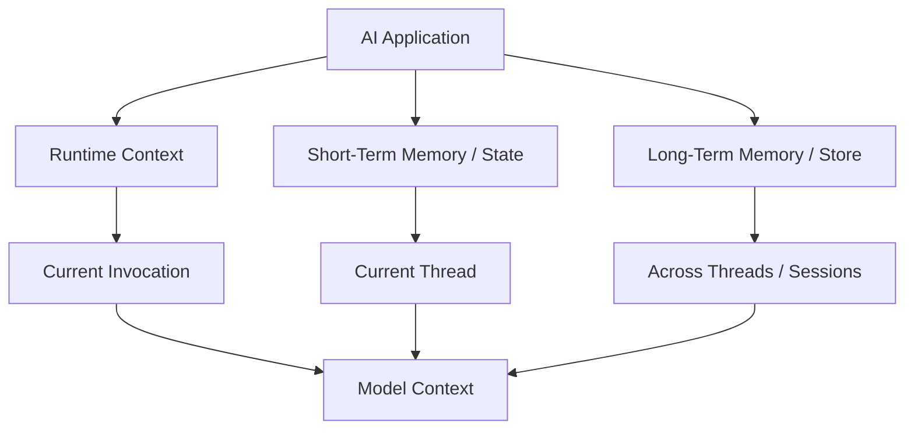

LangChain's current context-engineering documentation describes runtime context as invocation-scoped configuration, state as short-term conversation memory, and store as cross-conversation long-term memory. :contentReference[oaicite:1]{index=1}

---

# 5. Runtime Context

Runtime context contains information supplied to an invocation.

Examples:

```text
user_id
tenant_id
database connection
permissions
API configuration
environment
request metadata
```

Conceptually:

```text
Request
 ↓
Runtime Context
 ↓
Agent
```

Runtime context is not necessarily something that should be permanently remembered.

---

# 6. Short-Term Memory

Short-term memory stores information associated with a conversation or thread.

Examples:

```text
Conversation Messages
Current Task State
Tool Results
Intermediate Values
Conversation Preferences
Temporary Variables
```

Conceptually:

```text
Thread
 ↓
State
 ├── messages
 ├── task_status
 └── custom fields
```

LangChain currently describes short-term memory as thread-scoped memory that allows an application to remember previous interactions within a conversation. :contentReference[oaicite:2]{index=2}

---

# 7. Long-Term Memory

Long-term memory stores information that should survive beyond a single conversation.

Examples:

```text
User Preferences
User Profile
Historical Facts
Application Knowledge
Learned Preferences
Persistent Settings
```

Conceptually:

```text
Conversation A
       │
       ├─────────┐
       │         │
Conversation B   │
       │         ▼
       └────► Long-Term Store
```

Long-term memory can be accessed across different conversations and sessions. :contentReference[oaicite:3]{index=3}

---

# 8. Short-Term vs Long-Term Memory

| Characteristic | Short-Term Memory | Long-Term Memory |
|---|---|---|
| Scope | Thread | Cross-thread |
| Typical Content | Conversation state | Persistent user/application data |
| Lifetime | Conversation/session | Potentially long-lived |
| Storage | Checkpointer | Store |
| Example | Messages | User preferences |
| Primary Purpose | Continue current task | Remember information across sessions |

---

# 9. Memory Architecture

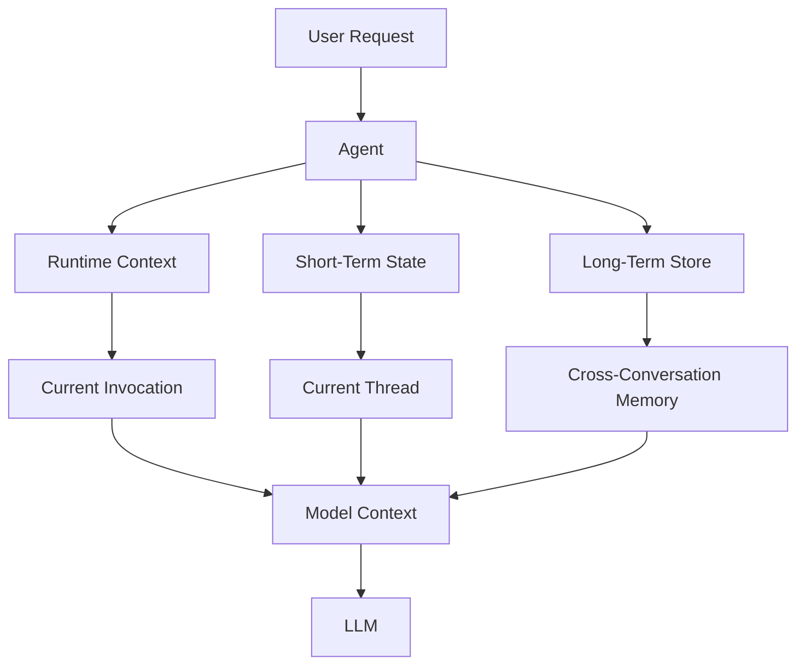

---

# 10. State

State represents information maintained during an agent or workflow execution.

Typical state:

```text
messages
task status
tool results
user information
workflow variables
intermediate results
```

Example:

```python
state = {
    "messages": [...],
    "task_status": "in_progress"
}
```

---

# 11. Agent State

Modern LangChain agents use agent state to manage short-term memory.

The default state includes conversation messages.

Conceptually:

```text
AgentState
 ├── messages
 └── custom fields
```

LangChain allows custom state schemas when additional application-specific fields are required. :contentReference[oaicite:4]{index=4}

---

# 12. Custom Agent State

Example:

```python
from langchain.agents import (
    create_agent,
    AgentState
)

class CustomAgentState(AgentState):
    user_id: str
    preferences: dict
```

The application can then pass additional state:

```python
result = agent.invoke(
    {
        "messages": [
            {
                "role": "user",
                "content": "Hello"
            }
        ],
        "user_id": "user_123",
        "preferences": {
            "theme": "dark"
        }
    }
)
```

---

# 13. Why Custom State Matters

Enterprise agents frequently need more than messages.

Example:

```text
messages
user_id
tenant_id
workflow_id
task_status
approval_status
risk_level
tool_results
```

Therefore:

```text
Agent State
=
Conversation
+
Application State
```

---

# 14. State vs Runtime Context

These concepts should not be confused.

### State

```text
Mutable
Conversation-scoped
Persistable
```

Examples:

```text
messages
task_status
temporary workflow data
```

### Runtime Context

```text
Invocation-scoped
Configuration / dependencies
Usually not conversational memory
```

Examples:

```text
user_id
database connection
permissions
API clients
environment settings
```

---

# 15. State vs Store

Another important distinction:

```text
State
 ↓
Current conversation

Store
 ↓
Persistent information across conversations
```

Example:

```text
Current conversation:
"User wants a concise answer."

Long-term preference:
"User prefers concise responses."
```

The second is a candidate for long-term memory.

---

# 16. Thread

A thread represents a conversation or execution context.

Conceptually:

```text
thread_id
     ↓
Conversation
     ↓
State
     ↓
Messages
```

Example:

```python
config = {
    "configurable": {
        "thread_id": "conversation-123"
    }
}
```

---

# 17. Why Thread IDs Matter

Suppose:

```text
User A → thread-001
User B → thread-002
```

The system must keep their state separate.

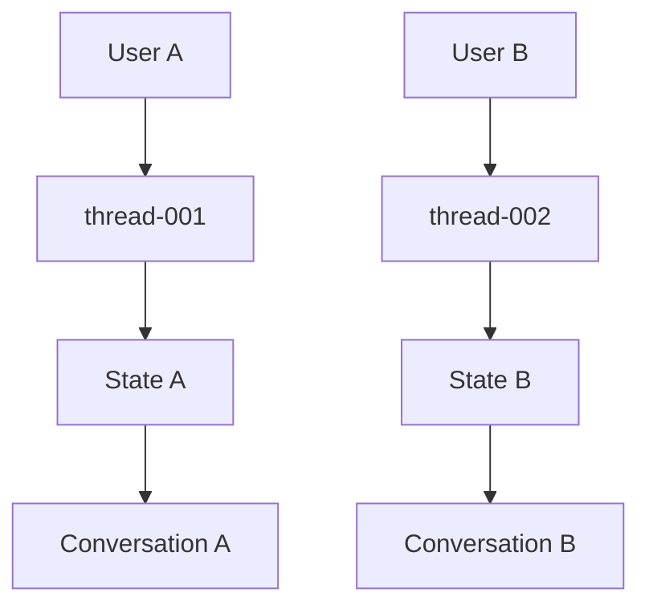

Thread isolation is therefore fundamental to enterprise conversational systems.

---

# 18. Short-Term Memory Persistence

Short-term memory is persisted through a checkpointer.

Conceptually:

```text
Agent
 ↓
State
 ↓
Checkpointer
 ↓
Persistent Storage
```

LangChain's current agent documentation uses a checkpointer to persist thread-level state and resume conversations. :contentReference[oaicite:5]{index=5}

---

# 19. In-Memory Checkpointer

For development:

```python
from langgraph.checkpoint.memory import InMemorySaver

checkpointer = InMemorySaver()
```

Then:

```python
from langchain.agents import create_agent

agent = create_agent(
    model,
    tools=tools,
    checkpointer=checkpointer
)
```

---

# 20. Invoking with a Thread

```python
config = {
    "configurable": {
        "thread_id": "thread-001"
    }
}

agent.invoke(
    {
        "messages": [
            {
                "role": "user",
                "content": "My name is Mihir."
            }
        ]
    },
    config
)
```

The thread identifies which conversation state should be loaded and updated.

---

# 21. Continuing a Conversation

First request:

```python
agent.invoke(
    {
        "messages": [
            {
                "role": "user",
                "content": "My name is Mihir."
            }
        ]
    },
    config
)
```

Later request:

```python
agent.invoke(
    {
        "messages": [
            {
                "role": "user",
                "content": "What is my name?"
            }
        ]
    },
    config
)
```

Because the same `thread_id` is used, the application can continue the conversation.

---

# 22. Memory Flow

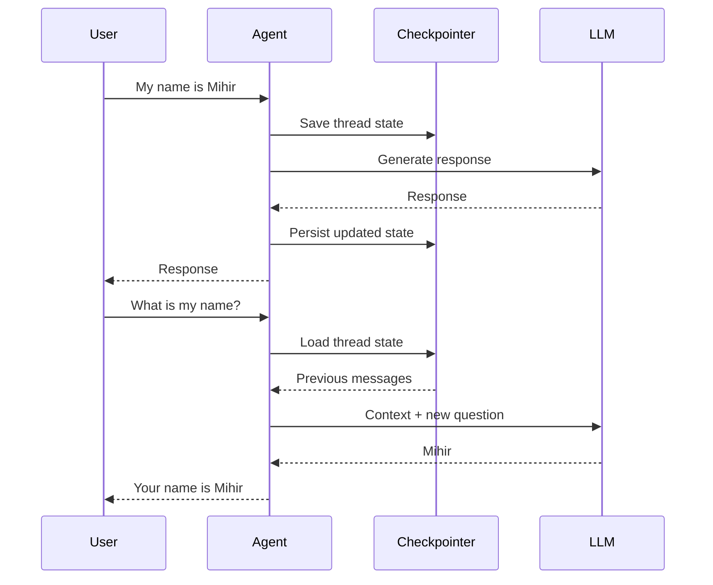

---

# 23. Production Checkpointers

In production, memory should generally be backed by durable storage rather than process memory.

Examples include:

```text
PostgreSQL
SQLite
Cloud / Managed Persistence
Other Supported Checkpointer Implementations
```

For example:

```python
from langgraph.checkpoint.postgres import PostgresSaver
```

Production storage should be selected based on:

```text
Durability
Scalability
Availability
Latency
Security
Operational Model
Compliance
```

LangChain's current documentation specifically demonstrates database-backed Postgres persistence for production use. :contentReference[oaicite:6]{index=6}

---

# 24. Checkpoint Concept

A checkpoint represents persisted state at a point in the execution.

Conceptually:

```text
Thread
  │
  ├── Checkpoint 1
  │
  ├── Checkpoint 2
  │
  ├── Checkpoint 3
  │
  └── Current State
```

This can support:

```text
Conversation Resume
State Inspection
Recovery
Debugging
```

---

# 25. Inspecting Thread State

A LangGraph graph can expose persisted state.

Conceptually:

```python
config = {
    "configurable": {
        "thread_id": "thread-001"
    }
}

state = graph.get_state(config)

print(state)
```

LangGraph provides state inspection through its persistence/checkpoint mechanisms. :contentReference[oaicite:7]{index=7}

---

# 26. Checkpoint Architecture

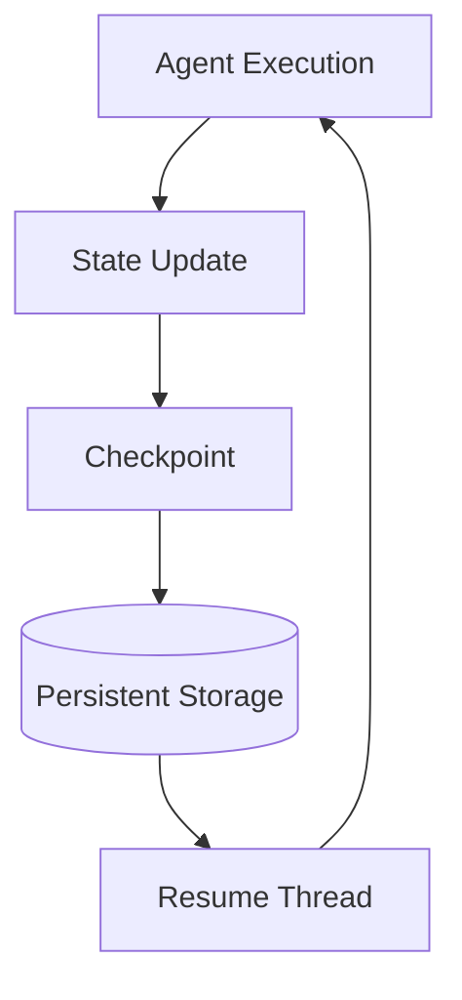

---

# 27. Conversation History

The most common form of short-term memory is conversation history.

Example:

```text
Human:
My name is Mihir.

AI:
Nice to meet you.

Human:
What is my name?

AI:
Your name is Mihir.
```

Internally:

```text
messages = [
    HumanMessage(...),
    AIMessage(...),
    HumanMessage(...),
    AIMessage(...)
]
```

---

# 28. Why Conversation History Becomes a Problem

A long conversation can grow indefinitely:

```text
Message 1
Message 2
Message 3
...
Message 1000
```

Eventually:

```text
Context Window
       ↓
Exceeded
```

Even when the context window is technically large, excessive history can increase:

```text
Latency
Cost
Noise
Model Distraction
```

LangChain's current documentation explicitly recommends managing long histories rather than allowing unbounded message growth. :contentReference[oaicite:8]{index=8}

---

# 29. Memory Management Strategies

Common strategies include:

```text
Trim
Delete
Summarize
Filter
Compress
Persist selectively
```

LangChain documents trimming, deletion, summarization, and custom strategies for managing short-term memory. :contentReference[oaicite:9]{index=9}

---

# 30. Message Trimming

Instead of sending the complete conversation:

```text
Message 1
Message 2
Message 3
...
Message 100
```

keep only the relevant portion:

```text
Message 1
Message 98
Message 99
Message 100
```

Conceptually:

```text
Full History
      ↓
Token Count
      ↓
Trim
      ↓
Model Context
```

---

# 31. Message Trimming Architecture

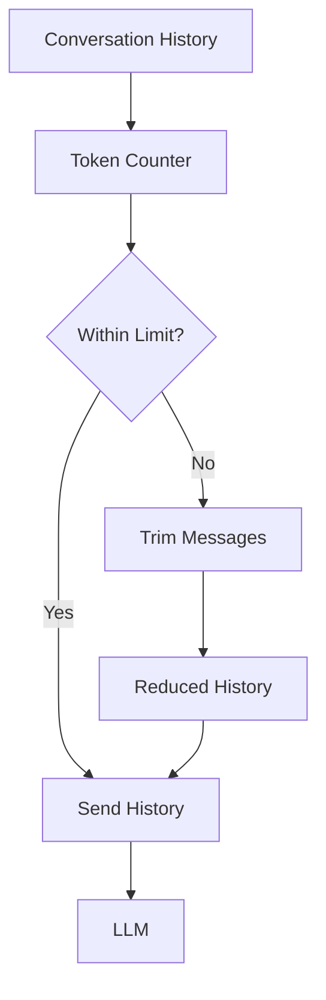

---

# 32. Trimming Example

LangChain provides utilities and middleware patterns for trimming messages before model execution.

Conceptually:

```python
@before_model
def trim_messages(state, runtime):
    messages = state["messages"]

    if len(messages) <= 10:
        return None

    recent_messages = messages[-10:]

    return {
        "messages": recent_messages
    }
```

The exact state-update mechanism should follow the current LangGraph message-state APIs.

---

# 33. Delete Messages

Sometimes old messages should be permanently removed from the active conversation state.

Example use cases:

```text
Sensitive Information
Expired Context
Irrelevant History
Conversation Cleanup
```

Conceptually:

```text
State
 ↓
Identify Messages
 ↓
Delete
 ↓
Updated State
```

LangChain supports explicit message deletion through LangGraph state updates. :contentReference[oaicite:10]{index=10}

---

# 34. Summarization

Instead of keeping every historical message:

```text
Message 1
Message 2
Message 3
...
Message 100
```

create:

```text
Conversation Summary
```

Example:

```text
User is building an enterprise AI application.
They prefer Java for backend services.
They are evaluating LangChain and LangGraph.
```

Then:

```text
Summary
+
Recent Messages
```

are provided to the model.

---

# 35. Summarization Architecture

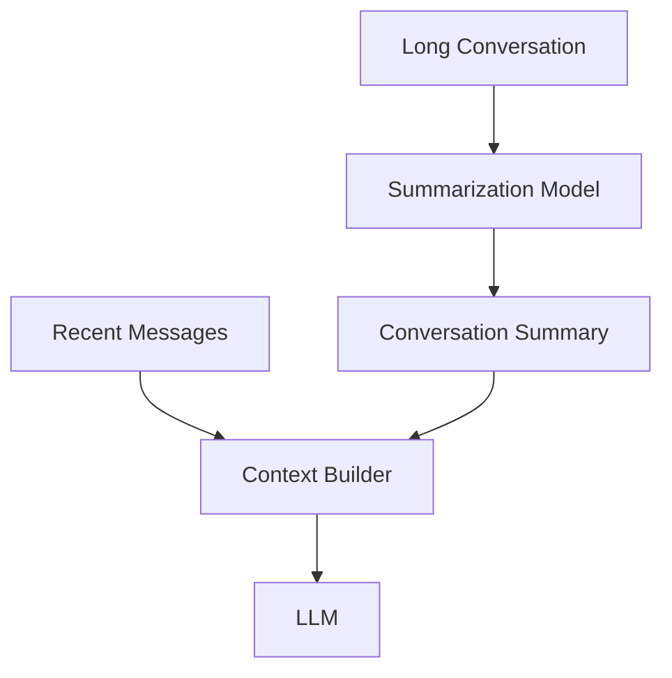

---

# 36. Summarization Trade-Off

Advantages:

```text
Lower Token Usage
Lower Latency
Preserves High-Level Context
```

Risks:

```text
Information Loss
Incorrect Summary
Important Details Discarded
Additional Model Cost
```

Therefore summarization should be evaluated.

---

# 37. Summarization Middleware

Modern LangChain provides middleware support for summarizing long message histories.

Conceptually:

```python
from langchain.agents.middleware import (
    SummarizationMiddleware
)

middleware = SummarizationMiddleware(
    model="summary-model",
    trigger=("tokens", 4000),
    keep=("messages", 20)
)
```

This approach allows summarization to occur when the configured context threshold is reached. :contentReference[oaicite:11]{index=11}

---

# 38. Memory Strategy

A production application may combine:

```text
Long-Term Summary
+
Recent Messages
+
Relevant Retrieved Memory
```

Example:

```text
Persistent User Profile
        +
Conversation Summary
        +
Last 10 Messages
        +
Retrieved Knowledge
        ↓
Model Context
```

---

# 39. Long-Term Memory

Long-term memory is useful when information should survive across conversations.

Examples:

```text
User preferences
Preferred language
Communication style
Saved configuration
Historical facts
Important recurring information
```

---

# 40. Long-Term Memory Architecture

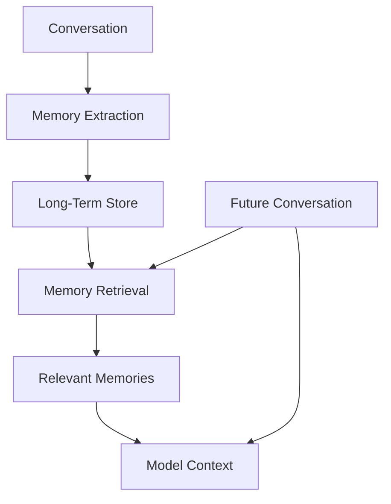

---

# 41. Long-Term Store

LangChain's current long-term memory model uses a store abstraction.

Conceptually:

```text
Store
 ├── Namespace
 ├── Key
 └── Value
```

The value is commonly structured as JSON-like data.

LangChain's documentation describes long-term memory as being stored using LangGraph stores organized by namespace and key. :contentReference[oaicite:12]{index=12}

---

# 42. Namespace

Namespaces help separate categories of memory.

Example:

```text
("users", "user-123")
```

or:

```text
("preferences", "user-123")
```

Conceptually:

```text
Store
 ├── users
 │    ├── user-001
 │    └── user-002
 │
 └── preferences
      ├── user-001
      └── user-002
```

---

# 43. Key

A key identifies an individual memory item.

Example:

```text
Namespace:
users

Key:
user-123
```

Value:

```json
{
  "name": "Mihir",
  "preferred_style": "concise"
}
```

---

# 44. In-Memory Store

For development:

```python
from langgraph.store.memory import InMemoryStore

store = InMemoryStore()
```

This is useful for experiments and tests.

For production:

```text
Use a durable persistent store
```

---

# 45. Reading Long-Term Memory

Conceptually:

```python
user_info = store.get(
    ("users",),
    "user-123"
)

if user_info:
    print(user_info.value)
```

The exact store implementation and APIs should be verified against the selected LangGraph store backend.

---

# 46. Writing Long-Term Memory

Conceptually:

```python
store.put(
    ("users",),
    "user-123",
    {
        "name": "Mihir",
        "preferred_style": "concise"
    }
)
```

This creates persistent information that can be retrieved in future conversations.

---

# 47. Memory Retrieval

Long-term memory should not necessarily be loaded completely into every prompt.

Instead:

```text
User Request
      ↓
Memory Search
      ↓
Relevant Memories
      ↓
Context Selection
      ↓
LLM
```

This is similar to retrieval.

---

# 48. Memory as Retrieval

```text
Long-Term Store
       ↓
Search
       ↓
Relevant Memories
       ↓
Context
```

Therefore:

```text
Memory Retrieval
≈
Retrieval over Persistent User/Application Data
```

---

# 49. Memory vs RAG

Memory:

```text
User / Application-specific information
```

RAG:

```text
External knowledge corpus
```

Example:

```text
Memory:
"User prefers concise responses."

RAG:
"Company remote work policy allows three remote days."
```

They can coexist:

```text
Memory
+
RAG
+
Conversation State
```

---

# 50. Combined Context Architecture

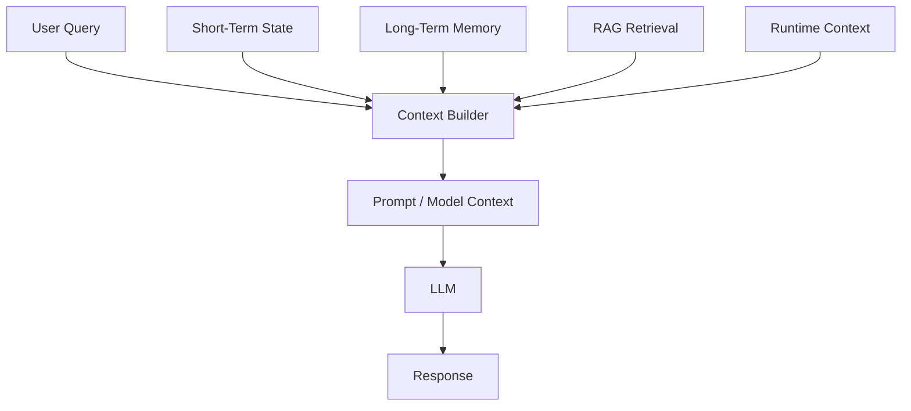

---

# 51. Memory Access from Tools

Modern LangChain tools can access runtime information through `ToolRuntime`.

This can provide access to:

```text
State
Context
Store
Execution Information
```

LangChain's current tool runtime documentation explicitly distinguishes state, context, store, and execution information. :contentReference[oaicite:13]{index=13}

---

# 52. Reading State from a Tool

Example:

```python
from langchain.tools import tool, ToolRuntime

@tool
def get_user_context(
    runtime: ToolRuntime
) -> str:
    """Read current user context."""

    user_id = runtime.state.get(
        "user_id"
    )

    return f"Current user: {user_id}"
```

The runtime parameter is injected by the framework and is not exposed as a normal model-facing tool argument. :contentReference[oaicite:14]{index=14}

---

# 53. Reading Long-Term Memory from a Tool

Conceptually:

```python
@tool
def get_user_preferences(
    runtime: ToolRuntime
) -> str:
    """Retrieve persistent user preferences."""

    store = runtime.store

    memory = store.get(
        ("preferences",),
        "user-123"
    )

    if not memory:
        return "No preferences found."

    return str(memory.value)
```

---

# 54. Tool Memory Architecture

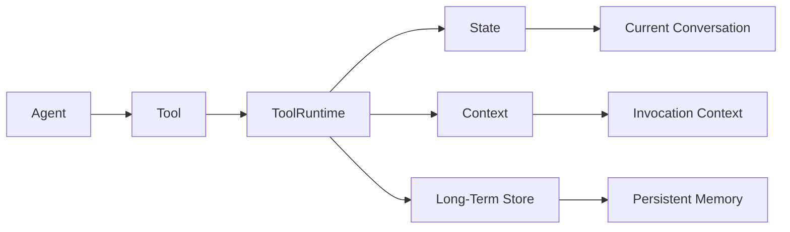

---

# 55. Writing Memory from Tools

Tools can also update state or persistent memory.

Conceptually:

```text
Tool
 ↓
Process Information
 ↓
Memory Update
 ↓
Future Invocation
```

For example:

```text
User:
Remember that I prefer concise answers.
```

A memory-aware tool could:

```text
Extract Preference
      ↓
Validate
      ↓
Store
      ↓
Confirm
```

---

# 56. Memory Extraction

Not every message should become memory.

Bad:

```text
User:
What is the weather today?

→ Store as permanent memory
```

Better:

```text
User:
Remember that I prefer concise answers.

→ Candidate long-term memory
```

Memory extraction should therefore have explicit criteria.

---

# 57. Memory Candidate Pipeline

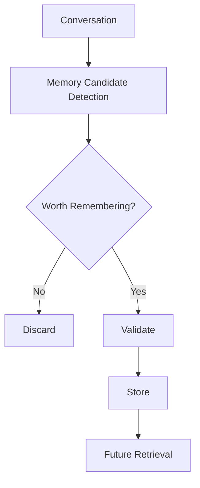

---

# 58. What Should Be Stored?

Potential candidates:

```text
Stable Preferences
User Profile
Recurring Requirements
Explicitly Saved Information
Long-Term Task Context
Application Facts
```

Avoid storing everything.

---

# 59. What Should Not Be Stored?

Potentially avoid:

```text
Temporary Conversation Details
Irrelevant Chatter
Sensitive Information Without Authorization
Expired Information
Secrets
Passwords
API Keys
Raw Credentials
```

Memory is a data storage system and therefore introduces security responsibilities.

---

# 60. Memory Security

Enterprise memory can contain sensitive information.

Potential risks:

```text
Unauthorized Access
Cross-Tenant Leakage
Sensitive Data Persistence
Data Retention Violations
Prompt Injection Through Memory
Incorrect Personalization
Stale Information
```

---

# 61. Secure Memory Architecture

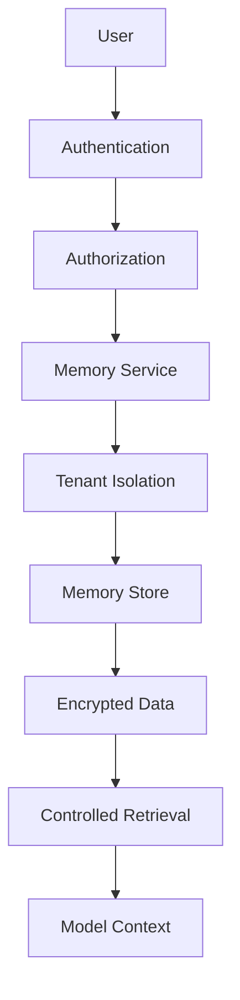

---

# 62. Tenant Isolation

Enterprise applications must prevent:

```text
Tenant A Memory
      ↓
Tenant B User
```

A safer architecture:

```text
Tenant
 ↓
User
 ↓
Memory Namespace
 ↓
Memory Store
```

Example:

```text
("tenant-001", "user-123", "preferences")
```

The exact namespace design depends on the application's authorization model.

---

# 63. Memory Authorization

Do not assume that knowing a user ID is sufficient authorization.

Bad:

```text
Request
 ↓
user_id
 ↓
Memory Store
```

Better:

```text
Request
 ↓
Authentication
 ↓
Authorization
 ↓
Tenant Validation
 ↓
Memory Store
```

---

# 64. Memory Privacy

Memory introduces a long-lived data footprint.

Organizations should consider:

```text
Data Minimization
Retention Policies
Deletion
Encryption
Access Control
Audit Logging
Consent
Compliance
```

---

# 65. Memory Deletion

Users may need to remove stored information.

Example:

```text
Delete User Memory
       ↓
Identify Namespace
       ↓
Delete Memory Items
       ↓
Confirm Deletion
       ↓
Audit
```

A production memory system should provide explicit deletion workflows.

---

# 66. Memory TTL

Some information should expire.

Examples:

```text
Temporary Preferences
Session Context
Short-Lived Recommendations
Temporary Workflow State
```

Conceptually:

```text
Memory
 ↓
TTL
 ↓
Expiration
 ↓
Deletion
```

TTL support depends on the selected persistence implementation.

---

# 67. Stale Memory

Long-term memories can become outdated.

Example:

```text
User:
I work in the Finance department.
```

Later:

```text
User changes role to Engineering.
```

The old memory becomes stale.

Therefore:

```text
Memory
+
Version
+
Timestamp
+
Update Policy
```

may be required.

---

# 68. Memory Update Strategy

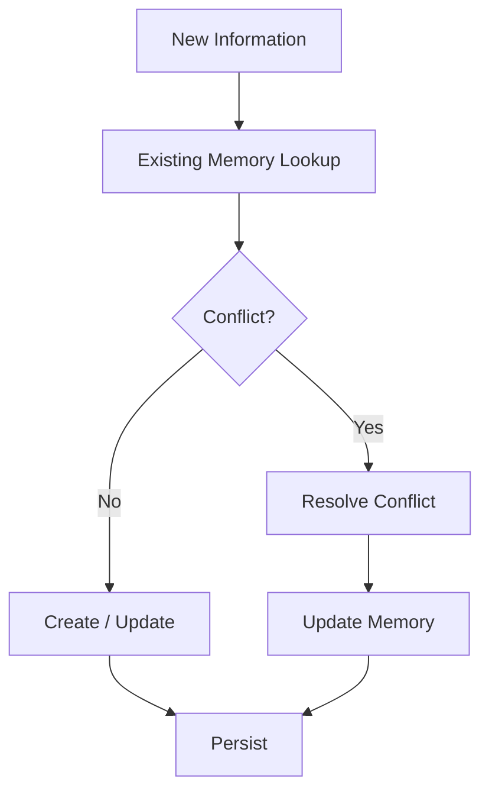

---

# 69. Memory Conflicts

Example:

```text
Old:
Preferred language = English

New:
Preferred language = German
```

Possible strategies:

```text
Latest Wins
Explicit User Instruction Wins
Confidence-Based
Human Approval
Versioned Memory
```

The strategy should be explicit.

---

# 70. Memory Confidence

A memory system may assign confidence:

```text
Preference:
concise responses

Confidence:
0.95
```

Another:

```text
User may prefer dark mode

Confidence:
0.55
```

Low-confidence information may require confirmation before becoming persistent memory.

---

# 71. Memory Lifecycle

A useful enterprise lifecycle:

```text
Capture
 ↓
Validate
 ↓
Normalize
 ↓
Store
 ↓
Retrieve
 ↓
Use
 ↓
Update
 ↓
Expire / Delete
```

---

# 72. Memory Lifecycle Architecture

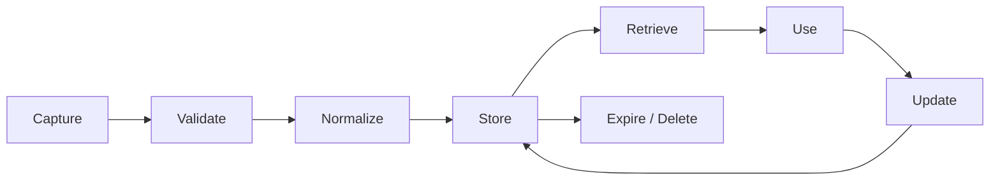

---

# 73. Memory and Context Engineering

Memory is not automatically useful just because it exists.

The application must decide:

```text
What memory should be retrieved?
What memory should be ignored?
What should be summarized?
What should be sent to the model?
```

Therefore:

```text
Memory
 ↓
Selection
 ↓
Context Engineering
 ↓
Model
```

---

# 74. Transient vs Persistent Context

Modern LangChain distinguishes:

### Transient Context

Information prepared for a particular model call.

```text
Current prompt
Current tool context
Temporary instructions
```

### Persistent Context

Information saved in state or long-term memory.

```text
Conversation state
Persistent preferences
Historical information
```

LangChain's context-engineering documentation makes this distinction explicit. :contentReference[oaicite:15]{index=15}

---

# 75. Model Context Assembly

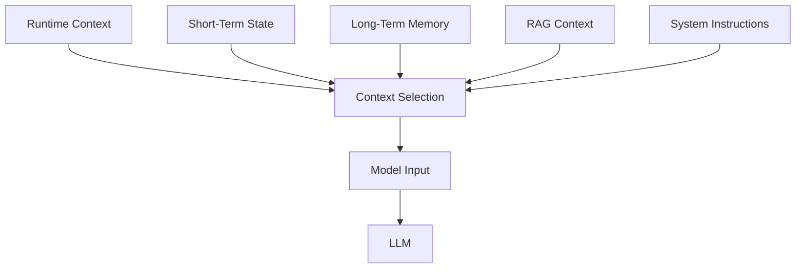

---

# 76. Memory Does Not Mean "Send Everything"

A common mistake is:

```text
All Memory
+
All Conversation
+
All RAG Results
+
All Tools
 ↓
LLM
```

This can cause:

```text
Token Explosion
Cost
Latency
Noise
Confusion
```

Instead:

```text
Retrieve
 ↓
Filter
 ↓
Rank
 ↓
Summarize
 ↓
Select
 ↓
Model
```

---

# 77. Memory Selection

Selection criteria may include:

```text
Relevance
Recency
Importance
User Explicitness
Confidence
Authorization
Task Context
```

---

# 78. Memory Retrieval Architecture

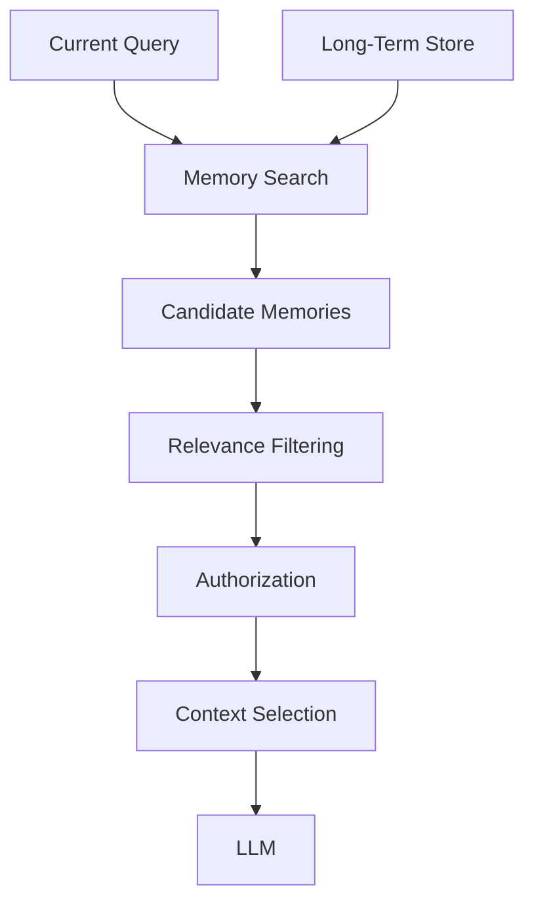

---

# 79. Memory and RAG Together

A sophisticated enterprise assistant may use:

```text
Conversation Memory
+
User Memory
+
Enterprise RAG
+
Runtime Context
```

Example:

```text
User Query
     │
     ├── Short-Term Memory
     │
     ├── Long-Term User Memory
     │
     ├── Enterprise RAG
     │
     └── Runtime Context
              ↓
        Context Builder
              ↓
             LLM
```

---

# 80. Memory vs State vs RAG

| Component | Purpose | Example |
|---|---|---|
| State | Current conversation/workflow | Messages |
| Long-Term Memory | Persistent user/application facts | Preferences |
| RAG | External knowledge retrieval | Company policies |
| Runtime Context | Current invocation configuration | User ID |
| Model Knowledge | Learned training knowledge | General concepts |

This distinction is critical for architecture decisions.

---

# 81. Memory and Agents

Memory becomes especially important for agents because agents may perform multi-step work.

Example:

```text
User Request
 ↓
Agent
 ↓
Tool 1
 ↓
Tool 2
 ↓
Tool 3
 ↓
Final Answer
```

The agent may need to maintain:

```text
Task State
Tool Results
Intermediate Results
Conversation History
User Preferences
```

---

# 82. Agent Memory Architecture

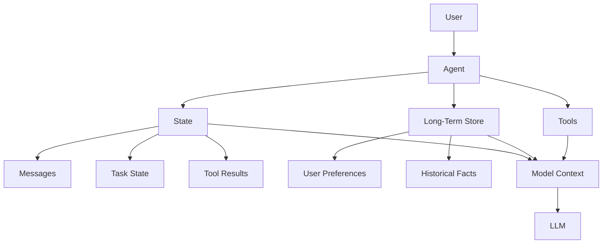

---

# 83. Memory During Tool Execution

Tools may need current state:

```text
Current User
Current Task
Previous Tool Results
Authorization
```

Runtime information can be accessed through `ToolRuntime`.

This allows tools to operate using application context without exposing internal runtime parameters to the model. :contentReference[oaicite:16]{index=16}

---

# 84. Memory During Middleware

Middleware can inspect and modify state before or after model execution.

Examples:

```text
before_model
after_model
```

Potential uses:

```text
Trim messages
Inject context
Validate responses
Update state
Apply policy
```

LangChain's current short-term memory documentation demonstrates `@before_model` and `@after_model` middleware for memory management. :contentReference[oaicite:17]{index=17}

---

# 85. Before-Model Memory Processing

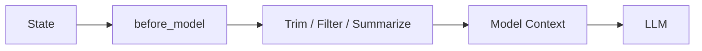

---

# 86. After-Model Memory Processing

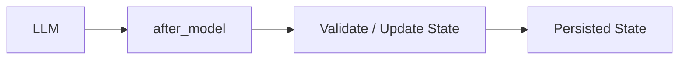

---

# 87. Memory and Streaming

Streaming applications may need to distinguish between:

```text
Generated Output
State Updates
Tool Progress
Memory Updates
```

These should not be mixed blindly.

A production architecture should define which events are:

```text
User-visible
Internal
Persistent
Auditable
```

---

# 88. Memory and Async Execution

Enterprise applications may execute many conversations concurrently.

Therefore memory operations must support:

```text
Concurrent Users
Concurrent Threads
Async Requests
Multiple Agent Instances
Distributed Workers
```

Memory storage must be designed for concurrency.

---

# 89. Distributed Memory

In a distributed architecture:

```text
Load Balancer
      │
 ┌────┼────┐
 ▼    ▼    ▼
Worker Worker Worker
  │     │     │
  └─────┼─────┘
        ▼
   Shared Memory Store
```

Do not rely on local process memory for production conversation persistence.

---

# 90. Production Memory Architecture

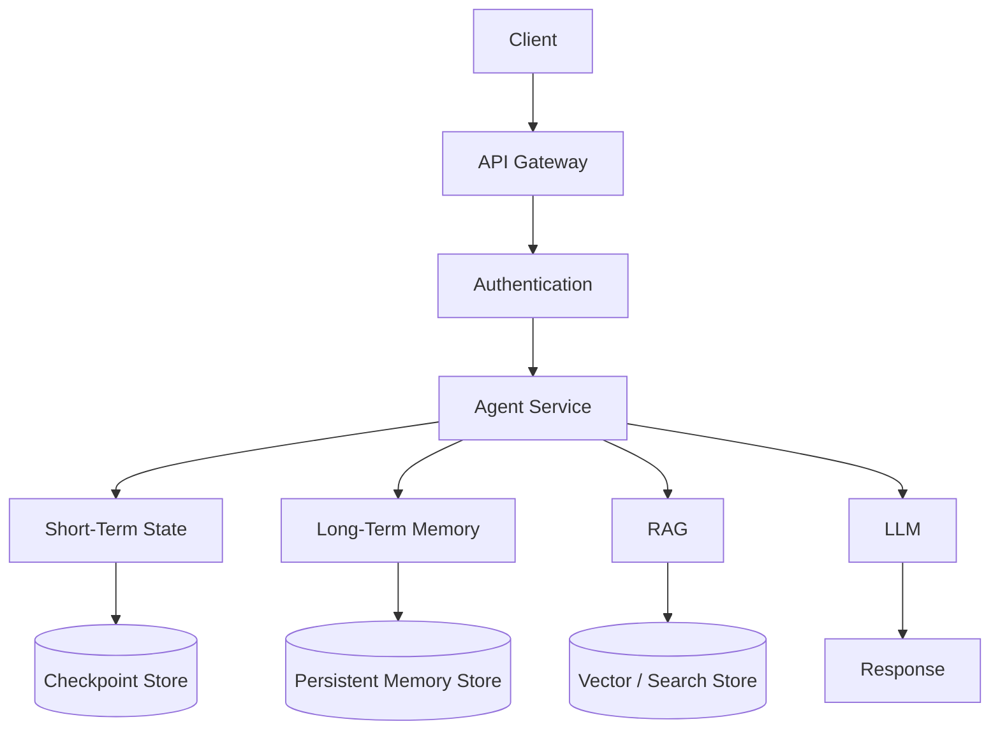

---

# 91. Memory Scalability

Memory systems should consider:

```text
Number of Users
Number of Threads
Memory Size
Read Frequency
Write Frequency
Retention
Query Latency
Availability
```

---

# 92. Memory Cost

Costs may include:

```text
Database Storage
Database Reads
Database Writes
Memory Search
Embedding
Summarization
LLM Calls
Observability
Backups
```

Long-term memory can therefore become a significant operational component.

---

# 93. Memory Observability

Track:

```text
Memory Reads
Memory Writes
Memory Retrieval Latency
Memory Size
Memory Hit Rate
Summarization Events
Trim Events
Deletion Events
Errors
```

---

# 94. Memory Trace

```text
Request
 ↓
Load Thread State
 ↓
Memory Retrieval
 ↓
Context Assembly
 ↓
LLM
 ↓
State Update
 ↓
Memory Write
 ↓
Response
```

---

# 95. Observability Architecture

```mermaid
flowchart TD

    A[Agent Request] --> B[Memory Layer]

    B --> C[Checkpoint Read]
    B --> D[Long-Term Memory Read]

    B --> E[Context Assembly]

    E --> F[LLM]

    F --> G[State Update]

    G --> H[Checkpoint Write]

    G --> I[Memory Write]

    B --> J[Telemetry]

    C --> J
    D --> J
    E --> J
    H --> J
    I --> J

    J --> K[Observability Platform]
```

---

# 96. Memory Failure Patterns

Common failures include:

```text
Memory Not Persisted
Wrong Thread ID
Cross-User Memory Leakage
Stale Memory
Memory Explosion
Context Overflow
Incorrect Summarization
Duplicate Memories
Unauthorized Memory Access
```

---

# 97. Wrong Thread ID

Example:

```text
User
 ↓
thread-A
 ↓
Conversation State
```

Later:

```text
User
 ↓
thread-B
 ↓
Empty Conversation
```

The system appears to have "forgotten" the user.

The issue may simply be incorrect thread identity.

---

# 98. Cross-Tenant Memory Leakage

Bad:

```text
Tenant A
 ↓
Shared Namespace
 ↓
User A
```

and:

```text
Tenant B
 ↓
Same Namespace
 ↓
User B
```

Without proper isolation, one tenant may access another tenant's memory.

This is a critical enterprise security failure.

---

# 99. Memory Explosion

Bad architecture:

```text
Every Message
 ↓
Permanent Memory
```

Over time:

```text
Millions of Memories
```

Better:

```text
Candidate Detection
 ↓
Importance
 ↓
Deduplication
 ↓
Storage
 ↓
Expiration
```

---

# 100. Duplicate Memory

Example:

```text
User prefers concise responses.

Memory 1:
concise

Memory 2:
prefers short answers

Memory 3:
likes concise replies
```

A memory system should consider:

```text
Normalization
Deduplication
Canonical Representation
```

---

# 101. Memory Evaluation

Memory systems should be evaluated independently.

Metrics can include:

```text
Memory Retrieval Accuracy
Memory Recall
Memory Precision
Memory Freshness
Memory Conflict Rate
Memory Leakage Rate
```

---

# 102. Memory Test Cases

### Test 1 — Conversation Continuity

```text
Turn 1:
My name is Mihir.

Turn 2:
What is my name?

Expected:
Mihir
```

### Test 2 — Thread Isolation

```text
Thread A:
My name is Mihir.

Thread B:
What is my name?

Expected:
Unknown
```

### Test 3 — Long-Term Memory

```text
Session A:
Remember that I prefer concise responses.

Session B:
Give me an explanation.

Expected:
Concise response
```

---

# 103. Memory Integration Test

```python
def test_conversation_memory(agent):

    config = {
        "configurable": {
            "thread_id": "test-thread"
        }
    }

    agent.invoke(
        {
            "messages": [
                {
                    "role": "user",
                    "content": "My name is Mihir."
                }
            ]
        },
        config
    )

    result = agent.invoke(
        {
            "messages": [
                {
                    "role": "user",
                    "content": "What is my name?"
                }
            ]
        },
        config
    )

    assert "Mihir" in result["messages"][-1].content
```

---

# 104. Memory Security Test

Test that:

```text
User A
 ↓
Memory A
```

cannot retrieve:

```text
User B
 ↓
Memory B
```

Example:

```text
Tenant A + User A
        ↓
Memory Query
        ↓
Only Tenant A/User A data
```

---

# 105. Memory Retention Test

Test:

```text
Memory Created
      ↓
TTL / Retention
      ↓
Expiration
      ↓
Memory Deleted
```

The exact mechanism depends on the persistence backend.

---

# 106. Memory Deletion Test

Test that a deletion request removes:

```text
Short-Term State
+
Long-Term Memory
```

where required by the application's data-retention and privacy policy.

---

# 107. Memory Best Practices

## State

- Keep state focused on the current thread
- Avoid unnecessary state fields
- Use stable thread identifiers
- Persist state through durable checkpointers in production

## Long-Term Memory

- Store only valuable information
- Use namespaces
- Apply authorization
- Track timestamps
- Support updates and deletion
- Consider expiration

## Context

- Retrieve only relevant memories
- Avoid sending the complete memory store to the model
- Control context size
- Validate memory before use

---

# 108. Enterprise Memory Checklist

## Architecture

- [ ] Short-term memory defined
- [ ] Long-term memory defined
- [ ] Runtime context separated
- [ ] Thread identity defined
- [ ] Memory ownership defined

## Persistence

- [ ] Checkpointer selected
- [ ] Persistent store selected
- [ ] Backup strategy defined
- [ ] Recovery strategy defined
- [ ] Migration strategy defined

## Security

- [ ] Authentication
- [ ] Authorization
- [ ] Tenant isolation
- [ ] Encryption
- [ ] Data retention
- [ ] Deletion
- [ ] Audit logging

## Context

- [ ] Memory retrieval strategy
- [ ] Context filtering
- [ ] Token budget
- [ ] Summarization strategy
- [ ] Memory relevance evaluation

## Operations

- [ ] Metrics
- [ ] Tracing
- [ ] Error monitoring
- [ ] Storage monitoring
- [ ] Memory growth monitoring

---

# 109. Memory Anti-Patterns

Avoid:

```text
Permanent storage of every message
```

Avoid:

```text
Sending all memory to every LLM call
```

Avoid:

```text
Using local process memory in distributed production
```

Avoid:

```text
Sharing memory namespaces across tenants
```

Avoid:

```text
Storing secrets as conversational memory
```

Avoid:

```text
Never deleting stale memories
```

Avoid:

```text
Treating memory as inherently trustworthy
```

---

# 110. Memory Design Pattern

A strong enterprise pattern is:

```text
                 USER REQUEST
                      │
                      ▼
               RUNTIME CONTEXT
                      │
                      ▼
              CURRENT THREAD
                      │
                      ▼
               SHORT-TERM STATE
                      │
             ┌────────┴────────┐
             ▼                 ▼
       MEMORY SEARCH         RAG
             │                 │
             ▼                 ▼
       LONG-TERM MEMORY   ENTERPRISE DATA
             │                 │
             └────────┬────────┘
                      ▼
               CONTEXT BUILDER
                      │
                      ▼
                     LLM
                      │
                      ▼
                STATE UPDATE
                      │
             ┌────────┴────────┐
             ▼                 ▼
        CHECKPOINTER       MEMORY STORE
```

---

# 111. Complete Enterprise Memory Architecture

```mermaid
flowchart TD

    U[User] --> API[API Gateway]

    API --> AUTH[Authentication / Authorization]

    AUTH --> AGENT[LangChain Agent]

    AGENT --> RC[Runtime Context]

    AGENT --> ST[Short-Term State]

    AGENT --> LM[Long-Term Memory]

    AGENT --> RAG[RAG Retrieval]

    ST --> CP[(Checkpointer)]

    LM --> MS[(Persistent Memory Store)]

    RAG --> VS[(Vector / Search Store)]

    RC --> CB[Context Builder]
    ST --> CB
    LM --> CB
    RAG --> CB

    CB --> LLM[LLM]

    LLM --> OUT[Response]

    LLM --> SU[State Update]

    SU --> CP
    SU --> MS

    AGENT --> OBS[Observability]

    CP --> OBS
    MS --> OBS
    VS --> OBS
    LLM --> OBS
```

---

# 112. Memory Decision Framework

When designing memory, ask:

### Question 1

Does this information belong only to the current conversation?

```text
Yes → Short-Term State
```

### Question 2

Should this information survive across conversations?

```text
Yes → Long-Term Memory
```

### Question 3

Is this configuration only required for the current request?

```text
Yes → Runtime Context
```

### Question 4

Is this information enterprise knowledge rather than user-specific memory?

```text
Yes → RAG / Knowledge Retrieval
```

---

# 113. Memory Architecture Example

Consider an enterprise support assistant.

User asks:

```text
Show me the refund policy.
```

The system may use:

```text
Runtime Context
 └── user_id
 └── tenant_id
 └── permissions

Short-Term State
 └── conversation history

Long-Term Memory
 └── preferred response style

RAG
 └── refund policy

LLM Context
 └── selected information
```

---

# 114. Example End-to-End Flow

```text
User
 │
 │ "Show me the refund policy."
 ▼
API
 │
 ▼
Authentication
 │
 ▼
Runtime Context
 │
 ├── user_id
 ├── tenant_id
 └── permissions
 │
 ▼
Short-Term State
 │
 ▼
Memory Retrieval
 │
 ▼
Enterprise RAG
 │
 ▼
Context Selection
 │
 ▼
Prompt
 │
 ▼
LLM
 │
 ▼
Response
 │
 ▼
State / Memory Update
```

---

# 115. Memory and Production AI

Memory is not merely a chatbot feature.

It can support:

```text
Enterprise Assistants
Customer Service
Personalization
Software Engineering Agents
Research Assistants
Workflow Agents
Decision Support
Task Automation
```

---

# 116. Memory and Personalization

Example:

```text
Long-Term Memory:

preferred_language = English
response_style = concise
timezone = Asia/Kolkata
```

The application can retrieve these preferences when appropriate.

However, personalization should always respect:

```text
Authorization
Privacy
Data Minimization
User Controls
```

---

# 117. Memory and Workflow State

Agents may also maintain task state:

```text
task_id
status
approval
step
retry_count
tool_results
```

Example:

```text
Task
 ↓
Step 1 completed
 ↓
Step 2 pending
 ↓
Approval required
```

This is often more accurately described as workflow state than personal memory.

---

# 118. Memory vs Workflow State

Do not confuse:

```text
User Memory
```

with:

```text
Workflow State
```

Example:

```text
User Memory:
User prefers concise answers.

Workflow State:
Payment approval is pending.
```

They have different lifecycle and storage requirements.

---

# 119. Memory Layering

A production architecture can use multiple layers:

```text
Layer 1
Current Model Context

Layer 2
Recent Conversation

Layer 3
Conversation Summary

Layer 4
Long-Term User Memory

Layer 5
Enterprise Knowledge / RAG
```

Conceptually:

```text
LLM
 ↑
Current Context
 ↑
Recent Messages
 ↑
Summary
 ↑
User Memory
 ↑
Enterprise Knowledge
```

---

# 120. Layered Memory Architecture

```mermaid
flowchart TD

    A[Enterprise Knowledge] --> E[Context Builder]

    B[Long-Term User Memory] --> E

    C[Conversation Summary] --> E

    D[Recent Messages] --> E

    F[Runtime Context] --> E

    E --> G[Model Context]

    G --> H[LLM]
```

---

# 121. Memory Quality

A useful memory system should optimize:

```text
Relevance
Accuracy
Freshness
Security
Latency
Cost
```

A large memory store is not automatically a good memory system.

---

# 122. Memory Quality Formula

Conceptually:

```text
Good Memory
=
Relevant
+
Accurate
+
Current
+
Authorized
+
Efficient
```

---

# 123. Interview Questions

## Beginner

### 1. What is memory in an AI application?

Memory allows an AI application to retain and use information from previous interactions.

### 2. Why is memory required?

Because individual LLM requests are generally stateless unless the application provides previous context.

### 3. What is short-term memory?

Memory scoped to a conversation or thread.

### 4. What is long-term memory?

Persistent information that can be recalled across conversations or sessions.

### 5. What is a thread?

A logical conversation or execution context used to associate state.

---

## Intermediate

### 6. What is a checkpointer?

A persistence mechanism used to save and restore graph or agent state.

### 7. What is the difference between state and store?

State represents short-term conversation/workflow information; a store provides persistent information across conversations.

### 8. Why is `thread_id` important?

It identifies which conversation state should be loaded and updated.

### 9. How do you handle long conversations?

Use:

```text
Trimming
Deletion
Summarization
Filtering
Context Selection
```

### 10. Why shouldn't all memories be sent to the LLM?

Because it increases:

```text
Token Usage
Latency
Cost
Noise
```

---

## Advanced

### 11. How would you design multi-tenant memory?

Use:

```text
Authentication
+
Authorization
+
Tenant Isolation
+
User Isolation
+
Scoped Namespaces
```

### 12. How would you prevent stale memory?

Use:

```text
Timestamps
Versioning
Expiration
Update Policies
Conflict Resolution
```

### 13. How would you evaluate memory?

Measure:

```text
Retrieval Accuracy
Recall
Precision
Freshness
Conflict Rate
Leakage Rate
```

### 14. How does memory differ from RAG?

Memory stores user/application-specific information, while RAG retrieves external knowledge.

### 15. How would you debug an agent that forgot a conversation?

Check:

```text
Thread ID
Checkpointer
Persistence
State Updates
State Retrieval
Context Assembly
```

### 16. How would you prevent memory leakage?

Implement:

```text
Tenant Isolation
Authorization
Scoped Namespaces
Encryption
Audit Logging
Deletion
```

### 17. What is memory summarization?

Replacing older conversation history with a compact representation that preserves important information.

### 18. What is the risk of summarization?

Important details may be lost or the summary may introduce errors.

---

# 124. Key Takeaways

- Memory allows AI applications to maintain continuity.
- Model knowledge and application memory are different concepts.
- Modern LangChain distinguishes runtime context, short-term state, and long-term memory.
- Short-term memory is generally thread-scoped.
- Long-term memory can span conversations and sessions.
- Short-term state is persisted using checkpointers.
- Long-term memory is stored using a persistent store abstraction.
- `thread_id` identifies the conversation whose state should be loaded.
- Custom agent state can contain application-specific fields.
- Long conversations require memory management.
- Trimming removes unnecessary messages.
- Deletion removes messages from active state.
- Summarization compresses historical context.
- Long-term memory should not store everything.
- Memory candidates should be validated before persistence.
- Memory should be scoped by tenant and user where required.
- Memory requires authorization and privacy controls.
- Stale memory needs explicit update and expiration strategies.
- Memory retrieval should be relevance-based.
- Memory should be treated as a context source rather than blindly injected into every prompt.
- RAG and memory solve different problems but can work together.
- Workflow state should not automatically be treated as user memory.
- Production memory requires persistence, observability, security, scalability, and deletion capabilities.

---

# 125. LangChain Memory Mental Model

The most important architecture to remember is:

```text
                    USER REQUEST
                         │
                         ▼
                 RUNTIME CONTEXT
                         │
                         ▼
                    AGENT / APP
                         │
          ┌──────────────┼──────────────┐
          │              │              │
          ▼              ▼              ▼
     SHORT-TERM      LONG-TERM        RAG
       STATE           MEMORY        RETRIEVAL
          │              │              │
          ▼              ▼              ▼
    CHECKPOINTER       STORE       KNOWLEDGE BASE
          │              │              │
          └──────────────┼──────────────┘
                         ▼
                 CONTEXT SELECTION
                         │
                         ▼
                    MODEL INPUT
                         │
                         ▼
                        LLM
                         │
                         ▼
                   RESPONSE
                         │
                         ▼
                 STATE / MEMORY
                    UPDATES
```

---

# 126. Relationship to Previous Chapters

Previous chapters covered:

```text
01 — LangChain Fundamentals
02 — LangChain Models & Prompts
03 — LangChain Tools & Function Calling
04 — LangChain Retrieval & RAG
```

This chapter adds:

```text
Memory
State
Threads
Checkpointers
Long-Term Stores
Conversation History
Summarization
Context Management
Memory Security
Memory Persistence
```

The overall LangChain architecture is now becoming:

```text
                       LANGCHAIN
                           │
        ┌──────────────────┼──────────────────┐
        │                  │                  │
      MODELS             TOOLS            RETRIEVAL
        │                  │                  │
        ▼                  ▼                  ▼
      LLMs             Actions             RAG
        │                  │                  │
        └──────────────────┼──────────────────┘
                           │
                           ▼
                         MEMORY
                           │
             ┌─────────────┴─────────────┐
             ▼                           ▼
       SHORT-TERM                   LONG-TERM
          STATE                       STORE
             │                           │
             └─────────────┬─────────────┘
                           ▼
                    AI APPLICATION
```

---

# 127. Relationship to LangGraph

LangChain agents currently run on top of LangGraph's runtime, and LangGraph provides the underlying persistence mechanisms used for short-term and long-term memory. :contentReference[oaicite:18]{index=18}

Conceptually:

```text
LangChain
   │
   ▼
Agent
   │
   ▼
LangGraph Runtime
   │
   ├── State
   ├── Checkpointer
   └── Store
```

This becomes particularly important when we later study:

```text
LangGraph
Stateful Workflows
Graph Execution
Durable Execution
Human-in-the-Loop
Advanced Agent Orchestration
```

---

# 128. Scope Boundary

This chapter focuses on:

```text
LangChain Memory & State
```

It does not attempt to replace the dedicated Agentic AI architecture material.

Advanced topics such as:

```text
Multi-Agent Memory
Long-Running Agents
Agentic Memory Architecture
Collaborative Agent State
Advanced Persistent Agent State
Agent Memory Strategies
```

belong to the broader Agentic AI and Multi-Agent Systems material.

Similarly, advanced retrieval-based memory techniques remain part of the RAG engineering material.

---

# 129. Production Memory Reference Architecture

```mermaid
flowchart TB

    subgraph Client["Client Layer"]
        A[Web / Mobile / API Client]
    end

    subgraph Gateway["Security Layer"]
        B[API Gateway]
        C[Authentication]
        D[Authorization]
    end

    subgraph Agent["AI Application"]
        E[LangChain Agent]
        F[Runtime Context]
        G[Context Builder]
    end

    subgraph ShortTerm["Short-Term Memory"]
        H[Agent State]
        I[Checkpointer]
        J[(Checkpoint Database)]
    end

    subgraph LongTerm["Long-Term Memory"]
        K[Memory Retrieval]
        L[Memory Store]
        M[(Persistent Store)]
    end

    subgraph Knowledge["Enterprise Knowledge"]
        N[RAG Retriever]
        O[(Vector / Search Store)]
    end

    subgraph Model["Model Layer"]
        P[LLM]
    end

    A --> B
    B --> C
    C --> D
    D --> E

    E --> F
    E --> H
    E --> K
    E --> N

    H --> I
    I --> J

    K --> L
    L --> M

    N --> O

    F --> G
    H --> G
    K --> G
    N --> G

    G --> P

    P --> E
```

---

# 130. Final Architecture Principle

The key principle for production AI memory is:

```text
Do NOT ask:

"How can I make the LLM remember everything?"

Instead ask:

"What information should the application persist,
retrieve, authorize, summarize, and provide to the
model for this specific task?"
```

That distinction separates a simple chatbot from a production-grade AI application.

---

# 📚 References & Further Reading

- LangChain Short-Term Memory
- LangChain Long-Term Memory
- LangChain Memory Concepts
- LangGraph Memory
- LangChain Runtime
- LangChain Tools and Runtime Context
- LangChain Context Engineering

Official documentation:

- https://docs.langchain.com/oss/python/langchain/short-term-memory
- https://docs.langchain.com/oss/python/langchain/long-term-memory
- https://docs.langchain.com/oss/python/concepts/memory
- https://docs.langchain.com/oss/python/langgraph/add-memory
- https://docs.langchain.com/oss/python/langchain/runtime
- https://docs.langchain.com/oss/python/langchain/tools
- https://docs.langchain.com/oss/python/langchain/context-engineering

LangChain and LangGraph evolve quickly. Verify current package names, persistence integrations, APIs, middleware behavior, and model interfaces against the official documentation before using examples in production.

---

> **Enterprise AI Engineering Handbook**
>
> *Building Production-Grade Enterprise AI Systems — One Chapter at a Time.*