# 07 — LangChain Production Patterns

> Learn how to design, harden, scale, observe, secure, and operate LangChain applications in production environments using enterprise-grade architectural patterns.

---

## 📖 Overview

Building a prototype with LangChain is relatively straightforward.

Building a reliable Enterprise AI system is significantly more complex.

A production LangChain application must address:

```text
Security
Reliability
Scalability
Observability
Performance
Cost
State Management
Failure Handling
Deployment
Governance
Testing
Versioning
```

A prototype may look like:

```text
User
 ↓
LangChain Agent
 ↓
LLM
 ↓
Response
```

A production architecture looks more like:

```text
Client
 ↓
API Gateway
 ↓
Authentication
 ↓
Authorization
 ↓
Rate Limiting
 ↓
Agent / Workflow Service
 ↓
LangChain Runtime
 ├── Model
 ├── Tools
 ├── Retrieval
 ├── Memory
 ├── Middleware
 └── State
 ↓
Enterprise Systems
 ↓
Observability
 ↓
Audit
```

This chapter focuses on the architectural patterns required to move LangChain applications from experimentation to production.

The goal is not simply to make an agent work.

The goal is to make it:

```text
Reliable
Secure
Observable
Scalable
Maintainable
Cost Efficient
Governed
```

---

# 🎯 Learning Objectives

After completing this chapter, you will be able to:

- Understand production architecture for LangChain applications
- Separate application, agent, model, tool, and infrastructure concerns
- Design secure LangChain service boundaries
- Implement authentication and authorization boundaries
- Apply least-privilege tool access
- Design resilient model and tool integrations
- Implement retries and timeouts
- Handle failures gracefully
- Design scalable agent services
- Manage state in distributed deployments
- Apply caching strategies
- Control LLM and tool costs
- Implement production observability
- Design logging and metrics
- Implement tracing
- Apply rate limiting
- Design multi-tenant LangChain systems
- Version prompts, models, tools, and agents
- Design testing and evaluation pipelines
- Apply deployment patterns
- Implement graceful degradation
- Build production-ready LangChain architectures

---

# 1. From Prototype to Production

A prototype usually focuses on functionality.

```text
Question
 ↓
LLM
 ↓
Answer
```

A production system must consider the entire lifecycle.

```text
Request
 ↓
Security
 ↓
Validation
 ↓
Routing
 ↓
Agent / Workflow
 ↓
Model
 ↓
Tools
 ↓
State
 ↓
Validation
 ↓
Response
 ↓
Observability
 ↓
Audit
```

The production engineering problem is therefore much larger than model integration.

---

# 2. Production Readiness Model

A useful production model is:

```text
                Production AI
                     │
      ┌──────────────┼──────────────┐
      │              │              │
   Security       Reliability    Observability
      │              │              │
      ├──────────────┼──────────────┤
      │              │              │
 Scalability     Performance       Cost
      │              │              │
      ├──────────────┼──────────────┤
      │              │              │
 Governance       Testing        Deployment
```

Every production LangChain application should consider these dimensions.

---

# 3. Production Architecture Layers

A useful enterprise decomposition is:

```text
┌──────────────────────────────────────┐
│             Client Layer             │
├──────────────────────────────────────┤
│          API / Security Layer        │
├──────────────────────────────────────┤
│       Application / Workflow Layer   │
├──────────────────────────────────────┤
│           Agent Runtime Layer        │
├──────────────────────────────────────┤
│        Intelligence / Model Layer    │
├──────────────────────────────────────┤
│              Tool Layer              │
├──────────────────────────────────────┤
│        Data / Enterprise Systems     │
├──────────────────────────────────────┤
│      Observability / Governance     │
└──────────────────────────────────────┘
```

This separation prevents the LangChain agent from becoming the entire application.

---

# 4. Production Reference Architecture

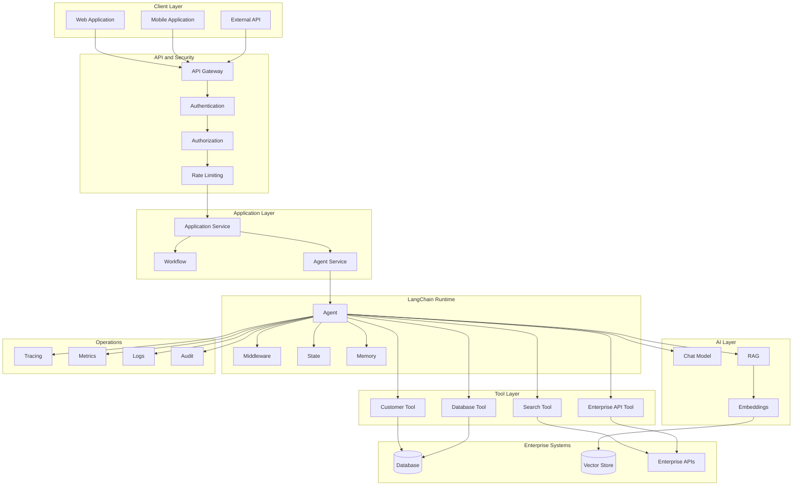

---

# 5. Application Boundary vs Agent Boundary

A common mistake is to place all application logic inside the agent.

### Bad

```text
API
 ↓
Agent
 ├── Authentication
 ├── Authorization
 ├── Business Logic
 ├── Database
 ├── External APIs
 └── Response
```

### Better

```text
API
 ↓
Application Service
 ↓
Agent
 ↓
Bounded Tools
 ↓
Enterprise Services
```

The agent should be one component of the application rather than the entire application.

---

# 6. Service Boundary Pattern

A production architecture can expose the agent through a dedicated service.

```text
Frontend
 ↓
API Gateway
 ↓
Agent API
 ↓
Agent Runtime
 ↓
Tools
 ↓
Enterprise Systems
```

Benefits:

- Independent deployment
- Security isolation
- Scaling
- Observability
- Versioning
- Governance

---

# 7. Dependency Direction

A clean architecture should avoid making every layer depend directly on LangChain.

A useful dependency model is:

```text
Application
    ↓
AI Capability Interface
    ↓
LangChain Adapter
    ↓
LangChain Runtime
    ↓
Model / Tool Providers
```

For example:

```text
Application
    ↓
AgentService
    ↓
AgentProvider
    ↓
LangChainAgentAdapter
    ↓
LangChain
```

This reduces framework coupling.

---

# 8. Ports and Adapters Pattern

For enterprise systems, LangChain can be treated as an implementation detail.

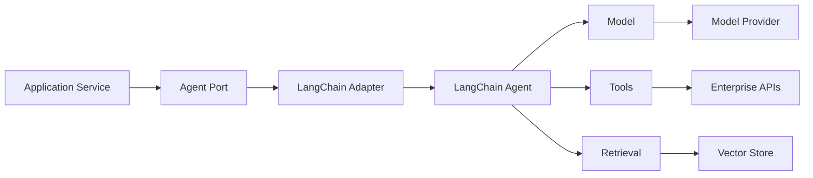

The application depends on capabilities rather than directly depending on every framework implementation.

---

# 9. Model Provider Abstraction

Production systems may need multiple model providers.

```text
Application
     ↓
LLMProvider
     ↓
 ┌───┼────────────┐
 ↓   ↓            ↓
OpenAI Anthropic Google
```

A provider abstraction can support:

- Model switching
- Fallbacks
- Provider migrations
- Cost optimization
- Regional routing
- Disaster recovery

---

# 10. Model Configuration

Avoid hard-coding model configuration throughout the application.

### Bad

```python
model = ChatOpenAI(
    model="..."
)
```

inside multiple services.

### Better

```python
model = model_factory.create(
    provider=config.provider,
    model=config.model
)
```

Configuration should be externalized.

Example:

```yaml
ai:
  provider: openai
  model: production-model
  temperature: 0
  timeout: 30
```

---

# 11. Model Routing

Production applications may route requests according to:

```text
Task Complexity
Cost
Latency
Availability
Region
Data Residency
Model Capability
```

Architecture:

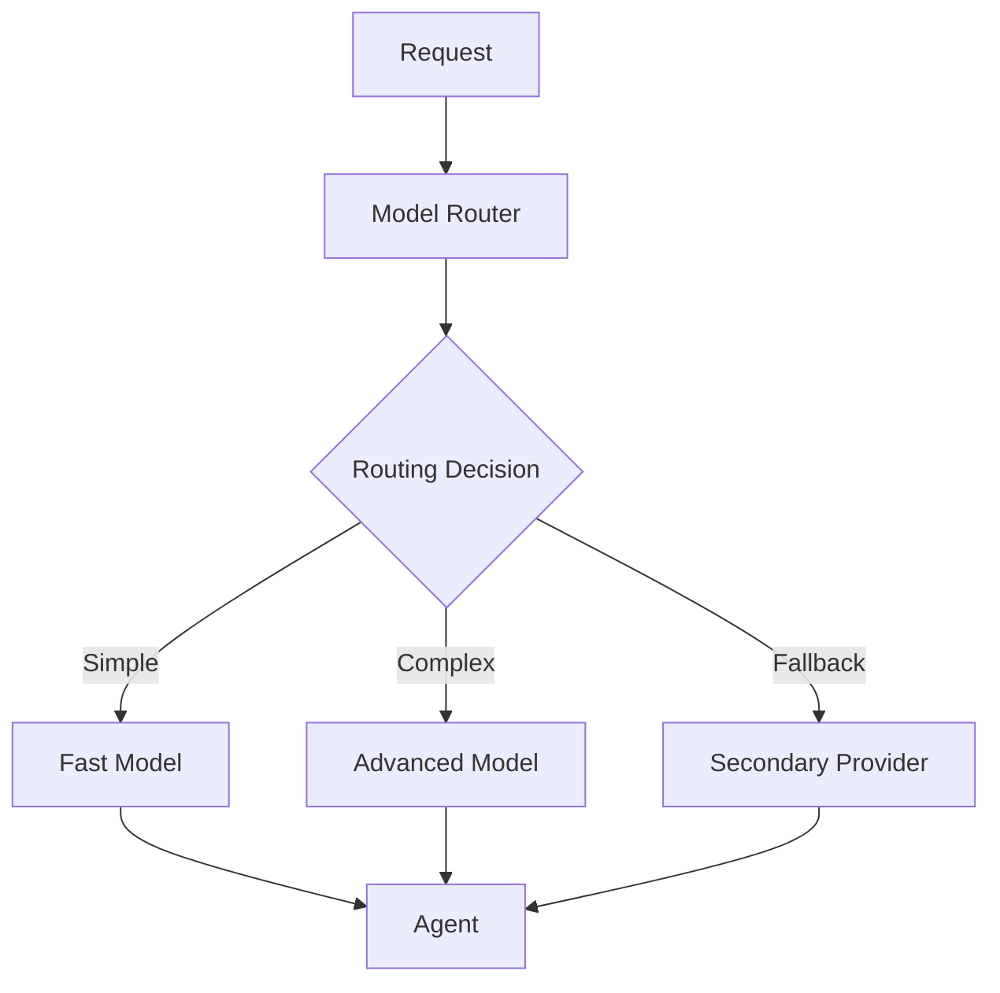

---

# 12. Dynamic Model Selection

LangChain middleware can be used to select models dynamically at runtime.

Conceptually:

```python
from langchain.agents.middleware import wrap_model_call

@wrap_model_call
def route_model(request, handler):
    # Inspect runtime context or request state
    # Select an appropriate model
    return handler(request)
```

The exact middleware API should follow the LangChain version used by the application.

The architectural principle is:

```text
Request
 ↓
Routing Decision
 ↓
Model
```

---

# 13. Tool Boundary Pattern

Tools should act as controlled capability boundaries.

```text
Agent
 ↓
Tool Interface
 ↓
Authorization
 ↓
Validation
 ↓
Enterprise Service
```

The agent should not directly access:

```text
Database Credentials
Cloud Credentials
Production Secrets
Internal Network
```

without an explicit controlled boundary.

---

# 14. Tool Gateway Pattern

For larger enterprise environments, tools can be centralized behind a tool gateway.

```text
Agent
 ↓
Tool Gateway
 ↓
 ┌───────────────┐
 │ Authorization │
 │ Validation    │
 │ Rate Limit    │
 │ Audit         │
 │ Routing       │
 └───────────────┘
 ↓
Enterprise APIs
```

This creates a consistent security boundary.

---

# 15. Tool Authorization

Tool access should be determined by:

```text
User Identity
+
Tenant
+
Role
+
Agent Identity
+
Requested Action
```

Example:

```text
Customer Support Agent

Allowed:
 ✓ get_customer
 ✓ get_order
 ✓ search_policy
 ✓ create_ticket

Denied:
 ✗ delete_customer
 ✗ transfer_money
 ✗ modify_financial_record
```

Authorization should be enforced outside the LLM.

---

# 16. Least Privilege

Agents should receive only the minimum required capabilities.

### Bad

```text
Agent
 ↓
Admin API
 ↓
Entire Enterprise
```

### Better

```text
Agent
 ↓
Scoped Tool
 ↓
Scoped Service Identity
 ↓
Authorized Resource
```

Least privilege reduces the blast radius of:

- Prompt injection
- Tool misuse
- Model errors
- Compromised credentials

---

# 17. Tool Validation

Tool input should be validated before execution.

```text
Agent Tool Call
 ↓
Schema Validation
 ↓
Business Validation
 ↓
Authorization
 ↓
Execution
```

Example:

```python
def validate_customer_request(customer_id: str):
    if not customer_id:
        raise ValueError("customer_id is required")

    return customer_id
```

Validation should not rely only on the model.

---

# 18. Tool Timeouts

Every external tool should have a bounded execution time.

```text
Agent
 ↓
Tool
 ↓
Timeout
 ↓
Failure / Retry / Fallback
```

Without timeouts:

```text
Agent
 ↓
Tool
 ↓
Waiting...
 ↓
Waiting...
 ↓
Waiting...
```

This can exhaust application resources.

---

# 19. Retry Pattern

Retry only failures that are likely transient.

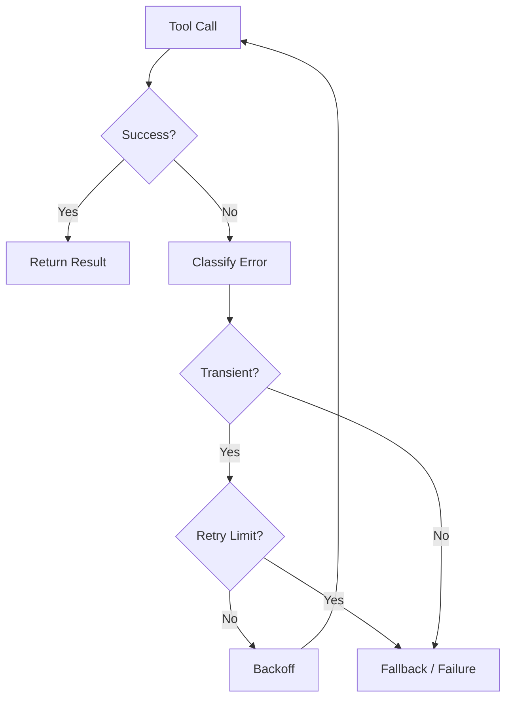

Common transient failures:

- Timeouts
- Rate limits
- Temporary network failures
- Temporary service unavailability

---

# 20. Exponential Backoff

Repeated immediate retries can increase system load.

Instead:

```text
Attempt 1
 ↓
Wait 1s

Attempt 2
 ↓
Wait 2s

Attempt 3
 ↓
Wait 4s
```

In production, use:

```text
Exponential Backoff
+
Jitter
+
Maximum Retry Count
```

---

# 21. Circuit Breaker Pattern

If an external service is consistently failing, repeated requests should be avoided.

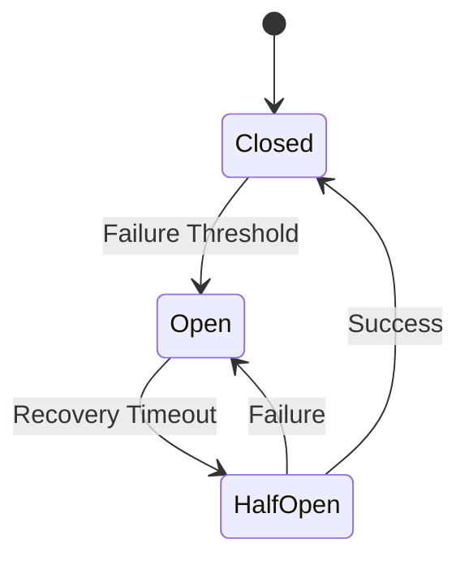

This prevents a failing dependency from continuously degrading the agent service.

---

# 22. Fallback Pattern

Production AI applications can use fallbacks.

### Model Fallback

```text
Primary Model
 ↓
Failure
 ↓
Secondary Model
 ↓
Response
```

### Tool Fallback

```text
Primary API
 ↓
Failure
 ↓
Alternative API
 ↓
Result
```

### Retrieval Fallback

```text
Primary Retriever
 ↓
Failure
 ↓
Secondary Retriever
```

Fallbacks should be explicit and observable.

---

# 23. Graceful Degradation

Not every failure should cause complete request failure.

Example:

```text
Customer Request
 ↓
Agent
 ↓
Order API
 ↓
Failure
 ↓
Agent continues with available information
 ↓
Explains limitation
```

A degraded response may be better than an unavailable service.

However, degradation should never bypass security or correctness requirements.

---

# 24. Failure Classification

A production system should distinguish:

```text
User Error
Tool Error
Model Error
Infrastructure Error
Authorization Error
Policy Error
Timeout
Rate Limit
Validation Error
```

Example:

```text
Invalid Customer ID
      ↓
User Error

Database Timeout
      ↓
Infrastructure Error

Permission Denied
      ↓
Authorization Error
```

Different errors require different handling.

---

# 25. Rate Limiting

Agent workloads can create unpredictable traffic.

Rate limits should be applied at multiple levels:

```text
Client
 ↓
API
 ↓
Agent
 ↓
Model
 ↓
Tool
```

Example:

```text
100 requests/minute per client

20 requests/minute per user

10 concurrent agent runs per tenant
```

Exact limits depend on the application.

---

# 26. Concurrency Control

Agent requests can consume significant resources.

Control:

```text
Maximum Concurrent Requests
Maximum Concurrent Agent Runs
Maximum Tool Calls
Maximum Background Jobs
```

Architecture:

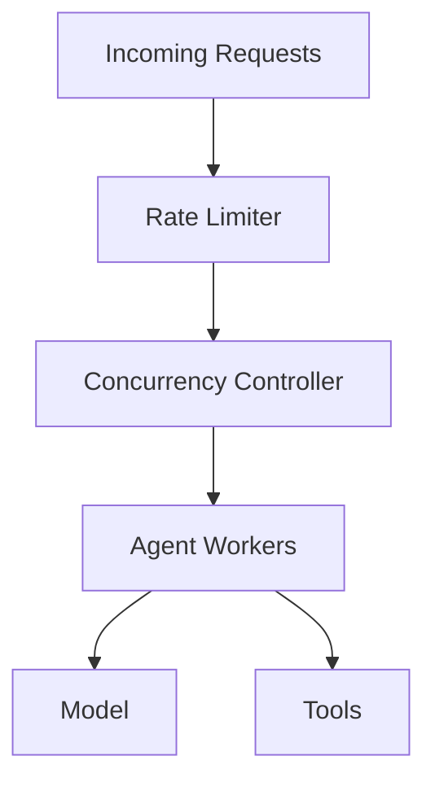

---

# 27. Queue-Based Execution

Long-running tasks should not always remain attached to a synchronous HTTP request.

### Synchronous

```text
HTTP Request
 ↓
Agent
 ↓
Multiple Tools
 ↓
Response
```

### Asynchronous

```text
HTTP Request
 ↓
Create Job
 ↓
Queue
 ↓
Agent Worker
 ↓
Tools
 ↓
Persist Result
 ↓
Client Poll / Notification
```

---

# 28. Async Agent Architecture

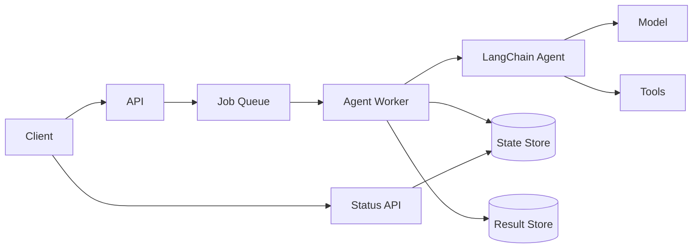

---

# 29. State Management

State should be separated into appropriate scopes.

```text
Request State
Thread State
User State
Tenant State
Application State
```

Example:

```text
Request
 └── request_id

Thread
 └── conversation history

User
 └── preferences

Tenant
 └── configuration
```

Do not mix these scopes unintentionally.

---

# 30. Durable State

For distributed applications:

```text
Agent Instance A
       │
       ▼
Shared State Store
       ▲
       │
Agent Instance B
```

The application should not rely exclusively on process-local memory.

Durable state enables:

- Horizontal scaling
- Recovery
- Long-running execution
- Conversation continuity

---

# 31. Stateless Agent Service

A scalable API layer should ideally be stateless.

```text
Request
 ↓
Load Balancer
 ↓
Agent Instance 1
```

or:

```text
Request
 ↓
Load Balancer
 ↓
Agent Instance 2
```

Both instances retrieve shared state from:

```text
Database
Redis
Checkpoint Store
Persistent Storage
```

---

# 32. Horizontal Scaling

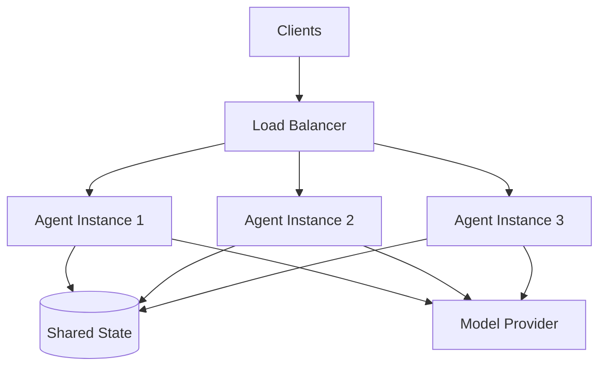

Scaling should consider:

```text
CPU
Memory
Concurrent Requests
Model Throughput
Tool Throughput
State Store Capacity
```

---

# 33. Caching

Caching can reduce:

```text
Latency
Cost
External API Load
Model Calls
```

Potential cache layers:

```text
Response Cache
Embedding Cache
Retrieval Cache
Tool Result Cache
Prompt Cache
Model Provider Cache
```

Caching should be applied carefully to dynamic or user-specific data.

---

# 34. Cache Key Design

A cache key may need:

```text
tenant_id
user_scope
model
prompt_version
input_hash
retrieval_version
tool_version
```

Example:

```text
tenant123:
model-v2:
prompt-v5:
input-a82f:
retrieval-v3
```

Poor cache-key design can cause:

```text
Data Leakage
Stale Responses
Cross-Tenant Contamination
Incorrect Results
```

---

# 35. Multi-Tenant Architecture

Enterprise AI systems often serve multiple tenants.

```text
Tenant A
 └── Agent

Tenant B
 └── Agent

Tenant C
 └── Agent
```

Tenant isolation should exist across:

```text
Authentication
Authorization
State
Memory
Retrieval
Caching
Logs
Metrics
Storage
```

---

# 36. Multi-Tenant Agent Architecture

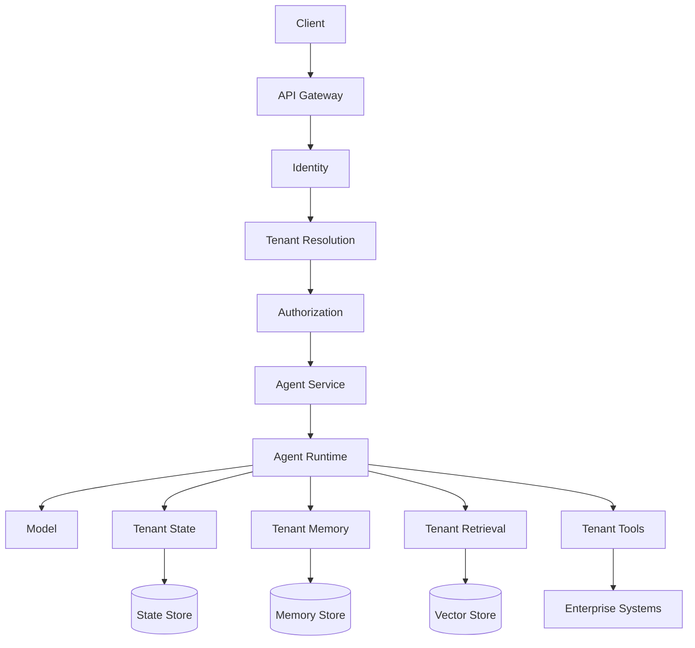

---

# 37. Tenant Isolation

Isolation strategies include:

### Shared Infrastructure + Logical Isolation

```text
Shared Database
 └── tenant_id
```

### Schema Isolation

```text
Tenant A → Schema A
Tenant B → Schema B
```

### Database Isolation

```text
Tenant A → Database A
Tenant B → Database B
```

The correct approach depends on:

```text
Security
Compliance
Cost
Scale
Data Residency
```

---

# 38. Observability

Production agent systems require visibility into:

```text
Request
Model
Tool
State
Retrieval
Latency
Tokens
Cost
Errors
```

A useful trace:

```text
Request
 ↓
Agent Run
 ↓
Model Call
 ↓
Tool Call
 ↓
Tool Result
 ↓
Model Call
 ↓
Final Response
```

---

# 39. Tracing Architecture

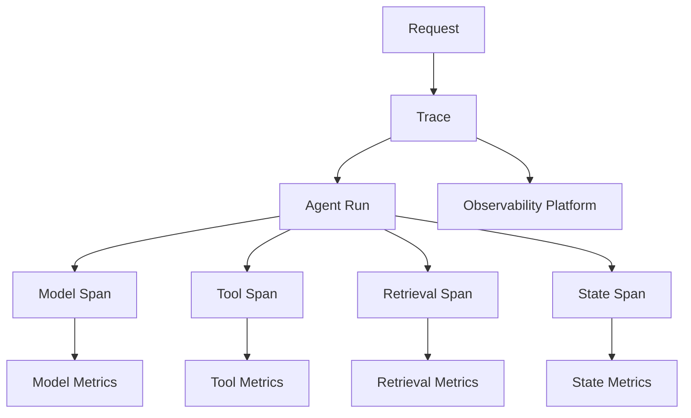

---

# 40. LangSmith Observability

LangSmith can provide tracing and evaluation capabilities for LangChain applications.

Useful operational information includes:

```text
Inputs
Outputs
Model Calls
Tool Calls
Latency
Token Usage
Errors
Execution Paths
Evaluations
```

A production implementation should still apply appropriate:

```text
PII Redaction
Secret Redaction
Access Control
Retention Policies
```

---

# 41. Logging Strategy

Use structured logging.

Example:

```json
{
  "timestamp": "2026-08-11T12:00:00Z",
  "level": "INFO",
  "service": "agent-service",
  "request_id": "req-123",
  "trace_id": "trace-456",
  "tenant_id": "tenant-1",
  "agent_version": "v2",
  "event": "tool_completed",
  "tool": "get_customer",
  "latency_ms": 120
}
```

Structured logs are easier to query and analyze.

---

# 42. What Not to Log

Avoid indiscriminately logging:

```text
API Keys
Passwords
Access Tokens
Secrets
Full Customer Records
Sensitive Documents
Unnecessary PII
Payment Information
```

Use:

```text
Redaction
Masking
Tokenization
Access Controls
Retention Policies
```

---

# 43. Metrics

Recommended metrics include:

### Application

```text
Request Count
Success Rate
Error Rate
P95 Latency
P99 Latency
```

### Agent

```text
Agent Runs
Average Steps
Task Success Rate
Tool Calls
Tool Failure Rate
```

### Model

```text
Input Tokens
Output Tokens
Model Latency
Model Errors
```

### Cost

```text
Cost per Request
Cost per Tenant
Cost per Agent
Daily AI Spend
```

---

# 44. Cost Optimization

Agent applications can generate multiple model calls.

```text
Request
 ↓
Model
 ↓
Tool
 ↓
Model
 ↓
Tool
 ↓
Model
 ↓
Response
```

Cost optimization strategies include:

```text
Model Routing
Caching
Prompt Optimization
Tool Result Compression
Step Limits
Context Reduction
Smaller Models
Early Termination
```

---

# 45. Token Budget Control

Context can grow through:

```text
Conversation
+
Tool Results
+
RAG Context
+
Memory
+
Instructions
```

Use:

```text
Message Trimming
Context Selection
Summarization
Tool Result Filtering
Relevant Memory Retrieval
```

The goal is:

```text
Minimum Sufficient Context
```

rather than:

```text
Maximum Available Context
```

---

# 46. Tool Cost Control

External tools can also create costs.

Examples:

```text
Search API
Database Query
External SaaS API
Cloud Service
Third-Party API
```

Use:

```text
Caching
Rate Limits
Query Limits
Pagination
Result Filtering
Timeouts
```

---

# 47. Performance Optimization

Agent latency is often:

```text
Model Latency
+
Tool Latency
+
Retrieval Latency
+
State Latency
+
Network Latency
+
Execution Overhead
```

Optimization should therefore target the slowest components.

---

# 48. Parallel Tool Execution

Some operations may be independent.

### Sequential

```text
Tool A
 ↓
Tool B
 ↓
Tool C
```

### Parallel

```text
       ┌── Tool A ──┐
Agent ─┼── Tool B ──┼→ Aggregation
       └── Tool C ──┘
```

Parallel execution can reduce latency when operations are independent and safe to run concurrently.

---

# 49. Parallel Execution Architecture

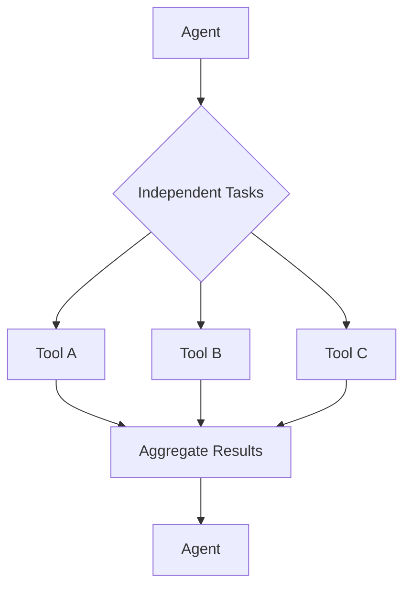

Do not parallelize operations that depend on previous results or have unsafe side effects.

---

# 50. Context Engineering

Production agents need carefully controlled context.

```text
User Request
+
System Instructions
+
Relevant Memory
+
Relevant RAG
+
Tool Results
+
Runtime Context
        ↓
Context Builder
        ↓
Model
```

Context should be:

```text
Relevant
Minimal
Structured
Fresh
Authorized
Tenant-Aware
```

---

# 51. Context Isolation

Different context types should be separated.

```text
System Instructions
-------------------
Application Policy
-------------------
User Request
-------------------
Retrieved Data
-------------------
Tool Results
-------------------
Memory
```

External content should not automatically become trusted instructions.

---

# 52. Prompt Versioning

Prompts are production artifacts.

Track:

```text
prompt_id
prompt_version
model_version
agent_version
deployment_version
```

Example:

```text
customer-support-agent
prompt-v7
model-v3
agent-v12
```

This enables:

```text
Regression Analysis
A/B Testing
Rollback
Auditing
Reproducibility
```

---

# 53. Model Versioning

Model behavior can change when:

```text
Provider Model Changes
Model Version Changes
System Instructions Change
Tool Definitions Change
Context Changes
```

Track model configuration with every important execution.

---

# 54. Tool Versioning

Tools can also change behavior.

Example:

```text
get_customer v1
```

may return:

```json
{
  "name": "Mihir",
  "status": "active"
}
```

while:

```text
get_customer v2
```

may return:

```json
{
  "customer": {
    "name": "Mihir",
    "status": "active"
  }
}
```

Changes to tool schemas can affect agent behavior.

---

# 55. Agent Versioning

A production agent version should capture the complete configuration:

```text
Agent Version
 ├── Prompt Version
 ├── Model Version
 ├── Tool Versions
 ├── Middleware Version
 ├── Retrieval Version
 └── Policy Version
```

This makes deployments reproducible.

---

# 56. Configuration Management

Separate configuration from code.

Example:

```yaml
agent:
  max_steps: 10
  timeout_seconds: 60

model:
  provider: openai
  name: production-model

retrieval:
  top_k: 8

security:
  require_approval_for:
    - create_ticket
```

Secrets should not be stored in configuration files.

---

# 57. Secret Management

Production applications should use:

```text
Secret Manager
Vault
Cloud Secret Store
Environment Injection
Managed Identity
```

Never hard-code:

```python
api_key = "sk-..."
```

Instead:

```python
api_key = secret_manager.get("MODEL_API_KEY")
```

Secrets should be rotated and access-controlled.

---

# 58. Deployment Patterns

Common deployment models include:

### Single Service

```text
API
 ↓
Agent
 ↓
Tools
```

Good for:

```text
Small Systems
Internal Applications
Early Production
```

### Dedicated Agent Service

```text
API
 ↓
Agent Service
 ↓
Tools
```

Good for:

```text
Enterprise Applications
Independent Scaling
Governance
```

### Async Worker Architecture

```text
API
 ↓
Queue
 ↓
Agent Worker
 ↓
Tools
```

Good for:

```text
Long-Running Tasks
Background Processing
Large Workloads
```

---

# 59. Blue-Green Deployment

Blue-green deployment maintains two production environments.

```text
                Load Balancer
                     │
              ┌──────┴──────┐
              ▼             ▼
          Blue v1        Green v2
```

Traffic can be switched after validation.

Useful for:

```text
Low-Risk Releases
Fast Rollback
Production Validation
```

---

# 60. Canary Deployment

Canary deployment sends a small percentage of traffic to the new version.

```text
Traffic
  │
  ├── 95% → Agent v1
  │
  └── 5%  → Agent v2
```

Monitor:

```text
Error Rate
Latency
Cost
Task Success
Policy Violations
```

Then gradually increase traffic.

---

# 61. Agent Release Strategy

A production release can follow:

```text
Development
 ↓
Unit Tests
 ↓
Integration Tests
 ↓
Evaluation
 ↓
Staging
 ↓
Canary
 ↓
Production
 ↓
Monitoring
```

---

# 62. CI/CD for LangChain Applications

A production pipeline may include:

```text
Code Commit
 ↓
Build
 ↓
Unit Tests
 ↓
Tool Tests
 ↓
Integration Tests
 ↓
Agent Evaluation
 ↓
Security Scan
 ↓
Build Image
 ↓
Deploy Staging
 ↓
Smoke Tests
 ↓
Canary
 ↓
Production
```

---

# 63. Agent Evaluation in CI/CD

Agent evaluations should become part of the delivery pipeline.

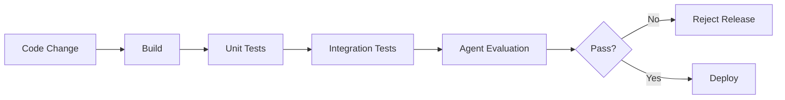

Possible evaluation gates:

```text
Task Success >= Threshold
Tool Accuracy >= Threshold
Safety Violations = 0
Latency <= Threshold
Cost <= Threshold
```

---

# 64. Regression Testing

A model or prompt change can unexpectedly alter agent behavior.

Maintain a regression dataset:

```text
Input
Expected Behavior
Expected Tools
Expected Outcome
Safety Expectations
```

Example:

```json
{
  "input": "Find customer C123.",
  "expected_tools": [
    "get_customer"
  ],
  "expected_outcome": "Customer found"
}
```

Run this dataset for every important release.

---

# 65. Feature Flags

Feature flags can control new agent capabilities.

Example:

```yaml
features:
  advanced_retrieval: true
  new_model: false
  email_tool: false
  human_approval: true
```

This allows controlled rollout.

---

# 66. Kill Switch

High-risk agent capabilities should have an operational kill switch.

Example:

```text
Agent
 ↓
Tool Policy
 ↓
Feature Flag
 ↓
Tool
```

If a production issue occurs:

```text
Disable Tool
```

without necessarily shutting down the entire agent service.

---

# 67. Human Approval Pattern

High-risk tools should be protected.

Examples:

```text
Delete Data
Send External Email
Transfer Money
Deploy Infrastructure
Modify Security Policy
```

Architecture:

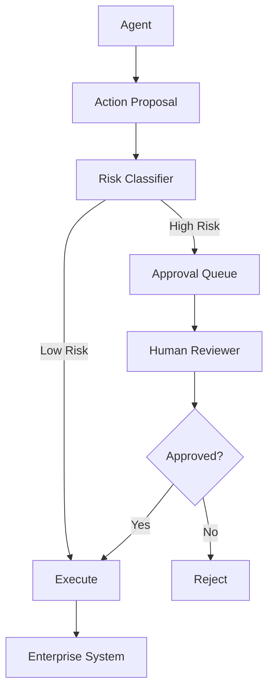

---

# 68. Auditability

Production agent actions should be auditable.

Record:

```text
User
Tenant
Agent
Version
Model
Tool
Action
Timestamp
Approval
Result
```

Example:

```json
{
  "user_id": "user-123",
  "tenant_id": "tenant-1",
  "agent_version": "v3",
  "tool": "create_ticket",
  "action": "CREATE",
  "approval": "approved"
}
```

Sensitive fields should be redacted.

---

# 69. Security Architecture

A secure production agent should have:

```text
Authentication
 ↓
Authorization
 ↓
Tenant Isolation
 ↓
Agent
 ↓
Tool Authorization
 ↓
Input Validation
 ↓
External System
```

Additional controls:

```text
Secret Management
Audit
Rate Limiting
Prompt Injection Defense
Output Validation
Network Controls
```

---

# 70. Network Security

Agent services should not automatically have unrestricted network access.

Use:

```text
Network Policies
Private Endpoints
Egress Controls
Allow Lists
API Gateways
Service Mesh
```

Architecture:

```text
Agent
 ↓
Egress Policy
 ↓
Allowed Destination
 ↓
Enterprise API
```

---

# 71. Data Privacy

Production agents may process:

```text
Customer Data
Financial Data
Employee Data
Business Documents
Personal Information
```

Apply:

```text
Data Minimization
Access Controls
Redaction
Encryption
Retention Policies
Tenant Isolation
Audit
```

Only send necessary data to the model.

---

# 72. Prompt Injection Defense Architecture

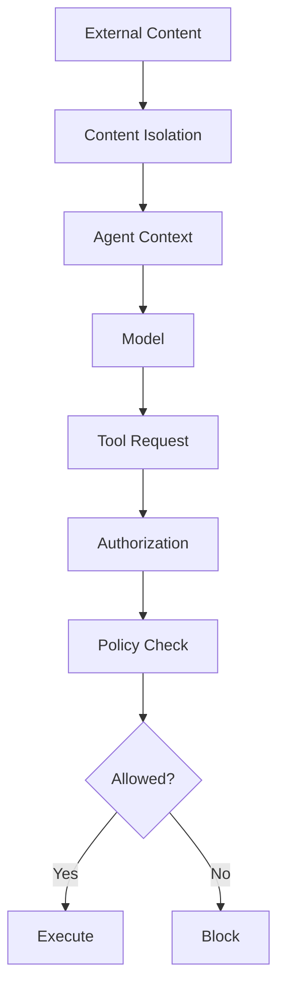

The key principle is:

```text
Untrusted Content
≠
Trusted Instruction
```

---

# 73. Production Context Management

An agent may accumulate:

```text
Conversation
+
Memory
+
RAG
+
Tool Results
+
System Instructions
+
Runtime Context
```

This can exceed practical context budgets.

A context pipeline can be:

```text
Raw Context
 ↓
Filter
 ↓
Rank
 ↓
Compress
 ↓
Validate
 ↓
Model Context
```

---

# 74. Production Retrieval Pattern

For agent-based RAG:

```text
Agent
 ↓
Retrieval Tool
 ↓
Query Transformation
 ↓
Retriever
 ↓
Reranking
 ↓
Context Selection
 ↓
Agent
```

The retrieval system should remain independently observable.

Useful metrics:

```text
Retrieval Latency
Top-K
Recall
Reranker Latency
Context Size
Retrieval Errors
```

---

# 75. Agent + RAG Production Architecture

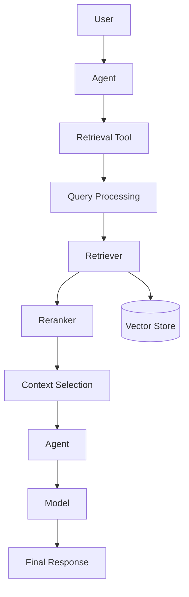

---

# 76. Response Validation

The final response should be validated where required.

Potential validation:

```text
Schema Validation
Policy Validation
Safety Validation
Citation Validation
Business Rule Validation
PII Detection
```

Architecture:

```text
Agent
 ↓
Response
 ↓
Validation
 ↓
Policy
 ↓
Client
```

---

# 77. Graceful Error Response

Do not expose internal errors directly.

### Bad

```text
psycopg2.OperationalError:
connection refused 10.20.3.41:5432
```

### Better

```text
I couldn't retrieve the customer information
because the customer service is temporarily
unavailable. Please try again.
```

Internal details should remain in logs and traces.

---

# 78. Error Response Architecture

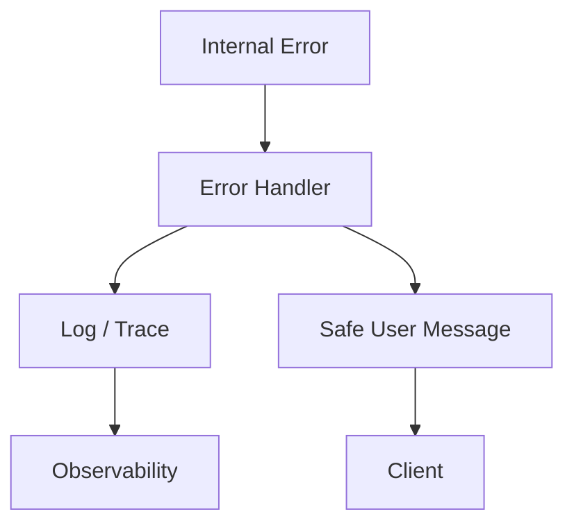

---

# 79. Backpressure

When traffic exceeds capacity:

```text
Requests
   ↓
Queue
   ↓
Agent Workers
```

The system should avoid allowing unlimited concurrent execution.

Controls include:

```text
Queue Limits
Concurrency Limits
Rate Limits
Timeouts
Load Shedding
```

---

# 80. Load Shedding

When the system is overloaded:

```text
Normal Traffic
 ↓
Agent Workers
```

During overload:

```text
Excess Traffic
 ↓
Reject / Defer
```

Better to reject safely than allow the entire service to fail.

---

# 81. Production Health Checks

Agent services should expose health signals.

### Liveness

```text
Is the service process alive?
```

### Readiness

```text
Can the service accept traffic?
```

### Dependency Health

```text
Can required dependencies be reached?
```

Do not make readiness depend on every optional external service.

---

# 82. SLOs for Agent Systems

Define service objectives.

Examples:

```text
Availability: 99.9%

P95 Latency: < 8 seconds

Task Success Rate: > 95%

Tool Error Rate: < 1%

Policy Violation Rate: 0%
```

Actual targets should be determined by business requirements.

---

# 83. Production SLI Model

Useful indicators:

```text
Availability
Latency
Task Success
Tool Success
Model Success
Cost
Safety
```

Example:

```text
SLI = Successful Agent Tasks / Total Agent Tasks
```

A production team should monitor trends rather than only individual failures.

---

# 84. Cost per Tenant

For multi-tenant systems, track:

```text
Tenant
 ↓
Requests
 ↓
Tokens
 ↓
Tool Calls
 ↓
Model Cost
 ↓
Total AI Cost
```

Example:

```text
Tenant A
 ├── 10,000 requests
 ├── 50M tokens
 └── $X cost
```

This enables:

```text
Budget Controls
Chargeback
Quota Management
Cost Optimization
```

---

# 85. Tenant Quotas

Production systems can define:

```text
Requests / Minute
Requests / Day
Token Budget
Agent Runs
Tool Calls
Storage
```

Example:

```yaml
tenant:
  max_requests_per_minute: 100
  max_agent_runs_per_day: 10000
  max_tokens_per_day: 5000000
```

---

# 86. Production Configuration Hierarchy

A useful configuration hierarchy is:

```text
Global Defaults
      ↓
Environment Configuration
      ↓
Tenant Configuration
      ↓
User Configuration
      ↓
Request Configuration
```

Security-sensitive configuration should not be overridable by untrusted users.

---

# 87. Environment Separation

Maintain separate environments:

```text
Development
Testing
Staging
Production
```

Do not allow:

```text
Development Agent
      ↓
Production Database
```

unless explicitly controlled and authorized.

---

# 88. Production Deployment Architecture

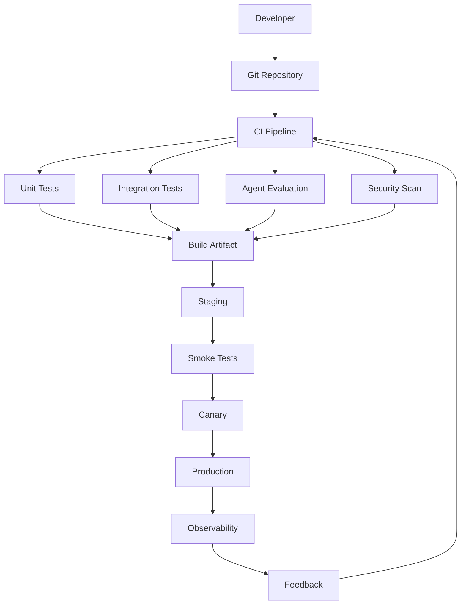

---

# 89. Blue-Green Deployment

Blue-green deployment uses two environments.

```text
             Load Balancer
                  │
           ┌──────┴──────┐
           ▼             ▼
       Blue v1        Green v2
```

Deploy the new version to Green.

Validate it.

Then switch traffic.

Benefits:

- Fast rollback
- Isolated validation
- Predictable release

---

# 90. Canary Deployment

Canary deployment gradually introduces a new version.

```text
Traffic
  │
  ├── 95% → Agent v1
  │
  └── 5%  → Agent v2
```

Monitor:

```text
Error Rate
Latency
Task Success
Cost
Tool Failures
Safety Violations
```

Then increase traffic gradually.

---

# 91. Rollback Strategy

Rollback should be possible for:

```text
Application Version
Agent Version
Prompt Version
Model Version
Tool Version
Configuration
```

Example:

```text
Agent v3
 ↓
Production Problem
 ↓
Rollback
 ↓
Agent v2
```

AI systems require rollback of behavior, not just application binaries.

---

# 92. Feature Flags

Feature flags allow controlled activation of capabilities.

```yaml
features:
  new_model: false
  advanced_rag: true
  email_tool: false
  human_approval: true
```

Feature flags can be scoped by:

```text
Environment
Tenant
User
Percentage of Traffic
```

---

# 93. Kill Switch

High-risk capabilities should have an operational kill switch.

```text
Agent
 ↓
Tool Policy
 ↓
Feature Flag
 ↓
Tool
```

Example:

```text
create_ticket = disabled
```

This can disable a problematic tool without shutting down the entire agent service.

---

# 94. Testing Strategy

Production LangChain applications should use multiple testing layers.

```text
Unit Tests
 ↓
Tool Tests
 ↓
Integration Tests
 ↓
Agent Evaluation
 ↓
Security Tests
 ↓
Load Tests
 ↓
Staging Validation
```

---

# 95. Unit Testing

Test deterministic application components independently.

Examples:

```text
Input Validation
Tool Functions
Policy Logic
Authorization
Cache
Context Builder
Response Parser
```

Example:

```python
def test_validate_customer_id():
    assert validate_customer_request("C123") == "C123"
```

---

# 96. Tool Testing

Tools should be tested independently from the agent.

```python
def test_get_customer():
    result = get_customer.invoke(
        {
            "customer_id": "C123"
        }
    )

    assert result is not None
```

Test:

```text
Valid Input
Invalid Input
Unauthorized Input
Timeout
Dependency Failure
Malformed Response
```

---

# 97. Agent Integration Testing

Test the complete execution path.

```text
User
 ↓
Agent
 ↓
Model
 ↓
Tool
 ↓
Tool Result
 ↓
Model
 ↓
Response
```

Example:

```python
def test_customer_agent(agent):
    result = agent.invoke(
        {
            "messages": [
                {
                    "role": "user",
                    "content": "Find customer C123."
                }
            ]
        }
    )

    assert result is not None
```

---

# 98. Security Testing

Test:

```text
Prompt Injection
Unauthorized Tools
Tenant Isolation
Data Leakage
Secret Exposure
Privilege Escalation
Malicious Tool Arguments
```

Example:

```text
User
 ↓
Prompt Injection
 ↓
Agent
 ↓
Tool Request
 ↓
Authorization
 ↓
Blocked
```

---

# 99. Load Testing

Agent workloads differ from traditional APIs.

Test:

```text
Concurrent Requests
Long Conversations
Multiple Tool Calls
Large Context
Slow Tools
Model Rate Limits
High Token Usage
```

Measure:

```text
Throughput
Latency
Error Rate
Resource Utilization
Model Limits
Tool Limits
```

---

# 100. Chaos Testing

Production resilience can be tested by intentionally introducing failures.

Examples:

```text
Model Timeout
Database Failure
Tool Failure
Network Latency
Rate Limit
State Store Failure
```

Observe whether the agent:

```text
Fails Gracefully
Retries Correctly
Uses Fallback
Preserves State
Returns Safe Response
```

---

# 101. Production Readiness Checklist

## Architecture

- [ ] Service boundary defined
- [ ] Agent responsibility defined
- [ ] Tool boundaries defined
- [ ] State strategy defined
- [ ] Memory strategy defined
- [ ] Retrieval strategy defined

## Security

- [ ] Authentication
- [ ] Authorization
- [ ] Least privilege
- [ ] Tenant isolation
- [ ] Secret management
- [ ] Prompt injection defense
- [ ] Audit logging

## Reliability

- [ ] Timeouts
- [ ] Retry policy
- [ ] Circuit breaker
- [ ] Fallback
- [ ] Graceful degradation
- [ ] Execution limits
- [ ] Backpressure

## Performance

- [ ] Context optimization
- [ ] Caching
- [ ] Parallel execution where safe
- [ ] Model routing
- [ ] Tool optimization

## Observability

- [ ] Tracing
- [ ] Metrics
- [ ] Structured logging
- [ ] Cost tracking
- [ ] Tool telemetry
- [ ] Agent telemetry

## Deployment

- [ ] CI/CD
- [ ] Staging
- [ ] Canary / Blue-Green
- [ ] Rollback
- [ ] Feature flags
- [ ] Kill switch

## Evaluation

- [ ] Unit tests
- [ ] Integration tests
- [ ] Agent evaluations
- [ ] Regression dataset
- [ ] Security tests
- [ ] Load tests
- [ ] Chaos tests

---

# 102. Common Production Mistakes

## Mistake 1 — Treating the Agent as the Entire Application

```text
API
 ↓
Agent
```

Better:

```text
API
 ↓
Application Service
 ↓
Agent
 ↓
Bounded Tools
```

---

## Mistake 2 — Giving the Agent Excessive Permissions

```text
Agent
 ↓
Admin API
```

Better:

```text
Agent
 ↓
Scoped Tools
 ↓
Authorization
```

---

## Mistake 3 — No Execution Limits

```text
Agent
 ↓
Unlimited Tool Calls
```

Better:

```text
Agent
 ↓
Step Limit
 ↓
Timeout
 ↓
Retry Limit
```

---

## Mistake 4 — No Observability

If a production agent fails, you should be able to answer:

```text
What did the user ask?

Which model was used?

Which tools were selected?

What arguments were sent?

What did the tools return?

How many model calls occurred?

How long did execution take?

How much did it cost?
```

---

## Mistake 5 — Logging Everything

Logging full prompts, customer records, tool payloads, and model outputs can create privacy and security risks.

Prefer:

```text
Structured Logs
+
Redaction
+
Sampling
+
Access Control
```

---

## Mistake 6 — Ignoring Tenant Isolation

Never allow:

```text
Tenant A
 ↓
Cache
 ↓
Tenant B
```

or:

```text
Tenant A
 ↓
Retrieval
 ↓
Tenant B Documents
```

Tenant boundaries must be enforced throughout the architecture.

---

## Mistake 7 — Hard-Coding Provider Dependencies

Avoid embedding provider-specific behavior throughout the application.

Prefer:

```text
Application
 ↓
Capability Interface
 ↓
Provider Adapter
```

---

## Mistake 8 — No Rollback Strategy

A production agent can change behavior even when application code changes only slightly.

Track and rollback:

```text
Prompt
Model
Tools
Agent
Policies
Retrieval
Configuration
```

---

# 103. Production Design Pattern Summary

The major patterns covered in this chapter are:

```text
1. Service Boundary
2. Ports and Adapters
3. Model Routing
4. Tool Gateway
5. Least Privilege
6. Retry
7. Circuit Breaker
8. Fallback
9. Graceful Degradation
10. Rate Limiting
11. Queue-Based Execution
12. Durable State
13. Horizontal Scaling
14. Caching
15. Multi-Tenant Isolation
16. Observability
17. Context Engineering
18. Versioning
19. Canary Deployment
20. Blue-Green Deployment
21. Feature Flags
22. Kill Switch
23. Human Approval
24. Regression Testing
25. Chaos Testing
```

---

# 104. Production Architecture Mental Model

A useful mental model is:

```text
                         Client
                           │
                           ▼
                    API / Gateway
                           │
                           ▼
                  Authentication
                           │
                           ▼
                   Authorization
                           │
                           ▼
                  Application Layer
                           │
                           ▼
                    Agent Runtime
                           │
          ┌────────────────┼────────────────┐
          ▼                ▼                ▼
        Model            Tools            State
          │                │                │
          ▼                ▼                ▼
     Provider          Enterprise        Persistence
                        Systems
          │                │                │
          └────────────────┼────────────────┘
                           ▼
                    Validation
                           │
                           ▼
                     Response
                           │
                           ▼
                  Observability
```

---

# 105. Enterprise AI Engineering Principle

A LangChain application should be treated as a production software system, not simply as an LLM experiment.

The architecture should therefore follow:

```text
Capability
+
Control
+
Security
+
Observability
+
Reliability
+
Governance
```

The agent provides intelligent decision-making.

The surrounding architecture provides the boundaries that make that intelligence safe and operationally reliable.

---

# 106. Relationship to Previous Chapters

Previous chapters covered:

```text
01 — LangChain Fundamentals
02 — LangChain Models & Prompts
03 — LangChain Tools & Function Calling
04 — LangChain Retrieval & RAG
05 — LangChain Memory & State
06 — LangChain Agents
```

This chapter brings those capabilities into a production architecture.

```text
Models
   +
Prompts
   +
Tools
   +
Retrieval
   +
Memory
   +
Agents
   +
Security
   +
Observability
   +
Deployment
   ↓
Production LangChain System
```

---

# 107. Relationship to Part VI — AI Agents

Part VI focused on general AI Agent engineering concepts:

```text
Agent Fundamentals
Agent Architecture
Planning
Reasoning
Memory
Tool Calling
Reflection
Security
Evaluation
Observability
Deployment
```

This chapter focuses specifically on how those concepts can be implemented and operationalized using the LangChain ecosystem.

The broader Agentic AI architecture remains outside this chapter.

---

# 108. Scope Boundary

This chapter focuses on:

```text
LangChain
+
Production Engineering
+
Enterprise Architecture
+
Operational Patterns
```

It does not deeply cover:

```text
Multi-Agent Systems
Supervisor Pattern
Hierarchical Agents
Swarm Intelligence
Agent-to-Agent Protocols
Enterprise Agent Platforms
Advanced Agentic AI Architecture
```

Those topics belong to the dedicated Agentic AI material.

---

# 109. Key Takeaways

- A production LangChain system requires more than an agent and a model.
- Separate application responsibilities from agent responsibilities.
- Treat LangChain as an implementation component where appropriate.
- Use capability interfaces and adapters to reduce framework coupling.
- Enforce authentication and authorization outside the model.
- Give agents only the tools they require.
- Validate tool inputs before execution.
- Use timeouts and bounded retries.
- Apply circuit breakers to unstable dependencies.
- Use fallbacks for important model and tool dependencies.
- Use graceful degradation where business requirements allow it.
- Control concurrency and apply rate limits.
- Use queues for long-running workloads.
- Store important state durably.
- Design the service layer for horizontal scaling.
- Apply caching carefully with tenant-aware cache keys.
- Isolate tenant state, memory, retrieval, and tools.
- Implement structured logs, metrics, and distributed tracing.
- Track token usage and cost.
- Optimize context rather than simply increasing context size.
- Version prompts, models, tools, agents, and policies.
- Use CI/CD with agent evaluation gates.
- Use canary or blue-green deployments for safer releases.
- Maintain rollback capability for AI behavior.
- Use feature flags and kill switches for high-risk capabilities.
- Test tools independently from the agent.
- Test agent behavior using regression datasets.
- Perform security, load, and chaos testing.
- Treat LangChain applications as enterprise software systems.

---

# 📝 Quick Revision Notes

## Production Agent

```text
Authentication
 ↓
Authorization
 ↓
Application
 ↓
Agent
 ↓
Bounded Tools
 ↓
Enterprise Systems
 ↓
Validation
 ↓
Response
```

## Reliability

```text
Timeout
+
Retry
+
Circuit Breaker
+
Fallback
+
Graceful Degradation
```

## Scalability

```text
Stateless API
+
Shared State
+
Queue
+
Horizontal Scaling
```

## Security

```text
Authentication
+
Authorization
+
Least Privilege
+
Tenant Isolation
+
Secret Management
+
Audit
```

## Observability

```text
Logs
+
Metrics
+
Traces
+
Cost
+
Evaluation
```

## Deployment

```text
Test
 ↓
Evaluate
 ↓
Staging
 ↓
Canary
 ↓
Production
 ↓
Observe
 ↓
Rollback if Required
```

## Production Mental Model

```text
Agent
=
Intelligence

Architecture
=
Control

Observability
=
Visibility

Security
=
Boundaries

Governance
=
Trust
```

---

# ❓ Interview Questions

## Beginner

1. What makes a LangChain application production-ready?
2. Why should the agent not be the entire application?
3. What is a service boundary?
4. Why are tool boundaries important?
5. What is least privilege?
6. Why are timeouts important?
7. What is graceful degradation?

## Intermediate

8. How would you design a production LangChain service?
9. How would you implement retries?
10. When should a circuit breaker be used?
11. How would you implement model fallback?
12. How would you scale an agent service horizontally?
13. How would you persist agent state?
14. How would you implement multi-tenant isolation?
15. What should be included in agent observability?
16. How would you control agent costs?
17. How would you design caching for agent applications?
18. How would you version prompts and tools?

## Advanced

19. How would you design a highly available LangChain architecture?
20. How would you prevent cross-tenant data leakage?
21. How would you secure agent tools?
22. How would you design a tool gateway?
23. How would you handle long-running agent tasks?
24. How would you implement canary deployment for an agent?
25. How would you rollback a bad prompt or model release?
26. How would you implement agent evaluation in CI/CD?
27. How would you test prompt injection?
28. How would you design cost controls for multi-tenant agents?
29. How would you implement backpressure?
30. How would you design a production architecture that minimizes LangChain coupling?
31. When would you use a workflow instead of an agent?
32. How would you design graceful degradation when the model provider is unavailable?

---

# 🛠️ Practical Exercise

Build a production-oriented Customer Support Agent.

## Functional Requirements

Tools:

```text
get_customer()
get_order()
search_policy()
create_ticket()
```

Agent capabilities:

```text
Customer Lookup
Order Investigation
Policy Retrieval
Ticket Creation
```

---

## Security Requirements

Implement:

```text
Authentication
Authorization
Tenant Isolation
Least Privilege
Tool Validation
Audit Logging
```

---

## Reliability Requirements

Implement:

```text
Timeout
Retry
Circuit Breaker
Fallback
Maximum Steps
Graceful Failure
```

---

## Observability Requirements

Capture:

```text
Request ID
Trace ID
Tenant ID
Agent Version
Model
Tool
Tool Latency
Model Latency
Token Usage
Cost
Errors
```

---

## Deployment Requirements

Deploy using:

```text
Development
 ↓
Testing
 ↓
Staging
 ↓
Canary
 ↓
Production
```

Add:

```text
Feature Flag
Kill Switch
Rollback
```

---

## Final Architecture

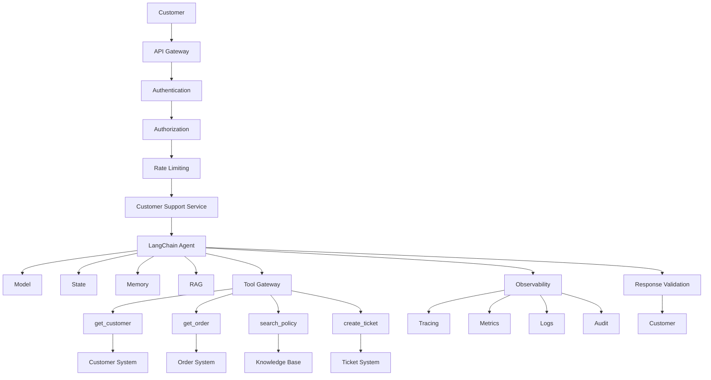

---

# 📚 References & Further Reading

Recommended areas for further reading:

- LangChain Agents
- LangChain Middleware
- LangChain Tools
- LangChain Runtime
- LangGraph Runtime
- LangSmith Observability
- LangSmith Evaluation
- LangChain Deployment
- LangChain Model Integrations
- LangChain Production Architecture

> LangChain evolves rapidly. Before using examples in production, verify current APIs, package names, middleware interfaces, agent construction APIs, model integrations, persistence mechanisms, and deployment capabilities against the official LangChain documentation.

---

> **Enterprise AI Engineering Handbook**
>
> *Building Production-Grade Enterprise AI Systems — One Chapter at a Time.*