# 09 — LlamaIndex Fundamentals

> Learn the core architecture, concepts, components, and production-oriented patterns of LlamaIndex for building data-centric Enterprise AI applications, RAG systems, and knowledge-aware LLM applications.

---

## 📖 Overview

LlamaIndex is an AI engineering framework focused strongly on connecting Large Language Models with external data.

While an LLM provides reasoning and generation capabilities, enterprise applications typically need access to:

```text
Documents
Databases
APIs
Knowledge Bases
Cloud Storage
Enterprise Systems
```

LlamaIndex provides abstractions for connecting these data sources with LLM-powered applications.

The core idea can be represented as:

```text
Enterprise Data
      ↓
Data Connectors
      ↓
Documents / Nodes
      ↓
Indexes
      ↓
Retrieval
      ↓
Context
      ↓
LLM
      ↓
Response
```

LlamaIndex is therefore particularly relevant for:

```text
RAG
Knowledge Systems
Document Intelligence
Enterprise Search
Data Agents
Knowledge Agents
Data-Driven AI Applications
```

---

# 🎯 Learning Objectives

After completing this chapter, you will be able to:

- Understand what LlamaIndex is
- Understand the architecture of LlamaIndex
- Understand the LlamaIndex data-centric approach
- Understand Documents and Nodes
- Understand data connectors
- Understand indexing
- Understand retrieval
- Understand query engines
- Understand response synthesis
- Understand the relationship between LlamaIndex and RAG
- Build a basic LlamaIndex application
- Understand how LlamaIndex fits into Enterprise AI architecture
- Understand where LlamaIndex differs from LangChain
- Identify appropriate use cases for LlamaIndex

---

# 1. What Is LlamaIndex?

LlamaIndex is a framework for building LLM applications that need to work with external data.

A simplified architecture is:

```text
             LLM
              │
              ▼
       LlamaIndex Layer
              │
      ┌───────┼────────┐
      ▼       ▼        ▼
   Data    Indexing  Retrieval
   Layer    Layer      Layer
      │       │        │
      └───────┼────────┘
              ▼
       Enterprise Data
```

The framework provides building blocks for:

```text
Data Ingestion
Data Transformation
Indexing
Retrieval
Querying
Response Synthesis
Agents
Evaluation
Observability
```

---

# 2. The Core Problem

An LLM does not automatically know an organization's private data.

For example:

```text
LLM
 ↓
General Knowledge
```

But an enterprise application may need:

```text
Company Policies
Customer Records
Product Documentation
Financial Reports
Internal Knowledge
Engineering Documents
```

The architecture becomes:

```text
Enterprise Data
      ↓
LlamaIndex
      ↓
Relevant Context
      ↓
LLM
      ↓
Answer
```

---

# 3. LlamaIndex Mental Model

A useful mental model is:

```text
LOAD
 ↓
TRANSFORM
 ↓
INDEX
 ↓
RETRIEVE
 ↓
SYNTHESIZE
 ↓
RESPOND
```

This pipeline is central to understanding LlamaIndex.

---

# 4. LlamaIndex Architecture

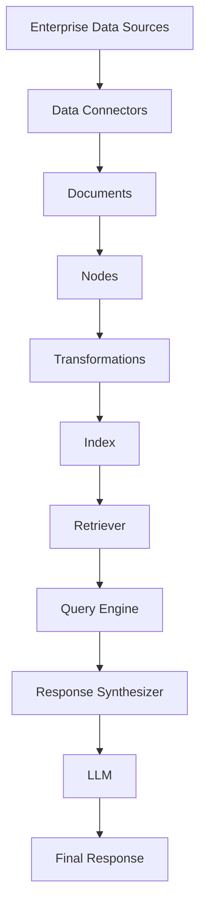

---

# 5. Data-Centric Architecture

One of the important characteristics of LlamaIndex is its strong focus on data.

A simplified architecture is:

```text
                 LlamaIndex
                     │
       ┌─────────────┼─────────────┐
       ▼             ▼             ▼
     Data          Index         Query
     Layer         Layer         Layer
       │             │             │
       ▼             ▼             ▼
  Documents       Nodes        Retrieval
  Databases       Vectors      Synthesis
  APIs             Metadata      LLM
```

This makes LlamaIndex particularly useful for RAG-heavy systems.

---

# 6. Data Connectors

LlamaIndex can ingest information from different sources.

Examples include:

```text
PDF
Text Files
Markdown
CSV
JSON
Databases
Cloud Storage
Web Pages
APIs
Enterprise Knowledge Bases
```

The architectural pattern is:

```text
Data Source
     ↓
Connector
     ↓
LlamaIndex Document
```

---

# 7. Documents

A `Document` represents a source of information.

Conceptually:

```text
Document
 ├── Text
 ├── Metadata
 └── Source Information
```

Example:

```python
from llama_index.core import Document

document = Document(
    text="Enterprise AI systems require strong observability.",
    metadata={
        "source": "architecture-guide",
        "department": "engineering"
    }
)
```

The exact API can vary across LlamaIndex versions, so production implementations should verify the current documentation.

---

# 8. Metadata

Metadata provides additional information about the source.

Example:

```python
metadata = {
    "source": "employee-handbook.pdf",
    "department": "hr",
    "document_type": "policy",
    "year": 2026
}
```

Metadata can later support:

```text
Filtering
Routing
Security
Retrieval
Observability
```

---

# 9. Nodes

LlamaIndex commonly represents smaller units of information as `Node` objects.

Conceptually:

```text
Document
    │
    ├── Node 1
    ├── Node 2
    ├── Node 3
    └── Node 4
```

A node can contain:

```text
Text
+
Metadata
+
Relationships
+
Identifiers
```

---

# 10. Document-to-Node Transformation

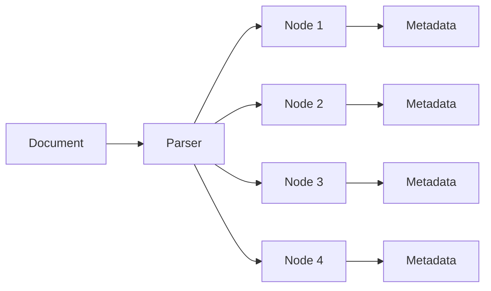

This transformation is important because retrieval usually operates on smaller pieces of information rather than entire documents.

---

# 11. Why Nodes Matter

Consider a 100-page document.

Sending the entire document to the LLM is inefficient.

Instead:

```text
100-page Document
       ↓
     Nodes
       ↓
Relevant Nodes
       ↓
LLM Context
```

This improves:

```text
Context Relevance
Token Efficiency
Retrieval Precision
Latency
Cost
```

---

# 12. Chunking

Chunking determines how documents are divided.

Example:

```text
Document
 ↓
Chunk 1
Chunk 2
Chunk 3
Chunk 4
```

A simple conceptual strategy:

```python
text = """
Enterprise AI systems require observability.
Production systems require security.
"""

chunks = [
    "Enterprise AI systems require observability.",
    "Production systems require security."
]
```

Real applications generally use more sophisticated parsing and chunking strategies.

---

# 13. Chunk Size Trade-off

Small chunks:

```text
Better Precision
+
Less Context
```

but may lose:

```text
Contextual Relationships
```

Large chunks:

```text
More Context
```

but may increase:

```text
Noise
Token Usage
Latency
Cost
```

Therefore:

```text
Chunk Size
=
Retrieval Quality
+
Context Requirements
+
Cost
```

---

# 14. Indexing

An index organizes data to make retrieval efficient.

Conceptually:

```text
Documents
 ↓
Nodes
 ↓
Embeddings / Representations
 ↓
Index
```

Example:

```text
Node 1 → Vector 1
Node 2 → Vector 2
Node 3 → Vector 3
```

---

# 15. Vector Index

A common LlamaIndex pattern is a vector-based index.

```text
Node
 ↓
Embedding Model
 ↓
Vector
 ↓
Vector Index
```

At query time:

```text
Question
 ↓
Query Embedding
 ↓
Similarity Search
 ↓
Relevant Nodes
```

---

# 16. Vector Retrieval Architecture

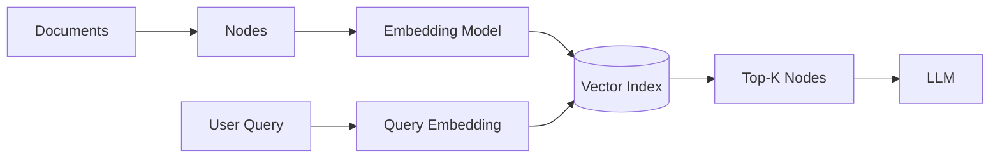

---

# 17. Embeddings

Embeddings represent text in vector space.

Conceptually:

```text
"Cloud AI architecture"
        ↓
[0.12, -0.34, 0.81, ...]
```

Similar concepts tend to produce vectors that are closer according to the chosen similarity measure.

---

# 18. Embedding Model Configuration

LlamaIndex can work with different embedding providers.

Conceptually:

```text
LlamaIndex
     ↓
Embedding Interface
     ↓
 ┌───┼──────────┐
 ▼   ▼          ▼
OpenAI HuggingFace Other
```

This allows applications to select embedding models according to:

```text
Quality
Cost
Latency
Language Support
Deployment Requirements
```

---

# 19. LLM Configuration

LlamaIndex can also be configured with different LLM providers.

Conceptually:

```text
LlamaIndex
     ↓
LLM Interface
     ↓
 ┌───┼──────────┐
 ▼   ▼          ▼
OpenAI Anthropic Other
```

The application can therefore separate:

```text
Framework
```

from:

```text
Model Provider
```

where appropriate.

---

# 20. Basic LlamaIndex Example

A minimal example can be structured as:

```python
from llama_index.core import VectorStoreIndex, SimpleDirectoryReader

documents = SimpleDirectoryReader(
    "data"
).load_data()

index = VectorStoreIndex.from_documents(
    documents
)

query_engine = index.as_query_engine()

response = query_engine.query(
    "What does the documentation say about security?"
)

print(response)
```

Conceptually:

```text
Documents
 ↓
VectorStoreIndex
 ↓
Query Engine
 ↓
Retriever
 ↓
LLM
 ↓
Response
```

---

# 21. Query Engine

A query engine provides a high-level interface for asking questions over indexed data.

```python
query_engine = index.as_query_engine()

response = query_engine.query(
    "What is the security policy?"
)
```

The query engine coordinates:

```text
Query
 ↓
Retrieval
 ↓
Context
 ↓
Response Synthesis
```

---

# 22. Query Architecture

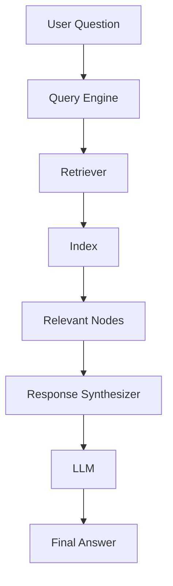

---

# 23. Retriever

The retriever is responsible for finding relevant nodes.

Conceptually:

```python
retriever = index.as_retriever(
    similarity_top_k=5
)
```

Then:

```text
Query
 ↓
Retriever
 ↓
Top-K Nodes
```

Retrieval quality strongly influences final answer quality.

---

# 24. Top-K Retrieval

If:

```text
similarity_top_k = 5
```

the retriever attempts to return the most relevant five nodes according to its retrieval strategy.

Increasing K:

```text
More Context
```

but may also produce:

```text
More Noise
More Tokens
Higher Cost
Higher Latency
```

---

# 25. Response Synthesis

After retrieval:

```text
User Question
       ↓
Relevant Nodes
       ↓
Response Synthesizer
       ↓
LLM
       ↓
Answer
```

The response synthesizer is responsible for constructing the final response from the retrieved context.

---

# 26. Response Synthesis Strategies

Conceptually, response synthesis may involve:

```text
Retrieved Context
       ↓
Combine
       ↓
Prompt
       ↓
LLM
```

For larger contexts, the framework can use different synthesis strategies.

The important architectural concept is:

```text
Retrieval
        ≠
Response Generation
```

They are separate stages.

---

# 27. End-to-End RAG Pipeline

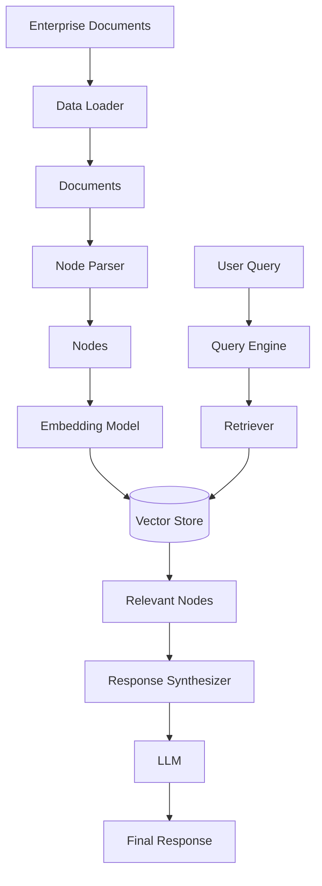

---

# 28. LlamaIndex and RAG

LlamaIndex is strongly associated with RAG architectures.

A basic RAG system is:

```text
Documents
 ↓
Index
 ↓
Retriever
 ↓
Context
 ↓
LLM
 ↓
Answer
```

LlamaIndex provides components for implementing many parts of this pipeline.

---

# 29. LlamaIndex RAG Mental Model

```text
               RAG
                │
      ┌─────────┴─────────┐
      ▼                   ▼
  Indexing             Querying
      │                   │
 Documents              Query
      │                   │
 Nodes                Retrieval
      │                   │
 Embeddings              │
      │                   │
 Vector Store             │
      └─────────┬─────────┘
                ▼
              LLM
```

---

# 30. Metadata Filtering

Metadata can be used to narrow retrieval.

Example:

```text
Query:
"What is the leave policy?"

Metadata:

department = "HR"
country = "India"
year = 2026
```

Retrieval becomes:

```text
Query
+
Metadata Filter
 ↓
Relevant Nodes
```

This can improve:

```text
Precision
Security
Tenant Isolation
```

---

# 31. Metadata-Aware Retrieval

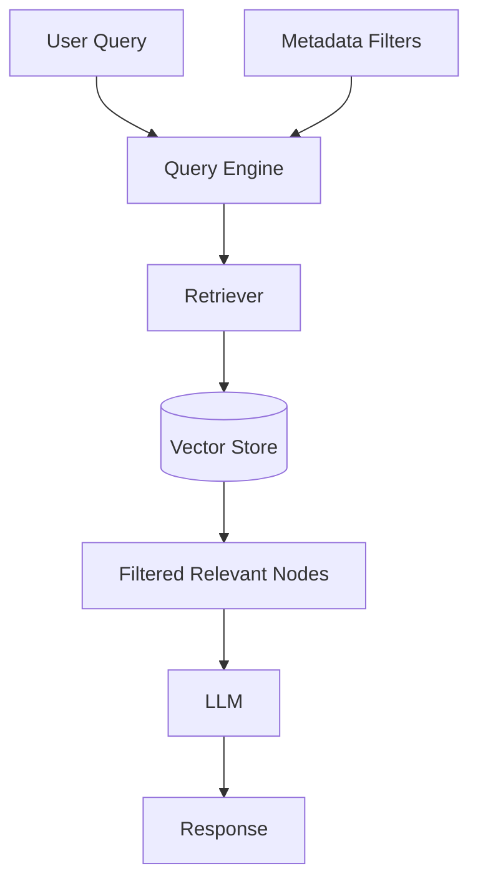

---

# 32. Document Relationships

Nodes can contain relationships with other nodes.

Conceptually:

```text
Node A
  │
  ├── Previous
  ├── Next
  ├── Parent
  └── Related
```

This can preserve information about document structure.

---

# 33. Node Relationships

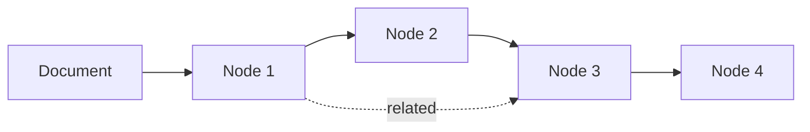

Relationships can become useful for more advanced retrieval architectures.

---

# 34. Storage Architecture

A production LlamaIndex application can separate:

```text
Documents
Nodes
Embeddings
Indexes
State
```

Example:

```text
                Application
                     │
              ┌──────┴──────┐
              ▼             ▼
         LlamaIndex      LLM
              │
       ┌──────┼─────────┐
       ▼      ▼         ▼
   Document  Index    Storage
    Store              Layer
                         │
               ┌─────────┼─────────┐
               ▼         ▼         ▼
            Vector DB  SQL DB   Object Store
```

---

# 35. Persistent Storage

Production applications should not assume that an in-memory index is sufficient.

A production architecture may use:

```text
Object Storage
+
Vector Database
+
Metadata Database
```

This supports:

```text
Persistence
Scaling
Recovery
Rebuilding
Operational Management
```

---

# 36. In-Memory vs Persistent Index

### Development

```text
Documents
 ↓
Memory
 ↓
Index
```

### Production

```text
Documents
 ↓
Persistent Storage
 ↓
Index
 ↓
Vector Database
```

The appropriate architecture depends on scale and operational requirements.

---

# 37. Data Ingestion Pipeline

A production ingestion pipeline may look like:

```text
Source
 ↓
Connector
 ↓
Parser
 ↓
Cleaner
 ↓
Chunker
 ↓
Metadata Enrichment
 ↓
Embedding
 ↓
Index
 ↓
Vector Store
```

---

# 38. Ingestion Architecture

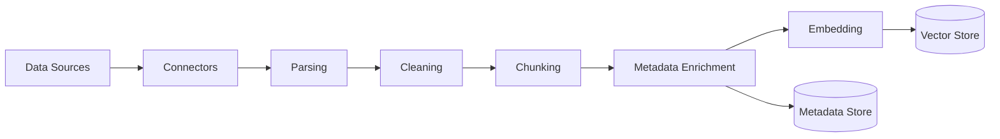

---

# 39. Incremental Ingestion

Production systems often need to process only changed documents.

Instead of:

```text
Entire Repository
 ↓
Re-index Everything
```

use:

```text
Changed Documents
 ↓
Detect Changes
 ↓
Process Changes
 ↓
Update Index
```

This can reduce:

```text
Processing Time
Embedding Cost
Infrastructure Load
```

---

# 40. Incremental Update Architecture

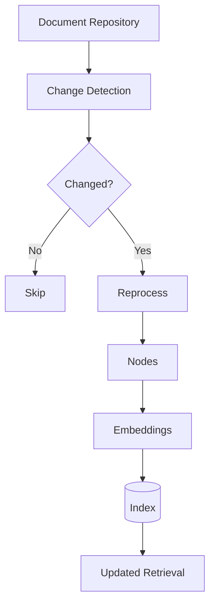

---

# 41. Delete Handling

Production ingestion must also handle deletions.

```text
Document Deleted
 ↓
Detect Delete Event
 ↓
Find Related Nodes
 ↓
Remove / Update Index
```

Otherwise stale information may remain searchable.

---

# 42. Data Freshness

Enterprise RAG systems must consider:

```text
When was the source updated?
When was the document indexed?
When was the embedding generated?
```

Example:

```text
Source Updated
2026-08-11 10:00

Index Updated
2026-08-11 10:05
```

This provides a basis for measuring ingestion freshness.

---

# 43. LlamaIndex and Enterprise Search

LlamaIndex can serve as an application-layer abstraction over enterprise knowledge.

```text
Enterprise Sources
       ↓
LlamaIndex
       ↓
Unified Retrieval
       ↓
LLM
```

This is useful when data is distributed across:

```text
File Systems
Databases
Cloud Storage
Knowledge Bases
APIs
```

---

# 44. Multiple Data Sources

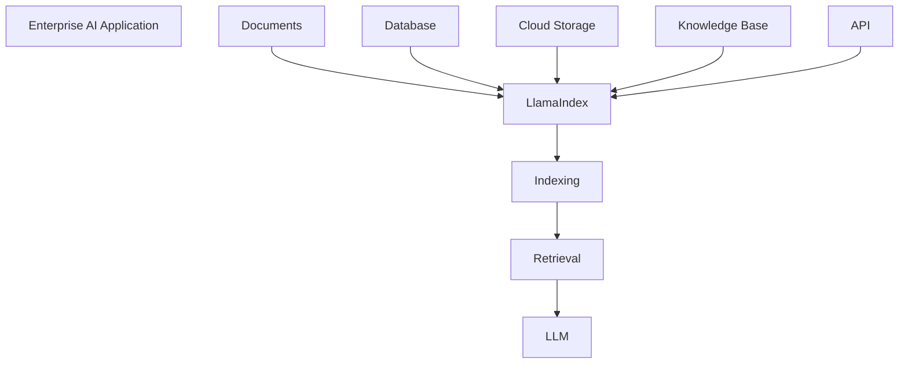

---

# 45. Unified Retrieval Layer

The application can expose a single logical retrieval capability:

```text
EnterpriseKnowledgeService
```

behind which LlamaIndex coordinates:

```text
Connectors
+
Indexes
+
Retrievers
+
Response Synthesis
```

This reduces application-level retrieval complexity.

---

# 46. LlamaIndex vs Traditional Database Querying

Traditional application:

```text
User
 ↓
SQL
 ↓
Database
 ↓
Rows
```

LlamaIndex RAG:

```text
User Question
 ↓
Semantic Retrieval
 ↓
Relevant Nodes
 ↓
LLM
 ↓
Natural Language Answer
```

They solve different problems.

A production system may use both.

---

# 47. Hybrid Architecture

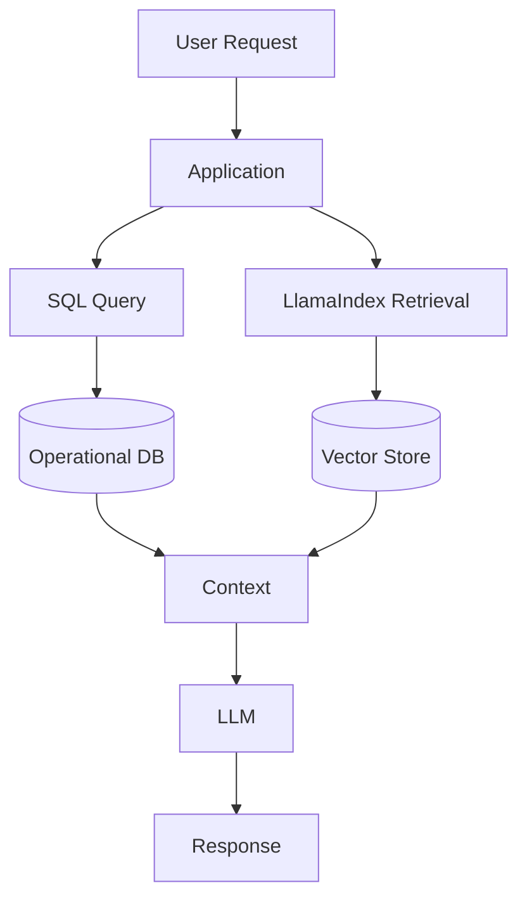

This is especially useful when an application requires:

```text
Structured Data
+
Unstructured Knowledge
```

---

# 48. Structured vs Unstructured Data

### Structured

```text
Customer
Order
Account
Transaction
```

Best handled using:

```text
SQL
APIs
Business Services
```

### Unstructured

```text
Documents
Policies
Reports
Manuals
Emails
```

Often suitable for:

```text
Semantic Retrieval
RAG
LlamaIndex
```

---

# 49. LlamaIndex Query Flow

A simplified query lifecycle:

```text
1. Receive Query
       ↓
2. Transform Query
       ↓
3. Retrieve Nodes
       ↓
4. Apply Filters
       ↓
5. Build Context
       ↓
6. Call LLM
       ↓
7. Synthesize Response
       ↓
8. Return Answer
```

---

# 50. Query Flow Diagram

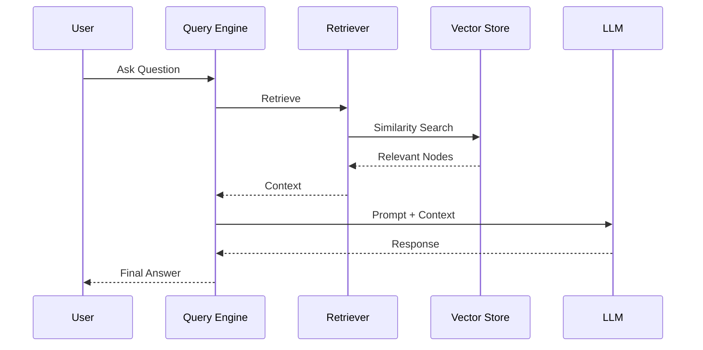

---

# 51. Query Transformation

A user query may not always be optimal for retrieval.

Example:

```text
User:
"How do we handle employee leave?"
```

The retrieval layer may transform it into a more retrieval-friendly representation.

Conceptually:

```text
User Query
 ↓
Query Transformation
 ↓
Retrieval Query
```

Advanced query transformation will be covered in later LlamaIndex chapters.

---

# 52. Retrieval Quality

RAG quality depends heavily on:

```text
Parsing
+
Chunking
+
Metadata
+
Embedding
+
Index
+
Retriever
+
Ranking
+
Context Construction
```

LlamaIndex does not automatically guarantee high-quality retrieval.

The data pipeline still matters.

---

# 53. LlamaIndex Does Not Replace Good Data Engineering

A framework cannot automatically solve:

```text
Poor Documents
Poor Metadata
Poor Chunking
Bad Embeddings
Stale Data
Duplicate Data
Incorrect Access Control
```

A strong RAG system requires:

```text
AI Engineering
+
Data Engineering
+
Software Engineering
```

---

# 54. Security Considerations

Enterprise LlamaIndex applications should enforce:

```text
Authentication
Authorization
Tenant Isolation
Metadata-Based Access Control
Data Filtering
Audit
```

Never assume:

```text
Retrieved
=
Authorized
```

Retrieval must respect data-access boundaries.

---

# 55. Multi-Tenant Retrieval

A multi-tenant system may look like:

```text
User
 ↓
Tenant Resolution
 ↓
Authorization
 ↓
LlamaIndex Retriever
 ↓
Tenant Filter
 ↓
Vector Store
```

The tenant boundary should be enforced at the data layer.

---

# 56. Multi-Tenant Architecture

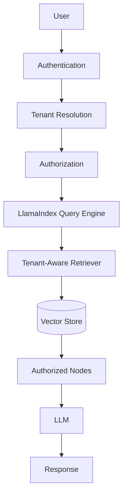

---

# 57. Observability

Production LlamaIndex applications should track:

```text
Ingestion
Retrieval
Query Latency
Embedding Latency
LLM Latency
Token Usage
Errors
Index Updates
Data Freshness
```

Useful trace:

```text
Query
 ↓
Retriever
 ↓
Vector Store
 ↓
Nodes
 ↓
Prompt
 ↓
LLM
 ↓
Response
```

---

# 58. Evaluation

RAG applications should evaluate:

```text
Retrieval Quality
Context Relevance
Answer Relevance
Faithfulness
Latency
Cost
```

A useful evaluation architecture is:

```text
Test Questions
 ↓
Retriever
 ↓
Retrieved Context
 ↓
LLM
 ↓
Answer
 ↓
Evaluation
```

---

# 59. Production Performance

Performance depends on:

```text
Document Size
Number of Nodes
Embedding Model
Vector Store
Top-K
LLM
Network
Response Synthesis
```

Optimization may include:

```text
Caching
Batching
Index Optimization
Metadata Filtering
Top-K Tuning
Parallel Processing
```

---

# 60. Production Cost

Cost can come from:

```text
Document Parsing
Embedding Generation
Storage
Retrieval
LLM Calls
Evaluation
Observability
```

A production cost model is:

```text
Total RAG Cost
=
Ingestion Cost
+
Storage Cost
+
Retrieval Cost
+
Generation Cost
+
Operational Cost
```

---

# 61. Failure Modes

Typical failures include:

```text
Document Parsing Failure
Embedding Failure
Indexing Failure
Retrieval Failure
Stale Data
Wrong Context
LLM Hallucination
Provider Failure
Vector Store Failure
```

A production system should make these failures observable.

---

# 62. Failure Handling

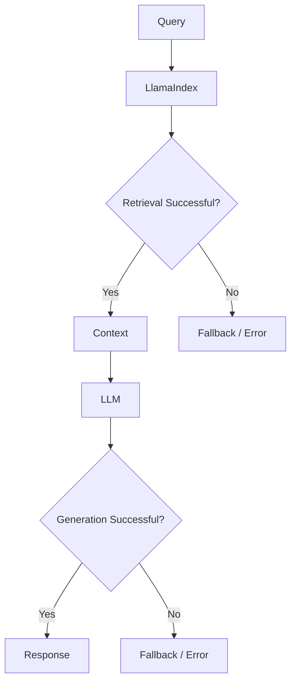

---

# 63. LlamaIndex and Agents

LlamaIndex is not limited to traditional RAG.

It also provides components for building data-aware agent systems.

Conceptually:

```text
Agent
 ↓
LlamaIndex Tools
 ↓
Data Sources
```

This allows agents to interact with:

```text
Knowledge Bases
Databases
APIs
Retrieval Systems
```

The deeper agent capabilities will be covered in dedicated chapters.

---

# 64. Data Agents

A data-centric agent may look like:

```text
User
 ↓
Agent
 ├── Search Knowledge
 ├── Query Database
 ├── Retrieve Documents
 └── Call API
```

This makes LlamaIndex relevant for enterprise knowledge agents.

---

# 65. LlamaIndex and Agent Architecture

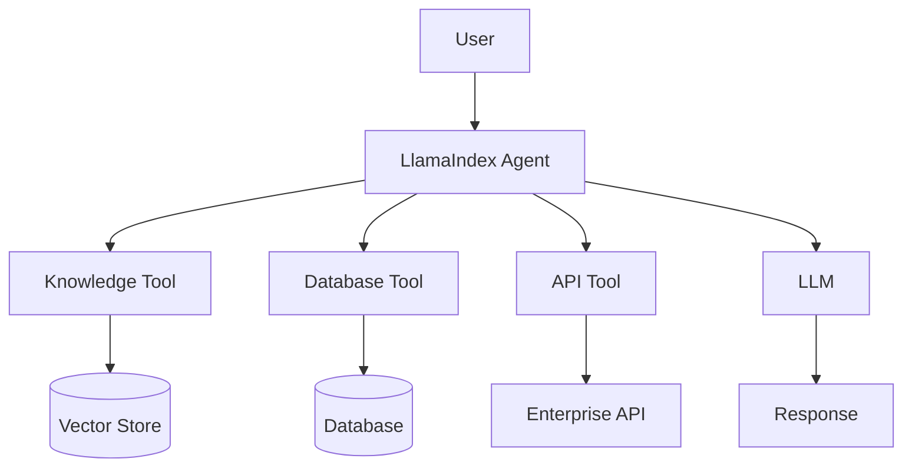

---

# 66. LlamaIndex and Workflow Architecture

LlamaIndex can also be used to compose application workflows.

Conceptually:

```text
Input
 ↓
Workflow Step
 ↓
Retrieval
 ↓
Processing
 ↓
LLM
 ↓
Validation
 ↓
Output
```

This provides more explicit control than allowing an agent to make every decision dynamically.

---

# 67. Workflow vs Agent

### Workflow

```text
Step A
 ↓
Step B
 ↓
Step C
 ↓
Step D
```

### Agent

```text
Goal
 ↓
Model
 ↓
Decision
 ├── Tool A
 ├── Tool B
 └── Tool C
```

A production system should select the appropriate execution model.

---

# 68. LlamaIndex Ecosystem Mental Model

```text
                 LlamaIndex
                     │
       ┌─────────────┼──────────────┐
       ▼             ▼              ▼
     Data          Index          Query
       │             │              │
       ▼             ▼              ▼
 Connectors       Vectors       Retrieval
 Documents        Nodes         Synthesis
 Nodes            Metadata      LLM
       │             │              │
       └─────────────┼──────────────┘
                     ▼
                  Agents
                     │
                     ▼
                 Workflows
```

---

# 69. LlamaIndex vs LangChain

Both frameworks can be used to build LLM applications.

A simplified distinction is:

```text
LangChain
    ↓
General LLM Application / Tool / Agent Orchestration

LlamaIndex
    ↓
Data / Knowledge / RAG-Centric Applications
```

This is a simplification, not a strict boundary.

Both frameworks increasingly overlap.

---

# 70. Architectural Comparison

| Capability | LangChain | LlamaIndex |
|---|---|---|
| Model Integration | Strong | Strong |
| Prompting | Strong | Strong |
| Tool Calling | Strong | Strong |
| Agents | Strong | Strong |
| RAG | Strong | Very Strong |
| Data Connectors | Strong | Very Strong |
| Document Processing | Strong | Very Strong |
| Indexing | Strong | Core Focus |
| Retrieval | Strong | Core Focus |
| Knowledge Systems | Strong | Very Strong |
| Workflow Orchestration | Strong | Strong |
| Framework Ecosystem | Broad | Data-centric |

The choice should be based on application requirements rather than framework popularity.

---

# 71. When to Consider LlamaIndex

LlamaIndex is particularly worth considering when the application is strongly centered around:

```text
Enterprise Knowledge
+
Document Processing
+
RAG
+
Data Connectors
+
Retrieval
+
Knowledge Systems
```

---

# 72. When LangChain May Be Preferable

LangChain may be a stronger fit when the primary requirement is:

```text
General AI Application
+
Tools
+
Agent Orchestration
+
Multiple AI Components
+
Broad AI Workflow Integration
```

However, the two ecosystems overlap significantly.

---

# 73. Can They Be Used Together?

Yes.

An architecture may use:

```text
LangChain
+
LlamaIndex
```

For example:

```text
Application
 ↓
LangChain Agent
 ↓
LlamaIndex Retrieval
 ↓
Vector Store
```

or:

```text
Application
 ↓
LlamaIndex Workflow
 ↓
LangChain Model / Tool
```

Framework composition should be justified by clear architectural value.

---

# 74. Combined Architecture

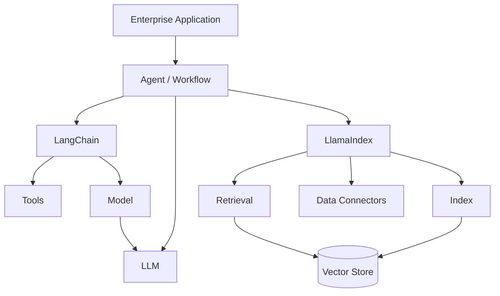

---

# 75. Framework Coupling Warning

Using multiple frameworks can also increase complexity.

```text
Application
 ↓
LangChain
 ↓
LlamaIndex
 ↓
Provider SDK
```

Now engineers must understand:

```text
Multiple Abstractions
+
Multiple Lifecycles
+
Multiple Dependencies
```

Use framework composition only when the combined capabilities justify the additional complexity.

---

# 76. Enterprise Architecture Principle

A useful architecture is:

```text
Business Layer
      ↓
AI Capability Layer
      ↓
Framework Layer
      ↓
Provider Layer
      ↓
Infrastructure Layer
```

Example:

```text
Business Service
      ↓
KnowledgeService
      ↓
LlamaIndex Adapter
      ↓
Vector Store / LLM
```

---

# 77. Production Design Principles

When using LlamaIndex:

```text
1. Separate ingestion from querying
2. Persist production indexes
3. Track metadata
4. Enforce authorization before retrieval
5. Design tenant isolation
6. Monitor data freshness
7. Version ingestion pipelines
8. Evaluate retrieval quality
9. Track cost
10. Monitor failures
11. Keep business logic outside framework internals
12. Use adapters when framework portability matters
```

---

# 78. Production Reference Architecture

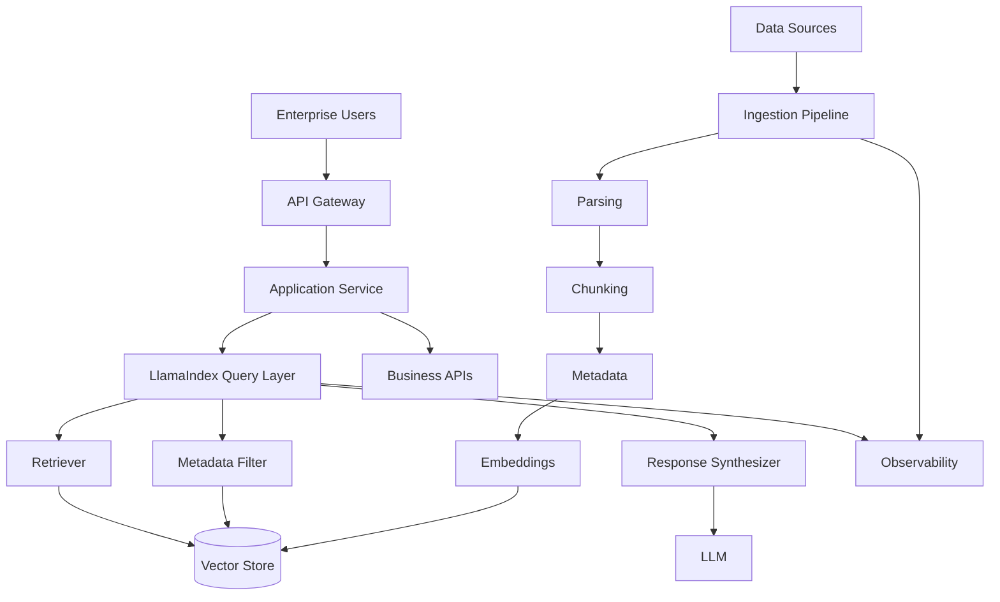

---

# 79. Common Mistakes

## Mistake 1 — Treating LlamaIndex as the Entire Architecture

Bad:

```text
Application
 ↓
LlamaIndex
 ↓
Everything
```

Better:

```text
Application
 ↓
AI Capability
 ↓
LlamaIndex
 ↓
Data / Models
```

---

## Mistake 2 — Ignoring Data Quality

```text
Bad Data
 ↓
LlamaIndex
 ↓
Bad Retrieval
 ↓
Bad Answer
```

Frameworks cannot compensate for fundamentally poor source data.

---

## Mistake 3 — Using One Chunking Strategy Everywhere

Different content may require different strategies.

```text
PDF
Code
Tables
Policies
Emails
```

may require different parsing and chunking approaches.

---

## Mistake 4 — Ignoring Metadata

Without metadata:

```text
Retrieval
 ↓
Potentially Irrelevant Context
```

Metadata can improve:

```text
Filtering
Precision
Security
Tenant Isolation
```

---

## Mistake 5 — Ignoring Data Freshness

```text
Updated Source
      ↓
Old Index
      ↓
Wrong Answer
```

Production systems need ingestion freshness monitoring.

---

## Mistake 6 — Assuming Retrieval Equals Authorization

```text
Retrieved
≠
Authorized
```

Authorization must be enforced explicitly.

---

## Mistake 7 — Sending Too Much Context

```text
Retrieve Everything
 ↓
Large Prompt
 ↓
Higher Cost
 ↓
More Noise
```

Retrieve only what is necessary.

---

# 80. Production Readiness Checklist

## Data

- [ ] Data sources identified
- [ ] Connectors configured
- [ ] Parsing strategy defined
- [ ] Chunking strategy defined
- [ ] Metadata strategy defined
- [ ] Data freshness strategy defined

## Indexing

- [ ] Index strategy defined
- [ ] Embedding model selected
- [ ] Vector store selected
- [ ] Persistent storage configured
- [ ] Incremental updates supported
- [ ] Delete handling implemented

## Retrieval

- [ ] Retriever selected
- [ ] Top-K tuned
- [ ] Metadata filtering implemented
- [ ] Tenant filtering implemented
- [ ] Retrieval evaluation defined

## Security

- [ ] Authentication
- [ ] Authorization
- [ ] Tenant isolation
- [ ] Data filtering
- [ ] Audit logging
- [ ] Sensitive data protection

## Operations

- [ ] Logging
- [ ] Metrics
- [ ] Tracing
- [ ] Cost monitoring
- [ ] Error monitoring
- [ ] Data freshness monitoring

## AI

- [ ] LLM configured
- [ ] Embedding model configured
- [ ] Prompt strategy defined
- [ ] Response validation
- [ ] Evaluation dataset

---

# 81. Key Takeaways

- LlamaIndex is strongly oriented toward connecting LLMs with external data.
- Documents and Nodes are foundational concepts.
- Data connectors provide the ingestion boundary.
- Nodes provide smaller retrievable units of information.
- Indexes organize data for efficient retrieval.
- Embeddings enable semantic retrieval.
- Query engines coordinate retrieval and response synthesis.
- Metadata can improve retrieval precision and security.
- RAG is one of the strongest use cases for LlamaIndex.
- Data quality is as important as model quality.
- Production ingestion should support updates and deletions.
- Data freshness should be measurable.
- Persistent indexes are generally required for production systems.
- Retrieval must respect authorization and tenant boundaries.
- LlamaIndex can support data-aware agents and workflows.
- LlamaIndex and LangChain overlap significantly.
- They can be used together, but composition increases architectural complexity.
- Framework coupling should be controlled where long-term portability matters.
- LlamaIndex should be treated as one layer within an Enterprise AI architecture.
- The framework should support the architecture rather than become the architecture.

---

# 📝 Quick Revision Notes

## LlamaIndex Core Pipeline

```text
Data Source
 ↓
Connector
 ↓
Document
 ↓
Node
 ↓
Transformation
 ↓
Index
 ↓
Retriever
 ↓
Query Engine
 ↓
Response Synthesizer
 ↓
LLM
 ↓
Response
```

---

## RAG

```text
Documents
 ↓
Nodes
 ↓
Embeddings
 ↓
Vector Store
 ↓
Retriever
 ↓
Context
 ↓
LLM
 ↓
Answer
```

---

## Production

```text
Data Quality
+
Security
+
Metadata
+
Freshness
+
Retrieval
+
Evaluation
+
Observability
```

---

## LlamaIndex Mental Model

```text
LlamaIndex
=
Data
+
Index
+
Retrieval
+
Query
+
Synthesis
```

---

## Enterprise Architecture

```text
Business Application
        ↓
AI Capability
        ↓
LlamaIndex
        ↓
Data / Retrieval / Models
        ↓
Infrastructure
```

---

# ❓ Interview Questions

## Beginner

1. What is LlamaIndex?
2. What problem does LlamaIndex solve?
3. What is a Document?
4. What is a Node?
5. What is an Index?
6. What is a Retriever?
7. What is a Query Engine?
8. Why is metadata important?

## Intermediate

9. Explain the LlamaIndex RAG pipeline.
10. How does a document become retrievable nodes?
11. What is the role of embeddings?
12. How does vector retrieval work?
13. What is response synthesis?
14. How would you implement metadata filtering?
15. How would you handle incremental document updates?
16. How would you handle document deletion?
17. How would you design persistent LlamaIndex storage?
18. How would you implement multi-tenant retrieval?

## Advanced

19. How would you design a production LlamaIndex architecture?
20. How would you isolate LlamaIndex from business logic?
21. How would you design a multi-source enterprise knowledge system?
22. How would you combine structured SQL data with LlamaIndex RAG?
23. How would you measure data freshness?
24. How would you evaluate retrieval quality?
25. When would you use LlamaIndex instead of LangChain?
26. When would you combine LlamaIndex and LangChain?
27. What are the risks of using multiple AI frameworks?
28. How would you prevent unauthorized data from being retrieved?
29. How would you design incremental indexing at enterprise scale?
30. How would you optimize LlamaIndex for high-volume RAG workloads?

---

# 🛠️ Practical Exercise

Build an Enterprise Knowledge Assistant using LlamaIndex.

## Data Sources

Start with:

```text
PDF
Markdown
Text
```

Later extend to:

```text
Database
Cloud Storage
Enterprise API
```

---

## Pipeline

Implement:

```text
Documents
 ↓
Loading
 ↓
Parsing
 ↓
Chunking
 ↓
Metadata
 ↓
Embedding
 ↓
Vector Index
 ↓
Retriever
 ↓
Query Engine
 ↓
LLM
 ↓
Answer
```

---

## Required Metadata

Add:

```text
document_id
source
department
document_type
created_at
updated_at
tenant_id
```

---

## Required Capabilities

Implement:

```text
Semantic Search
Metadata Filtering
Top-K Retrieval
Source Attribution
Document Updates
Document Deletion
```

---

## Production Architecture

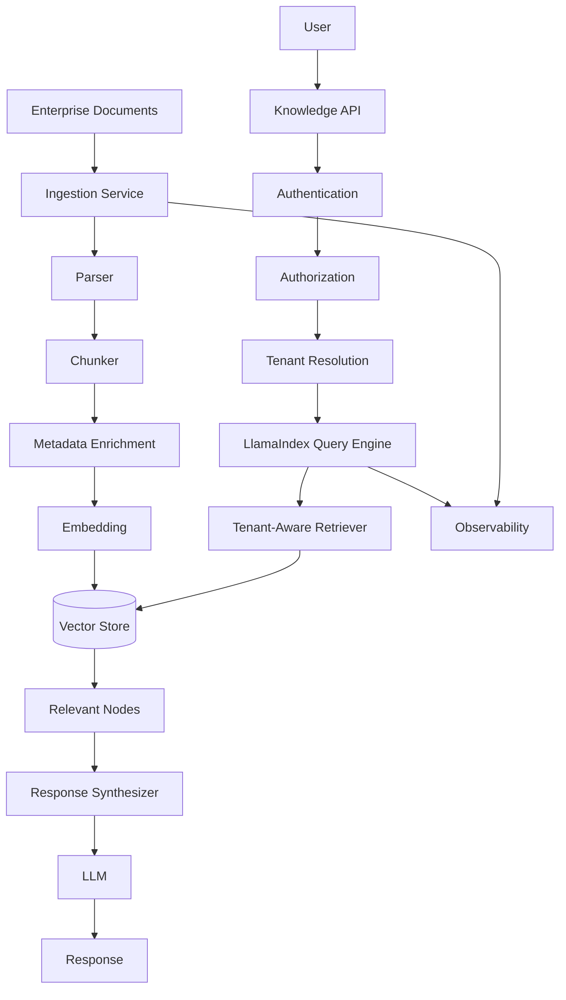

---

## 🧭 Chapter Navigation

⬅️ **Previous:** [08. LangChain Limitations and Trade-offs](08-langchain-limitations-and-tradeoffs.md)

📚 **Part VIII Index:** [AI Engineering Frameworks & Tooling](index.md)

➡️ **Next:** [10. LlamaIndex Data Ingestion](10-llamaindex-data-and-document-ingestion.md)

---

---

# 📚 References & Further Reading

Recommended areas for further study:

- LlamaIndex Core Concepts
- LlamaIndex Data Connectors
- Documents and Nodes
- Indexing
- Retrievers
- Query Engines
- Response Synthesis
- Vector Stores
- Metadata Filtering
- LlamaIndex Workflows
- LlamaIndex Agents
- LlamaIndex Evaluation
- LlamaIndex Observability
- LlamaIndex Production Deployment

> LlamaIndex evolves rapidly. Before implementing production systems, verify current package names, APIs, indexing abstractions, data connectors, retrieval APIs, workflow APIs, and agent APIs against the official LlamaIndex documentation.

---

> **Enterprise AI Engineering Handbook**
>
> *Building Production-Grade Enterprise AI Systems — One Chapter at a Time.*