# 10 — LlamaIndex Data and Document Ingestion

> Learn how to design production-grade data ingestion pipelines with LlamaIndex, including data connectors, document loading, parsing, metadata enrichment, transformations, chunking, incremental ingestion, updates, deletions, and enterprise data ingestion architecture.

---

## 📖 Overview

Enterprise AI applications rarely operate on clean, preprocessed text.

Real-world enterprise data exists across:

```text
PDFs
Word Documents
Markdown
HTML
CSV
JSON
Databases
Cloud Storage
Email
Web Pages
APIs
Knowledge Bases
Enterprise Applications
```

Before this data can be used by an LLM or RAG system, it must pass through an ingestion pipeline.

LlamaIndex provides abstractions for connecting external data sources and transforming their content into structures that can be indexed and retrieved.

A simplified pipeline is:

```text
Enterprise Data
      ↓
Data Connector
      ↓
Document
      ↓
Parsing
      ↓
Cleaning
      ↓
Chunking
      ↓
Metadata Enrichment
      ↓
Nodes
      ↓
Embedding
      ↓
Index / Vector Store
```

The quality of this pipeline directly affects downstream:

```text
Retrieval Quality
Answer Quality
Latency
Cost
Security
Data Freshness
```

---

# 🎯 Learning Objectives

After completing this chapter, you will be able to:

- Understand the LlamaIndex ingestion architecture
- Understand data connectors and readers
- Load enterprise documents into LlamaIndex
- Understand Documents and Nodes
- Design document parsing pipelines
- Apply chunking strategies
- Add metadata to documents and nodes
- Understand transformations
- Generate embeddings during ingestion
- Design incremental ingestion pipelines
- Handle document updates
- Handle document deletions
- Track document versions
- Design ingestion pipelines for large datasets
- Understand ingestion caching
- Design tenant-aware ingestion
- Build production-grade ingestion architectures
- Identify common ingestion failure patterns

---

# 1. Why Data Ingestion Matters

A RAG system is only as good as the data available to the retriever.

Consider:

```text
Poor Source Data
      ↓
Poor Parsing
      ↓
Poor Chunking
      ↓
Poor Metadata
      ↓
Poor Embeddings
      ↓
Poor Retrieval
      ↓
Poor Answer
```

Therefore:

```text
RAG Quality
≈
Data Quality
+
Retrieval Quality
+
Generation Quality
```

The ingestion pipeline is the foundation of the RAG system.

---

# 2. What Is Data Ingestion?

Data ingestion is the process of moving external information into an AI application's processing and indexing pipeline.

Conceptually:

```text
Source System
     ↓
Extract
     ↓
Transform
     ↓
Enrich
     ↓
Chunk
     ↓
Embed
     ↓
Index
```

For example:

```text
company-policy.pdf
        ↓
Document Loader
        ↓
Document
        ↓
Parser
        ↓
Nodes
        ↓
Embeddings
        ↓
Vector Store
```

---

# 3. LlamaIndex Ingestion Architecture

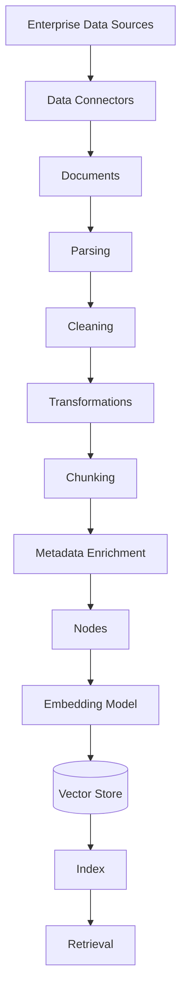

---

# 4. Data Sources

Enterprise ingestion pipelines may consume:

```text
Documents
Databases
Cloud Storage
APIs
Web Content
Enterprise SaaS
Knowledge Bases
Object Storage
File Systems
```

Example:

```text
                    Data Sources
                         │
       ┌─────────────────┼─────────────────┐
       ▼                 ▼                 ▼
    Documents        Databases         APIs
       │                 │                 │
       └─────────────────┼─────────────────┘
                         ▼
                    Ingestion
```

---

# 5. Data Connectors

A connector is responsible for obtaining data from a source and making it available to the LlamaIndex ingestion pipeline.

Conceptually:

```text
Data Source
     ↓
Connector
     ↓
Document
```

Examples include loaders/readers for:

```text
Local Files
PDF
CSV
JSON
Web Pages
Cloud Storage
Databases
```

The exact connector availability depends on the current LlamaIndex ecosystem and installed integrations.

---

# 6. Local File Ingestion

A simple development example can load files from a directory.

```python
from llama_index.core import SimpleDirectoryReader

documents = SimpleDirectoryReader(
    input_dir="data"
).load_data()

print(f"Loaded documents: {len(documents)}")
```

Conceptually:

```text
data/
 ├── policy.pdf
 ├── architecture.md
 ├── handbook.txt
 └── security.pdf
```

becomes:

```text
Documents
 ├── Document 1
 ├── Document 2
 ├── Document 3
 └── Document 4
```

---

# 7. Document Object

A document represents an input unit of information.

Conceptually:

```text
Document
 ├── Text
 ├── Metadata
 └── Source Information
```

Example:

```python
from llama_index.core import Document

document = Document(
    text="Enterprise AI systems require strong observability.",
    metadata={
        "source": "architecture-guide.md",
        "department": "engineering",
        "document_type": "technical"
    }
)
```

---

# 8. Document Metadata

Metadata provides contextual information about the source.

Example:

```python
metadata = {
    "document_id": "DOC-1001",
    "source": "employee-handbook.pdf",
    "department": "hr",
    "document_type": "policy",
    "country": "IN",
    "version": "3",
    "updated_at": "2026-08-11"
}
```

Metadata can later support:

```text
Filtering
Authorization
Tenant Isolation
Routing
Ranking
Observability
Auditing
```

---

# 9. Why Metadata Is Important

Consider two documents:

```text
Leave Policy - India
Leave Policy - Germany
```

A query:

```text
"What is the annual leave entitlement?"
```

may need:

```text
country = India
```

Without metadata:

```text
Query
 ↓
Potentially Mixed Results
```

With metadata:

```text
Query
+
country = India
 ↓
Relevant Documents
```

---

# 10. Metadata Architecture

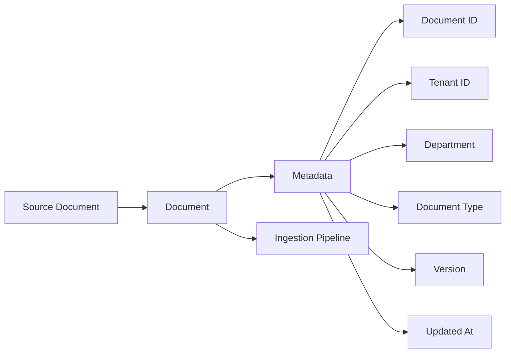

---

# 11. Parsing

Documents rarely arrive in a format directly usable by an LLM.

Examples:

```text
PDF
 ↓
Extract Text

HTML
 ↓
Extract Content

DOCX
 ↓
Extract Paragraphs

CSV
 ↓
Convert Rows / Records

JSON
 ↓
Extract Structured Fields
```

Parsing converts source-specific formats into usable content.

---

# 12. Parsing Is Not the Same as Chunking

These are separate operations.

```text
Parsing
=
Extract meaningful content from the source
```

while:

```text
Chunking
=
Divide extracted content into retrieval units
```

Pipeline:

```text
PDF
 ↓
Parsing
 ↓
Text
 ↓
Chunking
 ↓
Nodes
```

---

# 13. PDF Parsing Challenges

PDF documents may contain:

```text
Text
Tables
Images
Headers
Footers
Columns
Page Numbers
Scanned Pages
```

A naive parser may produce:

```text
Header
Paragraph
Footer
Paragraph
Page Number
```

rather than the logical document structure.

Therefore, enterprise PDF ingestion may require specialized parsing.

---

# 14. Structured Documents

Different document types require different strategies.

| Data Type | Common Challenge |
|---|---|
| PDF | Layout / tables / scanned content |
| DOCX | Structure / formatting |
| HTML | Navigation / boilerplate |
| CSV | Row semantics |
| JSON | Nested structures |
| Markdown | Sections / hierarchy |
| Code | Functions / classes / dependencies |
| Email | Threads / signatures / metadata |

A single ingestion strategy should not automatically be applied to every data type.

---

# 15. Document Cleaning

Raw extracted content often contains noise.

Example:

```text
Header
Company Confidential
Page 1

Actual Content

Footer
Generated by System
```

Cleaning can remove unnecessary information.

Conceptually:

```text
Raw Content
    ↓
Remove Boilerplate
    ↓
Normalize Text
    ↓
Clean Content
```

---

# 16. Cleaning Pipeline

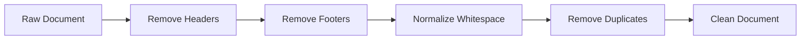

Cleaning must be carefully designed because aggressive cleaning can accidentally remove useful information.

---

# 17. Transformations

LlamaIndex ingestion pipelines can apply transformations before indexing.

Conceptually:

```text
Document
 ↓
Transformation 1
 ↓
Transformation 2
 ↓
Transformation 3
 ↓
Nodes
```

Common transformations include:

```text
Chunking
Metadata Extraction
Embedding
Text Normalization
Parsing
```

---

# 18. Transformation Pipeline

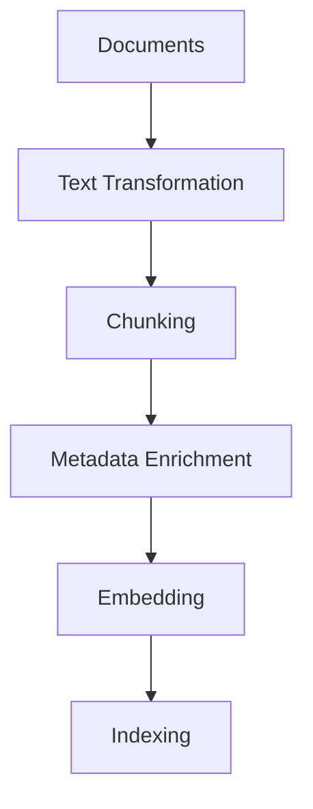

---

# 19. Chunking

Chunking divides content into smaller retrieval units.

Example:

```text
Large Document
      ↓
 ┌────┼────┬────┐
 ▼    ▼    ▼    ▼
C1    C2   C3   C4
```

Each chunk can become a node.

---

# 20. Why Chunking Matters

Consider:

```text
100-page document
```

Sending all 100 pages to the model is inefficient.

Instead:

```text
100-page Document
       ↓
      Nodes
       ↓
Relevant Nodes
       ↓
LLM
```

Good chunking improves:

```text
Retrieval Precision
Context Relevance
Token Efficiency
Latency
Cost
```

---

# 21. Fixed-Size Chunking

A simple strategy is fixed-size chunking.

Conceptually:

```python
text = "A very long document..."

chunk_size = 500
```

The document is divided into approximately fixed-size segments.

Advantages:

```text
Simple
Predictable
Easy to Implement
```

Limitations:

```text
May Split Sentences
May Split Sections
May Lose Semantic Boundaries
```

---

# 22. Sentence-Based Chunking

Instead of arbitrary character boundaries:

```text
Document
 ↓
Sentences
 ↓
Sentence Groups
 ↓
Nodes
```

This can preserve more semantic coherence.

---

# 23. Semantic Chunking

Semantic chunking attempts to keep related information together.

Example:

```text
Section: Authentication

Paragraph 1
Paragraph 2
Paragraph 3
```

should ideally remain together rather than:

```text
Chunk 1 → half of Authentication
Chunk 2 → remaining half
```

Semantic chunking can improve retrieval quality but may introduce additional processing complexity.

---

# 24. Hierarchical Documents

Enterprise documents often have hierarchy:

```text
Document
 ├── Chapter
 │    ├── Section
 │    │    ├── Paragraph
 │    │    └── Paragraph
 │    └── Section
 └── Chapter
```

The ingestion pipeline should preserve useful hierarchy where possible.

---

# 25. Hierarchical Metadata

Example:

```python
metadata = {
    "document": "security-policy",
    "chapter": "authentication",
    "section": "password-policy"
}
```

This can improve:

```text
Filtering
Retrieval
Context
Source Attribution
```

---

# 26. Node Creation

After transformations:

```text
Document
 ↓
Chunking
 ↓
Node 1
Node 2
Node 3
Node 4
```

Conceptually:

```python
from llama_index.core.node_parser import SentenceSplitter

parser = SentenceSplitter(
    chunk_size=512,
    chunk_overlap=50
)

nodes = parser.get_nodes_from_documents(
    documents
)
```

The exact APIs may evolve between LlamaIndex versions, so production code should be aligned with the version used by the project.

---

# 27. Chunk Overlap

Chunk overlap preserves context across chunk boundaries.

Example:

```text
Chunk 1:
A B C D E

Chunk 2:
D E F G H
```

Here:

```text
D E
```

is shared.

Benefits:

```text
Better Boundary Context
Reduced Information Loss
```

Trade-offs:

```text
More Tokens
More Storage
More Embeddings
Potential Duplication
```

---

# 28. Chunk Size vs Overlap

```text
Small Chunk
 ↓
High Precision
 ↓
Potential Context Loss

Large Chunk
 ↓
More Context
 ↓
Potential Noise

More Overlap
 ↓
More Context Preservation
 ↓
More Storage / Cost
```

There is no universal optimal configuration.

---

# 29. Chunking Strategy by Content

| Content | Potential Strategy |
|---|---|
| Policies | Section-aware |
| Technical Documentation | Heading-aware |
| Legal Documents | Clause-aware |
| Code | Function/class-aware |
| Tables | Table-aware |
| Emails | Thread-aware |
| Financial Reports | Section/table-aware |
| FAQ | Question-answer pairs |

The content structure should influence the ingestion strategy.

---

# 30. Metadata Enrichment

Metadata can be added during ingestion.

Example:

```python
metadata = {
    "tenant_id": "tenant-001",
    "document_id": "doc-123",
    "department": "finance",
    "classification": "internal",
    "source_system": "sharepoint"
}
```

This metadata can travel with the resulting nodes.

---

# 31. Source Tracking

Every node should ideally be traceable back to its source.

Example:

```text
Node
 ├── document_id
 ├── source_uri
 ├── page_number
 ├── section
 └── chunk_id
```

This enables:

```text
Citation
Auditing
Debugging
Reprocessing
Deletion
```

---

# 32. Node Identity

Production systems should maintain stable identifiers.

Example:

```text
document_id = DOC-1001
chunk_id    = DOC-1001-CHUNK-004
version     = 7
```

This helps with:

```text
Updates
Deletes
Deduplication
Traceability
Versioning
```

---

# 33. Deduplication

Enterprise repositories often contain duplicate documents.

Example:

```text
policy.pdf
policy-copy.pdf
policy-final.pdf
policy-final-v2.pdf
```

Without deduplication:

```text
Duplicate Content
 ↓
Duplicate Nodes
 ↓
Duplicate Retrieval Results
```

Potential deduplication signals include:

```text
Content Hash
Document ID
Source ID
Version
Canonical URI
```

---

# 34. Deduplication Architecture

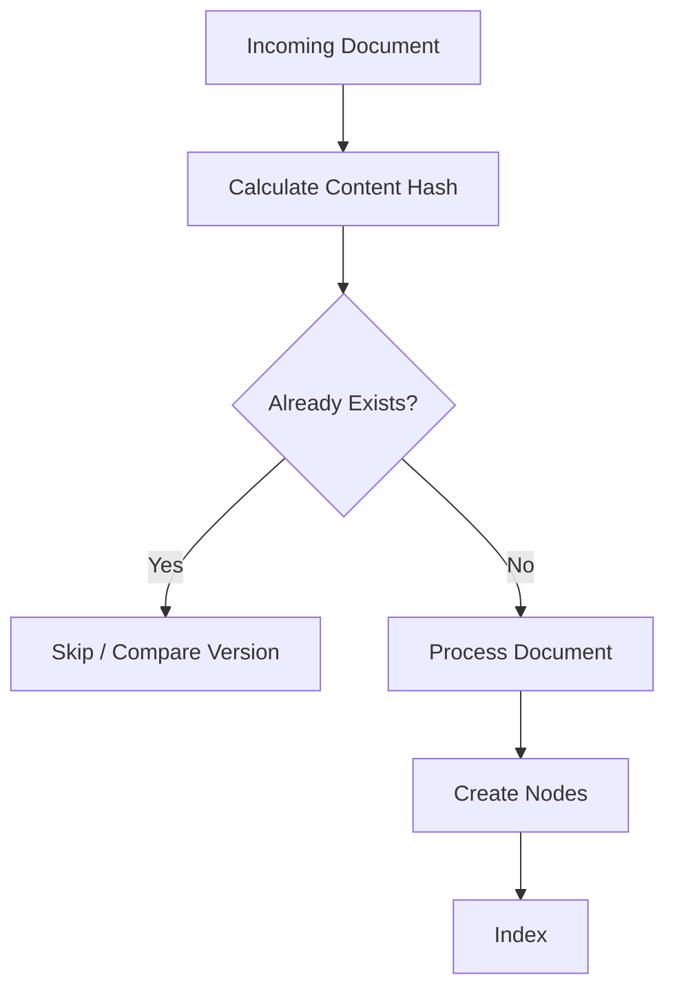

---

# 35. Incremental Ingestion

Reprocessing an entire repository after every change is expensive.

Bad pattern:

```text
10 Million Documents
       ↓
One Document Changed
       ↓
Re-index 10 Million Documents
```

Better:

```text
10 Million Documents
       ↓
Change Detection
       ↓
1 Changed Document
       ↓
Reprocess 1 Document
```

---

# 36. Incremental Ingestion Architecture

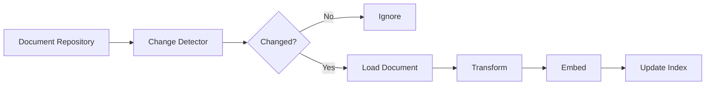

---

# 37. Change Detection

Possible mechanisms include:

```text
Last Modified Timestamp
ETag
Version ID
Content Hash
Event Notification
CDC
Source-System Events
```

Example:

```text
Document Version 5
        ↓
Changed
        ↓
Version 6
        ↓
Re-ingest
```

---

# 38. Document Updates

When a document changes:

```text
Old Document
     ↓
Detect Update
     ↓
Identify Old Nodes
     ↓
Remove / Replace Old Nodes
     ↓
Create New Nodes
     ↓
Embed
     ↓
Index
```

---

# 39. Update Architecture

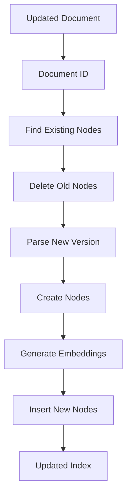

---

# 40. Document Deletion

Deletion is often overlooked.

If the source document disappears:

```text
Source Deleted
       ↓
Index Still Contains Old Nodes
       ↓
Retriever Finds Stale Information
```

Therefore:

```text
Delete Event
 ↓
Find Document ID
 ↓
Find Nodes
 ↓
Delete Nodes
```

---

# 41. Delete Architecture

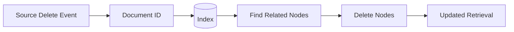

---

# 42. Versioning

Enterprise documents often have versions:

```text
Policy v1
Policy v2
Policy v3
```

The ingestion system should decide whether:

```text
Only Latest Version
```

or:

```text
All Historical Versions
```

should be searchable.

This is a business requirement, not merely a technical decision.

---

# 43. Latest-Version Retrieval

For many applications:

```text
Document
 ├── v1
 ├── v2
 └── v3 ← Current
```

retrieval should prefer:

```text
v3
```

Metadata can support this:

```python
{
    "document_id": "POLICY-001",
    "version": 3,
    "is_current": True
}
```

---

# 44. Historical Retrieval

Some applications require historical knowledge.

For example:

```text
"What was the policy in 2024?"
```

Then:

```text
Document
 ├── v1 → 2024
 ├── v2 → 2025
 └── v3 → 2026
```

must remain available.

Retrieval should then use:

```text
Document ID
+
Version / Effective Date
```

---

# 45. Effective Dates

Enterprise policies often use:

```text
effective_from
effective_to
```

Example:

```python
metadata = {
    "policy_id": "POL-001",
    "effective_from": "2026-01-01",
    "effective_to": None
}
```

This supports time-aware retrieval.

---

# 46. Ingestion Idempotency

An ingestion operation should ideally be idempotent.

If the same document is processed twice:

```text
Run 1
 ↓
Create Nodes

Run 2
 ↓
Same Document
```

the system should avoid unnecessary duplication.

A useful pattern is:

```text
Document ID
+
Version
+
Content Hash
```

to identify ingestion state.

---

# 47. Idempotent Ingestion

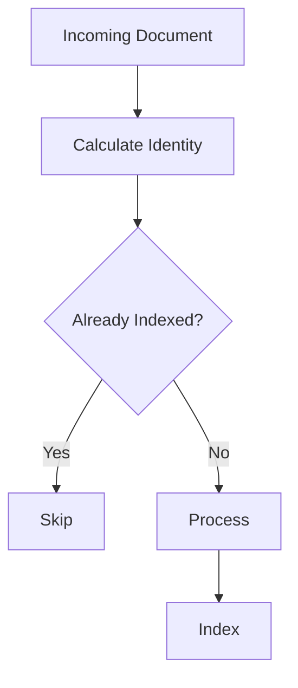

---

# 48. Ingestion Status Tracking

Production pipelines should track states such as:

```text
RECEIVED
PARSING
TRANSFORMING
EMBEDDING
INDEXING
COMPLETED
FAILED
```

Example:

```python
status = {
    "document_id": "DOC-1001",
    "status": "COMPLETED",
    "version": 4
}
```

This enables operational visibility.

---

# 49. Ingestion State Machine

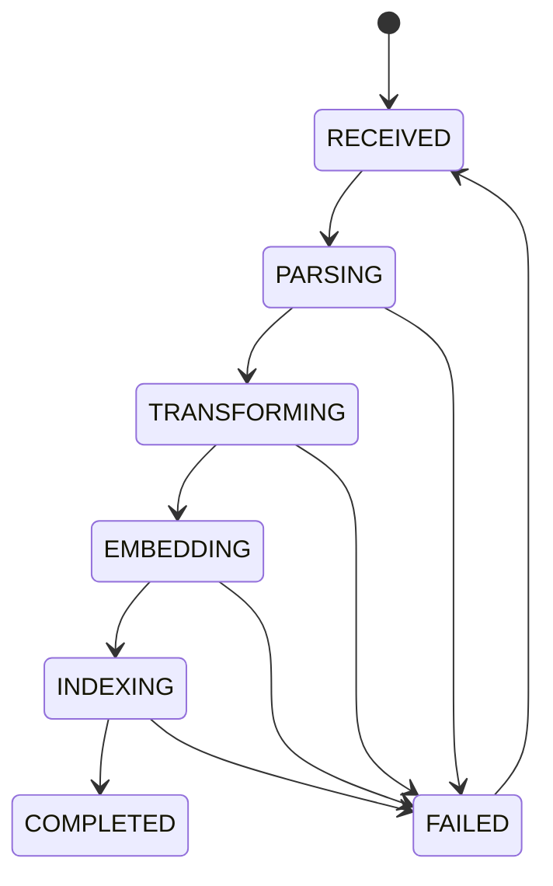

---

# 50. Error Handling

Failures may occur during:

```text
File Access
Parsing
Transformation
Embedding
Vector Store
Network
Provider API
```

A production pipeline should distinguish:

```text
Retryable Failure
```

from:

```text
Permanent Failure
```

---

# 51. Retry Strategy

Example:

```text
Embedding API
 ↓
Temporary Timeout
 ↓
Retry
 ↓
Success
```

But:

```text
Corrupt PDF
 ↓
Retry
 ↓
Same Failure
```

may require:

```text
Dead Letter Queue
+
Manual Investigation
```

---

# 52. Ingestion Retry Architecture

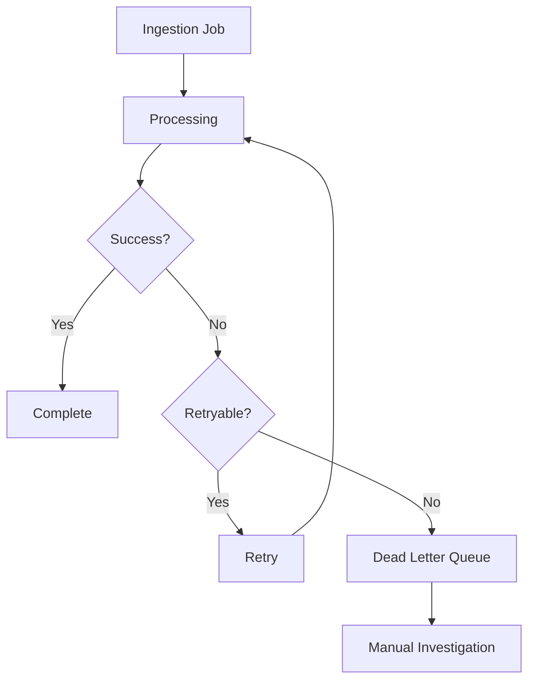

---

# 53. Batch Ingestion

For large datasets:

```text
Documents
 ↓
Batch
 ↓
Parallel Processing
 ↓
Embedding
 ↓
Index
```

Batching can improve:

```text
Throughput
Provider Utilization
Operational Efficiency
```

---

# 54. Parallel Ingestion

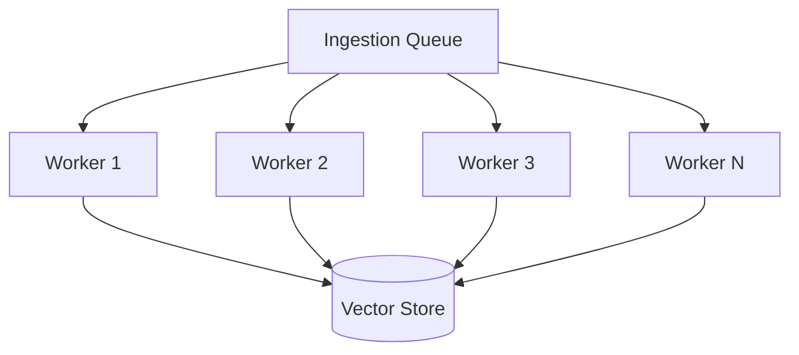

---

# 55. Backpressure

External systems may produce documents faster than the ingestion pipeline can process them.

Example:

```text
Source
 ↓
1000 docs/sec
```

while:

```text
Ingestion
 ↓
300 docs/sec
```

This creates backlog.

A queue-based architecture can provide:

```text
Buffering
Backpressure
Retry
Scaling
```

---

# 56. Event-Driven Ingestion

A production architecture can use events:

```text
Document Uploaded
       ↓
Object Storage Event
       ↓
Queue
       ↓
Ingestion Worker
       ↓
LlamaIndex
       ↓
Vector Store
```

---

# 57. Event-Driven Architecture

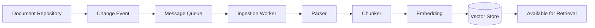

This is often more scalable than synchronous ingestion.

---

# 58. Ingestion and Query Separation

A production architecture should separate:

```text
Ingestion Path
```

from:

```text
Query Path
```

### Ingestion

```text
Documents
 ↓
Transform
 ↓
Index
```

### Query

```text
User
 ↓
Retrieve
 ↓
Generate
```

This prevents ingestion workloads from interfering with user-facing query latency.

---

# 59. Separate Architecture

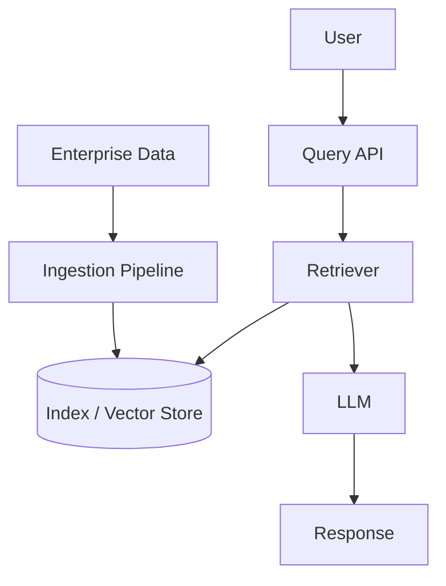

---

# 60. Multi-Tenant Ingestion

Enterprise AI systems may process data belonging to multiple tenants.

Example:

```text
Tenant A
 ├── Documents
 └── Policies

Tenant B
 ├── Documents
 └── Policies
```

Every document should carry tenant identity.

```python
metadata = {
    "tenant_id": "tenant-a",
    "document_id": "DOC-1001"
}
```

---

# 61. Tenant-Aware Ingestion

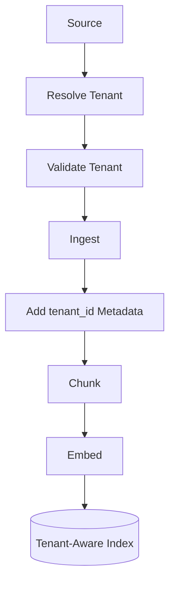

---

# 62. Tenant Isolation

Tenant isolation should exist beyond metadata where required.

Possible strategies include:

```text
Shared Index + Mandatory Filter
```

or:

```text
Tenant-Specific Namespace
```

or:

```text
Tenant-Specific Index
```

The appropriate choice depends on:

```text
Security
Scale
Cost
Compliance
Operational Requirements
```

---

# 63. Sensitive Data

Enterprise documents may contain:

```text
PII
Financial Data
Credentials
Confidential Information
Customer Data
Internal Architecture
```

Ingestion should consider:

```text
Classification
Redaction
Encryption
Access Control
Audit
Retention
```

---

# 64. Sensitive Data Pipeline

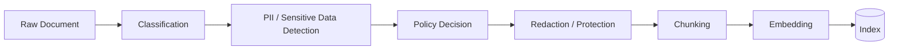

---

# 65. Access Control

A critical principle is:

```text
Authorization
must be preserved
through ingestion and retrieval.
```

Example:

```text
Document
 ↓
ACL Metadata
 ↓
Node
 ↓
Index
 ↓
Retriever Filter
```

---

# 66. Document ACL Metadata

Example:

```python
metadata = {
    "document_id": "DOC-1001",
    "tenant_id": "tenant-001",
    "classification": "confidential",
    "allowed_roles": [
        "finance-admin",
        "finance-manager"
    ]
}
```

This metadata can later participate in authorization-aware retrieval.

---

# 67. Data Lineage

Production ingestion should answer:

```text
Where did this node come from?

Which document?

Which version?

Which source?

When was it ingested?

Which parser?

Which embedding model?
```

Example:

```text
Node
 ↓
Document ID
 ↓
Source URI
 ↓
Version
 ↓
Ingestion Timestamp
 ↓
Embedding Model
```

---

# 68. Lineage Architecture


---

# 69. Ingestion Observability

Useful metrics include:

```text
Documents Processed
Documents Failed
Documents Skipped
Nodes Created
Nodes Deleted
Embedding Requests
Embedding Failures
Processing Latency
Queue Depth
Indexing Latency
```

---

# 70. Ingestion Metrics

Example:

```text
documents_processed = 10,250
documents_failed    = 13
nodes_created       = 1,250,000
embedding_failures  = 21
average_latency     = 2.4 sec
```

These metrics help identify pipeline degradation.

---

# 71. Data Freshness Monitoring

Track:

```text
Source Updated At
```

versus:

```text
Indexed At
```

Example:

```text
Source Update:
10:00

Index Update:
10:04

Freshness Lag:
4 minutes
```

This provides a measurable SLA.

---

# 72. Freshness SLA

Example:

```text
Requirement:

Enterprise policies must be searchable
within 15 minutes of publication.
```

Then:

```text
Freshness Lag <= 15 minutes
```

becomes an operational metric.

---

# 73. Ingestion Cost

Cost components include:

```text
Parsing
+
Compute
+
Embedding API
+
Storage
+
Network
+
Observability
```

For large repositories:

```text
10M Documents
×
Average Chunks
×
Embedding Cost
```

can become significant.

---

# 74. Cost Optimization

Potential strategies:

```text
Incremental Ingestion
+
Deduplication
+
Batch Embeddings
+
Caching
+
Change Detection
+
Selective Reprocessing
```

---

# 75. Embedding Cache

If the same content is processed repeatedly:

```text
Document
 ↓
Content Hash
 ↓
Embedding Cache
```

If the embedding already exists:

```text
Cache Hit
 ↓
Reuse Embedding
```

instead of calling the embedding provider again.

---

# 76. Ingestion Cache Architecture

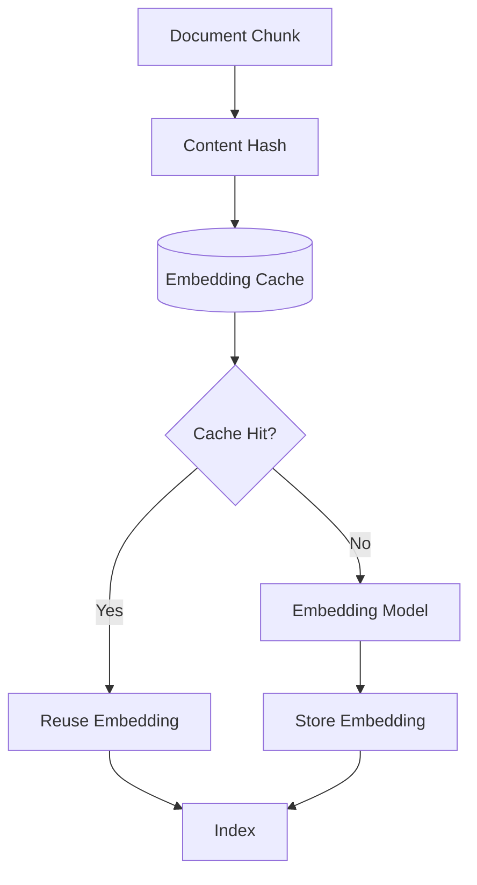

---

# 77. Reprocessing Strategy

Not every change requires complete reprocessing.

Consider:

```text
Metadata Changed
```

versus:

```text
Content Changed
```

If only metadata changed:

```text
Update Metadata
```

If content changed:

```text
Reparse
+
Rechunk
+
Re-embed
```

This distinction can significantly reduce cost.

---

# 78. Smart Reprocessing

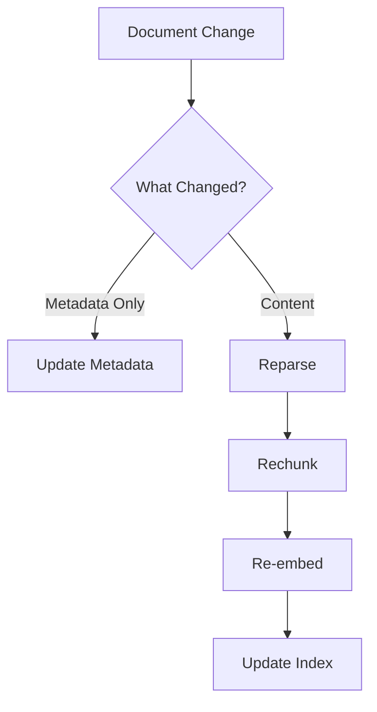

---

# 79. Large Document Handling

Large files may require:

```text
Streaming
Pagination
Section-Based Processing
Batch Processing
Parallel Workers
```

Avoid loading unnecessarily large datasets entirely into memory.

---

# 80. Large-Scale Ingestion Architecture

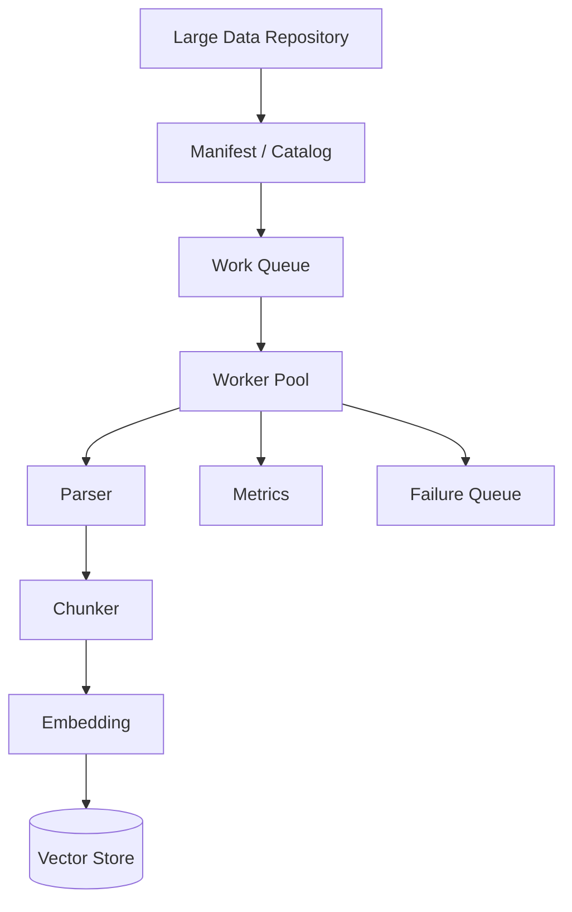

---

# 81. Ingestion Pipeline as a Production Service

For enterprise systems, ingestion can be implemented as a dedicated service.

```text
Document Ingestion Service

Responsibilities:
 ├── Source Connectors
 ├── Parsing
 ├── Cleaning
 ├── Chunking
 ├── Metadata
 ├── Embedding
 ├── Indexing
 ├── Versioning
 ├── Error Handling
 └── Observability
```

This keeps ingestion concerns separate from the query API.

---

# 82. Example Service Architecture

```mermaid
flowchart TB

    A[Source Systems] --> B[Ingestion API / Events]

    B --> C[Ingestion Service]

    C --> D[Parser]

    C --> E[Transformer]

    C --> F[Metadata Service]

    C --> G[Embedding Service]

    C --> H[Index Service]

    H --> I[(Vector Store)]

    C --> J[(Ingestion Metadata DB)]

    C --> K[Observability]
```

---

# 83. Sample Ingestion Pipeline

A simplified LlamaIndex implementation can look like:

```python
from llama_index.core import (
    SimpleDirectoryReader,
    VectorStoreIndex
)
from llama_index.core.node_parser import SentenceSplitter

# 1. Load documents
documents = SimpleDirectoryReader(
    "data"
).load_data()

# 2. Configure chunking
parser = SentenceSplitter(
    chunk_size=512,
    chunk_overlap=50
)

# 3. Convert documents into nodes
nodes = parser.get_nodes_from_documents(
    documents
)

# 4. Build index
index = VectorStoreIndex(
    nodes
)

print(f"Documents: {len(documents)}")
print(f"Nodes: {len(nodes)}")
```

This demonstrates the basic flow:

```text
Load
 ↓
Parse / Chunk
 ↓
Nodes
 ↓
Index
```

---

# 84. Adding Metadata

A production-oriented example:

```python
from llama_index.core import Document

document = Document(
    text="Enterprise security policy...",
    metadata={
        "document_id": "SEC-001",
        "tenant_id": "tenant-001",
        "department": "security",
        "document_type": "policy",
        "version": "4",
        "classification": "internal"
    }
)
```

The metadata becomes part of the document's retrieval context and lineage.

---

# 85. Custom Ingestion Pipeline

Conceptually:

```python
from llama_index.core.ingestion import IngestionPipeline
from llama_index.core.node_parser import SentenceSplitter

pipeline = IngestionPipeline(
    transformations=[
        SentenceSplitter(
            chunk_size=512,
            chunk_overlap=50
        )
    ]
)

nodes = pipeline.run(
    documents=documents
)
```

Additional transformations can be added according to the application's requirements.

---

# 86. Ingestion Pipeline Mental Model

```text
Documents
    │
    ▼
┌──────────────┐
│ Transformation│
└──────┬───────┘
       │
       ▼
┌──────────────┐
│   Chunking   │
└──────┬───────┘
       │
       ▼
┌──────────────┐
│   Metadata   │
└──────┬───────┘
       │
       ▼
┌──────────────┐
│  Embeddings  │
└──────┬───────┘
       │
       ▼
    Index
```

---

# 87. Production Ingestion Pipeline

```text
Source
 ↓
Event
 ↓
Queue
 ↓
Worker
 ↓
Load
 ↓
Parse
 ↓
Clean
 ↓
Validate
 ↓
Deduplicate
 ↓
Chunk
 ↓
Enrich Metadata
 ↓
Embed
 ↓
Index
 ↓
Record Status
 ↓
Emit Metrics
```

---

# 88. Production Architecture

```mermaid
flowchart TB

    A[Enterprise Sources] --> B[Change Events]

    B --> C[Message Queue]

    C --> D[Ingestion Workers]

    D --> E[Load]

    E --> F[Parse]

    F --> G[Clean]

    G --> H[Validate]

    H --> I[Deduplicate]

    I --> J[Chunk]

    J --> K[Metadata Enrichment]

    K --> L[Embedding]

    L --> M[(Vector Store)]

    D --> N[(Ingestion Metadata DB)]

    D --> O[Metrics / Tracing]

    D --> P[Dead Letter Queue]
```

---

# 89. Common Ingestion Failure Patterns

## Failure 1 — Poor Parsing

```text
PDF
 ↓
Incorrect Text Extraction
 ↓
Bad Nodes
 ↓
Bad Retrieval
```

---

## Failure 2 — Poor Chunking

```text
Semantic Boundary Lost
 ↓
Incomplete Context
 ↓
Poor Answer
```

---

## Failure 3 — Missing Metadata

```text
No Tenant Metadata
 ↓
Weak Filtering
 ↓
Potential Data Leakage
```

---

## Failure 4 — Stale Index

```text
Source Updated
 ↓
Index Not Updated
 ↓
Outdated Answer
```

---

## Failure 5 — Duplicate Ingestion

```text
Same Document
 ↓
Multiple Ingestion Runs
 ↓
Duplicate Nodes
 ↓
Duplicate Retrieval
```

---

## Failure 6 — Missing Delete Handling

```text
Source Deleted
 ↓
Index Still Contains Data
 ↓
Stale Information Retrieved
```

---

## Failure 7 — No Retry Strategy

```text
Temporary Provider Failure
 ↓
Job Failure
 ↓
Document Never Indexed
```

---

# 90. Ingestion Design Checklist

## Source

- [ ] Source systems identified
- [ ] Connector selected
- [ ] Source authentication configured
- [ ] Change detection defined

## Parsing

- [ ] File format supported
- [ ] Parsing strategy defined
- [ ] OCR requirements identified
- [ ] Tables handled
- [ ] Document hierarchy preserved

## Transformation

- [ ] Cleaning strategy defined
- [ ] Chunking strategy defined
- [ ] Chunk size evaluated
- [ ] Chunk overlap evaluated
- [ ] Metadata enrichment defined

## Indexing

- [ ] Embedding model selected
- [ ] Vector store selected
- [ ] Index strategy defined
- [ ] Persistence configured

## Lifecycle

- [ ] Create
- [ ] Update
- [ ] Delete
- [ ] Versioning
- [ ] Deduplication
- [ ] Idempotency

## Security

- [ ] Tenant ID
- [ ] Access-control metadata
- [ ] Classification
- [ ] Sensitive-data handling
- [ ] Encryption
- [ ] Audit

## Operations

- [ ] Metrics
- [ ] Logging
- [ ] Tracing
- [ ] Retry
- [ ] Dead-letter handling
- [ ] Freshness monitoring
- [ ] Cost monitoring

---

# 91. Key Takeaways

- Data ingestion is the foundation of production RAG systems.
- LlamaIndex provides abstractions for connecting external data to LLM applications.
- Documents represent source information.
- Nodes provide smaller retrieval-oriented units.
- Parsing and chunking are separate concerns.
- Chunking strategy should depend on document structure.
- Metadata is critical for filtering, security, lineage, and retrieval.
- Every node should ideally be traceable to its source.
- Stable document and node identifiers simplify lifecycle management.
- Deduplication prevents duplicate retrieval and unnecessary cost.
- Incremental ingestion is essential for large repositories.
- Updates require careful replacement of old nodes.
- Deletes must propagate to indexes.
- Versioning should reflect business requirements.
- Ingestion should be idempotent.
- Production ingestion should distinguish retryable and permanent failures.
- Queue-based architectures improve scalability and resilience.
- Ingestion and query paths should generally be separated.
- Multi-tenant systems require explicit tenant-aware ingestion.
- Sensitive enterprise data requires classification and protection.
- Data lineage improves auditability and troubleshooting.
- Freshness lag should be measurable.
- Embedding caching can reduce ingestion cost.
- Metadata-only changes should not necessarily trigger full re-embedding.
- Large-scale ingestion should use batching and parallel workers.
- Ingestion should be treated as a production data pipeline, not merely a script.

---

# 📝 Quick Revision Notes

## Basic Ingestion

```text
Source
 ↓
Connector
 ↓
Document
 ↓
Chunking
 ↓
Nodes
 ↓
Embedding
 ↓
Index
```

---

## Production Ingestion

```text
Source
 ↓
Change Detection
 ↓
Queue
 ↓
Worker
 ↓
Parse
 ↓
Clean
 ↓
Validate
 ↓
Deduplicate
 ↓
Chunk
 ↓
Metadata
 ↓
Embed
 ↓
Index
 ↓
Observe
```

---

## Document Lifecycle

```text
CREATE
  ↓
INDEX
  ↓
UPDATE
  ↓
REINDEX
  ↓
DELETE
  ↓
REMOVE FROM INDEX
```

---

## Important Metadata

```text
document_id
tenant_id
source_uri
document_type
version
created_at
updated_at
classification
effective_from
effective_to
```

---

## Ingestion Quality

```text
Parsing
+
Chunking
+
Metadata
+
Embeddings
+
Freshness
+
Lifecycle Management
=
High-Quality RAG Foundation
```

---

# ❓ Interview Questions

## Beginner

1. What is data ingestion in a RAG system?
2. What is a LlamaIndex Document?
3. What is a Node?
4. What is the difference between parsing and chunking?
5. Why is metadata important?
6. What is a data connector?
7. What is chunk overlap?
8. Why is document ingestion important for RAG?

## Intermediate

9. How would you design a document ingestion pipeline?
10. How do you choose chunk size?
11. When would you use chunk overlap?
12. How would you handle PDF documents?
13. How would you handle document updates?
14. How would you handle document deletions?
15. What is incremental ingestion?
16. How would you implement deduplication?
17. What is ingestion idempotency?
18. How would you track document versions?
19. How would you measure data freshness?
20. How would you handle ingestion failures?

## Advanced

21. Design an enterprise-scale LlamaIndex ingestion architecture.
22. How would you implement event-driven ingestion?
23. How would you process millions of documents?
24. How would you design tenant-aware ingestion?
25. How would you enforce document-level authorization?
26. How would you design ingestion lineage?
27. How would you minimize embedding costs?
28. How would you distinguish metadata-only changes from content changes?
29. How would you design an ingestion dead-letter strategy?
30. How would you prevent duplicate nodes during repeated ingestion?
31. How would you design an ingestion SLA?
32. How would you preserve historical document versions?
33. How would you design a scalable ingestion worker architecture?
34. How would you handle corrupted documents?
35. How would you design ingestion for highly sensitive enterprise data?

---

# 🛠️ Practical Exercise

Build a production-style document ingestion pipeline using LlamaIndex.

## Step 1 — Data Sources

Create:

```text
data/
 ├── policies/
 ├── technical/
 ├── security/
 └── architecture/
```

Add:

```text
PDF
Markdown
TXT
CSV
```

---

## Step 2 — Metadata

Every document should contain:

```text
document_id
tenant_id
source
document_type
department
version
classification
created_at
updated_at
```

---

## Step 3 — Ingestion

Implement:

```text
Load
 ↓
Parse
 ↓
Clean
 ↓
Chunk
 ↓
Metadata
 ↓
Embed
 ↓
Index
```

---

## Step 4 — Lifecycle

Implement:

```text
Create
Update
Delete
Duplicate Detection
Versioning
```

---

## Step 5 — Observability

Track:

```text
Documents Processed
Documents Failed
Nodes Created
Nodes Deleted
Processing Time
Embedding Cost
Freshness Lag
```

---

## Step 6 — Production Architecture

```mermaid
flowchart TB

    A[Document Repository] --> B[Change Detection]

    B --> C[Queue]

    C --> D[Ingestion Worker]

    D --> E[LlamaIndex]

    E --> F[Parser]

    F --> G[Chunker]

    G --> H[Metadata]

    H --> I[Embedding]

    I --> J[(Vector Store)]

    D --> K[(Document Metadata DB)]

    D --> L[Observability]

    D --> M[Dead Letter Queue]

    J --> N[RAG Query Layer]
```

---

# 🏢 Enterprise Design Challenge

Design an ingestion platform for:

```text
10 Million Documents
500 Tenants
Multiple Data Sources
Continuous Updates
Strict Access Control
15-Minute Freshness SLA
```

The platform should support:

```text
PDF
DOCX
Markdown
HTML
CSV
Database Records
Cloud Storage
```

Required capabilities:

```text
Incremental Ingestion
Deduplication
Versioning
Deletion
Tenant Isolation
Metadata Filtering
Retry
Dead-Letter Handling
Observability
Cost Optimization
```

---

# 🧠 Architecture Challenge

Design the following:

```text
                 Enterprise Data
                       │
       ┌───────────────┼────────────────┐
       ▼               ▼                ▼
   Documents       Databases        Cloud Storage
       │               │                │
       └───────────────┼────────────────┘
                       ▼
                Change Detection
                       ↓
                     Queue
                       ↓
                Worker Cluster
                       ↓
                  LlamaIndex
                       ↓
        ┌──────────────┼───────────────┐
        ▼              ▼               ▼
      Parser        Chunker        Metadata
        │              │               │
        └──────────────┼───────────────┘
                       ▼
                   Embedding
                       ↓
                Vector Storage
                       ↓
                 RAG Retrieval
```

The architecture should support:

```text
Scale
Security
Freshness
Reliability
Observability
Cost Control
```

---

# 📚 References & Further Reading

Recommended areas for further study:

- LlamaIndex Data Connectors
- LlamaIndex Documents
- LlamaIndex Nodes
- LlamaIndex Node Parsers
- LlamaIndex Transformations
- LlamaIndex Ingestion Pipelines
- LlamaIndex Vector Stores
- LlamaIndex Metadata Filtering
- LlamaIndex Storage
- LlamaIndex Workflows
- LlamaIndex Evaluation
- Enterprise RAG ingestion architecture
- Document processing pipelines
- Vector database ingestion
- Event-driven data pipelines

> LlamaIndex evolves rapidly. Before implementing production systems, verify the current APIs, package structure, readers/loaders, node parsers, ingestion pipeline APIs, metadata behavior, and vector-store integrations against the official documentation for the version used by your project.

---

## 🧭 Chapter Navigation

⬅️ **Previous:** [09. LlamaIndex Fundamentals](09-llamaindex-fundamentals.md)

📚 **Part VIII Index:** [AI Engineering Frameworks & Tooling](index.md)

➡️ **Next:** [11. LlamaIndex Index And Retrieval](11-llamaindex-indexes-and-retrieval.md)

---

> **Enterprise AI Engineering Handbook**
>
> *Building Production-Grade Enterprise AI Systems — One Chapter at a Time.*