# 11 — LlamaIndex Indexes and Retrieval

> Understand how LlamaIndex organizes enterprise data for efficient retrieval, how different index strategies work, how retrievers operate, and how to design production-grade retrieval architectures for RAG applications.

---

## 📖 Overview

Indexing is one of the most important stages in a LlamaIndex-powered RAG system.

The ingestion pipeline prepares the data:

```text
Source
 ↓
Document
 ↓
Nodes
 ↓
Metadata
```

Indexing transforms those nodes into structures that can efficiently support retrieval:

```text
Nodes
 ↓
Index
 ↓
Retriever
 ↓
Relevant Context
 ↓
LLM
```

A simplified LlamaIndex architecture is:

```text
                 Enterprise Data
                       ↓
                  Documents
                       ↓
                     Nodes
                       ↓
                     Index
                       ↓
                  Retriever
                       ↓
                Relevant Nodes
                       ↓
              Query / Response Layer
                       ↓
                      LLM
```

The choice of index and retrieval strategy directly influences:

```text
Retrieval Quality
Latency
Scalability
Cost
Freshness
Filtering
Security
```

---

# 🎯 Learning Objectives

After completing this chapter, you will be able to:

- Understand what an index represents in LlamaIndex
- Understand the relationship between nodes and indexes
- Understand VectorStoreIndex
- Understand SummaryIndex
- Understand Tree-based indexing concepts
- Understand keyword-oriented indexing concepts
- Understand property/graph-oriented indexing at a high level
- Understand retrievers
- Understand similarity-based retrieval
- Understand Top-K retrieval
- Understand metadata filtering
- Understand hybrid retrieval concepts
- Understand retrieval configuration
- Design retrieval pipelines for enterprise RAG
- Understand retrieval failure patterns
- Tune retrieval quality
- Design scalable indexing architectures
- Separate indexing from query execution
- Select an appropriate index and retrieval strategy

---

# 1. What Is an Index?

An index is a data structure that organizes information so that relevant content can be found efficiently.

In a RAG system:

```text
Documents
 ↓
Nodes
 ↓
Index
 ↓
Retriever
 ↓
Relevant Nodes
```

Instead of searching every piece of content manually, the index provides a mechanism for finding relevant information.

---

# 2. Indexing vs Retrieval

These are different stages.

### Indexing

```text
Documents
 ↓
Nodes
 ↓
Representations
 ↓
Index
```

### Retrieval

```text
Query
 ↓
Retriever
 ↓
Index
 ↓
Relevant Nodes
```

Therefore:

```text
Index
=
Prepared Search Structure

Retriever
=
Mechanism That Queries That Structure
```

---

# 3. Indexing Architecture

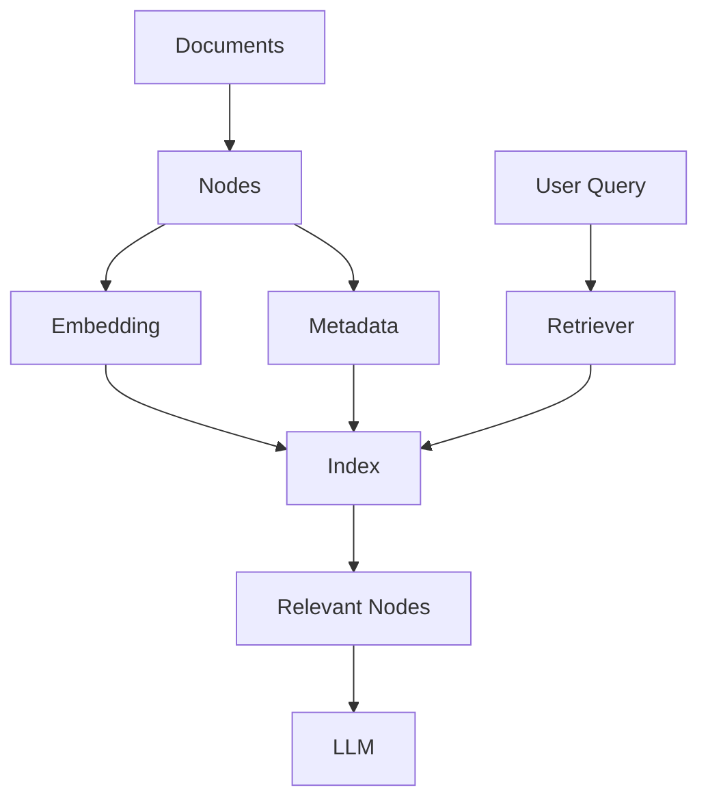

---

# 4. Why Indexing Matters

Imagine an enterprise repository containing:

```text
10 Million Documents
100 Million Nodes
```

A query such as:

```text
"What is our password rotation policy?"
```

cannot efficiently scan every node in the same way a small in-memory application might.

An appropriate index allows the system to narrow the search space.

---

# 5. Index Types

LlamaIndex supports multiple indexing approaches for different application requirements.

Common conceptual categories include:

```text
Vector Index
Summary Index
Tree-Based Index
Keyword-Oriented Index
Graph / Property Graph Index
```

The most important distinction is:

```text
Different Index
        ↓
Different Representation
        ↓
Different Retrieval Strategy
```

---

# 6. VectorStoreIndex

For modern RAG systems, `VectorStoreIndex` is one of the most important LlamaIndex index types.

Conceptually:

```text
Node
 ↓
Embedding
 ↓
Vector
 ↓
Vector Store
```

At query time:

```text
Query
 ↓
Query Embedding
 ↓
Similarity Search
 ↓
Top-K Nodes
```

---

# 7. Vector Index Architecture

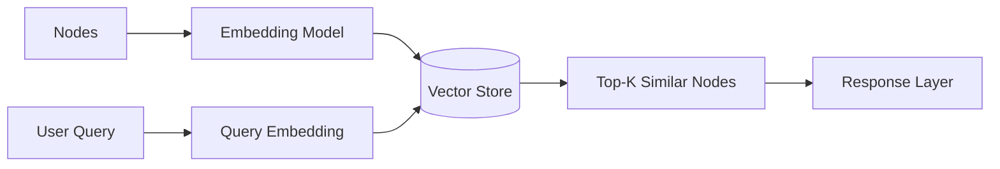

---

# 8. Creating a VectorStoreIndex

A simple example:

```python
from llama_index.core import (
    SimpleDirectoryReader,
    VectorStoreIndex
)

documents = SimpleDirectoryReader(
    "data"
).load_data()

index = VectorStoreIndex.from_documents(
    documents
)
```

Conceptually:

```text
Documents
 ↓
Nodes
 ↓
Embeddings
 ↓
VectorStoreIndex
```

In production, the underlying vector store and embedding model should be explicitly selected according to application requirements.

---

# 9. Similarity Search

Suppose the query is:

```text
"What is the employee leave policy?"
```

The system converts the query into an embedding:

```text
Query
 ↓
Embedding
 ↓
[0.12, -0.45, 0.81, ...]
```

It then compares that representation with indexed node vectors.

Conceptually:

```text
Query Vector
      ↓
Similarity Search
      ↓
Node 23
Node 104
Node 782
Node 901
```

---

# 10. Similarity

A vector database may use a similarity or distance function such as:

```text
Cosine Similarity
Euclidean Distance
Dot Product
```

The exact choice depends on the embedding model and vector-store configuration.

Conceptually:

```text
Query
 ↓
Similarity Function
 ↓
Ranked Nodes
```

---

# 11. Top-K Retrieval

A retriever commonly returns the top K candidates.

Example:

```python
retriever = index.as_retriever(
    similarity_top_k=5
)
```

Conceptually:

```text
Query
 ↓
Similarity Search
 ↓
Top 5 Nodes
```

---

# 12. Top-K Trade-off

Small K:

```text
Less Context
+
Lower Cost
+
Lower Latency
```

but:

```text
Potentially Missing Relevant Information
```

Large K:

```text
More Recall
```

but:

```text
More Noise
+
More Tokens
+
Higher Cost
+
Higher Latency
```

Therefore:

```text
Optimal K
=
Application-Specific
```

---

# 13. Retrieval Precision vs Recall

Retrieval quality can be understood through:

```text
Precision
=
How much retrieved content is relevant?

Recall
=
How much relevant content was retrieved?
```

Example:

```text
Relevant Nodes:
A B C D E

Retrieved:
A B C X Y
```

Precision is affected by:

```text
A B C
```

while recall is affected by:

```text
A B C
```

versus:

```text
A B C D E
```

---

# 14. Retrieval Trade-off

```text
High Precision
      ↓
Less Noise
      ↓
Potentially Lower Recall

High Recall
      ↓
More Candidate Context
      ↓
Potentially More Noise
```

Production RAG systems often use multiple retrieval stages to balance the two.

---

# 15. Similarity Threshold

A retrieval system may also use a similarity threshold.

Conceptually:

```text
Query
 ↓
Similarity Search
 ↓
Filter Low-Score Results
 ↓
Relevant Nodes
```

For example:

```text
Node A → 0.91
Node B → 0.87
Node C → 0.84
Node D → 0.42
```

A threshold could eliminate Node D.

The exact threshold must be calibrated against the embedding model and evaluation dataset.

---

# 16. Metadata Filtering

Vector similarity alone may not be sufficient.

Consider:

```text
Tenant = tenant-001
Department = Finance
Document Type = Policy
```

Retrieval becomes:

```text
Query
+
Metadata Filters
+
Vector Similarity
```

---

# 17. Metadata-Aware Retrieval

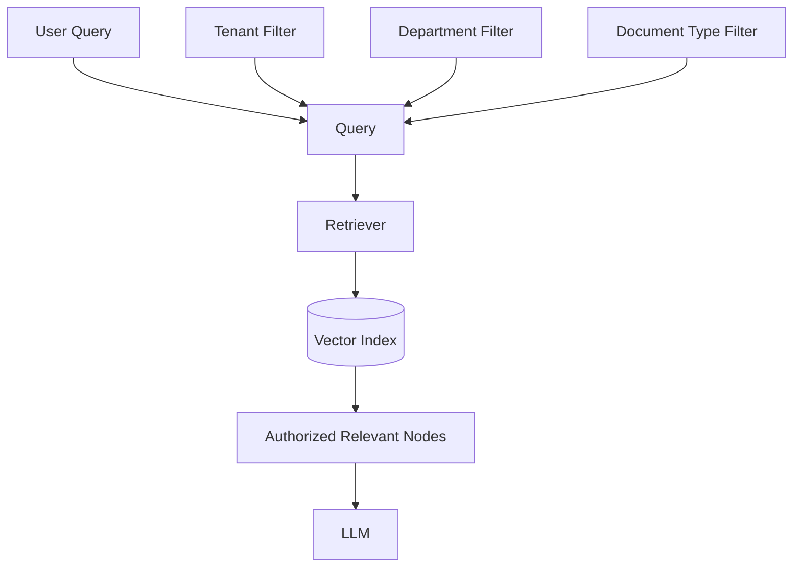

---

# 18. Why Filtering Matters

Without filtering:

```text
Query
 ↓
All Tenant Documents
 ↓
Potentially Incorrect Context
```

With filtering:

```text
Query
+
tenant_id
+
authorization constraints
 ↓
Relevant Authorized Context
```

This improves both:

```text
Retrieval Quality
Security
```

---

# 19. Filtering Is Not Authorization

An important enterprise principle:

```text
Metadata Filter
≠
Complete Authorization System
```

The application should establish:

```text
User Identity
 ↓
Permissions
 ↓
Allowed Data Scope
 ↓
Retrieval Filter
```

Never allow the model to decide whether a user is authorized to access data.

---

# 20. Query-Time Filtering

Example concept:

```python
filters = {
    "tenant_id": "tenant-001",
    "department": "finance"
}
```

The retriever can then restrict the search space.

The exact metadata-filter API depends on the selected LlamaIndex version and vector-store integration.

---

# 21. Multiple Index Strategies

Not every dataset is best represented as a pure vector index.

Consider:

```text
Documents
        ↓
 ┌──────┼──────────┐
 ▼      ▼          ▼
Vector  Summary   Graph
Index   Index     Index
```

Different retrieval problems may require different structures.

---

# 22. SummaryIndex

A summary-oriented index is useful when the application needs to reason over a collection of documents rather than simply retrieve the nearest chunks.

Conceptually:

```text
Documents
 ↓
Nodes
 ↓
Summary Structure
 ↓
Query
 ↓
Synthesis
```

This can be useful for:

```text
Document Summarization
Collection Summaries
Long-Form Analysis
```

---

# 23. Summary Index Architecture

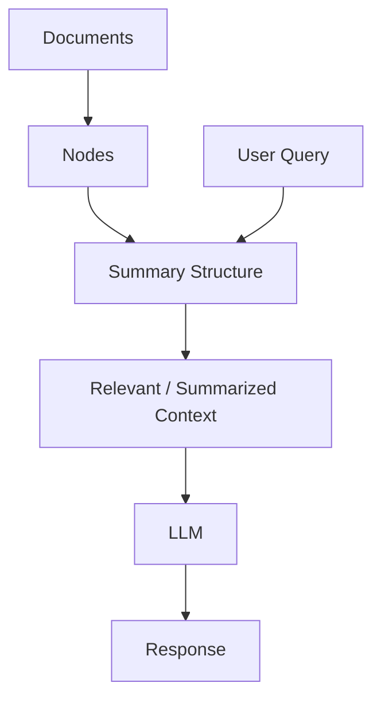

---

# 24. Summary Retrieval Trade-off

A summary-oriented approach can provide:

```text
Broader Context
```

but may require:

```text
More Processing
More LLM Calls
More Latency
```

depending on the implementation and synthesis strategy.

It is therefore different from:

```text
Fast Top-K Vector Retrieval
```

---

# 25. Tree-Based Indexing

A tree-based approach organizes information hierarchically.

Conceptually:

```text
                 Root
              /        \
          Summary A   Summary B
          /    \       /    \
        N1     N2     N3     N4
```

The hierarchy can help when information needs to be summarized progressively.

---

# 26. Tree Retrieval Architecture

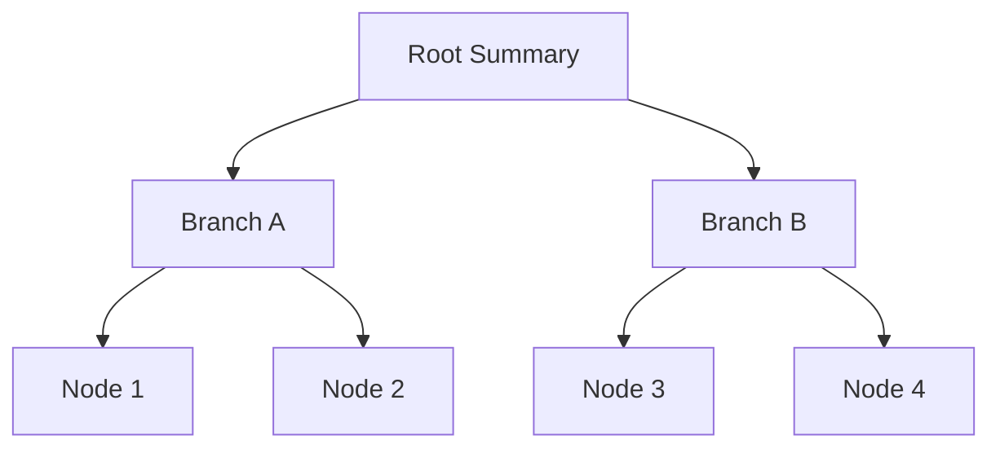

The exact implementation details should be selected based on the current LlamaIndex APIs and use case.

---

# 27. Keyword-Oriented Indexing

Keyword-oriented approaches are useful when exact terms matter.

Example:

```text
Query:
"PCI DSS"

Keyword:
PCI DSS
```

This may be more useful than semantic similarity when exact terminology is important.

---

# 28. Keyword vs Semantic Retrieval

### Semantic

```text
"How do we protect payment information?"
```

may retrieve:

```text
Payment Security Policy
```

even if the exact words differ.

### Keyword

```text
"PCI DSS"
```

can directly match:

```text
PCI DSS
```

Both approaches have strengths.

---

# 29. Keyword Retrieval Architecture


---

# 30. Hybrid Retrieval

Production RAG systems often combine:

```text
Keyword Retrieval
+
Vector Retrieval
```

Example:

```text
User Query
    │
    ├───────────────┐
    ▼               ▼
Keyword Search   Vector Search
    │               │
    ▼               ▼
Keyword Results   Semantic Results
    └───────┬───────┘
            ▼
        Merge / Rank
            ▼
        Final Context
```

---

# 31. Hybrid Retrieval Architecture

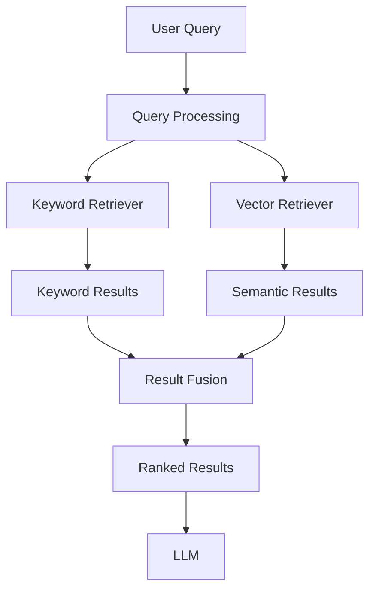

Hybrid retrieval can improve recall when exact terminology and semantic meaning both matter.

---

# 32. Retrieval Fusion

Suppose:

```text
Keyword Results:
A B C

Vector Results:
B C D
```

A fusion strategy can produce:

```text
B
C
A
D
```

based on a ranking mechanism.

Advanced ranking and re-ranking techniques will be covered in later retrieval chapters.

---

# 33. Property Graph / Graph-Oriented Indexing

Some enterprise knowledge is naturally relational.

Example:

```text
Customer
 ↓ owns
Account
 ↓ used_for
Transaction
 ↓ belongs_to
Product
```

A graph-oriented representation can preserve these relationships.

---

# 34. Graph Retrieval Architecture

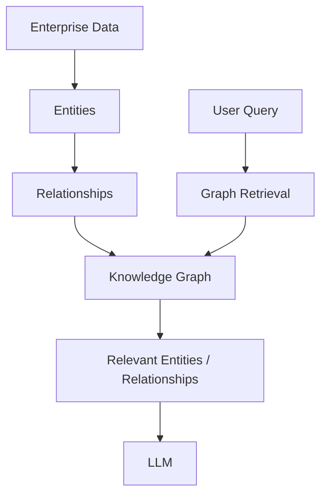

This is useful when the question depends on relationships rather than only text similarity.

---

# 35. Vector vs Graph Retrieval

### Vector Retrieval

Best suited for:

```text
Semantic Similarity
Documents
Paragraphs
Policies
Knowledge Articles
```

### Graph Retrieval

Useful for:

```text
Relationships
Entities
Dependencies
Networks
Multi-Hop Connections
```

Many enterprise systems may use both.

---

# 36. Multi-Index Architecture

A sophisticated enterprise knowledge system may maintain:

```text
Vector Index
+
Keyword Index
+
Graph Index
```

Architecture:

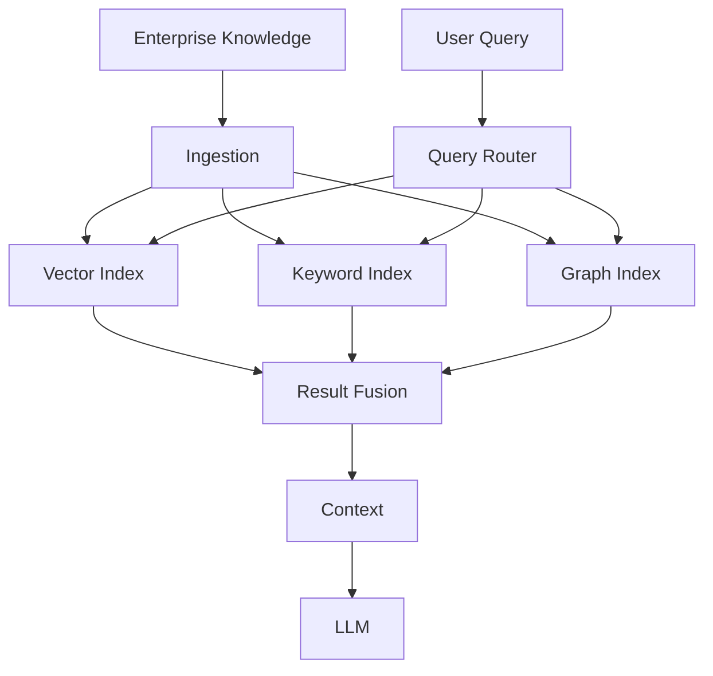

---

# 37. Query Routing

Different questions may require different retrieval strategies.

Example:

```text
Question:
"What does our security policy say?"
```

→ Vector retrieval

```text
Question:
"What is the PCI DSS requirement?"
```

→ Keyword + vector

```text
Question:
"Which services depend on Service A?"
```

→ Graph retrieval

---

# 38. Query Router

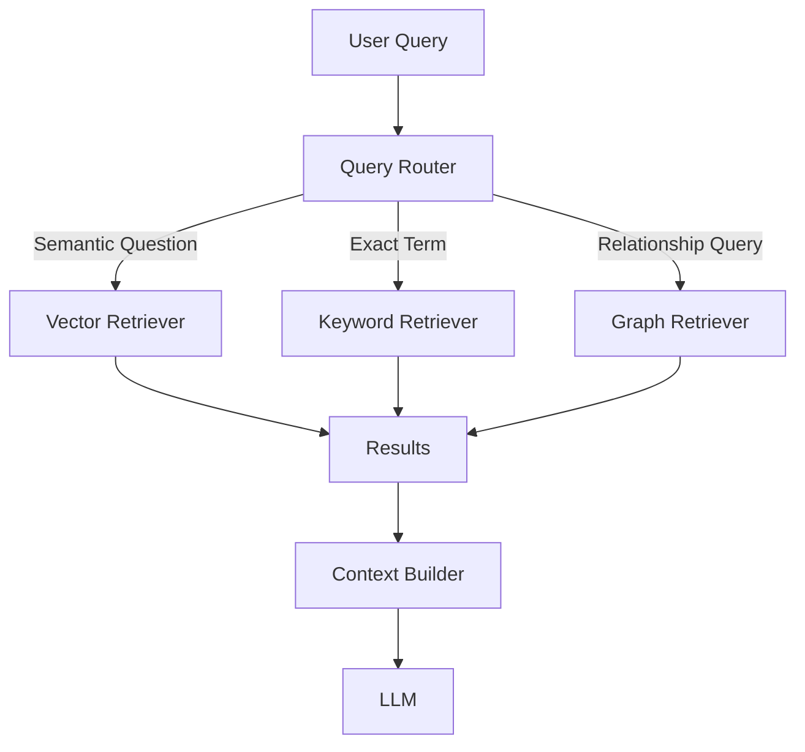

---

# 39. Retriever

An index stores or organizes information.

A retriever determines:

```text
How to search it
```

Conceptually:

```text
Index
 ↓
Retriever
 ↓
Results
```

The retriever can encapsulate:

```text
Top-K
Similarity
Filters
Routing
Post-Processing
```

---

# 40. Basic Retriever

Example:

```python
retriever = index.as_retriever(
    similarity_top_k=5
)

nodes = retriever.retrieve(
    "What is the security policy?"
)

for node in nodes:
    print(node.text)
```

The exact retriever interface may vary with the index and LlamaIndex version.

---

# 41. Retriever Configuration

Important parameters may include:

```text
Top-K
Similarity Threshold
Metadata Filters
Query Transformations
Vector Store Parameters
Post-Processing
```

The correct configuration should be determined through evaluation rather than guesswork.

---

# 42. Retrieval Pipeline

```text
User Query
    ↓
Query Processing
    ↓
Retriever
    ↓
Candidate Retrieval
    ↓
Filtering
    ↓
Ranking
    ↓
Context Selection
    ↓
LLM
```

---

# 43. Candidate Retrieval

A common architecture is:

```text
Retrieve More
      ↓
Rank Better
      ↓
Send Less to LLM
```

Example:

```text
Retrieve 50 candidates
        ↓
Filter / Rank
        ↓
Select 5
        ↓
LLM
```

This can improve recall while controlling context size.

---

# 44. Retrieval Post-Processing

Retrieved nodes can be processed before being sent to the LLM.

Conceptually:

```text
Retrieved Nodes
 ↓
Filter
 ↓
Deduplicate
 ↓
Rank
 ↓
Compress
 ↓
Context
```

---

# 45. Deduplication

Multiple chunks may contain similar information.

Example:

```text
Node A → Password policy
Node B → Password policy
Node C → Password policy
```

Sending all of them can waste context.

A post-processing stage can remove redundant results.

---

# 46. Retrieval Compression

Suppose:

```text
Retrieved Node
=
2000 tokens
```

but only:

```text
300 tokens
```

are relevant to the query.

A compression strategy can reduce the amount of context passed to the model.

Conceptually:

```text
Retrieved Context
 ↓
Relevant Content Extraction
 ↓
Compressed Context
 ↓
LLM
```

---

# 47. Retrieval and Context Engineering

Retrieval should not be treated as:

```text
Retrieve → Send Everything
```

A production pipeline should optimize:

```text
Relevant
+
Sufficient
+
Minimal
```

context.

---

# 48. Retrieval Quality Pipeline


---

# 49. Retrieval Evaluation

A retrieval system should be evaluated independently of final answer quality.

Useful metrics include:

```text
Precision@K
Recall@K
MRR
NDCG
Hit Rate
Context Relevance
```

For example:

```text
Recall@5
```

asks whether relevant information appeared in the top five results.

---

# 50. Retrieval Evaluation Architecture

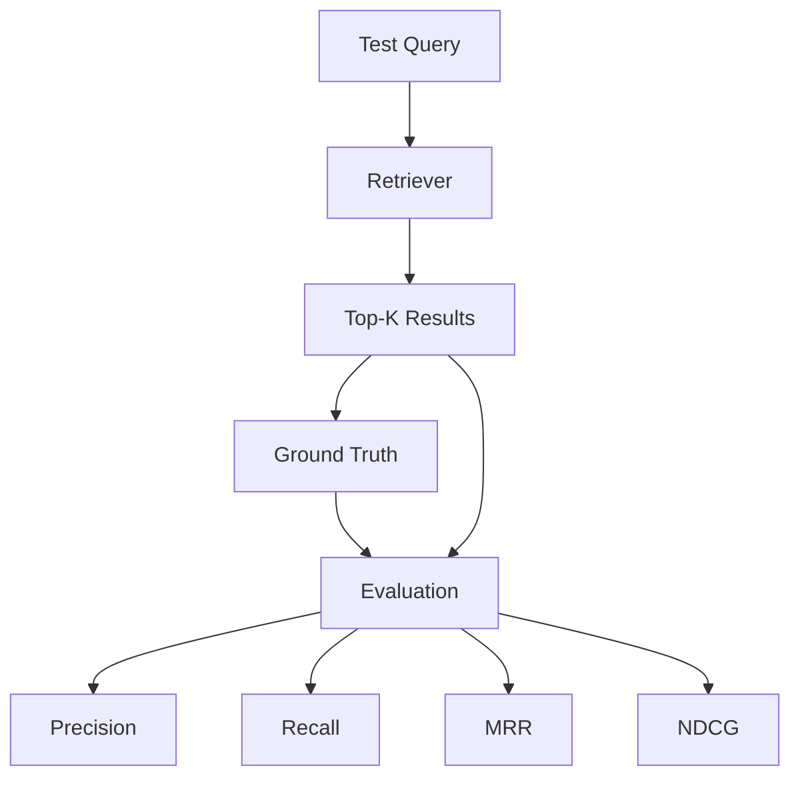

---

# 51. Retrieval Dataset

A useful evaluation dataset contains:

```text
Question
Expected Source
Relevant Node IDs
Expected Answer
Metadata Constraints
```

Example:

```text
Question:
"What is the password expiry period?"

Expected Source:
security-policy.pdf

Relevant Node:
SEC-001-CHUNK-07
```

---

# 52. Retrieval Tuning

Retrieval should be tuned using a representative evaluation dataset.

Parameters to evaluate include:

```text
Chunk Size
Chunk Overlap
Top-K
Similarity Threshold
Metadata Filters
Embedding Model
Retrieval Strategy
```

---

# 53. Tuning Loop

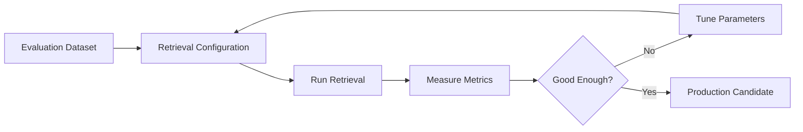

---

# 54. Index Selection Matrix

| Requirement | Recommended Starting Point |
|---|---|
| Semantic document search | VectorStoreIndex |
| Similarity-based RAG | VectorStoreIndex |
| Broad document synthesis | Summary-oriented approach |
| Hierarchical summarization | Tree-oriented approach |
| Exact terminology | Keyword-oriented retrieval |
| Entity relationships | Graph-oriented approach |
| Complex enterprise knowledge | Multiple indexes |
| Mixed semantic + exact search | Hybrid retrieval |

These are starting points, not universal rules.

---

# 55. VectorStoreIndex in Production

For enterprise RAG, a common architecture is:

```text
Documents
 ↓
Nodes
 ↓
Embeddings
 ↓
External Vector Store
 ↓
Retriever
 ↓
LLM
```

The vector store should be selected according to:

```text
Scale
Latency
Filtering
Availability
Persistence
Multi-Tenancy
Cost
Operational Model
```

---

# 56. External Vector Stores

Production systems commonly integrate with external vector databases or vector-capable databases.

Conceptually:

```text
LlamaIndex
     ↓
Vector Store Interface
     ↓
 ┌───┼──────────────┐
 ▼   ▼              ▼
Vector DB       SQL/Vector DB
```

This allows indexing infrastructure to remain separate from the application process.

---

# 57. Persistence

Development:

```text
Application
 ↓
In-Memory Index
```

Production:

```text
Application
 ↓
Persistent Vector Store
```

This enables:

```text
Restart Recovery
Horizontal Scaling
Shared Access
Operational Persistence
```

---

# 58. Horizontal Scaling

A production query layer may have multiple instances:

```text
                 Load Balancer
                      │
          ┌───────────┼───────────┐
          ▼           ▼           ▼
      Query API 1  Query API 2  Query API 3
          │           │           │
          └───────────┼───────────┘
                      ▼
                Vector Store
```

The retrieval state should not depend on a single application instance.

---

# 59. Index Build vs Query Runtime

Index building is usually a separate lifecycle from querying.

### Index Build

```text
Documents
 ↓
Transform
 ↓
Embed
 ↓
Build Index
```

### Query Runtime

```text
Query
 ↓
Retrieve
 ↓
Context
 ↓
LLM
```

This separation improves operational scalability.

---

# 60. Index Lifecycle

```text
CREATE
 ↓
BUILD
 ↓
VALIDATE
 ↓
PUBLISH
 ↓
QUERY
 ↓
UPDATE
 ↓
REBUILD / REINDEX
 ↓
RETIRE
```

---

# 61. Index Versioning

Production retrieval systems should consider versioning.

Example:

```text
Index v1
Index v2
Index v3
```

A new index can be built independently:

```text
Documents
 ↓
Build Index v4
 ↓
Validate
 ↓
Publish v4
```

rather than modifying the live index blindly.

---

# 62. Blue-Green Index Deployment

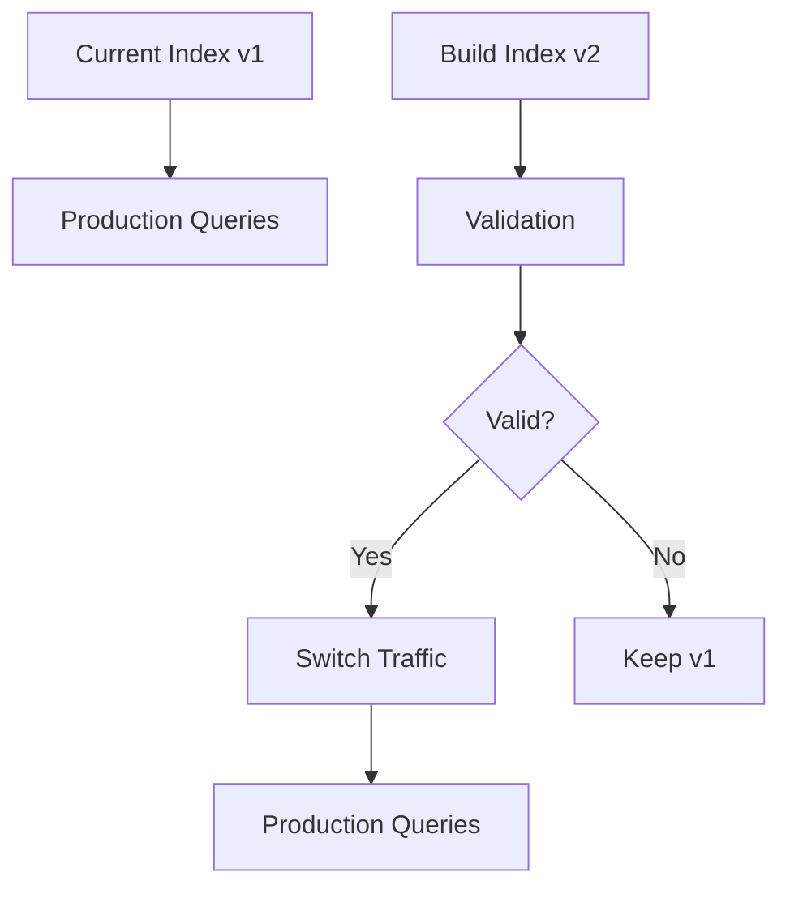

This reduces the risk of deploying a broken index.

---

# 63. Retrieval Failure Patterns

## Failure 1 — Wrong Index

```text
Poor Index Choice
 ↓
Poor Retrieval
```

---

## Failure 2 — Poor Embeddings

```text
Poor Embedding Model
 ↓
Poor Similarity
 ↓
Wrong Nodes
```

---

## Failure 3 — Wrong Top-K

```text
K Too Small
 ↓
Missing Context
```

or:

```text
K Too Large
 ↓
Too Much Noise
```

---

## Failure 4 — Missing Metadata Filters

```text
Correct Semantic Match
+
Wrong Tenant
 ↓
Security Risk
```

---

## Failure 5 — Duplicate Nodes

```text
Duplicate Documents
 ↓
Duplicate Results
 ↓
Reduced Context Quality
```

---

# 64. Retrieval Failure Diagram

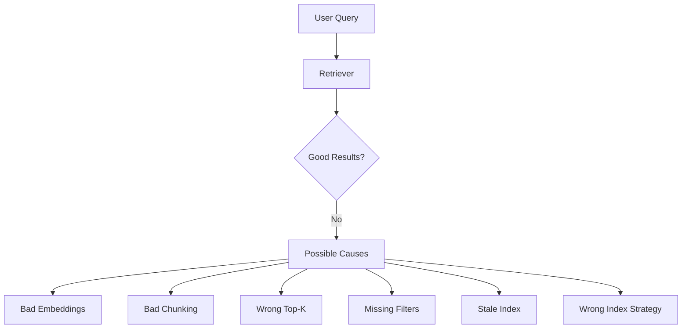

---

# 65. Stale Index

A retrieval system can fail even when the retriever is technically working.

Example:

```text
Source:
Policy v5

Index:
Policy v3
```

The retriever may return the correct node according to the index.

The index itself is stale.

Therefore:

```text
Retrieval Correctness
+
Data Freshness
```

must both be monitored.

---

# 66. Retrieval Observability

Useful metrics include:

```text
Retrieval Latency
Top-K
Similarity Scores
Retrieved Node IDs
Filter Results
Empty Retrieval Rate
Retrieval Hit Rate
Context Size
```

A trace might look like:

```text
Query
 ↓
Retriever
 ↓
Candidate Count = 50
 ↓
Filtered Count = 18
 ↓
Top-K = 5
 ↓
Context Tokens = 3200
 ↓
LLM
```

---

# 67. Retrieval Trace

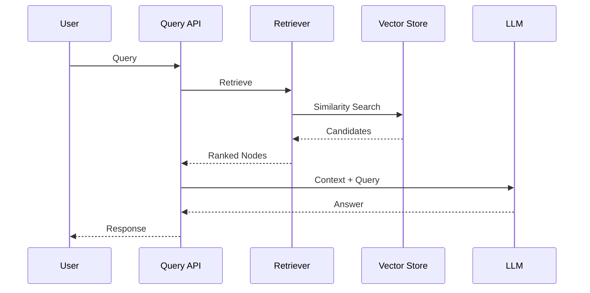

---

# 68. Retrieval Cost

Retrieval cost can include:

```text
Embedding Query
+
Vector Search
+
Metadata Filtering
+
Re-ranking
+
Context Processing
```

For high-volume applications:

```text
Queries Per Second
×
Retrieval Cost
```

can become a significant operational expense.

---

# 69. Retrieval Optimization

Potential optimizations include:

```text
Metadata Filtering
+
Smaller Candidate Sets
+
Caching
+
Efficient Vector Store
+
Appropriate Top-K
+
Query Batching
+
Result Reuse
```

---

# 70. Retrieval Caching

Repeated queries may benefit from caching.

```text
Query
 ↓
Cache
 ↓
Hit?
 ├── Yes → Return / Reuse
 └── No → Retrieve → Store
```

However, cache invalidation must account for:

```text
Index Version
Document Updates
Tenant
Authorization
```

---

# 71. Secure Retrieval Cache

A dangerous cache design is:

```text
Query
 ↓
Global Cache
```

because different users may have different permissions.

A safer conceptual key is:

```text
tenant_id
+
authorization_scope
+
query
+
index_version
```

---

# 72. Retrieval Architecture for Enterprise RAG

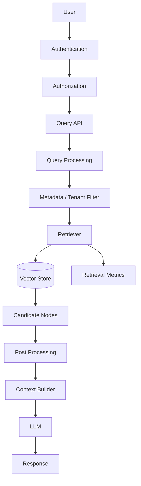

---

# 73. Enterprise Retrieval Principles

A production retrieval layer should:

```text
1. Retrieve only authorized data
2. Preserve source metadata
3. Support tenant isolation
4. Track index versions
5. Monitor retrieval quality
6. Monitor latency
7. Monitor empty results
8. Tune Top-K
9. Evaluate embeddings
10. Support index updates
```

---

# 74. Retrieval Strategy Selection

Use:

```text
Vector Retrieval
```

when the problem is primarily:

```text
Semantic Similarity
```

Use:

```text
Keyword Retrieval
```

when:

```text
Exact Terms Matter
```

Use:

```text
Graph Retrieval
```

when:

```text
Relationships Matter
```

Use:

```text
Hybrid Retrieval
```

when:

```text
Semantic + Exact Matching
```

are both important.

---

# 75. Query Complexity

Simple query:

```text
"What is the password policy?"
```

may require:

```text
Vector Retrieval
```

Complex query:

```text
"Which applications use Service A and what security policies apply to those applications?"
```

may require:

```text
Entity Retrieval
+
Graph Traversal
+
Document Retrieval
```

---

# 76. Multi-Stage Retrieval

Production systems often use:

```text
Stage 1
Broad Candidate Retrieval

        ↓

Stage 2
Filtering

        ↓

Stage 3
Ranking

        ↓

Stage 4
Context Selection

        ↓

Stage 5
Generation
```

This separates:

```text
Recall
```

from:

```text
Precision
```

---

# 77. Multi-Stage Retrieval Architecture


Advanced re-ranking strategies will be covered separately in the production retrieval section.

---

# 78. Retrieval and RAG Quality

A useful mental model is:

```text
RAG Quality
      ↓
┌─────┴─────┐
▼           ▼
Retrieval   Generation
Quality     Quality
│
├── Chunking
├── Embeddings
├── Index
├── Filters
├── Ranking
└── Top-K
```

Improving the model alone cannot compensate for poor retrieval.

---

# 79. Indexing Strategy Decision Tree

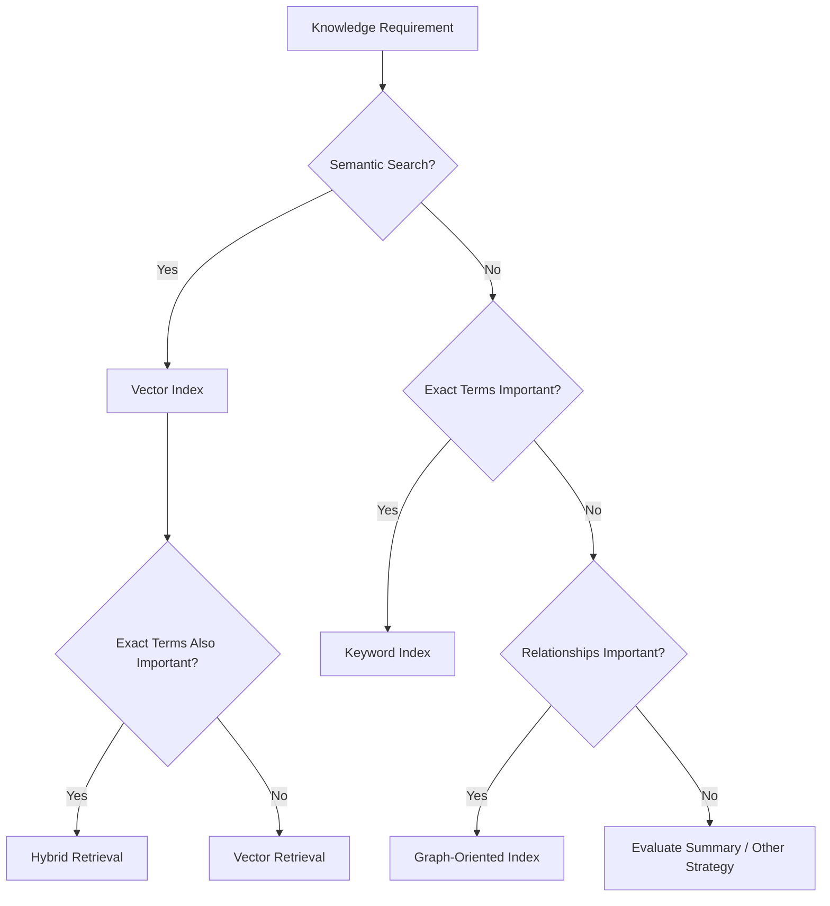

---

# 80. Index Selection Is an Architecture Decision

Do not select an index only because:

```text
"It is the default."
```

Instead evaluate:

```text
Data Shape
+
Query Shape
+
Scale
+
Latency
+
Security
+
Freshness
+
Cost
```

---

# 81. Practical LlamaIndex Example

A simple retrieval pipeline:

```python
from llama_index.core import (
    SimpleDirectoryReader,
    VectorStoreIndex
)

documents = SimpleDirectoryReader(
    "data"
).load_data()

index = VectorStoreIndex.from_documents(
    documents
)

retriever = index.as_retriever(
    similarity_top_k=5
)

nodes = retriever.retrieve(
    "How does the company handle security incidents?"
)

for node in nodes:
    print(
        node.score,
        node.node.text
    )
```

Conceptually:

```text
Documents
 ↓
Vector Index
 ↓
Retriever
 ↓
Top-5 Nodes
```

---

# 82. Query Engine vs Retriever

These concepts should not be confused.

### Retriever

Returns relevant nodes:

```text
Query
 ↓
Retriever
 ↓
Nodes
```

### Query Engine

Usually coordinates retrieval and response generation:

```text
Query
 ↓
Retriever
 ↓
Context
 ↓
LLM
 ↓
Response
```

Therefore:

```text
Retriever
=
Find Information

Query Engine
=
Find + Use Information
```

---

# 83. Retrieval-Only Architecture

Retrieval can be useful without generation.

Example:

```text
User
 ↓
Search API
 ↓
Retriever
 ↓
Relevant Documents
```

This is useful for:

```text
Enterprise Search
Document Discovery
Knowledge Navigation
```

---

# 84. Retrieval + Generation

For RAG:

```text
User
 ↓
Retriever
 ↓
Context
 ↓
LLM
 ↓
Answer
```

The retrieval layer should remain independently testable.

---

# 85. Retrieval Abstraction

A useful enterprise architecture can define:

```python
class KnowledgeRetriever:
    def retrieve(self, query, filters=None):
        ...
```

Then implementations can include:

```text
LlamaIndexRetriever
VectorRetriever
HybridRetriever
GraphRetriever
```

This keeps application code less coupled to a single retrieval implementation.

---

# 86. Ports and Adapters Architecture

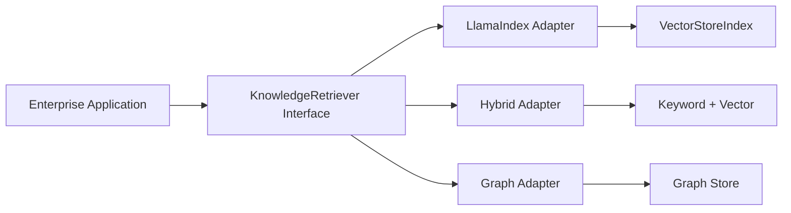

This approach is useful when long-term framework flexibility matters.

---

# 87. Production Retrieval Checklist

## Index

- [ ] Index type selected
- [ ] Embedding model selected
- [ ] Vector store selected
- [ ] Persistence configured
- [ ] Index versioning defined

## Retrieval

- [ ] Retriever configured
- [ ] Top-K tuned
- [ ] Similarity threshold evaluated
- [ ] Metadata filters implemented
- [ ] Deduplication implemented
- [ ] Ranking strategy evaluated

## Security

- [ ] Authentication
- [ ] Authorization
- [ ] Tenant filtering
- [ ] ACL enforcement
- [ ] Secure cache design

## Quality

- [ ] Retrieval evaluation dataset
- [ ] Precision@K
- [ ] Recall@K
- [ ] Hit Rate
- [ ] Context relevance
- [ ] Empty-result monitoring

## Operations

- [ ] Latency monitoring
- [ ] Cost monitoring
- [ ] Index freshness
- [ ] Retrieval tracing
- [ ] Failure handling
- [ ] Index rollback strategy

---

# 88. Key Takeaways

- Indexing prepares enterprise data for efficient retrieval.
- Indexing and retrieval are separate stages.
- `VectorStoreIndex` is a central pattern for semantic RAG.
- Vector retrieval depends heavily on embedding quality.
- Top-K controls the amount of retrieved context.
- Too little context can reduce recall.
- Too much context can increase noise, latency, and cost.
- Metadata filtering can significantly improve retrieval precision.
- Metadata filtering is not a replacement for authorization.
- Summary-oriented indexing can support broad document synthesis.
- Tree-oriented approaches can support hierarchical information processing.
- Keyword-oriented retrieval is useful when exact terms matter.
- Graph-oriented indexing is useful when relationships are important.
- Hybrid retrieval combines complementary retrieval strategies.
- Query routing can select different retrieval strategies for different questions.
- Post-processing can filter, deduplicate, rank, and compress retrieved nodes.
- Retrieval should be evaluated independently from generation.
- Production retrieval requires index lifecycle management.
- Index versioning enables safer production deployments.
- Blue-green index deployment can reduce production risk.
- Retrieval observability should include latency, scores, filters, and result quality.
- Retrieval caches must account for tenant and authorization boundaries.
- Multi-stage retrieval separates recall from precision.
- Index selection should be driven by data shape and query requirements.
- Framework-specific retrieval should be isolated behind application-level interfaces when portability matters.

---

# 📝 Quick Revision Notes

## Indexing

```text
Documents
 ↓
Nodes
 ↓
Representation
 ↓
Index
```

---

## Vector Retrieval

```text
Query
 ↓
Query Embedding
 ↓
Similarity Search
 ↓
Top-K Nodes
```

---

## Hybrid Retrieval

```text
Query
 ├── Keyword Search
 └── Vector Search
        ↓
   Result Fusion
        ↓
      Ranking
        ↓
     Context
```

---

## Enterprise Retrieval

```text
User
 ↓
Authentication
 ↓
Authorization
 ↓
Tenant Filter
 ↓
Retriever
 ↓
Index
 ↓
Post-Processing
 ↓
Context
 ↓
LLM
```

---

## Retrieval Quality

```text
Chunking
+
Embedding
+
Index
+
Top-K
+
Filtering
+
Ranking
=
Retrieval Quality
```

---

## Index Lifecycle

```text
Build
 ↓
Validate
 ↓
Publish
 ↓
Query
 ↓
Update
 ↓
Version
 ↓
Retire
```

---

# ❓ Interview Questions

## Beginner

1. What is an index in LlamaIndex?
2. What is the difference between indexing and retrieval?
3. What is VectorStoreIndex?
4. What is a retriever?
5. What is Top-K retrieval?
6. What is similarity search?
7. Why is metadata filtering important?
8. What is the difference between a retriever and a query engine?

## Intermediate

9. Explain how VectorStoreIndex works.
10. How do embeddings participate in retrieval?
11. How would you choose Top-K?
12. What is similarity thresholding?
13. What is the difference between precision and recall in retrieval?
14. When would you use keyword retrieval?
15. When would you use vector retrieval?
16. What is hybrid retrieval?
17. Why is retrieval post-processing useful?
18. How would you evaluate retrieval quality?
19. How would you handle stale indexes?
20. How would you implement index versioning?

## Advanced

21. Design a production LlamaIndex retrieval architecture.
22. How would you design multi-tenant retrieval?
23. How would you prevent unauthorized data from entering the retrieval context?
24. How would you combine vector, keyword, and graph retrieval?
25. How would you design a query router?
26. How would you optimize retrieval latency at enterprise scale?
27. How would you design index blue-green deployment?
28. How would you safely roll back an index?
29. How would you tune Top-K using an evaluation dataset?
30. How would you evaluate whether a new embedding model improves retrieval?
31. How would you design a retrieval cache safely?
32. How would you separate LlamaIndex retrieval from business logic?
33. How would you design retrieval for millions of documents?
34. How would you diagnose an increase in empty retrieval results?
35. How would you diagnose retrieval returning semantically related but incorrect documents?
36. How would you design a multi-stage retrieval pipeline?
37. When should an enterprise use vector retrieval versus graph retrieval?
38. How would you balance retrieval recall against LLM context cost?

---

# 🛠️ Practical Exercise

Build a production-oriented retrieval service using LlamaIndex.

## Step 1 — Build the Index

Load:

```text
PDF
Markdown
TXT
```

Create:

```text
Documents
 ↓
Nodes
 ↓
Embeddings
 ↓
VectorStoreIndex
```

---

## Step 2 — Implement Retrieval

Support:

```text
Top-K
Similarity Threshold
Metadata Filtering
```

---

## Step 3 — Add Metadata

Every node should contain:

```text
document_id
tenant_id
department
document_type
version
source
updated_at
```

---

## Step 4 — Evaluate

Create at least:

```text
50 Test Questions
```

Measure:

```text
Precision@K
Recall@K
Hit Rate
MRR
Context Relevance
```

---

## Step 5 — Compare Retrieval Strategies

Compare:

```text
Vector Retrieval
VS
Keyword Retrieval
VS
Hybrid Retrieval
```

Measure:

```text
Accuracy
Latency
Context Size
Cost
```

---

# 🏢 Enterprise Architecture Challenge

Design retrieval for:

```text
10 Million Documents
500 Tenants
Multiple Data Sources
Strict Authorization
Continuous Updates
High Query Volume
```

Requirements:

```text
Semantic Retrieval
+
Keyword Search
+
Metadata Filtering
+
Tenant Isolation
+
Index Versioning
+
Retrieval Evaluation
+
Observability
```

---

# 🧠 Architecture Challenge

Design:

```text
                         User
                          │
                          ▼
                   Authentication
                          │
                          ▼
                   Authorization
                          │
                          ▼
                     Query API
                          │
                          ▼
                    Query Router
                     /    |    \
                    /     |     \
                   ▼      ▼      ▼
              Vector   Keyword   Graph
              Index     Index    Index
                   \      |      /
                    \     |     /
                     ▼    ▼    ▼
                    Result Fusion
                          │
                          ▼
                      Ranking
                          │
                          ▼
                  Context Selection
                          │
                          ▼
                         LLM
                          │
                          ▼
                       Response
```

The architecture should support:

```text
Security
Scalability
High Recall
High Precision
Low Latency
Cost Control
Observability
```

---

# 🚀 Production Design Exercise

Implement index versioning:

```text
Index v1
   │
   ├── Production
   │
   ▼
Build v2
   │
   ▼
Evaluate v2
   │
   ▼
Publish v2
   │
   ▼
Switch Traffic
```

If evaluation fails:

```text
Keep v1
```

If evaluation succeeds:

```text
Promote v2
```

---

# 📚 References & Further Reading

Recommended areas for further study:

- LlamaIndex VectorStoreIndex
- LlamaIndex Retrievers
- LlamaIndex Query Engines
- LlamaIndex Metadata Filtering
- LlamaIndex Vector Store Integrations
- LlamaIndex Summary Indexing
- LlamaIndex Tree-Oriented Indexing
- LlamaIndex Keyword Retrieval
- LlamaIndex Property Graph / Graph Retrieval
- LlamaIndex Retrieval Evaluation
- Vector Search
- Hybrid Search
- Enterprise Search Architecture
- RAG Retrieval Evaluation
- Production Vector Database Architecture

> LlamaIndex evolves rapidly. Before implementing production systems, verify the current APIs, index classes, retriever interfaces, metadata-filtering syntax, vector-store integrations, and graph capabilities against the official documentation for the version used by your project.

---

## 🧭 Chapter Navigation

⬅️ **Previous:** [10. LlamaIndex Data and Document Ingestion](10-llamaindex-data-and-document-ingestion.md)

📚 **Part VIII Index:** [AI Engineering Frameworks & Tooling](index.md)

➡️ **Next:** [12. LlamaIndex RAG Pielines](12-llamaindex-rag-pipelines.md)

---

> **Enterprise AI Engineering Handbook**
>
> *Building Production-Grade Enterprise AI Systems — One Chapter at a Time.*