# 12 — LlamaIndex RAG Pipelines

> Learn how to build, customize, evaluate, and productionize Retrieval-Augmented Generation pipelines using LlamaIndex, from simple vector RAG to enterprise-grade retrieval, context construction, response synthesis, citations, metadata filtering, and observability.

---

## 📖 Overview

Retrieval-Augmented Generation (RAG) combines information retrieval with Large Language Models.

Instead of relying only on the model's internal knowledge:

```text
User Query
    ↓
Retrieve Relevant Information
    ↓
Build Context
    ↓
LLM
    ↓
Grounded Response
```

LlamaIndex provides abstractions for building this pipeline around enterprise data.

A simplified LlamaIndex RAG architecture is:

```text
                    Enterprise Data
                          ↓
                    Data Ingestion
                          ↓
                       Documents
                          ↓
                         Nodes
                          ↓
                    Index / Storage
                          ↓
                       Retriever
                          ↓
                   Relevant Context
                          ↓
                 Response Synthesizer
                          ↓
                          LLM
                          ↓
                     Final Answer
```

The objective of a production RAG pipeline is not simply:

```text
Retrieve → Generate
```

but rather:

```text
Retrieve the right information
        +
Respect security boundaries
        +
Construct useful context
        +
Generate a grounded response
        +
Provide traceability
```

---

# 🎯 Learning Objectives

After completing this chapter, you will be able to:

- Understand the architecture of LlamaIndex RAG pipelines
- Build a basic LlamaIndex RAG application
- Understand ingestion and retrieval boundaries
- Configure vector-based RAG
- Configure retrievers
- Use query engines
- Understand response synthesis
- Apply metadata filtering
- Build citation-aware RAG
- Understand source attribution
- Design multi-stage RAG pipelines
- Combine retrieval with post-processing
- Separate retrieval from generation
- Evaluate RAG pipelines
- Monitor RAG pipelines in production
- Optimize RAG latency and cost
- Design enterprise-grade RAG architectures
- Understand common LlamaIndex RAG failure patterns

---

# 1. What Is RAG?

Retrieval-Augmented Generation combines:

```text
Retrieval
+
Generation
```

The retrieval layer finds relevant external information.

The generation layer uses that information to produce the response.

```text
                 RAG
                  │
        ┌─────────┴─────────┐
        ▼                   ▼
    Retrieval           Generation
        │                   │
        ▼                   ▼
Relevant Context          LLM
        │                   │
        └─────────┬─────────┘
                  ▼
               Answer
```

---

# 2. Why RAG Is Needed

LLMs have limitations.

They may not know:

```text
Private Enterprise Data
Recently Updated Policies
Internal Documentation
Customer-Specific Information
Operational Data
Company Procedures
```

RAG provides an external knowledge layer:

```text
Enterprise Knowledge
        ↓
      Retrieval
        ↓
      Context
        ↓
        LLM
```

---

# 3. LlamaIndex RAG Mental Model

A useful mental model is:

```text
LOAD
 ↓
TRANSFORM
 ↓
INDEX
 ↓
RETRIEVE
 ↓
RANK / FILTER
 ↓
BUILD CONTEXT
 ↓
GENERATE
 ↓
CITE
```

Each stage should be independently observable and testable.

---

# 4. End-to-End RAG Pipeline

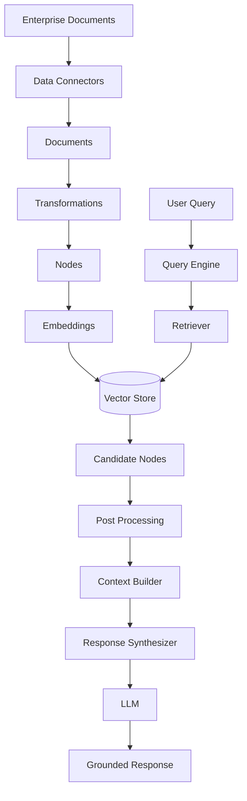

---

# 5. Offline vs Online RAG

A production RAG system normally has two paths.

## Offline Path

```text
Documents
 ↓
Parse
 ↓
Chunk
 ↓
Metadata
 ↓
Embedding
 ↓
Index
```

## Online Path

```text
User Query
 ↓
Retrieve
 ↓
Filter / Rank
 ↓
Context
 ↓
LLM
 ↓
Response
```

---

# 6. RAG Architecture

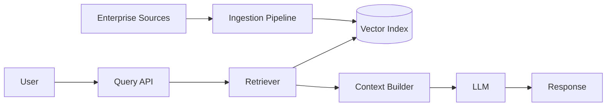

Keeping the two paths separate allows ingestion workloads to scale independently from user-facing query workloads.

---

# 7. Basic LlamaIndex RAG

A minimal implementation can be:

```python
from llama_index.core import (
    SimpleDirectoryReader,
    VectorStoreIndex
)

# Load documents
documents = SimpleDirectoryReader(
    "data"
).load_data()

# Build index
index = VectorStoreIndex.from_documents(
    documents
)

# Create query engine
query_engine = index.as_query_engine()

# Query
response = query_engine.query(
    "What is the company's security policy?"
)

print(response)
```

The conceptual flow is:

```text
Documents
 ↓
VectorStoreIndex
 ↓
Query Engine
 ↓
Retriever
 ↓
LLM
 ↓
Response
```

---

# 8. What Happens During RAG?

When the user asks:

```text
"What is the company's password policy?"
```

the system performs approximately:

```text
1. Receive Query
        ↓
2. Convert Query to Search Representation
        ↓
3. Search Index
        ↓
4. Retrieve Relevant Nodes
        ↓
5. Build Context
        ↓
6. Construct Prompt
        ↓
7. Call LLM
        ↓
8. Generate Response
```

---

# 9. Query Engine

The query engine provides a high-level abstraction for querying indexed data.

```python
query_engine = index.as_query_engine()

response = query_engine.query(
    "Explain the password policy."
)
```

Conceptually:

```text
Query Engine
 ├── Query Processing
 ├── Retriever
 ├── Context Construction
 ├── Response Synthesis
 └── LLM
```

---

# 10. Retriever

The retriever is responsible for finding relevant nodes.

```python
retriever = index.as_retriever(
    similarity_top_k=5
)

nodes = retriever.retrieve(
    "What is the password policy?"
)
```

The retriever returns candidate information.

It does not necessarily generate the final answer.

---

# 11. Retriever vs Query Engine

### Retriever

```text
Query
 ↓
Relevant Nodes
```

### Query Engine

```text
Query
 ↓
Retriever
 ↓
Context
 ↓
LLM
 ↓
Answer
```

Therefore:

```text
Retriever
=
Information Retrieval

Query Engine
=
Retrieval + Generation
```

---

# 12. RAG Context

The retrieved nodes become context for the LLM.

Example:

```text
Question:
"What is the password expiry period?"

Retrieved Context:

"Employee passwords must be changed every
90 days unless an approved exception exists."
```

The LLM then receives:

```text
Question
+
Retrieved Context
```

and generates the response.

---

# 13. Context Construction

A production pipeline should not blindly concatenate every retrieved node.

Instead:

```text
Retrieved Nodes
      ↓
Filter
      ↓
Deduplicate
      ↓
Rank
      ↓
Select
      ↓
Context
```

---

# 14. Context Builder

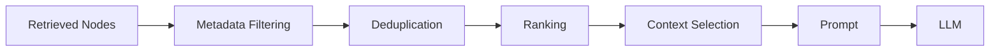

---

# 15. Top-K Retrieval

Example:

```python
retriever = index.as_retriever(
    similarity_top_k=5
)
```

This asks the retriever to return approximately the top five candidates according to its retrieval strategy.

The correct value should be determined through evaluation.

---

# 16. Top-K Trade-Off

Small K:

```text
Lower Latency
Lower Cost
Less Noise
```

but:

```text
Potentially Lower Recall
```

Large K:

```text
Higher Recall
```

but:

```text
More Noise
More Tokens
Higher Latency
Higher Cost
```

Therefore:

```text
Top-K
=
Quality / Cost / Latency Trade-Off
```

---

# 17. Metadata Filtering

Metadata can constrain retrieval.

Example:

```python
metadata = {
    "tenant_id": "tenant-001",
    "department": "finance",
    "document_type": "policy"
}
```

The conceptual query becomes:

```text
User Query
+
Tenant Filter
+
Department Filter
+
Document Type Filter
 ↓
Retriever
```

---

# 18. Metadata-Aware RAG

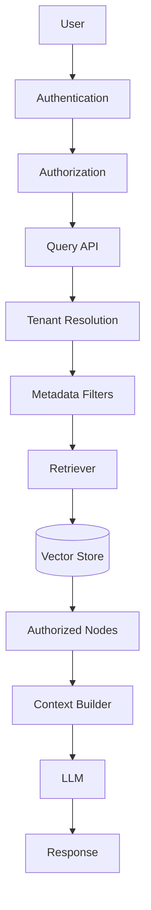

---

# 19. Security Boundary

A critical enterprise principle:

```text
Retrieved
≠
Authorized
```

The application must determine what the user is allowed to access before retrieval context reaches the model.

The model should never be responsible for deciding:

```text
"Is this user allowed to see this document?"
```

---

# 20. Tenant-Aware RAG

For multi-tenant applications:

```text
User
 ↓
Tenant Identification
 ↓
Authorization
 ↓
Tenant Filter
 ↓
Retriever
 ↓
Vector Store
```

Example metadata:

```python
{
    "tenant_id": "tenant-001",
    "document_id": "DOC-1001"
}
```

---

# 21. Multi-Tenant RAG Architecture

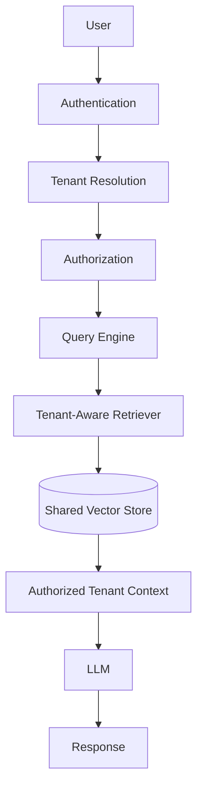

---

# 22. Prompt Construction

A RAG prompt conceptually contains:

```text
System Instructions

+
Retrieved Context

+
User Question
```

Example:

```text
System:
Answer using only the supplied context.

Context:
Employee passwords must be changed every 90 days.

Question:
How often must employees change passwords?
```

---

# 23. Grounded Generation

A strong RAG prompt should establish the relationship between:

```text
Context
```

and:

```text
Answer
```

Conceptually:

```text
Context
 ↓
Reason over supplied information
 ↓
Answer
```

This can reduce unsupported answers, although prompting alone cannot eliminate hallucination.

---

# 24. Response Synthesis

LlamaIndex provides response synthesis abstractions for turning retrieved information into a final response.

Conceptually:

```text
Retrieved Nodes
       ↓
Response Synthesizer
       ↓
LLM
       ↓
Final Answer
```

---

# 25. Response Synthesis Architecture

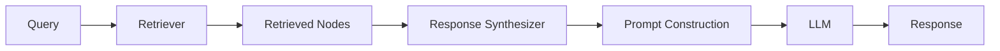

---

# 26. Why Response Synthesis Matters

Retrieval returns information.

It does not automatically determine:

```text
How the answer should be structured
```

Response synthesis can coordinate:

```text
Retrieved Context
+
Query
+
Prompt
+
LLM
```

to create the final response.

---

# 27. Response Modes

Depending on the pipeline and LlamaIndex version, response synthesis can use different approaches for combining retrieved information.

Conceptually:

```text
Compact
Refine
Tree-Based
Summarization
```

The appropriate strategy depends on:

```text
Context Size
Question Complexity
Latency
Cost
Answer Requirements
```

---

# 28. Compact-Style Synthesis

Conceptually:

```text
Node 1
Node 2
Node 3
Node 4
   ↓
Combine Context
   ↓
One LLM Call
   ↓
Answer
```

Advantages:

```text
Simple
Fast
Lower Number of LLM Calls
```

Constraint:

```text
Context Window
```

---

# 29. Refine-Style Synthesis

Conceptually:

```text
Query + Node 1
      ↓
Initial Answer
      ↓
Refine with Node 2
      ↓
Refine with Node 3
      ↓
Final Answer
```

Architecture:

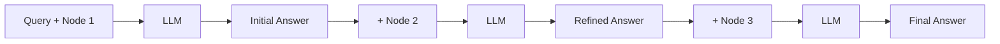

This can process information progressively but may require more model calls.

---

# 30. Tree-Oriented Synthesis

A hierarchical strategy can summarize information progressively.

```text
Node 1 ─┐
Node 2 ─┤
        ├── Summary A
Node 3 ─┤
Node 4 ─┘

Node 5 ─┐
Node 6 ─┤
        ├── Summary B
Node 7 ─┤
Node 8 ─┘

Summary A + Summary B
        ↓
      LLM
        ↓
     Answer
```

This can be useful for large collections of retrieved information.

---

# 31. Citation-Aware RAG

Enterprise applications often need:

```text
Answer
+
Source
```

Example:

```text
The password policy requires a password change
every 90 days.

Source:
security-policy.pdf
Page 14
```

Source attribution improves:

```text
Trust
Auditability
Verification
User Experience
```

---

# 32. Source Metadata

A node can retain information such as:

```python
metadata = {
    "document_id": "SEC-001",
    "source": "security-policy.pdf",
    "page": 14,
    "section": "Password Policy"
}
```

This allows the response layer to associate retrieved content with its source.

---

# 33. Citation Architecture

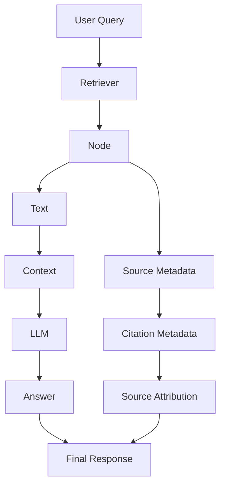

---

# 34. RAG With Citations

Conceptually:

```python
for node in nodes:
    print(
        node.node.text,
        node.node.metadata
    )
```

The application can then use:

```text
document_id
source
page
section
```

to construct citations.

---

# 35. Query Transformation

A user query may not always be ideal for retrieval.

Example:

```text
"How do we protect employee accounts?"
```

could be transformed into:

```text
employee account security
password policy
authentication controls
access management
```

The retrieval pipeline can then search using improved query representations.

---

# 36. Query Transformation Pipeline

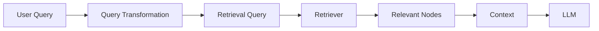

Advanced query transformation strategies belong to the broader production retrieval layer.

---

# 37. Multi-Query RAG

One query may produce multiple retrieval perspectives.

```text
User Query
    ↓
 ┌──┼───────────┐
 ▼  ▼           ▼
Q1  Q2          Q3
 │   │           │
 └───┼───────────┘
     ▼
Result Fusion
     ↓
Context
     ↓
LLM
```

This can improve recall for ambiguous or complex questions.

---

# 38. Multi-Query Architecture

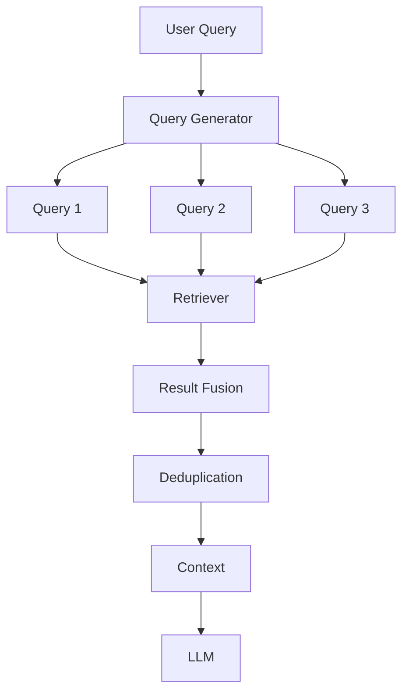

---

# 39. Hybrid RAG

Hybrid RAG combines:

```text
Semantic Retrieval
+
Keyword Retrieval
```

Example:

```text
User Query
     │
 ┌───┴────┐
 ▼        ▼
Vector   Keyword
Search   Search
 │        │
 └───┬────┘
     ▼
Result Fusion
     ↓
Context
     ↓
LLM
```

This is especially useful for:

```text
Technical Terms
Product Codes
Policy Numbers
Legal References
Acronyms
```

---

# 40. Contextual Compression

Retrieved nodes may contain more information than the question requires.

Example:

```text
Retrieved Node
=
2000 tokens

Relevant Content
=
300 tokens
```

Compression can reduce context before generation.

```text
Retrieved Nodes
 ↓
Relevant Content Extraction
 ↓
Compressed Context
 ↓
LLM
```

---

# 41. Compression Architecture

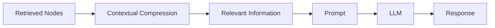

---

# 42. Parent-Child Context

Small chunks improve retrieval precision but may lose context.

A production strategy can retrieve:

```text
Child Chunk
```

and then expand to:

```text
Parent Section
```

Conceptually:

```text
Document
 ├── Parent Section
 │    ├── Child Chunk 1
 │    ├── Child Chunk 2
 │    └── Child Chunk 3
```

Query:

```text
Retrieve Child Chunk 2
        ↓
Expand Parent Section
        ↓
LLM Context
```

---

# 43. Parent-Child RAG

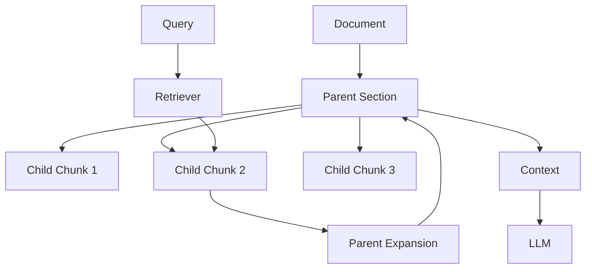

---

# 44. RAG With Structured Data

Not every enterprise question should be answered through vector retrieval.

Example:

```text
"What was the total revenue in Q2?"
```

may require:

```text
SQL
```

rather than semantic document search.

A production architecture may route:

```text
Unstructured Question → RAG
Structured Question → SQL
```

---

# 45. RAG + SQL Architecture

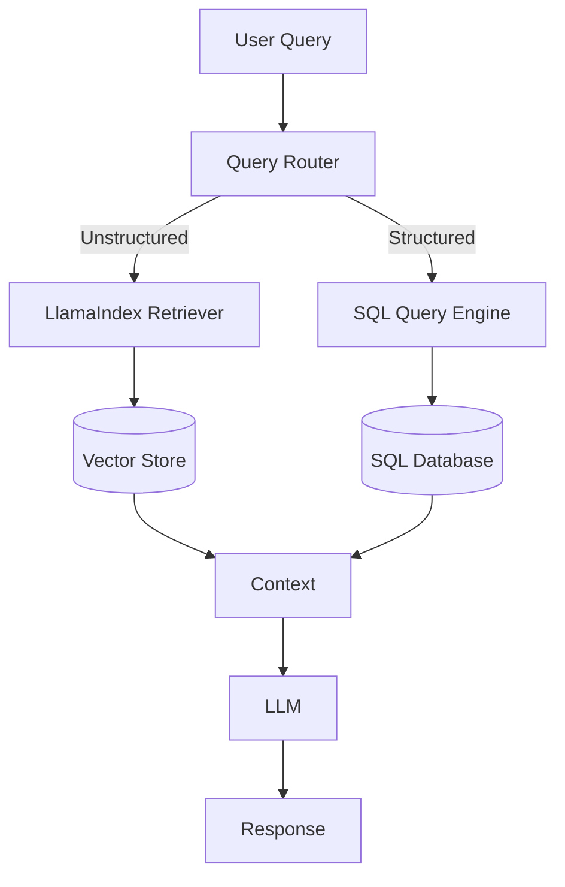

---

# 46. RAG + Knowledge Graph

Some questions require relationships.

Example:

```text
"Which applications depend on Service A?"
```

A graph may be better suited than pure vector retrieval.

```text
Query
 ↓
Graph Retrieval
 ↓
Relationships
 ↓
Context
 ↓
LLM
```

---

# 47. Multi-Source RAG

Enterprise systems may retrieve from:

```text
Documents
+
Vector Database
+
SQL Database
+
Knowledge Graph
+
APIs
```

The architecture becomes:

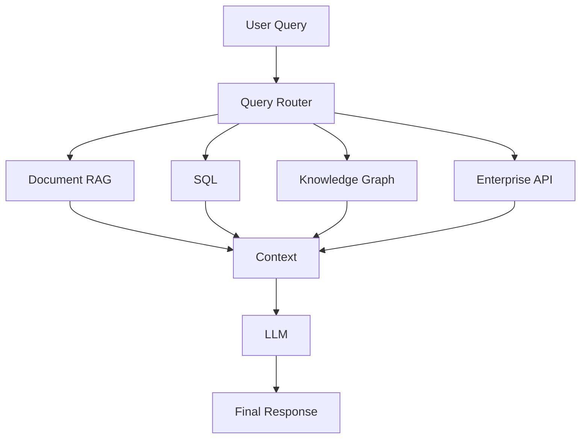

---

# 48. RAG as an AI Capability

A production application should avoid embedding all RAG logic directly into controllers.

Instead:

```text
REST Controller
      ↓
Knowledge Service
      ↓
RAG Pipeline
      ↓
LlamaIndex
      ↓
Retrieval / LLM
```

This keeps the framework behind an application-level capability.

---

# 49. Enterprise RAG Abstraction

Conceptually:

```python
class KnowledgeService:

    def answer(
        self,
        query,
        tenant_id,
        filters=None
    ):
        ...
```

Internally:

```text
KnowledgeService
      ↓
LlamaIndex Adapter
      ↓
Retriever
      ↓
Context Builder
      ↓
LLM
```

---

# 50. Ports and Adapters

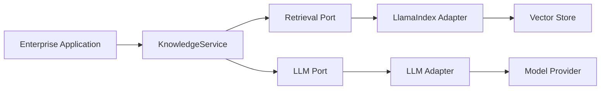

This reduces direct framework coupling.

---

# 51. RAG Pipeline Configuration

A production RAG pipeline should make important decisions explicit.

Example:

```python
rag_config = {
    "top_k": 5,
    "similarity_threshold": 0.75,
    "chunk_size": 512,
    "chunk_overlap": 50,
    "enable_citations": True,
    "enable_metadata_filtering": True
}
```

Configuration should ideally be externally configurable rather than hard-coded throughout the application.

---

# 52. RAG Pipeline Lifecycle

```text
REQUEST
   ↓
AUTHENTICATE
   ↓
AUTHORIZE
   ↓
VALIDATE QUERY
   ↓
RETRIEVE
   ↓
FILTER
   ↓
RANK
   ↓
BUILD CONTEXT
   ↓
GENERATE
   ↓
VALIDATE RESPONSE
   ↓
CITE
   ↓
RETURN
```

---

# 53. Response Validation

A production RAG system should not blindly return every model response.

Validation can include:

```text
Schema Validation
Citation Validation
Safety Checks
Grounding Checks
Business Rules
PII Checks
```

Conceptually:

```text
LLM Response
      ↓
Validation
      ↓
Valid?
 ┌────┴────┐
Yes        No
 ↓          ↓
Return     Fallback
```

---

# 54. Grounding Validation

A RAG application can evaluate whether the answer is supported by retrieved context.

```text
Answer
   +
Retrieved Context
   ↓
Grounding Evaluation
   ↓
Supported?
```

This can be implemented using:

```text
Rules
+
Heuristics
+
LLM-based Evaluation
+
Dedicated Evaluation Frameworks
```

---

# 55. No-Answer Behavior

A strong RAG system should be able to say:

```text
"I don't have enough information to answer this."
```

rather than inventing information.

Architecture:

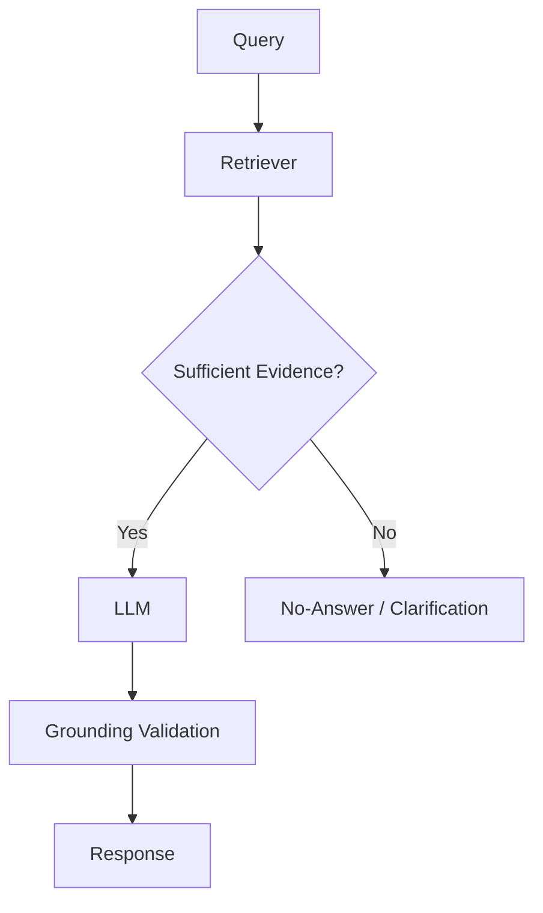

---

# 56. Empty Retrieval

A query may return no useful results.

Possible causes:

```text
Wrong Query
Wrong Embedding
Wrong Index
Missing Data
Metadata Filter Too Restrictive
Stale Index
```

A production system should distinguish:

```text
No Data
```

from:

```text
Retrieval Failure
```

---

# 57. Empty Retrieval Handling

```python
nodes = retriever.retrieve(query)

if not nodes:
    return {
        "status": "NO_EVIDENCE",
        "message": "No relevant information was found."
    }
```

In production, the actual behavior should be aligned with the application's API and user experience requirements.

---

# 58. RAG Observability

Track at least:

```text
Query
Tenant
Retriever
Top-K
Retrieved Node IDs
Similarity Scores
Context Tokens
LLM Latency
LLM Tokens
Response
Citation Metadata
Errors
```

---

# 59. RAG Trace

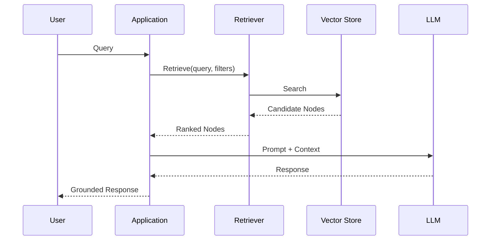

---

# 60. RAG Metrics

Useful metrics include:

### Retrieval

```text
Recall@K
Precision@K
MRR
NDCG
Hit Rate
```

### Generation

```text
Faithfulness
Answer Relevance
Groundedness
```

### System

```text
Latency
Throughput
Error Rate
Token Usage
Cost
```

---

# 61. RAG Evaluation Architecture

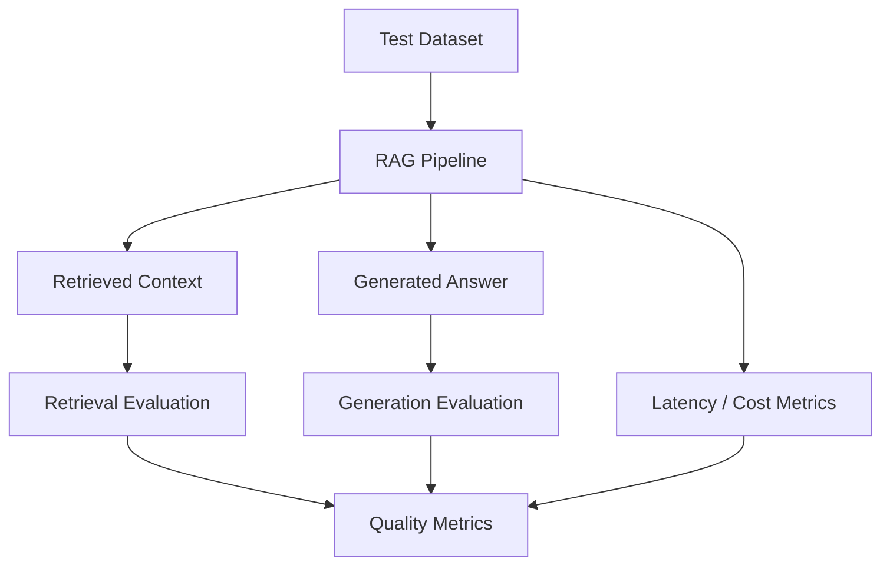

---

# 62. RAG Evaluation Dataset

A useful dataset contains:

```text
Question
Expected Answer
Expected Source
Relevant Node IDs
Tenant
Metadata Filters
```

Example:

```text
Question:
"What is the password expiry period?"

Expected Answer:
90 days

Expected Source:
security-policy.pdf

Relevant Node:
SEC-001-CHUNK-007
```

---

# 63. Retrieval vs Generation Evaluation

Evaluate these separately.

### Retrieval

```text
Did we retrieve the correct information?
```

### Generation

```text
Did the model correctly use that information?
```

This distinction is critical for debugging.

---

# 64. Debugging RAG

If the answer is wrong:

```text
Wrong Answer
     ↓
Check Retrieval
     ↓
Did we retrieve correct context?
```

If:

```text
No
```

investigate:

```text
Chunking
Embeddings
Index
Filters
Top-K
```

If:

```text
Yes
```

investigate:

```text
Prompt
Context Construction
LLM
Response Validation
```

---

# 65. RAG Debugging Flow

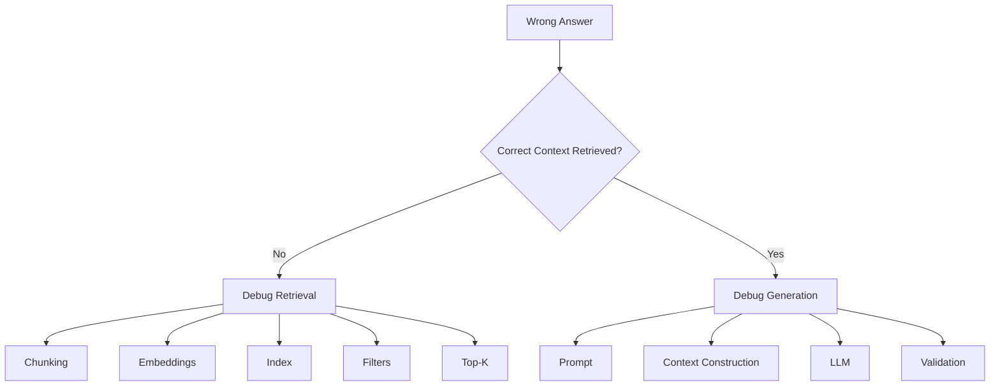

---

# 66. RAG Latency

End-to-end latency can be approximated as:

```text
Total Latency
=
Query Processing
+
Embedding
+
Retrieval
+
Post-Processing
+
Prompt Construction
+
LLM
+
Validation
```

The LLM is not necessarily the only bottleneck.

---

# 67. RAG Cost

A simplified cost model:

```text
Total RAG Cost
=
Query Embedding Cost
+
Retrieval Infrastructure
+
Context Processing
+
LLM Input Tokens
+
LLM Output Tokens
+
Observability
```

Reducing unnecessary context can reduce both:

```text
Latency
Cost
```

---

# 68. RAG Optimization

Potential optimizations:

```text
Metadata Filtering
+
Appropriate Top-K
+
Caching
+
Embedding Optimization
+
Context Compression
+
Smaller Prompts
+
Streaming
+
Efficient Vector Store
```

Optimization should be validated using measurements.

---

# 69. RAG Caching

Repeated queries can potentially use cached retrieval results.

```text
Query
 ↓
Cache
 ↓
Hit?
 ├── Yes → Cached Result
 └── No → Retrieval
```

But cache keys must consider:

```text
Tenant
Authorization Scope
Index Version
Query
Filters
```

---

# 70. Secure RAG Cache

Bad:

```text
cache[query]
```

Safer conceptual key:

```text
cache[
    tenant_id,
    authorization_scope,
    index_version,
    query,
    filters
]
```

This prevents users with different access scopes from accidentally sharing cached retrieval results.

---

# 71. Streaming

For long responses, streaming can improve perceived latency.

```text
User Query
 ↓
Retrieve
 ↓
LLM
 ↓
Token Stream
 ↓
User
```

However:

```text
Retrieval
+
Security
+
Validation
```

still need to happen before unsafe context is exposed.

---

# 72. Production RAG Architecture

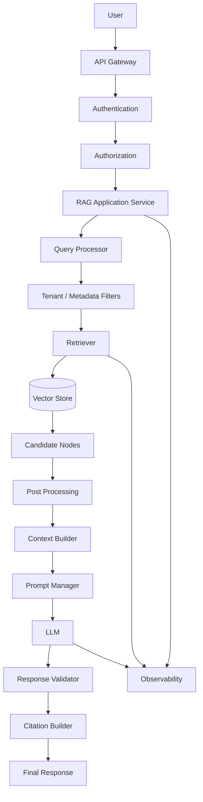

---

# 73. Enterprise RAG Components

A production platform may contain:

```text
API Gateway
Authentication
Authorization
Query Service
Retriever
Vector Store
Metadata Store
LLM Provider
Prompt Management
Evaluation
Observability
Caching
Audit
```

LlamaIndex can provide important building blocks, but it should remain one component within the broader enterprise architecture.

---

# 74. RAG Failure Patterns

## Failure 1 — Wrong Context

```text
Query
 ↓
Wrong Nodes
 ↓
Wrong Answer
```

---

## Failure 2 — No Context

```text
Query
 ↓
No Results
 ↓
LLM Generates From Internal Knowledge
 ↓
Potential Hallucination
```

---

## Failure 3 — Too Much Context

```text
Retrieve 100 Nodes
 ↓
Huge Prompt
 ↓
Noise
 ↓
Higher Cost
```

---

## Failure 4 — Stale Context

```text
Updated Document
 ↓
Old Index
 ↓
Old Answer
```

---

## Failure 5 — Unauthorized Context

```text
Wrong Tenant Filter
 ↓
Unauthorized Node
 ↓
LLM Context
 ↓
Data Leakage
```

---

# 75. RAG Failure Architecture

```mermaid
flowchart TD

    A[User Query] --> B[RAG Pipeline]

    B --> C{Retrieval Quality}

    C -->|Poor| D[Wrong Context]

    C -->|Empty| E[No Evidence]

    C -->|Too Much| F[Context Noise]

    C -->|Stale| G[Outdated Context]

    C -->|Unauthorized| H[Security Incident]

    C -->|Good| I[LLM]

    I --> J[Response]
```

---

# 76. Production RAG Principles

A production RAG system should:

```text
1. Separate ingestion and query paths
2. Enforce authorization before retrieval
3. Preserve document lineage
4. Use metadata filters
5. Evaluate retrieval independently
6. Control context size
7. Support no-answer behavior
8. Track index freshness
9. Monitor latency and cost
10. Validate generated responses
11. Provide source attribution
12. Version important retrieval configurations
```

---

# 77. LlamaIndex RAG Design Principles

```text
Framework
     ↓
RAG Capability
     ↓
Application Architecture
```

not:

```text
Application
     ↓
Everything directly coupled to LlamaIndex
```

Use LlamaIndex where it provides value while keeping business capabilities independently designed.

---

# 78. LlamaIndex RAG Abstraction

Conceptually:

```python
class EnterpriseRAGService:

    def answer(
        self,
        query,
        tenant_id,
        filters=None
    ):
        # authorize
        # retrieve
        # build context
        # generate
        # validate
        # cite
        pass
```

The framework implementation remains behind this application-level capability.

---

# 79. RAG Pipeline Stages

A useful production model is:

```text
Stage 1
Authentication

Stage 2
Authorization

Stage 3
Query Processing

Stage 4
Retrieval

Stage 5
Filtering

Stage 6
Ranking

Stage 7
Context Construction

Stage 8
Generation

Stage 9
Validation

Stage 10
Citation

Stage 11
Observability
```

---

# 80. Practical RAG Implementation

A simple LlamaIndex implementation:

```python
from llama_index.core import (
    SimpleDirectoryReader,
    VectorStoreIndex
)

# Ingestion
documents = SimpleDirectoryReader(
    "data"
).load_data()

# Index
index = VectorStoreIndex.from_documents(
    documents
)

# Query engine
query_engine = index.as_query_engine(
    similarity_top_k=5
)

# Query
question = "What is the security incident response process?"

response = query_engine.query(question)

print(response)
```

---

# 81. Retrieval-Only Implementation

For debugging and evaluation, inspect retrieval separately:

```python
retriever = index.as_retriever(
    similarity_top_k=5
)

nodes = retriever.retrieve(
    "What is the security incident response process?"
)

for node in nodes:
    print("Score:", node.score)
    print("Text:", node.node.text)
    print("Metadata:", node.node.metadata)
    print("---")
```

This is an important production debugging technique.

---

# 82. Why Retrieval-Only Testing Matters

If the final answer is wrong:

```text
First inspect:
Retrieved Nodes
```

If the nodes are wrong:

```text
Fix Retrieval
```

If the nodes are correct:

```text
Investigate Generation
```

Therefore:

```text
Retriever
```

should be independently testable.

---

# 83. RAG Testing Strategy

Test at multiple levels.

### Unit

```text
Parser
Chunker
Metadata
Retriever
Prompt
```

### Integration

```text
Retriever + Vector Store
RAG + LLM
```

### End-to-End

```text
User Query
 ↓
RAG
 ↓
Response
```

---

# 84. RAG Test Architecture

```mermaid
flowchart TB

    A[Test Suite]

    A --> B[Unit Tests]
    A --> C[Integration Tests]
    A --> D[Retrieval Evaluation]
    A --> E[End-to-End Tests]
    A --> F[Security Tests]
    A --> G[Performance Tests]

    B --> H[Quality Gate]
    C --> H
    D --> H
    E --> H
    F --> H
    G --> H
```

---

# 85. Security Testing

Test cases should include:

```text
Tenant A asks about Tenant B data
```

Expected:

```text
No unauthorized context
```

Also test:

```text
Unauthorized document
Restricted metadata
Deleted document
Expired document
Confidential document
```

---

# 86. RAG Security Test

```text
User:
Tenant A

Query:
"What is Tenant B's pricing strategy?"

Expected:
No Tenant B context
```

This should be tested automatically rather than relying only on prompt instructions.

---

# 87. RAG Quality Gate

A deployment candidate can require:

```text
Recall@5 >= Target
Faithfulness >= Target
Latency <= Target
Cost <= Target
Security Tests = PASS
```

Only then:

```text
Deploy
```

---

# 88. Production Deployment Model

```mermaid
flowchart LR

    A[Code Change] --> B[Build]

    B --> C[Unit Tests]

    C --> D[Integration Tests]

    D --> E[RAG Evaluation]

    E --> F[Security Tests]

    F --> G[Performance Tests]

    G --> H[Deploy]

    H --> I[Monitor]

    I --> J{Healthy?}

    J -->|Yes| K[Continue]

    J -->|No| L[Rollback]
```

---

# 89. RAG Configuration Versioning

Important configuration should be versioned:

```text
Embedding Model
Chunk Size
Chunk Overlap
Top-K
Similarity Threshold
Prompt
Retriever
Response Mode
Index Version
```

Example:

```text
RAG Configuration v7
```

This makes production experiments reproducible.

---

# 90. RAG Experiment Tracking

A useful experiment record:

```text
Experiment ID
Embedding Model
Chunk Size
Top-K
Retriever
Prompt Version
Index Version
Recall@K
Faithfulness
Latency
Cost
```

This allows engineers to compare changes systematically.

---

# 91. Production RAG Checklist

## Data

- [ ] Data connectors
- [ ] Parsing
- [ ] Chunking
- [ ] Metadata
- [ ] Deduplication
- [ ] Versioning
- [ ] Freshness

## Retrieval

- [ ] Index
- [ ] Retriever
- [ ] Top-K
- [ ] Filters
- [ ] Ranking
- [ ] Deduplication
- [ ] Context selection

## Generation

- [ ] Prompt
- [ ] LLM
- [ ] Response synthesis
- [ ] Validation
- [ ] No-answer behavior
- [ ] Citations

## Security

- [ ] Authentication
- [ ] Authorization
- [ ] Tenant isolation
- [ ] ACL filtering
- [ ] Secure caching
- [ ] Audit logging

## Evaluation

- [ ] Retrieval dataset
- [ ] Retrieval metrics
- [ ] Answer quality
- [ ] Faithfulness
- [ ] Security tests
- [ ] Regression tests

## Operations

- [ ] Logging
- [ ] Metrics
- [ ] Tracing
- [ ] Latency
- [ ] Cost
- [ ] Freshness
- [ ] Error monitoring

---

# 92. Key Takeaways

- RAG combines retrieval with generation.
- LlamaIndex provides abstractions for implementing RAG pipelines.
- A production RAG system contains ingestion and query paths.
- The retriever should be independently testable.
- Query engines combine retrieval and generation.
- Context construction is a critical stage of RAG.
- Top-K must be tuned using evaluation.
- Metadata filtering improves precision and supports enterprise boundaries.
- Metadata filtering must not be confused with authorization.
- Tenant isolation is essential for multi-tenant RAG.
- Response synthesis determines how retrieved information is converted into a response.
- Citation metadata enables source attribution.
- Hybrid and multi-query retrieval can improve recall.
- Parent-child retrieval can balance precision and context.
- Structured questions may require SQL rather than vector retrieval.
- Relationship-heavy questions may require graph retrieval.
- Multi-source RAG can combine documents, databases, graphs, and APIs.
- No-answer behavior is an important production capability.
- Retrieval and generation should be evaluated separately.
- RAG observability should capture retrieval and generation behavior.
- RAG cost is influenced heavily by context size and LLM usage.
- Caches must respect tenant and authorization boundaries.
- Production RAG requires security, evaluation, observability, and lifecycle management.
- LlamaIndex should be treated as a framework within a broader Enterprise AI architecture.

---

# 📝 Quick Revision Notes

## Basic RAG

```text
Documents
 ↓
Nodes
 ↓
Index
 ↓
Retriever
 ↓
Context
 ↓
LLM
 ↓
Answer
```

---

## Production RAG

```text
Authenticate
 ↓
Authorize
 ↓
Query
 ↓
Retrieve
 ↓
Filter
 ↓
Rank
 ↓
Build Context
 ↓
Generate
 ↓
Validate
 ↓
Cite
 ↓
Observe
```

---

## RAG Debugging

```text
Wrong Answer
      ↓
Correct Context?
   /        \
 No          Yes
 ↓            ↓
Retrieval   Generation
Problem      Problem
```

---

## RAG Quality

```text
Retrieval Quality
+
Context Quality
+
Generation Quality
+
Security
+
Freshness
=
Production RAG Quality
```

---

## RAG Cost

```text
Query Embedding
+
Retrieval
+
Context Tokens
+
Output Tokens
+
Infrastructure
=
RAG Cost
```

---

# ❓ Interview Questions

## Beginner

1. What is RAG?
2. Why is RAG needed?
3. What is the role of LlamaIndex in RAG?
4. What is a retriever?
5. What is a query engine?
6. What is response synthesis?
7. What is Top-K retrieval?
8. Why is metadata important in RAG?
9. What is source attribution?
10. What is a no-answer response?

## Intermediate

11. Explain the end-to-end LlamaIndex RAG pipeline.
12. What happens when a user submits a query?
13. How do you configure Top-K?
14. How would you implement metadata filtering?
15. How would you implement citation-aware RAG?
16. What is the difference between retrieval and generation evaluation?
17. How would you handle empty retrieval?
18. How would you reduce RAG latency?
19. How would you reduce RAG cost?
20. What is contextual compression?
21. What is multi-query RAG?
22. What is hybrid RAG?
23. What is parent-child retrieval?
24. How would you handle structured data in a RAG system?

## Advanced

25. Design a production LlamaIndex RAG architecture.
26. How would you implement multi-tenant RAG?
27. How would you prevent cross-tenant data leakage?
28. How would you design a secure retrieval cache?
29. How would you evaluate retrieval quality independently from generation?
30. How would you diagnose a wrong RAG answer?
31. How would you design no-answer behavior?
32. How would you implement source attribution?
33. How would you combine vector, keyword, SQL, and graph retrieval?
34. How would you design multi-stage retrieval?
35. How would you optimize RAG for high query volume?
36. How would you design RAG observability?
37. How would you version RAG configurations?
38. How would you safely deploy a new RAG configuration?
39. How would you implement RAG regression testing?
40. How would you enforce authorization before retrieval?
41. How would you design RAG for continuously changing enterprise documents?
42. How would you balance retrieval recall against context cost?
43. How would you identify whether a RAG failure originates from retrieval or generation?
44. How would you design a production RAG quality gate?

---

# 🛠️ Practical Exercise

Build an Enterprise Knowledge Assistant using LlamaIndex.

## Step 1 — Ingest Data

Use:

```text
PDF
Markdown
TXT
```

Pipeline:

```text
Documents
 ↓
Nodes
 ↓
Metadata
 ↓
Embeddings
 ↓
Vector Index
```

---

## Step 2 — Build Retrieval

Implement:

```text
Top-K Retrieval
Metadata Filtering
Tenant Filtering
Similarity Threshold
```

---

## Step 3 — Build RAG

Implement:

```text
User Query
 ↓
Retriever
 ↓
Context
 ↓
LLM
 ↓
Response
```

---

## Step 4 — Add Citations

Return:

```text
Answer

Sources:
- document_id
- document name
- section
- page
```

---

## Step 5 — Add No-Answer Behavior

If evidence is insufficient:

```text
Do not invent an answer.

Return:
"No sufficient evidence was found."
```

---

## Step 6 — Evaluate

Create:

```text
50+ Questions
```

Measure:

```text
Recall@K
Precision@K
Hit Rate
Faithfulness
Answer Relevance
Latency
Cost
```

---

# 🏢 Enterprise Architecture Challenge

Design a RAG platform supporting:

```text
500 Tenants
10 Million Documents
Multiple Data Sources
Continuous Updates
Strict Authorization
High Query Volume
```

Required:

```text
Vector Retrieval
+
Keyword Retrieval
+
Metadata Filtering
+
Tenant Isolation
+
Citation
+
Evaluation
+
Observability
+
Caching
+
No-Answer Handling
```

---

# 🧠 Architecture Challenge

Design the following:

```text
                         User
                          │
                          ▼
                    API Gateway
                          │
                          ▼
                   Authentication
                          │
                          ▼
                    Authorization
                          │
                          ▼
                    Query Service
                          │
                          ▼
                    Query Router
                          │
             ┌────────────┼────────────┐
             ▼            ▼            ▼
          Vector       Keyword       SQL
          Retrieval    Retrieval    Retrieval
             │            │            │
             └────────────┼────────────┘
                          ▼
                    Result Fusion
                          │
                          ▼
                     Filtering
                          │
                          ▼
                      Ranking
                          │
                          ▼
                  Context Selection
                          │
                          ▼
                        LLM
                          │
                          ▼
                  Response Validation
                          │
                          ▼
                     Citations
                          │
                          ▼
                      Response
```

The system should support:

```text
Security
Scalability
Reliability
Observability
Evaluation
Cost Optimization
```

---

# 🚀 Production RAG Exercise

Implement two versions.

### Version 1 — Basic RAG

```text
Documents
 ↓
VectorStoreIndex
 ↓
Query Engine
 ↓
LLM
```

### Version 2 — Production RAG

```text
Authentication
 ↓
Authorization
 ↓
Tenant Filter
 ↓
Retriever
 ↓
Post Processing
 ↓
Context Builder
 ↓
LLM
 ↓
Validation
 ↓
Citation
 ↓
Observability
```

Compare:

```text
Quality
Latency
Cost
Security
Maintainability
```

---

# 📚 References & Further Reading

Recommended areas for further study:

- LlamaIndex RAG
- LlamaIndex Query Engines
- LlamaIndex Retrievers
- LlamaIndex Response Synthesis
- LlamaIndex Metadata Filtering
- LlamaIndex Vector Stores
- LlamaIndex Citation / Source Attribution
- LlamaIndex Workflows
- LlamaIndex Evaluation
- RAG Evaluation
- Hybrid Retrieval
- Multi-Query Retrieval
- Contextual Compression
- Parent-Child Retrieval
- Enterprise RAG Architecture
- Production RAG Observability
- Multi-Tenant RAG Security

> LlamaIndex evolves rapidly. Before implementing production systems, verify the current APIs, query-engine interfaces, response-synthesis modes, retriever APIs, metadata-filtering syntax, citation capabilities, and vector-store integrations against the official documentation for the version used by your project.

---

## 🧭 Chapter Navigation

⬅️ **Previous:** [11. LlamaIndex Indexes and Retrieval](11-llamaindex-indexes-and-retrieval.md)

📚 **Part VIII Index:** [AI Engineering Frameworks & Tooling](index.md)

➡️ **Next:** [13. LlamaIndex Agents and Tools](13-llamaindex-agents-and-tools.md)

---

> **Enterprise AI Engineering Handbook**
>
> *Building Production-Grade Enterprise AI Systems — One Chapter at a Time.*