# 14 — LlamaIndex Workflows

> Learn how to design event-driven, stateful, and modular AI workflows using LlamaIndex, and understand how workflows can coordinate retrieval, LLM calls, tools, validation, human approval, and enterprise application logic.

---

## 📖 Overview

As AI applications become more complex, a simple:

```text
User
 ↓
LLM
 ↓
Tool
 ↓
Response
```

architecture is often insufficient.

Enterprise AI systems frequently require explicit execution stages:

```text
Request
 ↓
Validate
 ↓
Retrieve
 ↓
Reason
 ↓
Call Tool
 ↓
Validate Result
 ↓
Human Approval
 ↓
Execute Action
 ↓
Respond
```

LlamaIndex Workflows provide a way to model these processes as structured, event-driven application flows.

The core idea is to separate:

```text
What happens
```

from:

```text
How each step is implemented
```

A simplified workflow model is:

```text
                    Workflow
                        │
          ┌─────────────┼─────────────┐
          ▼             ▼             ▼
        Step 1        Step 2        Step 3
          │             │             │
          ▼             ▼             ▼
        Event         Event         Event
          │             │             │
          └─────────────┼─────────────┘
                        ▼
                    Final Result
```

---

# 🎯 Learning Objectives

After completing this chapter, you will be able to:

- Understand LlamaIndex Workflows
- Understand event-driven AI workflows
- Understand workflow steps
- Understand events and data flow
- Build simple workflows
- Pass data between workflow steps
- Understand workflow state
- Combine workflows with RAG
- Combine workflows with tools
- Implement branching workflows
- Implement retry and error handling
- Implement timeouts
- Understand human approval points
- Design observable workflows
- Understand workflow testing
- Design production-oriented LlamaIndex workflows
- Understand when workflows are preferable to agents
- Understand common workflow failure patterns

---

# 1. What Is a Workflow?

A workflow is a structured sequence of application operations.

For example:

```text
User Request
     ↓
Validate
     ↓
Retrieve Knowledge
     ↓
Generate Draft
     ↓
Validate Answer
     ↓
Return Response
```

Unlike an unrestricted agent loop, the workflow defines explicit application stages.

---

# 2. Workflow vs Simple Function

A normal function may look like:

```python
def process_request(request):
    data = load_data(request)
    result = process(data)
    return result
```

A workflow makes the stages explicit:

```text
Request
 ↓
Load Data
 ↓
Process Data
 ↓
Validate
 ↓
Return
```

This makes complex execution easier to:

```text
Observe
Test
Retry
Trace
Control
```

---

# 3. Workflow vs Agent

A useful distinction is:

```text
Workflow
=
Explicit execution structure
```

while:

```text
Agent
=
Dynamic decision-making
```

Example workflow:

```text
Validate
 ↓
Retrieve
 ↓
Generate
 ↓
Validate
```

Example agent:

```text
Task
 ↓
Agent decides
 ↓
Tool A
 ↓
Agent decides
 ↓
Tool C
 ↓
Agent decides
 ↓
Finish
```

---

# 4. Workflow Architecture

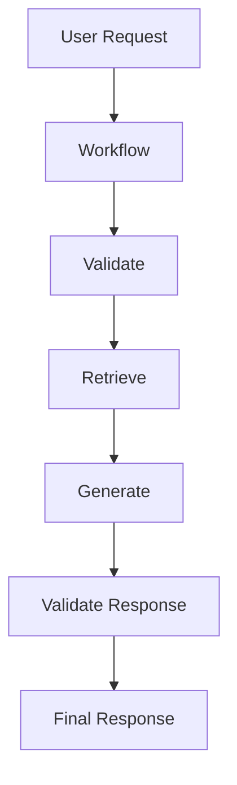

The workflow controls the execution path.

---

# 5. Why Workflows Matter for Enterprise AI

Enterprise AI applications often need:

```text
Predictable Execution
+
Explicit Business Rules
+
Retries
+
Timeouts
+
Human Approval
+
Observability
+
Error Handling
```

A workflow can provide a stronger structure than placing all logic inside a prompt.

---

# 6. Event-Driven Workflow

A useful mental model is:

```text
Event
 ↓
Step
 ↓
Event
 ↓
Step
 ↓
Event
```

For example:

```text
StartEvent
    ↓
RetrieveEvent
    ↓
GenerateEvent
    ↓
ValidateEvent
    ↓
StopEvent
```

The exact event and workflow APIs depend on the LlamaIndex version being used.

---

# 7. Workflow Components

A workflow commonly consists of:

```text
Workflow
 ├── Steps
 ├── Events
 ├── State
 ├── Timeout
 └── Execution Logic
```

Conceptually:

```text
Workflow
   │
   ├── Step A
   │     ↓
   │   Event
   │
   ├── Step B
   │     ↓
   │   Event
   │
   └── Step C
```

---

# 8. Steps

A step represents a unit of workflow execution.

Examples:

```text
validate_request
retrieve_context
generate_answer
validate_response
execute_tool
send_notification
```

A good step should have:

```text
Clear Input
+
Clear Output
+
Limited Responsibility
```

---

# 9. Step Design

Poor:

```text
process_everything()
```

Better:

```text
validate_request()
retrieve_context()
generate_response()
validate_response()
```

Smaller steps improve:

```text
Testing
Observability
Failure Isolation
Reuse
```

---

# 10. Events

Events transport information between workflow stages.

Conceptually:

```text
Step A
 ↓
Event
 ↓
Step B
```

An event may contain:

```text
Query
Context
Tool Result
Validation Result
Error
Metadata
```

---

# 11. Event Flow

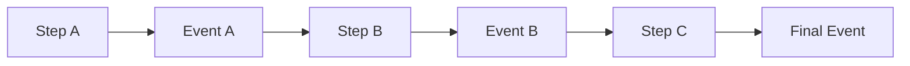

This makes data movement explicit.

---

# 12. Basic Workflow

A simplified conceptual example:

```python
from llama_index.core.workflow import (
    Workflow,
    step,
    StartEvent,
    StopEvent
)


class SimpleWorkflow(Workflow):

    @step
    async def start(
        self,
        ev: StartEvent
    ) -> StopEvent:

        result = "Workflow completed"

        return StopEvent(
            result=result
        )
```

Run conceptually:

```python
workflow = SimpleWorkflow()

result = await workflow.run()

print(result)
```

> The exact API signatures can vary by LlamaIndex version. Verify the current workflow API before using this code directly in production.

---

# 13. Workflow Lifecycle

A workflow execution can be viewed as:

```text
START
  ↓
INITIALIZE
  ↓
EXECUTE STEPS
  ↓
HANDLE EVENTS
  ↓
COMPLETE
```

Or, when an error occurs:

```text
START
  ↓
EXECUTE
  ↓
ERROR
  ↓
RETRY / FAIL / FALLBACK
```

---

# 14. Workflow State

Some workflows require information to persist across multiple steps.

Example:

```text
User Query
Context
Tool Results
Execution Metadata
Validation Results
```

Conceptually:

```text
Workflow State
 ├── query
 ├── context
 ├── tool_results
 └── metadata
```

---

# 15. State vs Event

A useful distinction:

```text
Event
=
Information moving between steps
```

while:

```text
State
=
Information maintained during workflow execution
```

Conceptually:

```text
             Workflow
                 │
        ┌────────┴────────┐
        ▼                 ▼
      Events            State
        │                 │
        ▼                 ▼
    Step-to-Step       Execution
      Data             Context
```

---

# 16. RAG Workflow

A RAG workflow can be represented as:

```text
User Query
    ↓
Validate Query
    ↓
Retrieve Documents
    ↓
Build Context
    ↓
Generate Answer
    ↓
Validate Answer
    ↓
Return Response
```

---

# 17. RAG Workflow Architecture

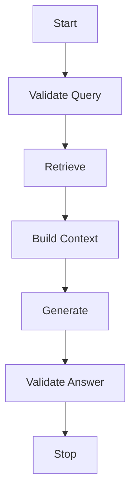

This provides a more explicit execution model than:

```python
query_engine.query(query)
```

---

# 18. LlamaIndex RAG Workflow

Conceptually:

```python
class RAGWorkflow(Workflow):

    @step
    async def retrieve(
        self,
        ev: QueryEvent
    ) -> ContextEvent:

        nodes = retriever.retrieve(
            ev.query
        )

        return ContextEvent(
            query=ev.query,
            nodes=nodes
        )

    @step
    async def generate(
        self,
        ev: ContextEvent
    ) -> StopEvent:

        response = llm.complete(
            build_prompt(
                ev.query,
                ev.nodes
            )
        )

        return StopEvent(
            result=response
        )
```

The exact event definitions and workflow API should be adapted to the LlamaIndex version used by the project.

---

# 19. RAG Workflow with Validation

A production-oriented pipeline can be:

```text
Query
 ↓
Validate
 ↓
Retrieve
 ↓
Check Evidence
 ↓
Build Context
 ↓
Generate
 ↓
Validate Grounding
 ↓
Citations
 ↓
Response
```

---

# 20. RAG Workflow Decision Point

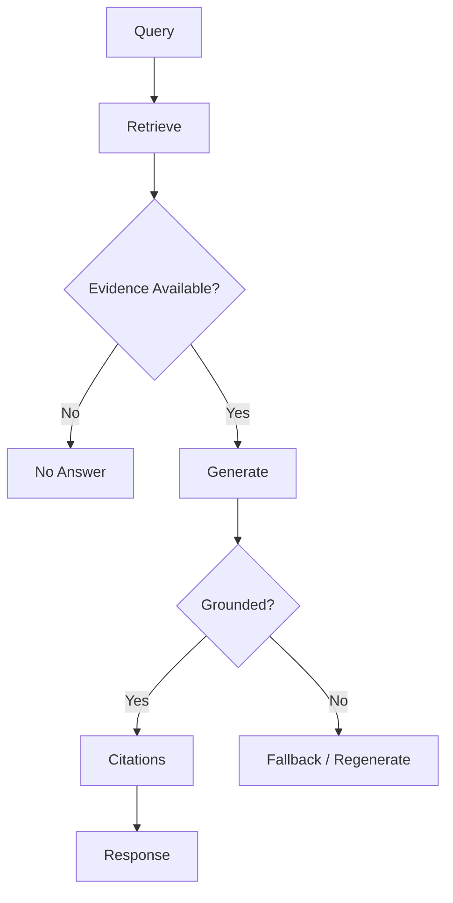

---

# 21. Workflow Branching

Not every workflow follows a single linear path.

Example:

```text
Query
 ↓
Classify
 ├── Knowledge → RAG
 ├── Customer → API
 └── Transaction → Workflow
```

---

# 22. Branching Architecture

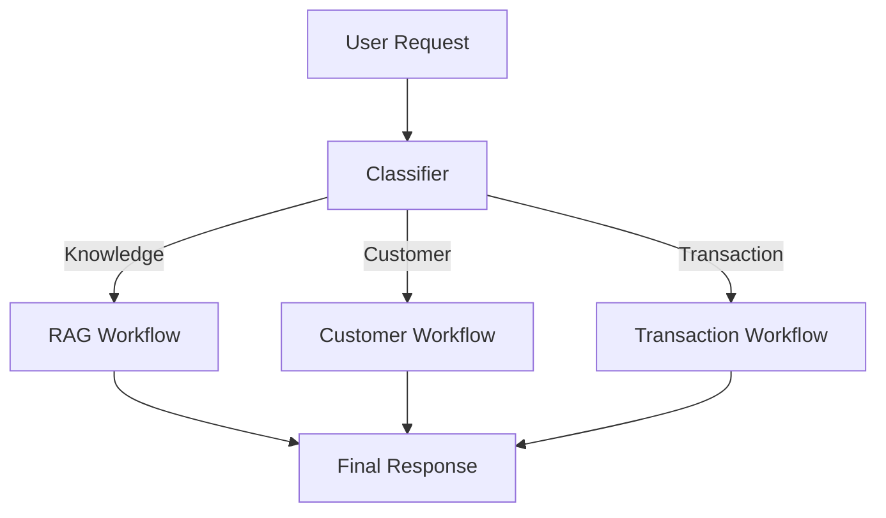

This is often preferable to creating one enormous agent.

---

# 23. Conditional Execution

A workflow can make explicit decisions:

```text
Evidence Available?
        │
   ┌────┴────┐
   │         │
  Yes        No
   │         │
Generate    Fallback
```

This makes critical business logic deterministic.

---

# 24. Parallel Execution

Some tasks can execute independently.

Example:

```text
User Query
    │
 ┌──┴────────────┐
 ▼               ▼
Search Docs   Get Customer
 │               │
 └──────┬────────┘
        ▼
    Combine Data
        ↓
      LLM
```

---

# 25. Parallel Workflow Architecture

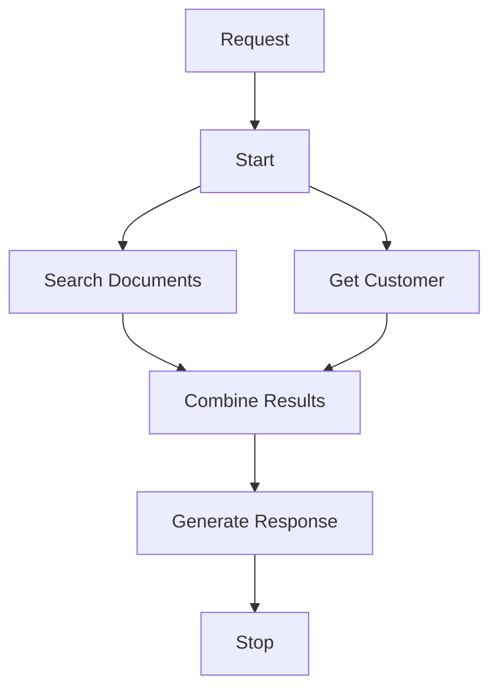

Parallel execution can reduce latency when operations are independent.

---

# 26. Sequential vs Parallel

### Sequential

```text
A
 ↓
B
 ↓
C
```

Latency:

```text
A + B + C
```

### Parallel

```text
   ┌── B ──┐
A ─┤       ├─ C
   └── D ──┘
```

Latency can approach:

```text
A + max(B, D) + C
```

assuming B and D can safely run concurrently.

---

# 27. Workflow Retry

Transient failures may be retried.

Example:

```text
Retrieve
 ↓
Timeout
 ↓
Retry
 ↓
Success
```

But retries should not be automatic for every operation.

---

# 28. Retryable vs Non-Retryable

### Retryable

```text
Temporary Network Failure
HTTP 503
Transient Timeout
Temporary Dependency Failure
```

### Non-Retryable

```text
Invalid Input
Authorization Failure
Missing Required Data
Business Rule Violation
```

---

# 29. Retry Architecture

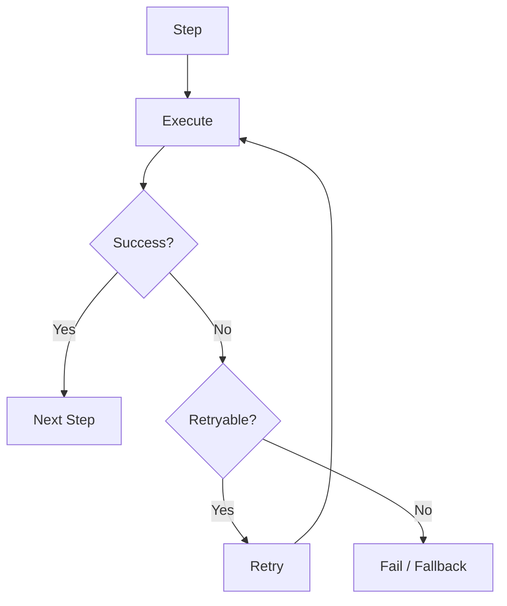

---

# 30. Exponential Backoff

For transient dependencies:

```text
Retry 1 → 100ms
Retry 2 → 200ms
Retry 3 → 400ms
Retry 4 → 800ms
```

Production systems should usually include:

```text
Maximum Retries
Maximum Delay
Jitter
```

to avoid synchronized retry storms.

---

# 31. Timeouts

Every external operation should have an explicit timeout.

```text
Workflow
   ↓
API Call
   ↓
Timeout
   ↓
Fallback
```

Avoid:

```text
Workflow
 ↓
API
 ↓
Wait Forever
```

---

# 32. Workflow Timeout

A production workflow can have:

```text
Maximum Workflow Duration
```

and individual steps can have:

```text
Step Timeout
```

Example:

```text
Workflow Timeout = 30s

Retrieve Timeout = 5s
API Timeout      = 3s
LLM Timeout      = 15s
```

The actual values should be based on service-level objectives.

---

# 33. Error Handling

Errors should be explicit.

```text
Validation Error
Retrieval Error
LLM Error
Tool Error
Timeout
Authorization Failure
Dependency Failure
```

A workflow can route these errors appropriately.

---

# 34. Error Workflow

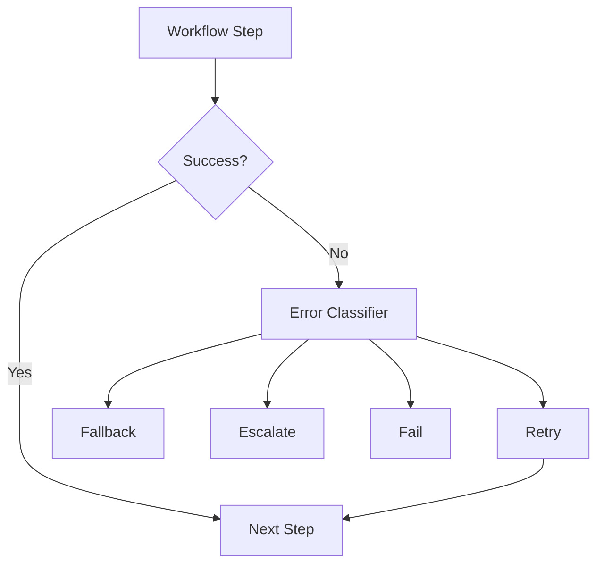

---

# 35. Fallback

A workflow can provide deterministic fallback behavior.

Example:

```text
Primary LLM
 ↓
Failure
 ↓
Fallback LLM
```

or:

```text
Semantic Search
 ↓
Failure
 ↓
Keyword Search
```

or:

```text
Agent Tool
 ↓
Failure
 ↓
Human Escalation
```

---

# 36. Human Approval

Sensitive workflows may contain an approval stage.

Example:

```text
Request
 ↓
Analyze
 ↓
Prepare Action
 ↓
Human Approval
 ↓
Execute
 ↓
Confirm
```

---

# 37. Human Approval Architecture

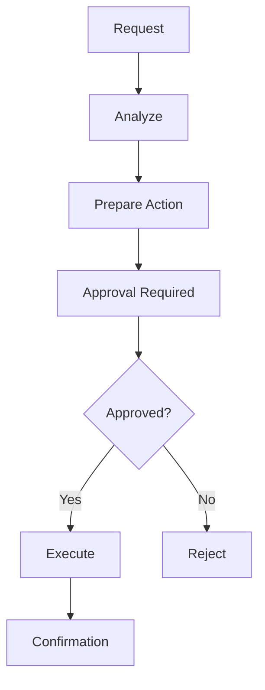

Human-in-the-loop becomes particularly important for:

```text
Financial Operations
Destructive Operations
Sensitive Data
External Communications
High-Risk Decisions
```

---

# 38. Workflow + Tools

A workflow can orchestrate tool execution explicitly.

```text
Request
 ↓
Select Capability
 ↓
Validate Tool Input
 ↓
Authorize
 ↓
Execute Tool
 ↓
Validate Result
 ↓
Continue
```

---

# 39. Workflow + Tool Architecture

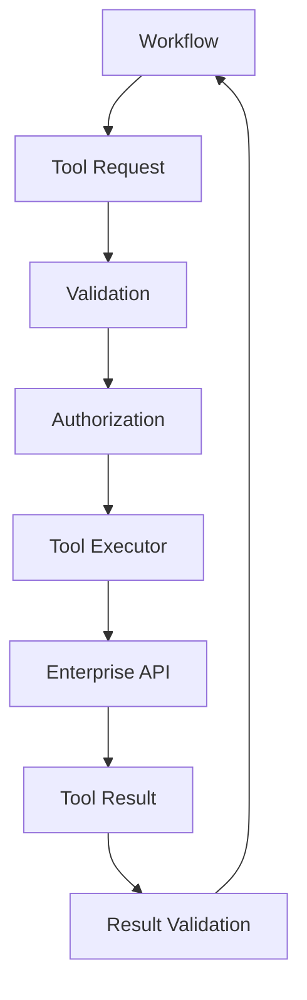

---

# 40. Workflow + Agent

Workflows and agents can coexist.

A useful pattern is:

```text
Workflow
    ↓
Agent
    ↓
Dynamic Tool Selection
    ↓
Workflow Continues
```

The workflow controls the overall lifecycle while the agent handles a bounded decision-making stage.

---

# 41. Workflow + Agent Architecture

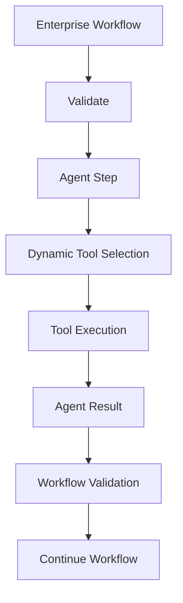

This is often more controllable than allowing the agent to own the entire business process.

---

# 42. Workflow + RAG + Agent

A more advanced application may use:

```text
Request
 ↓
Workflow
 ↓
Agent
 ↓
RAG Tool
 ↓
Enterprise API
 ↓
Validation
 ↓
Workflow
```

Architecture:

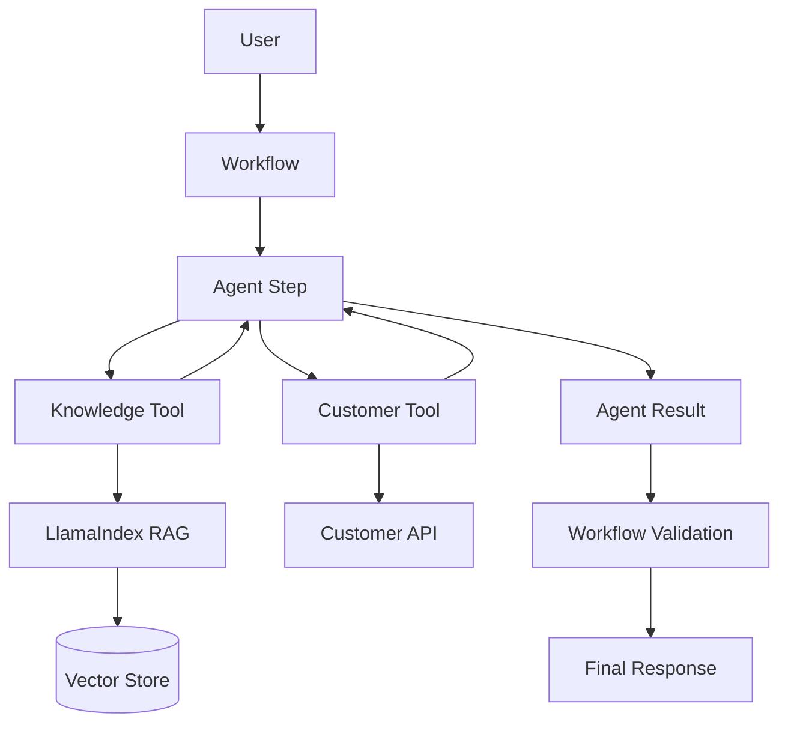

---

# 43. State Management

State may contain:

```text
Request ID
User ID
Tenant ID
Query
Retrieved Nodes
Tool Results
Approval Status
Execution Metadata
```

Security-sensitive state should be controlled carefully.

---

# 44. State Example

Conceptually:

```python
state = {
    "request_id": "REQ-1001",
    "tenant_id": "tenant-001",
    "query": "...",
    "retrieved_nodes": [],
    "tool_results": [],
    "approval_status": "PENDING"
}
```

Avoid storing secrets or unnecessary sensitive information in workflow state.

---

# 45. State Store

For long-running workflows, state may need external persistence:

```text
Workflow
 ↓
State Store
```

Possible technologies include:

```text
Database
Redis
Durable Workflow Store
Object Storage
```

The appropriate choice depends on:

```text
Durability
Latency
Scale
Recovery Requirements
```

---

# 46. Long-Running Workflow

A long-running enterprise workflow might be:

```text
Start
 ↓
Retrieve
 ↓
Analyze
 ↓
Wait for Approval
 ↓
Resume
 ↓
Execute
 ↓
Notify
```

The workflow may need to survive:

```text
Process Restart
Service Deployment
Temporary Dependency Failure
Human Delay
```

---

# 47. Workflow Persistence

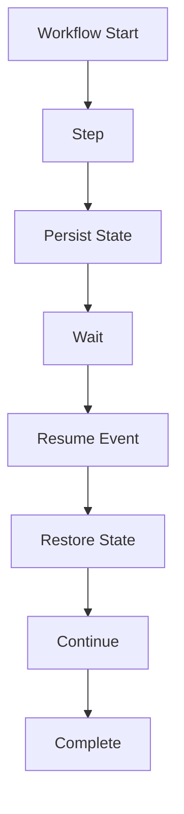

---

# 48. Workflow Idempotency

A workflow may be retried or resumed.

Therefore operations should avoid duplicate side effects.

Example:

```text
Workflow Retry
 ↓
Payment Tool
 ↓
Duplicate Payment
```

Prevent with:

```text
Idempotency Key
+
Execution ID
+
Business Operation ID
```

---

# 49. Workflow Idempotency Architecture

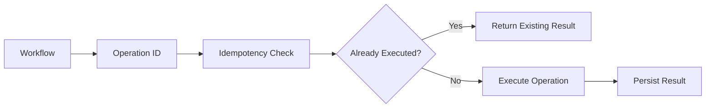

---

# 50. Workflow Observability

Track:

```text
Workflow ID
Execution ID
Tenant
Step
Event
Duration
Status
Errors
Retries
Tool Calls
LLM Calls
Token Usage
```

---

# 51. Workflow Trace

Example:

```text
Workflow: customer-support

Execution: exec-123

├── validate_request
│   └── 12ms
│
├── retrieve_context
│   └── 145ms
│
├── agent_step
│   ├── knowledge_search
│   └── customer_lookup
│
├── validate_response
│   └── 50ms
│
└── completed
```

This makes complex executions debuggable.

---

# 52. Workflow Metrics

Useful metrics:

```text
Workflow Success Rate
Workflow Failure Rate
Workflow Duration
Step Duration
Retry Count
Timeout Count
LLM Calls
Tool Calls
Token Usage
Cost
```

Track metrics by:

```text
Workflow
Version
Tenant
Environment
```

where useful.

---

# 53. Workflow Logging

Good:

```text
workflow_id=WF-123
execution_id=EXEC-456
step=retrieve_context
duration_ms=142
status=success
```

Avoid logging:

```text
Passwords
API Keys
Access Tokens
Sensitive Customer Data
```

unless explicitly required and securely handled.

---

# 54. Workflow Versioning

Workflows evolve.

Example:

```text
customer-support:v1
customer-support:v2
```

Versioning helps maintain:

```text
Reproducibility
Rollback
Experimentation
Debugging
```

---

# 55. Workflow Deployment

A production deployment pipeline can be:

```text
Code
 ↓
Unit Tests
 ↓
Workflow Tests
 ↓
Integration Tests
 ↓
Security Tests
 ↓
Performance Tests
 ↓
Deploy
 ↓
Observe
```

---

# 56. Workflow Testing

Test workflows at several levels.

### Unit

```text
Individual Steps
Event Validation
State Updates
```

### Integration

```text
Workflow + LLM
Workflow + Tools
Workflow + RAG
```

### End-to-End

```text
User Request
 ↓
Complete Workflow
 ↓
Expected Outcome
```

---

# 57. Workflow Test Example

```text
Input:

"Find the customer policy and summarize it."

Expected:

1. Validate
2. Retrieve
3. Generate
4. Validate
5. Return
```

Test:

```text
Observed Steps
=
Expected Steps
```

for deterministic workflow sections.

---

# 58. Failure Testing

Test:

```text
LLM Timeout
Retriever Failure
Tool Timeout
Invalid Input
Unauthorized User
Empty Retrieval
Malformed Tool Result
Dependency Failure
```

Expected behavior should be explicitly defined.

---

# 59. Workflow Quality Gates

A deployment may require:

```text
Unit Tests = PASS
Integration Tests = PASS
Security Tests = PASS
Workflow Evaluation >= Target
Latency <= Target
Cost <= Target
```

Only then:

```text
Deploy
```

---

# 60. Workflow Security

Security controls should include:

```text
Authentication
Authorization
Tenant Isolation
Input Validation
Output Validation
Tool Authorization
Secret Management
Audit Logging
Data Privacy
```

Security should be enforced by the application and infrastructure, not only by LLM prompts.

---

# 61. Workflow Data Privacy

Workflow state and events can contain:

```text
Customer Data
Documents
Tool Results
Conversation Data
Business Information
```

Therefore:

```text
Minimize Data
+
Encrypt Sensitive State
+
Restrict Access
+
Control Retention
+
Audit Access
```

---

# 62. Workflow Guardrails

Guardrails can exist at multiple stages:

```text
Input Guardrail
      ↓
Workflow
      ↓
Retrieval Guardrail
      ↓
Tool Guardrail
      ↓
Output Guardrail
```

This creates defense in depth.

---

# 63. Workflow Guardrail Architecture

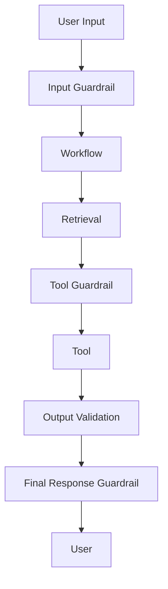

---

# 64. Workflow Cost Optimization

Potential optimizations:

```text
Avoid Unnecessary LLM Calls
Parallelize Independent Steps
Cache Stable Retrieval
Use Smaller Models for Classification
Limit Context
Limit Tool Calls
Use Deterministic Logic Where Possible
```

---

# 65. Workflow Latency

End-to-end latency:

```text
Workflow Latency
=
Step 1
+
Step 2
+
Step 3
...
```

For parallel branches:

```text
Latency
≈
Critical Path
```

Therefore workflow design directly influences application performance.

---

# 66. Critical Path

Example:

```text
Validate ──→ Retrieve ──→ Generate
                │
                └── Customer API
```

If:

```text
Retrieve = 200ms
Customer API = 500ms
```

and both are independent:

```text
Parallel
```

can reduce latency compared with:

```text
Retrieve
 ↓
Customer API
```

---

# 67. Workflow Composition

Large workflows can be composed from smaller workflows:

```text
Customer Workflow
       │
       ├── Authentication
       ├── Retrieval
       ├── Customer Lookup
       └── Response
```

Another:

```text
Transaction Workflow
       │
       ├── Validation
       ├── Risk Check
       ├── Approval
       └── Execution
```

Composition improves modularity.

---

# 68. Workflow as a Capability

An enterprise application can expose:

```text
CustomerSupportWorkflow
TransactionWorkflow
ResearchWorkflow
DocumentAnalysisWorkflow
```

as application-level capabilities.

This is preferable to embedding workflow logic inside REST controllers.

---

# 69. Application Architecture

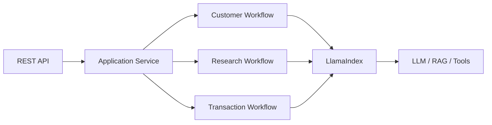

---

# 70. Framework Boundary

Keep framework-specific code behind appropriate boundaries.

Instead of:

```text
Controller
 ↓
LlamaIndex Workflow
 ↓
Everything
```

prefer:

```text
Controller
 ↓
Application Service
 ↓
Workflow Capability
 ↓
LlamaIndex Adapter
```

This reduces framework coupling.

---

# 71. Ports and Adapters

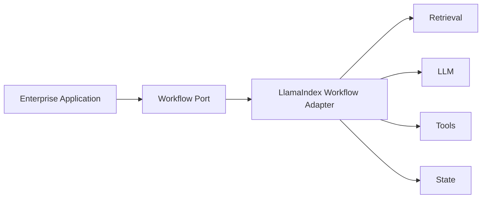

This allows framework implementation details to remain replaceable.

---

# 72. Workflow vs Agent vs RAG

| Capability | RAG | Workflow | Agent |
|---|---:|---:|---:|
| Retrieval | Strong | Strong | Possible |
| Fixed execution | Limited | Strong | Weak |
| Dynamic tool selection | No | Possible | Strong |
| Predictability | High | High | Lower |
| Explicit branching | Limited | Strong | Dynamic |
| Human approval | External | Strong | Possible |
| Observability | Moderate | Strong | More complex |
| Best for | Knowledge | Business Processes | Dynamic Tasks |

These patterns are complementary rather than mutually exclusive.

---

# 73. When to Use a Workflow

Use a workflow when you need:

```text
Explicit Steps
+
Deterministic Branching
+
Controlled Tool Execution
+
Retries
+
Timeouts
+
Human Approval
+
Auditable Execution
```

---

# 74. When to Use an Agent

Use an agent when:

```text
The execution path is not known in advance
```

and the system needs:

```text
Dynamic Tool Selection
+
Adaptive Decision-Making
```

---

# 75. When to Use Both

A strong enterprise pattern is:

```text
Workflow
 ↓
Bounded Agent
 ↓
Tool Selection
 ↓
Workflow Continues
```

This combines:

```text
Agent Flexibility
+
Workflow Control
```

---

# 76. Common Workflow Anti-Patterns

## Anti-Pattern 1 — One Giant Workflow

```text
Workflow
 └── 5000 lines
```

Problems:

```text
Hard to Test
Hard to Debug
Hard to Change
```

Prefer:

```text
Small Steps
+
Composable Workflows
```

---

# 77. Anti-Pattern 2 — Business Logic in Prompts

Avoid:

```text
Critical Business Rule
 ↓
Prompt Only
```

Prefer:

```text
Prompt
+
Application Logic
+
Policy Engine
```

---

# 78. Anti-Pattern 3 — Unlimited Retries

Avoid:

```text
Failure
 ↓
Retry
 ↓
Retry
 ↓
Retry
 ↓
...
```

Use:

```text
Maximum Retries
+
Backoff
+
Jitter
```

---

# 79. Anti-Pattern 4 — No Timeout

Avoid:

```text
Workflow
 ↓
Dependency
 ↓
Wait Forever
```

Use:

```text
Step Timeout
+
Workflow Timeout
```

---

# 80. Anti-Pattern 5 — Non-Idempotent Side Effects

Avoid:

```text
Retry
 ↓
Duplicate Payment
```

Use:

```text
Idempotency Key
+
Operation ID
```

---

# 81. Anti-Pattern 6 — Hidden State

Avoid:

```text
Important Business State
 ↓
Only Inside Agent Context
```

Prefer:

```text
Authoritative State
 ↓
Enterprise Database
```

---

# 82. Production Workflow Architecture

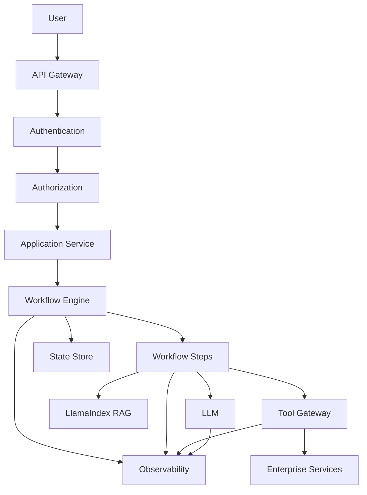

---

# 83. Production Workflow Checklist

## Architecture

- [ ] Explicit workflow boundaries
- [ ] Small steps
- [ ] Clear events
- [ ] Explicit state
- [ ] Controlled branching
- [ ] Composable workflows

## Reliability

- [ ] Timeouts
- [ ] Retry policies
- [ ] Backoff
- [ ] Idempotency
- [ ] Fallbacks
- [ ] Error classification

## Security

- [ ] Authentication
- [ ] Authorization
- [ ] Tenant isolation
- [ ] Secret management
- [ ] Data privacy
- [ ] Audit

## AI

- [ ] LLM timeout
- [ ] Token limits
- [ ] Model fallback
- [ ] RAG evaluation
- [ ] Tool evaluation

## Operations

- [ ] Tracing
- [ ] Metrics
- [ ] Structured logging
- [ ] Cost tracking
- [ ] Workflow versioning
- [ ] Deployment strategy

---

# 84. Key Takeaways

- LlamaIndex Workflows provide a structured way to orchestrate AI application logic.
- Workflows can model execution as steps and events.
- Events transport information between workflow stages.
- State maintains execution information across steps.
- Workflows provide more explicit control than unrestricted agent loops.
- RAG can be implemented as a workflow.
- Tools can be orchestrated inside workflows.
- Agents can operate as bounded steps inside workflows.
- Conditional branching makes business logic explicit.
- Parallel execution can reduce latency.
- Retry policies should distinguish transient from permanent failures.
- Timeouts should exist at both step and workflow levels.
- Side-effecting operations should be idempotent.
- Human approval can be incorporated into sensitive workflows.
- Long-running workflows may require durable state.
- Workflow observability should expose execution, steps, events, tools, and errors.
- Workflow versioning improves reproducibility and rollback.
- Security controls should be enforced outside prompts.
- Framework-specific workflow code should remain behind appropriate application boundaries.
- Workflows are especially useful for predictable, auditable enterprise processes.
- Agents are better suited to dynamic task execution.
- Combining workflows with bounded agents can provide both control and flexibility.

---

# 📝 Quick Revision Notes

## Workflow

```text
Workflow
=
Steps
+
Events
+
State
+
Execution Control
```

---

## Workflow Flow

```text
Start
 ↓
Step
 ↓
Event
 ↓
Step
 ↓
Event
 ↓
Stop
```

---

## Production Workflow

```text
Authenticate
 ↓
Authorize
 ↓
Validate
 ↓
Execute
 ↓
Validate Result
 ↓
Audit
 ↓
Respond
```

---

## Workflow + RAG

```text
Query
 ↓
Retrieve
 ↓
Context
 ↓
Generate
 ↓
Validate
 ↓
Cite
 ↓
Response
```

---

## Workflow + Agent

```text
Workflow
 ↓
Bounded Agent
 ↓
Tool Selection
 ↓
Tool Execution
 ↓
Agent Result
 ↓
Workflow
```

---

## Workflow Reliability

```text
Timeout
+
Retry
+
Backoff
+
Idempotency
+
Fallback
=
Reliable Workflow
```

---

# ❓ Interview Questions

## Beginner

1. What is a LlamaIndex Workflow?
2. What is a workflow step?
3. What is an event?
4. What is workflow state?
5. Why are workflows useful in AI applications?
6. What is the difference between a workflow and an agent?
7. How can RAG be implemented as a workflow?
8. What is conditional workflow execution?
9. What is workflow timeout?
10. Why is workflow observability important?

## Intermediate

11. Explain an event-driven AI workflow.
12. How would you pass information between workflow steps?
13. How would you implement retries?
14. Which errors should be retried?
15. How would you implement workflow branching?
16. How would you execute independent steps in parallel?
17. How would you implement human approval?
18. How would you persist workflow state?
19. How would you make workflow operations idempotent?
20. How would you integrate LlamaIndex RAG into a workflow?
21. How would you integrate tools into a workflow?
22. How would you handle LLM failures?
23. How would you monitor workflow execution?
24. How would you test a workflow?

## Advanced

25. Design a production LlamaIndex Workflow architecture.
26. How would you design a long-running AI workflow?
27. How would you handle workflow recovery after service restart?
28. How would you implement durable workflow state?
29. How would you prevent duplicate side effects during workflow retries?
30. How would you combine workflows and agents?
31. When would you choose a workflow instead of an agent?
32. How would you design workflow versioning?
33. How would you implement workflow-level cost controls?
34. How would you trace a multi-step AI workflow?
35. How would you design a workflow with parallel RAG and API calls?
36. How would you implement human approval for high-risk operations?
37. How would you secure workflow state?
38. How would you prevent secrets from entering workflow events?
39. How would you design workflow quality gates?
40. How would you debug a workflow that intermittently fails?
41. How would you design a multi-tenant workflow platform?
42. How would you isolate framework-specific workflow code?
43. How would you combine RAG, tools, agents, and workflows?
44. How would you design a workflow for high availability?
45. How would you balance workflow determinism with agent flexibility?

---

# 🛠️ Practical Exercise

Build a customer-support workflow.

The workflow should:

```text
1. Accept a customer question
2. Validate the request
3. Retrieve relevant enterprise documentation
4. Retrieve customer information
5. Generate a response
6. Validate the response
7. Add citations
8. Return the result
```

Architecture:

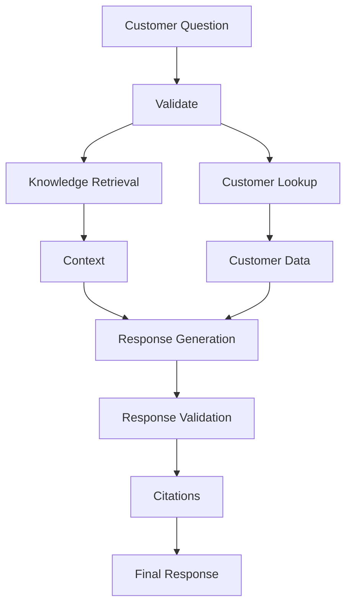

---

# 🧪 Failure Testing Exercise

Simulate:

```text
Retriever Timeout
Customer API Timeout
LLM Timeout
Empty Retrieval
Unauthorized Customer
Invalid Request
Malformed Tool Result
```

For each case define:

```text
Expected Error
+
Retry?
+
Fallback?
+
User Response
```

---

# 🚀 Production Exercise

Extend the workflow with:

```text
Authentication
Authorization
Tenant Isolation
Tool Gateway
Retry
Timeout
Idempotency
Audit
Observability
Cost Tracking
```

Architecture:

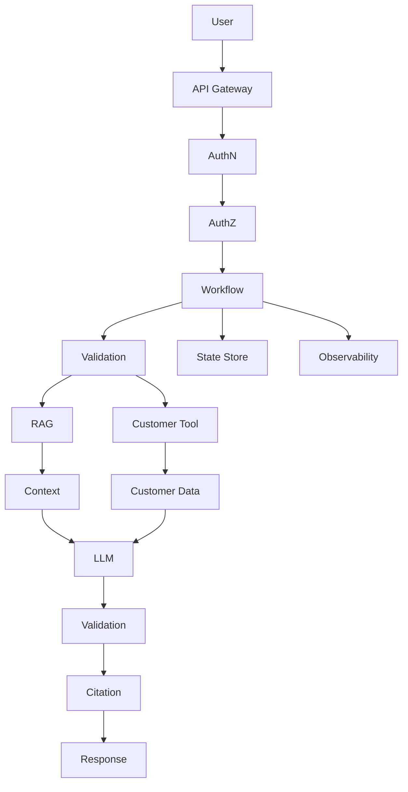

---

# 📊 Evaluation Exercise

Create at least:

```text
50 Workflow Test Cases
```

Measure:

```text
Workflow Success Rate
Step Success Rate
Average Workflow Latency
P95 Workflow Latency
Retry Rate
Timeout Rate
Tool Failure Rate
LLM Failure Rate
Cost / Execution
```

For deterministic workflow sections, also validate:

```text
Expected Step Sequence
Expected Branch
Expected Tool
Expected Final State
```

---

# 🏢 Enterprise Architecture Challenge

Design a platform supporting:

```text
500 Tenants
Multiple AI Workflows
LlamaIndex RAG
Agent Steps
100+ Tools
Human Approval
Long-Running Executions
High Availability
```

The architecture should include:

```text
API Gateway
Authentication
Authorization
Workflow Runtime
State Store
Tool Gateway
RAG Layer
LLM Gateway
Observability
Audit
Evaluation
```

---

# 🧠 Architecture Challenge

Design:

```text
                              User
                               │
                               ▼
                         API Gateway
                               │
                               ▼
                       Authentication
                               │
                               ▼
                        Authorization
                               │
                               ▼
                       Application API
                               │
                               ▼
                       Workflow Runtime
                               │
               ┌───────────────┼────────────────┐
               ▼               ▼                ▼
          Validation        RAG Step         Agent Step
                               │                │
                               ▼                ▼
                         LlamaIndex          Tool Gateway
                               │                │
                               ▼                ▼
                         Vector Store      Enterprise APIs
               └───────────────┬────────────────┘
                               ▼
                         Result Validation
                               │
                               ▼
                           Approval
                               │
                               ▼
                           Response

             State Store ← Workflow → Observability
```

Design the system for:

```text
Reliability
Security
Scalability
Auditability
Cost Control
Recoverability
```

---

# 📚 References & Further Reading

Recommended areas for further study:

- LlamaIndex Workflows
- LlamaIndex Events
- LlamaIndex Workflow Steps
- LlamaIndex Workflow State
- LlamaIndex RAG Workflows
- LlamaIndex Agent Workflows
- LlamaIndex Tool Integration
- Event-Driven Architecture
- Durable Workflow Patterns
- Human-in-the-Loop Workflows
- Workflow Observability
- Workflow Reliability
- Idempotent Distributed Operations
- AI Workflow Evaluation
- Enterprise AI Orchestration

> LlamaIndex Workflow APIs evolve over time. Before implementing production code, verify the current workflow classes, event types, decorators, state APIs, concurrency behavior, timeout handling, and execution semantics against the official documentation for the version used by your project.

---

## 🧭 Chapter Navigation

⬅️ **Previous:** [13. LlamaIndex Agents and Tools](13-llamaindex-agents-and-tools.md)

📚 **Part VIII Index:** [AI Engineering Frameworks & Tooling](index.md)

➡️ **Next:** [15. LlamaIndex Production Patterns](15-llamaindex-production-patterns.md)

---

> **Enterprise AI Engineering Handbook**
>
> *Building Production-Grade Enterprise AI Systems — One Chapter at a Time.*