# 15 — LlamaIndex Production Patterns

> Learn how to transform LlamaIndex applications into production-ready Enterprise AI systems using modular architecture, reliability patterns, security controls, observability, evaluation, scalability, cost optimization, and operational best practices.

---

## 📖 Overview

Building a prototype with LlamaIndex is relatively straightforward:

```text
Documents
    ↓
Index
    ↓
Retriever
    ↓
LLM
    ↓
Answer
```

Production Enterprise AI systems are considerably more complex.

They must address:

```text
Security
Reliability
Scalability
Observability
Evaluation
Cost
Latency
Data Privacy
Multi-Tenancy
Failure Recovery
Deployment
Governance
```

A production-oriented LlamaIndex architecture therefore looks more like:

```text
                         User
                           │
                           ▼
                     API Gateway
                           │
                           ▼
                 Authentication
                           │
                           ▼
                  Authorization
                           │
                           ▼
                  Application API
                           │
                           ▼
                  AI Application
                           │
             ┌─────────────┼─────────────┐
             ▼             ▼             ▼
           RAG           Agent        Workflow
             │             │             │
             └─────────────┼─────────────┘
                           ▼
                    LlamaIndex Layer
                           │
             ┌─────────────┼─────────────┐
             ▼             ▼             ▼
          Retrieval        LLM          Tools
             │             │             │
             ▼             ▼             ▼
        Vector Store   Model Provider  Services
                           │
                           ▼
                    Observability
```

The goal is not simply to "use LlamaIndex."

The goal is to use LlamaIndex as an **AI engineering capability inside a well-designed enterprise architecture**.

---

# 🎯 Learning Objectives

After completing this chapter, you will be able to:

- Understand production patterns for LlamaIndex applications
- Separate framework code from business logic
- Design modular AI application architecture
- Build production RAG services
- Design production agent integrations
- Design workflow-based AI systems
- Implement security boundaries
- Design multi-tenant AI applications
- Apply reliability patterns
- Design retries and timeouts
- Implement caching strategies
- Optimize latency and cost
- Design observability
- Implement evaluation and regression testing
- Manage model and index versions
- Design deployment strategies
- Handle failures and fallbacks
- Apply enterprise governance
- Design scalable LlamaIndex platforms
- Identify common production anti-patterns

---

# 1. Prototype vs Production

A prototype:

```text
documents/
    ↓
LlamaIndex
    ↓
LLM
    ↓
Answer
```

A production application:

```text
User
 ↓
API Gateway
 ↓
Authentication
 ↓
Authorization
 ↓
Tenant Resolution
 ↓
Application Service
 ↓
AI Capability
 ↓
Retrieval / Agent / Workflow
 ↓
LLM / Tools
 ↓
Validation
 ↓
Observability
 ↓
Response
```

The difference is not only code quality.

It is **system architecture**.

---

# 2. Production Architecture Principles

A production LlamaIndex application should generally follow:

```text
Separation of Concerns
+
Explicit Security Boundaries
+
Controlled Dependencies
+
Observable Execution
+
Testable Components
+
Versioned Configuration
+
Failure Isolation
```

---

# 3. Recommended Enterprise Architecture

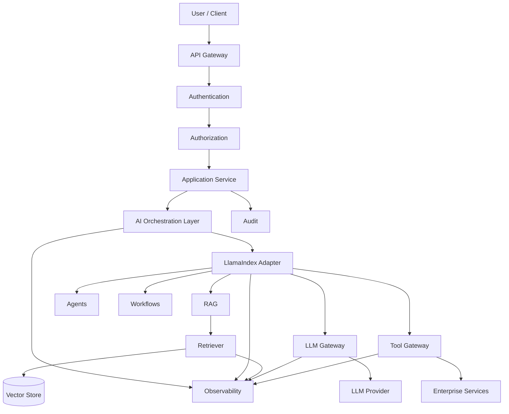

---

# 4. Framework Boundary

Avoid spreading LlamaIndex-specific objects throughout the application.

Poor architecture:

```text
Controller
 ↓
LlamaIndex QueryEngine
 ↓
LlamaIndex Node
 ↓
LlamaIndex Response
```

Better:

```text
Controller
 ↓
Application Service
 ↓
Knowledge Service
 ↓
LlamaIndex Adapter
 ↓
Retriever
```

The application should depend on capabilities rather than framework implementation details.

---

# 5. Capability-Based Architecture

Example:

```python
class KnowledgeService:

    def answer(
        self,
        query: str,
        tenant_id: str
    ):
        ...
```

The implementation may use:

```text
LlamaIndex
```

but the rest of the application only knows:

```text
KnowledgeService
```

This reduces framework coupling.

---

# 6. Ports and Adapters

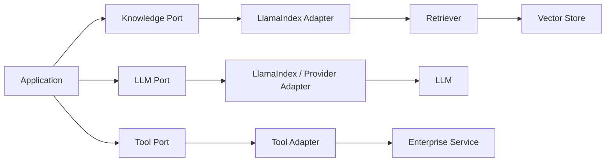

This architecture allows LlamaIndex to remain replaceable.

---

# 7. RAG Service Boundary

Instead of:

```python
query_engine.query(query)
```

directly inside controllers, use:

```python
class EnterpriseKnowledgeService:

    def answer(
        self,
        query,
        tenant_id,
        filters=None
    ):
        ...
```

Internally:

```text
KnowledgeService
 ↓
Authorization
 ↓
Retriever
 ↓
Context Builder
 ↓
LLM
 ↓
Validation
 ↓
Citation
```

---

# 8. Production RAG Pipeline

```text
Request
 ↓
Authentication
 ↓
Authorization
 ↓
Tenant Resolution
 ↓
Query Validation
 ↓
Metadata Filtering
 ↓
Retrieval
 ↓
Ranking
 ↓
Context Construction
 ↓
Generation
 ↓
Grounding Validation
 ↓
Citation
 ↓
Response
```

---

# 9. Production Agent Boundary

Similarly, avoid exposing framework-specific agent objects throughout the application.

Use:

```python
class SupportAgentService:

    def execute(
        self,
        request,
        context
    ):
        ...
```

Internally:

```text
Application
 ↓
Agent Service
 ↓
LlamaIndex Agent
 ↓
Tool Gateway
 ↓
Enterprise Services
```

---

# 10. Production Workflow Boundary

```python
class CustomerSupportWorkflow:

    async def execute(
        self,
        request
    ):
        ...
```

Internally:

```text
Workflow
 ↓
Validation
 ↓
RAG
 ↓
Agent
 ↓
Tools
 ↓
Validation
 ↓
Response
```

This keeps business capabilities separate from framework APIs.

---

# 11. Configuration Management

Do not hard-code production configuration throughout the application.

Configuration may include:

```text
LLM Provider
Model
Temperature
Embedding Model
Top-K
Similarity Threshold
Chunk Size
Chunk Overlap
Prompt Version
Index Version
Timeout
Retry Count
```

Example:

```python
rag_config = {
    "top_k": 5,
    "similarity_threshold": 0.75,
    "request_timeout_seconds": 20,
    "max_retries": 2
}
```

Production configuration should normally be externally managed.

---

# 12. Configuration Versioning

Important AI configuration should be versioned.

Example:

```text
RAG Configuration v1
RAG Configuration v2
RAG Configuration v3
```

Track:

```text
Embedding Model
Retriever
Top-K
Prompt
LLM
Index
Response Strategy
```

This enables reproducible experiments.

---

# 13. Environment Separation

Maintain separate configurations for:

```text
Development
Testing
Staging
Production
```

Example:

```text
dev
 ↓
staging
 ↓
production
```

Never assume that production configuration is identical to development configuration.

---

# 14. Secrets Management

Never place secrets inside:

```text
Source Code
Prompts
Agent State
Tool Results
Logs
Git Repository
```

Use:

```text
Application
 ↓
Secret Manager
 ↓
Credential
 ↓
External Service
```

---

# 15. Secret Architecture

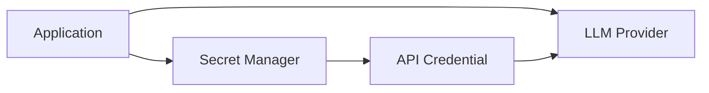

The LLM should never receive:

```text
API Keys
Access Tokens
Database Passwords
Cloud Credentials
```

unless explicitly required by a tightly controlled use case.

---

# 16. Authentication

The application should authenticate users before AI processing.

```text
User
 ↓
API Gateway
 ↓
Authentication
 ↓
AI Application
```

Possible identity mechanisms include:

```text
OAuth2
OIDC
JWT
Enterprise SSO
```

---

# 17. Authorization

Authentication answers:

```text
Who are you?
```

Authorization answers:

```text
What are you allowed to access?
```

A production RAG application needs both.

---

# 18. Authorization Before Retrieval

Critical pattern:

```text
User
 ↓
Authentication
 ↓
Authorization
 ↓
Tenant / ACL Resolution
 ↓
Retriever
```

Do not retrieve unauthorized data and expect the LLM to hide it later.

---

# 19. Multi-Tenant Architecture

For a multi-tenant Enterprise AI system:

```text
User
 ↓
Tenant Resolution
 ↓
Authorization
 ↓
Tenant Filter
 ↓
RAG / Agent / Workflow
```

Example:

```python
context = {
    "tenant_id": authenticated_tenant_id
}
```

The tenant identity should come from trusted application context.

---

# 20. Multi-Tenant RAG

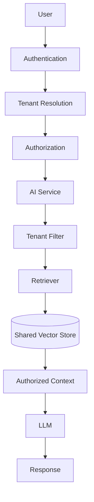

---

# 21. Tenant Isolation Strategies

Possible strategies include:

```text
Separate Database
Separate Collection
Separate Namespace
Metadata Filtering
Hybrid Isolation
```

The correct strategy depends on:

```text
Security Requirements
Tenant Size
Cost
Operational Complexity
Compliance
```

---

# 22. Metadata Filtering

Example:

```python
filters = {
    "tenant_id": tenant_id,
    "department": "finance",
    "classification": "internal"
}
```

Retrieval becomes:

```text
Query
+
Security Filters
 ↓
Retriever
```

---

# 23. Defense in Depth

Do not rely on one security mechanism.

Use:

```text
Authentication
+
Authorization
+
Tenant Isolation
+
Metadata Filtering
+
Tool Authorization
+
Output Validation
+
Audit
```

---

# 24. Reliability Engineering

Production AI systems must expect failures.

Possible failures:

```text
LLM Timeout
Vector Store Failure
Database Failure
Tool Failure
Network Failure
Rate Limit
Malformed Response
Service Deployment
```

The system should degrade gracefully.

---

# 25. Timeout Strategy

Set explicit timeouts.

Example:

```python
timeouts = {
    "retrieval": 3,
    "llm": 15,
    "tool": 5,
    "workflow": 30
}
```

Values should be based on actual service-level objectives.

---

# 26. Retry Strategy

Retries should be limited.

```text
Request
 ↓
Failure
 ↓
Retry
 ↓
Failure
 ↓
Fallback
```

Use:

```text
Maximum Retries
+
Exponential Backoff
+
Jitter
```

---

# 27. Retry Classification

### Retryable

```text
HTTP 503
Transient Network Error
Temporary Timeout
Temporary Dependency Failure
```

### Non-Retryable

```text
Invalid Input
Authorization Failure
Business Rule Violation
Malformed Request
```

---

# 28. Retry Architecture

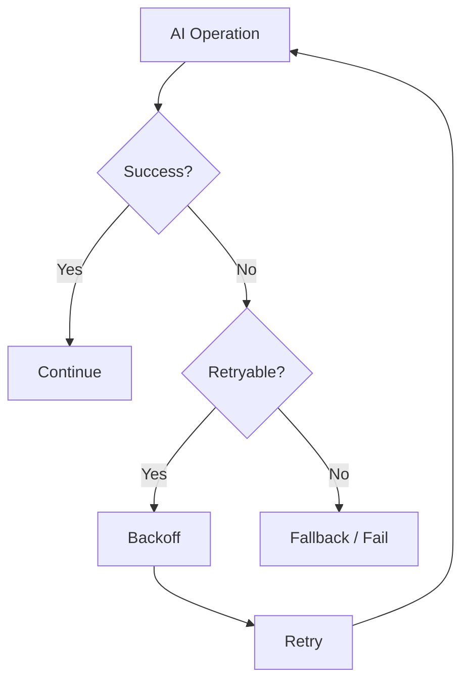

---

# 29. Circuit Breaker

Repeated dependency failures can cause cascading failures.

Conceptually:

```text
Application
 ↓
Circuit Breaker
 ↓
LLM Provider
```

States:

```text
CLOSED
 ↓
OPEN
 ↓
HALF-OPEN
 ↓
CLOSED
```

The circuit breaker can prevent continuously calling an unhealthy dependency.

---

# 30. Circuit Breaker Architecture

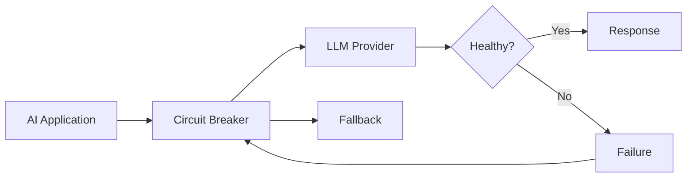

---

# 31. Fallback Strategies

Possible fallbacks:

```text
Primary LLM → Secondary LLM
Vector Search → Keyword Search
Agent → Deterministic Workflow
Real-Time API → Cached Data
Complex Model → Smaller Model
```

Never fall back by inventing missing business data.

---

# 32. No-Answer Strategy

If sufficient evidence is unavailable:

```text
Do not guess.
```

Return:

```text
"No sufficient information was found to answer
this question."
```

This is safer than producing an unsupported response.

---

# 33. Idempotency

Side-effecting operations require idempotency.

Example:

```text
Agent
 ↓
Payment Tool
 ↓
Payment System
```

If the workflow retries:

```text
Same Operation ID
 ↓
Existing Result
 ↓
Do Not Duplicate
```

---

# 34. Idempotency Architecture

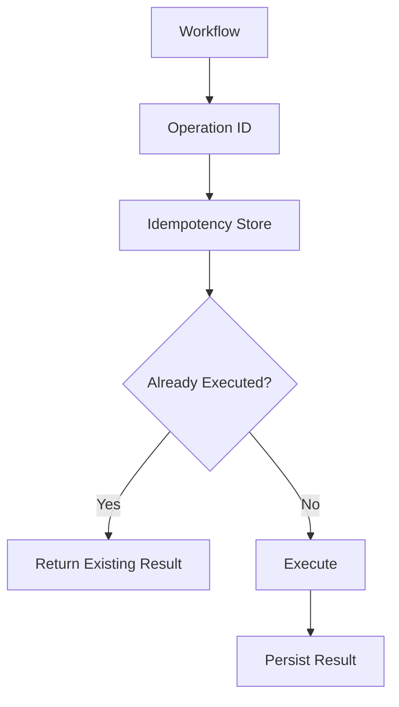

---

# 35. Caching

Caching can reduce:

```text
Latency
Cost
Dependency Load
```

Potential cache layers:

```text
Query Cache
Embedding Cache
Retrieval Cache
LLM Response Cache
Application Cache
```

---

# 36. Retrieval Cache

Conceptually:

```text
Query
 ↓
Cache
 ↓
Hit?
 ├── Yes → Cached Results
 └── No → Retriever
```

Cache keys should consider:

```text
Tenant
Authorization Scope
Query
Filters
Index Version
Embedding Version
```

---

# 37. LLM Response Cache

Caching LLM responses can be useful for deterministic or repeated requests.

But carefully consider:

```text
User Context
Tenant
Authorization
Freshness
Prompt Version
Model Version
Data Changes
```

A cached answer should never cross security boundaries.

---

# 38. Cache Invalidation

Important cache dependencies include:

```text
Index Update
Document Update
Prompt Update
Model Update
Authorization Change
Tenant Configuration Change
```

A production cache strategy must explicitly define invalidation behavior.

---

# 39. Performance Optimization

Important performance areas:

```text
Retrieval Latency
Embedding Latency
LLM Latency
Tool Latency
Context Size
Network Calls
Serialization
```

---

# 40. Parallelization

Independent operations can execute in parallel.

Example:

```text
             ┌── Retrieve Documents
Request ─────┤
             └── Get Customer
                    │
                    ▼
               Combine Context
```

This can reduce critical-path latency.

---

# 41. Context Optimization

Large contexts increase:

```text
Token Cost
Latency
Noise
```

Use:

```text
Top-K Tuning
Reranking
Compression
Deduplication
Parent-Child Retrieval
```

to improve context quality.

---

# 42. Token Budget

A production application should control:

```text
Input Tokens
Output Tokens
Total Tokens
```

Example:

```python
limits = {
    "max_context_tokens": 6000,
    "max_output_tokens": 1000
}
```

---

# 43. Model Routing

Different tasks may require different models.

```text
Classification
 ↓
Small Model

RAG Answer
 ↓
Medium Model

Complex Reasoning
 ↓
Large Model
```

This can improve:

```text
Cost
Latency
```

without sacrificing quality where it matters.

---

# 44. Model Gateway

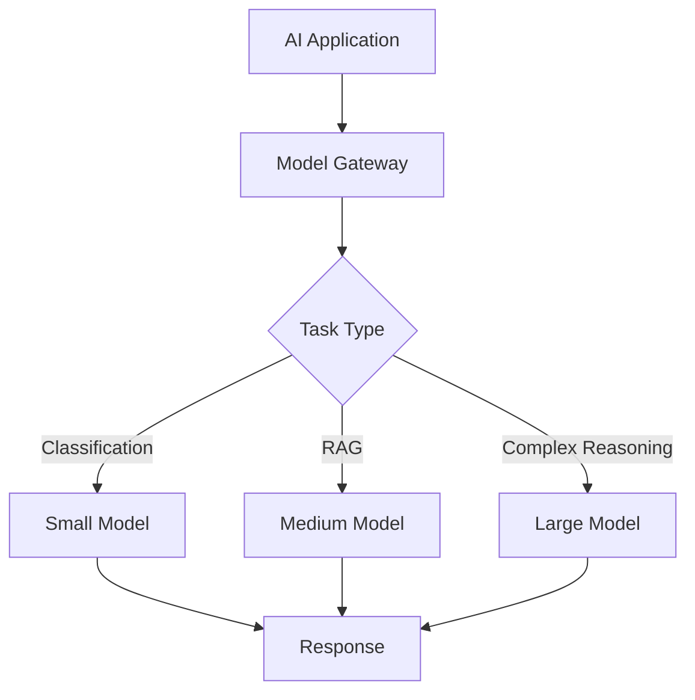

---

# 45. Observability

Production AI systems require more than traditional logs.

Observe:

```text
Request
 ↓
Retrieval
 ↓
LLM
 ↓
Tool
 ↓
Workflow
 ↓
Response
```

---

# 46. Distributed Tracing

A trace should connect:

```text
HTTP Request
 ↓
Application Service
 ↓
LlamaIndex
 ↓
Retriever
 ↓
Vector Store
 ↓
LLM
 ↓
Tool
 ↓
Response
```

Use a common:

```text
trace_id
```

across the request lifecycle.

---

# 47. AI Trace

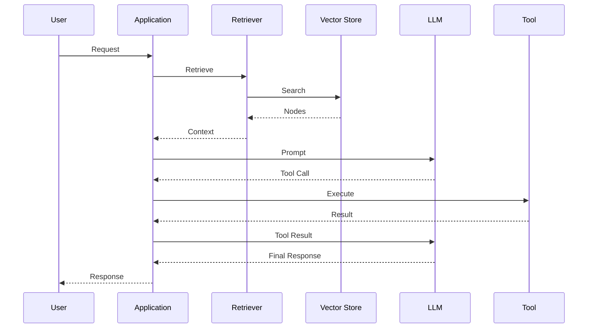

---

# 48. Metrics

Track:

### Reliability

```text
Success Rate
Error Rate
Timeout Rate
Retry Rate
```

### Performance

```text
P50
P95
P99
```

### AI

```text
Token Usage
Model Latency
Retrieval Quality
Tool Calls
```

### Cost

```text
Cost / Request
Cost / Tenant
Cost / Workflow
```

---

# 49. Logging

Use structured logs.

Example:

```text
trace_id=abc123
tenant_id=tenant001
operation=rag_query
retrieval_latency_ms=120
llm_latency_ms=840
status=success
```

Avoid logging sensitive content unnecessarily.

---

# 50. Prompt Observability

Track:

```text
Prompt Version
Model
Template
Token Count
Execution
```

Do not automatically log complete sensitive prompts or responses.

Use appropriate redaction and access controls.

---

# 51. Evaluation

Production AI systems require continuous evaluation.

Evaluate:

```text
Retrieval
Generation
Tool Selection
Workflow Execution
Safety
Latency
Cost
```

---

# 52. Evaluation Pipeline

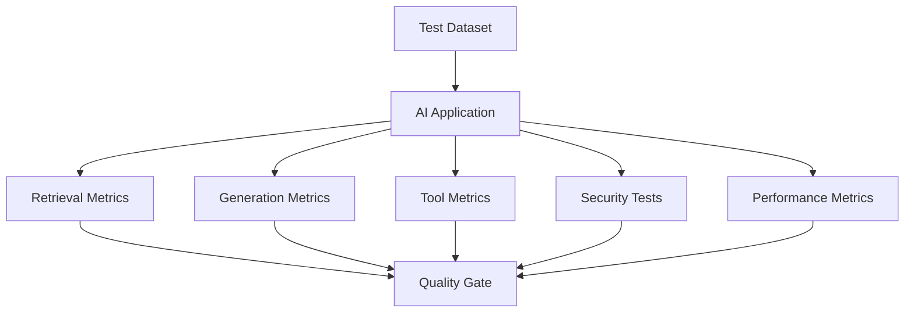

---

# 53. Regression Testing

Any change to:

```text
Prompt
Model
Embedding
Chunking
Retriever
Index
Tool
Workflow
```

can change system behavior.

Therefore maintain a regression dataset.

```text
Old Version
     ↓
Test Dataset
     ↓
New Version
     ↓
Compare
```

---

# 54. Golden Dataset

A golden dataset may contain:

```text
Question
Expected Answer
Expected Source
Expected Tool
Expected Behavior
```

Example:

```text
Question:
"What is the password expiry period?"

Expected Source:
security-policy.pdf

Expected Answer:
90 days
```

---

# 55. Retrieval Evaluation

Measure:

```text
Recall@K
Precision@K
MRR
NDCG
Hit Rate
```

---

# 56. Generation Evaluation

Measure:

```text
Faithfulness
Groundedness
Answer Relevance
Correctness
Citation Accuracy
```

---

# 57. Agent Evaluation

Measure:

```text
Tool Selection
Tool Arguments
Tool Execution
Task Completion
Step Count
Cost
```

---

# 58. Workflow Evaluation

Measure:

```text
Expected Branch
Expected Step Sequence
Execution Success
Failure Recovery
Final State
Latency
```

---

# 59. Quality Gate

A deployment may require:

```text
Retrieval Recall >= Target
Faithfulness >= Target
Tool Accuracy >= Target
Security Tests = PASS
P95 Latency <= Target
Cost <= Target
```

Only then:

```text
Deploy
```

---

# 60. Data Freshness

Enterprise knowledge changes.

Production systems need:

```text
Document Update
 ↓
Re-ingestion
 ↓
Re-index
 ↓
New Index Version
 ↓
Activate
```

---

# 61. Index Versioning

Use:

```text
Index v1
Index v2
Index v3
```

This enables:

```text
Rollback
A/B Testing
Blue-Green Deployment
Reproducibility
```

---

# 62. Index Deployment

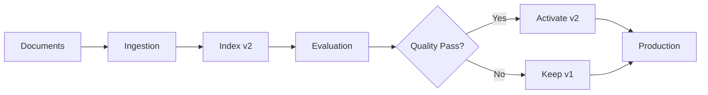

---

# 63. Blue-Green AI Deployment

Maintain:

```text
Blue = Current
Green = Candidate
```

Route traffic only after validation.

```text
Production
    │
 ┌──┴───┐
 ▼      ▼
Blue   Green
 │       │
Current Candidate
```

---

# 64. Canary Deployment

Instead of moving all traffic:

```text
100% → v1
```

start:

```text
95% → v1
5%  → v2
```

Monitor:

```text
Quality
Latency
Errors
Cost
```

Then gradually increase v2.

---

# 65. Rollback

Rollback should be possible for:

```text
Model
Prompt
Index
Retriever
Workflow
Tool
Application
```

A production AI platform should treat AI configuration as deployable artifacts.

---

# 66. CI/CD

A production pipeline can be:

```text
Commit
 ↓
Build
 ↓
Unit Tests
 ↓
Integration Tests
 ↓
Security Tests
 ↓
RAG Evaluation
 ↓
Agent Evaluation
 ↓
Performance Tests
 ↓
Deploy
 ↓
Monitor
```

---

# 67. CI/CD Architecture

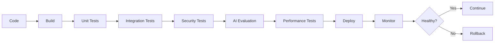

---

# 68. Infrastructure Scaling

Production AI systems may scale independently:

```text
API
Retrieval
Vector Store
LLM Gateway
Tool Services
Workflow Runtime
Observability
```

Avoid treating the entire system as one scaling unit.

---

# 69. Horizontal Scaling

Example:

```text
                Load Balancer
                     │
        ┌────────────┼────────────┐
        ▼            ▼            ▼
      AI Pod       AI Pod       AI Pod
```

State should be externalized when horizontal scaling requires shared execution context.

---

# 70. Stateless Application Layer

Prefer:

```text
API Pod
 ↓
External State Store
```

rather than:

```text
API Pod
 ↓
Local Memory
```

when requests may be routed to different instances.

---

# 71. Rate Limiting

Protect:

```text
API
LLM
Vector Store
Tools
External Services
```

Example:

```text
Tenant A
→ 100 requests/minute
```

This prevents a single tenant from exhausting shared resources.

---

# 72. Backpressure

When demand exceeds capacity:

```text
Incoming Requests
        ↓
Queue
        ↓
Controlled Processing
```

This is especially useful for:

```text
Document Ingestion
Batch Evaluation
Long-Running Workflows
```

---

# 73. Async Processing

Not every operation must be synchronous.

Example:

```text
User Upload
 ↓
202 Accepted
 ↓
Queue
 ↓
Ingestion Workflow
 ↓
Index
 ↓
Notification
```

This is often preferable for large document processing.

---

# 74. Production Ingestion Architecture

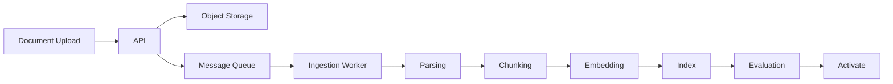

---

# 75. Data Lifecycle

```text
INGEST
 ↓
PROCESS
 ↓
INDEX
 ↓
SERVE
 ↓
UPDATE
 ↓
REINDEX
 ↓
ARCHIVE
 ↓
DELETE
```

Deletion should propagate through:

```text
Source
+
Index
+
Cache
+
Derived Data
```

where required by policy.

---

# 76. Data Deletion

If a document is deleted:

```text
Source Document
 ↓
Deletion Event
 ↓
Vector Index
 ↓
Cache
 ↓
Derived Artifacts
```

Do not leave stale copies accessible through retrieval.

---

# 77. Auditability

Enterprise AI applications should be able to answer:

```text
Who made the request?
Which tenant?
Which model?
Which prompt?
Which documents?
Which tools?
Which workflow?
What was the result?
```

This supports:

```text
Compliance
Security Investigation
Debugging
Business Audits
```

---

# 78. Audit Architecture

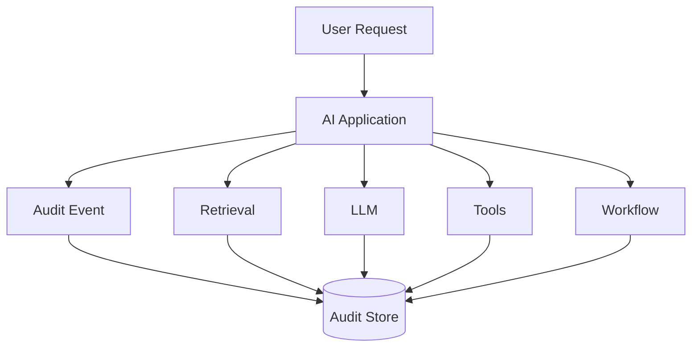

Sensitive data should be redacted or minimized according to organizational policy.

---

# 79. Data Privacy

Production AI systems should consider:

```text
PII
Confidential Documents
Financial Data
Customer Data
Credentials
Conversation History
Tool Results
```

Apply:

```text
Data Minimization
Encryption
Access Control
Retention Policies
Redaction
Audit
```

---

# 80. Prompt Injection Defense

Retrieved data and tool outputs may contain untrusted instructions.

Treat them as:

```text
Data
```

rather than:

```text
Trusted Instructions
```

Use:

```text
Input Validation
Prompt Separation
Tool Authorization
Output Validation
Least Privilege
```

---

# 81. Guardrails

Guardrails can operate at:

```text
Input
 ↓
Retrieval
 ↓
Tool
 ↓
LLM
 ↓
Output
```

Defense in depth is more reliable than a single prompt instruction.

---

# 82. Production Guardrail Architecture

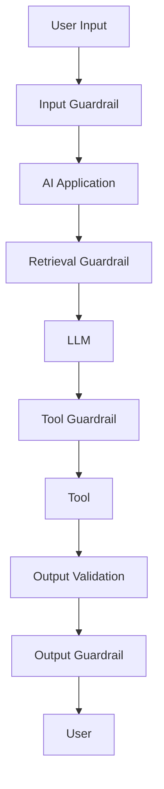

---

# 83. Cost Management

Track:

```text
Cost / Request
Cost / Tenant
Cost / Model
Cost / Workflow
Cost / Tool
```

Potential controls:

```text
Token Limits
Model Routing
Caching
Context Compression
Rate Limits
Budget Limits
```

---

# 84. Tenant Cost Controls

A multi-tenant platform may assign:

```text
Daily Budget
Monthly Budget
Token Budget
Request Quota
```

Example:

```text
Tenant A
Monthly AI Budget
      ↓
     $500
```

When the threshold is reached:

```text
Throttle
 ↓
Fallback
 ↓
Reject
```

depending on policy.

---

# 85. AI FinOps

Track:

```text
LLM Cost
Embedding Cost
Vector Store Cost
Storage
Compute
Tool/API Cost
Observability Cost
```

A useful metric is:

```text
Cost per Successful Task
```

rather than only:

```text
Cost per LLM Call
```

---

# 86. Production Resilience

A resilient AI platform should tolerate:

```text
Provider Failure
Dependency Failure
Network Failure
Traffic Spike
Bad Input
Model Regression
Index Regression
Tool Failure
```

Use:

```text
Timeouts
Retries
Circuit Breakers
Fallbacks
Queues
Rate Limits
Autoscaling
Rollback
```

---

# 87. Disaster Recovery

Define:

```text
RPO
RTO
```

for important AI services.

Protect:

```text
Indexes
Configuration
Prompts
Evaluation Datasets
Workflow State
Audit Data
```

---

# 88. Disaster Recovery Architecture

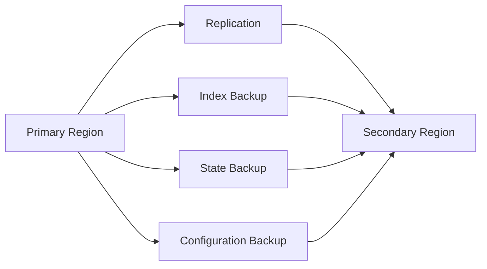

The exact architecture depends on the organization's availability and recovery requirements.

---

# 89. Model Provider Abstraction

Avoid tightly coupling business logic to one model provider.

Use:

```text
LLM Port
 ↓
Provider Adapter
```

Example:

```text
LLMProvider
 ├── OpenAIAdapter
 ├── AzureOpenAIAdapter
 ├── GeminiAdapter
 └── LocalModelAdapter
```

LlamaIndex can sit behind this capability boundary where appropriate.

---

# 90. Provider Failover

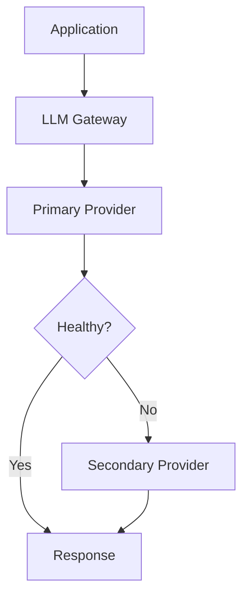

Provider failover must account for:

```text
Model Capability
Prompt Compatibility
Latency
Cost
Data Residency
Safety
Quality
```

---

# 91. Dependency Isolation

A production AI system may isolate:

```text
LLM
Vector Store
Database
Tools
Workflow Runtime
```

so that one failure does not cascade across the entire platform.

---

# 92. Bulkheads

A bulkhead pattern can isolate resource pools:

```text
Tenant A
 ↓
Resource Pool A

Tenant B
 ↓
Resource Pool B
```

or:

```text
RAG Requests
 ↓
Pool A

Agent Requests
 ↓
Pool B
```

This limits blast radius.

---

# 93. Production Architecture with Resilience

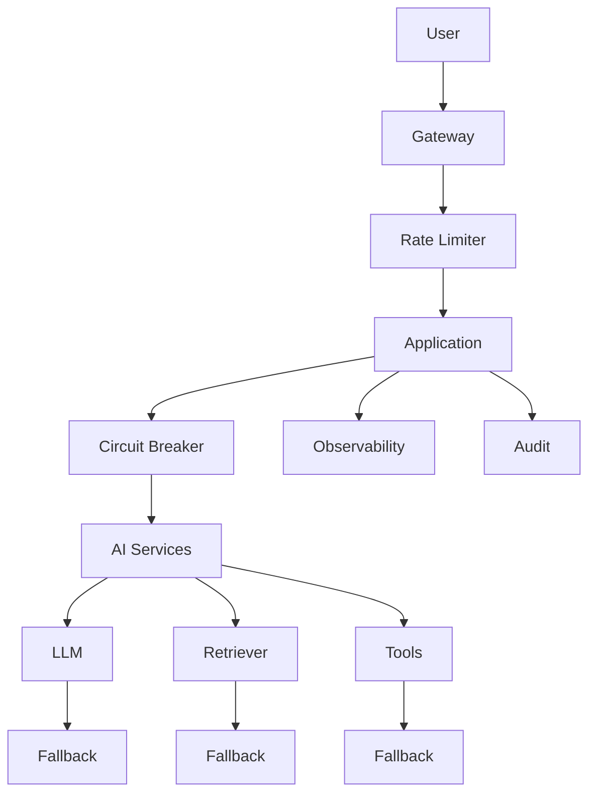

---

# 94. Production Deployment Strategies

Useful strategies include:

```text
Rolling Deployment
Blue-Green
Canary
Shadow Traffic
A/B Testing
```

AI-specific changes should be evaluated for:

```text
Quality
Latency
Cost
Safety
```

not just service health.

---

# 95. Shadow Testing

A candidate model or RAG configuration can receive copied traffic without affecting the user response.

```text
User Request
     │
 ┌───┴──────────┐
 ▼              ▼
Production    Candidate
   │              │
   ▼              ▼
Response       Evaluation
```

This is useful for comparing:

```text
Model
Prompt
Retriever
Index
```

---

# 96. Production Readiness

Before production:

```text
Architecture
✓

Security
✓

Reliability
✓

Evaluation
✓

Observability
✓

Cost
✓

Scalability
✓

Rollback
✓

Disaster Recovery
✓
```

---

# 97. Common Production Anti-Patterns

## Anti-Pattern 1

```text
Controller
 ↓
LlamaIndex Everything
```

Problem:

```text
Tight Coupling
```

---

## Anti-Pattern 2

```text
LLM
 ↓
Database
```

Problem:

```text
Uncontrolled Access
```

---

## Anti-Pattern 3

```text
Prompt
 ↓
Security Policy
```

Problem:

```text
Security Depends on Model Behavior
```

---

## Anti-Pattern 4

```text
No Evaluation
 ↓
Deploy
```

Problem:

```text
Silent Quality Regression
```

---

# 98. Anti-Pattern 5 — Unlimited Agent

```text
Agent
 ↓
Tool
 ↓
Agent
 ↓
Tool
 ↓
...
```

Problem:

```text
Cost
Latency
Reliability
```

---

# 99. Anti-Pattern 6 — No Observability

```text
User
 ↓
AI
 ↓
Wrong Answer
```

and no visibility into:

```text
Retrieval
Prompt
Model
Tool
Workflow
```

Problem:

```text
Impossible to Debug
```

---

# 100. Anti-Pattern 7 — Shared Cache Without Security Context

Bad:

```python
cache[query]
```

Better:

```python
cache[
    tenant_id,
    authorization_scope,
    index_version,
    query
]
```

---

# 101. Anti-Pattern 8 — Hard-Coded AI Configuration

Avoid:

```python
top_k = 5
model = "some-model"
```

throughout the codebase.

Prefer centralized, versioned configuration.

---

# 102. Production Reference Architecture

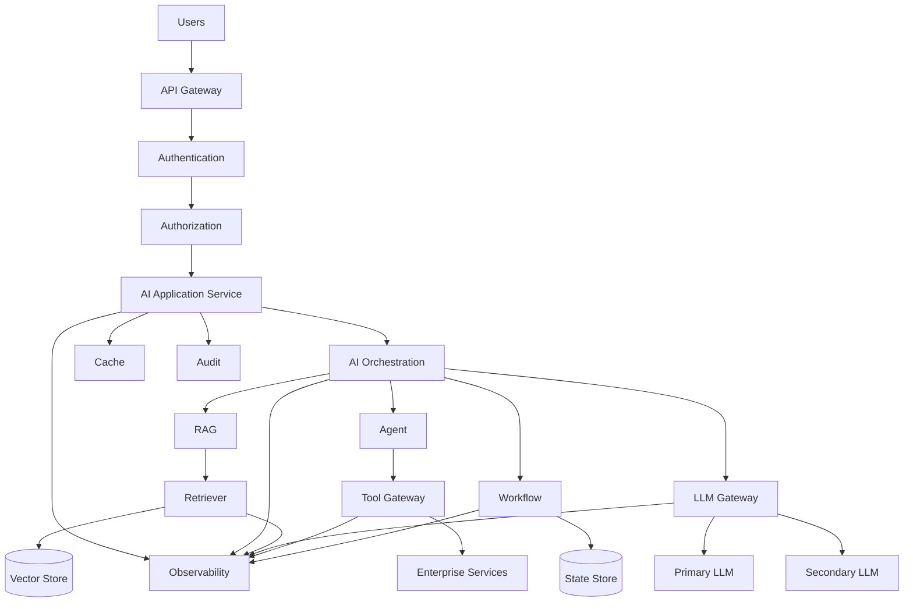

---

# 103. Production Engineering Principles

Remember:

```text
LlamaIndex
=
AI Engineering Framework

Not:

LlamaIndex
=
Complete Enterprise Architecture
```

The surrounding system still needs:

```text
Security
Networking
Identity
Storage
Observability
Deployment
Governance
Reliability
```

---

# 104. Recommended Production Layers

```text
Layer 1 — API
Layer 2 — Identity
Layer 3 — Application
Layer 4 — AI Orchestration
Layer 5 — LlamaIndex
Layer 6 — Models / Retrieval / Tools
Layer 7 — Infrastructure
Layer 8 — Observability / Governance
```

---

# 105. LlamaIndex Production Checklist

## Architecture

- [ ] Framework boundary
- [ ] Capability interfaces
- [ ] Modular services
- [ ] Externalized configuration
- [ ] Versioned artifacts

## Security

- [ ] Authentication
- [ ] Authorization
- [ ] Tenant isolation
- [ ] Secret management
- [ ] Data privacy
- [ ] Prompt injection protection
- [ ] Tool authorization
- [ ] Audit

## Reliability

- [ ] Timeouts
- [ ] Retries
- [ ] Backoff
- [ ] Circuit breakers
- [ ] Idempotency
- [ ] Fallbacks
- [ ] Rate limiting
- [ ] Backpressure

## RAG

- [ ] Retrieval evaluation
- [ ] Context optimization
- [ ] Metadata filtering
- [ ] Index versioning
- [ ] Freshness
- [ ] Citation

## Agents

- [ ] Tool limits
- [ ] Tool validation
- [ ] Tool authorization
- [ ] Tool observability
- [ ] Cost limits
- [ ] Agent evaluation

## Workflows

- [ ] Explicit steps
- [ ] State management
- [ ] Retry policy
- [ ] Timeout
- [ ] Idempotency
- [ ] Recovery
- [ ] Versioning

## Operations

- [ ] Metrics
- [ ] Logs
- [ ] Tracing
- [ ] Alerts
- [ ] Cost monitoring
- [ ] Deployment
- [ ] Rollback
- [ ] Disaster recovery

---

# 106. Key Takeaways

- LlamaIndex is an AI engineering framework, not a complete enterprise platform.
- Production architecture should separate application capabilities from framework implementation.
- Use capability-based interfaces and appropriate adapters.
- Authentication and authorization must happen outside the LLM.
- Tenant context should come from trusted application infrastructure.
- Retrieval must respect authorization boundaries.
- Production systems need explicit timeout and retry strategies.
- Circuit breakers help protect unhealthy dependencies.
- Side-effecting operations should be idempotent.
- Caches must include relevant security and version context.
- RAG, agents, and workflows should be independently observable.
- AI behavior must be evaluated continuously.
- Prompts, models, indexes, and retrievers should be versioned.
- Index updates should be evaluated before activation.
- Canary, blue-green, and shadow deployments can reduce AI deployment risk.
- AI cost should be monitored at request, tenant, model, and workflow levels.
- Tool execution should occur behind controlled application boundaries.
- Secrets should never be exposed to model context.
- Data deletion should propagate through derived AI artifacts.
- Production AI requires rollback and disaster recovery strategies.
- LlamaIndex should remain behind appropriate architectural boundaries.
- The objective is not merely to build a working RAG or agent prototype.
- The objective is to build a **reliable, secure, observable, scalable, and economically sustainable Enterprise AI system**.

---

# 📝 Quick Revision Notes

## Production AI Architecture

```text
User
 ↓
Gateway
 ↓
Authentication
 ↓
Authorization
 ↓
Application
 ↓
AI Orchestration
 ↓
LlamaIndex
 ↓
RAG / Agent / Workflow
 ↓
LLM / Retrieval / Tools
 ↓
Validation
 ↓
Response
```

---

## Production Reliability

```text
Timeout
+
Retry
+
Backoff
+
Circuit Breaker
+
Fallback
+
Idempotency
=
Resilience
```

---

## Production Security

```text
Authentication
+
Authorization
+
Tenant Isolation
+
Secret Management
+
Input Validation
+
Output Validation
+
Audit
```

---

## Production AI Quality

```text
Retrieval Quality
+
Generation Quality
+
Tool Quality
+
Workflow Quality
+
Security
=
AI System Quality
```

---

## Production Operations

```text
Logs
+
Metrics
+
Traces
+
Evaluation
+
Cost
+
Alerts
=
Observability
```

---

## Production Deployment

```text
Build
 ↓
Test
 ↓
Evaluate
 ↓
Security Check
 ↓
Deploy
 ↓
Monitor
 ↓
Rollback if Required
```

---

# ❓ Interview Questions

## Beginner

1. What makes a LlamaIndex application production-ready?
2. Why should LlamaIndex be isolated behind an application boundary?
3. What is the difference between authentication and authorization?
4. Why is tenant isolation important?
5. What is a timeout?
6. What is a retry?
7. What is a circuit breaker?
8. What is idempotency?
9. Why is observability important for AI applications?
10. Why should prompts and models be versioned?

## Intermediate

11. Design a production RAG architecture using LlamaIndex.
12. How would you isolate LlamaIndex from application business logic?
13. How would you implement multi-tenant RAG?
14. How would you secure retrieval?
15. How would you design a retry strategy?
16. When should an AI request not be retried?
17. How would you implement caching?
18. What information should be included in a cache key?
19. How would you monitor LLM latency?
20. How would you evaluate RAG quality?
21. How would you version a vector index?
22. How would you deploy a new RAG index safely?
23. How would you implement model failover?
24. How would you control AI costs?

## Advanced

25. Design a production-grade LlamaIndex platform for multiple enterprise tenants.
26. How would you isolate framework code from business capabilities?
27. How would you design a centralized LLM gateway?
28. How would you design a tool gateway?
29. How would you prevent cross-tenant data leakage?
30. How would you protect an AI application from prompt injection?
31. How would you design an AI-specific circuit breaker?
32. How would you implement blue-green deployment for RAG?
33. How would you perform shadow evaluation of a new model?
34. How would you design AI disaster recovery?
35. How would you handle vector-index rollback?
36. How would you build continuous RAG regression testing?
37. How would you design cost controls per tenant?
38. How would you implement observability across RAG, agents, and workflows?
39. How would you design a production LlamaIndex architecture using Ports & Adapters?
40. How would you decide whether a workflow, agent, or RAG pipeline should handle a request?
41. How would you design provider failover while preserving model capability requirements?
42. How would you prevent an agent from becoming an uncontrolled gateway to enterprise services?
43. How would you design a highly available multi-region AI platform?
44. How would you recover a long-running workflow after infrastructure failure?
45. What would your production readiness checklist contain before launching an Enterprise AI application?

---

# 🛠️ Practical Exercise

Build a production-ready Enterprise Knowledge Assistant using LlamaIndex.

Required capabilities:

```text
1. Multi-Tenant RAG
2. Metadata Filtering
3. Citation
4. LLM Gateway
5. Caching
6. Observability
7. Evaluation
8. Security
9. Cost Tracking
10. Versioned Index
```

Architecture:

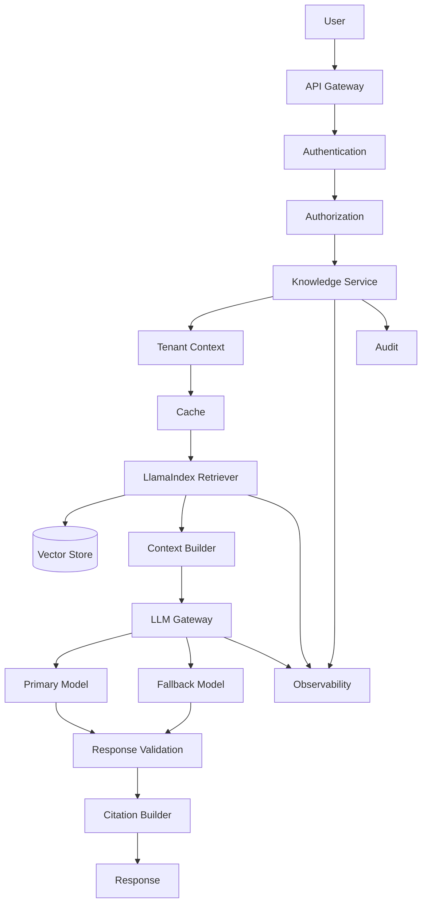

---

# 🧪 Testing Exercise

Create test suites for:

## Security

```text
Cross-Tenant Access
Unauthorized Document
Restricted Tool
Secret Exposure
Prompt Injection
```

## Reliability

```text
LLM Timeout
Vector Store Failure
Tool Timeout
Network Failure
Rate Limit
```

## RAG

```text
Correct Retrieval
Incorrect Retrieval
Empty Retrieval
Stale Index
Wrong Metadata
```

## AI

```text
Hallucination
Poor Grounding
Incorrect Citation
Wrong Tool Selection
```

---

# 📊 Production Evaluation

Build a dataset with at least:

```text
100 Questions
```

Measure:

```text
Recall@K
Precision@K
MRR
Faithfulness
Answer Relevance
Citation Accuracy
Latency
P95 Latency
Token Usage
Cost
```

Also measure:

```text
Security Test Pass Rate
```

---

# 🚀 Deployment Exercise

Deploy two versions:

```text
Version 1
 ↓
Production
```

and:

```text
Version 2
 ↓
Shadow Evaluation
 ↓
Canary
 ↓
Production
```

Compare:

```text
Quality
Latency
Cost
Error Rate
Security
```

---

# 🏢 Enterprise Architecture Challenge

Design a platform supporting:

```text
500 Tenants
10 Million Documents
100+ Tools
Multiple LLM Providers
Multiple Vector Stores
RAG
Agents
Workflows
Human Approval
Long-Running Tasks
```

Required:

```text
API Gateway
Identity
Authorization
Tenant Isolation
AI Gateway
LlamaIndex Layer
RAG
Agent Runtime
Workflow Runtime
Tool Gateway
Vector Store
State Store
Cache
Evaluation
Observability
Audit
FinOps
```

---

# 🧠 Final Architecture Challenge

Design the complete platform:

```mermaid
flowchart TB

    U[Users] --> G[API Gateway]

    G --> I[Identity]

    I --> A[Authorization]

    A --> APP[Enterprise AI Application]

    APP --> ORCH[AI Orchestration]

    ORCH --> RAG[RAG Service]

    ORCH --> AG[Agent Service]

    ORCH --> WF[Workflow Service]

    RAG --> LI[LlamaIndex]

    AG --> LI

    WF --> LI

    LI --> RET[Retrieval]

    LI --> TOOLS[Tool Gateway]

    LI --> LLMGW[LLM Gateway]

    RET --> VS[(Vector Store)]

    TOOLS --> ES[Enterprise Services]

    LLMGW --> P1[Provider 1]

    LLMGW --> P2[Provider 2]

    WF --> STATE[(State Store)]

    APP --> CACHE[(Cache)]

    APP --> AUDIT[(Audit Store)]

    APP --> OBS[Observability]

    ORCH --> OBS

    LI --> OBS

    TOOLS --> OBS

    LLMGW --> OBS
```

The architecture should support:

```text
Security
Scalability
Reliability
Observability
Evaluation
Governance
Cost Optimization
Disaster Recovery
```

---

# 📚 References & Further Reading

Recommended areas for further study:

- LlamaIndex Production Architecture
- LlamaIndex RAG
- LlamaIndex Agents
- LlamaIndex Workflows
- LlamaIndex Retrievers
- LlamaIndex Evaluation
- LlamaIndex Observability
- Enterprise RAG Architecture
- Multi-Tenant RAG
- AI Gateway Architecture
- LLM Gateway Patterns
- AI Evaluation
- AI Security
- AI Observability
- AI FinOps
- Vector Database Architecture
- Distributed Systems Reliability
- Circuit Breaker Pattern
- Bulkhead Pattern
- Idempotent Distributed Systems
- Blue-Green Deployment
- Canary Deployment
- Shadow Testing

> LlamaIndex evolves rapidly. Before implementing production systems, verify the current APIs, supported integrations, workflow behavior, agent interfaces, observability integrations, vector-store integrations, and deployment guidance against the official documentation for the exact LlamaIndex version used by your project.

---

## 🧭 Chapter Navigation

⬅️ **Previous:** [14. LlamaIndex Workflows](14-llamaindex-workflows.md)

📚 **Part VIII Index:** [AI Engineering Frameworks & Tooling](index.md)

➡️ **Next:** [16. LlamaIndex Limitations and Trade-offs](16-llamaindex-limitations-and-tradeoffs.md)

---

> **Enterprise AI Engineering Handbook**
>
> *Building Production-Grade Enterprise AI Systems — One Chapter at a Time.*