# 17 — LangGraph Fundamentals

> Understand the foundations of LangGraph and how graph-based orchestration can be used to build stateful, controllable, and production-oriented AI applications.

---

## 📖 Overview

Modern AI applications increasingly require more than a single LLM call.

A production system may need to:

```text
Receive Request
      ↓
Understand Task
      ↓
Retrieve Information
      ↓
Call Tools
      ↓
Evaluate Result
      ↓
Retry / Branch
      ↓
Continue
      ↓
Return Response
```

Traditional sequential pipelines can become difficult to manage when applications require:

```text
State
Branching
Loops
Conditional Execution
Human Approval
Tool Calling
Retries
Persistence
Long-Running Execution
```

LangGraph introduces a graph-based execution model for building these kinds of stateful AI workflows and agent systems.

A useful mental model is:

```text
                 ┌──────────────┐
                 │    START     │
                 └──────┬───────┘
                        ↓
                 ┌──────────────┐
                 │   Analyze    │
                 └──────┬───────┘
                        ↓
                 ┌──────────────┐
                 │   Retrieve   │
                 └──────┬───────┘
                        ↓
                 ┌──────────────┐
                 │    Agent     │
                 └──────┬───────┘
                        ↓
                  ┌────────────┐
                  │   Decide   │
                  └───┬────┬───┘
                      │    │
                 Yes  │    │ No
                      ↓    ↓
                   Tool   Retry
                      │    │
                      └─┬──┘
                        ↓
                 ┌──────────────┐
                 │    Finish    │
                 └──────────────┘
```

The important idea is:

```text
State
+
Nodes
+
Edges
+
Execution
=
Graph-based AI Application
```

---

# 🎯 Learning Objectives

After completing this chapter, you will be able to:

- Understand the purpose of LangGraph
- Understand graph-based AI orchestration
- Understand nodes and edges
- Understand graph state
- Understand START and END
- Build a basic LangGraph
- Understand sequential execution
- Understand conditional routing
- Understand loops
- Understand state transitions
- Understand reducers
- Understand checkpoints conceptually
- Understand persistence requirements
- Understand how LangGraph differs from simple chains
- Understand how LangGraph differs from agents
- Design basic production-oriented graphs
- Identify when LangGraph is appropriate

---

# 1. What Is LangGraph?

LangGraph is a graph-based orchestration framework for building stateful AI applications.

Instead of representing execution only as:

```text
A → B → C
```

you can represent more complex execution as:

```text
        ┌──→ B ──→ C ──┐
        │               │
A ──────┤               ├──→ D
        │               │
        └──→ E ──→ F ──┘
```

This makes branching and cycles first-class architectural concepts.

---

# 2. Why Graph-Based Orchestration?

AI applications frequently contain decisions.

For example:

```text
User Request
      ↓
Classify
      ↓
 ┌────┴─────┐
 ↓          ↓
RAG       Tool
 ↓          ↓
 └────┬─────┘
      ↓
   Validate
      ↓
   Response
```

A graph provides an explicit representation of this execution structure.

---

# 3. Core LangGraph Concepts

The basic building blocks are:

```text
State
Nodes
Edges
START
END
```

Conceptually:

```text
                 Graph
                   │
        ┌──────────┼──────────┐
        ↓          ↓          ↓
      State      Nodes      Edges
```

---

# 4. Graph Model

A graph can be represented as:

```text
Graph
 ├── State
 ├── Node A
 ├── Node B
 ├── Node C
 ├── Edge A → B
 ├── Edge B → C
 └── Edge C → END
```

Example:

```text
START
  ↓
retrieve
  ↓
generate
  ↓
END
```

---

# 5. Nodes

A node represents a unit of computation.

Examples:

```text
validate_request
retrieve_documents
call_llm
call_tool
validate_response
human_review
```

Conceptually:

```python
def retrieve_documents(state):
    ...
```

The node receives state, performs work, and returns state updates.

---

# 6. Node Responsibilities

A good node should have a focused responsibility.

Good:

```text
retrieve_documents()
```

```text
validate_response()
```

```text
call_customer_api()
```

Avoid:

```text
do_everything()
```

A graph becomes easier to understand when each node has a clear responsibility.

---

# 7. Edges

Edges define how execution moves between nodes.

Example:

```text
START
 ↓
retrieve
 ↓
generate
 ↓
END
```

The edges are:

```text
START → retrieve
retrieve → generate
generate → END
```

---

# 8. Conditional Edges

Not every transition is deterministic.

Example:

```text
                 ┌──→ RAG
                 │
Classify ────────┤
                 │
                 └──→ Tool
```

A routing function determines which path to take.

---

# 9. Graph State

State represents information shared across graph execution.

Example:

```python
state = {
    "query": "...",
    "documents": [],
    "answer": None
}
```

As the graph executes:

```text
Initial State
     ↓
Retrieve
     ↓
documents populated
     ↓
Generate
     ↓
answer populated
```

---

# 10. State as the Source of Context

A useful mental model is:

```text
Node
 ↓
Reads State
 ↓
Performs Work
 ↓
Updates State
 ↓
Next Node
```

Therefore:

```text
State
=
Execution Context
```

---

# 11. State Schema

A state schema defines the information managed by the graph.

Conceptually:

```python
from typing import TypedDict


class AgentState(TypedDict):
    query: str
    documents: list
    answer: str
```

The exact implementation can vary depending on the LangGraph version and state-management approach.

---

# 12. Basic Graph Example

A simple graph can look conceptually like:

```python
from typing import TypedDict
from langgraph.graph import StateGraph, START, END


class State(TypedDict):
    message: str


def process(state: State):
    return {
        "message": state["message"] + " processed"
    }


builder = StateGraph(State)

builder.add_node(
    "process",
    process
)

builder.add_edge(
    START,
    "process"
)

builder.add_edge(
    "process",
    END
)

graph = builder.compile()
```

Execution:

```python
result = graph.invoke({
    "message": "Hello"
})

print(result)
```

The exact APIs should be verified against the LangGraph version used by the project.

---

# 13. Basic Graph Architecture

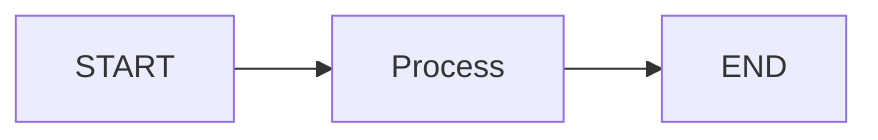

This is the smallest useful mental model for a graph.

---

# 14. Sequential Graph

A sequential graph is:

```text
START
 ↓
A
 ↓
B
 ↓
C
 ↓
END
```

Example:

```python
builder.add_edge(
    START,
    "retrieve"
)

builder.add_edge(
    "retrieve",
    "generate"
)

builder.add_edge(
    "generate",
    END
)
```

---

# 15. Sequential Graph Diagram

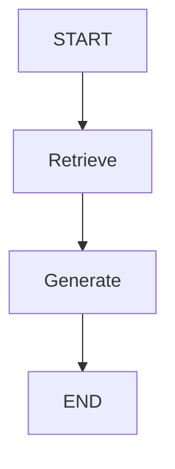

This is similar to a traditional pipeline.

The real power appears when we introduce:

```text
Branches
Loops
State
Persistence
```

---

# 16. Conditional Routing

Example:

```python
def route(state):
    if state["documents"]:
        return "generate"

    return "fallback"
```

Conceptually:

```text
Retrieve
   ↓
Has Evidence?
 ┌─┴──────────┐
Yes           No
 ↓             ↓
Generate     Fallback
```

---

# 17. Conditional Graph

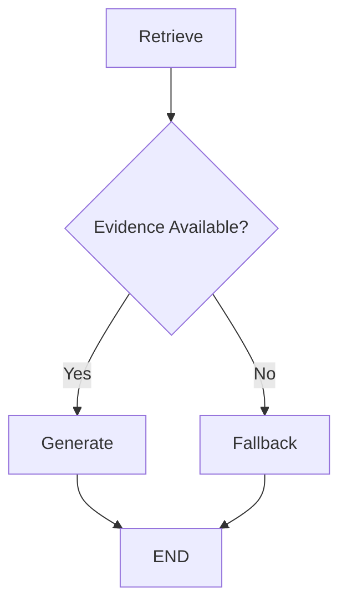

This makes decision logic explicit.

---

# 18. Loops

AI systems often require repeated execution.

Example:

```text
Generate
   ↓
Validate
   ↓
Correct?
 ┌─┴──────┐
Yes       No
 ↓         ↓
END      Generate
```

The graph contains a cycle.

---

# 19. Loop Architecture

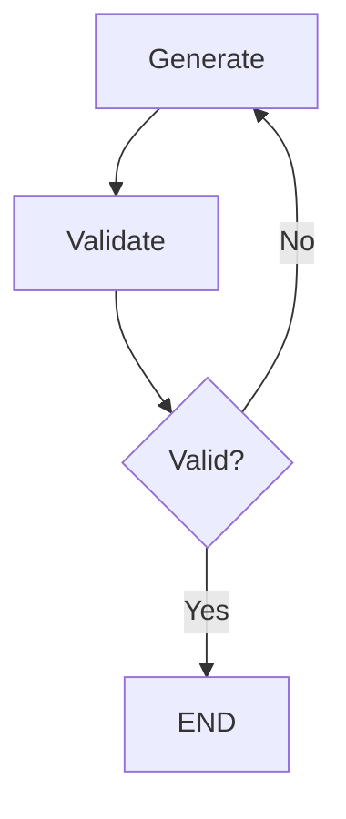

This is particularly useful for:

```text
Reflection
Validation
Retry
Correction
Iterative Research
```

---

# 20. Bounded Loops

Loops should not normally run forever.

Use:

```text
Maximum Iterations
```

Example:

```python
if state["attempts"] >= 3:
    return "fallback"
```

Conceptually:

```text
Attempt 1
 ↓
Attempt 2
 ↓
Attempt 3
 ↓
Fallback
```

---

# 21. Why State Matters in Loops

A loop may need:

```text
attempt_count
feedback
previous_answer
tool_results
```

Example:

```python
state = {
    "answer": "...",
    "feedback": "...",
    "attempts": 2
}
```

State allows the graph to remember execution progress.

---

# 22. Graph State Evolution

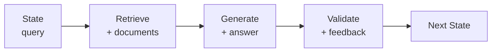

Each node contributes updates to the graph state.

---

# 23. State Updates

A node may return:

```python
{
    "documents": documents
}
```

Another node:

```python
{
    "answer": answer
}
```

Another:

```python
{
    "feedback": feedback
}
```

The graph combines these updates according to its state semantics.

---

# 24. Reducers

Some state fields may receive multiple updates.

For example:

```text
Parallel Node A
       │
       ├── Result A
       │
       ▼
Shared State
       ▲
       │
       ├── Result B
       │
Parallel Node B
```

A reducer determines how updates are combined.

---

# 25. Reducer Concept

Suppose:

```python
messages = [
    "Message A"
]
```

Another node produces:

```python
["Message B"]
```

A reducer may combine them into:

```python
[
    "Message A",
    "Message B"
]
```

rather than replacing the existing value.

---

# 26. State Ownership

Be careful about which node owns which state fields.

Example:

```text
Retrieval Node
 → documents

Generation Node
 → answer

Validation Node
 → feedback
```

This makes state transitions easier to reason about.

---

# 27. State Design Principle

Avoid:

```text
One Huge State Object
```

containing everything.

Prefer:

```text
Minimal State
+
Explicit Fields
+
Clear Ownership
```

This reduces accidental coupling between nodes.

---

# 28. START and END

LangGraph graphs commonly use special entry and termination points.

Conceptually:

```text
START
  ↓
Graph
  ↓
END
```

Example:

```python
builder.add_edge(
    START,
    "retrieve"
)

builder.add_edge(
    "generate",
    END
)
```

---

# 29. Graph Compilation

A graph is typically built and then compiled.

Conceptually:

```text
Define State
      ↓
Add Nodes
      ↓
Add Edges
      ↓
Compile
      ↓
Executable Graph
```

---

# 30. Graph Construction

```python
builder = StateGraph(State)

builder.add_node(
    "retrieve",
    retrieve
)

builder.add_node(
    "generate",
    generate
)

builder.add_edge(
    START,
    "retrieve"
)

builder.add_edge(
    "retrieve",
    "generate"
)

builder.add_edge(
    "generate",
    END
)

graph = builder.compile()
```

---

# 31. Graph Execution

After compilation:

```python
result = graph.invoke(
    {
        "query": "What is our leave policy?"
    }
)
```

Conceptually:

```text
Input
 ↓
Graph
 ↓
State Transitions
 ↓
Final State
```

---

# 32. Streaming

For long-running AI applications, users may benefit from incremental updates.

Conceptually:

```text
Graph
 ↓
Node A
 ↓
Node B
 ↓
Node C
```

can expose execution progress rather than waiting for the entire graph to complete.

This is useful for:

```text
Long Tasks
Agent Reasoning
Tool Calls
Research
User Interfaces
```

---

# 33. Human-in-the-Loop

Graphs can represent human approval points.

Example:

```text
Agent
 ↓
Prepare Action
 ↓
Human Approval
 ↓
Execute
```

---

# 34. Human Approval Architecture

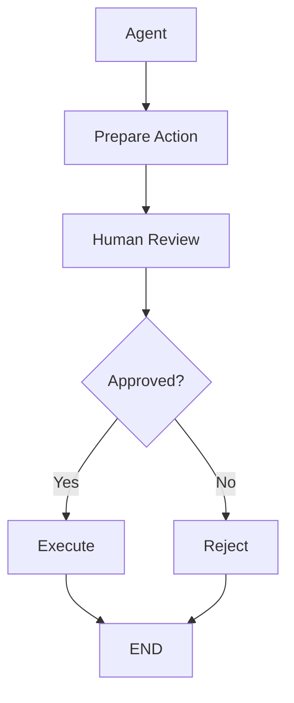

This is useful for high-risk operations.

---

# 35. Persistence

State may need to survive beyond a single execution.

For example:

```text
User
 ↓
Graph
 ↓
Approval Required
 ↓
Pause
 ↓
Later
 ↓
Resume
```

This requires persistence of execution state.

---

# 36. Checkpointing

Checkpointing provides a way to persist graph execution state at defined points.

Conceptually:

```text
Node A
 ↓
Checkpoint
 ↓
Node B
 ↓
Checkpoint
 ↓
Node C
```

If execution stops:

```text
Failure
 ↓
Restore Checkpoint
 ↓
Continue
```

---

# 37. Checkpoint Architecture

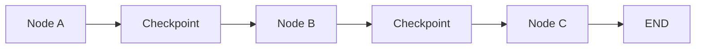

Checkpointing is especially important for:

```text
Long-Running Tasks
Human Approval
Recovery
Durable Execution
```

---

# 38. Thread / Conversation Context

Stateful AI applications may need separate execution contexts.

Conceptually:

```text
User A
 ↓
Thread A
 ↓
Graph State A
```

and:

```text
User B
 ↓
Thread B
 ↓
Graph State B
```

State must not leak between unrelated users or conversations.

---

# 39. Thread Isolation

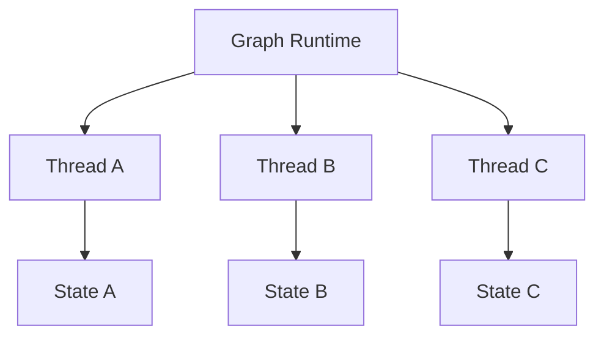

Production systems must carefully control identity and state isolation.

---

# 40. LangGraph for RAG

A basic RAG graph:

```text
START
 ↓
Retrieve
 ↓
Generate
 ↓
END
```

But production RAG may be:

```text
START
 ↓
Validate
 ↓
Retrieve
 ↓
Check Evidence
 ├── No → Fallback
 └── Yes
       ↓
    Generate
       ↓
    Validate
       ↓
    END
```

---

# 41. RAG Graph

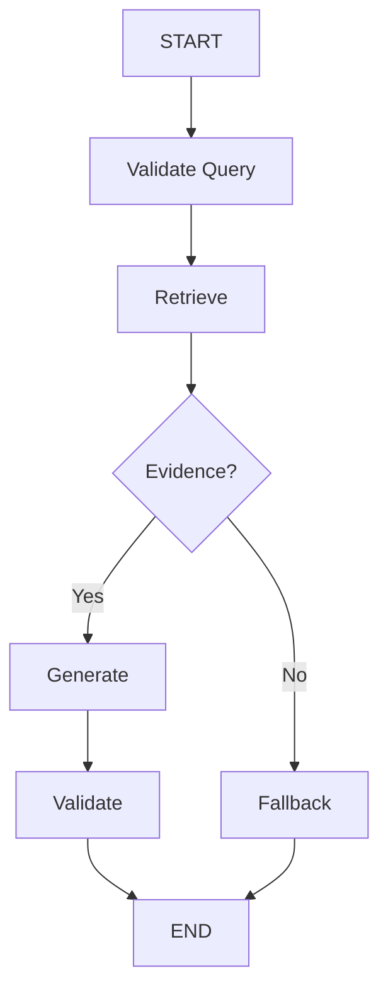

---

# 42. LangGraph for Agents

A common agent graph is:

```text
START
 ↓
LLM
 ↓
Tool Call?
 ├── No → END
 └── Yes
       ↓
      Tool
       ↓
      LLM
```

This creates an explicit agent loop.

---

# 43. Agent Graph

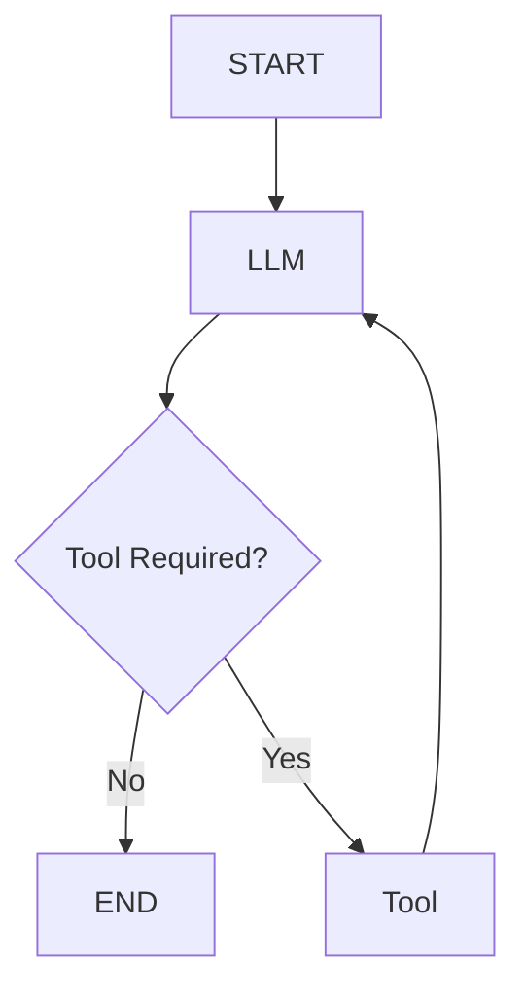

This graph is simple, but production systems need:

```text
Tool Limits
Timeouts
Authorization
Retries
State
Observability
```

---

# 44. LangGraph + RAG + Tools

A more realistic architecture:

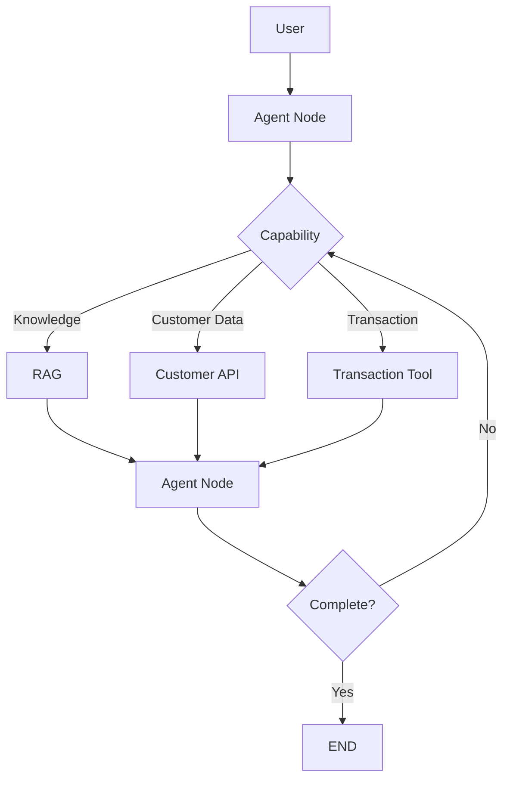

The graph explicitly represents the control flow.

---

# 45. Deterministic vs Dynamic Graphs

A graph can contain:

```text
Deterministic Nodes
```

and:

```text
LLM-Based Decisions
```

For example:

```text
Workflow
 ↓
Deterministic Validation
 ↓
LLM Decision
 ↓
Deterministic Tool Authorization
 ↓
Tool
```

This combination is powerful.

---

# 46. Control Plane vs Decision Plane

A useful architecture distinction:

```text
Control Plane
=
Graph Structure
```

while:

```text
Decision Plane
=
LLM / Agent Reasoning
```

Example:

```text
Graph
 ↓
LLM Decision
 ↓
Graph Validates
 ↓
Graph Executes
```

The graph can constrain what the model is allowed to do.

---

# 47. Guardrails

Guardrails can be implemented around graph nodes.

Example:

```text
User Input
 ↓
Input Guardrail
 ↓
Agent
 ↓
Tool Authorization
 ↓
Tool
 ↓
Output Guardrail
```

---

# 48. Guardrail Architecture

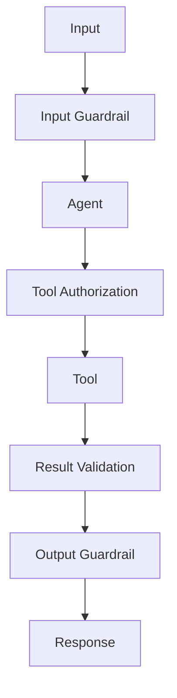

---

# 49. Error Handling

Graph execution may encounter:

```text
LLM Failure
Tool Failure
Retrieval Failure
Validation Failure
Timeout
Rate Limit
Invalid State
```

The graph should define appropriate handling paths.

---

# 50. Error Routing

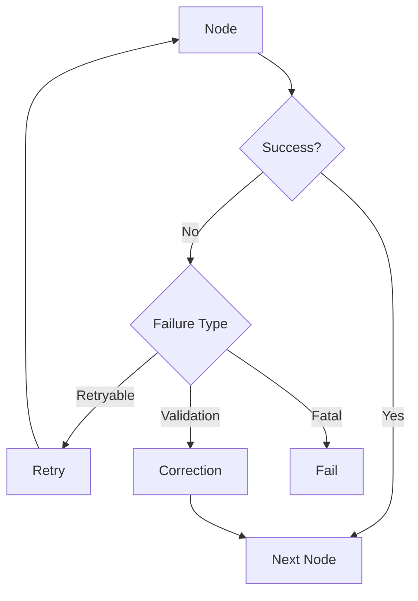

---

# 51. Retry Loops

A bounded retry pattern:

```text
Tool
 ↓
Failure
 ↓
Retry Count
 ↓
Retry
 ↓
Success
```

or:

```text
Tool
 ↓
Failure
 ↓
Retry Count >= Limit
 ↓
Fallback
```

---

# 52. Maximum Iterations

Any graph containing loops should have an explicit safety mechanism.

Example:

```python
if state["attempts"] >= 3:
    return "fallback"
```

Otherwise:

```text
Agent
 ↓
Tool
 ↓
Agent
 ↓
Tool
 ↓
...
```

could continue indefinitely.

---

# 53. Timeouts

Production graphs should define time limits for:

```text
LLM Calls
Tool Calls
Retrieval
Graph Execution
```

Conceptually:

```text
Graph Timeout
 ↓
Stop Execution
 ↓
Fallback / Error
```

---

# 54. Idempotency

Graphs can retry or resume execution.

Side-effecting operations should therefore use:

```text
Operation ID
+
Idempotency Key
```

Example:

```text
Graph
 ↓
Payment Tool
 ↓
Payment
```

A retry must not create:

```text
Duplicate Payment
```

---

# 55. Graph Observability

A production graph should expose:

```text
Graph ID
Execution ID
Thread ID
Node
Transition
Duration
Status
Error
Retry
Tool
LLM
Tokens
Cost
```

---

# 56. Graph Trace

Example:

```text
Execution: exec-1001

START
 ↓
validate_request     12ms
 ↓
retrieve             145ms
 ↓
agent                820ms
 ├── search           120ms
 └── customer_api     210ms
 ↓
validate              35ms
 ↓
END
```

This provides an execution-level view of the system.

---

# 57. Graph Metrics

Useful metrics include:

```text
Graph Success Rate
Graph Failure Rate
Node Latency
P95 Execution Time
Loop Count
Retry Count
Tool Calls
LLM Calls
Token Usage
Cost
```

---

# 58. Node-Level Metrics

Track:

```text
Node Name
Execution Count
Success Rate
Failure Rate
Average Duration
P95 Duration
```

This helps identify bottlenecks.

---

# 59. Graph Versioning

Graphs should be versioned when behavior changes.

Example:

```text
customer-agent:v1
customer-agent:v2
```

Track:

```text
Graph Definition
Prompt
Model
Tools
State Schema
```

---

# 60. State Schema Evolution

Changing state structures can be dangerous.

Example:

```text
v1:
query
documents

v2:
query
documents
customer_context
```

Production systems should consider:

```text
Migration
Backward Compatibility
Checkpoint Compatibility
Rollback
```

---

# 61. Graph Deployment

A production deployment can be:

```text
Code
 ↓
Unit Tests
 ↓
Graph Tests
 ↓
Integration Tests
 ↓
AI Evaluation
 ↓
Security Tests
 ↓
Deploy
```

---

# 62. Testing Graphs

Test:

```text
Nodes
Edges
State
Branches
Loops
Failures
Retries
```

Example:

```text
Input
 ↓
Expected Path
 ↓
Expected State
 ↓
Expected Result
```

---

# 63. Graph Path Testing

Suppose:

```text
Classify
 ├── RAG
 ├── Tool
 └── Human
```

You should test all important paths:

```text
Path A → RAG
Path B → Tool
Path C → Human
```

rather than testing only the happy path.

---

# 64. Failure Testing

Simulate:

```text
LLM Timeout
Retriever Failure
Tool Timeout
Invalid Tool Result
Unauthorized Tool
Empty Retrieval
Loop Limit
State Corruption
Checkpoint Failure
```

Verify expected recovery behavior.

---

# 65. Human-in-the-Loop Testing

Test:

```text
Approval
Rejection
Timeout
Resume
Duplicate Approval
Expired Approval
```

Human workflows require careful state handling.

---

# 66. Security

A LangGraph application should enforce:

```text
Authentication
Authorization
Tenant Isolation
Tool Authorization
Secret Management
Data Privacy
Input Validation
Output Validation
Audit
```

Graph structure alone is not a security boundary.

---

# 67. Tool Security

Never assume:

```text
Agent decided to call tool
=
Authorized
```

Instead:

```text
Agent Decision
 ↓
Authorization
 ↓
Validation
 ↓
Tool Execution
```

---

# 68. Multi-Tenant Graphs

A production system may run:

```text
Tenant A
 ↓
Thread A
 ↓
Graph State A
```

and:

```text
Tenant B
 ↓
Thread B
 ↓
Graph State B
```

Isolation must be explicit.

---

# 69. Graph + Enterprise Services

A production architecture may look like:

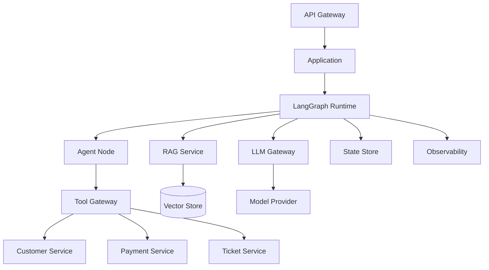

---

# 70. LangGraph vs Traditional Chain

### Chain

```text
A
 ↓
B
 ↓
C
```

### Graph

```text
       ┌── B ──┐
       │       ↓
A ─────┤       D
       │       ↑
       └── C ──┘
```

A graph is more appropriate when execution contains:

```text
Branches
Loops
State
Human Approval
Dynamic Routing
```

---

# 71. LangGraph vs Workflow

A traditional workflow might be:

```text
A → B → C
```

A graph-based workflow can express:

```text
A
 ↓
Decision
 ├── B
 ├── C
 └── D
```

and:

```text
C → Decision → B
```

The graph makes transitions and cycles explicit.

---

# 72. LangGraph vs Agent

An agent is a behavioral pattern:

```text
Reason
 ↓
Act
 ↓
Observe
 ↓
Reason
```

LangGraph can be used to implement that behavior explicitly:

```text
LLM
 ↓
Tool
 ↓
LLM
 ↓
Tool
```

Therefore:

```text
Agent
≠
LangGraph
```

LangGraph is an orchestration mechanism that can be used to build agents and other stateful workflows.

---

# 73. LangGraph + LlamaIndex

These frameworks can serve different roles.

For example:

```text
LangGraph
 ↓
Orchestration
```

and:

```text
LlamaIndex
 ↓
RAG / Data / Retrieval
```

Architecture:

```text
LangGraph
    │
    ├── RAG Tool
    │      ↓
    │   LlamaIndex
    │
    ├── Customer Tool
    │
    └── Transaction Tool
```

This separation can be useful when orchestration and data/retrieval concerns have different requirements.

---

# 74. Framework Boundary

A capability-oriented architecture can look like:

```text
Application
 ↓
Orchestration Port
 ↓
LangGraph Adapter
```

and:

```text
Knowledge Port
 ↓
LlamaIndex Adapter
```

This prevents the entire application from becoming framework-specific.

---

# 75. Production Architecture Principle

Use:

```text
LangGraph
=
Orchestration Capability
```

rather than:

```text
LangGraph
=
Entire Application Architecture
```

The application still needs:

```text
Identity
Security
Persistence
Networking
Observability
Governance
Deployment
```

---

# 76. When LangGraph Is Useful

LangGraph is particularly useful when the application requires:

```text
Stateful Execution
Conditional Branching
Loops
Human Approval
Long-Running Tasks
Agent Orchestration
Tool Calling
Explicit Control Flow
```

---

# 77. When LangGraph May Be Excessive

For:

```text
Simple LLM Call
Simple Classification
Basic Prompt Pipeline
One-Step Embedding
```

a graph may add unnecessary complexity.

Prefer the simplest architecture that satisfies the requirements.

---

# 78. Common Anti-Patterns

## Anti-Pattern 1 — Everything Is a Node

Avoid creating nodes for trivial operations:

```text
get_string
 ↓
uppercase_string
 ↓
append_string
```

Use meaningful application boundaries.

---

# 79. Anti-Pattern 2 — Giant State

Avoid:

```text
State
 └── 100+ unrelated fields
```

Prefer:

```text
Minimal State
+
Clear Ownership
```

---

# 80. Anti-Pattern 3 — Infinite Agent Loops

Avoid:

```text
LLM
 ↓
Tool
 ↓
LLM
 ↓
Tool
 ↓
...
```

Use:

```text
Maximum Iterations
+
Timeout
+
Fallback
```

---

# 81. Anti-Pattern 4 — Business Rules Only in LLM

Avoid:

```text
LLM Prompt
 ↓
Critical Business Decision
```

Prefer:

```text
LLM
 ↓
Decision
 ↓
Deterministic Policy
 ↓
Execution
```

---

# 82. Anti-Pattern 5 — Direct Tool Access

Avoid:

```text
Agent
 ↓
Database
```

Prefer:

```text
Agent
 ↓
Tool Gateway
 ↓
Authorization
 ↓
Enterprise API
```

---

# 83. Anti-Pattern 6 — No State Isolation

Avoid:

```text
Shared State
 ↓
Multiple Tenants
```

Prefer:

```text
Tenant
 ↓
Thread
 ↓
Isolated State
```

---

# 84. Anti-Pattern 7 — No Graph Testing

Avoid testing only:

```text
Happy Path
```

Test:

```text
Every Important Branch
+
Failure
+
Retry
+
Loop
+
Human Approval
```

---

# 85. Production Graph Checklist

## Architecture

- [ ] Clear graph boundaries
- [ ] Small nodes
- [ ] Explicit edges
- [ ] Minimal state
- [ ] Bounded loops
- [ ] Clear termination

## Reliability

- [ ] Timeouts
- [ ] Retry policies
- [ ] Backoff
- [ ] Fallback
- [ ] Idempotency
- [ ] Recovery

## Security

- [ ] Authentication
- [ ] Authorization
- [ ] Tenant isolation
- [ ] Tool authorization
- [ ] Secret management
- [ ] Data privacy
- [ ] Audit

## AI

- [ ] Prompt versioning
- [ ] Model versioning
- [ ] Tool evaluation
- [ ] RAG evaluation
- [ ] Agent evaluation

## Operations

- [ ] Tracing
- [ ] Metrics
- [ ] Structured logs
- [ ] Cost tracking
- [ ] Alerts
- [ ] Versioning

---

# 86. Key Takeaways

- LangGraph provides graph-based orchestration for stateful AI applications.
- Nodes represent units of computation.
- Edges define execution transitions.
- Conditional edges enable explicit routing.
- Graph state maintains execution context.
- Reducers can define how concurrent state updates are combined.
- Loops enable iterative reasoning and correction.
- Loops should always be bounded.
- Checkpointing can support persistence and recovery.
- Human approval can be modeled as an explicit graph stage.
- LangGraph can implement agent loops explicitly.
- LangGraph can also implement deterministic workflows.
- RAG can be represented as a graph.
- Tools can be integrated as graph nodes.
- Graph structure can constrain agent behavior.
- Tool authorization must remain outside model decisions.
- Production graphs require observability.
- Graphs should be versioned.
- State schemas should evolve carefully.
- Multi-tenant state must be isolated.
- LangGraph and LlamaIndex can complement each other.
- LlamaIndex can provide retrieval and data capabilities while LangGraph handles orchestration.
- LangGraph is not a replacement for enterprise security, infrastructure, or governance.
- Simple tasks should not automatically be turned into complex graphs.
- The goal is controlled, observable, reliable orchestration.

---

# 📝 Quick Revision Notes

## LangGraph

```text
LangGraph
=
State
+
Nodes
+
Edges
+
Execution
```

---

## Node

```text
Input State
    ↓
Node
    ↓
State Update
```

---

## Conditional Graph

```text
Decision
 ├── Path A
 ├── Path B
 └── Path C
```

---

## Agent Loop

```text
LLM
 ↓
Tool
 ↓
LLM
 ↓
Tool
 ↓
Validation
 ↓
END
```

---

## Production Agent Loop

```text
LLM
 ↓
Decision
 ↓
Authorization
 ↓
Tool
 ↓
Validation
 ↓
Retry / Continue
 ↓
END
```

---

## LangGraph + LlamaIndex

```text
LangGraph
 ↓
Orchestration
 ↓
LlamaIndex
 ↓
RAG / Retrieval
```

---

## Reliable Graph

```text
State
+
Bounded Loops
+
Timeouts
+
Retries
+
Idempotency
+
Persistence
+
Observability
```

---

# ❓ Interview Questions

## Beginner

1. What is LangGraph?
2. Why is graph-based orchestration useful for AI applications?
3. What is a node?
4. What is an edge?
5. What is graph state?
6. What are START and END?
7. What is a conditional edge?
8. Why are loops useful in AI systems?
9. What is a checkpoint?
10. How is LangGraph different from a simple chain?

## Intermediate

11. How would you build a basic LangGraph?
12. How would you implement conditional routing?
13. How would you implement an agent loop?
14. How would you prevent infinite loops?
15. How would you implement retries?
16. How would you design graph state?
17. What are reducers?
18. How would you implement human approval?
19. How would you persist graph execution state?
20. How would you test graph branches?
21. How would you integrate RAG into LangGraph?
22. How would you integrate tools?
23. How would you monitor graph execution?
24. How would you handle graph errors?

## Advanced

25. Design a production LangGraph agent architecture.
26. How would you implement durable execution?
27. How would you recover a graph after infrastructure failure?
28. How would you design multi-tenant graph state?
29. How would you prevent unauthorized tool execution?
30. How would you combine LangGraph and LlamaIndex?
31. How would you version graph state?
32. How would you migrate checkpoint data after a state-schema change?
33. How would you design a bounded autonomous agent?
34. How would you implement graph-level cost controls?
35. How would you trace a graph containing RAG, agents, and tools?
36. How would you design high-availability graph execution?
37. How would you test every important execution path?
38. How would you prevent graph nodes from becoming tightly coupled?
39. How would you design a framework-independent orchestration layer?
40. When would you choose LangGraph over a simpler workflow implementation?

---

# 🛠️ Practical Exercise

Build a simple customer-support graph.

Requirements:

```text
1. Receive customer query
2. Validate query
3. Classify request
4. Retrieve knowledge
5. Generate answer
6. Validate answer
7. Return response
```

Architecture:

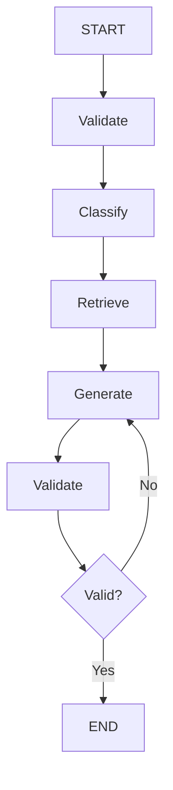

Add:

```text
Maximum 3 Generation Attempts
```

---

# 🧪 Agent Exercise

Build:

```text
LLM
 ↓
Decision
 ↓
Tool
 ↓
LLM
 ↓
Validation
 ↓
END
```

Tools:

```text
Knowledge Search
Customer Lookup
Ticket Creation
```

The graph must enforce:

```text
Tool Authorization
Maximum Tool Calls
Timeout
Retry
```

---

# 🚀 Production Exercise

Extend the graph with:

```text
Authentication
Authorization
Tenant Isolation
RAG
Tool Gateway
Human Approval
Persistence
Observability
Audit
Cost Tracking
```

Architecture:

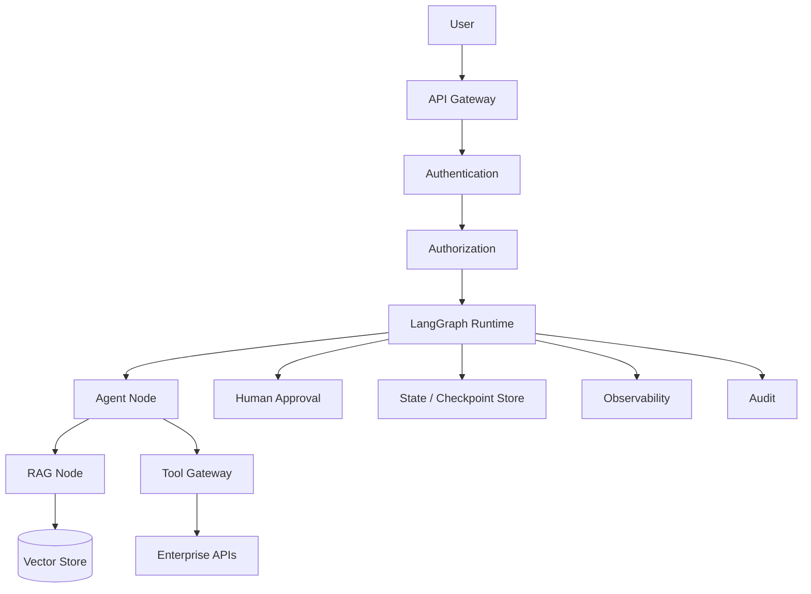

---

# 📊 Evaluation Exercise

Create at least:

```text
100 Test Cases
```

Cover:

```text
Normal Requests
Empty Retrieval
Tool Failure
LLM Failure
Authorization Failure
Human Rejection
Retry
Loop Limit
Timeout
State Recovery
```

Measure:

```text
Task Completion
Correct Routing
Tool Selection
Tool Argument Accuracy
Graph Success Rate
P95 Latency
Token Usage
Cost
```

---

# 🏢 Enterprise Architecture Challenge

Design a LangGraph-based platform supporting:

```text
500 Tenants
100+ Tools
Multiple LLM Providers
RAG
Human Approval
Long-Running Tasks
Multiple Agent Types
```

Required:

```text
API Gateway
Identity
Authorization
Graph Runtime
State Store
Checkpointing
RAG Layer
Tool Gateway
LLM Gateway
Observability
Audit
Evaluation
Cost Controls
```

---

# 🧠 Final Architecture Challenge

Design:

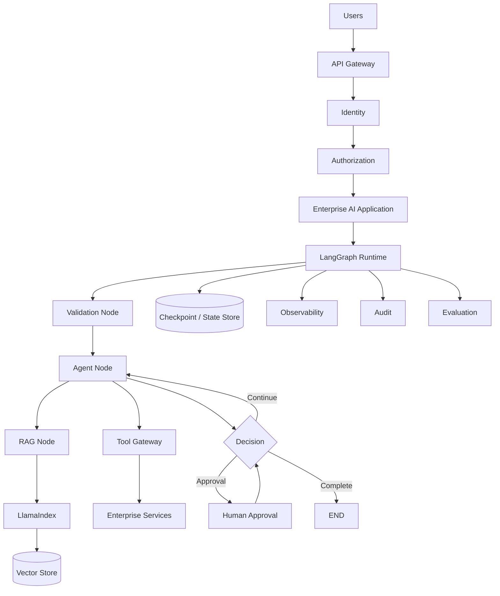

Design the system for:

```text
Security
Reliability
Scalability
Recoverability
Observability
Cost Control
Tenant Isolation
```

---

# 📚 References & Further Reading

Recommended areas for further study:

- LangGraph Graph Architecture
- LangGraph State
- LangGraph Nodes
- LangGraph Edges
- Conditional Routing
- LangGraph Persistence
- Checkpointing
- Human-in-the-Loop
- LangGraph Streaming
- LangGraph Agent Patterns
- LangGraph Tool Calling
- LangGraph RAG
- LangGraph Evaluation
- LangGraph Production Deployment
- Stateful AI Systems
- Graph-Based Orchestration
- Durable Execution
- Agent Architecture
- Enterprise Workflow Architecture

> LangGraph evolves rapidly. Before implementing production systems, verify the current graph APIs, state semantics, reducers, checkpointing behavior, streaming interfaces, persistence mechanisms, agent patterns, and deployment guidance against the official documentation for the exact LangGraph version used by your project.

---

## 🧭 Chapter Navigation

⬅️ **Previous:** [16. LlamaIndex Limitations and Trade-offs](16-llamaindex-limitations-and-tradeoffs.md)

📚 **Part VIII Index:** [AI Engineering Frameworks & Tooling](index.md)

➡️ **Next:** [18. Graph Based Agent Architecture](18-graph-based-agent-architecture.md)

---

> **Enterprise AI Engineering Handbook**
>
> *Building Production-Grade Enterprise AI Systems — One Chapter at a Time.*