# 18 — Graph-Based Agent Architecture

> Understand how graph-based architectures are used to design controllable, stateful, reliable, and production-ready AI Agents using explicit nodes, edges, state, decision points, tools, and execution policies.

---

## 📖 Overview

Traditional AI applications often follow a simple request-response model:

```text
User
 ↓
LLM
 ↓
Response
```

Agent systems require a more sophisticated execution model:

```text
User
 ↓
Agent
 ↓
Reason
 ↓
Decide
 ↓
Act
 ↓
Observe
 ↓
Reason Again
 ↓
Complete
```

As agent complexity increases, implicit control flow becomes difficult to understand, test, secure, and operate.

Graph-based agent architecture addresses this problem by making the execution model explicit:

```text
State
+
Nodes
+
Edges
+
Decision Points
+
Tools
+
Policies
+
Persistence
=
Graph-Based Agent
```

The graph becomes the orchestration layer responsible for controlling how the agent moves through its execution lifecycle.

---

# 🎯 Learning Objectives

After completing this chapter, you will be able to:

- Understand graph-based agent architecture
- Understand the relationship between agents and graphs
- Design stateful agent execution
- Model agent reasoning and action loops
- Design nodes and transitions
- Implement conditional routing
- Design tool execution boundaries
- Build bounded agent loops
- Separate deterministic control from LLM reasoning
- Design human-in-the-loop agent workflows
- Handle failures and retries
- Design agent state and persistence
- Apply security controls to agent graphs
- Design observable agent architectures
- Understand production graph design patterns
- Avoid common graph-based agent anti-patterns

---

# 1. Why Agent Architecture Needs Explicit Control

A simple agent can be represented as:

```text
User
 ↓
LLM
 ↓
Tool
 ↓
LLM
 ↓
Response
```

But enterprise agents may require:

```text
Authentication
 ↓
Authorization
 ↓
Input Validation
 ↓
Planning
 ↓
Reasoning
 ↓
Tool Selection
 ↓
Tool Authorization
 ↓
Tool Execution
 ↓
Observation
 ↓
Validation
 ↓
Retry / Escalation
 ↓
Response
```

The more steps an agent performs, the more important explicit orchestration becomes.

---

# 2. Graph-Based Agent Model

A graph-based agent represents execution as:

```text
                 ┌──────────────┐
                 │    START     │
                 └──────┬───────┘
                        ↓
                 ┌──────────────┐
                 │   Analyze    │
                 └──────┬───────┘
                        ↓
                 ┌──────────────┐
                 │    Reason    │
                 └──────┬───────┘
                        ↓
                 ┌──────────────┐
                 │    Decide    │
                 └───┬──────┬───┘
                     │      │
                  Tool     Done
                     │      │
                     ↓      ↓
                 ┌───────┐  END
                 │ Tool  │
                 └───┬───┘
                     ↓
                 ┌──────────────┐
                 │  Observation │
                 └──────┬───────┘
                        ↓
                     Reason
```

The graph defines the control flow while the LLM provides intelligent decisions inside selected nodes.

---

# 3. Agent vs Graph

These concepts should not be confused.

An **AI Agent** is a behavioral system capable of deciding what actions to take to achieve a goal.

A **Graph** is an orchestration representation used to control execution.

Therefore:

```text
Agent
=
Behavior / Capability
```

while:

```text
Graph
=
Execution / Orchestration
```

A graph can therefore implement:

```text
Agent
Workflow
RAG Pipeline
Human Approval
Business Process
```

---

# 4. Agent Without Explicit Graph

A conceptual agent loop:

```text
while not complete:

    reason()

    action = decide()

    result = execute(action)

    observe(result)
```

This can work for simple systems.

However, production systems need explicit controls around:

```text
Maximum Iterations
Allowed Tools
Authorization
Timeouts
Retries
State
Audit
Human Approval
```

---

# 5. Agent With Graph

The same behavior can be represented explicitly:

```text
START
 ↓
Reason
 ↓
Decide
 ↓
 ┌───────────────┐
 │               │
Tool           Complete
 ↓               ↓
Observe          END
 ↓
Reason
```

This provides a visible execution model.

---

# 6. Core Architecture

A production graph-based agent can be decomposed into:

```text
                Agent Graph
                     │
       ┌─────────────┼─────────────┐
       ↓             ↓             ↓
     State         Nodes         Edges
       │             │             │
       │             ├── Reason    │
       │             ├── Tool      │
       │             ├── Validate  │
       │             └── Review    │
       │                           │
       └──────────── Execution ────┘
```

---

# 7. Major Components

## State

Stores execution context.

```text
query
goal
messages
plan
tool_results
observations
attempts
status
```

## Nodes

Perform work.

```text
reason
plan
retrieve
tool
validate
review
```

## Edges

Control transitions.

```text
reason → tool
reason → finish
tool → observe
observe → reason
```

---

# 8. Agent State

State is the memory of the current execution.

Example:

```python
class AgentState(TypedDict):
    query: str
    goal: str
    plan: list
    messages: list
    tool_calls: list
    observations: list
    attempts: int
    status: str
    final_answer: str
```

A production implementation should keep state intentionally scoped.

Avoid creating a state object containing every possible piece of application data.

---

# 9. State Lifecycle

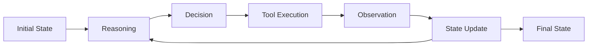

State evolves as the agent progresses.

---

# 10. State vs Memory

State and memory are related but not identical.

### State

```text
Current Execution Context
```

### Memory

```text
Information Persisted Beyond Current Execution
```

For example:

```text
State
 ↓
Current Customer Request
Current Plan
Current Tool Result
```

while:

```text
Memory
 ↓
Previous Conversations
User Preferences
Historical Facts
```

---

# 11. Agent Execution State

A useful state model:

```text
AgentState
 ├── Input
 ├── Goal
 ├── Plan
 ├── Messages
 ├── Tool Requests
 ├── Tool Results
 ├── Validation
 ├── Attempts
 └── Status
```

---

# 12. Nodes as Capabilities

Nodes should represent meaningful capabilities.

Examples:

```text
validate_input
create_plan
reason
retrieve_context
select_tool
authorize_tool
execute_tool
validate_result
human_review
generate_response
```

Avoid creating nodes merely because a function exists.

---

# 13. Node Responsibility

A good node follows:

```text
One Clear Responsibility
```

Example:

```text
authorize_tool
```

should not also:

```text
Generate Final Answer
Update Customer
Send Email
```

Keep responsibilities separated.

---

# 14. Deterministic and Intelligent Nodes

A graph can combine both.

### Deterministic

```text
Validate
Authorize
Rate Limit
Check Policy
Persist
```

### Intelligent

```text
Reason
Plan
Classify
Select Tool
Summarize
```

This produces a powerful architecture:

```text
LLM Intelligence
+
Deterministic Controls
```

---

# 15. Control Plane vs Intelligence Plane

A useful enterprise architecture:

```text
┌───────────────────────────────┐
│       Control Plane           │
│                               │
│ Graph                         │
│ Policies                      │
│ Authorization                 │
│ Limits                        │
│ Retry                         │
│ Timeout                       │
└───────────────┬───────────────┘
                │
                ↓
┌───────────────────────────────┐
│      Intelligence Plane       │
│                               │
│ LLM                           │
│ Reasoning                     │
│ Planning                      │
│ Classification                │
│ Tool Selection                │
└───────────────────────────────┘
```

This separation is important for enterprise reliability.

---

# 16. Why Deterministic Controls Matter

Do not rely on:

```text
Prompt
 ↓
"Please do not delete customers."
```

as the only control.

Instead:

```text
Agent
 ↓
Requested Action
 ↓
Authorization Policy
 ↓
Allowed?
 ├── Yes → Tool
 └── No → Reject
```

---

# 17. Graph-Based Agent Loop

The canonical agent loop is:

```text
Reason
 ↓
Decide
 ↓
Act
 ↓
Observe
 ↓
Reason
```

In graph form:

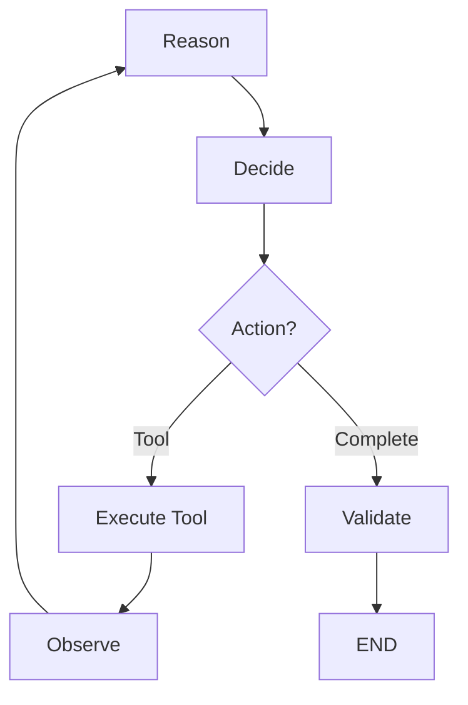

---

# 18. Planning Node

Complex tasks may begin with planning.

```text
User Goal
 ↓
Plan
 ↓
Task 1
Task 2
Task 3
```

Example:

```text
"Prepare a customer account report"

Plan:

1. Retrieve customer
2. Retrieve transactions
3. Calculate summary
4. Validate data
5. Generate report
```

---

# 19. Planning Architecture

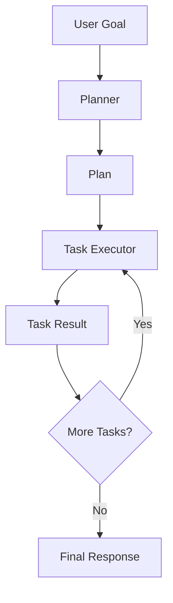

---

# 20. Planning vs Dynamic Reasoning

Planning can be:

```text
Plan Once
 ↓
Execute
```

or:

```text
Plan
 ↓
Execute
 ↓
Observe
 ↓
Re-plan
```

The second approach is useful when the environment changes.

---

# 21. Re-Planning

Example:

```text
Plan
 ↓
Search
 ↓
No Useful Result
 ↓
Re-plan
 ↓
Alternative Search
```

Graph:

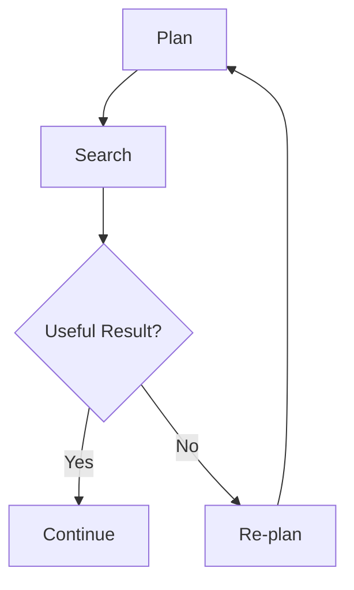

Re-planning should be bounded.

---

# 22. Tool Selection

An agent may have:

```text
Search Tool
Customer Tool
Payment Tool
Ticket Tool
Email Tool
```

The LLM may determine:

```text
Which tool?
What arguments?
When?
```

But the graph should enforce:

```text
Is the tool allowed?
Are arguments valid?
Is the user authorized?
```

---

# 23. Tool Execution Boundary

Recommended:

```text
LLM
 ↓
Tool Selection
 ↓
Tool Validation
 ↓
Authorization
 ↓
Execution
 ↓
Observation
```

Not:

```text
LLM
 ↓
Direct Enterprise API
```

---

# 24. Tool Gateway

A Tool Gateway can centralize:

```text
Authentication
Authorization
Schema Validation
Rate Limiting
Timeout
Audit
Observability
```

Architecture:

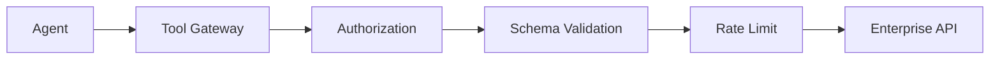

---

# 25. Tool Result Validation

Tool output should not automatically become trusted truth.

Use:

```text
Tool Result
 ↓
Validation
 ↓
Normalization
 ↓
Observation
```

Example:

```text
Customer API
 ↓
Response
 ↓
Schema Validation
 ↓
Agent Observation
```

---

# 26. Tool Error Handling

Tool execution can fail.

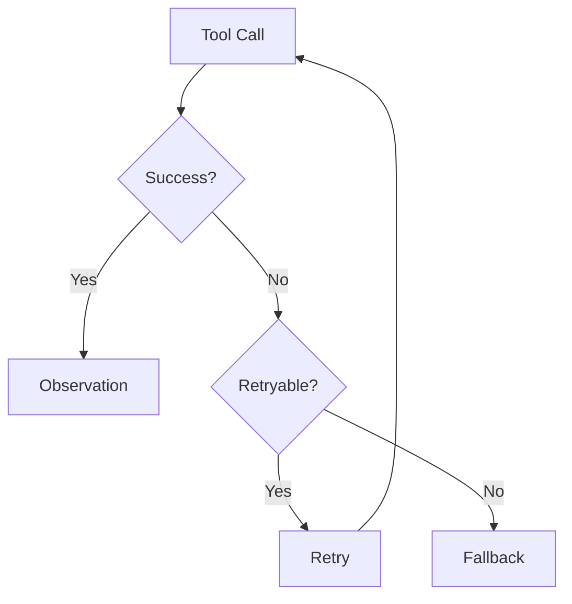

Retries must have limits.

---

# 27. Bounded Execution

Every autonomous loop should have boundaries.

Use:

```text
Maximum Iterations
Maximum Tool Calls
Maximum Runtime
Maximum Token Budget
Maximum Cost
```

Example:

```text
Agent Limits

Iterations: 10
Tool Calls: 20
Runtime: 120 seconds
```

These values are illustrative and should be tuned for the actual workload.

---

# 28. Multi-Dimensional Agent Limits

A production agent should not rely on a single limit.

```text
            Agent
              │
      ┌───────┼────────┐
      ↓       ↓        ↓
 Iterations  Time     Cost
      │       │        │
      └───────┼────────┘
              ↓
         Execution
```

---

# 29. Human-in-the-Loop

High-risk actions should support human intervention.

Example:

```text
Agent
 ↓
Prepare Action
 ↓
Risk Assessment
 ↓
Human Approval
 ↓
Execute
```

---

# 30. Human Approval Graph

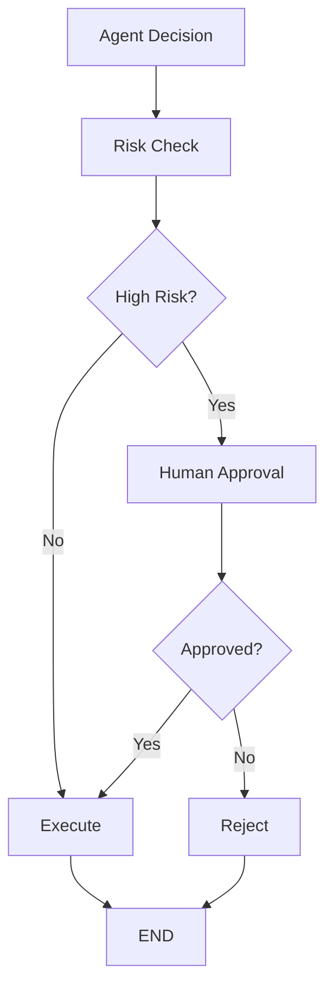

---

# 31. Risk-Based Routing

Not every action requires human approval.

Example:

```text
Read Customer
 ↓
Low Risk
 ↓
Automatic
```

while:

```text
Refund Customer
 ↓
High Risk
 ↓
Human Approval
```

This creates a risk-aware agent architecture.

---

# 32. Agent Risk Tiers

Example:

```text
Tier 0
Read-only

Tier 1
Low-impact updates

Tier 2
Business-impacting actions

Tier 3
Financial / irreversible actions
```

Higher-risk operations should receive stronger controls.

---

# 33. Reflection and Validation

Agents can validate their own work.

```text
Generate
 ↓
Evaluate
 ↓
Correct
 ↓
Generate
```

But self-reflection should not be the only quality control for high-risk decisions.

Use deterministic validators wherever possible.

---

# 34. Reflection Graph

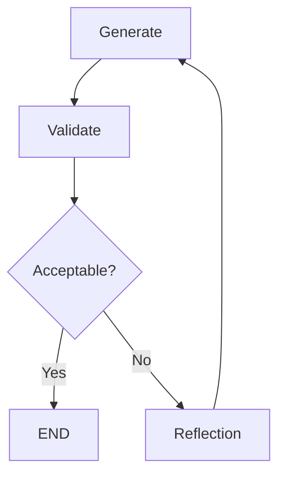

---

# 35. Deterministic Validation

Where possible:

```text
LLM Output
 ↓
Schema Validation
 ↓
Business Rules
 ↓
Security Rules
 ↓
Accept
```

This is stronger than:

```text
LLM
 ↓
"Check your answer"
```

---

# 36. Guardrails Around the Graph

A production graph should have guardrails at multiple points:

```text
Input
 ↓
Input Guardrail
 ↓
Agent
 ↓
Tool Guardrail
 ↓
Tool
 ↓
Output Guardrail
 ↓
Response
```

---

# 37. Guardrail Architecture

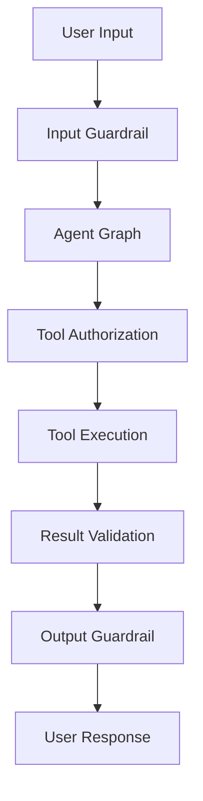

---

# 38. State Persistence

Long-running agents may need to pause and resume.

Example:

```text
Agent
 ↓
Human Approval
 ↓
PAUSED
```

Later:

```text
Approval
 ↓
Resume
 ↓
Agent
```

Persistence makes this possible.

---

# 39. Durable Agent Execution

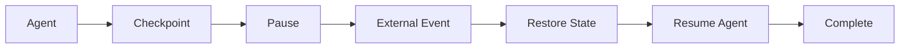

---

# 40. State Recovery

If a node fails:

```text
Node Failure
 ↓
Load Checkpoint
 ↓
Recover State
 ↓
Retry / Resume
```

This is especially important for:

```text
Long-running agents
Financial workflows
Human approval
Research tasks
Enterprise automation
```

---

# 41. Idempotency

Agents may retry operations.

For side effects:

```text
Create Ticket
Send Payment
Update Account
Send Email
```

use idempotency.

Example:

```text
Execution ID
+
Action ID
+
Idempotency Key
```

This prevents accidental duplicate actions.

---

# 42. Agent Execution Identity

Each execution should have identifiers such as:

```text
Tenant ID
User ID
Thread ID
Execution ID
Graph Version
```

These enable:

```text
Tracing
Audit
Recovery
Debugging
```

---

# 43. Multi-Tenant Architecture

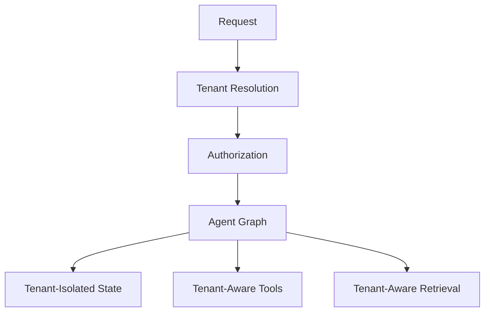

Never allow:

```text
Tenant A State
 ↓
Tenant B Agent
```

---

# 44. Security Architecture

A production graph should enforce:

```text
Identity
 ↓
Authorization
 ↓
Agent
 ↓
Tool Authorization
 ↓
Enterprise Service
```

Security should exist outside the model's reasoning.

---

# 45. Secrets Management

Agents should never receive raw secrets.

Bad:

```text
Agent Prompt
 ↓
API Key
```

Better:

```text
Agent
 ↓
Tool
 ↓
Secret Manager
 ↓
API
```

The agent receives capability access, not credentials.

---

# 46. Data Privacy

Agent state may contain:

```text
Customer Data
Documents
Tool Results
Conversation History
```

Therefore apply:

```text
Data Classification
Access Control
Encryption
Retention
Redaction
Audit
```

---

# 47. Prompt Injection

Agent graphs can encounter untrusted instructions through:

```text
User Input
Retrieved Documents
Web Pages
Emails
Tool Results
```

Treat external content as:

```text
Untrusted Data
```

and keep control instructions separate.

---

# 48. Prompt Injection Boundary

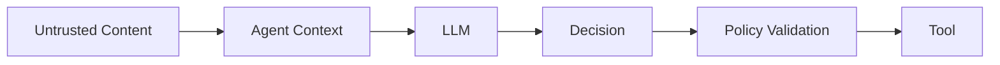

The model should not directly override deterministic policies.

---

# 49. Observability

Agent graphs require execution-level tracing.

Track:

```text
Execution
 ↓
Node
 ↓
Decision
 ↓
Tool
 ↓
Result
 ↓
State Change
```

---

# 50. Agent Trace

Example:

```text
Execution: exec-101

START
 ↓
validate             15ms
 ↓
plan                 420ms
 ↓
retrieve             140ms
 ↓
reason               810ms
 ↓
tool-selection        30ms
 ↓
customer-api         180ms
 ↓
observe               15ms
 ↓
reason               720ms
 ↓
validate              40ms
 ↓
END
```

---

# 51. Agent Metrics

Track:

```text
Task Completion Rate
Tool Success Rate
Tool Selection Accuracy
Average Iterations
Maximum Iterations
Retry Rate
P95 Latency
Token Usage
Cost
Human Escalation Rate
Failure Rate
```

---

# 52. Agent Quality

Agent quality should be evaluated across multiple dimensions:

```text
Task Success
+
Reasoning Quality
+
Tool Selection
+
Tool Arguments
+
Groundedness
+
Safety
+
Cost
+
Latency
```

---

# 53. Agent Evaluation Loop

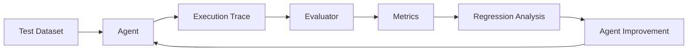

---

# 54. Graph Versioning

An agent graph is executable business logic.

Therefore version:

```text
Graph
Prompt
Model
Tools
Policies
State Schema
```

Example:

```text
customer-agent:v1
customer-agent:v2
```

---

# 55. Graph Deployment Lifecycle

```text
Development
 ↓
Unit Tests
 ↓
Graph Tests
 ↓
AI Evaluation
 ↓
Security Tests
 ↓
Performance Tests
 ↓
Staging
 ↓
Canary
 ↓
Production
```

---

# 56. Canary Deployment

A new graph version can receive a small percentage of traffic.

```text
Production Traffic
       │
       ├── 95% → v1
       │
       └── 5%  → v2
```

Compare:

```text
Quality
Latency
Failure
Cost
Safety
```

before increasing traffic.

---

# 57. Rollback

If the new graph performs poorly:

```text
v2
 ↓
Problem
 ↓
Rollback
 ↓
v1
```

Rollback should include:

```text
Graph
Model
Prompt
Configuration
```

where applicable.

---

# 58. Graph Testing Strategy

Test at multiple levels:

```text
Node Tests
 ↓
Graph Tests
 ↓
Integration Tests
 ↓
Agent Evaluation
 ↓
Security Tests
 ↓
Load Tests
```

---

# 59. Node Tests

Example:

```python
def test_validate_input():
    state = {
        "query": "hello"
    }

    result = validate_input(state)

    assert result["status"] == "valid"
```

Nodes should ideally be independently testable.

---

# 60. Graph Tests

Test:

```text
START
 ↓
Expected Path
 ↓
Expected State
 ↓
END
```

For conditional graphs, test all important paths.

---

# 61. Failure Tests

Simulate:

```text
LLM Timeout
Tool Timeout
Rate Limit
Invalid Tool Arguments
Unauthorized Tool
Empty Retrieval
Validation Failure
Checkpoint Failure
```

Verify:

```text
Retry
Fallback
Escalation
Termination
```

---

# 62. Load Testing

Agent graphs can generate variable workloads.

Measure:

```text
Concurrent Executions
Node Throughput
P95 Latency
P99 Latency
State Store Load
Tool Load
LLM Load
```

---

# 63. Cost Controls

Agent loops can multiply LLM calls.

Use:

```text
Token Budget
Call Budget
Tool Budget
Time Budget
Cost Budget
```

Example:

```text
Max LLM Calls = 10
Max Tool Calls = 20
Max Runtime = 120 sec
```

These are illustrative limits, not universal defaults.

---

# 64. Backpressure

If downstream services become overloaded:

```text
Agent
 ↓
Tool Gateway
 ↓
Enterprise API
```

the system should apply:

```text
Rate Limiting
Queueing
Backpressure
Circuit Breaking
```

Agents should not amplify infrastructure overload.

---

# 65. Circuit Breaker

For unstable external services:

```text
Agent
 ↓
Tool
 ↓
Circuit Breaker
 ↓
External Service
```

If failure rate becomes high:

```text
OPEN
 ↓
Reject / Fallback
```

This protects downstream systems.

---

# 66. Agent Reliability Architecture

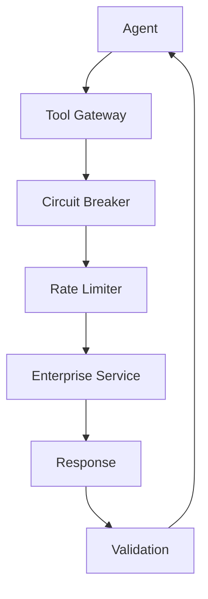

---

# 67. Deterministic Workflow + Agent

One of the strongest enterprise patterns is:

```text
Deterministic Workflow
        ↓
Bounded Agent
        ↓
Deterministic Workflow
```

Example:

```text
Validate Request
 ↓
Agent Research
 ↓
Validate Evidence
 ↓
Human Approval
 ↓
Execute Transaction
```

This limits autonomy to the areas where it provides value.

---

# 68. Bounded Agent Pattern

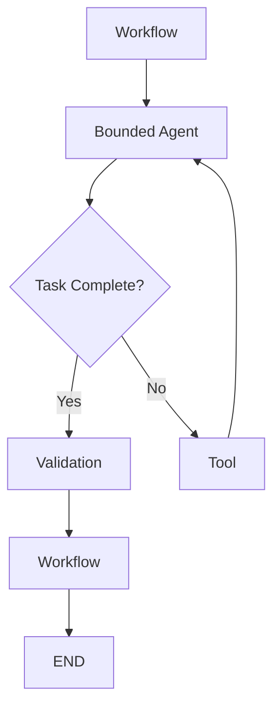

---

# 69. Agent Supervisor Pattern

A supervisor can route work to specialized agents.

```text
Supervisor
 ├── Research Agent
 ├── Data Agent
 ├── Support Agent
 └── Compliance Agent
```

Detailed multi-agent architectures belong to the later **Agentic AI & Multi-Agent Systems** module.

For Part VIII, the focus remains on the framework and graph orchestration mechanics.

---

# 70. LangGraph + LlamaIndex

The two frameworks can complement each other.

```text
LangGraph
 ↓
Agent Orchestration
 ↓
RAG Capability
 ↓
LlamaIndex
 ↓
Retrieval / Data
```

Example:

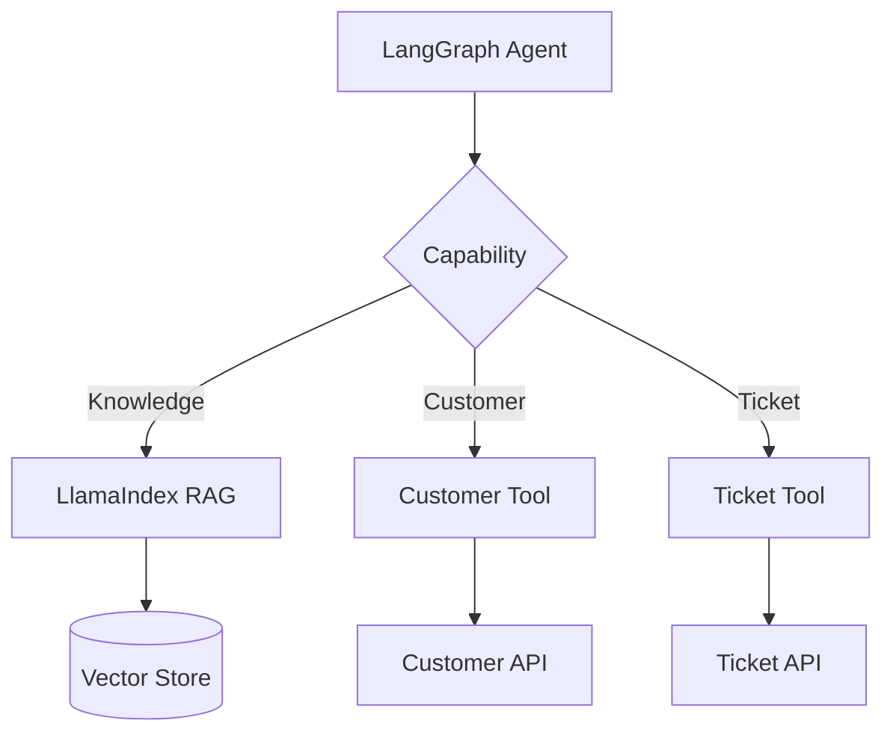

This allows:

```text
LangGraph
=
Control Flow

LlamaIndex
=
Retrieval / Data Capability
```

---

# 71. Capability-Based Architecture

A framework-neutral enterprise architecture can use ports:

```text
Agent Application
      │
      ├── Orchestration Port
      │        ↓
      │   LangGraph Adapter
      │
      ├── Knowledge Port
      │        ↓
      │   LlamaIndex Adapter
      │
      ├── LLM Port
      │        ↓
      │   Provider Adapter
      │
      └── Tool Port
               ↓
          Tool Gateway
```

This reduces framework coupling.

---

# 72. Graph as an Execution Contract

A graph can act as an explicit contract describing:

```text
Allowed Nodes
Allowed Transitions
Allowed Tools
Termination Conditions
Failure Paths
Approval Points
```

This is valuable in regulated enterprise systems.

---

# 73. Graph as a Policy Boundary

Example:

```text
LLM says:
"Delete account"
```

Graph:

```text
Requested Action
 ↓
Risk Check
 ↓
Authorization
 ↓
Human Approval
 ↓
Execute
```

The LLM cannot bypass the graph's policy boundary.

---

# 74. Graph Complexity

Graph architecture itself can become complex.

Poor:

```text
100+ Nodes
300+ Edges
Many Cycles
Unclear State
```

Better:

```text
Bounded Subgraphs
+
Clear State
+
Meaningful Nodes
+
Explicit Contracts
```

---

# 75. Subgraphs

Large systems can be decomposed into smaller graph components.

Example:

```text
Main Graph
 │
 ├── Retrieval Subgraph
 │
 ├── Research Subgraph
 │
 └── Approval Subgraph
```

Conceptually:

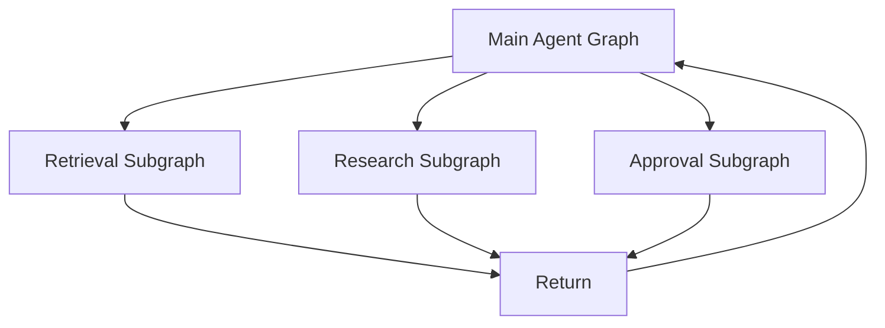

Subgraphs can improve modularity when boundaries are well-defined.

---

# 76. Graph Composition

A composed architecture:

```text
Main Graph
 ↓
Subgraph A
 ↓
Subgraph B
 ↓
Subgraph C
 ↓
END
```

Each subgraph should have:

```text
Clear Input
Clear Output
Clear State Contract
Clear Failure Semantics
```

---

# 77. Common Anti-Patterns

## Anti-Pattern 1 — LLM Controls Everything

```text
LLM
 ↓
All Decisions
 ↓
All APIs
```

Problem:

```text
Weak Control
Security Risk
Unpredictability
```

---

# 78. Anti-Pattern 2 — Giant Agent Graph

```text
One Graph
 ↓
Every Enterprise Process
```

Problem:

```text
Hard to Test
Hard to Deploy
Hard to Reason About
```

Prefer bounded domains.

---

# 79. Anti-Pattern 3 — Unbounded Autonomy

```text
Agent
 ↓
Agent
 ↓
Agent
 ↓
...
```

Always enforce execution boundaries.

---

# 80. Anti-Pattern 4 — Business Rules in Prompts

Avoid:

```text
Prompt:
"Never approve transactions above X."
```

as the only enforcement mechanism.

Prefer:

```text
Agent Decision
 ↓
Deterministic Policy
 ↓
Approval
```

---

# 81. Anti-Pattern 5 — Shared Global State

Avoid:

```text
Global Agent State
 ↓
All Users
```

Prefer:

```text
Tenant
 ↓
Thread
 ↓
Execution
 ↓
State
```

---

# 82. Anti-Pattern 6 — No Idempotency

Avoid:

```text
Retry
 ↓
Duplicate Side Effect
```

Use:

```text
Idempotency Key
```

for side-effecting operations.

---

# 83. Anti-Pattern 7 — No Observability

Avoid:

```text
Agent Failed
```

with no information about:

```text
Which Node?
Which Tool?
Which Decision?
Which State?
Which Model?
Which Error?
```

---

# 84. Production Architecture Checklist

## Graph Design

- [ ] Clear node responsibilities
- [ ] Explicit transitions
- [ ] Minimal state
- [ ] Bounded loops
- [ ] Explicit termination
- [ ] Modular subgraphs

## Agent

- [ ] Planning strategy
- [ ] Reasoning strategy
- [ ] Tool selection
- [ ] Tool validation
- [ ] Reflection / validation
- [ ] Maximum iterations

## Reliability

- [ ] Timeouts
- [ ] Retries
- [ ] Backoff
- [ ] Circuit breakers
- [ ] Idempotency
- [ ] Checkpointing
- [ ] Recovery

## Security

- [ ] Authentication
- [ ] Authorization
- [ ] Tool authorization
- [ ] Tenant isolation
- [ ] Secret management
- [ ] Prompt injection protection
- [ ] Audit

## Operations

- [ ] Distributed tracing
- [ ] Node metrics
- [ ] Agent metrics
- [ ] Cost tracking
- [ ] Alerts
- [ ] Graph versioning
- [ ] Rollback

---

# 85. Key Takeaways

- Graph-based architecture makes agent execution explicit.
- Agents and graphs are related but are not the same concept.
- Agents provide intelligent behavior while graphs provide orchestration.
- State represents the current execution context.
- Nodes should represent meaningful capabilities.
- Edges define valid transitions.
- Conditional edges enable dynamic routing.
- Loops enable iterative reasoning and tool use.
- Autonomous loops must always be bounded.
- Deterministic controls should surround LLM decisions.
- Tool access should pass through authorization and validation boundaries.
- Human approval is useful for high-risk operations.
- Checkpointing enables long-running and recoverable execution.
- Idempotency protects side-effecting operations during retries.
- Tenant isolation must be explicit.
- Agent state should never become an uncontrolled global object.
- Observability must expose graph, node, tool, model, and state transitions.
- Agent evaluation should measure both task success and operational behavior.
- Graphs should be versioned like production business logic.
- Large graphs should be decomposed into bounded subgraphs.
- LangGraph can provide orchestration while LlamaIndex provides retrieval and data capabilities.
- Capability-based architecture can reduce framework coupling.
- The strongest enterprise pattern is often deterministic workflow + bounded agent + deterministic validation.
- The objective is not maximum autonomy.
- The objective is **controlled autonomy with measurable outcomes**.

---

# 📝 Quick Revision Notes

## Graph-Based Agent

```text
State
+
Nodes
+
Edges
+
LLM Decisions
+
Tools
+
Policies
=
Graph-Based Agent
```

---

## Agent Loop

```text
Reason
 ↓
Decide
 ↓
Act
 ↓
Observe
 ↓
Reason
```

---

## Enterprise Agent Loop

```text
Reason
 ↓
Decide
 ↓
Validate
 ↓
Authorize
 ↓
Execute
 ↓
Observe
 ↓
Validate
 ↓
Continue / Complete
```

---

## Bounded Autonomy

```text
Agent
 ↓
Max Iterations
 ↓
Max Tool Calls
 ↓
Max Runtime
 ↓
Max Cost
```

---

## Reliable Agent

```text
Agent
+
State
+
Persistence
+
Retries
+
Timeouts
+
Idempotency
+
Observability
+
Guardrails
```

---

## Framework Separation

```text
LangGraph
 ↓
Orchestration

LlamaIndex
 ↓
RAG / Retrieval

LLM Provider
 ↓
Generation

Tool Gateway
 ↓
Enterprise APIs
```

---

# ❓ Interview Questions

## Beginner

1. What is graph-based agent architecture?
2. What is the difference between an AI Agent and a graph?
3. What are nodes and edges?
4. What is graph state?
5. Why are conditional edges useful?
6. Why are loops useful for agents?
7. What is a bounded agent loop?
8. Why is tool authorization necessary?
9. What is checkpointing?
10. What is the difference between state and memory?

## Intermediate

11. How would you design an agent graph?
12. How would you model an agent reasoning loop?
13. How would you implement conditional tool routing?
14. How would you prevent infinite agent loops?
15. How would you implement retry and backoff?
16. How would you design agent state?
17. How would you implement human approval?
18. How would you secure tool execution?
19. How would you implement tenant isolation?
20. How would you monitor graph execution?
21. How would you test graph branches?
22. How would you design agent checkpointing?
23. How would you combine deterministic workflows and agents?
24. How would you integrate LlamaIndex with LangGraph?

## Advanced

25. Design a production-grade graph-based enterprise agent.
26. How would you separate the control plane from the intelligence plane?
27. How would you prevent an LLM from bypassing business policies?
28. How would you design a Tool Gateway for graph-based agents?
29. How would you design durable agent execution?
30. How would you recover a graph after infrastructure failure?
31. How would you evolve agent state schemas safely?
32. How would you design multi-tenant agent execution?
33. How would you prevent duplicate side effects during retries?
34. How would you design agent cost controls?
35. How would you design observability for a multi-node agent graph?
36. How would you test every important agent execution path?
37. How would you design bounded autonomy?
38. How would you decompose a large agent graph into subgraphs?
39. How would you reduce framework coupling?
40. When should you use a deterministic workflow instead of an agent?
41. How would you design a LangGraph + LlamaIndex enterprise architecture?
42. How would you safely deploy a new graph version?
43. How would you implement canary deployment for agents?
44. How would you design graph-level security boundaries?
45. How would you measure whether an agent is actually improving business outcomes?

---

# 🛠️ Practical Exercise

Build an enterprise customer-support agent with:

```text
1. Query Validation
2. Intent Classification
3. Knowledge Retrieval
4. Agent Reasoning
5. Tool Selection
6. Tool Authorization
7. Tool Execution
8. Result Validation
9. Human Approval for High-Risk Actions
10. Final Response
```

Architecture:

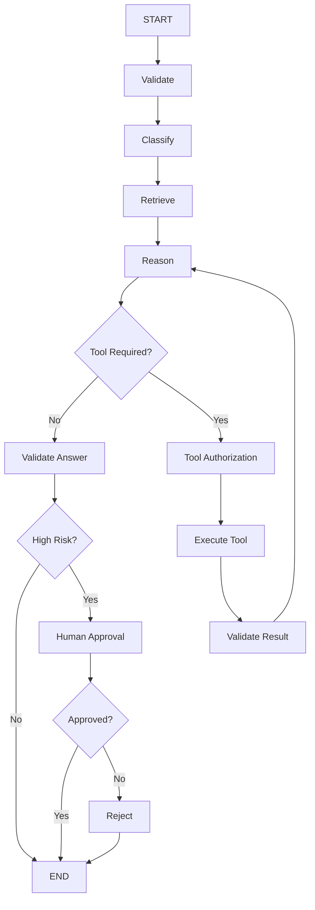

Add:

```text
Maximum 5 agent iterations
Maximum 10 tool calls
120-second execution timeout
Retry for transient tool failures
Checkpointing
Audit logging
```

---

# 🧪 Evaluation Exercise

Create at least:

```text
100 Agent Tasks
```

Include:

```text
Simple Requests
Multi-Step Requests
Tool Calls
RAG Queries
Tool Failures
LLM Failures
Authorization Failures
Human Approval
Rejection
Timeout
Retry
State Recovery
```

Measure:

```text
Task Completion Rate
Tool Selection Accuracy
Tool Argument Accuracy
Graph Path Accuracy
Failure Recovery Rate
Average Iterations
P95 Latency
Token Usage
Cost
Human Escalation Rate
```

---

# 🚀 Production Architecture Exercise

Design a production platform:

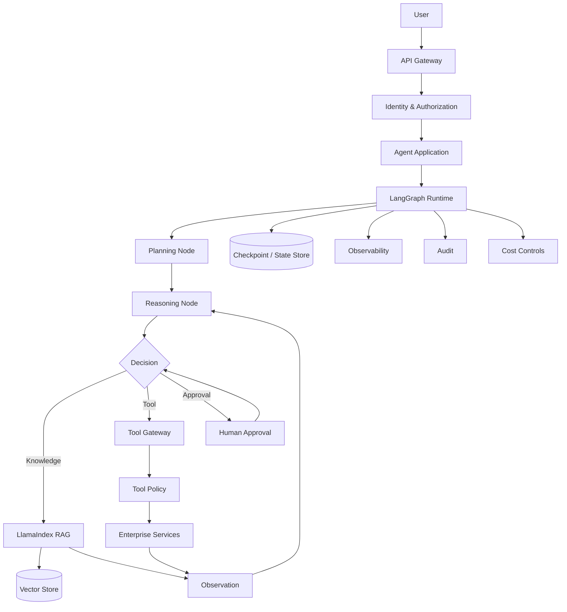

The platform must support:

```text
Multi-Tenancy
High Availability
Long-Running Execution
Human Approval
Tool Authorization
RAG
Multiple LLM Providers
Observability
Audit
Cost Controls
Rollback
```

---

# 🧠 Architecture Challenge

Design a **Banking Operations Agent** that can:

```text
1. Search customer information
2. Retrieve bank policies
3. Analyze transactions
4. Create support tickets
5. Recommend actions
6. Execute low-risk operations
7. Request human approval for high-risk operations
```

The agent must **never directly execute an irreversible operation solely because the LLM requested it**.

Design the graph with:

```text
State
Nodes
Edges
Tools
Authorization
Risk Classification
Human Approval
Persistence
Observability
```

Then identify:

```text
What is deterministic?
What is LLM-driven?
What is persisted?
What is audited?
What requires human approval?
What can be automatically retried?
```

---

# 📚 References & Further Reading

Recommended areas for further study:

- LangGraph Architecture
- Graph-Based Agent Orchestration
- Stateful Agent Systems
- Agent Planning
- Agent Reasoning
- Tool Calling
- Human-in-the-Loop Systems
- Durable Execution
- Checkpointing
- Agent Evaluation
- Agent Observability
- AI Security
- Tool Authorization
- Enterprise Workflow Architecture
- LlamaIndex RAG
- LangGraph + LlamaIndex Integration
- Capability-Based Architecture
- Ports & Adapters Architecture
- Multi-Tenant AI Systems
- AI FinOps
- Distributed Systems Reliability

> LangGraph and the surrounding AI framework ecosystem evolve rapidly. Verify the current APIs, state semantics, persistence mechanisms, checkpointing behavior, graph execution model, and deployment recommendations against the official documentation for the exact versions used in production.

---

## 🧭 Chapter Navigation

⬅️ **Previous:** [17. LangGraph Fundamentals](17-langgraph-fundamentals.md)

📚 **Part VIII Index:** [AI Engineering Frameworks & Tooling](index.md)

➡️ **Next:** [19. LangGraph State and Checkpointing](19-langgraph-state-and-checkpointing.md)

---

> **Enterprise AI Engineering Handbook**
>
> *Building Production-Grade Enterprise AI Systems — One Chapter at a Time.*