# 19 — LangGraph State and Checkpointing

> Understand how LangGraph manages execution state, persists graph progress, enables recovery, and supports durable, stateful AI Agent execution.

---

## 📖 Overview

State is one of the most important concepts in graph-based AI systems.

A simple LLM application may look like:

```text
Request
   ↓
LLM
   ↓
Response
```

A production AI Agent may execute:

```text
Request
   ↓
Validate
   ↓
Plan
   ↓
Reason
   ↓
Tool
   ↓
Observe
   ↓
Reason
   ↓
Human Approval
   ↓
Resume
   ↓
Execute
   ↓
Response
```

The system therefore needs to remember:

```text
Where execution is
What has already happened
What information has been collected
What tools were called
What results were returned
What decisions were made
What should happen next
```

This is where **graph state** and **checkpointing** become essential.

The core model is:

```text
Graph
 ↓
State
 ↓
Execution
 ↓
State Update
 ↓
Checkpoint
 ↓
Resume / Recover
```

---

# 🎯 Learning Objectives

After completing this chapter, you will be able to:

- Understand LangGraph state management
- Understand state schemas
- Design agent state
- Understand state updates
- Understand reducers
- Understand state persistence
- Understand checkpointing
- Understand thread-based execution
- Understand resumable execution
- Design human-in-the-loop state
- Handle long-running agent execution
- Design recovery strategies
- Understand state isolation
- Design production checkpoint architectures
- Identify common state-management anti-patterns

---

# 1. What Is Graph State?

Graph state represents the information available to the graph during execution.

Example:

```text
query
plan
messages
documents
tool_calls
tool_results
feedback
attempts
status
answer
```

A simple representation:

```python
class AgentState(TypedDict):
    query: str
    plan: list
    messages: list
    tool_results: list
    attempts: int
    answer: str
```

The exact state implementation depends on the LangGraph version and the application's requirements.

---

# 2. State as Execution Context

Think of state as:

```text
Current Execution Context
```

For example:

```text
User Query
    ↓
State
    ├── query
    ├── plan
    ├── retrieved_documents
    ├── tool_results
    ├── feedback
    └── attempts
```

Each node reads the state it needs and produces updates.

---

# 3. State Lifecycle

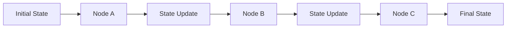

The important principle is:

```text
Node
 ↓
Read State
 ↓
Perform Work
 ↓
Return Update
 ↓
Next Node
```

---

# 4. State Schema

A state schema defines the fields managed by the graph.

Example:

```python
from typing import TypedDict


class AgentState(TypedDict):
    query: str
    plan: list
    documents: list
    messages: list
    tool_results: list
    attempts: int
    status: str
    answer: str
```

A production state schema should be:

```text
Minimal
Explicit
Well-Defined
Versionable
```

---

# 5. Why State Design Matters

Poor state design can create:

```text
Tight Coupling
Large Payloads
Difficult Debugging
Serialization Problems
Security Risks
Migration Problems
```

Good state design provides:

```text
Clear Ownership
Predictable Updates
Smaller Payloads
Easier Testing
Better Observability
```

---

# 6. State Ownership

Each node should have clear responsibility for the fields it updates.

Example:

```text
Planner
 ↓
plan

Retriever
 ↓
documents

Tool
 ↓
tool_results

Validator
 ↓
feedback

Generator
 ↓
answer
```

This creates a clear state ownership model.

---

# 7. State Updates

A node generally does not need to reconstruct the entire state.

Instead, it can return an update.

Example:

```python
def retrieve(state):
    documents = search(state["query"])

    return {
        "documents": documents
    }
```

Another node:

```python
def generate(state):
    answer = generate_answer(
        state["query"],
        state["documents"]
    )

    return {
        "answer": answer
    }
```

Conceptually:

```text
State
 ↓
Partial Update
 ↓
New State
```

---

# 8. State Evolution

Example:

```text
Initial

{
    query
}
```

After retrieval:

```text
{
    query,
    documents
}
```

After generation:

```text
{
    query,
    documents,
    answer
}
```

After validation:

```text
{
    query,
    documents,
    answer,
    feedback
}
```

---

# 9. State Evolution Diagram

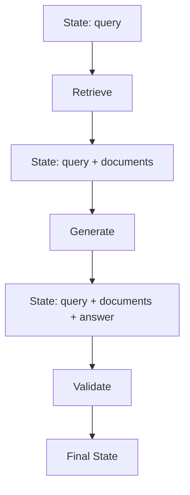

---

# 10. Messages as State

Agent applications frequently maintain conversation messages.

Conceptually:

```python
class AgentState(TypedDict):
    messages: list
```

Example:

```text
User
 ↓
Message
 ↓
Assistant
 ↓
Tool
 ↓
Tool Result
 ↓
Assistant
```

The message history becomes part of the execution context.

---

# 11. Message Growth

Message history can grow quickly:

```text
Turn 1
 ↓
Turn 2
 ↓
Turn 3
 ↓
...
 ↓
Turn 100
```

Therefore production systems should consider:

```text
Summarization
Pruning
Context Management
Token Limits
Persistent Memory
```

Do not assume that keeping the entire conversation forever is optimal.

---

# 12. State vs Long-Term Memory

These concepts should be separated.

### Graph State

```text
Current Execution
```

### Long-Term Memory

```text
Information Available Across Executions
```

Example:

```text
Current State
 ├── current_query
 ├── current_plan
 └── current_tool_results
```

while:

```text
Long-Term Memory
 ├── customer_preferences
 ├── historical_interactions
 └── persistent_profile
```

---

# 13. State vs External Data

Not every piece of information belongs inside graph state.

Instead:

```text
Graph State
 ↓
Reference / ID
 ↓
External Store
```

For example:

```text
customer_id
document_ids
transaction_id
```

may be preferable to storing huge objects directly in state.

---

# 14. State Payload Design

Avoid:

```text
State
 └── 50 MB Documents
```

Prefer:

```text
State
 ├── document_ids
 └── retrieval_metadata
```

and:

```text
External Store
 └── Full Documents
```

This improves:

```text
Performance
Persistence
Serialization
Cost
Recovery
```

---

# 15. Reducers

Reducers determine how multiple updates to a state field are combined.

For example:

```text
Existing Messages
+
New Messages
=
Combined Messages
```

instead of:

```text
Existing Messages
replaced by
New Messages
```

This is particularly important when multiple nodes contribute to the same state field.

---

# 16. Reducer Concept

```text
Node A
  │
  ├── update A
  │
  ↓
Shared State
  ↑
  │
  ├── update B
  │
Node B
```

The reducer defines how:

```text
Update A
+
Update B
```

becomes the resulting state.

---

# 17. Reducer Example

Conceptually:

```python
from operator import add
from typing import Annotated, TypedDict


class State(TypedDict):
    messages: Annotated[list, add]
```

The exact reducer strategy should be selected based on the state semantics and current LangGraph API.

The important concept is:

```text
Reducer
=
State Update Combination Rule
```

---

# 18. State Mutation

Prefer explicit state updates.

Avoid hidden mutation such as:

```python
state["attempts"] += 1
```

followed by unclear behavior.

Prefer a clear update:

```python
return {
    "attempts": state["attempts"] + 1
}
```

Explicit updates make execution easier to reason about and test.

---

# 19. Checkpointing

Checkpointing means persisting graph execution state so that execution can later be:

```text
Recovered
Resumed
Inspected
Debugged
```

Conceptually:

```text
Node A
 ↓
Checkpoint
 ↓
Node B
 ↓
Checkpoint
 ↓
Node C
```

---

# 20. Why Checkpointing Matters

Without persistence:

```text
Process Failure
 ↓
Execution Lost
```

With checkpointing:

```text
Process Failure
 ↓
Load Checkpoint
 ↓
Recover State
 ↓
Resume
```

This is particularly useful for long-running agents.

---

# 21. Checkpoint Architecture

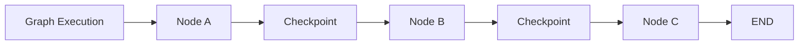

The checkpoint store acts as durable execution state.

---

# 22. Checkpointer

A LangGraph application can be configured with a checkpointer.

Conceptually:

```python
checkpointer = ...

graph = builder.compile(
    checkpointer=checkpointer
)
```

The concrete checkpointer depends on the persistence technology and LangGraph setup.

---

# 23. In-Memory vs Durable Persistence

Development may use:

```text
In-Memory
```

Production typically needs:

```text
Durable Persistence
```

Examples of storage categories include:

```text
Database
Distributed Store
Managed Persistence Layer
```

The choice depends on:

```text
Scale
Durability
Availability
Latency
Operational Requirements
```

---

# 24. Checkpoint Storage

Conceptually:

```text
LangGraph
    │
    ↓
Checkpoint Layer
    │
    ↓
Persistent Store
```

The persistent store may contain:

```text
Execution State
Checkpoint Metadata
Thread Information
Execution History
```

---

# 25. Thread-Based State

A graph execution generally needs an execution identity.

For conversational agents, a thread can represent:

```text
Conversation
```

Conceptually:

```python
config = {
    "configurable": {
        "thread_id": "customer-123"
    }
}
```

Then:

```python
graph.invoke(
    input_state,
    config=config
)
```

The exact configuration API should be verified against the LangGraph version being used.

---

# 26. Thread Isolation

Different users should have separate state.

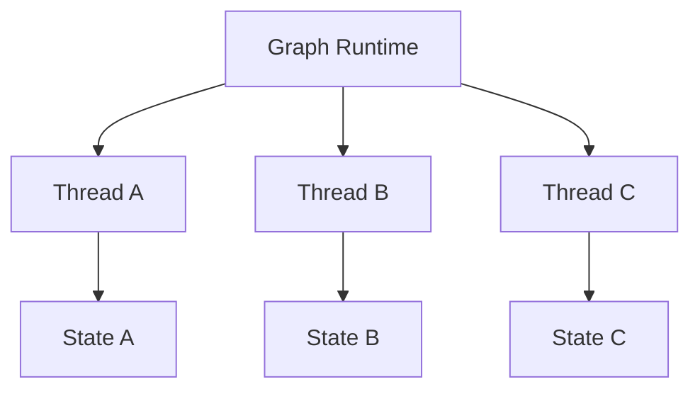

Never allow:

```text
Thread A
 ↓
State B
```

through accidental identifier reuse or insufficient authorization.

---

# 27. Tenant + Thread + Execution

A production identity model can be:

```text
Tenant
 ↓
User
 ↓
Thread
 ↓
Execution
 ↓
Checkpoint
```

Example:

```text
tenant-001
    │
    └── user-101
          │
          └── thread-5001
                │
                ├── execution-1
                ├── execution-2
                └── execution-3
```

---

# 28. Human-in-the-Loop

Checkpointing becomes especially valuable when a human must approve an action.

Example:

```text
Agent
 ↓
Prepare Transaction
 ↓
Checkpoint
 ↓
Human Approval
 ↓
Resume
 ↓
Execute
```

The graph does not need to remain actively running while waiting for approval.

---

# 29. Human Approval Architecture

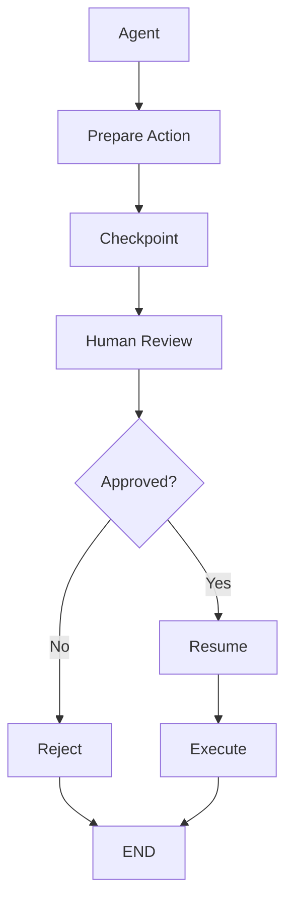

---

# 30. Long-Running Agents

Some agents may run for:

```text
Minutes
Hours
Days
```

Examples:

```text
Research
Procurement
Incident Management
Document Processing
Business Workflows
Human Approval
```

Checkpointing enables:

```text
Pause
Persist
Resume
```

---

# 31. Durable Execution

A durable agent should survive:

```text
Process Restart
Container Restart
Node Failure
Network Failure
Temporary Service Failure
```

Architecture:

```text
Agent
 ↓
Checkpoint
 ↓
Infrastructure Failure
 ↓
Restart
 ↓
Restore State
 ↓
Resume
```

---

# 32. Recovery Model

A production recovery strategy should answer:

```text
Where was execution?
What state was committed?
Which tools already executed?
Can the operation be retried safely?
Was there a side effect?
Should the node resume or restart?
```

Checkpointing solves only part of the problem.

---

# 33. Checkpointing Does Not Guarantee Idempotency

Consider:

```text
Checkpoint
 ↓
Payment Tool
 ↓
Payment Successful
 ↓
Process Crashes
```

If the system resumes incorrectly:

```text
Payment Tool
 ↓
Payment Again
```

could create a duplicate payment.

Therefore:

```text
Checkpointing
+
Idempotency
```

are both required.

---

# 34. Idempotent Tool Execution

Use:

```text
Execution ID
+
Action ID
+
Idempotency Key
```

Example:

```text
execution-100
action-payment-1
idempotency-key-abc
```

The downstream service can reject duplicate execution.

---

# 35. Checkpoint Boundaries

Checkpointing strategy should consider:

```text
Before High-Risk Action
After High-Risk Action
Before Human Approval
After Human Approval
After Important Tool Result
```

Do not blindly persist huge amounts of data after every trivial operation without considering cost and performance.

---

# 36. Checkpoint Frequency

There is a trade-off.

### More Checkpoints

```text
Better Recovery
+
More Storage
+
More Persistence Overhead
```

### Fewer Checkpoints

```text
Less Overhead
+
More Work Lost During Failure
```

Choose checkpoint frequency according to:

```text
Failure Cost
State Size
Latency
Durability Requirements
```

---

# 37. State Serialization

Persistent state must be serializable.

Potential problems include:

```text
Open File Handles
Network Connections
Database Connections
Non-Serializable Objects
Large Binary Objects
Runtime Objects
```

Avoid storing these directly in graph state.

Prefer:

```text
Reference
 ↓
External Resource
```

---

# 38. State and External Resources

Bad:

```text
State
 └── Database Connection
```

Better:

```text
State
 └── Customer ID
```

Then:

```text
Node
 ↓
Customer ID
 ↓
Database Service
 ↓
Customer Data
```

---

# 39. State Size

Large state can increase:

```text
Serialization Cost
Network Traffic
Storage Cost
Checkpoint Latency
Recovery Time
```

A production state should therefore be:

```text
Small
Relevant
Serializable
Versionable
Secure
```

---

# 40. Sensitive State

Agent state may contain:

```text
PII
Financial Information
Customer Data
Documents
Tool Results
Conversation History
```

Therefore checkpoint storage must be protected using:

```text
Encryption
Access Control
Retention Policies
Audit
Data Classification
```

---

# 41. State Retention

Do not keep agent state forever by default.

Define:

```text
Retention Period
Archival Policy
Deletion Policy
Compliance Requirements
```

Example:

```text
Active Thread
 ↓
Retention Period
 ↓
Archive
 ↓
Deletion
```

---

# 42. State Redaction

Sensitive values may need to be removed before persistence.

Example:

```text
Agent State
 ↓
Redaction
 ↓
Checkpoint
```

Possible sensitive values:

```text
Access Tokens
Secrets
Payment Data
Personal Information
Internal Credentials
```

---

# 43. Checkpoint Security

A checkpoint store should enforce:

```text
Authentication
Authorization
Tenant Isolation
Encryption
Audit
Retention
```

The checkpoint database is part of the security boundary.

---

# 44. State Versioning

State schemas can change.

Version 1:

```text
query
documents
answer
```

Version 2:

```text
query
documents
answer
customer_context
```

A production system needs a strategy for existing checkpoints.

---

# 45. State Migration

Possible approaches:

```text
Versioned State
      ↓
Migration
      ↓
Current Schema
```

or:

```text
Backward-Compatible Reader
```

The correct strategy depends on:

```text
Checkpoint Lifetime
Deployment Model
Schema Complexity
Rollback Requirements
```

---

# 46. Deployment and State Compatibility

Consider:

```text
Graph v1
 ↓
Checkpoint v1
```

Then deploy:

```text
Graph v2
```

Question:

```text
Can Graph v2 safely resume Checkpoint v1?
```

This should be explicitly tested before production rollout.

---

# 47. Blue-Green Deployment

State compatibility matters during:

```text
Blue
 ↓
Green
```

deployment.

Example:

```text
Graph v1
 ↓
Checkpoint
 ↓
Graph v2
 ↓
Resume
```

If state schemas are incompatible, in-flight executions may fail.

---

# 48. State Migration Strategy

A robust strategy:

```text
Define Schema Version
 ↓
Detect Version
 ↓
Migrate
 ↓
Validate
 ↓
Resume
```

Example:

```python
if state["schema_version"] == 1:
    state = migrate_v1_to_v2(state)
```

---

# 49. Checkpoint Recovery

A recovery sequence:

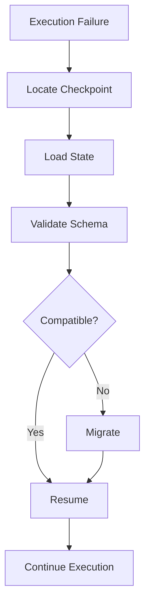

---

# 50. Checkpoint vs Event Log

These concepts are related but different.

### Checkpoint

```text
Snapshot of State
```

### Event Log

```text
Sequence of Events
```

Example:

```text
Event 1
Event 2
Event 3
 ↓
Current State
```

A system may use either or both depending on its durability and audit requirements.

---

# 51. Checkpoint vs Database

A checkpoint store is primarily concerned with:

```text
Graph Execution State
```

while an enterprise database may contain:

```text
Business Data
Customer Data
Transactions
Orders
```

Do not automatically use graph state as a replacement for the system of record.

---

# 52. System of Record

For example:

```text
Agent State
 ↓
customer_id
```

while:

```text
Customer Database
 ↓
Customer Profile
```

The agent should retrieve authoritative business data from the appropriate enterprise system.

---

# 53. State as Cache vs Source of Truth

A useful rule:

```text
Graph State
=
Execution Context
```

not:

```text
Graph State
=
Enterprise Source of Truth
```

Business systems should remain authoritative for business records.

---

# 54. Parallel Execution

Some graphs may execute independent work in parallel.

Example:

```text
          ┌──→ Search
Agent ────┤
          └──→ Customer API
```

Then:

```text
Search Result
      +
Customer Result
      ↓
Combined State
```

---

# 55. Parallel State Updates

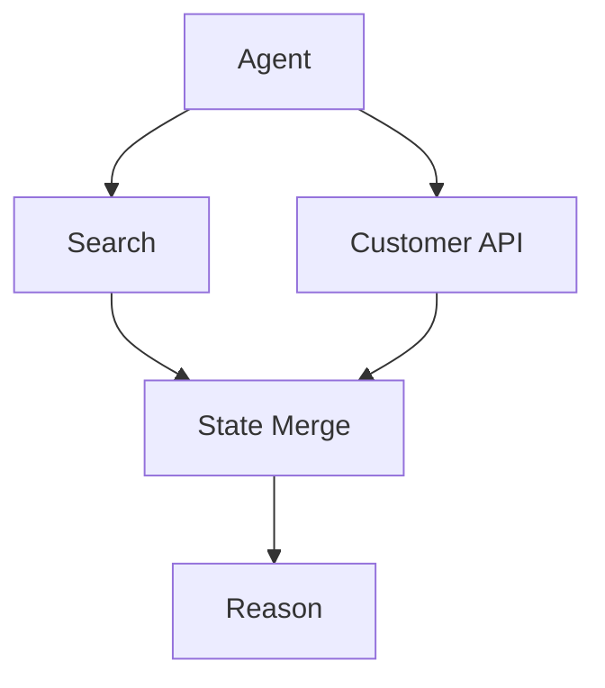

Reducers or explicit merge semantics become important when multiple branches update the same state.

---

# 56. State Conflicts

Suppose two nodes update:

```text
status
```

with:

```text
Node A → "approved"
Node B → "rejected"
```

Which one wins?

The architecture must define:

```text
Reducer
Ordering
Priority
Conflict Resolution
```

Never leave important state conflicts implicit.

---

# 57. Concurrency

Production graphs must consider:

```text
Concurrent Executions
Concurrent Threads
Parallel Nodes
Duplicate Requests
Repeated User Actions
```

Use appropriate:

```text
Locks
Optimistic Concurrency
Idempotency
Version Checks
```

where required.

---

# 58. Race Condition Example

```text
Execution A
 ↓
Read Balance = 100

Execution B
 ↓
Read Balance = 100

A → Withdraw 80
B → Withdraw 80
```

A naive agent architecture could create an invalid outcome.

The business system must enforce transactional consistency.

---

# 59. State Is Not Transaction Management

Do not assume:

```text
Graph State
=
Database Transaction
```

A graph can coordinate execution, but financial or business consistency should be enforced by the underlying transactional system.

---

# 60. Checkpoint + External Side Effect

Consider:

```text
Checkpoint
 ↓
Send Email
 ↓
Process Crash
```

On recovery:

```text
Resume
 ↓
Send Email Again?
```

Therefore side effects require:

```text
Idempotency
Deduplication
Execution Records
```

---

# 61. Exactly-Once vs At-Least-Once

Distributed systems often make:

```text
At-Least-Once Execution
```

easier to achieve than true exactly-once semantics.

Therefore design tools so repeated execution is safe where possible.

Example:

```text
Request
 ↓
Idempotency Key
 ↓
Service
```

---

# 62. Checkpointing and Retries

Checkpointing answers:

```text
Where can I resume?
```

Retry logic answers:

```text
Should I attempt this operation again?
```

Idempotency answers:

```text
Is it safe to execute this operation again?
```

These are different concerns.

---

# 63. Three Reliability Layers

```text
Checkpoint
   ↓
Recovery Position

Retry
   ↓
Failure Handling

Idempotency
   ↓
Side-Effect Safety
```

Together:

```text
Durable Agent Execution
```

---

# 64. Observability of State

Track:

```text
Thread ID
Execution ID
Graph Version
State Version
Node
Checkpoint
Timestamp
Status
```

Avoid logging sensitive state fields unnecessarily.

---

# 65. State Debugging

A useful trace:

```text
Execution: exec-100

State v1
 ↓
validate
 ↓
State v2
 ↓
retrieve
 ↓
State v3
 ↓
reason
 ↓
State v4
 ↓
tool
 ↓
State v5
```

This helps identify where execution diverged.

---

# 66. State Diff

Instead of logging the entire state every time:

```text
Previous State
 ↓
State Diff
 ↓
New State
```

Example:

```text
+ documents = [...]
+ tool_result = {...}
attempts: 1 → 2
```

This can improve debugging while reducing log volume.

---

# 67. Checkpoint Metadata

Useful metadata can include:

```text
Thread ID
Execution ID
Node
Graph Version
State Version
Timestamp
Status
Tenant ID
```

Avoid storing unnecessary sensitive information.

---

# 68. State Monitoring

Useful metrics:

```text
Checkpoint Latency
Checkpoint Size
Checkpoint Failure Rate
Recovery Success Rate
Resume Latency
State Serialization Errors
State Migration Failures
```

---

# 69. Checkpoint Failure

Checkpointing itself can fail.

Example:

```text
Agent
 ↓
Checkpoint
 ↓
Storage Failure
```

The system needs a defined strategy:

```text
Retry
Fail Execution
Fallback
Alert
```

For critical workflows, checkpoint failure should not silently pass.

---

# 70. Durable Agent Architecture

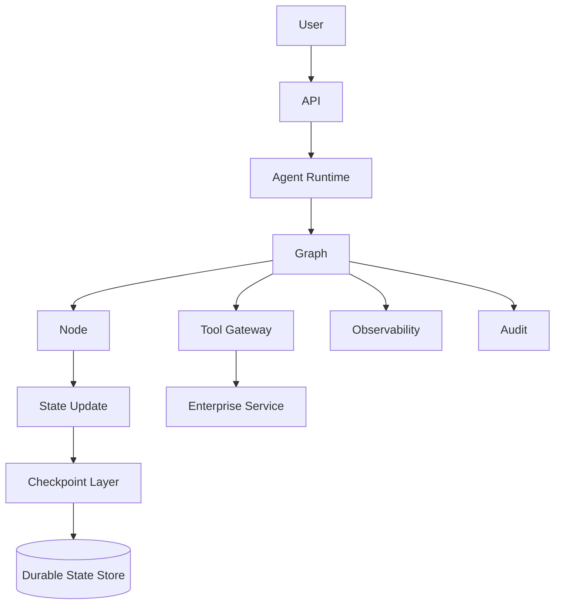

---

# 71. Production State Architecture

A production system may separate:

```text
Graph State
```

from:

```text
Business Data
```

and:

```text
Long-Term Memory
```

Architecture:

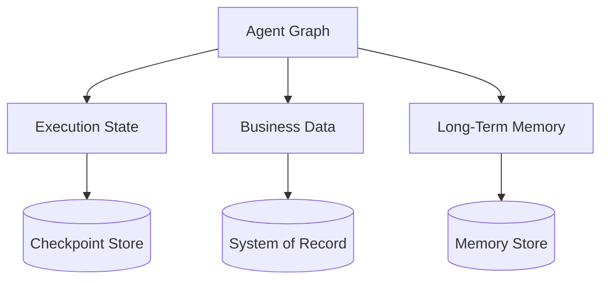

---

# 72. State Access Pattern

Use:

```text
Graph State
 ↓
Reference
 ↓
External Service
 ↓
Authoritative Data
```

rather than:

```text
Graph State
 ↓
Copy Everything
```

---

# 73. Checkpoint Lifecycle

```text
Create
 ↓
Update
 ↓
Persist
 ↓
Resume
 ↓
Complete
 ↓
Retain
 ↓
Archive / Delete
```

---

# 74. Completed Executions

After completion:

```text
Execution
 ↓
Final State
```

The system should define whether the final checkpoint is:

```text
Retained
Archived
Deleted
```

according to:

```text
Business
Compliance
Debugging
Privacy
Cost
```

requirements.

---

# 75. Production Retention Model

Example:

```text
Active
 ↓
Completed
 ↓
Short-Term Retention
 ↓
Archive
 ↓
Deletion
```

The exact retention period should be determined by business and regulatory requirements.

---

# 76. State Encryption

Protect state:

```text
At Rest
```

and:

```text
In Transit
```

Use appropriate enterprise security controls for the chosen persistence layer.

---

# 77. Access Control

Not every service or engineer should be able to inspect every checkpoint.

Use:

```text
Tenant
 ↓
Authorization
 ↓
Thread
 ↓
Checkpoint
```

Support least privilege.

---

# 78. State Auditing

For sensitive systems, audit:

```text
Who
Accessed
Which Thread
Which Execution
When
Why
```

Do not confuse:

```text
Application Audit
```

with:

```text
Debug Logs
```

---

# 79. State and Compliance

Depending on the domain, checkpoint data may become subject to:

```text
Privacy Requirements
Retention Requirements
Data Residency
Access Requests
Deletion Requirements
Audit Requirements
```

Design persistence with these requirements from the beginning.

---

# 80. Common Anti-Patterns

## Anti-Pattern 1 — Huge State

```text
State
 └── Everything
```

Problem:

```text
Large Payload
Slow Persistence
Security Risk
```

---

# 81. Anti-Pattern 2 — Storing Connections

Avoid:

```text
State
 ├── DB Connection
 ├── HTTP Session
 └── File Handle
```

Use references instead.

---

# 82. Anti-Pattern 3 — Treating Checkpoint as Database

Avoid:

```text
Checkpoint
=
Customer System of Record
```

The enterprise database remains authoritative for business data.

---

# 83. Anti-Pattern 4 — No State Version

Avoid:

```text
Graph v1
 ↓
Checkpoint
 ↓
Graph v2
```

without testing compatibility.

---

# 84. Anti-Pattern 5 — No Idempotency

Avoid:

```text
Resume
 ↓
Repeat Side Effect
```

Use idempotency for important operations.

---

# 85. Anti-Pattern 6 — No Tenant Isolation

Avoid:

```text
Shared Checkpoint Namespace
```

without strict isolation.

---

# 86. Anti-Pattern 7 — Persisting Secrets

Never use graph state as a secret store.

Avoid:

```text
State
 └── API_KEY
```

Use:

```text
Secret Manager
```

and retrieve secrets within trusted execution boundaries.

---

# 87. Anti-Pattern 8 — Persisting Everything

Do not checkpoint:

```text
Large Documents
Binary Files
Full API Responses
Unnecessary Logs
Temporary Objects
```

Store references where appropriate.

---

# 88. Production Checklist

## State

- [ ] Minimal state
- [ ] Explicit schema
- [ ] Clear ownership
- [ ] Serializable fields
- [ ] Versioned schema
- [ ] No secrets
- [ ] No unnecessary large objects

## Checkpointing

- [ ] Durable persistence
- [ ] Recovery strategy
- [ ] Checkpoint failure handling
- [ ] Retention policy
- [ ] Encryption
- [ ] Access control

## Reliability

- [ ] Idempotency
- [ ] Retry policy
- [ ] Timeout
- [ ] Concurrency control
- [ ] Side-effect protection

## Security

- [ ] Tenant isolation
- [ ] Authorization
- [ ] Data protection
- [ ] Audit
- [ ] Secret management

## Operations

- [ ] Checkpoint metrics
- [ ] State metrics
- [ ] Recovery metrics
- [ ] Tracing
- [ ] Alerts

---

# 89. Key Takeaways

- Graph state represents the current execution context.
- State should be minimal, explicit, serializable, and versionable.
- Nodes should update only the state they own.
- Reducers define how multiple updates are combined.
- State is different from long-term memory.
- State is different from enterprise business data.
- Checkpointing persists execution state for recovery and resumption.
- Long-running agents benefit significantly from checkpointing.
- Human-in-the-loop workflows often require durable state.
- Checkpointing does not make side effects idempotent.
- Retry, checkpointing, and idempotency solve different reliability problems.
- State should not contain live connections or raw secrets.
- Large documents should generally remain in external stores.
- Tenant and thread isolation are critical in multi-tenant systems.
- State schema changes require compatibility or migration strategies.
- Checkpoint storage must be treated as sensitive infrastructure.
- State retention should be explicitly designed.
- Checkpoint failures need their own failure strategy.
- Graph state should not replace enterprise systems of record.
- Durable execution requires more than persistence alone.
- Production agents require state, checkpointing, observability, security, and recovery to work together.

---

# 📝 Quick Revision Notes

## Graph State

```text
Current Execution Context
```

---

## State Update

```text
Node
 ↓
Read State
 ↓
Compute
 ↓
Return Update
 ↓
New State
```

---

## Checkpoint

```text
Execution State
 ↓
Persist
 ↓
Recover
 ↓
Resume
```

---

## State vs Memory

```text
State
=
Current Execution

Memory
=
Persistent Knowledge Across Executions
```

---

## Checkpoint vs Retry vs Idempotency

```text
Checkpoint
→ Where do I resume?

Retry
→ Should I try again?

Idempotency
→ Is it safe to try again?
```

---

## Durable Agent

```text
State
+
Checkpoint
+
Recovery
+
Retry
+
Idempotency
=
Durable Execution
```

---

# ❓ Interview Questions

## Beginner

1. What is graph state?
2. Why is state important for AI Agents?
3. What is a state schema?
4. What is a state update?
5. What is a reducer?
6. What is checkpointing?
7. Why is checkpointing useful?
8. What is a thread?
9. What is the difference between state and memory?
10. Why should state be kept small?

## Intermediate

11. How would you design an agent state schema?
12. How would you handle message history?
13. How would you persist graph state?
14. How would you resume an interrupted execution?
15. How would you implement human approval with checkpointing?
16. How would you handle state schema changes?
17. How would you isolate state across tenants?
18. Why should secrets not be stored in state?
19. How would you handle large documents?
20. How would you design checkpoint retention?
21. How would you monitor checkpoint failures?
22. What happens if a side effect occurs immediately before a process crash?
23. Why is checkpointing not sufficient for exactly-once execution?
24. How would you handle concurrent state updates?

## Advanced

25. Design a durable state architecture for a multi-tenant AI Agent platform.
26. How would you migrate millions of existing checkpoints after a state-schema change?
27. How would you guarantee safe recovery after a tool executes successfully but the process crashes before checkpointing?
28. How would you design idempotent enterprise tools?
29. How would you design state isolation across 10,000 tenants?
30. How would you separate graph state from long-term memory?
31. How would you separate graph state from the system of record?
32. How would you design checkpoint storage for high availability?
33. How would you handle checkpoint-store outages?
34. How would you control checkpoint storage costs?
35. How would you design state encryption and access control?
36. How would you support blue-green deployment with in-flight graph executions?
37. How would you design backward-compatible state evolution?
38. How would you debug an agent using state transitions and checkpoints?
39. How would you design recovery for long-running human-in-the-loop agents?
40. How would you prevent duplicate financial transactions during graph recovery?

---

# 🛠️ Practical Exercise

Build a stateful customer-support agent.

Requirements:

```text
1. Accept customer query
2. Create initial state
3. Retrieve knowledge
4. Generate response
5. Validate response
6. Retry if necessary
7. Persist execution state
8. Resume after interruption
```

State:

```text
query
documents
answer
feedback
attempts
status
```

Architecture:

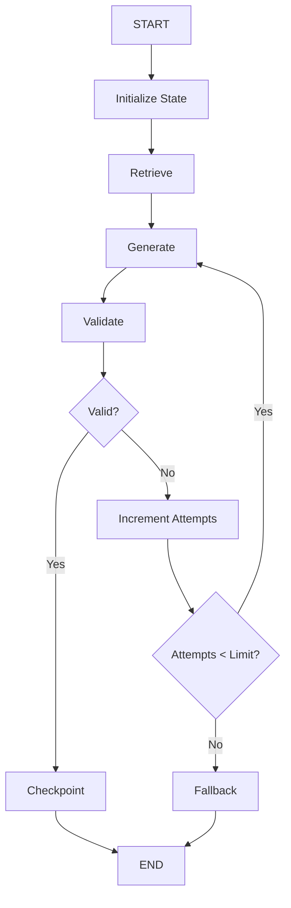

---

# 🧪 Recovery Exercise

Simulate:

```text
Agent
 ↓
Retrieve
 ↓
Checkpoint
 ↓
Generate
 ↓
Process Failure
```

Then:

```text
Restart
 ↓
Load Checkpoint
 ↓
Resume
 ↓
Generate
 ↓
Validate
 ↓
END
```

Verify:

```text
State preserved
Execution resumed
No duplicate retrieval
Final answer generated
```

---

# 🚀 Human-in-the-Loop Exercise

Build:

```text
Customer Request
 ↓
Agent
 ↓
Prepare Refund
 ↓
Checkpoint
 ↓
Human Approval
 ↓
Resume
 ↓
Execute Refund
```

Add:

```text
Tenant Isolation
Authorization
Audit
Idempotency
State Persistence
```

---

# 🏢 Production Architecture Challenge

Design a state platform supporting:

```text
100,000 Threads
10,000 Concurrent Executions
Long-Running Agents
Human Approval
Multiple Graph Versions
Multi-Tenancy
```

Required:

```text
Agent Runtime
Checkpoint Store
State Schema Versioning
Tenant Isolation
Encryption
Retention
Recovery
Observability
Audit
Idempotency
```

---

# 🧠 Final Architecture Challenge

Design a **Banking Operations Agent** that can:

```text
1. Retrieve customer information
2. Analyze transactions
3. Retrieve banking policies
4. Prepare recommendations
5. Request human approval
6. Execute approved operations
7. Resume after infrastructure failure
```

Architecture should contain:

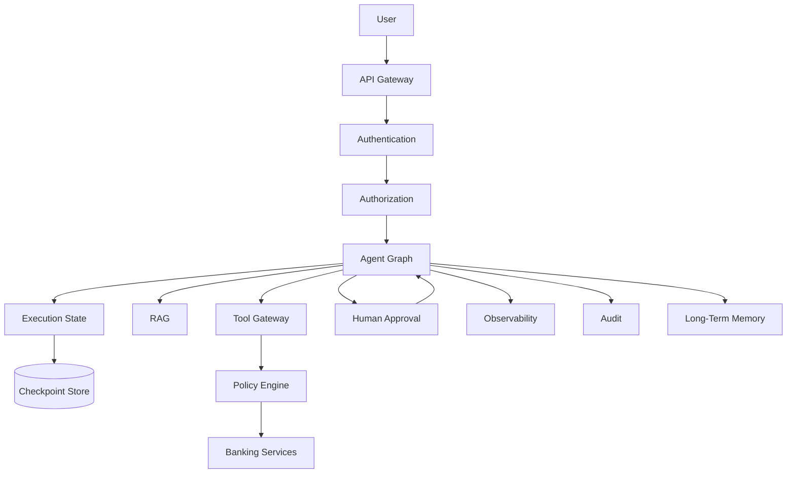

Answer:

```text
Which data belongs in graph state?

Which data belongs in the system of record?

Which data belongs in long-term memory?

Where should checkpoints be created?

How do you prevent duplicate transactions?

How do you isolate tenants?

How do you migrate state schemas?

How do you recover from checkpoint-store failure?
```

---

# 📚 References & Further Reading

Recommended areas for further study:

- LangGraph State
- LangGraph Checkpointing
- LangGraph Persistence
- Stateful Agent Architecture
- Durable Execution
- Human-in-the-Loop Systems
- State Schema Design
- Reducers
- Distributed Systems Recovery
- Idempotent APIs
- Multi-Tenant State Management
- State Versioning
- Workflow Persistence
- Agent Memory Architecture
- Enterprise Data Governance
- AI Observability
- AI Security

> LangGraph's state, persistence, checkpointing, and configuration APIs evolve over time. Always verify the exact APIs and persistence behavior against the official documentation for the LangGraph version used in your project.

---

## 🧭 Chapter Navigation

⬅️ **Previous:** [18. Graph-Based Agent Architecture](18-graph-based-agent-architecture.md)

📚 **Part VIII Index:** [AI Engineering Frameworks & Tooling](index.md)

➡️ **Next:** [20. LangGraph Nodes Edges And Routing](20-langgraph-nodes-edges-and-routing.md)

---

> **Enterprise AI Engineering Handbook**
>
> *Building Production-Grade Enterprise AI Systems — One Chapter at a Time.*