# 20 — LangGraph Nodes, Edges and Routing

> Understand how LangGraph nodes, edges, conditional routing, and control-flow patterns are used to build explicit, predictable, and production-ready AI workflows and Agents.

---

## 📖 Overview

LangGraph applications are built around a simple but powerful execution model:

```text
State
  ↓
Nodes
  ↓
Edges
  ↓
Routing
  ↓
Next Node
```

A **node** performs work.

An **edge** determines what happens next.

A **routing decision** determines which path should be followed when execution is dynamic.

This provides an explicit execution model for systems containing:

```text
Sequential Processing
Conditional Branching
Loops
Parallel Execution
Tool Calling
Validation
Human Approval
Fallbacks
Retries
Agent Reasoning
```

A production graph can therefore be represented as:

```text
                ┌──────────────┐
                │    START     │
                └──────┬───────┘
                       ↓
                ┌──────────────┐
                │   Validate   │
                └──────┬───────┘
                       ↓
                ┌──────────────┐
                │   Analyze    │
                └──────┬───────┘
                       ↓
                 ┌────────────┐
                 │   Route    │
                 └───┬────┬───┘
                     │    │
                  RAG│    │Tool
                     ↓    ↓
                   RAG   Tool
                     │    │
                     └─┬──┘
                       ↓
                ┌──────────────┐
                │   Validate   │
                └──────┬───────┘
                       ↓
                     END
```

The goal is not simply to create graphs.

The goal is to create **clear, testable, observable, and controlled execution paths**.

---

# 🎯 Learning Objectives

After completing this chapter, you will be able to:

- Understand LangGraph nodes
- Understand LangGraph edges
- Design sequential graph execution
- Implement conditional routing
- Design routing functions
- Understand static and dynamic transitions
- Build loops
- Build fallback paths
- Design retry routing
- Implement parallel branches conceptually
- Understand state-aware routing
- Separate routing from business logic
- Design production routing strategies
- Test graph paths
- Identify common routing anti-patterns
- Design reliable agent execution paths

---

# 1. Nodes and Edges

The fundamental LangGraph model is:

```text
Node
+
Edge
=
Execution Flow
```

A node performs work:

```text
Node A
 ↓
Process
 ↓
State Update
```

An edge determines what happens next:

```text
Node A
 ↓
Edge
 ↓
Node B
```

Together:

```text
Node A
 ↓
Edge
 ↓
Node B
```

---

# 2. What Is a Node?

A node is a unit of computation within the graph.

Examples:

```text
validate_request
classify_request
retrieve_documents
generate_response
call_tool
validate_result
human_review
```

A node typically:

```text
Receives State
     ↓
Performs Work
     ↓
Returns State Update
```

---

# 3. Basic Node Example

```python
from typing import TypedDict


class State(TypedDict):
    message: str


def process_message(state: State):
    return {
        "message": state["message"].upper()
    }
```

The node receives:

```text
State
```

and returns:

```text
State Update
```

---

# 4. Node Registration

Conceptually:

```python
builder.add_node(
    "process_message",
    process_message
)
```

The graph now knows that:

```text
process_message
```

is an executable node.

---

# 5. Node Naming

Use meaningful node names.

Good:

```text
validate_request
retrieve_documents
generate_answer
authorize_tool
execute_payment
```

Avoid:

```text
node1
node2
step3
process
```

Meaningful names improve:

```text
Debugging
Tracing
Testing
Architecture Reviews
Operations
```

---

# 6. Node Responsibility

A node should have a focused responsibility.

Good:

```text
validate_customer
```

Bad:

```text
validate_customer_and_call_api_and_generate_answer
```

Prefer:

```text
Validate
 ↓
Call API
 ↓
Generate
```

over:

```text
One Giant Node
```

---

# 7. Node Granularity

Nodes should not be too large or too small.

### Too Large

```text
AgentNode
 ├── Validation
 ├── Retrieval
 ├── Tool
 ├── Database
 ├── Formatting
 └── Response
```

Problems:

```text
Hard to Test
Hard to Observe
Hard to Retry
Hard to Reuse
```

### Too Small

```text
ReadString
 ↓
TrimString
 ↓
Uppercase
 ↓
StoreString
```

Problems:

```text
Graph Complexity
Too Many Transitions
```

Use meaningful capability boundaries.

---

# 8. Node Contracts

A production node should have a clear contract:

```text
Input State
     ↓
Node
     ↓
Output State
```

Example:

```text
Input:
query

Output:
query
documents
```

Document these contracts.

---

# 9. Node Purity

Where possible, keep simple transformation nodes deterministic.

Example:

```python
def normalize_query(state):
    return {
        "query": state["query"].strip()
    }
```

This makes the node:

```text
Predictable
Testable
Repeatable
```

---

# 10. Nodes With Side Effects

Some nodes interact with external systems:

```text
Payment API
Database
Email
Ticket System
CRM
```

These nodes need stronger reliability controls.

```text
Node
 ↓
Authorization
 ↓
Idempotency
 ↓
External Service
 ↓
Result
```

---

# 11. Node Failure

A node may fail because of:

```text
Timeout
Network Failure
Rate Limit
Validation Error
Provider Error
Business Error
Dependency Failure
```

The graph should determine whether to:

```text
Retry
Fallback
Route Elsewhere
Escalate
Terminate
```

---

# 12. What Is an Edge?

An edge defines a transition between graph nodes.

Example:

```text
START
 ↓
retrieve
 ↓
generate
 ↓
END
```

Edges:

```text
START → retrieve
retrieve → generate
generate → END
```

---

# 13. Static Edges

A static edge always follows the same path.

Example:

```python
builder.add_edge(
    "retrieve",
    "generate"
)
```

Whenever:

```text
retrieve
```

completes:

```text
generate
```

is the next destination.

---

# 14. Sequential Graph

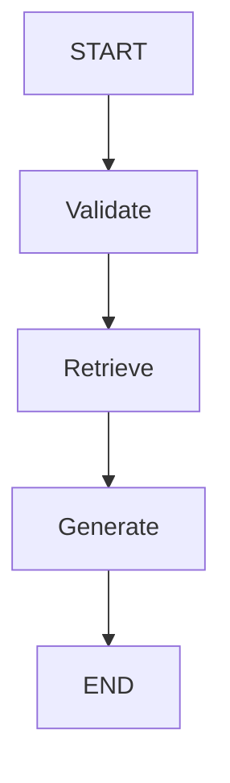
```mermaid
flowchart TD

    A[START] --> B[Validate]

    B --> C[Retrieve]

    C --> D[Generate]

    D --> E[END]
```

This is the simplest graph pattern.

---

# 15. Sequential Execution

A sequential graph executes:

```text
START
 ↓
A
 ↓
B
 ↓
C
 ↓
END
```

Use this when the execution path is known.

Examples:

```text
Validate
 ↓
Transform
 ↓
Persist
```

or:

```text
Retrieve
 ↓
Generate
 ↓
Validate
```

---

# 16. Conditional Routing

Real applications frequently need decisions.

Example:

```text
Classify
 ↓
 ┌─────────────┐
 ↓             ↓
RAG           Tool
```

The next node depends on state.

---

# 17. Conditional Edge

Conceptually:

```python
def route_request(state):
    if state["intent"] == "knowledge":
        return "rag"

    return "tool"
```

Then the graph maps the routing result to a destination.

The exact API should be verified against the LangGraph version used by the project.

---

# 18. Conditional Graph

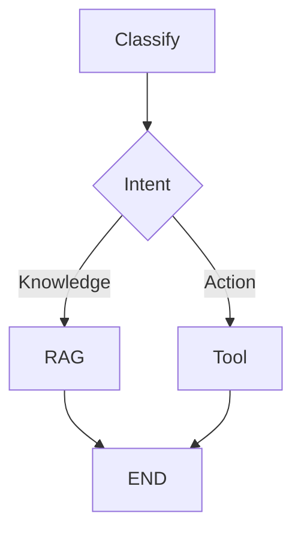
```mermaid
flowchart TD

    A[Classify] --> B{Intent}

    B -->|Knowledge| C[RAG]

    B -->|Action| D[Tool]

    C --> E[END]

    D --> E
```

---

# 19. Routing Function

A routing function should ideally answer one question:

```text
Where should execution go next?
```

Example:

```python
def route(state):
    if state["status"] == "complete":
        return "finish"

    if state["needs_tool"]:
        return "tool"

    return "reason"
```

Avoid putting large business processes inside the routing function.

---

# 20. Routing vs Business Logic

Poor:

```python
def route(state):
    # validation
    # database call
    # payment
    # notification
    # routing
```

Better:

```text
Node
 ↓
Business Logic
 ↓
State
 ↓
Router
 ↓
Next Node
```

Routing should primarily make the transition decision.

---

# 21. Routing Based on State

State can determine the next transition.

Example:

```python
def route_after_validation(state):
    if state["valid"]:
        return "generate"

    return "fallback"
```

Architecture:

```text
Validate
 ↓
State
 ↓
Router
 ├── Valid → Generate
 └── Invalid → Fallback
```

---

# 22. Routing Based on Intent

Example:

```text
User Request
 ↓
Classify
 ↓
Intent
```

Possible intents:

```text
knowledge
customer
transaction
support
unknown
```

Then:

```text
Intent
 ├── knowledge → RAG
 ├── customer → Customer Tool
 ├── transaction → Transaction Tool
 ├── support → Ticket Tool
 └── unknown → Human
```

---

# 23. Intent Router

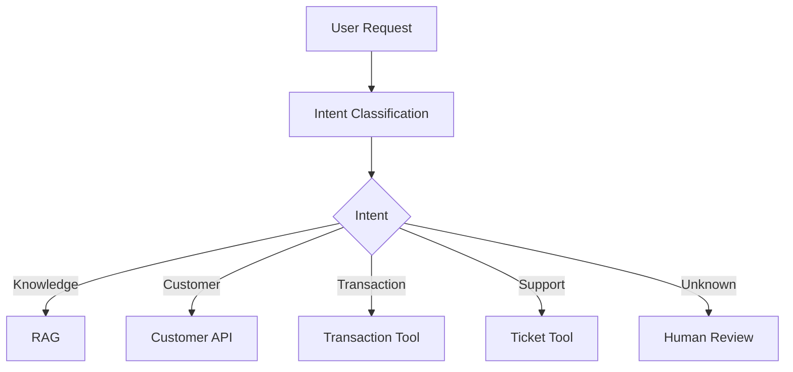
```mermaid
flowchart TD

    A[User Request] --> B[Intent Classification]

    B --> C{Intent}

    C -->|Knowledge| D[RAG]

    C -->|Customer| E[Customer API]

    C -->|Transaction| F[Transaction Tool]

    C -->|Support| G[Ticket Tool]

    C -->|Unknown| H[Human Review]
```

---

# 24. Routing Based on Confidence

An LLM or classifier may return:

```text
intent = transaction
confidence = 0.96
```

Routing can use a threshold:

```text
Confidence >= Threshold
 ↓
Automatic

Confidence < Threshold
 ↓
Fallback / Human
```

Example:

```python
def route_confidence(state):
    if state["confidence"] >= 0.90:
        return "execute"

    return "review"
```

The threshold should be determined through evaluation rather than chosen arbitrarily.

---

# 25. Confidence Routing

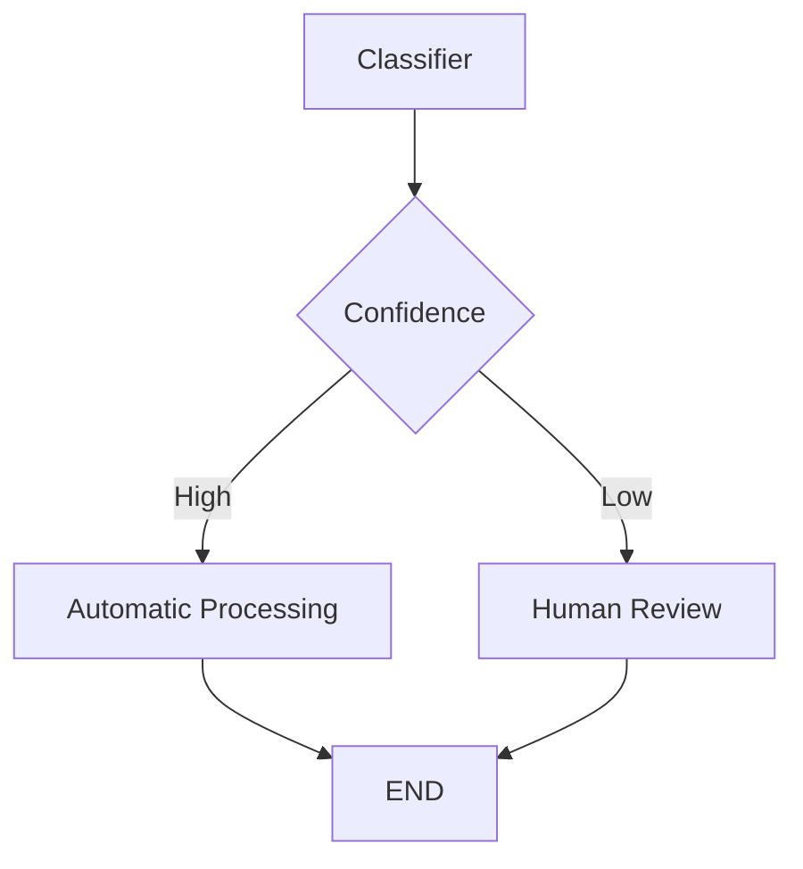
```mermaid
flowchart TD

    A[Classifier] --> B{Confidence}

    B -->|High| C[Automatic Processing]

    B -->|Low| D[Human Review]

    C --> E[END]

    D --> E
```

---

# 26. Routing Based on Risk

Agent systems should route based on action risk.

Example:

```text
Read Customer
 ↓
Low Risk
 ↓
Automatic
```

while:

```text
Refund Customer
 ↓
High Risk
 ↓
Approval
```

---

# 27. Risk Router

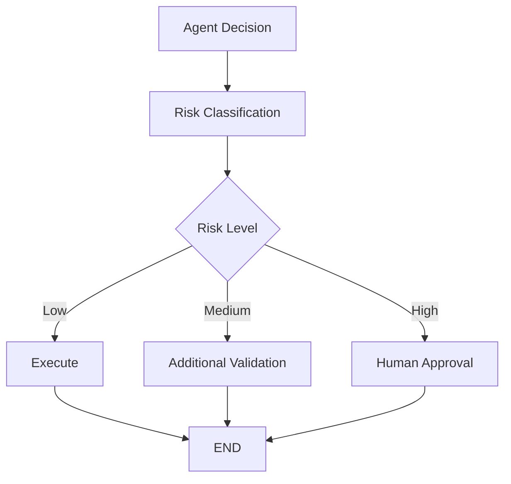
```mermaid
flowchart TD

    A[Agent Decision] --> B[Risk Classification]

    B --> C{Risk Level}

    C -->|Low| D[Execute]

    C -->|Medium| E[Additional Validation]

    C -->|High| F[Human Approval]

    D --> G[END]

    E --> G

    F --> G
```

---

# 28. Routing Based on Tool Availability

An agent may require a capability that is temporarily unavailable.

Example:

```text
Need Customer API
 ↓
Available?
 ├── Yes → Customer API
 └── No → Fallback
```

This prevents blind execution against unavailable dependencies.

---

# 29. Availability Routing

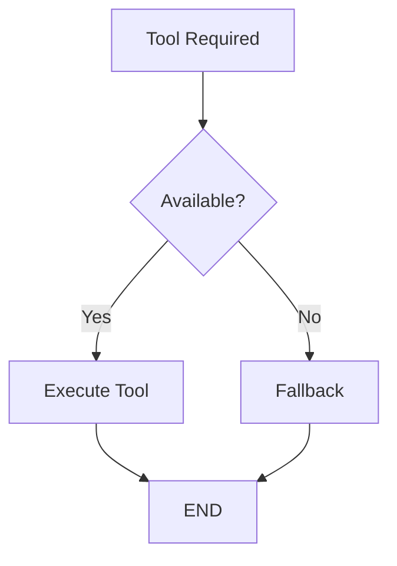
```mermaid
flowchart TD

    A[Tool Required] --> B{Available?}

    B -->|Yes| C[Execute Tool]

    B -->|No| D[Fallback]

    C --> E[END]

    D --> E
```

---

# 30. Routing Based on Validation

Example:

```text
Generate
 ↓
Validate
 ↓
 ┌────────────┐
 ↓            ↓
Valid        Invalid
 ↓            ↓
END         Correct
```

---

# 31. Validation Router

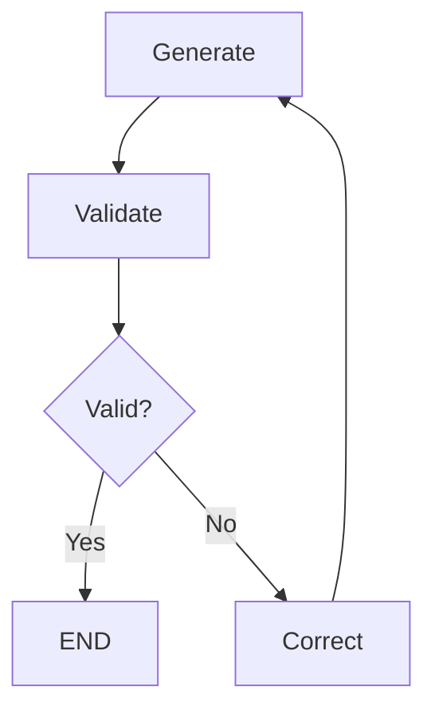
```mermaid
flowchart TD

    A[Generate] --> B[Validate]

    B --> C{Valid?}

    C -->|Yes| D[END]

    C -->|No| E[Correct]

    E --> A
```

This creates a loop.

---

# 32. Loops

Loops are useful for:

```text
Retry
Reflection
Correction
Re-planning
Iterative Search
Agent Tool Calling
```

Example:

```text
Reason
 ↓
Tool
 ↓
Observe
 ↓
Reason
```

---

# 33. Bounded Loop

Never assume an agent will naturally stop.

Use:

```text
Maximum Attempts
```

Example:

```python
def route_after_validation(state):
    if state["valid"]:
        return "finish"

    if state["attempts"] >= 3:
        return "fallback"

    return "correct"
```

---

# 34. Bounded Loop Diagram

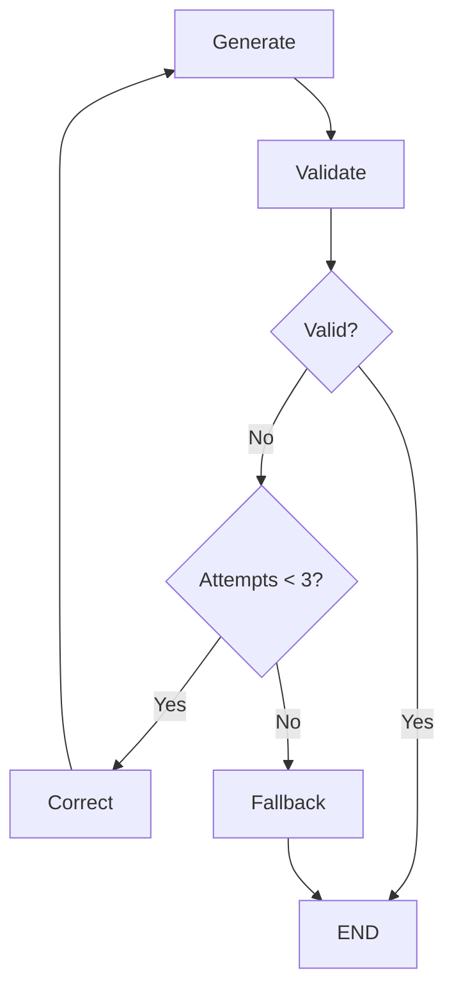
```mermaid
flowchart TD

    A[Generate] --> B[Validate]

    B --> C{Valid?}

    C -->|Yes| D[END]

    C -->|No| E{Attempts < 3?}

    E -->|Yes| F[Correct]

    F --> A

    E -->|No| G[Fallback]

    G --> D
```

---

# 35. Retry Routing

Retries should distinguish between:

```text
Retryable
```

and:

```text
Non-Retryable
```

Examples:

### Retryable

```text
Timeout
Temporary Network Failure
Rate Limit
Transient Provider Error
```

### Non-Retryable

```text
Invalid Input
Unauthorized
Business Rule Violation
Malformed Request
```

---

# 36. Retry Router

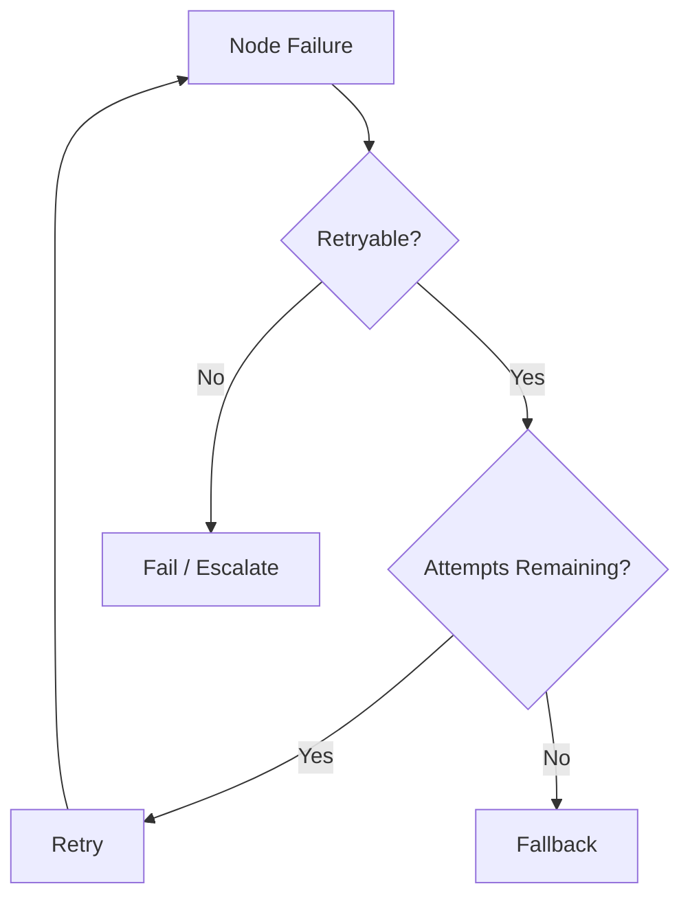
```mermaid
flowchart TD

    A[Node Failure] --> B{Retryable?}

    B -->|Yes| C{Attempts Remaining?}

    C -->|Yes| D[Retry]

    C -->|No| E[Fallback]

    B -->|No| F[Fail / Escalate]

    D --> A
```

---

# 37. Backoff

Repeated retries can overload dependencies.

Prefer:

```text
Retry
 ↓
Backoff
 ↓
Retry
 ↓
Backoff
```

Conceptually:

```text
Attempt 1
 ↓
Wait
 ↓
Attempt 2
 ↓
Wait Longer
 ↓
Attempt 3
```

Use appropriate exponential backoff and jitter where supported.

---

# 38. Error Routing

Different failures may require different destinations.

```text
Failure
 ├── Timeout → Retry
 ├── Unauthorized → Reject
 ├── Validation → Correct
 ├── Business Error → Fallback
 └── Unknown → Escalate
```

---

# 39. Error Router

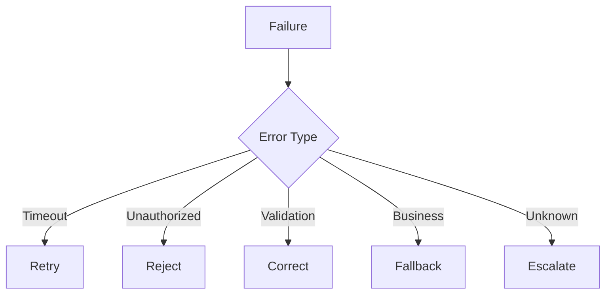
```mermaid
flowchart TD

    A[Failure] --> B{Error Type}

    B -->|Timeout| C[Retry]

    B -->|Unauthorized| D[Reject]

    B -->|Validation| E[Correct]

    B -->|Business| F[Fallback]

    B -->|Unknown| G[Escalate]
```

---

# 40. Fan-Out

Some tasks can be executed independently.

Example:

```text
Agent
 ├── Search Web
 ├── Search Documents
 └── Search Customer Data
```

These branches can conceptually execute independently.

---

# 41. Fan-Out Architecture

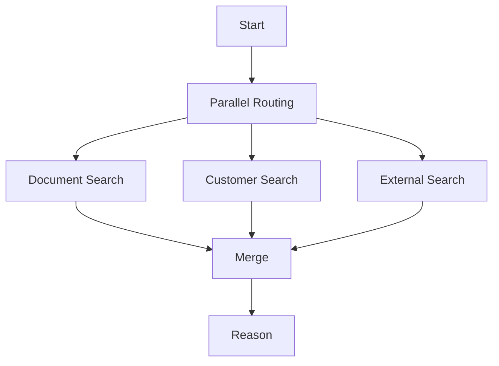
```mermaid
flowchart TD

    A[Start] --> B[Parallel Routing]

    B --> C[Document Search]

    B --> D[Customer Search]

    B --> E[External Search]

    C --> F[Merge]

    D --> F

    E --> F

    F --> G[Reason]
```

---

# 42. Fan-In

Fan-in combines results from multiple branches.

```text
Branch A
     \
Branch B → Merge → Next Node
     /
Branch C
```

The state merge semantics must be clearly defined.

---

# 43. Parallel State Updates

Example:

```text
Search A
 ↓
documents_a

Search B
 ↓
documents_b

Search C
 ↓
documents_c
```

Then:

```text
Merge
 ↓
all_documents
```

---

# 44. Reducers and Fan-In

Reducers can be useful when multiple branches update the same state field.

Conceptually:

```text
documents_a
     +
documents_b
     +
documents_c
     ↓
documents
```

The merge strategy should be explicitly defined.

---

# 45. Sequential vs Parallel

### Sequential

```text
A
 ↓
B
 ↓
C
```

Advantages:

```text
Simple
Predictable
Easy Debugging
```

### Parallel

```text
     ┌── B
A ───┼── C
     └── D
```

Advantages:

```text
Lower Latency
Independent Work
```

Trade-offs:

```text
More Complexity
State Merge
Failure Coordination
```

---

# 46. Dynamic Routing

Dynamic routing means:

```text
The next node depends on runtime state.
```

Example:

```text
Request
 ↓
Classifier
 ↓
Runtime Decision
 ↓
Selected Path
```

This is particularly useful for:

```text
Agents
Routing
Tool Selection
RAG
Human Escalation
```

---

# 47. Static vs Dynamic Routing

| Routing | Description | Example |
|---|---|---|
| Static | Fixed transition | A → B |
| Conditional | Based on state | A → B/C |
| Dynamic | Runtime destination | A → selected capability |
| Loop | Returns to previous node | A → B → A |
| Fan-out | Multiple branches | A → B/C/D |
| Fan-in | Merge branches | B/C/D → E |

---

# 48. Router Node Pattern

A useful architecture is:

```text
Input
 ↓
Router
 ├── RAG
 ├── Tool
 ├── Workflow
 └── Human
```

The router should determine:

```text
Which capability?
```

while the destination node performs:

```text
The actual work.
```

---

# 49. Router Architecture

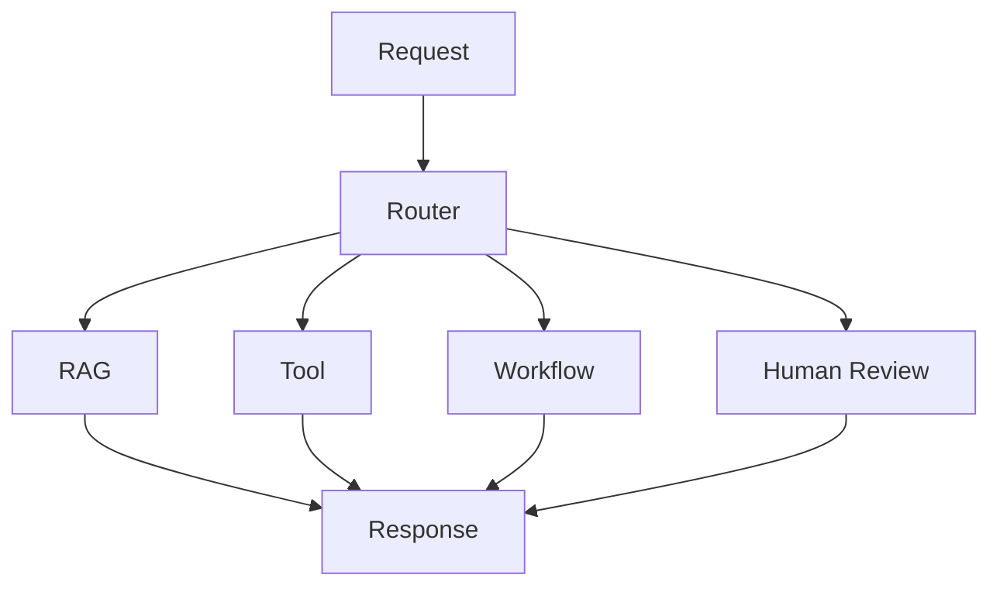
```mermaid
flowchart TB

    A[Request] --> B[Router]

    B --> C[RAG]

    B --> D[Tool]

    B --> E[Workflow]

    B --> F[Human Review]

    C --> G[Response]

    D --> G

    E --> G

    F --> G
```

---

# 50. LLM-Based Routing

An LLM can help determine the route.

Example:

```text
User Request
 ↓
LLM Router
 ↓
Structured Decision
 ↓
Graph Routing
```

Example output:

```json
{
  "route": "knowledge",
  "confidence": 0.94
}
```

The graph should validate the route before executing it.

---

# 51. Structured Routing

Prefer structured routing output:

```text
route
confidence
reason
```

over unrestricted natural-language routing.

Example:

```python
class RouteDecision(TypedDict):
    route: str
    confidence: float
```

Then:

```text
LLM
 ↓
Structured Output
 ↓
Validation
 ↓
Router
```

---

# 52. LLM Router Security

Do not allow an LLM to dynamically select arbitrary executable code.

Bad:

```text
LLM
 ↓
"Run function X"
 ↓
Dynamic Code Execution
```

Better:

```text
LLM
 ↓
Allowed Route Enum
 ↓
Graph Router
 ↓
Known Node
```

---

# 53. Route Allowlist

Example:

```python
ALLOWED_ROUTES = {
    "knowledge",
    "customer",
    "support"
}
```

Then:

```python
route = state["route"]

if route not in ALLOWED_ROUTES:
    return "fallback"
```

This creates a deterministic boundary around model-generated decisions.

---

# 54. Routing and Authorization

Routing does not equal authorization.

Example:

```text
Router
 ↓
"transaction"
```

does not mean:

```text
User is authorized for transaction
```

Instead:

```text
Route
 ↓
Authorization
 ↓
Tool
```

---

# 55. Routing + Policy

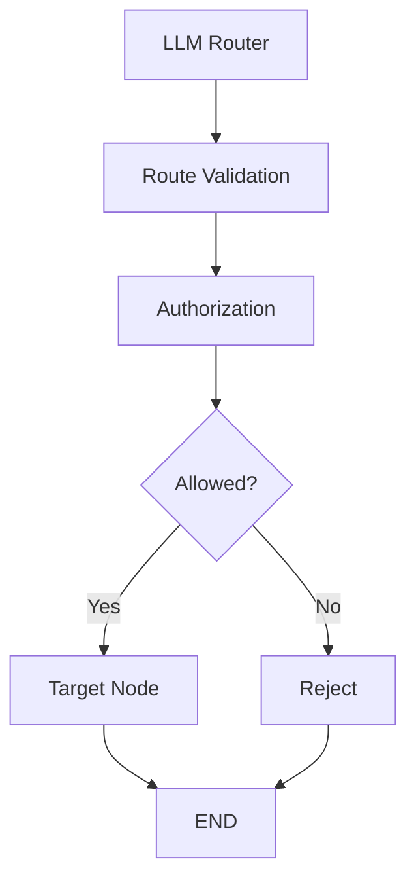
```mermaid
flowchart TD

    A[LLM Router] --> B[Route Validation]

    B --> C[Authorization]

    C --> D{Allowed?}

    D -->|Yes| E[Target Node]

    D -->|No| F[Reject]

    E --> G[END]

    F --> G
```

---

# 56. Routing and Risk

The route can influence risk.

Example:

```text
Knowledge
 ↓
Low Risk
```

while:

```text
Transaction
 ↓
High Risk
```

The graph can therefore route high-risk actions through additional controls.

---

# 57. Risk-Aware Routing

```text
Route
 ↓
Risk Classification
 ↓
Policy
 ↓
Execution
```

This is preferable to allowing:

```text
LLM
 ↓
Direct Action
```

---

# 58. Nested Routing

Complex graphs may route multiple times.

Example:

```text
Main Router
 ↓
Agent
 ↓
Tool Router
 ↓
Tool
```

Architecture:

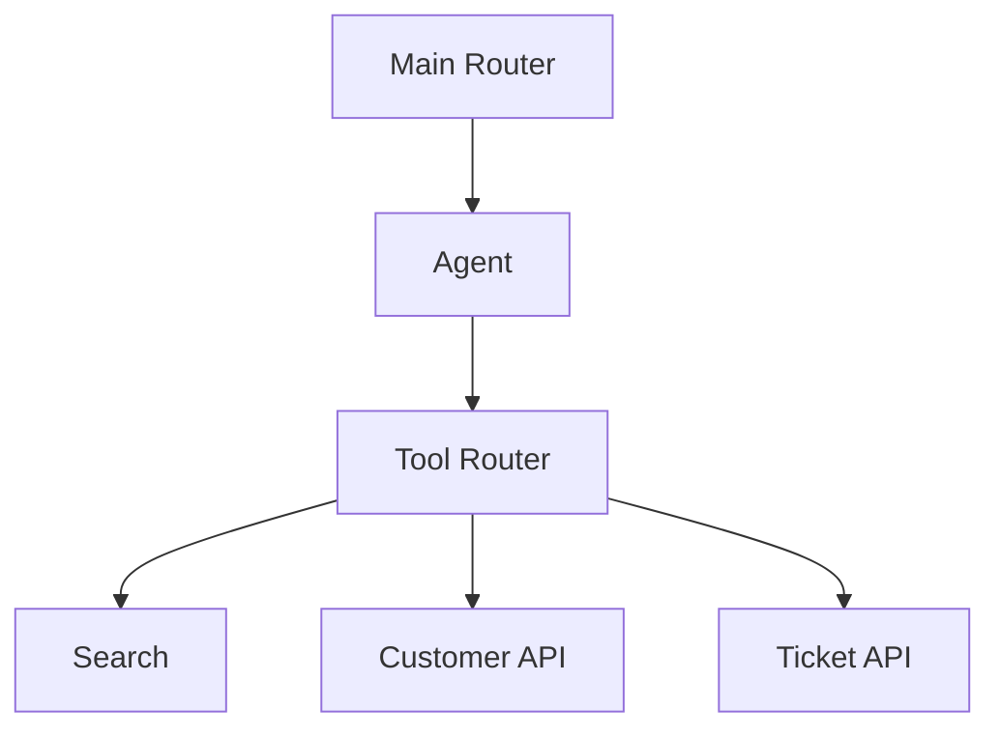
```mermaid
flowchart TD

    A[Main Router] --> B[Agent]

    B --> C[Tool Router]

    C --> D[Search]

    C --> E[Customer API]

    C --> F[Ticket API]
```

Avoid excessive routing layers.

---

# 59. Routing Depth

Too many routing layers can produce:

```text
Router
 ↓
Router
 ↓
Router
 ↓
Router
```

Problems:

```text
Hard to Debug
Hard to Test
Unclear Responsibility
```

Prefer clear hierarchical routing.

---

# 60. Hierarchical Routing

A cleaner model:

```text
Application Router
 ├── Knowledge
 ├── Support
 └── Operations

Operations Router
 ├── Customer
 ├── Transaction
 └── Ticket
```

This creates bounded routing domains.

---

# 61. Routing and Subgraphs

Subgraphs can encapsulate routing complexity.

```text
Main Graph
 ↓
Operations Subgraph
      ├── Customer
      ├── Transaction
      └── Ticket
```

This improves modularity.

---

# 62. Routing Contract

Every route should have:

```text
Allowed Destination
Input Contract
Output Contract
Failure Behavior
Security Requirements
```

Example:

```text
Route:
transaction

Destination:
transaction_workflow

Requires:
transaction_id
authorization

Failure:
human_review
```

---

# 63. Routing Observability

Track:

```text
Route Selected
Routing Reason
Confidence
Source
Timestamp
Execution
Outcome
```

Example:

```text
Route:
transaction

Confidence:
0.96

Outcome:
human_approval

Duration:
25ms
```

---

# 64. Routing Metrics

Useful metrics:

```text
Route Selection Accuracy
Route Frequency
Route Failure Rate
Fallback Rate
Human Escalation Rate
Routing Latency
Invalid Route Rate
```

---

# 65. Routing Evaluation

For LLM-based routers, create a test set:

```text
Query
Expected Route
Actual Route
Confidence
Outcome
```

Example:

| Query | Expected | Actual | Result |
|---|---|---|---|
| Policy question | RAG | RAG | ✅ |
| Customer lookup | Customer | Customer | ✅ |
| Refund request | Transaction | Transaction | ✅ |
| Unknown request | Human | RAG | ❌ |

---

# 66. Route Regression Testing

When changing:

```text
Prompt
Model
Routing Logic
```

rerun the routing dataset.

```text
Old Model
 ↓
Routing Accuracy

New Model
 ↓
Routing Accuracy
```

Do not assume routing behavior remains unchanged.

---

# 67. Routing Failures

Common routing failures:

```text
Wrong Route
Missing Route
Invalid Route
Low Confidence
Ambiguous Intent
Unexpected Tool
```

A robust system should have:

```text
Fallback
```

for unresolved decisions.

---

# 68. Fallback Routing

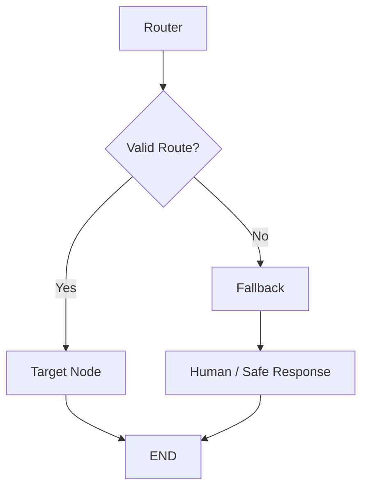
```mermaid
flowchart TD

    A[Router] --> B{Valid Route?}

    B -->|Yes| C[Target Node]

    B -->|No| D[Fallback]

    D --> E[Human / Safe Response]

    C --> F[END]

    E --> F
```

---

# 69. Safe Default

When routing is uncertain:

```text
Unknown
 ↓
Safe Fallback
```

Do not automatically select:

```text
Highest-Privilege Tool
```

as the default.

---

# 70. Routing Timeouts

A router itself may call:

```text
LLM
Classifier
External Service
```

Therefore routing may require:

```text
Timeout
Retry
Fallback
```

Example:

```text
Router Timeout
 ↓
Safe Fallback
```

---

# 71. Routing Cost

LLM-based routing adds:

```text
Latency
Token Cost
Model Cost
Failure Surface
```

For simple routing, deterministic logic may be preferable.

Example:

```text
Prefix
 ↓
Deterministic Route
```

or:

```text
Classifier
 ↓
Route
```

Use LLM routing when its flexibility provides meaningful value.

---

# 72. Deterministic vs LLM Router

### Deterministic

```text
Fast
Cheap
Predictable
```

### LLM-Based

```text
Flexible
Semantic
Adaptable
More Expensive
Less Deterministic
```

A hybrid approach is often effective:

```text
Deterministic Rules
 ↓
LLM Router
 ↓
Policy Validation
```

---

# 73. Hybrid Router

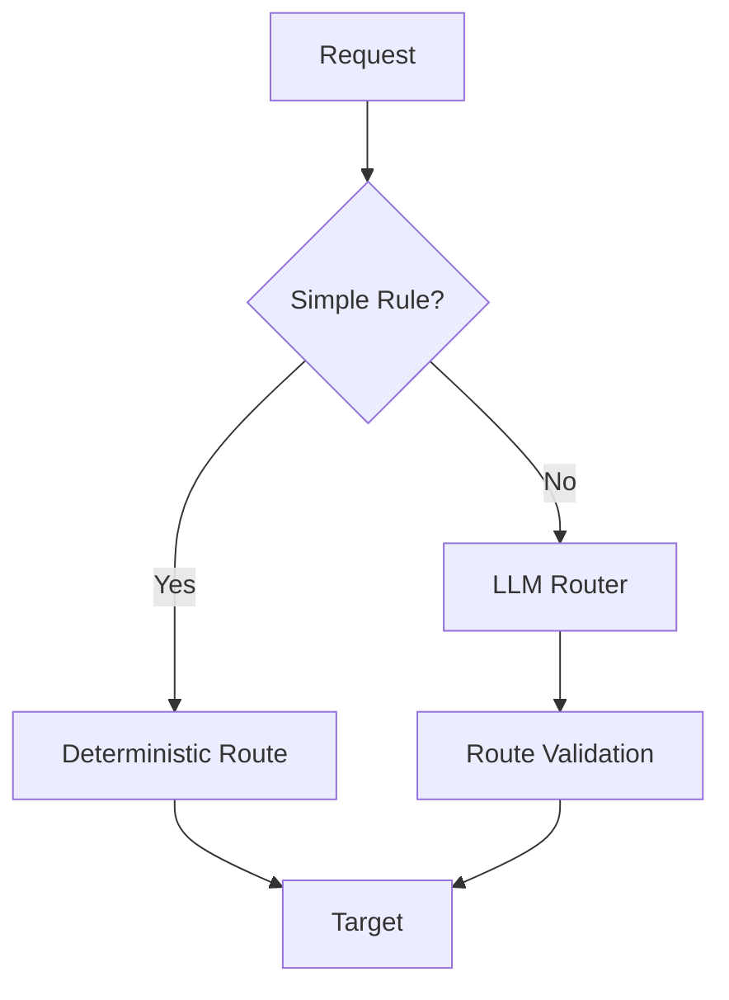
```mermaid
flowchart TD

    A[Request] --> B{Simple Rule?}

    B -->|Yes| C[Deterministic Route]

    B -->|No| D[LLM Router]

    D --> E[Route Validation]

    C --> F[Target]

    E --> F
```

---

# 74. Routing with RAG

A production AI application may route:

```text
Query
 ↓
Router
 ├── Internal Knowledge → RAG
 ├── External Knowledge → Web/Search
 └── Action → Tool
```

---

# 75. RAG Router

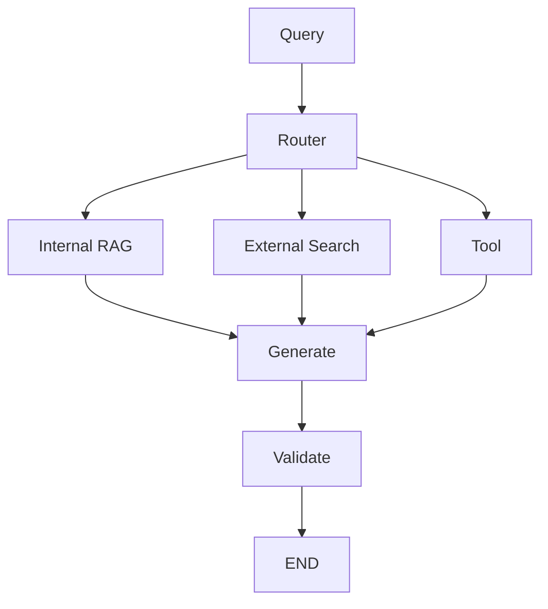
```mermaid
flowchart TD

    A[Query] --> B[Router]

    B --> C[Internal RAG]

    B --> D[External Search]

    B --> E[Tool]

    C --> F[Generate]

    D --> F

    E --> F

    F --> G[Validate]

    G --> H[END]
```

---

# 76. Routing with Human Review

A safe architecture:

```text
Router
 ↓
Risk
 ├── Low → Execute
 └── High → Human
```

This is especially useful for:

```text
Financial Actions
Security Actions
Data Deletion
Legal Decisions
Irreversible Operations
```

---

# 77. Production Routing Architecture

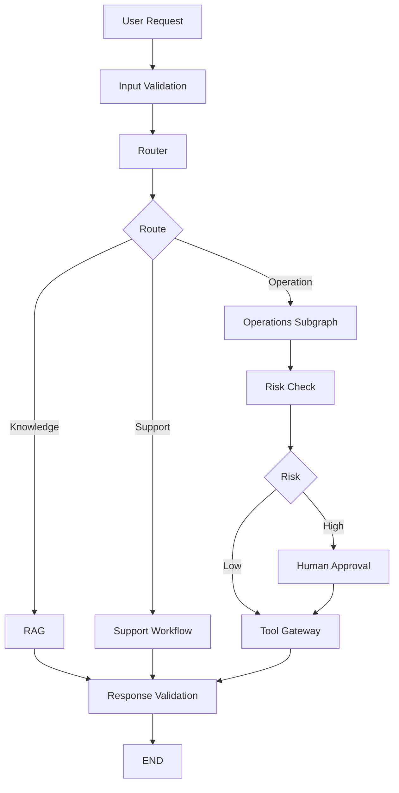
```mermaid
flowchart TB

    A[User Request] --> B[Input Validation]

    B --> C[Router]

    C --> D{Route}

    D -->|Knowledge| E[RAG]

    D -->|Support| F[Support Workflow]

    D -->|Operation| G[Operations Subgraph]

    G --> H[Risk Check]

    H --> I{Risk}

    I -->|Low| J[Tool Gateway]

    I -->|High| K[Human Approval]

    K --> J

    E --> L[Response Validation]

    F --> L

    J --> L

    L --> M[END]
```

---

# 78. Routing in Agent Systems

An agent can use routing at multiple levels:

```text
User Routing
 ↓
Agent Routing
 ↓
Tool Routing
 ↓
Failure Routing
 ↓
Human Routing
```

The architecture should keep each routing responsibility explicit.

---

# 79. Routing as a State Machine

A graph can be viewed as a state machine:

```text
State
 ↓
Transition
 ↓
State
```

Example:

```text
REQUESTED
 ↓
ANALYZING
 ↓
EXECUTING
 ↓
VALIDATING
 ↓
COMPLETED
```

or:

```text
EXECUTING
 ↓
FAILED
 ↓
RETRYING
 ↓
EXECUTING
```

---

# 80. State Machine Example

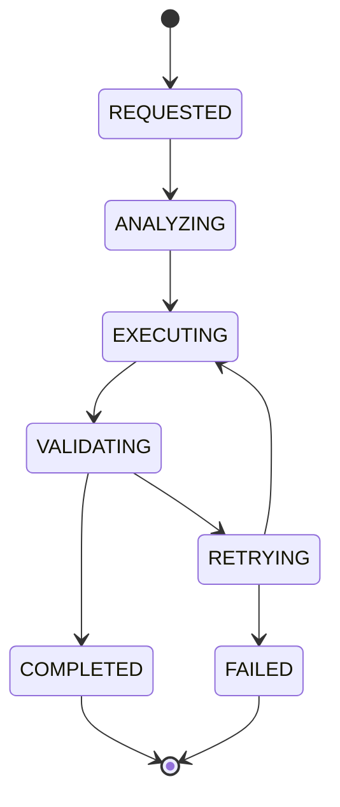
```mermaid
stateDiagram-v2

    [*] --> REQUESTED

    REQUESTED --> ANALYZING

    ANALYZING --> EXECUTING

    EXECUTING --> VALIDATING

    VALIDATING --> COMPLETED

    VALIDATING --> RETRYING

    RETRYING --> EXECUTING

    RETRYING --> FAILED

    COMPLETED --> [*]

    FAILED --> [*]
```

---

# 81. Explicit Status Fields

For complex workflows, state may contain:

```python
status: str
```

Possible values:

```text
requested
analyzing
executing
validating
waiting_for_approval
completed
failed
```

Status should be controlled and validated.

---

# 82. Routing by Status

```python
def route_status(state):
    status = state["status"]

    routes = {
        "requested": "analyze",
        "executing": "execute",
        "validating": "validate",
        "waiting_for_approval": "approval"
    }

    return routes.get(
        status,
        "fallback"
    )
```

Use explicit allowlists.

---

# 83. State Machine + Agent

```text
Deterministic State Machine
        ↓
Agent Reasoning
        ↓
Deterministic Validation
        ↓
State Transition
```

This provides:

```text
Intelligence
+
Control
```

---

# 84. Production Design Principle

A good production architecture often looks like:

```text
LLM
 ↓
Decision
 ↓
Deterministic Router
 ↓
Policy
 ↓
Node
```

rather than:

```text
LLM
 ↓
Everything
```

---

# 85. Routing Anti-Pattern — Business Logic in Router

Avoid:

```python
def route(state):
    customer = get_customer()
    balance = calculate_balance(customer)
    send_notification()
    return "..."
```

Prefer:

```text
Node
 ↓
Business Logic
 ↓
State
 ↓
Router
 ↓
Next Node
```

---

# 86. Routing Anti-Pattern — Arbitrary Destinations

Avoid:

```text
LLM
 ↓
"Execute arbitrary function"
```

Prefer:

```text
LLM
 ↓
Allowed Route
 ↓
Known Node
```

---

# 87. Routing Anti-Pattern — No Fallback

Avoid:

```text
Router
 ↓
Invalid Route
 ↓
Crash
```

Prefer:

```text
Router
 ↓
Invalid
 ↓
Safe Fallback
```

---

# 88. Routing Anti-Pattern — Unbounded Loops

Avoid:

```text
Node A
 ↓
Node B
 ↓
Node A
 ↓
Node B
 ↓
...
```

Use:

```text
Attempt Counter
+
Timeout
+
Fallback
```

---

# 89. Routing Anti-Pattern — Too Many Routers

Avoid:

```text
Router
 ↓
Router
 ↓
Router
 ↓
Router
```

Prefer:

```text
Main Router
 ↓
Bounded Subgraph
 ↓
Local Router
```

---

# 90. Routing Anti-Pattern — No Evaluation

Do not assume:

```text
LLM Router
=
Correct Router
```

Measure:

```text
Accuracy
Fallback Rate
False Routing
Cost
Latency
```

---

# 91. Production Routing Checklist

## Nodes

- [ ] Meaningful names
- [ ] Clear responsibilities
- [ ] Small contracts
- [ ] Testable logic
- [ ] Explicit side effects

## Edges

- [ ] Explicit transitions
- [ ] Clear termination
- [ ] Conditional routing
- [ ] Fallback paths
- [ ] Bounded loops

## Routing

- [ ] Route allowlist
- [ ] Validation
- [ ] Authorization
- [ ] Confidence handling
- [ ] Safe fallback
- [ ] Timeout
- [ ] Evaluation

## Reliability

- [ ] Retry policy
- [ ] Backoff
- [ ] Idempotency
- [ ] Failure routing
- [ ] Circuit breaking

## Operations

- [ ] Route metrics
- [ ] Route tracing
- [ ] Execution logs
- [ ] Graph versioning
- [ ] Regression tests

---

# 92. Key Takeaways

- Nodes represent meaningful units of computation.
- Edges define execution transitions.
- Static edges represent deterministic flow.
- Conditional edges enable state-aware routing.
- Routing functions should primarily determine the next destination.
- Business logic should remain inside dedicated nodes.
- Routing can be based on intent, confidence, risk, availability, validation, or execution status.
- Loops are useful but must always be bounded.
- Retry routing should distinguish transient failures from permanent failures.
- Fan-out enables independent parallel work.
- Fan-in combines results from multiple branches.
- Reducers can define how shared state is merged.
- LLM-based routing should use structured outputs and allowlists.
- Routing is not authorization.
- High-risk routes should pass through deterministic policy controls.
- Safe fallbacks are essential for ambiguous or invalid routing.
- Routing logic should be evaluated with representative datasets.
- Graph routing should remain observable and versioned.
- Hierarchical routing can reduce complexity in large systems.
- Subgraphs can encapsulate bounded routing domains.
- Deterministic routing is often preferable when the rules are known.
- LLM routing is valuable when semantic flexibility is required.
- A hybrid deterministic + LLM routing architecture can provide both flexibility and control.

---

# 📝 Quick Revision Notes

## Node

```text
State
 ↓
Node
 ↓
State Update
```

---

## Static Edge

```text
A
 ↓
B
```

---

## Conditional Edge

```text
A
 ↓
Decision
 ├── B
 └── C
```

---

## Loop

```text
A
 ↓
B
 ↓
Decision
 ├── Complete → END
 └── Retry → A
```

---

## Fan-Out

```text
        ┌── B
A ──────┼── C
        └── D
```

---

## Fan-In

```text
B ──┐
C ──┼──→ E
D ──┘
```

---

## Production Router

```text
Request
 ↓
Router
 ↓
Route Validation
 ↓
Authorization
 ↓
Target Node
 ↓
Validation
 ↓
Response
```

---

## Agent Routing

```text
Reason
 ↓
Decision
 ↓
Route
 ↓
Tool / RAG / Workflow
 ↓
Observe
 ↓
Reason
```

---

# ❓ Interview Questions

## Beginner

1. What is a LangGraph node?
2. What is a LangGraph edge?
3. What is the difference between a static and conditional edge?
4. What is a routing function?
5. Why should nodes have clear responsibilities?
6. What is conditional routing?
7. What is a loop in LangGraph?
8. What is fan-out?
9. What is fan-in?
10. Why is a fallback route important?

## Intermediate

11. How would you design a routing function?
12. How would you route based on state?
13. How would you route based on intent?
14. How would you route based on confidence?
15. How would you implement bounded retries?
16. How would you distinguish retryable and non-retryable failures?
17. How would you implement fan-out and fan-in?
18. How would reducers help with parallel execution?
19. How would you implement an LLM-based router?
20. How would you validate an LLM-generated route?
21. How would you secure dynamic routing?
22. How would you test all graph paths?
23. How would you monitor routing decisions?
24. How would you combine deterministic and LLM-based routing?

## Advanced

25. Design a production routing architecture for an enterprise AI platform.
26. How would you design hierarchical routing?
27. How would you prevent arbitrary LLM-generated routes?
28. How would you implement risk-aware routing?
29. How would you design routing for 100+ enterprise tools?
30. How would you evaluate an LLM router?
31. How would you prevent routing regressions after a model upgrade?
32. How would you design safe fallback behavior?
33. How would you handle concurrent fan-out branches?
34. How would you design state merging for parallel execution?
35. How would you prevent infinite graph loops?
36. How would you combine routing with authorization?
37. How would you design routing across LangGraph and LlamaIndex?
38. How would you structure routing using subgraphs?
39. How would you monitor route selection accuracy in production?
40. When should you avoid LLM-based routing entirely?

---

# 🛠️ Practical Exercise

Build a customer-support router.

The system should support:

```text
Knowledge Questions
Customer Information
Transactions
Support Tickets
Unknown Requests
```

Architecture:

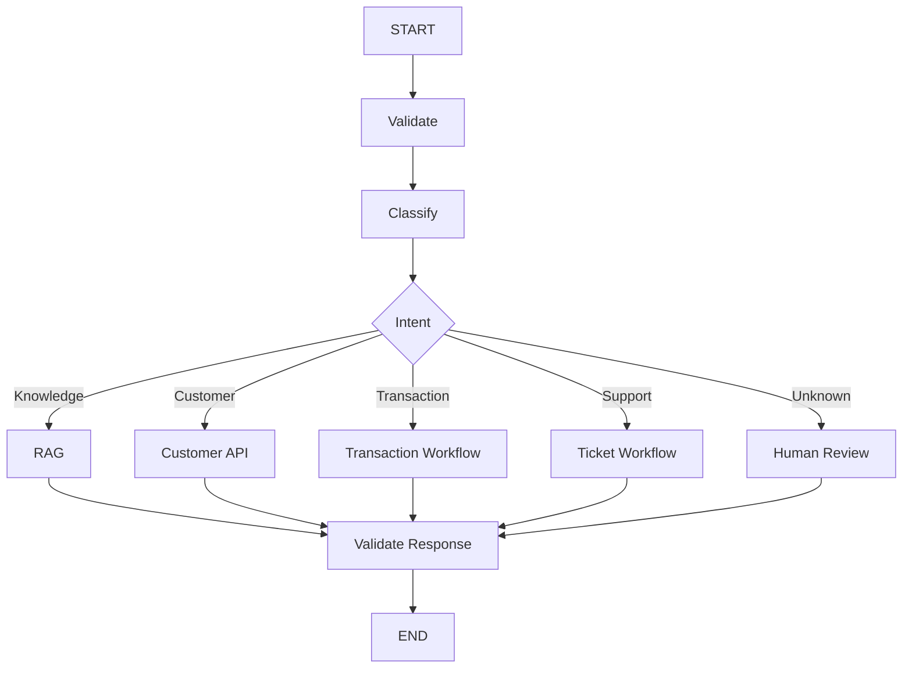
```mermaid
flowchart TD

    A[START] --> B[Validate]

    B --> C[Classify]

    C --> D{Intent}

    D -->|Knowledge| E[RAG]

    D -->|Customer| F[Customer API]

    D -->|Transaction| G[Transaction Workflow]

    D -->|Support| H[Ticket Workflow]

    D -->|Unknown| I[Human Review]

    E --> J[Validate Response]

    F --> J

    G --> J

    H --> J

    I --> J

    J --> K[END]
```

Add:

```text
Route allowlist
Confidence threshold
Authorization
Fallback
Timeout
Metrics
```

---

# 🧪 Routing Evaluation Exercise

Create:

```text
100 Representative Queries
```

For each query define:

```text
Expected Route
```

Run the router and measure:

```text
Route Accuracy
Fallback Rate
False Route Rate
Confidence
Latency
Cost
```

Create a report:

```text
Expected
Actual
Correct?
Confidence
Failure Reason
```

---

# 🚀 Failure Routing Exercise

Build a graph that handles:

```text
Timeout
Rate Limit
Unauthorized
Validation Error
Business Error
Unknown Error
```

Expected behavior:

```text
Timeout
 ↓
Retry

Rate Limit
 ↓
Backoff
 ↓
Retry

Unauthorized
 ↓
Reject

Validation
 ↓
Correct

Business Error
 ↓
Fallback

Unknown
 ↓
Escalate
```

---

# 🏢 Enterprise Architecture Challenge

Design a routing platform supporting:

```text
100+ Tools
10+ AI Capabilities
Multiple RAG Systems
Multiple LLM Providers
Human Approval
Multi-Tenancy
```

Use:

```text
Main Router
 ↓
Capability Router
 ↓
Risk Policy
 ↓
Tool Gateway
```

Ensure:

```text
No Arbitrary Tool Execution
No Unbounded Loops
No Cross-Tenant Routing
No Unauthorized Actions
```

---

# 🧠 Final Architecture Challenge

Design an enterprise AI router:

```mermaid
flowchart TB

    A[User Request] --> B[Input Validation]

    B --> C[Deterministic Rules]

    C --> D{Known Pattern?}

    D -->|Yes| E[Known Route]

    D -->|No| F[LLM Router]

    F --> G[Structured Route]

    G --> H[Route Allowlist]

    H --> I[Authorization]

    I --> J[Risk Policy]

    J --> K{Risk}

    K -->|Low| L[Target Node]

    K -->|High| M[Human Approval]

    M --> L

    L --> N[Execution]

    N --> O[Validation]

    O --> P[END]
```

Answer:

```text
Which routes are deterministic?

Which decisions require the LLM?

Where is authorization enforced?

Where is risk evaluated?

What happens when routing fails?

How do you prevent arbitrary tool execution?

How do you evaluate route accuracy?

How do you monitor routing drift?

How do you version routing logic?
```

---

# 📚 References & Further Reading

Recommended areas for further study:

- LangGraph Nodes
- LangGraph Edges
- Conditional Routing
- Dynamic Routing
- Graph State
- Reducers
- Parallel Execution
- Fan-Out / Fan-In
- Agent Routing
- LLM-Based Routing
- Tool Routing
- Workflow Routing
- Human-in-the-Loop
- Agent Guardrails
- Agent Authorization
- Graph Observability
- Agent Evaluation
- Durable Execution
- Enterprise Workflow Architecture
- State Machine Design

> LangGraph's graph construction and routing APIs evolve over time. Verify the exact node, edge, conditional-routing, state, reducer, and execution APIs against the official documentation for the LangGraph version used in your project.

---

## 🧭 Chapter Navigation

⬅️ **Previous:** [19. LangGraph State and Checkpointing](19-langgraph-state-and-checkpointing.md)

📚 **Part VIII Index:** [AI Engineering Frameworks & Tooling](index.md)

➡️ **Next:** [21. LangGraph Human In The Loop](21-langgraph-human-in-the-loop.md)

---

> **Enterprise AI Engineering Handbook**
>
> *Building Production-Grade Enterprise AI Systems — One Chapter at a Time.*