# 21 — LangGraph Human-in-the-Loop

> Understand how Human-in-the-Loop (HITL) patterns are implemented in LangGraph to introduce human oversight, approval, intervention, and decision-making into AI Agent workflows.

---

## 📖 Overview

AI Agents can reason, plan, retrieve information, call tools, and execute multi-step tasks autonomously.

However, enterprise systems cannot allow unrestricted autonomy for every operation.

Some actions require:

```text
Human Approval
Human Review
Human Intervention
Human Correction
Human Decision
```

Human-in-the-Loop introduces a controlled boundary between autonomous agent execution and human decision-making.

A typical enterprise pattern is:

```text
Agent
 ↓
Analyze
 ↓
Prepare Action
 ↓
Risk Assessment
 ↓
Human Review
 ↓
Approve / Reject / Modify
 ↓
Resume Agent
 ↓
Execute
```

LangGraph is particularly well suited to these workflows because graph execution can be paused, state can be persisted, and execution can later resume from the appropriate point.

The objective is not to remove autonomy.

The objective is:

```text
Controlled Autonomy
+
Human Oversight
+
Durable Execution
=
Enterprise Agent Workflow
```

---

# 🎯 Learning Objectives

After completing this chapter, you will be able to:

- Understand Human-in-the-Loop AI Agent architecture
- Understand when human intervention is necessary
- Design approval workflows
- Pause and resume graph execution
- Use checkpoints for human approval workflows
- Design interrupt-driven agent workflows
- Capture human decisions
- Handle approve, reject, and modify outcomes
- Implement risk-based human escalation
- Design human review queues
- Secure human approval workflows
- Maintain auditability
- Handle approval timeouts
- Handle rejected actions
- Design resumable human workflows
- Test HITL agent systems
- Apply production best practices

---

# 1. What Is Human-in-the-Loop?

Human-in-the-Loop means a human participates in the AI system's execution at a defined decision point.

Instead of:

```text
Agent
 ↓
Action
```

we introduce:

```text
Agent
 ↓
Human Review
 ↓
Action
```

The human may:

```text
Approve
Reject
Modify
Request More Information
Escalate
```

---

# 2. Why Enterprise Agents Need HITL

Not every AI decision should be fully autonomous.

Examples:

```text
Low Risk
 ├── Search Knowledge
 ├── Summarize Document
 └── Create Draft

High Risk
 ├── Refund Money
 ├── Delete Data
 ├── Change Account
 ├── Approve Loan
 └── Execute Financial Transaction
```

The higher the potential impact, the stronger the human oversight requirement may be.

---

# 3. Human-in-the-Loop Architecture

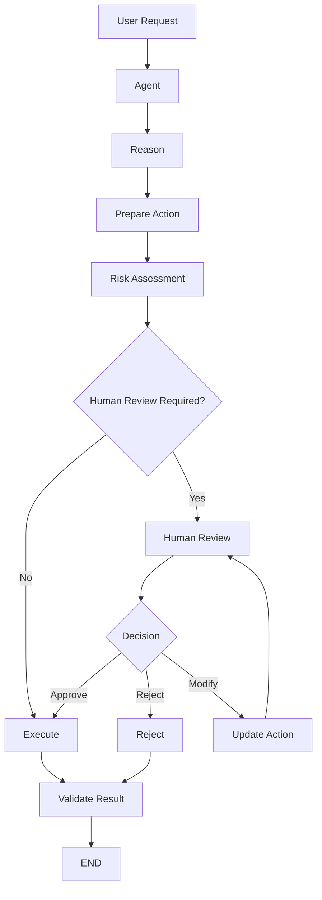

---

# 4. HITL Is a Control Boundary

The human approval point should be treated as a control boundary.

```text
Agent Intelligence
        ↓
       HITL
        ↓
Enterprise Action
```

The LLM should not be able to bypass:

```text
Authorization
Risk Policy
Human Approval
```

when those controls are required.

---

# 5. Human vs AI Responsibility

A good architecture explicitly defines responsibility.

### AI

```text
Analyze
Retrieve
Reason
Recommend
Prepare
Summarize
```

### Human

```text
Approve
Reject
Override
Confirm
Make High-Impact Decision
```

### Deterministic System

```text
Authorization
Validation
Policy
Audit
Execution
```

This creates:

```text
AI
+
Human
+
Deterministic Controls
```

---

# 6. Human-in-the-Loop Patterns

Common patterns include:

```text
Approval
Review
Correction
Escalation
Confirmation
Intervention
Exception Handling
```

---

# 7. Approval Pattern

The simplest pattern:

```text
Agent
 ↓
Prepare
 ↓
Approval
 ↓
Execute
```

Example:

```text
Customer Refund Request
 ↓
Agent analyzes request
 ↓
Agent prepares refund
 ↓
Human approves
 ↓
Refund API
```

---

# 8. Approval Architecture

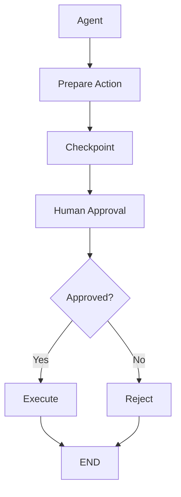

---

# 9. Rejection Pattern

A human may reject the proposed action.

```text
Agent
 ↓
Proposal
 ↓
Human
 ↓
Reject
 ↓
Agent / Fallback
```

The system should explicitly define what happens after rejection.

Possible outcomes:

```text
Terminate
Retry With Modified Plan
Ask User
Escalate
```

---

# 10. Modification Pattern

A human may modify the proposed action.

Example:

```text
Agent proposes:

Refund = ₹10,000

Human changes:

Refund = ₹7,500
```

Then:

```text
Human Modification
 ↓
Validation
 ↓
Authorization
 ↓
Execute
```

Never assume human input is automatically valid.

---

# 11. Human Decision Lifecycle

```text
Agent Proposal
 ↓
Review Request
 ↓
Human Decision
 ↓
Validate Decision
 ↓
Update State
 ↓
Resume Graph
```

---

# 12. Human Review States

A useful state model:

```text
PENDING_REVIEW
       ↓
   ┌───┼────┐
   ↓   ↓    ↓
APPROVED REJECTED MODIFIED
   │     │      │
   └─────┼──────┘
         ↓
      Continue
```

---

# 13. State Model

Example:

```python
from typing import TypedDict


class AgentState(TypedDict):
    request: str
    proposed_action: dict
    risk_level: str
    approval_status: str
    reviewer_id: str
    reviewer_comment: str
    final_action: dict
```

The actual state schema should contain only the fields required by the application.

---

# 14. Approval State

Example:

```text
approval_status:

pending
approved
rejected
modified
expired
```

Keep state values controlled and explicit.

---

# 15. Human Review Queue

Enterprise systems often need a review queue.

```text
Agent
 ↓
Approval Request
 ↓
Review Queue
 ↓
Human Reviewer
 ↓
Decision
 ↓
Agent
```

---

# 16. Review Queue Architecture

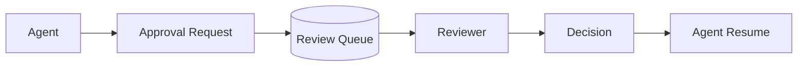

The review queue may be implemented using:

```text
Database
Message Queue
Workflow Platform
Enterprise Task System
Custom Review Application
```

The appropriate technology depends on the organization's architecture.

---

# 17. Reviewer Assignment

A production system may route reviews based on:

```text
Department
Role
Risk
Region
Customer
Transaction Value
Skill
Availability
```

Example:

```text
Refund > Threshold
 ↓
Finance Reviewer
```

---

# 18. Risk-Based Human Review

Not every action needs human approval.

Use a risk policy:

```text
Action
 ↓
Risk Classification
 ↓
Policy
 ↓
Human Required?
```

Example:

```text
Read Customer
 → Low

Update Address
 → Medium

Refund Money
 → High
```

---

# 19. Risk Router

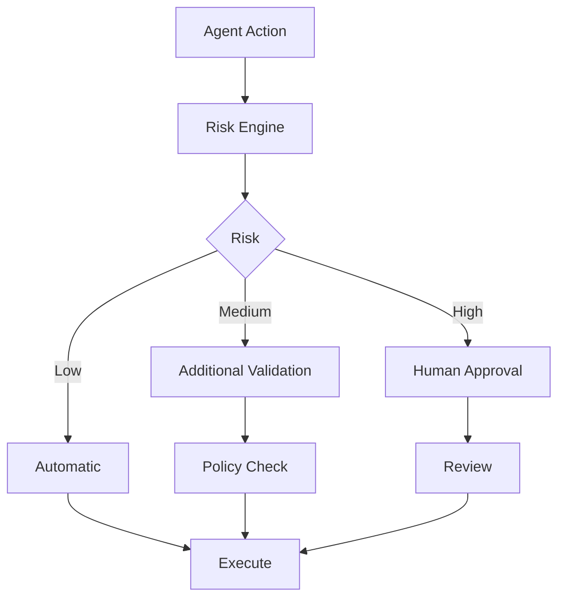

---

# 20. Approval Thresholds

Organizations may define thresholds.

Example:

```text
Refund < ₹1,000
 → Automatic

Refund ₹1,000–₹10,000
 → Manager Approval

Refund > ₹10,000
 → Finance Approval
```

These values are illustrative.

The actual thresholds should come from business policy.

---

# 21. Human-in-the-Loop with LangGraph

LangGraph can model human intervention as part of graph execution.

Conceptually:

```text
Node
 ↓
Interrupt
 ↓
Persist State
 ↓
Human
 ↓
Resume
 ↓
Next Node
```

The exact LangGraph APIs for interrupts, persistence, and resume behavior should be verified against the version used in the project.

---

# 22. Interrupt Concept

An interrupt pauses graph execution at a defined point.

Conceptually:

```python
def approval_node(state):
    decision = interrupt({
        "action": state["proposed_action"],
        "reason": "Human approval required"
    })

    return {
        "approval_status": decision
    }
```

The important architecture is:

```text
Interrupt
 ↓
Persist
 ↓
Wait
 ↓
Resume
```

---

# 23. Why Persistence Is Important

An interrupt without durable state is insufficient for production.

Consider:

```text
Agent
 ↓
Approval
 ↓
Process Restart
```

Without persistence:

```text
Execution Lost
```

With checkpointing:

```text
Agent
 ↓
Checkpoint
 ↓
Approval
 ↓
Process Restart
 ↓
Restore
 ↓
Resume
```

---

# 24. HITL + Checkpointing

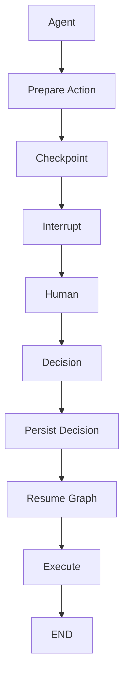

---

# 25. Resume Execution

After the human decision:

```text
Human Decision
 ↓
Resume Graph
 ↓
State Updated
 ↓
Next Node
```

The graph should continue from the correct execution point rather than restarting the entire workflow unnecessarily.

---

# 26. Resume Data

A human decision may contain:

```text
decision
comment
modified_action
reviewer_id
timestamp
```

Example:

```json
{
  "decision": "approved",
  "reviewer_id": "reviewer-101",
  "comment": "Approved after policy verification"
}
```

Sensitive information should be handled according to enterprise privacy and audit requirements.

---

# 27. Human Decision Validation

Never trust the UI response blindly.

Validate:

```text
Decision
Reviewer
Authorization
Action
State
```

Example:

```text
Human says:
"Approve"

System checks:

Reviewer authorized?
 ↓
Request still valid?
 ↓
Action unchanged?
 ↓
Policy still satisfied?
 ↓
Execute
```

---

# 28. Approval Expiration

Human approvals can become stale.

Example:

```text
Agent prepares action
 ↓
Human approves
 ↓
Two days pass
 ↓
Underlying data changes
```

The original approval may no longer be valid.

Therefore define:

```text
Approval TTL
```

or:

```text
Re-validation
```

before execution.

---

# 29. Approval Expiration Flow

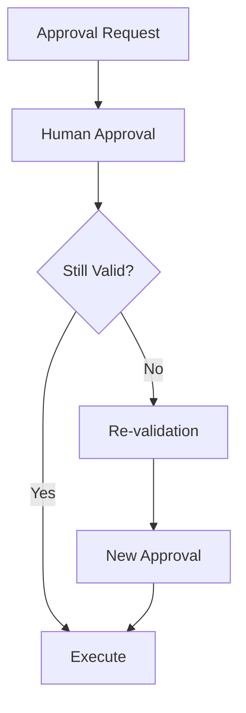

---

# 30. Stale State

Human workflows can create stale state.

Example:

```text
Agent reads account balance
 ↓
Human approval
 ↓
Balance changes
 ↓
Execute
```

The system should re-check critical business conditions before the side effect.

---

# 31. Approval + Revalidation

Recommended:

```text
Human Approval
 ↓
Revalidate Current State
 ↓
Authorization
 ↓
Execute
```

This prevents executing against outdated assumptions.

---

# 32. Human Overrides

A reviewer may override an agent recommendation.

Example:

```text
Agent:
Refund = ₹10,000

Human:
Refund = ₹5,000
```

The modified action must pass through:

```text
Schema Validation
 ↓
Business Rules
 ↓
Authorization
 ↓
Execution
```

---

# 33. Human Input Is Also Untrusted Input

Human approval interfaces should still validate:

```text
Input Format
Permissions
Scope
Action
Identifiers
```

A human should not be able to approve an action outside their authorization scope.

---

# 34. Authorization

Approval does not automatically mean authorization.

Example:

```text
Agent proposes:
Delete customer data

Reviewer clicks:
Approve
```

The system must still check:

```text
Is reviewer authorized?
Is operation allowed?
Is target allowed?
Is policy satisfied?
```

---

# 35. Separation of Duties

High-risk operations may require multiple people.

Example:

```text
Agent
 ↓
Reviewer A
 ↓
Reviewer B
 ↓
Execute
```

This can reduce:

```text
Single-Person Risk
```

for highly sensitive actions.

---

# 36. Multi-Level Approval

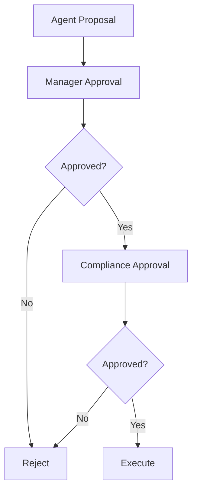

---

# 37. Human Escalation

An agent can escalate when it cannot safely continue.

Examples:

```text
Low Confidence
Unknown Intent
Policy Conflict
Tool Failure
High Risk
Repeated Errors
```

Flow:

```text
Agent
 ↓
Problem
 ↓
Escalation
 ↓
Human
```

---

# 38. Escalation Router

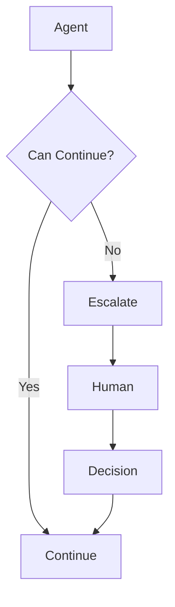

---

# 39. Human Correction

Humans may provide corrective information.

Example:

```text
Agent:
Customer requested refund.

Human:
No. Customer requested a replacement.
```

Then:

```text
Human Correction
 ↓
Update State
 ↓
Re-plan
 ↓
Continue
```

---

# 40. Correction Flow

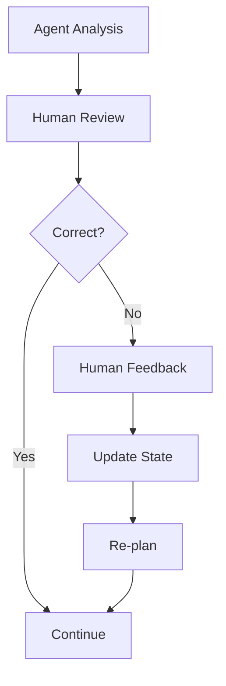

---

# 41. Human Feedback as State

Example:

```python
class AgentState(TypedDict):
    query: str
    plan: list
    human_feedback: str
    approval_status: str
```

The feedback can become part of the next reasoning step.

---

# 42. Human Feedback Should Be Scoped

Avoid blindly injecting every human message into every future step.

Instead:

```text
Human Feedback
 ↓
Relevant State Field
 ↓
Specific Node
```

This keeps the workflow predictable.

---

# 43. HITL for RAG

Human review can also be used in RAG systems.

Example:

```text
Retrieve
 ↓
Generate Answer
 ↓
Human Review
 ↓
Publish
```

Useful for:

```text
Legal Documents
Financial Reports
Regulated Content
Customer Communications
```

---

# 44. HITL for Tool Calling

Example:

```text
Agent
 ↓
Tool Selection
 ↓
Risk Check
 ↓
Human Approval
 ↓
Tool
```

This is one of the most important enterprise HITL patterns.

---

# 45. HITL for Agentic Workflows

For longer workflows:

```text
Plan
 ↓
Research
 ↓
Draft
 ↓
Human Review
 ↓
Execute
 ↓
Validate
```

The human becomes a controlled checkpoint within the larger workflow.

---

# 46. Human-in-the-Loop vs Human-on-the-Loop

### Human-in-the-Loop

Human actively participates in execution.

```text
Agent
 ↓
Human
 ↓
Continue
```

### Human-on-the-Loop

Human supervises the system and intervenes when necessary.

```text
Agent
 ↓
Execute
 ↓
Monitor
 ↓
Human Intervention if Required
```

The distinction matters when designing operational controls.

---

# 47. HITL vs Fully Autonomous

### Fully Autonomous

```text
Agent
 ↓
Decision
 ↓
Action
```

### HITL

```text
Agent
 ↓
Decision
 ↓
Human
 ↓
Action
```

### Human-on-the-Loop

```text
Agent
 ↓
Decision
 ↓
Action
 ↓
Monitoring
 ↓
Human Intervention
```

---

# 48. Choosing the Right Pattern

Use stronger human control when:

```text
Risk ↑
Impact ↑
Irreversibility ↑
Uncertainty ↑
Regulatory Requirement ↑
```

Use more autonomy when:

```text
Risk ↓
Impact ↓
Reversibility ↑
Confidence ↑
```

---

# 49. HITL Decision Matrix

| Factor | Low | High |
|---|---|---|
| Business Risk | Automatic | Human |
| Financial Impact | Automatic | Human |
| Irreversibility | Automatic | Human |
| Model Confidence | Automatic | Review |
| Regulatory Sensitivity | Automatic | Human |
| Data Sensitivity | Lower Controls | Strong Controls |

This is a conceptual framework; actual policies should be domain-specific.

---

# 50. Approval Request Design

An approval request should provide enough context for a human to make an informed decision.

Example:

```text
Action:
Refund Customer

Customer:
Customer-1021

Amount:
₹7,500

Reason:
Duplicate payment

Evidence:
Transaction IDs
Policy Reference

Risk:
Medium

Agent Recommendation:
Approve
```

Avoid forcing reviewers to inspect raw model output to understand the proposed action.

---

# 51. Explainability for Reviewers

The reviewer should see:

```text
What?
Why?
Evidence?
Risk?
Impact?
```

Example:

```text
Action
 ↓
Reason
 ↓
Evidence
 ↓
Policy
 ↓
Risk
```

The goal is useful decision context, not exposing hidden chain-of-thought.

---

# 52. Review UI

A production review interface might contain:

```text
┌───────────────────────────────┐
│ Approval Request              │
├───────────────────────────────┤
│ Customer: C-101               │
│ Action: Refund                │
│ Amount: ₹7,500                │
│ Risk: Medium                  │
│ Evidence: 3 transactions      │
│ Policy: Refund Policy #12     │
├───────────────────────────────┤
│ [Approve] [Reject] [Modify]   │
└───────────────────────────────┘
```

---

# 53. Approval Audit

Record:

```text
Request ID
Thread ID
Execution ID
Action
Reviewer
Decision
Timestamp
Comments
Previous State
Approved State
```

For sensitive operations, audit records should be tamper-resistant according to enterprise requirements.

---

# 54. Approval Trace

Example:

```text
Execution: exec-9001

Agent Proposal
 ↓
Risk Check
 ↓
Human Approval
Reviewer: user-200
Decision: APPROVED
 ↓
Revalidation
 ↓
Execution
```

This creates an auditable lifecycle.

---

# 55. Approval Metrics

Track:

```text
Approval Rate
Rejection Rate
Modification Rate
Average Review Time
Approval Timeout Rate
Escalation Rate
Human Override Rate
Execution Success Rate
```

These metrics can reveal:

```text
Poor Agent Quality
Poor Routing
Bad Risk Thresholds
Reviewer Bottlenecks
```

---

# 56. Human Review Bottleneck

If:

```text
Agents
 ↓
1000 Approval Requests
 ↓
5 Reviewers
```

the human queue becomes a bottleneck.

Therefore measure:

```text
Queue Depth
Wait Time
Reviewer Utilization
SLA Breaches
```

---

# 57. Approval SLA

Define business SLAs.

Example:

```text
Low Priority
 → 24 hours

High Priority
 → 30 minutes
```

The actual SLA depends on the business process.

If the SLA expires:

```text
Escalate
Reject
Re-route
```

---

# 58. Approval Timeout

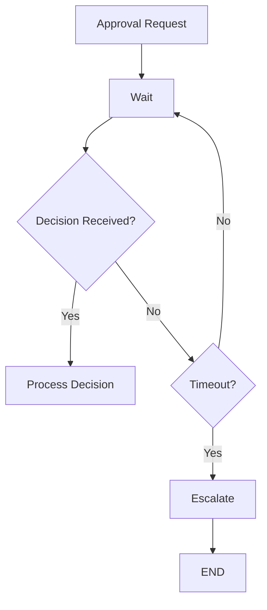

---

# 59. Reviewer Availability

If no reviewer is available:

```text
Approval Queue
 ↓
No Reviewer
 ↓
Escalation
```

Do not leave critical workflows indefinitely paused without monitoring.

---

# 60. Approval Delegation

Enterprise systems may support:

```text
Primary Reviewer
 ↓
Backup Reviewer
 ↓
Escalation Team
```

This improves workflow resilience.

---

# 61. Human-in-the-Loop Security

Protect:

```text
Approval Requests
Reviewer Identity
Customer Data
Financial Data
Agent State
```

Controls include:

```text
Authentication
Authorization
RBAC
ABAC
Encryption
Audit
Tenant Isolation
```

---

# 62. Reviewer Authorization

A reviewer should only approve actions within their scope.

Example:

```text
Finance Reviewer
 ↓
Financial Actions

HR Reviewer
 ↓
Employee Actions
```

The graph should enforce this.

---

# 63. Approval Token

For sensitive workflows, a decision can be represented by a controlled approval record.

```text
Approval ID
+
Reviewer
+
Action Hash
+
Decision
+
Timestamp
```

Before execution:

```text
Approval Record
 ↓
Action Still Matches?
 ↓
Authorized?
 ↓
Execute
```

This can reduce the risk of approving one action and executing another.

---

# 64. Approval Integrity

Consider:

```text
Agent Proposal A
 ↓
Human approves A
 ↓
State changes
 ↓
Agent changes to Proposal B
 ↓
Execute B
```

This is dangerous.

Use:

```text
Proposal Identity
+
Version
+
Approval Binding
```

to ensure the approval applies to the exact action being executed.

---

# 65. Approval Binding

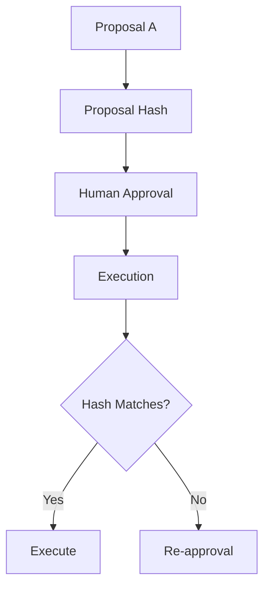

---

# 66. Human Review + State Versioning

If state changes while waiting:

```text
State v10
 ↓
Human Approval
 ↓
State v11
```

The system should determine whether approval remains valid.

For critical operations:

```text
Approval
 ↓
State Validation
 ↓
Execute
```

---

# 67. Human-in-the-Loop and Concurrency

Multiple reviewers should not accidentally approve competing versions.

Use:

```text
Version
+
Lock
+
Optimistic Concurrency
```

where appropriate.

---

# 68. HITL Failure Modes

Possible failures:

```text
Reviewer Timeout
Reviewer Unauthorized
Approval Service Down
State Lost
Duplicate Approval
Stale Approval
Wrong Reviewer
Duplicate Execution
```

Every failure should have a defined response.

---

# 69. HITL Failure Handling

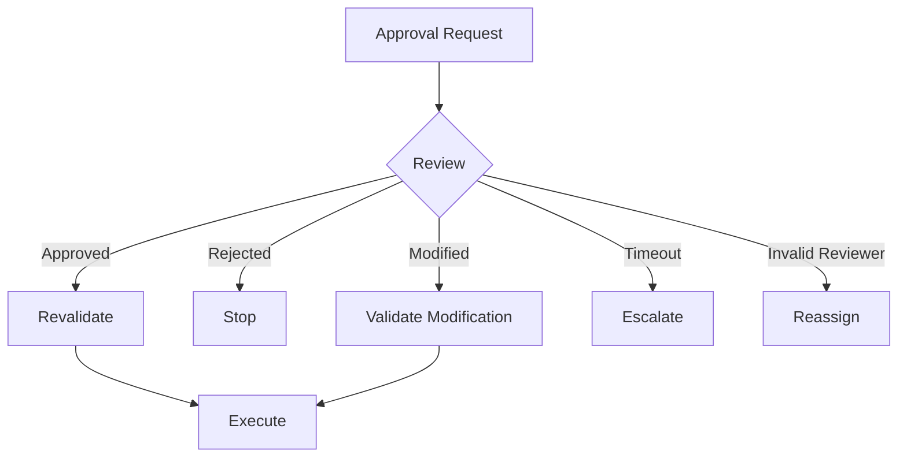

---

# 70. HITL and Idempotency

Approval does not eliminate duplicate execution risks.

Example:

```text
Human approves
 ↓
Execute
 ↓
Network timeout
 ↓
Agent retries
```

The operation still requires:

```text
Idempotency Key
```

---

# 71. HITL and Checkpointing

The key relationship is:

```text
HITL
+
Checkpoint
=
Pause and Resume
```

Without durable state, long-running human workflows become fragile.

---

# 72. HITL and Observability

Trace:

```text
Agent
 ↓
Approval Request
 ↓
Queue
 ↓
Reviewer
 ↓
Decision
 ↓
Resume
 ↓
Execution
```

This provides end-to-end visibility.

---

# 73. HITL Evaluation

Evaluate:

```text
Decision Accuracy
Approval Accuracy
Escalation Accuracy
Reviewer Time
False Escalation
Missed Escalation
```

The goal is not simply:

```text
More Human Reviews
```

The goal is:

```text
Right Human Review
at the Right Decision Point
```

---

# 74. HITL Cost Optimization

Human review has operational cost.

Too many reviews:

```text
High Human Cost
Slow Workflow
Reviewer Fatigue
```

Too few:

```text
Higher Autonomous Risk
```

Optimize the escalation threshold using evaluation data.

---

# 75. Human Fatigue

If reviewers see:

```text
1000 low-risk approvals
```

they may approve mechanically.

Therefore:

```text
Risk-Based Routing
+
Useful Review Context
+
Good Thresholds
```

are important.

---

# 76. HITL Quality Feedback

Human decisions can become evaluation signals.

Example:

```text
Agent Recommendation
 ↓
Human Decision
 ↓
Approved / Modified / Rejected
```

Aggregate these outcomes to identify:

```text
Routing Errors
Tool Errors
Policy Errors
Agent Quality Problems
```

Do not automatically treat every human decision as training data without appropriate governance.

---

# 77. Human Corrections as Evaluation Data

Example:

```text
Agent:
Refund ₹10,000

Human:
Change to ₹7,500
```

This indicates:

```text
Agent Recommendation
≠
Human Decision
```

Repeated patterns may reveal opportunities for:

```text
Prompt Improvement
Policy Improvement
Routing Improvement
Tool Improvement
Model Evaluation
```

---

# 78. HITL Production Architecture

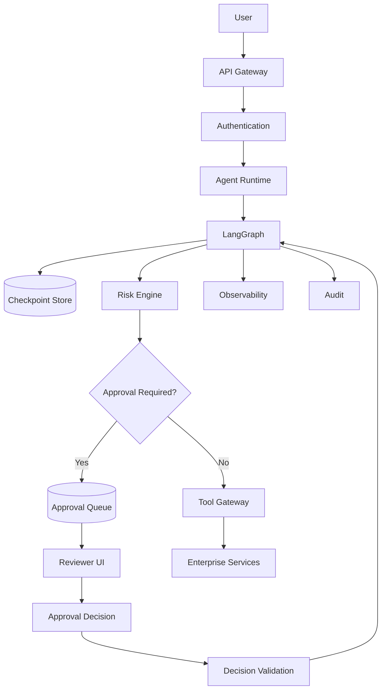

---

# 79. Enterprise HITL Architecture

A robust architecture separates:

```text
Agent
 ↓
Decision
 ↓
Risk Policy
 ↓
Human Review
 ↓
Authorization
 ↓
Execution
```

The LLM should never become the ultimate authority for high-impact actions.

---

# 80. HITL Design Principles

### Principle 1 — Human at the Right Boundary

Do not insert humans everywhere.

Use them where:

```text
Risk
+
Uncertainty
+
Impact
```

justify intervention.

### Principle 2 — Persist Before Waiting

```text
Prepare
 ↓
Checkpoint
 ↓
Wait
```

### Principle 3 — Revalidate Before Side Effect

```text
Approval
 ↓
Revalidate
 ↓
Execute
```

### Principle 4 — Bind Approval to Action

```text
Approval
=
Specific Action
```

### Principle 5 — Keep Authorization Deterministic

```text
Human Approval
≠
Authorization
```

---

# 81. Common Anti-Patterns

## Anti-Pattern 1 — Human Approval Everywhere

```text
Every Agent Step
 ↓
Human
```

Problems:

```text
Slow
Expensive
Poor User Experience
Reviewer Fatigue
```

---

# 82. Anti-Pattern 2 — No Persistence

```text
Agent
 ↓
Approval
 ↓
Process Restart
```

Problem:

```text
Execution Lost
```

Use durable checkpointing.

---

# 83. Anti-Pattern 3 — Trusting Approval Forever

```text
Approval
 ↓
Execute Days Later
```

Problem:

```text
State May Have Changed
```

Use:

```text
TTL
+
Revalidation
```

---

# 84. Anti-Pattern 4 — Approval Without Authorization

```text
Reviewer
 ↓
Approve
 ↓
Execute
```

without checking:

```text
Reviewer Permissions
```

is unsafe.

---

# 85. Anti-Pattern 5 — Approval Not Bound to Action

```text
Approve A
 ↓
Execute B
```

Avoid this by using:

```text
Action ID
Version
Hash
```

where appropriate.

---

# 86. Anti-Pattern 6 — Human Input as Raw Prompt

Avoid:

```text
Human Text
 ↓
LLM
 ↓
Everything
```

Instead:

```text
Human Decision
 ↓
Validated State
 ↓
Controlled Graph Transition
```

---

# 87. Anti-Pattern 7 — No Timeout

```text
Waiting for Human
 ↓
Forever
```

Use:

```text
SLA
Timeout
Escalation
```

---

# 88. Anti-Pattern 8 — No Audit

If a financial action happens, you should be able to answer:

```text
Who approved?
What was approved?
When?
Why?
Which agent execution?
Which graph version?
Which policy?
```

---

# 89. Production Checklist

## Human Review

- [ ] Clear approval boundary
- [ ] Risk-based escalation
- [ ] Reviewer authorization
- [ ] Review context
- [ ] Approve / reject / modify
- [ ] Timeout
- [ ] Escalation

## State

- [ ] Durable checkpoint
- [ ] Approval state
- [ ] Thread identity
- [ ] State version
- [ ] Resume support

## Security

- [ ] Authentication
- [ ] Authorization
- [ ] RBAC / ABAC
- [ ] Tenant isolation
- [ ] Action binding
- [ ] Audit

## Reliability

- [ ] Revalidation
- [ ] Idempotency
- [ ] Retry
- [ ] Duplicate prevention
- [ ] Failure handling

## Operations

- [ ] Approval metrics
- [ ] Queue monitoring
- [ ] Reviewer SLA
- [ ] End-to-end tracing
- [ ] Audit logs

---

# 90. Key Takeaways

- Human-in-the-Loop introduces human oversight into AI Agent execution.
- Humans should participate at meaningful decision boundaries.
- High-risk and irreversible actions are strong candidates for HITL.
- LangGraph can model pause-and-resume workflows using graph execution and persistence mechanisms.
- Checkpointing is essential for durable human approval workflows.
- Approval is not the same as authorization.
- Human decisions must be validated before execution.
- Critical approvals should be bound to the exact action being approved.
- State can become stale while waiting for human input.
- Revalidation should occur before important side effects.
- Human modifications must pass through deterministic validation and authorization.
- Approval workflows need timeout and escalation strategies.
- Reviewer assignment should respect organizational permissions.
- Multi-level approval can support separation of duties.
- Idempotency remains necessary even when humans approve actions.
- Human review should be risk-based rather than universal.
- Human decisions can provide valuable evaluation signals.
- HITL systems require strong observability and auditability.
- The objective is not maximum human involvement.
- The objective is **the right level of human oversight for the risk of the action**.

---

# 📝 Quick Revision Notes

## HITL

```text
Agent
 ↓
Decision
 ↓
Human
 ↓
Continue
```

---

## Approval

```text
Prepare
 ↓
Checkpoint
 ↓
Approve
 ↓
Revalidate
 ↓
Execute
```

---

## Rejection

```text
Proposal
 ↓
Reject
 ↓
Stop / Re-plan / Escalate
```

---

## Modification

```text
Proposal
 ↓
Human Modification
 ↓
Validate
 ↓
Authorize
 ↓
Execute
```

---

## Durable HITL

```text
Agent
+
Checkpoint
+
Human Decision
+
Resume
=
Durable HITL Workflow
```

---

## Secure Approval

```text
Human Decision
 ↓
Reviewer Authorization
 ↓
Action Validation
 ↓
State Revalidation
 ↓
Policy
 ↓
Execute
```

---

# ❓ Interview Questions

## Beginner

1. What is Human-in-the-Loop?
2. Why do enterprise AI Agents need HITL?
3. What is an approval workflow?
4. What is the difference between human-in-the-loop and human-on-the-loop?
5. What is an interrupt in an agent workflow?
6. Why is checkpointing important for HITL?
7. What can a human do during an agent workflow?
8. What is risk-based escalation?
9. Why should approvals expire?
10. What is human review?

## Intermediate

11. How would you implement an approval workflow in LangGraph?
12. How would you pause an agent until human approval?
13. How would you resume execution after approval?
14. How would you store human decisions?
15. How would you handle rejected actions?
16. How would you handle human modifications?
17. How would you prevent duplicate execution after approval?
18. How would you validate reviewer authorization?
19. How would you handle stale approvals?
20. How would you implement approval timeouts?
21. How would you design a review queue?
22. How would you implement risk-based routing?
23. How would you audit human decisions?
24. How would you evaluate HITL effectiveness?

## Advanced

25. Design a production-grade LangGraph HITL architecture.
26. How would you implement durable approval workflows?
27. How would you guarantee that an approved action is the same action eventually executed?
28. How would you handle state changes while waiting for approval?
29. How would you design multi-level approval?
30. How would you implement separation of duties?
31. How would you prevent duplicate financial transactions after resume?
32. How would you design reviewer authorization across multiple tenants?
33. How would you handle approval service failure?
34. How would you design approval SLA and escalation?
35. How would you optimize human review cost?
36. How would you prevent reviewer fatigue?
37. How would you use human decisions as evaluation signals?
38. How would you combine HITL with deterministic policy engines?
39. How would you design HITL for long-running agents?
40. How would you implement HITL for high-risk tool calls?
41. How would you design HITL across multiple agent subgraphs?
42. How would you recover an interrupted HITL workflow after a deployment?
43. How would you design auditability for regulated AI workflows?
44. How would you distinguish human approval from authorization?
45. When should an enterprise agent remain fully autonomous?

---

# 🛠️ Practical Exercise

Build a customer refund agent.

Requirements:

```text
1. Receive refund request
2. Retrieve transaction
3. Analyze refund eligibility
4. Calculate proposed refund
5. Classify risk
6. Request human approval for high-risk refunds
7. Resume after approval
8. Revalidate transaction
9. Execute refund
10. Record audit
```

Architecture:

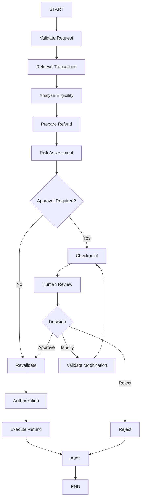

---

# 🧪 HITL Evaluation Exercise

Create at least:

```text
100 Refund Requests
```

Classify:

```text
Low Risk
Medium Risk
High Risk
```

Measure:

```text
Automatic Approval Rate
Human Escalation Rate
Human Rejection Rate
Human Modification Rate
Approval Latency
False Escalation Rate
Missed Escalation Rate
Execution Success Rate
Duplicate Execution Rate
```

---

# 🚀 Failure Simulation

Simulate:

```text
1. Human approval timeout
2. Reviewer unauthorized
3. Approval service unavailable
4. State store unavailable
5. Transaction changes after approval
6. Process crash after approval
7. Process crash after refund execution
8. Duplicate resume request
```

Verify that the system safely handles each case.

---

# 🏢 Production Architecture Challenge

Design a HITL platform supporting:

```text
100,000 Agent Executions
10,000 Pending Reviews
Multiple Tenants
Multiple Reviewer Roles
Long-Running Workflows
High-Risk Financial Actions
```

Required components:

```text
Agent Runtime
 ↓
LangGraph
 ↓
Checkpoint Store
 ↓
Risk Engine
 ↓
Approval Queue
 ↓
Reviewer Service
 ↓
Authorization
 ↓
Enterprise Tool Gateway
 ↓
Audit
```

The system must support:

```text
Pause
Resume
Reject
Modify
Reassign
Escalate
Expire
Revalidate
Retry
Recover
```

---

# 🧠 Final Architecture Challenge

Design a **Banking Operations Agent** that can:

```text
1. Analyze customer requests
2. Retrieve customer data
3. Retrieve bank policies
4. Recommend an operation
5. Classify risk
6. Request human approval for high-risk actions
7. Allow authorized reviewers to modify the action
8. Revalidate the action before execution
9. Execute through a Tool Gateway
10. Recover after infrastructure failures
11. Maintain a complete audit trail
```

Your architecture should include:

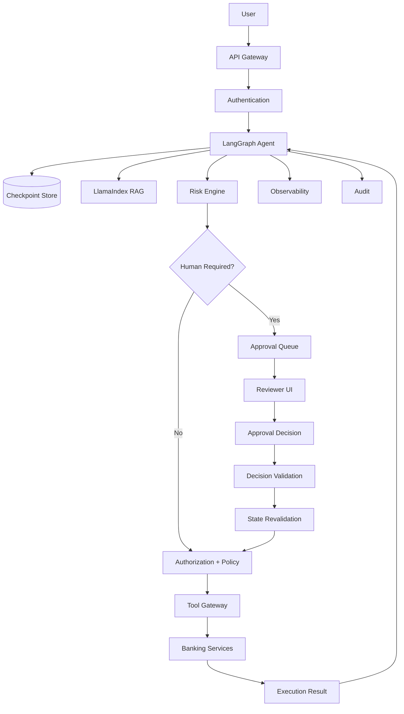

Answer:

```text
Where does the graph pause?

What state is persisted?

Who can approve?

How is approval authorized?

How is approval bound to the action?

What happens if the state changes?

What happens if the reviewer does not respond?

How do you prevent duplicate execution?

How do you recover after process failure?

Which decisions remain deterministic?

Which decisions can be delegated to the AI?
```

---

# 📚 References & Further Reading

Recommended areas for further study:

- LangGraph Human-in-the-Loop
- LangGraph Interrupts
- LangGraph Persistence
- LangGraph Checkpointing
- Stateful Agent Workflows
- Human Approval Systems
- Risk-Based Automation
- Human Oversight in AI
- Agent Authorization
- Tool Authorization
- Durable Execution
- Idempotent APIs
- Workflow State Management
- Enterprise Approval Workflows
- AI Observability
- AI Governance
- AI Security
- Multi-Tenant Agent Platforms

> LangGraph's interrupt, persistence, checkpointing, and resume APIs evolve over time. Verify the exact implementation and API behavior against the official LangGraph documentation for the version used in your project.

---

## 🧭 Chapter Navigation

⬅️ **Previous:** [20. LangGraph Nodes, Edges and Routing](20-langgraph-nodes-edges-and-routing.md)

📚 **Part VIII Index:** [AI Engineering Frameworks & Tooling](index.md)

➡️ **Next:** [22. LangGraph Tool Execution](22-langgraph-tool-execution.md)

---

> **Enterprise AI Engineering Handbook**
>
> *Building Production-Grade Enterprise AI Systems — One Chapter at a Time.*