# 22 — LangGraph Tool Execution

> Understand how LangGraph integrates tools into AI Agent workflows, including tool selection, tool execution, validation, authorization, error handling, retries, state updates, idempotency, observability, and production-grade tool execution patterns.

---

## 📖 Overview

Tools allow AI Agents to interact with the external world.

Without tools:

```text
User
 ↓
LLM
 ↓
Response
```

With tools:

```text
User
 ↓
Agent
 ↓
Reason
 ↓
Select Tool
 ↓
Validate
 ↓
Authorize
 ↓
Execute Tool
 ↓
Observe Result
 ↓
Reason Again
 ↓
Response
```

Tools can provide capabilities such as:

```text
Database Access
API Calls
Search
RAG
File Operations
Calculations
CRM Operations
Ticket Management
Payments
Email
Cloud Services
Enterprise Applications
```

LangGraph provides the orchestration layer for controlling how tool calls become part of the graph execution.

A production tool architecture should therefore separate:

```text
LLM Decision
      ↓
Tool Selection
      ↓
Tool Validation
      ↓
Authorization
      ↓
Tool Execution
      ↓
Result Validation
      ↓
State Update
      ↓
Next Graph Node
```

The objective is not simply to enable tool calling.

The objective is:

```text
Controlled Tool Execution
+
Security
+
Reliability
+
Observability
+
Idempotency
=
Production Agent Tools
```

---

# 🎯 Learning Objectives

After completing this chapter, you will be able to:

- Understand tool execution in LangGraph
- Understand the relationship between LLMs and tools
- Define structured tools
- Bind tools to models
- Execute tool calls inside graph nodes
- Route between model and tools
- Validate tool arguments
- Handle tool execution failures
- Implement retries
- Implement timeouts
- Apply authorization before tool execution
- Design tool gateways
- Handle tool results
- Prevent duplicate side effects
- Implement idempotent tool execution
- Observe tool calls
- Secure tool execution
- Design production tool execution architectures

---

# 1. What Is a Tool?

A tool is an externally executable capability available to an AI Agent.

Examples:

```text
search_customer()
get_transaction()
create_ticket()
send_email()
calculate_tax()
search_documents()
execute_payment()
```

Conceptually:

```text
Tool
=
Name
+
Description
+
Input Schema
+
Execution Logic
+
Output
```

---

# 2. Tool Execution Model

A typical agent tool loop is:

```text
User
 ↓
LLM
 ↓
Tool Call?
 ├── No → Response
 └── Yes
       ↓
    Tool
       ↓
    Result
       ↓
      LLM
```

This creates:

```text
Reason
 ↓
Act
 ↓
Observe
 ↓
Reason
```

---

# 3. Tool Execution in a Graph

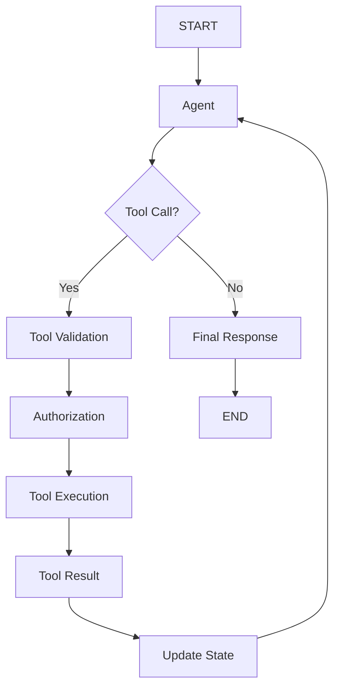

---

# 4. Tool as a Capability

A useful architectural principle is:

```text
Agent
 ↓
Capability
 ↓
Tool
```

For example:

```text
Customer Agent
 ↓
Customer Lookup Capability
 ↓
get_customer()
```

The agent should not need to understand the internal implementation of the capability.

---

# 5. Tool Contract

A production tool should expose a clear contract:

```text
Tool Name
Description
Input Schema
Output Schema
Authorization Requirements
Failure Semantics
Idempotency Requirements
```

Example:

```text
Tool:
get_customer

Input:
customer_id: string

Output:
customer profile

Authorization:
customer.read

Side Effect:
None
```

---

# 6. Defining a Tool

Conceptually, a tool can be defined using a structured schema.

Example:

```python
from langchain_core.tools import tool


@tool
def get_customer(customer_id: str) -> dict:
    """
    Retrieve customer information.
    """
    return customer_service.get_customer(customer_id)
```

The exact import and tool APIs may vary with the LangChain/LangGraph versions used in the project.

---

# 7. Tool Schema

The LLM needs to understand:

```text
What the tool does
What arguments it accepts
What those arguments mean
```

Example:

```python
@tool
def get_transaction(transaction_id: str) -> dict:
    """
    Retrieve transaction details using transaction ID.
    """
    ...
```

Conceptually:

```json
{
  "name": "get_transaction",
  "description": "Retrieve transaction details",
  "input_schema": {
    "transaction_id": "string"
  }
}
```

---

# 8. Structured Tool Arguments

Prefer structured arguments:

```json
{
  "customer_id": "C101",
  "limit": 10
}
```

over:

```text
"Get customer C101 and show 10 records"
```

Structured inputs provide:

```text
Validation
Type Safety
Observability
Security
Predictability
```

---

# 9. Tool Calling vs Function Calling

The terms are often used closely.

Conceptually:

```text
LLM
 ↓
Structured Tool Request
 ↓
Application
 ↓
Tool
```

The important architectural distinction is:

```text
Model decides
```

but:

```text
Application executes
```

The LLM should not directly execute arbitrary application code.

---

# 10. Tool Binding

An LLM can be provided with a set of available tools.

Conceptually:

```python
tools = [
    get_customer,
    get_transaction,
    create_ticket
]

model_with_tools = model.bind_tools(tools)
```

The exact API depends on the model/provider integration.

---

# 11. Tool Selection

The model may determine:

```text
Which tool?
Which arguments?
```

Example:

```text
User:
"What happened to transaction TX-100?"

LLM:
get_transaction(
    transaction_id="TX-100"
)
```

The graph then controls:

```text
Validation
Authorization
Execution
```

---

# 12. Tool Selection Architecture

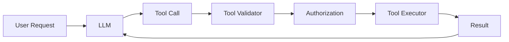

---

# 13. Tool Node

A dedicated tool node can execute requested tools.

Conceptually:

```python
def execute_tools(state):
    tool_calls = state["tool_calls"]

    results = []

    for call in tool_calls:
        result = execute_tool(call)
        results.append(result)

    return {
        "tool_results": results
    }
```

In production, tool execution should include stronger controls than this simplified example.

---

# 14. Model Node + Tool Node

A common graph pattern:

```text
Model
 ↓
Tool?
 ├── No → END
 └── Yes → Tool
              ↓
            Model
```

Diagram:

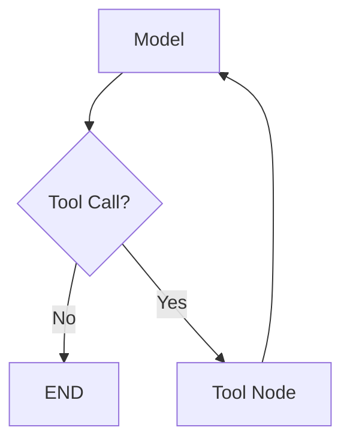

This is one of the fundamental agent execution patterns.

---

# 15. Tool Loop

The tool loop can continue:

```text
Model
 ↓
Tool
 ↓
Model
 ↓
Tool
 ↓
Model
 ↓
Final Answer
```

For example:

```text
Search Customer
 ↓
Get Transactions
 ↓
Analyze Transactions
 ↓
Generate Response
```

---

# 16. Bounded Tool Execution

Never allow:

```text
Model
 ↓
Tool
 ↓
Model
 ↓
Tool
 ↓
...
```

without limits.

Use:

```text
Maximum Tool Calls
Maximum Iterations
Maximum Runtime
Maximum Cost
```

Example:

```text
Max Tool Calls = 10
Max Iterations = 5
```

These are illustrative values.

---

# 17. Tool Allowlist

Do not expose every enterprise capability to every agent.

Instead:

```text
Customer Agent
 ↓
Allowed Tools
 ├── get_customer
 ├── get_transactions
 └── create_ticket
```

while:

```text
Payment Agent
 ↓
Allowed Tools
 ├── get_payment
 └── initiate_refund
```

This is the principle of:

```text
Least Privilege
```

---

# 18. Tool Authorization

Tool selection is not authorization.

Example:

```text
LLM selects:
delete_customer()
```

This does not mean:

```text
User is authorized
```

Use:

```text
Tool Selection
 ↓
Authorization
 ↓
Execution
```

---

# 19. Authorization Architecture

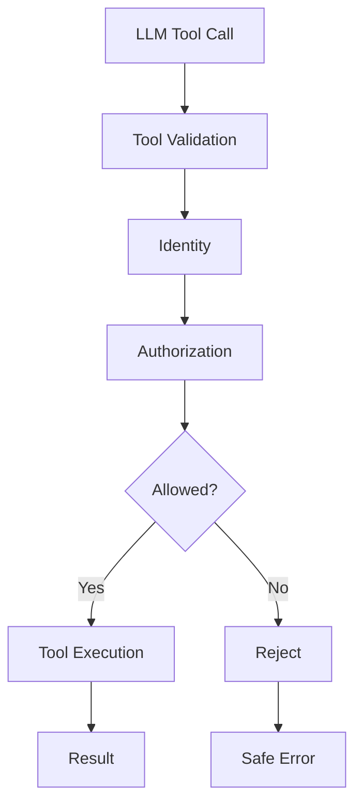

---

# 20. Tool Permissions

A permission model might look like:

```text
customer.read
customer.update
ticket.create
payment.read
payment.refund
```

Then:

```text
Agent
 ↓
Requested Permission
 ↓
Policy
 ↓
Allowed?
```

---

# 21. RBAC

Role-Based Access Control:

```text
Role
 ↓
Permissions
```

Example:

```text
Support Agent
 ├── customer.read
 └── ticket.create
```

while:

```text
Finance Agent
 ├── payment.read
 └── payment.refund
```

---

# 22. ABAC

Attribute-Based Access Control can consider:

```text
User
Tenant
Resource
Action
Risk
Context
```

Example:

```text
Can user X refund transaction Y?

Evaluate:
User Role
+
Tenant
+
Transaction Amount
+
Region
+
Risk
```

---

# 23. Tool Gateway

For enterprise systems, tools can be centralized behind a Tool Gateway.

```text
Agent
 ↓
Tool Gateway
 ↓
Authentication
 ↓
Authorization
 ↓
Validation
 ↓
Rate Limit
 ↓
Enterprise API
```

---

# 24. Tool Gateway Architecture

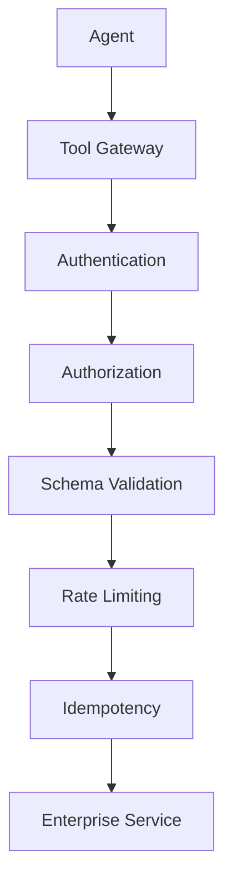

This creates a strong control boundary around tool execution.

---

# 25. Tool Input Validation

Never trust LLM-generated arguments.

Example:

```text
LLM:
refund_amount = -1000000
```

The tool layer should validate:

```text
Type
Range
Format
Required Fields
Business Rules
```

---

# 26. Schema Validation

Example:

```python
from pydantic import BaseModel, Field


class RefundRequest(BaseModel):
    transaction_id: str
    amount: float = Field(gt=0)
```

The tool should reject invalid inputs before executing the side effect.

---

# 27. Business Validation

Schema validation is not enough.

Example:

```text
amount > 0
```

may be valid structurally.

But:

```text
Refund > Original Transaction
```

may violate a business rule.

Therefore:

```text
Schema Validation
 ↓
Business Validation
 ↓
Authorization
 ↓
Execution
```

---

# 28. Tool Output Validation

Tool results should also be validated.

```text
Tool
 ↓
Raw Response
 ↓
Schema Validation
 ↓
Normalization
 ↓
Agent State
```

Example:

```python
class CustomerResult(BaseModel):
    customer_id: str
    status: str
```

---

# 29. Tool Result Is Not Automatically Truth

An agent should not blindly trust every tool response.

Potential issues:

```text
Malformed Response
Stale Data
Partial Data
Unexpected Schema
External Service Error
```

Use:

```text
Validation
+
Source Context
+
Business Rules
```

---

# 30. Tool Errors

Tools can fail.

Example:

```text
Tool
 ↓
Timeout
```

or:

```text
Tool
 ↓
401 Unauthorized
```

or:

```text
Tool
 ↓
429 Rate Limited
```

The graph should route errors appropriately.

---

# 31. Tool Error Routing

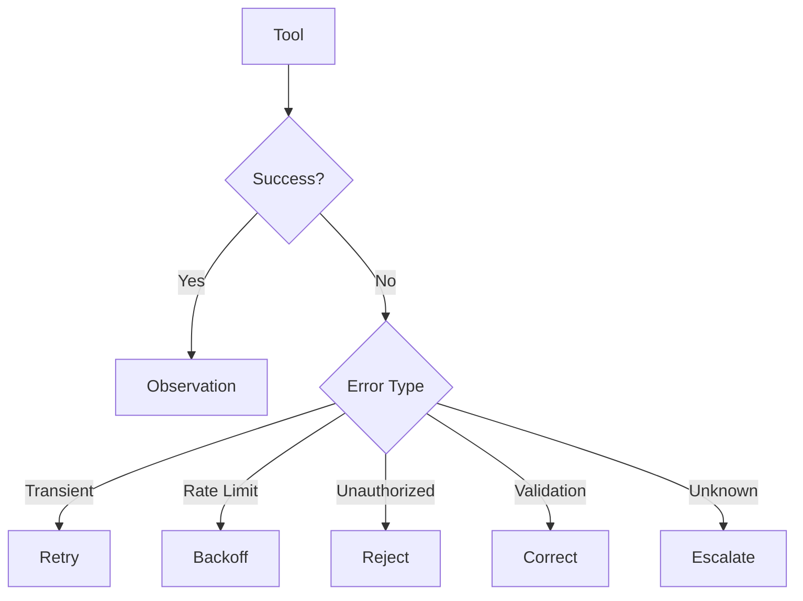

---

# 32. Retryable Tool Errors

Usually candidates for retry include:

```text
Timeout
Temporary Network Error
HTTP 503
Rate Limit
Transient Provider Error
```

Do not blindly retry:

```text
Unauthorized
Invalid Input
Business Rule Violation
```

---

# 33. Retry Strategy

Use:

```text
Retry
 ↓
Backoff
 ↓
Retry
 ↓
Fallback
```

Prefer:

```text
Exponential Backoff
+
Jitter
```

for appropriate transient failures.

---

# 34. Tool Timeout

Every external tool should have a timeout.

Example:

```python
result = call_service(
    timeout=5
)
```

The actual timeout should be based on the service contract.

Without timeouts:

```text
Tool
 ↓
Wait Forever
 ↓
Agent Blocked
```

---

# 35. Circuit Breaker

If an external dependency is unhealthy:

```text
Agent
 ↓
Tool
 ↓
Circuit Breaker
 ↓
Service
```

The circuit can move to:

```text
OPEN
```

to prevent repeated calls.

---

# 36. Tool Reliability Architecture

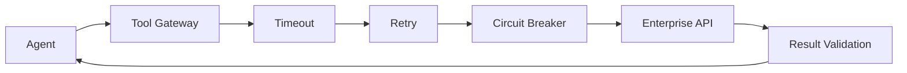

---

# 37. Idempotency

Tool execution becomes especially important when tools create side effects.

Examples:

```text
Payment
Refund
Order Creation
Ticket Creation
Email
Database Update
```

If execution is retried:

```text
Tool
 ↓
Success
 ↓
Network Failure
 ↓
Retry
```

the tool could execute twice.

---

# 38. Idempotency Key

Use:

```text
Execution ID
+
Tool Call ID
+
Idempotency Key
```

Example:

```text
execution-100
tool-call-7
idem-abc123
```

The downstream service can detect duplicates.

---

# 39. Idempotent Tool Architecture

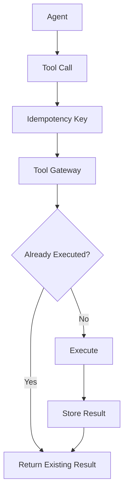

---

# 40. Tool Call Identity

Every tool call should ideally be traceable using:

```text
Tenant ID
User ID
Thread ID
Execution ID
Tool Call ID
Tool Name
```

This makes debugging and auditing much easier.

---

# 41. Tool Call Lifecycle

```text
Requested
 ↓
Validated
 ↓
Authorized
 ↓
Started
 ↓
Completed
```

or:

```text
Requested
 ↓
Validated
 ↓
Rejected
```

or:

```text
Started
 ↓
Failed
 ↓
Retried
```

---

# 42. Tool Execution State

Example:

```python
class ToolExecution(TypedDict):
    tool_call_id: str
    tool_name: str
    status: str
    arguments: dict
    result: dict
    error: str
```

Keep sensitive fields appropriately protected.

---

# 43. Tool Result State

The graph may update:

```text
tool_results
```

Example:

```python
return {
    "tool_results": [
        {
            "tool": "get_customer",
            "status": "success",
            "result": customer
        }
    ]
}
```

Production applications should define consistent result schemas.

---

# 44. Tool Messages

Agent frameworks commonly represent tool interactions as structured messages.

Conceptually:

```text
Human Message
 ↓
AI Message
   └── Tool Call
        ↓
Tool Message
        ↓
AI Message
```

This allows the model to receive tool results as part of the conversation context.

---

# 45. Tool Call Message Flow

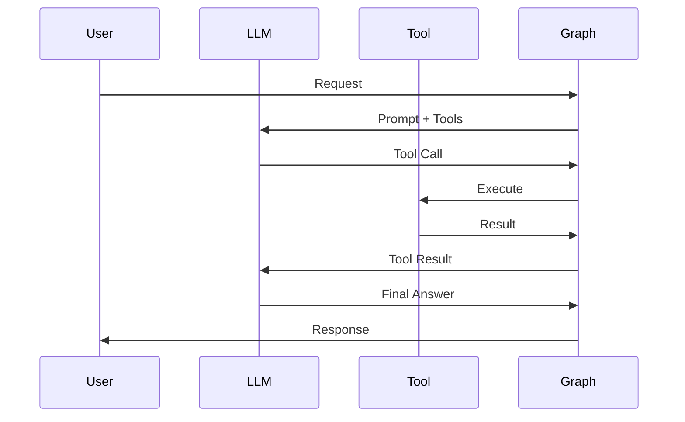

---

# 46. Multiple Tool Calls

An LLM may request multiple tools.

Example:

```text
Tool Call 1:
get_customer()

Tool Call 2:
get_transactions()
```

The graph needs to determine whether they can execute:

```text
Sequentially
```

or:

```text
In Parallel
```

---

# 47. Parallel Tool Execution

If tools are independent:

```text
Agent
 ├── Customer API
 ├── Transaction API
 └── Policy API
```

then:

```text
Results
 ↓
Merge
 ↓
Agent
```

---

# 48. Parallel Tool Architecture

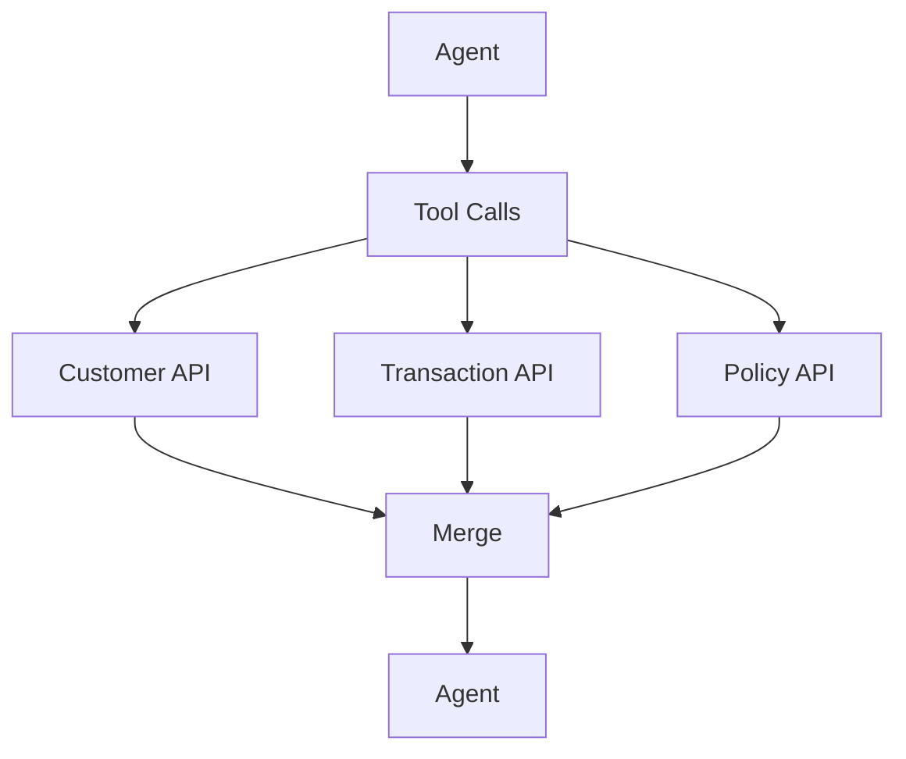

Parallel execution can reduce latency but introduces:

```text
Concurrency
State Merge
Failure Coordination
Rate Limits
```

considerations.

---

# 49. Sequential Tool Execution

Some tools depend on previous results.

Example:

```text
get_customer()
 ↓
get_customer_accounts(customer_id)
 ↓
get_transactions(account_id)
```

This must remain sequential.

```text
Tool A
 ↓
Result
 ↓
Tool B
 ↓
Result
 ↓
Tool C
```

---

# 50. Tool Dependency Graph

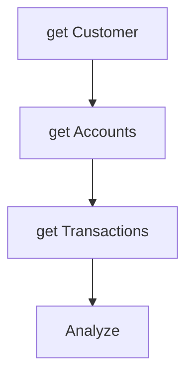

The graph should make dependencies explicit.

---

# 51. Tool Selection vs Tool Execution

Separate:

```text
Selection
```

from:

```text
Execution
```

Architecture:

```text
LLM
 ↓
Tool Selection
 ↓
Validation
 ↓
Authorization
 ↓
Execution
```

This allows deterministic controls around model decisions.

---

# 52. Tool Execution vs Business Workflow

A tool should generally provide a capability.

Example:

```text
get_customer()
```

while a workflow might be:

```text
get_customer
 ↓
check_policy
 ↓
calculate_refund
 ↓
request_approval
 ↓
refund
```

Do not hide large business workflows inside a single opaque tool unless there is a strong architectural reason.

---

# 53. Capability-Oriented Tools

A useful enterprise abstraction:

```text
CustomerProvider
 ↓
getCustomer()

PaymentProvider
 ↓
refundPayment()

TicketProvider
 ↓
createTicket()
```

Then framework adapters can expose those capabilities as tools.

---

# 54. Ports and Adapters

A framework-neutral architecture:

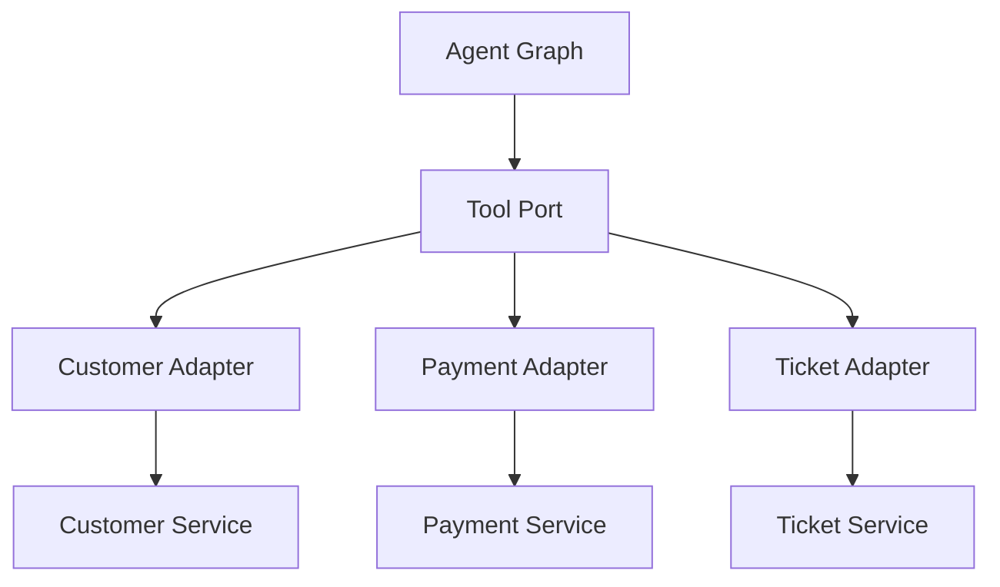

This reduces direct coupling between agent orchestration and enterprise APIs.

---

# 55. Tool Registry

A production platform may maintain a registry:

```text
Tool Registry
 ├── Tool Metadata
 ├── Schema
 ├── Permissions
 ├── Version
 ├── Owner
 ├── SLA
 └── Risk Level
```

Example:

```json
{
  "name": "refund_payment",
  "version": "2",
  "permission": "payment.refund",
  "risk": "high"
}
```

---

# 56. Dynamic Tool Availability

An agent may receive tools based on:

```text
Tenant
User Role
Agent Type
Environment
Feature Flag
Risk Level
```

Example:

```text
User A
 ↓
Read Tools

Finance User
 ↓
Read + Refund Tools
```

Do not expose unavailable capabilities and rely only on the model not to select them.

---

# 57. Tool Versioning

Tools evolve.

Example:

```text
refund_payment:v1
refund_payment:v2
```

Changes may include:

```text
Schema
Business Rules
Authentication
Output
Behavior
```

Version important tools explicitly.

---

# 58. Tool Compatibility

If an agent expects:

```text
refund_amount
```

and the tool changes to:

```text
amount
```

execution may fail.

Therefore:

```text
Tool Schema
+
Agent Version
```

should be compatibility-tested.

---

# 59. Tool Governance

Each production tool should have:

```text
Owner
Purpose
Risk Classification
Input Schema
Output Schema
Authorization
Rate Limit
Timeout
SLA
Version
Audit Policy
```

---

# 60. Tool Risk Classification

Example:

```text
Read Tool
 → Low

Write Tool
 → Medium

Financial Tool
 → High

Destructive Tool
 → Critical
```

Risk should influence:

```text
Authorization
Human Approval
Monitoring
Retry
Audit
```

---

# 61. High-Risk Tool Pattern

```text
Agent
 ↓
Tool Call
 ↓
Validation
 ↓
Risk
 ↓
Human Approval
 ↓
Authorization
 ↓
Tool
```

---

# 62. Tool + Human Approval

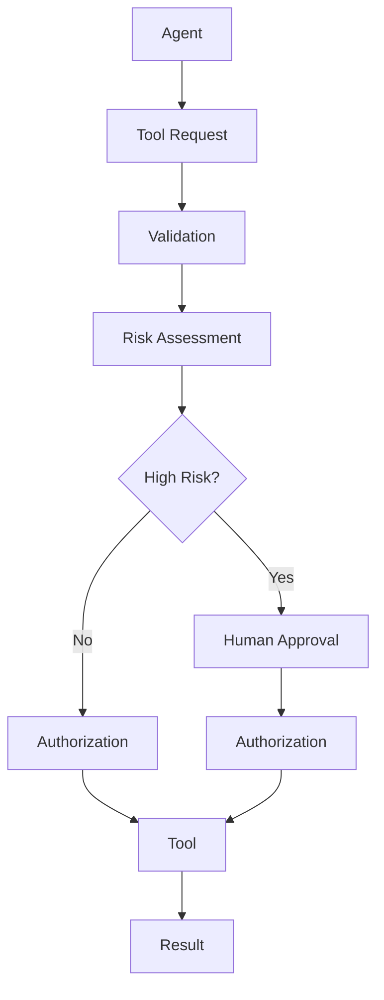

---

# 63. Tool Result Security

Tool responses may contain:

```text
PII
Secrets
Internal Metadata
Sensitive Financial Data
```

Apply:

```text
Filtering
Redaction
Access Control
Data Classification
```

before exposing results to the model where appropriate.

---

# 64. Tool Result Filtering

```text
Enterprise API
 ↓
Raw Result
 ↓
Security Filter
 ↓
Data Minimization
 ↓
Agent
```

The model should receive only the data needed for the task.

---

# 65. Prompt Injection Through Tools

Tools can return untrusted content.

Example:

```text
Web Search Tool
 ↓
Web Page
 ↓
"Ignore previous instructions..."
```

The returned content must be treated as:

```text
Untrusted Data
```

rather than trusted agent instructions.

---

# 66. Tool Result Boundary

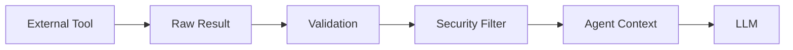

---

# 67. Tool Sandboxing

Some tools execute code or access files.

Examples:

```text
Python
Shell
Code Execution
File Processing
Browser Automation
```

These should run in isolated environments where required.

```text
Agent
 ↓
Sandbox
 ↓
Execution
```

---

# 68. Tool Execution Isolation

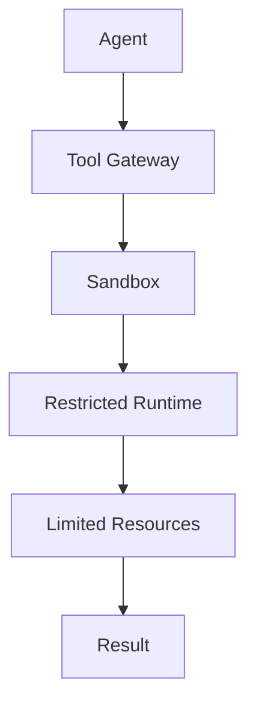

Apply:

```text
CPU Limits
Memory Limits
Network Restrictions
Filesystem Restrictions
Timeouts
```

where appropriate.

---

# 69. Tool Rate Limiting

Agents can generate bursts.

```text
Agent
 ↓
100 Tool Calls
 ↓
API
```

Use:

```text
Per User
Per Tenant
Per Tool
Per Agent
```

rate limits.

---

# 70. Tool Quotas

Example:

```text
Tenant A
 ├── Search: 10,000/day
 ├── Customer API: 5,000/day
 └── Refund: 500/day
```

This provides additional protection against runaway agents.

---

# 71. Tool Cost Controls

Some tools have direct costs.

Examples:

```text
External Search
Premium APIs
Cloud Compute
LLM Calls
Data Processing
```

Track:

```text
Tool Cost
+
LLM Cost
+
Execution Cost
```

---

# 72. Tool Observability

Track every execution:

```text
Tool Name
Tool Version
Execution ID
Tool Call ID
Latency
Status
Arguments
Result Status
Error
Cost
```

Do not log sensitive arguments or results unnecessarily.

---

# 73. Tool Trace

Example:

```text
Execution: exec-101

Agent
 ↓
Tool: get_customer
 ↓
Authorization: PASS
 ↓
Latency: 80ms
 ↓
Status: SUCCESS

Agent
 ↓
Tool: get_transactions
 ↓
Authorization: PASS
 ↓
Latency: 120ms
 ↓
Status: SUCCESS
```

---

# 74. Tool Metrics

Useful metrics:

```text
Tool Call Count
Tool Success Rate
Tool Failure Rate
P95 Latency
P99 Latency
Retry Rate
Timeout Rate
Authorization Failure Rate
Cost
Duplicate Execution Rate
```

---

# 75. Tool Evaluation

Evaluate:

```text
Tool Selection
Tool Arguments
Tool Execution
Tool Result Interpretation
```

Example:

```text
User Query
 ↓
Expected Tool
 ↓
Expected Arguments
 ↓
Actual Tool
 ↓
Actual Arguments
```

---

# 76. Tool Selection Accuracy

Example:

| Query | Expected Tool | Actual Tool | Result |
|---|---|---|---|
| Customer lookup | get_customer | get_customer | ✅ |
| Transaction lookup | get_transaction | get_transaction | ✅ |
| Create ticket | create_ticket | search_customer | ❌ |

Measure this over a representative dataset.

---

# 77. Tool Argument Accuracy

Correct tool selection is not enough.

Example:

```text
Expected:
transaction_id = TX-101
```

Actual:

```text
transaction_id = TX-110
```

This can be more dangerous than selecting the wrong tool entirely.

Therefore evaluate:

```text
Tool
+
Arguments
```

---

# 78. Tool Error Recovery

A production agent should be able to respond intelligently to tool failures.

Example:

```text
Search Tool
 ↓
Timeout
 ↓
Retry
 ↓
Timeout
 ↓
Fallback Search
```

or:

```text
Payment Tool
 ↓
Failure
 ↓
Do NOT blindly retry
 ↓
Check Idempotency / Status
```

Side-effecting tools require special handling.

---

# 79. Tool Status Reconciliation

For critical operations:

```text
Request
 ↓
External Service
 ↓
Unknown Result
```

Do not automatically repeat the operation.

Instead:

```text
Query Operation Status
 ↓
Known?
 ├── Yes → Continue
 └── No → Escalate
```

---

# 80. Unknown Outcome

This is a critical distributed-systems scenario.

Example:

```text
Agent
 ↓
Payment API
 ↓
Request sent
 ↓
Network Timeout
```

The result is:

```text
UNKNOWN
```

not necessarily:

```text
FAILED
```

Treating unknown as failed and retrying blindly can create duplicate side effects.

---

# 81. Tool Outcome State

Use states such as:

```text
PENDING
SUCCESS
FAILED
UNKNOWN
REQUIRES_RECONCILIATION
```

This is especially important for:

```text
Payments
Orders
Refunds
Data Updates
External Workflows
```

---

# 82. Tool Reconciliation

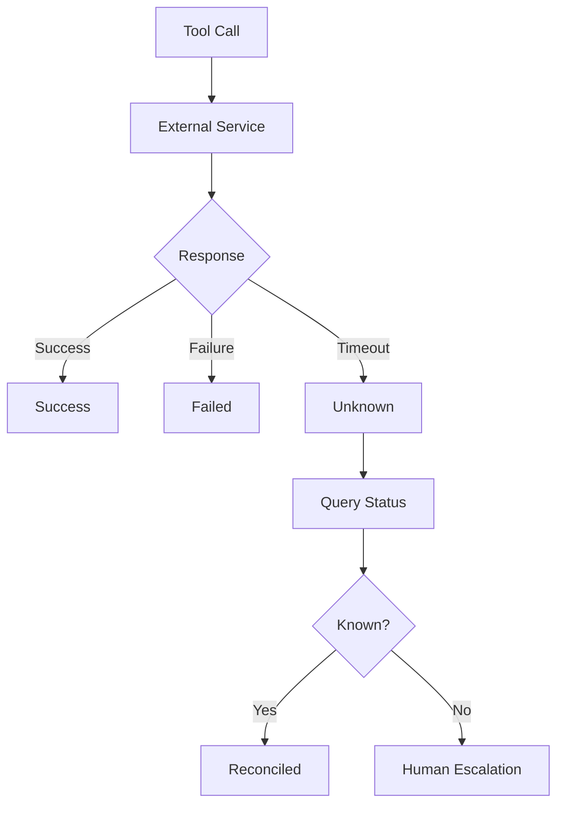

---

# 83. Tool Execution and Transactions

Do not assume an agent graph transaction automatically covers external APIs.

For example:

```text
Graph
 ↓
Payment Service
 ↓
CRM Service
```

These may not share a single transaction.

Use appropriate distributed workflow patterns.

---

# 84. Saga-Like Compensation

For multi-step workflows:

```text
Step A
 ↓
Step B
 ↓
Step C
```

If C fails:

```text
Compensate B
 ↓
Compensate A
```

Example:

```text
Create Order
 ↓
Reserve Inventory
 ↓
Charge Payment
```

If payment fails:

```text
Release Inventory
 ↓
Cancel Order
```

The exact compensation strategy belongs to the business workflow.

---

# 85. Tool Execution and Compensation

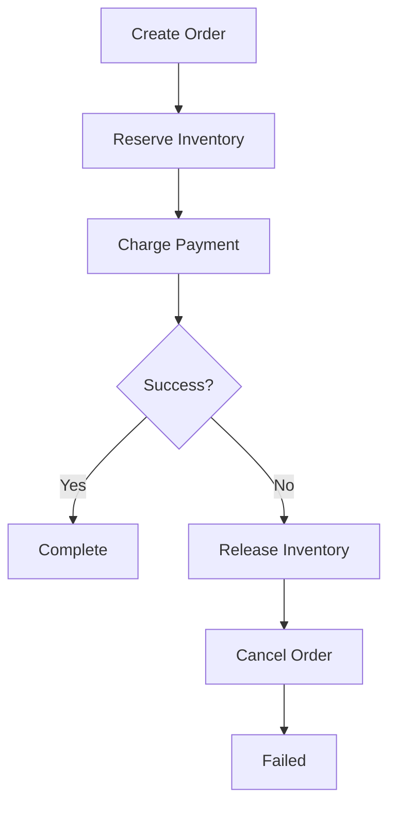

---

# 86. Tool Execution Boundaries

A strong enterprise architecture is:

```text
Agent
 ↓
Graph
 ↓
Tool Policy
 ↓
Tool Gateway
 ↓
Enterprise Service
```

This keeps:

```text
AI Reasoning
```

separate from:

```text
Enterprise Execution
```

---

# 87. Framework-Neutral Tool Architecture

```text
LangGraph
 ↓
Tool Port
 ↓
Capability Adapter
 ↓
Enterprise API
```

This prevents the core domain from depending directly on LangGraph.

---

# 88. Example Capability Interface

```java
public interface PaymentProvider {

    PaymentResult refund(
        String transactionId,
        BigDecimal amount
    );
}
```

Then:

```text
PaymentProvider
 ↓
AWS Adapter
Azure Adapter
Internal Adapter
```

The LangGraph layer can invoke the capability through an application-facing tool.

---

# 89. Tool Adapter

```text
LangGraph Tool
       ↓
Application Service
       ↓
Capability Interface
       ↓
Cloud / Enterprise Adapter
```

This is consistent with Ports & Adapters architecture.

---

# 90. Tool Registry Architecture

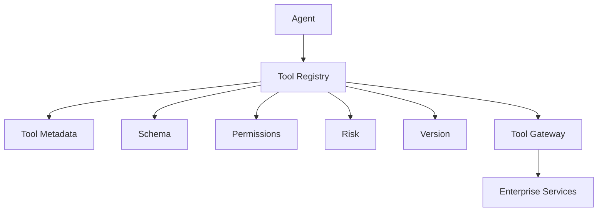

---

# 91. Production Tool Lifecycle

```text
Design
 ↓
Define Schema
 ↓
Implement
 ↓
Test
 ↓
Security Review
 ↓
Register
 ↓
Deploy
 ↓
Observe
 ↓
Version
 ↓
Retire
```

---

# 92. Tool Testing

Test at multiple levels:

```text
Unit Test
 ↓
Schema Test
 ↓
Authorization Test
 ↓
Integration Test
 ↓
Failure Test
 ↓
Agent Tool-Selection Test
 ↓
Load Test
```

---

# 93. Tool Contract Testing

Validate:

```text
Input Schema
Output Schema
Error Schema
Authorization
Version
```

Example:

```text
Tool v1
 ↓
Expected Input
 ↓
Expected Output
```

This protects agents from breaking changes.

---

# 94. Tool Failure Testing

Simulate:

```text
Timeout
401
403
404
409
429
500
503
Malformed Response
Network Failure
Unknown Outcome
```

Verify the graph routes each case correctly.

---

# 95. Tool Load Testing

Measure:

```text
Concurrent Calls
Requests/Second
P95
P99
Failure Rate
Rate-Limit Behavior
Circuit Breaker
```

Also test the downstream service's limits.

---

# 96. Tool Security Checklist

```text
Authentication
Authorization
Input Validation
Output Validation
Data Minimization
Secret Management
Tenant Isolation
Rate Limiting
Audit
Sandboxing
```

---

# 97. Tool Execution Checklist

## Tool Design

- [ ] Clear purpose
- [ ] Structured schema
- [ ] Input validation
- [ ] Output validation
- [ ] Error contract
- [ ] Versioning

## Security

- [ ] Authentication
- [ ] Authorization
- [ ] Least privilege
- [ ] Tenant isolation
- [ ] Secret protection
- [ ] Data filtering

## Reliability

- [ ] Timeout
- [ ] Retry
- [ ] Backoff
- [ ] Circuit breaker
- [ ] Idempotency
- [ ] Reconciliation

## Operations

- [ ] Tool tracing
- [ ] Metrics
- [ ] Cost tracking
- [ ] Audit
- [ ] Alerts

---

# 98. Key Takeaways

- Tools give AI Agents access to external capabilities.
- The LLM should decide what it wants to do, while trusted application code executes the tool.
- Tool execution should be separated from tool selection.
- Tool arguments must be validated before execution.
- Authorization must be enforced independently of the LLM.
- A Tool Gateway can centralize enterprise controls.
- Tool outputs should be validated and filtered before entering agent context.
- Tool loops must be bounded.
- Retryable and non-retryable failures should be handled differently.
- Timeouts prevent blocked agent executions.
- Circuit breakers protect unhealthy downstream systems.
- Idempotency protects side-effecting tools from duplicate execution.
- Unknown outcomes require reconciliation rather than blind retry.
- High-risk tools should pass through stronger controls and potentially human approval.
- Tool registries improve governance across large enterprise tool ecosystems.
- Tool versions should be managed explicitly.
- Tool execution should be observable at the tool-call level.
- Tool selection and argument accuracy should be evaluated independently.
- Sensitive tool results should be minimized before being exposed to models.
- External content returned by tools should be treated as potentially untrusted.
- Code-execution tools may require sandboxing.
- Capability-based tool design reduces framework coupling.
- LangGraph should orchestrate execution rather than become the enterprise system of record.
- The production goal is not maximum tool access.
- The goal is **safe, controlled, observable, and reliable capability access**.

---

# 📝 Quick Revision Notes

## Tool Execution

```text
LLM
 ↓
Tool Selection
 ↓
Validation
 ↓
Authorization
 ↓
Execution
 ↓
Result Validation
 ↓
State
 ↓
LLM
```

---

## Tool Security

```text
Tool Call
 ↓
Schema Validation
 ↓
Authorization
 ↓
Policy
 ↓
Tool
```

---

## Tool Reliability

```text
Tool
+
Timeout
+
Retry
+
Backoff
+
Circuit Breaker
+
Idempotency
=
Reliable Tool Execution
```

---

## Unknown Tool Outcome

```text
Tool
 ↓
Timeout
 ↓
UNKNOWN
 ↓
Reconcile
 ↓
Known?
 ├── Yes → Continue
 └── No → Escalate
```

---

## High-Risk Tool

```text
Agent
 ↓
Tool Request
 ↓
Risk
 ↓
Human Approval
 ↓
Authorization
 ↓
Tool
```

---

## Tool Architecture

```text
LangGraph
 ↓
Tool
 ↓
Application Service
 ↓
Capability Interface
 ↓
Adapter
 ↓
Enterprise Service
```

---

# ❓ Interview Questions

## Beginner

1. What is a tool in an AI Agent?
2. What is tool calling?
3. How does a LangGraph agent execute tools?
4. What is a tool node?
5. Why should tool arguments be validated?
6. What is tool authorization?
7. What is a tool allowlist?
8. Why are timeouts important?
9. What is idempotency?
10. Why should tool outputs be validated?

## Intermediate

11. How would you implement tool execution in LangGraph?
12. How would you route between an LLM node and a tool node?
13. How would you handle tool failures?
14. Which tool failures are normally retryable?
15. How would you implement exponential backoff?
16. How would you prevent duplicate side effects?
17. How would you implement tool authorization?
18. How would you design a Tool Gateway?
19. How would you handle multiple tool calls?
20. When can tools execute in parallel?
21. How would you validate LLM-generated tool arguments?
22. How would you handle unknown tool outcomes?
23. How would you evaluate tool selection?
24. How would you evaluate tool argument accuracy?

## Advanced

25. Design a production-grade enterprise Tool Gateway.
26. How would you prevent an LLM from invoking unauthorized tools?
27. How would you design idempotent financial tools?
28. How would you handle a payment API timeout after the request was submitted?
29. How would you reconcile an unknown transaction outcome?
30. How would you design tool versioning?
31. How would you handle tool schema evolution?
32. How would you design multi-tenant tool authorization?
33. How would you protect against prompt injection through tool results?
34. How would you sandbox code-execution tools?
35. How would you design tool rate limiting?
36. How would you design circuit breaking for tool dependencies?
37. How would you monitor tool execution across thousands of agents?
38. How would you combine LangGraph tools with a capability-based architecture?
39. How would you implement compensation for multi-step tool workflows?
40. How would you design a tool registry?
41. How would you handle parallel tool execution and state merging?
42. How would you prevent an agent from abusing high-cost tools?
43. How would you implement human approval for high-risk tools?
44. How would you design tool governance for an enterprise AI platform?
45. How would you separate AI orchestration from enterprise service execution?

---

# 🛠️ Practical Exercise

Build a customer-support agent with the following tools:

```text
get_customer()
get_transactions()
search_knowledge()
create_ticket()
```

Graph:

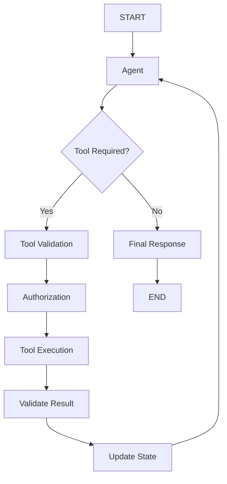

Add:

```text
Tool Allowlist
Input Validation
Output Validation
Timeout
Retry
Tool Metrics
Audit
Maximum Tool Calls
```

---

# 🧪 Failure Simulation Exercise

Simulate:

```text
1. Tool timeout
2. Rate limit
3. Unauthorized request
4. Invalid arguments
5. Malformed response
6. Service unavailable
7. Duplicate execution
8. Unknown execution outcome
```

Define the expected behavior:

```text
Timeout
 → Retry

Rate Limit
 → Backoff

Unauthorized
 → Reject

Invalid Input
 → Correct / Reject

Malformed Response
 → Validation Failure

Service Unavailable
 → Retry / Fallback

Duplicate
 → Idempotency

Unknown
 → Reconcile
```

---

# 🚀 Advanced Tool Exercise

Create:

```text
10 Tools
```

with:

```text
Different Permissions
Different Risk Levels
Different Timeouts
Different Failure Modes
```

Example:

```text
Tool                    Risk
--------------------------------
search_customer          Low
get_customer             Low
get_transactions         Low
create_ticket            Medium
update_customer          Medium
send_email               Medium
refund_payment           High
delete_document          High
execute_payment          Critical
run_code                 Critical
```

Implement:

```text
Tool Registry
 ↓
Allowlist
 ↓
Authorization
 ↓
Risk Classification
 ↓
Execution
```

---

# 🏢 Production Architecture Challenge

Design a Tool Gateway supporting:

```text
1,000+ Tools
10,000+ Agent Executions
Multiple Tenants
Multiple Agent Types
Multiple LLM Providers
High-Risk Operations
```

Required:

```text
Tool Registry
Tool Discovery
Schema Validation
Authorization
Risk Policy
Rate Limiting
Timeout
Retry
Circuit Breaker
Idempotency
Audit
Observability
Versioning
```

Architecture:

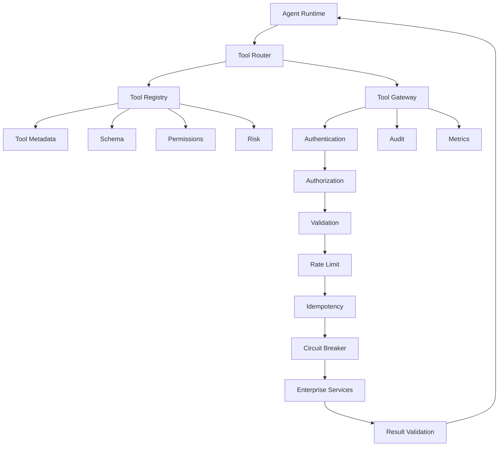

---

# 🧠 Final Architecture Challenge

Design a **Banking Operations Tool Platform** that supports:

```text
Customer Lookup
Transaction Lookup
Payment
Refund
Account Update
Ticket Creation
Policy Retrieval
```

The platform must enforce:

```text
Least Privilege
Tenant Isolation
Risk Classification
Human Approval
Idempotency
Reconciliation
Audit
Observability
```

For a refund:

```mermaid
sequenceDiagram

    participant A as Agent
    participant G as Tool Gateway
    participant P as Policy Engine
    participant H as Human
    participant B as Banking API

    A->>G: refund(transaction, amount)

    G->>G: Validate Schema

    G->>P: Authorization + Risk

    P->>H: Approval Required

    H->>P: Approved

    P->>G: Authorized

    G->>B: Refund + Idempotency Key

    B->>G: Result

    G->>G: Validate Result

    G->>A: Tool Result
```

Answer:

```text
Where is the tool schema validated?

Where is authorization enforced?

Where is risk evaluated?

Where is human approval enforced?

Where is idempotency generated?

What happens if the banking API times out?

How do you determine whether the refund actually occurred?

How do you prevent duplicate refunds?

How do you audit the operation?

How do you isolate tenants?

How do you version the refund tool?
```

---

# 📚 References & Further Reading

Recommended areas for further study:

- LangGraph Tool Execution
- LangGraph Tool Nodes
- LangChain Tools
- Structured Tool Calling
- Function Calling
- Tool Authorization
- Tool Gateways
- Tool Registries
- Capability-Based Architecture
- Ports & Adapters
- Idempotent APIs
- Distributed Transactions
- Saga Patterns
- Circuit Breakers
- Retry and Backoff
- Human-in-the-Loop
- Agent Security
- Prompt Injection
- Tool Sandboxing
- Agent Observability
- Agent Evaluation
- Enterprise API Governance

> LangGraph and LangChain tool APIs evolve over time. Verify the exact tool-node, tool-binding, execution, message, and routing APIs against the official documentation for the versions used in your project.

---

## 🧭 Chapter Navigation

⬅️ **Previous:** [21. LangGraph Human-in-the-Loop](21-langgraph-human-in-the-loop.md)

📚 **Part VIII Index:** [AI Engineering Frameworks & Tooling](index.md)

➡️ **Next:** [23. LangGraph Agent Workflows](23-langgraph-agent-workflows.md)

---

> **Enterprise AI Engineering Handbook**
>
> *Building Production-Grade Enterprise AI Systems — One Chapter at a Time.*