# 23 — LangGraph Agent Workflows

> Understand how LangGraph can be used to design, orchestrate, and operate structured AI Agent workflows using state, nodes, routing, tool execution, loops, checkpoints, human intervention, and controlled execution paths.

---

## 📖 Overview

An AI Agent is more than an LLM that calls a tool.

A production Agent must coordinate multiple activities:

```text
Understand
   ↓
Plan
   ↓
Reason
   ↓
Act
   ↓
Observe
   ↓
Validate
   ↓
Continue / Complete
```

LangGraph provides a graph-based execution model for representing these workflows explicitly.

A typical Agent workflow can be represented as:

```text
                    ┌───────────────┐
                    │     START     │
                    └───────┬───────┘
                            ↓
                    ┌───────────────┐
                    │    Analyze    │
                    └───────┬───────┘
                            ↓
                    ┌───────────────┐
                    │     Plan      │
                    └───────┬───────┘
                            ↓
                    ┌───────────────┐
                    │    Decide     │
                    └───────┬───────┘
                            ↓
                     ┌────────────┐
                     │   Action   │
                     └─────┬──────┘
                           ↓
                     ┌────────────┐
                     │  Observe   │
                     └─────┬──────┘
                           ↓
                     ┌────────────┐
                     │  Validate │
                     └─────┬──────┘
                           ↓
                    ┌───────────────┐
                    │    Complete?  │
                    └───────┬───────┘
                       No ↙   ↘ Yes
                         ↓       ↓
                      Re-plan   END
```

The key architectural principle is:

```text
LLM Reasoning
+
Explicit Graph Control
+
State Management
+
Tool Execution
+
Validation
=
Production Agent Workflow
```

---

# 🎯 Learning Objectives

After completing this chapter, you will be able to:

- Understand LangGraph Agent workflows
- Differentiate workflows from autonomous Agents
- Design stateful Agent execution
- Build sequential Agent workflows
- Build conditional Agent workflows
- Build tool-using Agent workflows
- Implement loops and iterative reasoning
- Design planning and execution workflows
- Combine deterministic nodes with LLM reasoning
- Implement validation and correction loops
- Integrate Human-in-the-Loop into Agent workflows
- Design bounded Agent execution
- Handle failures and retries
- Design long-running Agent workflows
- Apply production observability
- Design reliable enterprise Agent architectures

---

# 1. What Is an Agent Workflow?

An Agent workflow is a structured execution process where an AI model participates in one or more decision points.

A simple workflow:

```text
Input
 ↓
LLM
 ↓
Tool
 ↓
LLM
 ↓
Response
```

A more advanced workflow:

```text
Input
 ↓
Analyze
 ↓
Plan
 ↓
Execute
 ↓
Observe
 ↓
Validate
 ↓
Re-plan
 ↓
Execute
 ↓
Complete
```

The graph determines how these steps interact.

---

# 2. Workflow vs Agent

A traditional workflow usually has:

```text
A → B → C → D
```

An Agent workflow may contain:

```text
A
 ↓
Decision
 ├── B
 ├── C
 └── D
      ↓
    Observe
      ↓
    Decide
      ↓
     Loop
```

The difference is not simply the presence of an LLM.

The key difference is that an Agent can make runtime decisions within controlled execution boundaries.

---

# 3. Deterministic Workflow

Example:

```text
Receive Request
 ↓
Validate
 ↓
Retrieve
 ↓
Transform
 ↓
Store
 ↓
END
```

The path is known beforehand.

---

# 4. Agentic Workflow

Example:

```text
Request
 ↓
Analyze
 ↓
What should I do?
 ├── Search
 ├── Retrieve
 ├── Call API
 └── Ask Human
```

The execution path can depend on runtime state.

---

# 5. Hybrid Agent Workflow

Production systems often combine both approaches:

```text
Deterministic Control
        ↓
LLM Decision
        ↓
Deterministic Policy
        ↓
Tool
        ↓
LLM Reasoning
        ↓
Deterministic Validation
```

This provides:

```text
Flexibility
+
Control
```

---

# 6. Core Agent Workflow Pattern

A common pattern is:

```text
START
 ↓
Agent
 ↓
Tool?
 ├── No → END
 └── Yes
       ↓
     Tool
       ↓
     Agent
```

This is the foundation of many tool-using Agents.

---

# 7. Basic Agent Workflow

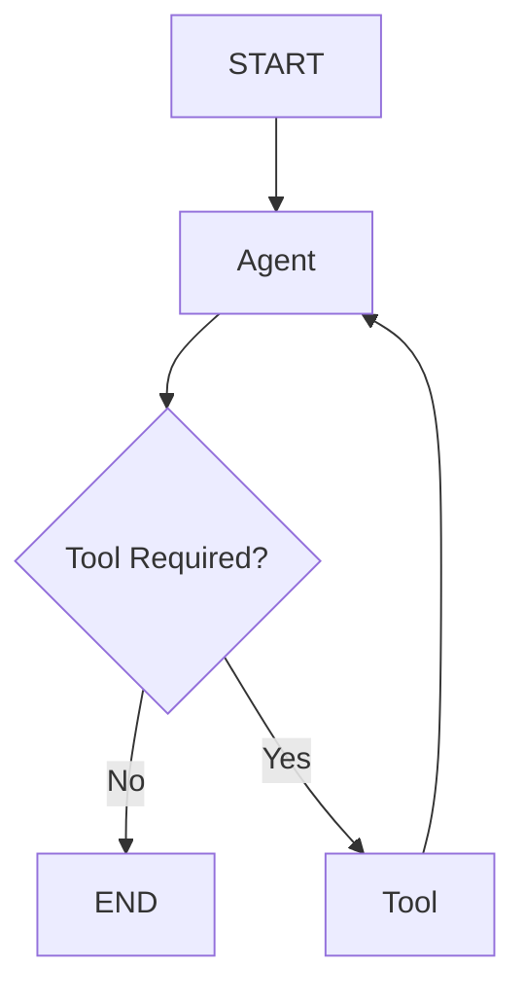

This creates an iterative loop:

```text
Reason
 ↓
Act
 ↓
Observe
 ↓
Reason
```

---

# 8. State-Driven Agent Workflow

The graph state provides the shared context required by nodes.

Example:

```python
from typing import TypedDict


class AgentState(TypedDict):
    query: str
    plan: list
    tool_calls: list
    observations: list
    result: str
    status: str
```

Each node can read the relevant state and return updates.

---

# 9. State Flow

```text
Input
 ↓
State
 ↓
Node
 ↓
State Update
 ↓
Next Node
```

For example:

```text
query
 ↓
planner
 ↓
plan
 ↓
executor
 ↓
observations
 ↓
validator
 ↓
result
```

---

# 10. Agent Workflow Nodes

Typical nodes include:

```text
analyze_request
create_plan
select_action
execute_tool
observe_result
validate_result
request_approval
replan
finalize
```

Each node should have a focused responsibility.

---

# 11. Agent Workflow Example

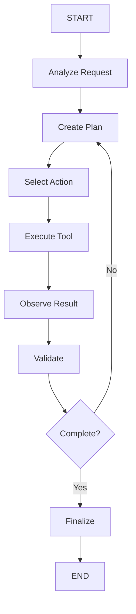

---

# 12. Planning Node

A planning node determines what should happen next.

Example:

```python
def create_plan(state):
    plan = planner.invoke(state["query"])

    return {
        "plan": plan
    }
```

The plan should be represented using a structured format where possible.

---

# 13. Structured Plan

Example:

```json
{
  "steps": [
    {
      "id": 1,
      "action": "retrieve_customer"
    },
    {
      "id": 2,
      "action": "retrieve_transactions"
    },
    {
      "id": 3,
      "action": "analyze_transactions"
    }
  ]
}
```

Structured plans are easier to:

```text
Validate
Track
Observe
Retry
Resume
```

---

# 14. Planning vs Execution

Keep:

```text
Plan
```

separate from:

```text
Execution
```

Architecture:

```text
Planner
 ↓
Plan
 ↓
Validator
 ↓
Executor
```

This makes the workflow easier to reason about.

---

# 15. Plan Validation

Never assume the generated plan is valid.

Validate:

```text
Allowed Actions
Dependencies
Required Inputs
Permissions
Risk
Maximum Steps
```

Example:

```text
LLM Plan
 ↓
Plan Validator
 ↓
Allowed?
 ├── Yes → Execute
 └── No → Reject / Re-plan
```

---

# 16. Plan Validation Architecture

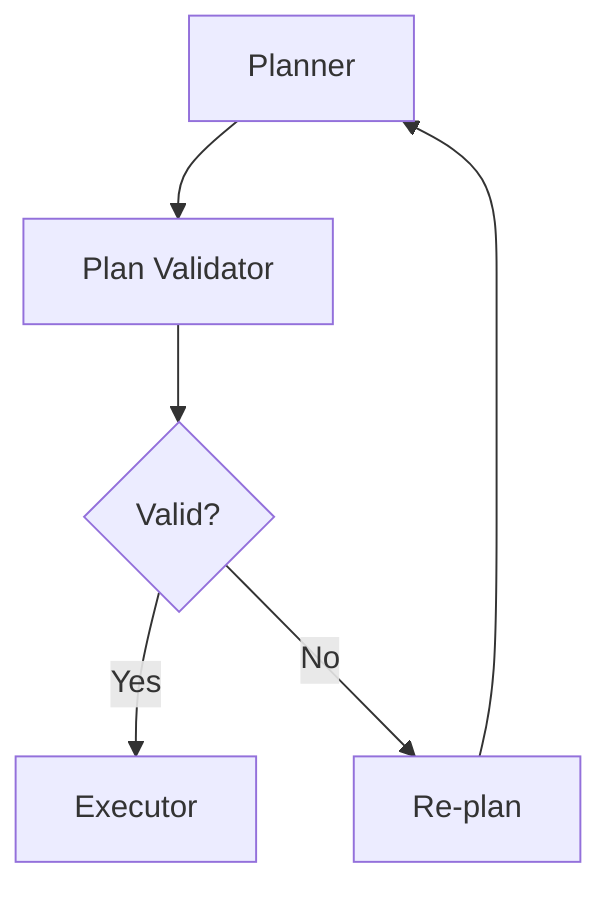

---

# 17. Execution Node

The executor performs the selected action.

```python
def execute_step(state):
    step = state["current_step"]

    result = execute_capability(step)

    return {
        "observations": [result]
    }
```

The actual implementation should include:

```text
Validation
Authorization
Timeout
Retry
Observability
```

where appropriate.

---

# 18. Observe Node

After execution, the Agent needs the result.

```text
Action
 ↓
Result
 ↓
Observation
 ↓
Reasoning
```

Example:

```text
Search Customer
 ↓
Customer Found
 ↓
Observation
 ↓
Next Decision
```

---

# 19. Observe and Update State

```python
def observe(state):
    result = state["last_result"]

    return {
        "observations": state["observations"] + [result]
    }
```

The exact state update pattern depends on the application's schema.

---

# 20. Validation Node

Validation determines whether the Agent can continue.

```text
Result
 ↓
Validate
 ├── Valid → Continue
 └── Invalid → Correct / Retry
```

---

# 21. Validation Workflow

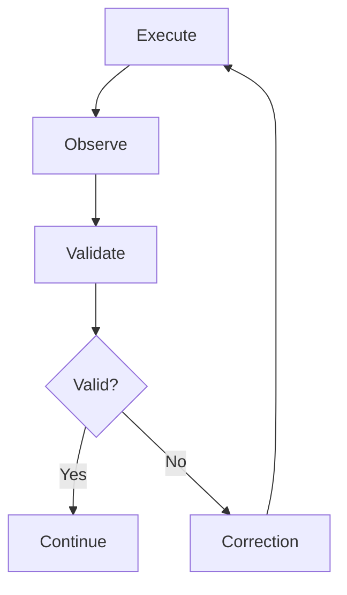

---

# 22. Re-planning

An Agent may discover that its original plan is no longer valid.

Example:

```text
Plan:
1. Get Customer
2. Get Account
3. Refund
```

But:

```text
Customer lookup fails
```

The Agent can:

```text
Observe Failure
 ↓
Re-plan
 ↓
Alternative Path
```

---

# 23. Re-planning Architecture

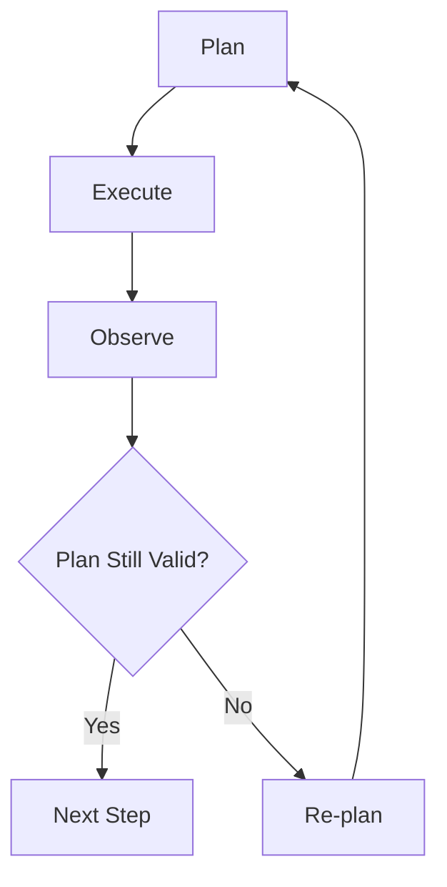

---

# 24. Re-planning Should Be Bounded

Avoid:

```text
Plan
 ↓
Fail
 ↓
Re-plan
 ↓
Fail
 ↓
Re-plan
 ↓
...
```

Use:

```text
Maximum Re-plans
+
Maximum Runtime
+
Fallback
```

---

# 25. Agent Loop

A common execution loop:

```text
Reason
 ↓
Act
 ↓
Observe
 ↓
Reason
```

Expanded:

```text
Plan
 ↓
Select Tool
 ↓
Execute Tool
 ↓
Observe
 ↓
Evaluate
 ↓
Continue / Re-plan
```

---

# 26. Agent Loop Diagram

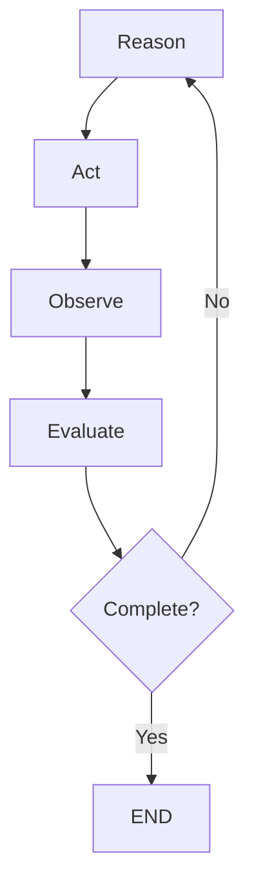

---

# 27. Termination Conditions

An Agent must have explicit stopping conditions.

Examples:

```text
Task Completed
Maximum Iterations
Maximum Tool Calls
Timeout
Budget Exhausted
Confidence Threshold
Human Escalation
Fatal Error
```

---

# 28. Termination Policy

```python
def should_stop(state):
    if state["status"] == "completed":
        return "finish"

    if state["iterations"] >= state["max_iterations"]:
        return "fallback"

    return "continue"
```

---

# 29. Maximum Iterations

A production Agent should never have an unbounded execution loop.

Example:

```text
Max Iterations = 10
```

When reached:

```text
Agent
 ↓
Fallback
```

The actual limit should be determined through evaluation and workload characteristics.

---

# 30. Runtime Budget

Agents should also have runtime limits.

```text
Execution Start
 ↓
Timer
 ↓
Agent
 ↓
Timeout?
 ├── No → Continue
 └── Yes → Stop / Escalate
```

---

# 31. Cost Budget

Agent execution can consume:

```text
LLM Tokens
Tool Calls
External APIs
Compute
Search
```

Track:

```text
Execution Cost
```

and stop or degrade gracefully when appropriate.

---

# 32. Agent Budget Architecture

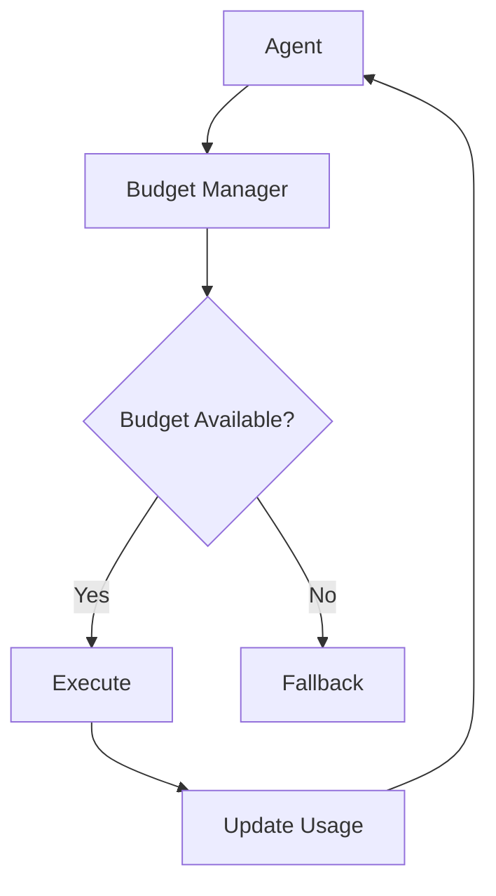

---

# 33. Tool Budget

Example:

```text
Maximum Tool Calls = 20
```

State:

```python
tool_calls_used: int
```

Before executing:

```text
Budget Check
 ↓
Tool
```

---

# 34. Token Budget

An Agent may perform multiple LLM calls.

Track:

```text
Prompt Tokens
Completion Tokens
Total Tokens
Estimated Cost
```

This helps control runaway workflows.

---

# 35. Agent Workflow With Budgets

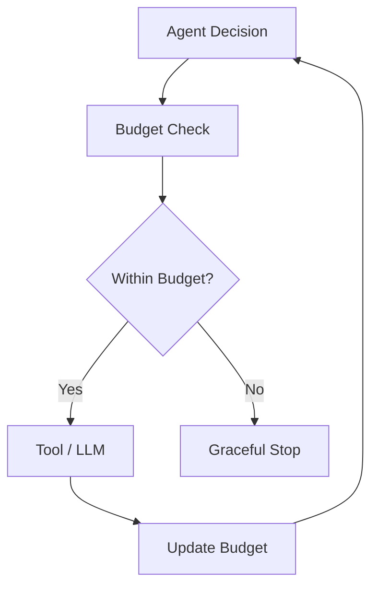

---

# 36. Human-in-the-Loop

Agent workflows can pause for human approval.

```text
Agent
 ↓
High-Risk Action
 ↓
Human Approval
 ↓
Resume
```

Example:

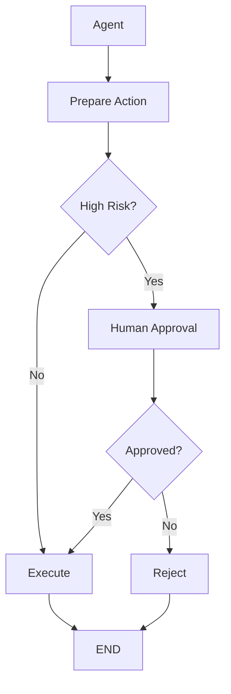

---

# 37. Long-Running Agent Workflow

Some enterprise workflows may take:

```text
Minutes
Hours
Days
```

Example:

```text
Research
 ↓
Human Review
 ↓
External Approval
 ↓
Execution
```

The workflow must support:

```text
Persistence
Pause
Resume
Recovery
Timeout
Escalation
```

---

# 38. Long-Running Architecture

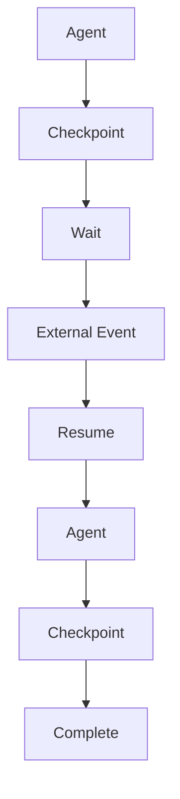

---

# 39. Durable Agent Workflow

The execution state should survive:

```text
Process Restart
Deployment
Node Failure
Network Failure
Worker Failure
```

This requires durable persistence appropriate to the application's reliability requirements.

---

# 40. Checkpointing

Checkpoints allow:

```text
Current State
+
Execution Position
```

to be persisted.

Conceptually:

```text
Node
 ↓
Checkpoint
 ↓
Next Node
```

If execution stops:

```text
Checkpoint
 ↓
Restore
 ↓
Resume
```

---

# 41. Agent Recovery

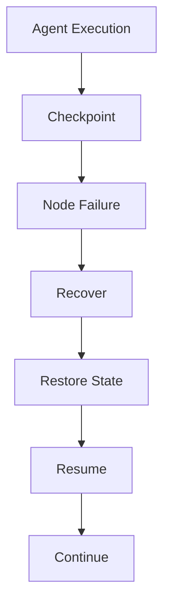

---

# 42. Failure Handling

Agent workflows should distinguish:

```text
Transient Failure
Permanent Failure
Business Failure
Policy Failure
Unknown Outcome
```

Different failures require different responses.

---

# 43. Failure Routing

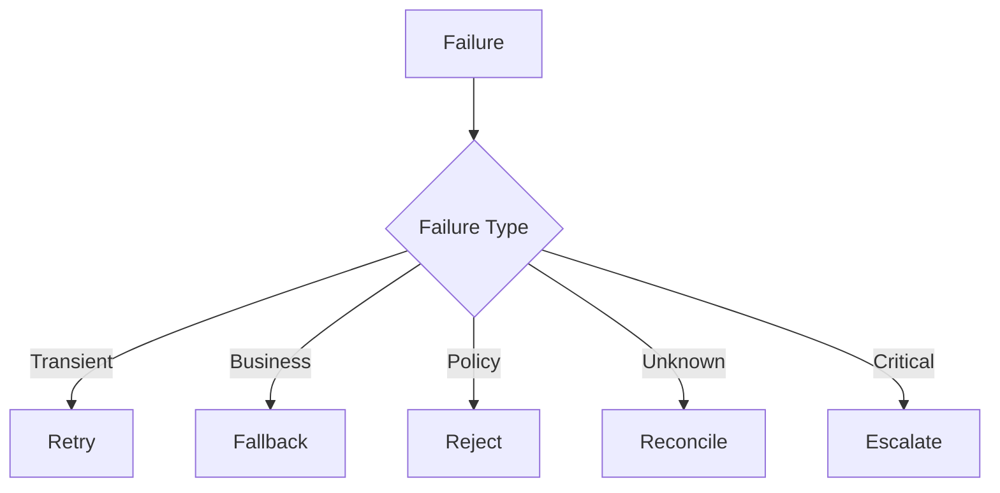

---

# 44. Retry

Retry only when appropriate.

```text
Timeout
 ↓
Retry
```

but:

```text
Unauthorized
 ↓
Reject
```

Avoid blindly retrying side-effecting operations.

---

# 45. Idempotency

Agent workflows may resume after failures.

Example:

```text
Agent
 ↓
Create Order
 ↓
Network Failure
 ↓
Resume
 ↓
Create Order Again
```

Without idempotency:

```text
Duplicate Order
```

Use:

```text
Idempotency Key
+
Tool Call Identity
+
Execution Identity
```

where appropriate.

---

# 46. Unknown Outcome

A critical production scenario:

```text
Tool Request Sent
 ↓
Network Timeout
```

The system cannot determine whether the action succeeded.

The state should be:

```text
UNKNOWN
```

rather than automatically:

```text
FAILED
```

Then:

```text
Reconcile
 ↓
Determine Actual Status
```

---

# 47. Agent Workflow Reconciliation

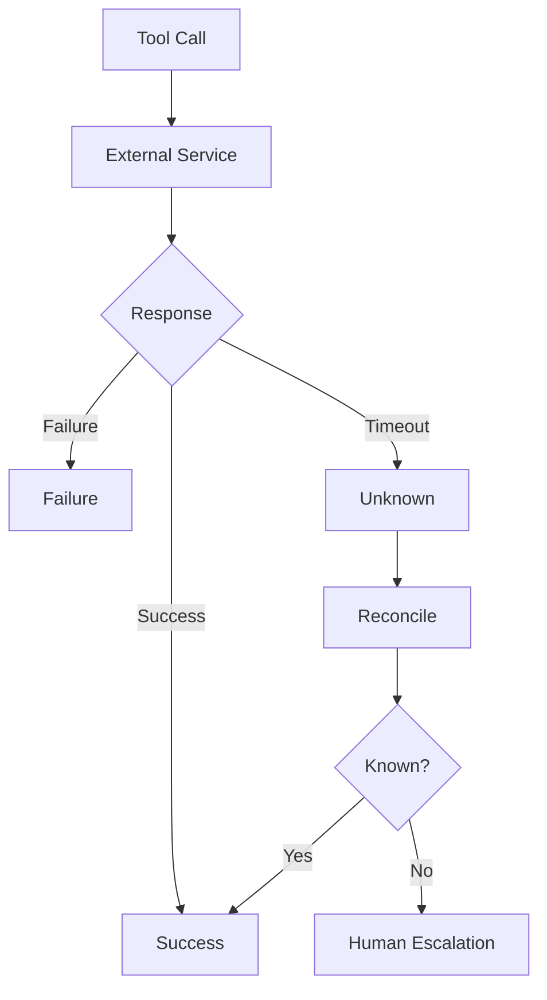

---

# 48. Agent Workflow Composition

Large Agent systems should be composed from smaller workflows.

Example:

```text
Main Agent
 ├── Research Workflow
 ├── Customer Workflow
 ├── Payment Workflow
 └── Approval Workflow
```

Each workflow can have a bounded responsibility.

---

# 49. Subgraph-Based Composition

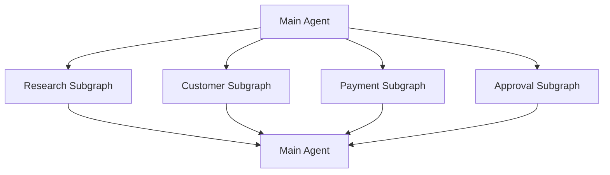

This improves:

```text
Modularity
Testing
Ownership
Observability
Reuse
```

---

# 50. Workflow Boundaries

A good workflow boundary usually represents:

```text
Business Capability
```

Examples:

```text
Customer Onboarding
Payment Processing
Research
Ticket Resolution
Document Analysis
```

Avoid creating workflows around arbitrary implementation details.

---

# 51. Agent Workflow Architecture

A production Agent can be organized into layers:

```text
┌───────────────────────────────┐
│         Agent Layer           │
│ Reasoning / Planning / Decide │
└───────────────┬───────────────┘
                ↓
┌───────────────────────────────┐
│       Workflow Layer          │
│ Nodes / Routing / State       │
└───────────────┬───────────────┘
                ↓
┌───────────────────────────────┐
│       Capability Layer        │
│ Tools / RAG / APIs            │
└───────────────┬───────────────┘
                ↓
┌───────────────────────────────┐
│      Enterprise Services      │
│ DB / APIs / Cloud / Systems   │
└───────────────────────────────┘
```

---

# 52. Deterministic Guardrails

Even when the Agent is autonomous, deterministic controls should protect important boundaries.

Examples:

```text
Maximum Amount
Allowed Tools
Allowed Tenants
Maximum Runtime
Maximum Iterations
Required Approval
Data Access Policy
```

---

# 53. Guardrail Architecture

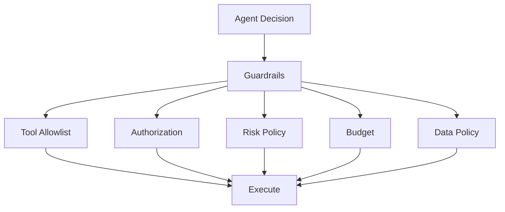

---

# 54. Agent Workflow Security

Protect against:

```text
Prompt Injection
Tool Abuse
Privilege Escalation
Data Leakage
Unauthorized Actions
Cross-Tenant Access
Runaway Execution
```

Security controls should exist outside the model's reasoning.

---

# 55. Tenant Isolation

For multi-tenant systems:

```text
Agent
 ↓
Tenant Context
 ↓
Authorization
 ↓
Tool
```

Every relevant operation should preserve tenant boundaries.

---

# 56. Agent Identity

An enterprise Agent should execute under a controlled identity.

Conceptually:

```text
User Identity
+
Agent Identity
+
Tenant Identity
```

The system can then enforce:

```text
Who requested?
Which Agent?
Which Tenant?
Which Capability?
```

---

# 57. Agent Workflow Observability

Trace:

```text
Execution
 ↓
Node
 ↓
LLM
 ↓
Tool
 ↓
Result
 ↓
Routing
 ↓
Human
 ↓
Final Result
```

---

# 58. Workflow Metrics

Track:

```text
Execution Count
Success Rate
Failure Rate
Average Duration
P95 Duration
P99 Duration
Tool Calls
LLM Calls
Token Usage
Cost
Retries
Escalations
```

---

# 59. Node-Level Metrics

For each node:

```text
Invocation Count
Latency
Failure Rate
Retry Rate
Input Size
Output Size
```

This helps identify workflow bottlenecks.

---

# 60. Agent Trace

Example:

```text
Execution: agent-1001

START
 ↓
Analyze        120ms
 ↓
Plan           450ms
 ↓
Tool           900ms
 ↓
Observe         20ms
 ↓
Validate        40ms
 ↓
Tool            700ms
 ↓
Finalize       300ms
 ↓
END
```

---

# 61. Agent Workflow Evaluation

Evaluate:

```text
Task Success
Tool Selection
Plan Quality
Execution Efficiency
Safety
Latency
Cost
Human Escalation
```

---

# 62. Workflow-Level Evaluation

A successful final answer does not necessarily mean the workflow was good.

For example:

```text
Task Success = Yes
Tool Calls = 50
Cost = High
Latency = 3 minutes
```

The system may still require optimization.

---

# 63. Agent Workflow Efficiency

Optimize:

```text
Number of LLM Calls
Number of Tool Calls
Sequential Dependencies
Context Size
Redundant Retrieval
Repeated Reasoning
```

---

# 64. Parallelization

Independent operations can run concurrently.

Example:

```text
Research
 ├── Internal Documents
 ├── Customer Database
 └── External Search
```

Then:

```text
Merge
 ↓
Reason
```

---

# 65. Parallel Agent Workflow

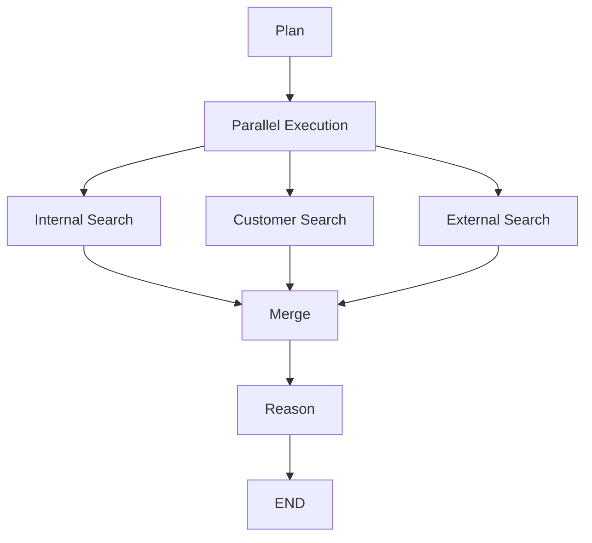

Parallel execution can reduce latency but requires careful state merge and failure handling.

---

# 66. Sequential vs Parallel

| Pattern | Advantage | Trade-off |
|---|---|---|
| Sequential | Simple | Higher latency |
| Parallel | Lower latency | More complexity |
| Conditional | Flexible | Routing complexity |
| Loop | Iterative reasoning | Runaway risk |
| Human Review | Strong oversight | Human latency |
| Subgraph | Modular | More architecture |

---

# 67. Agent Workflow Patterns

Common patterns:

```text
Sequential
Conditional
Loop
Planner-Executor
Router
Tool-Calling
Reflection
Human-in-the-Loop
Parallel Fan-Out
Fan-In
Subgraph
Retry
Fallback
```

These patterns can be combined.

---

# 68. Planner-Executor Pattern

```text
Planner
 ↓
Plan
 ↓
Executor
 ↓
Observation
 ↓
Planner
```

Diagram:

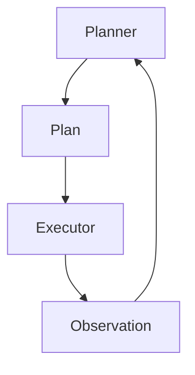

Use bounded execution.

---

# 69. Router-Agent Pattern

```text
Request
 ↓
Router
 ├── Research Agent
 ├── Support Agent
 ├── Finance Agent
 └── Human
```

---

# 70. Router-Agent Diagram

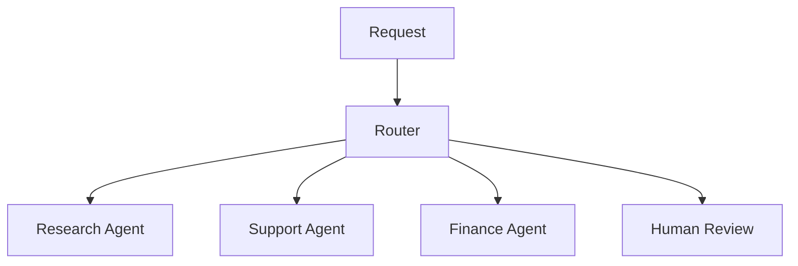

---

# 71. Reflection Workflow

A workflow can include validation and correction:

```text
Generate
 ↓
Evaluate
 ↓
Good?
 ├── Yes → END
 └── No → Correct
```

This is useful for:

```text
Code
Reports
Research
Structured Outputs
```

---

# 72. Reflection Diagram

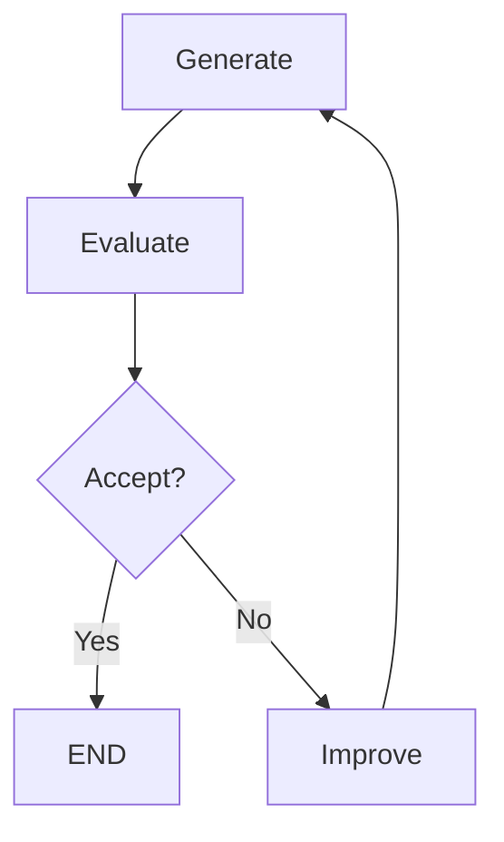

The loop must be bounded.

---

# 73. Agent Workflow + RAG

A common enterprise workflow:

```text
Request
 ↓
Router
 ↓
Retrieve
 ↓
Reason
 ↓
Tool
 ↓
Validate
 ↓
Response
```

---

# 74. RAG Agent Workflow

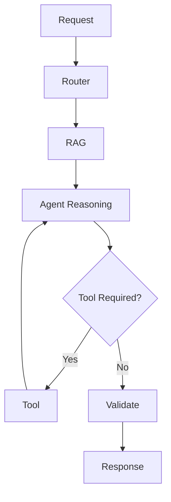

---

# 75. Agent Workflow + Human Approval

```text
Agent
 ↓
Action
 ↓
Risk
 ↓
Human
 ↓
Approve
 ↓
Tool
```

This combines:

```text
Agent Autonomy
+
Human Governance
```

---

# 76. Enterprise Agent Workflow

```mermaid
flowchart TB

    A[User] --> B[API]

    B --> C[Agent]

    C --> D[Plan]

    D --> E[Risk Policy]

    E --> F{Action Type}

    F -->|Knowledge| G[RAG]

    F -->|Tool| H[Tool Gateway]

    F -->|High Risk| I[Human Approval]

    I --> H

    G --> J[Validation]

    H --> J

    J --> K{Complete?}

    K -->|No| D

    K -->|Yes| L[Response]

    C --> M[Checkpoint]

    C --> N[Observability]

    C --> O[Audit]
```

---

# 77. Workflow Versioning

Agent workflows change over time.

Version:

```text
Workflow Definition
Prompt
Model
Tool Schema
Policy
State Schema
```

Example:

```text
customer-agent-v1
customer-agent-v2
```

This makes production changes traceable.

---

# 78. State Schema Evolution

Suppose:

```text
v1:
plan

v2:
plan
+
risk_level
```

Old checkpoints may not match the new schema.

Plan for:

```text
Migration
Compatibility
Versioning
Recovery
```

---

# 79. Deployment Strategy

For important Agent workflows:

```text
Development
 ↓
Testing
 ↓
Staging
 ↓
Canary
 ↓
Production
```

Monitor:

```text
Success
Latency
Cost
Safety
```

before full rollout.

---

# 80. Agent Workflow Rollback

If a new workflow version causes:

```text
Higher Failure
Higher Cost
Unsafe Behavior
```

you should be able to:

```text
Route New Requests
 ↓
Previous Stable Version
```

Existing long-running executions require an explicit compatibility strategy.

---

# 81. Agent Workflow Testing

Test:

```text
Happy Path
Failure Path
Retry Path
Fallback Path
Loop Path
Human Path
Timeout Path
Authorization Path
```

---

# 82. Graph Path Testing

A graph should not be tested only through its successful path.

Example:

```text
A → B → C
```

also test:

```text
A → B → D
A → E
A → B → C → A
A → B → Failure
```

This is especially important for Agent workflows.

---

# 83. Property-Based Thinking

Test invariants such as:

```text
Unauthorized tool is never executed.

High-risk action never bypasses approval.

Tenant A never accesses Tenant B.

Execution never exceeds maximum iterations.

A side-effecting operation is idempotent.

Every execution has an audit identity.
```

These are stronger than individual happy-path tests.

---

# 84. Agent Workflow Security Testing

Test:

```text
Prompt Injection
Tool Injection
Unauthorized Tool
Privilege Escalation
Cross-Tenant Access
Malicious Tool Result
Oversized Input
Runaway Loop
```

---

# 85. Production Readiness Checklist

## Architecture

- [ ] Explicit graph
- [ ] Clear node boundaries
- [ ] Clear state schema
- [ ] Deterministic routing where appropriate
- [ ] Bounded loops
- [ ] Explicit termination

## Agent

- [ ] Planning
- [ ] Reasoning
- [ ] Tool execution
- [ ] Observation
- [ ] Validation
- [ ] Re-planning

## Reliability

- [ ] Checkpointing
- [ ] Retry
- [ ] Timeout
- [ ] Idempotency
- [ ] Reconciliation
- [ ] Recovery

## Security

- [ ] Authentication
- [ ] Authorization
- [ ] Tool allowlist
- [ ] Tenant isolation
- [ ] Data controls
- [ ] Guardrails

## HITL

- [ ] Risk-based escalation
- [ ] Approval
- [ ] Rejection
- [ ] Modification
- [ ] Timeout
- [ ] Audit

## Operations

- [ ] Tracing
- [ ] Metrics
- [ ] Cost tracking
- [ ] Alerts
- [ ] Workflow versioning
- [ ] Deployment strategy

---

# 86. Key Takeaways

- LangGraph provides an explicit graph model for Agent workflows.
- Agent workflows combine LLM reasoning with deterministic execution control.
- State provides shared context between nodes.
- Nodes should have focused responsibilities.
- Planning should be separated from execution.
- Generated plans should be validated before execution.
- Tool execution should pass through validation and authorization.
- Observation allows the Agent to incorporate execution results.
- Validation determines whether the workflow can safely continue.
- Re-planning allows Agents to adapt when assumptions change.
- Every Agent loop should have bounded execution.
- Runtime, token, and tool budgets can prevent runaway behavior.
- Human approval should be introduced at appropriate risk boundaries.
- Checkpointing is important for long-running and interruptible workflows.
- Unknown external outcomes should be reconciled rather than blindly retried.
- Idempotency is essential for side-effecting operations.
- Subgraphs can encapsulate complex capabilities.
- Parallel execution can reduce latency for independent tasks.
- Deterministic guardrails should protect critical system boundaries.
- Agent workflow observability should include node, LLM, tool, routing, and human activity.
- Workflow evaluation should measure more than final answer quality.
- Production Agent workflows should be versioned and tested across multiple execution paths.
- The strongest enterprise architecture combines:

```text
LLM Intelligence
+
Graph Orchestration
+
Deterministic Controls
+
Enterprise Capabilities
+
Observability
```

---

# 📝 Quick Revision Notes

## Basic Agent Workflow

```text
Input
 ↓
Agent
 ↓
Tool
 ↓
Observation
 ↓
Agent
 ↓
Response
```

---

## Planner-Executor

```text
Planner
 ↓
Plan
 ↓
Executor
 ↓
Observe
 ↓
Planner
```

---

## Production Agent

```text
Request
 ↓
Validate
 ↓
Plan
 ↓
Policy
 ↓
Execute
 ↓
Observe
 ↓
Validate
 ↓
Complete?
 ├── No → Re-plan
 └── Yes → Response
```

---

## Bounded Agent

```text
Agent
 ↓
Budget
 ↓
Action
 ↓
Observe
 ↓
Budget
 ↓
Continue / Stop
```

---

## Reliable Agent

```text
Checkpoint
+
Timeout
+
Retry
+
Idempotency
+
Reconciliation
+
Recovery
```

---

## Secure Agent

```text
LLM
 ↓
Decision
 ↓
Validation
 ↓
Authorization
 ↓
Policy
 ↓
Tool
```

---

## Enterprise Agent

```text
User
 ↓
API
 ↓
Agent
 ↓
Graph
 ↓
Capabilities
 ↓
Enterprise Systems
```

---

# ❓ Interview Questions

## Beginner

1. What is a LangGraph Agent workflow?
2. How is an Agent workflow different from a traditional workflow?
3. What is the role of state in LangGraph?
4. What is an Agent node?
5. What is a tool node?
6. What is the Agent loop?
7. Why does an Agent need termination conditions?
8. What is re-planning?
9. What is checkpointing?
10. Why is idempotency important?

## Intermediate

11. How would you design a planner-executor Agent?
12. How would you implement an Agent loop?
13. How would you prevent infinite loops?
14. How would you implement maximum tool-call limits?
15. How would you implement runtime budgets?
16. How would you handle tool failures?
17. How would you handle unknown tool outcomes?
18. How would you integrate Human-in-the-Loop?
19. How would you design a long-running Agent?
20. How would you use subgraphs?
21. How would you parallelize independent Agent tasks?
22. How would you validate an LLM-generated plan?
23. How would you evaluate an Agent workflow?
24. How would you version an Agent workflow?

## Advanced

25. Design a production-grade LangGraph Agent architecture.
26. How would you combine deterministic workflows with LLM reasoning?
27. How would you prevent an Agent from bypassing authorization?
28. How would you design multi-tenant Agent workflows?
29. How would you recover a long-running Agent after infrastructure failure?
30. How would you handle a side-effecting tool with an unknown outcome?
31. How would you design Agent workflow state evolution?
32. How would you migrate running workflows between versions?
33. How would you implement graph path testing?
34. How would you evaluate Agent efficiency?
35. How would you prevent runaway token and tool costs?
36. How would you design risk-based Human-in-the-Loop?
37. How would you combine RAG, tools, and Agent workflows?
38. How would you design parallel execution and state merging?
39. How would you design compensation for multi-step Agent actions?
40. How would you observe thousands of concurrent Agent executions?
41. How would you secure Agent workflows against prompt injection?
42. How would you design a workflow rollback strategy?
43. How would you separate Agent reasoning from enterprise capability execution?
44. How would you design an enterprise Agent platform using LangGraph?
45. When should you use a deterministic workflow instead of an autonomous Agent?

---

# 🛠️ Practical Exercise

Build a **Customer Support Agent Workflow**.

The Agent should:

```text
1. Receive customer request
2. Classify intent
3. Create execution plan
4. Retrieve customer information
5. Search enterprise knowledge
6. Call tools when required
7. Validate tool results
8. Determine whether the task is complete
9. Re-plan when necessary
10. Escalate high-risk operations
11. Produce final response
```

Architecture:

```mermaid
flowchart TD

    A[START] --> B[Validate Request]

    B --> C[Classify Intent]

    C --> D[Create Plan]

    D --> E[Plan Validation]

    E --> F[Agent]

    F --> G{Action Required?}

    G -->|RAG| H[Knowledge Retrieval]

    G -->|Tool| I[Tool Gateway]

    G -->|Human| J[Human Approval]

    H --> K[Observe]

    I --> K

    J --> K

    K --> L[Validate]

    L --> M{Complete?}

    M -->|No| D

    M -->|Yes| N[Final Response]

    N --> O[END]
```

Add:

```text
Maximum Iterations
Maximum Tool Calls
Timeout
Checkpointing
Authorization
Audit
Observability
Fallback
```

---

# 🧪 Failure Simulation Exercise

Simulate:

```text
1. Invalid request
2. Invalid plan
3. Tool timeout
4. Tool authorization failure
5. Tool unknown outcome
6. RAG unavailable
7. LLM timeout
8. Human approval timeout
9. State checkpoint failure
10. Maximum iteration exceeded
11. Budget exceeded
12. Process restart
```

For every failure define:

```text
Detection
 ↓
State
 ↓
Routing
 ↓
Recovery
 ↓
Final Outcome
```

---

# 🚀 Advanced Agent Workflow Exercise

Build a **Research Agent**.

Requirements:

```text
User Question
 ↓
Planner
 ↓
Parallel Research
 ├── Internal RAG
 ├── External Search
 └── Database
 ↓
Merge
 ↓
Reason
 ↓
Evidence Validation
 ↓
Gap Detection
 ↓
Re-plan if Required
 ↓
Generate Report
 ↓
Human Review
 ↓
Final Report
```

Architecture:

```mermaid
flowchart TD

    A[Question] --> B[Planner]

    B --> C[Parallel Research]

    C --> D[Internal RAG]

    C --> E[External Search]

    C --> F[Database]

    D --> G[Merge Evidence]

    E --> G

    F --> G

    G --> H[Reason]

    H --> I[Evidence Validation]

    I --> J{Evidence Sufficient?}

    J -->|No| B

    J -->|Yes| K[Generate Report]

    K --> L[Human Review]

    L --> M{Approved?}

    M -->|No| B

    M -->|Yes| N[Final Report]
```

---

# 🏢 Production Architecture Challenge

Design an enterprise Agent platform supporting:

```text
10,000+ concurrent Agent executions
100+ tools
Multiple RAG systems
Multiple LLM providers
Human approvals
Long-running workflows
Multiple tenants
```

Required capabilities:

```text
Agent Runtime
Graph Orchestration
State Management
Checkpointing
Tool Gateway
RAG
Authorization
Risk Engine
Human Review
Observability
Audit
Cost Management
Workflow Versioning
```

Architecture:

```mermaid
flowchart TB

    U[Users] --> API[API Gateway]

    API --> AUTH[Identity + Authorization]

    AUTH --> AR[Agent Runtime]

    AR --> LG[LangGraph]

    LG --> STATE[(Checkpoint Store)]

    LG --> LLM[LLM Gateway]

    LG --> RAG[RAG Platform]

    LG --> TOOLS[Tool Gateway]

    TOOLS --> POLICY[Policy Engine]

    POLICY --> SERVICES[Enterprise Services]

    LG --> HITL[Human Review]

    HITL --> LG

    LG --> OBS[Observability]

    LG --> AUDIT[Audit Platform]

    LG --> COST[Cost Management]
```

---

# 🧠 Final Architecture Challenge

Design a **Production Banking Agent** that can:

```text
1. Understand customer requests
2. Retrieve bank policies
3. Retrieve customer information
4. Plan required actions
5. Execute approved tools
6. Handle tool failures
7. Reconcile unknown outcomes
8. Request human approval for high-risk operations
9. Resume long-running workflows
10. Validate final results
11. Maintain complete audit history
```

Your design must answer:

```text
Where does state live?

How is the graph resumed?

How are plans validated?

How are tools authorized?

How are high-risk actions detected?

Where does Human-in-the-Loop occur?

How are unknown outcomes reconciled?

How are loops bounded?

How are token and tool budgets enforced?

How are tenants isolated?

How are Agent executions observed?

How are workflow versions managed?

How are failures recovered?

How are side effects made idempotent?
```

---

# 📚 References & Further Reading

Recommended areas for further study:

- LangGraph Agent Workflows
- LangGraph State Management
- LangGraph Conditional Routing
- LangGraph Tool Execution
- LangGraph Checkpointing
- LangGraph Human-in-the-Loop
- LangGraph Subgraphs
- Agent Planning
- Agent Reasoning
- Planner-Executor Architecture
- Tool-Using Agents
- Workflow Orchestration
- Durable Execution
- Agent Evaluation
- Agent Observability
- Agent Security
- Agent Guardrails
- Enterprise Workflow Architecture
- Distributed Systems
- Idempotent APIs
- Saga Patterns
- Human Approval Systems

> LangGraph's graph, state, checkpointing, interrupt, tool, and execution APIs evolve over time. Verify exact APIs and behavior against the official LangGraph documentation for the version used in your project.

---

## 🧭 Chapter Navigation

⬅️ **Previous:** [22. LangGraph Tool Execution](22-langgraph-tool-execution.md)

📚 **Part VIII Index:** [AI Engineering Frameworks & Tooling](index.md)

➡️ **Next:** [24. LangGraph Memory And Persistence](24-langgraph-memory-and-persistence.md)

---

> **Enterprise AI Engineering Handbook**
>
> *Building Production-Grade Enterprise AI Systems — One Chapter at a Time.*