# 24 — LangGraph Memory and Persistence

> Understand how memory and persistence enable LangGraph Agents to maintain context, survive interruptions, resume execution, support long-running workflows, and build reliable stateful AI applications.

---

## 📖 Overview

Stateless LLM applications process each request independently:

```text
Request
   ↓
LLM
   ↓
Response
```

Production AI Agents often need to maintain information across multiple interactions and execution steps.

For example:

```text
User
 ↓
Agent
 ↓
Conversation Context
 ↓
Previous Decisions
 ↓
Tool Results
 ↓
Preferences
 ↓
Current Task State
```

LangGraph treats **state** as a central part of graph execution, while persistence allows that state to survive beyond a single invocation.

This enables:

```text
State
+
Checkpointing
+
Persistence
+
Thread Identity
+
Resume
=
Stateful Agent Execution
```

Memory and persistence are especially important for:

- Conversational Agents
- Long-running workflows
- Human-in-the-Loop systems
- Multi-step Agents
- Approval workflows
- Durable execution
- Fault recovery
- Multi-session applications

---

# 🎯 Learning Objectives

After completing this chapter, you will be able to:

- Understand memory in Agent systems
- Differentiate state, memory, and persistence
- Understand LangGraph checkpoints
- Understand threads and execution identity
- Design short-term Agent memory
- Design long-term Agent memory
- Persist Agent state
- Resume interrupted workflows
- Design memory-aware conversational Agents
- Manage memory growth
- Handle state versioning
- Design production persistence architectures
- Apply memory security and privacy controls
- Handle recovery after failures
- Understand memory trade-offs

---

# 1. Why Agents Need Memory

A stateless application:

```text
Request 1
 ↓
Response 1

Request 2
 ↓
Response 2
```

does not automatically remember Request 1.

A stateful Agent can maintain:

```text
Request 1
 ↓
State
 ↓
Request 2
 ↓
Updated State
```

---

# 2. Memory vs State

These terms are related but should not be treated as identical.

### State

State represents the information required by the current graph execution.

```text
Current Request
Current Plan
Tool Results
Current Status
```

### Memory

Memory represents information that the Agent can use beyond the immediate operation.

```text
Conversation History
User Preferences
Previous Interactions
Learned Facts
```

### Persistence

Persistence is the mechanism used to store state or memory beyond the lifetime of a process.

```text
Agent State
 ↓
Persistence
 ↓
Storage
```

---

# 3. State, Memory and Persistence

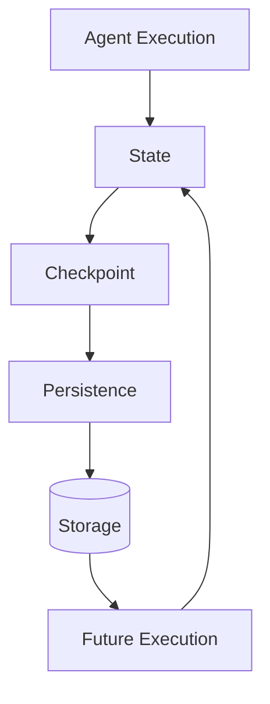

Conceptually:

```text
State
 ↓
Checkpoint
 ↓
Persist
 ↓
Restore
 ↓
Continue
```

---

# 4. Short-Term Memory

Short-term memory is information relevant to the current conversation or execution.

Examples:

```text
Current User Request
Recent Messages
Current Plan
Tool Results
Current Agent Decision
```

Example:

```text
User:
Find my recent transactions.

Agent:
Retrieves transactions.

User:
Show only failed ones.

Agent:
Uses previous context.
```

---

# 5. Long-Term Memory

Long-term memory contains information that may be useful across conversations or workflows.

Examples:

```text
User Preferences
Customer Preferences
Historical Interactions
Business Context
Persistent Facts
```

Example:

```text
User:
I prefer concise reports.

Future interaction:

Agent:
Generates a concise report.
```

---

# 6. Memory Architecture

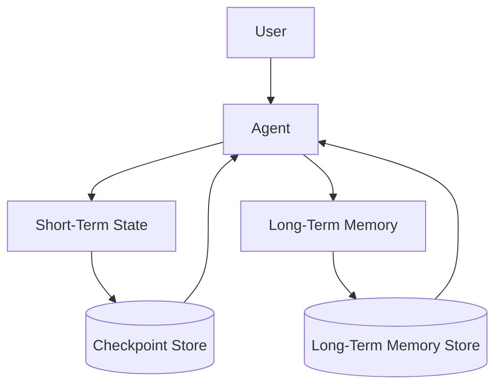

---

# 7. LangGraph State

LangGraph workflows are state-driven.

Example:

```python
from typing import TypedDict


class AgentState(TypedDict):
    messages: list
    query: str
    plan: list
    tool_results: list
    final_response: str
```

Nodes consume state and return updates.

---

# 8. State Evolution

Consider:

```text
Initial State
 ↓
query
```

After planning:

```text
query
+
plan
```

After tool execution:

```text
query
+
plan
+
tool_results
```

After completion:

```text
query
+
plan
+
tool_results
+
final_response
```

Therefore:

```text
State₀
 ↓
State₁
 ↓
State₂
 ↓
State₃
```

---

# 9. State as Execution Context

State allows different nodes to share information.

```text
Planner
 ↓
State.plan
 ↓
Executor
 ↓
State.tool_results
 ↓
Validator
```

Without shared state, each node would need another mechanism for passing context.

---

# 10. State Should Be Minimal

Do not store everything in graph state.

Prefer:

```text
Required Execution Context
```

instead of:

```text
Entire Database
Entire Conversation History
Entire API Response
```

Large state can increase:

```text
Memory Usage
Serialization Cost
Latency
Storage Cost
Context Size
```

---

# 11. State Schema

A production state schema might contain:

```python
class AgentState(TypedDict):
    messages: list
    user_id: str
    tenant_id: str
    current_step: str
    plan: list
    observations: list
    approval_status: str
    status: str
```

Only include fields that are required by the workflow.

---

# 12. State Ownership

A useful principle:

```text
Each field
 ↓
Clear Owner
 ↓
Defined Update Rules
```

For example:

```text
plan
 ↓
Planner

approval_status
 ↓
Approval Node

tool_results
 ↓
Tool Node
```

This makes state changes easier to reason about.

---

# 13. State Mutation

Prefer explicit state updates.

Conceptually:

```python
def planner(state):
    plan = create_plan(state["query"])

    return {
        "plan": plan
    }
```

Avoid uncontrolled mutation of shared state.

---

# 14. Reducers and State Updates

When multiple nodes contribute to the same field, the application may need a defined merge strategy.

Example:

```text
Node A
 ↓
Observation A

Node B
 ↓
Observation B

Merge
 ↓
Observations
```

Conceptually:

```text
Observations =
A + B
```

The exact reducer APIs depend on the LangGraph version and state schema.

---

# 15. Checkpointing

Checkpointing captures graph state during execution.

Conceptually:

```text
Node
 ↓
State
 ↓
Checkpoint
 ↓
Persistence
```

This allows execution to resume later.

---

# 16. Checkpoint Architecture

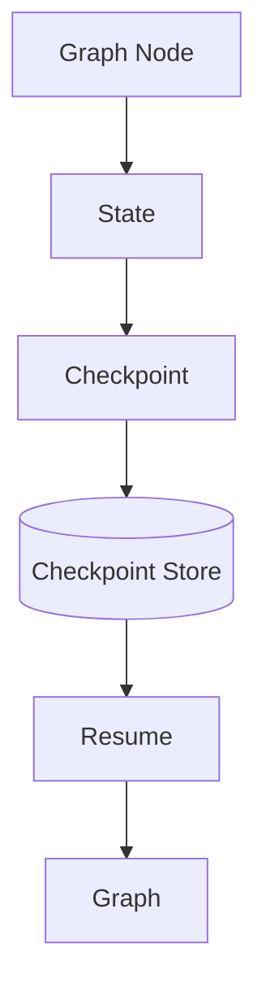

---

# 17. Why Checkpointing Matters

Without persistence:

```text
Agent
 ↓
Process Crash
 ↓
State Lost
```

With checkpointing:

```text
Agent
 ↓
Checkpoint
 ↓
Process Crash
 ↓
Restore
 ↓
Resume
```

This is critical for production workloads.

---

# 18. Persistence

Persistence means storing execution information outside the in-memory process.

Conceptually:

```text
Agent Process
 ↓
Checkpoint
 ↓
Database / Store
```

Potential persistence technologies may include:

```text
Relational Database
Key-Value Store
Document Store
Managed Persistence
```

The appropriate technology depends on reliability, scale, consistency, and operational requirements.

---

# 19. Thread Identity

Long-running Agent conversations need a way to identify an execution or conversation.

Conceptually:

```text
User
 ↓
Thread ID
 ↓
Agent State
```

Example:

```text
thread_id = "customer-123-session-456"
```

The exact identifier strategy should be application-specific.

---

# 20. Thread-Based State

```text
Thread A
 ↓
State A

Thread B
 ↓
State B
```

The states must remain isolated.

---

# 21. Thread Isolation

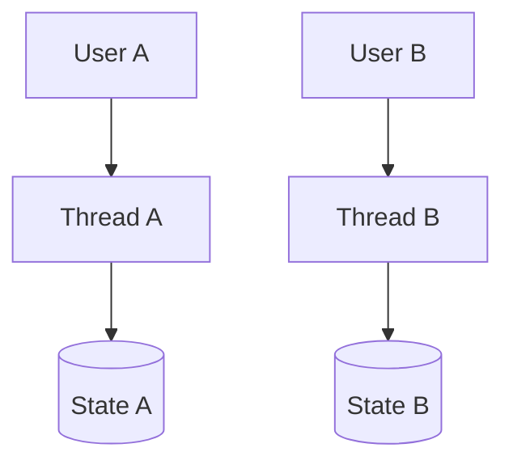

Never allow:

```text
Thread A
 ↓
Customer B Data
```

unless explicitly authorized.

---

# 22. Conversation Memory

A conversational Agent may maintain messages:

```text
User
 ↓
Message 1

Agent
 ↓
Message 2

User
 ↓
Message 3

Agent
 ↓
Message 4
```

The message history becomes part of the conversational context.

---

# 23. Conversation Memory Growth

Long conversations can become expensive.

```text
Message 1
Message 2
Message 3
...
Message 1000
```

Sending everything to the LLM can increase:

```text
Tokens
Latency
Cost
Context Pressure
```

---

# 24. Memory Management Strategies

Common approaches:

```text
Windowing
Summarization
Compaction
Selective Retrieval
Semantic Memory
Structured Memory
```

---

# 25. Sliding Window Memory

Keep only recent messages.

```text
Messages:

1 2 3 4 5 6 7 8 9 10

Keep:

6 7 8 9 10
```

This reduces context size.

---

# 26. Conversation Summarization

Instead of storing every message in the active context:

```text
100 Messages
 ↓
Summary
 ↓
Recent Messages
```

Example:

```text
Summary:
Customer is requesting a refund for transaction TX-100.
Transaction was previously reviewed.
Customer prefers email communication.
```

---

# 27. Summary + Recent Context

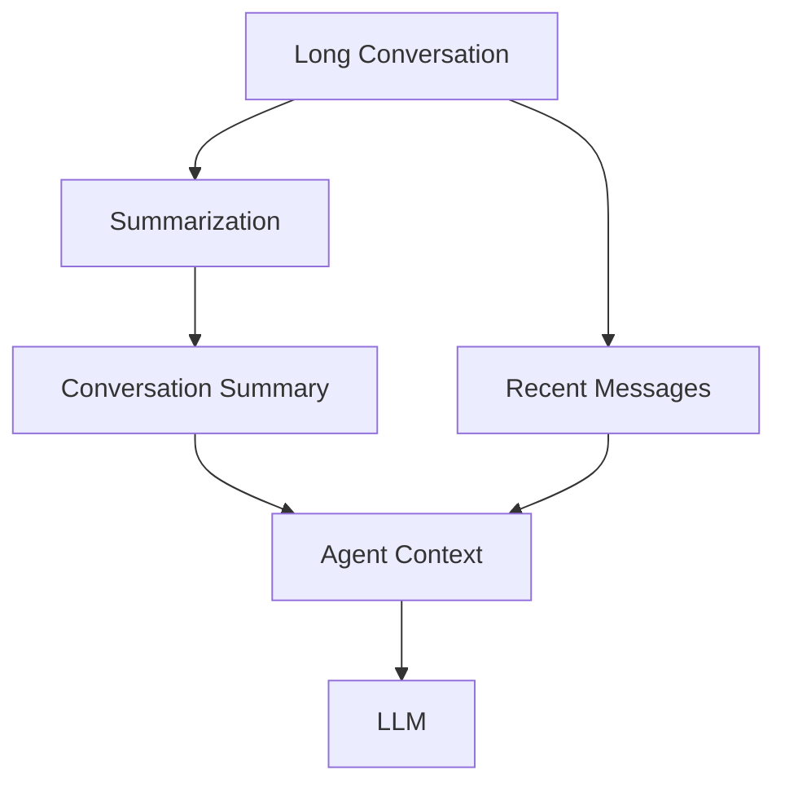

---

# 28. Structured Memory

Not all memory should be stored as natural language.

Example:

```json
{
  "preferred_language": "English",
  "communication_channel": "email",
  "report_format": "concise"
}
```

Structured memory is easier to:

```text
Validate
Query
Update
Delete
Audit
```

---

# 29. Semantic Memory

Some information is better represented as searchable knowledge.

Example:

```text
User preference
Customer history
Previous support interactions
```

A vector or search-based memory system can retrieve relevant information when needed.

---

# 30. Memory Retrieval

Instead of loading all memory:

```text
All Memories
 ↓
Retrieve Relevant Memories
 ↓
Agent Context
```

This keeps context smaller.

---

# 31. Long-Term Memory Architecture

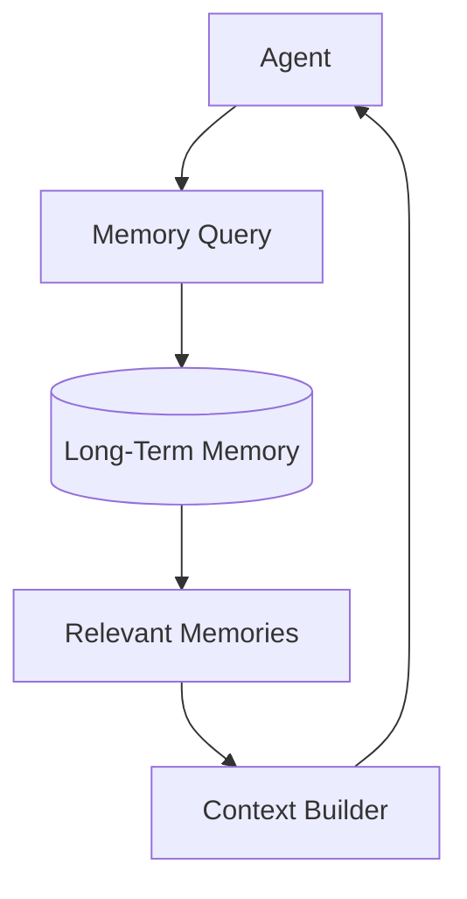

---

# 32. Memory Write Policy

Not every conversation detail should become long-term memory.

Use a policy:

```text
New Information
 ↓
Should Persist?
 ├── No → Ignore
 └── Yes → Store
```

---

# 33. Memory Write Criteria

Potential criteria:

```text
Useful Later
Stable
Relevant
Authorized
Non-Sensitive
Explicitly Provided
```

Avoid storing:

```text
Temporary
Irrelevant
Sensitive
Unverified
Ephemeral
```

information without appropriate policy.

---

# 34. Memory Read Policy

Similarly:

```text
Need Memory?
 ↓
Retrieve
 ↓
Relevant?
 ↓
Authorized?
 ↓
Use
```

Memory should not automatically be injected into every Agent execution.

---

# 35. Memory Governance

A production memory system should define:

```text
What can be stored?
Who can access it?
How long is it retained?
When can it be deleted?
Who can modify it?
How is it audited?
```

---

# 36. Memory Security

Memory can contain:

```text
PII
Financial Data
Business Data
Credentials
User Preferences
Conversation History
```

Apply:

```text
Encryption
Access Control
Tenant Isolation
Retention Policies
Audit
Data Minimization
```

---

# 37. Memory and Tenant Isolation

For multi-tenant applications:

```text
Tenant A
 ↓
Memory A

Tenant B
 ↓
Memory B
```

Memory queries must always respect tenant boundaries.

---

# 38. Memory Access Architecture

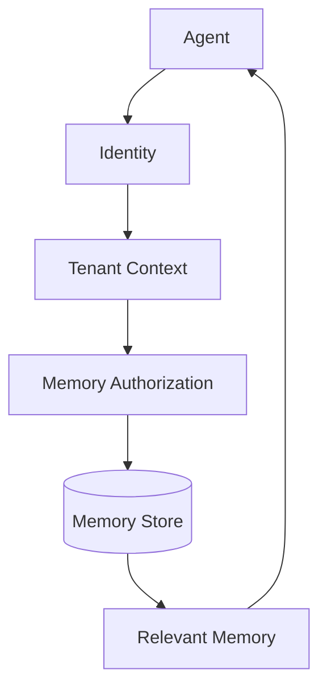

---

# 39. Memory Retention

Not all memory should live forever.

Define:

```text
Retention Period
```

Example:

```text
Session State
 → Short Retention

Customer Preferences
 → Longer Retention

Temporary Tool Result
 → Very Short Retention
```

Actual retention policies should be determined by business and regulatory requirements.

---

# 40. Memory Deletion

Users or administrators may need to remove stored memory.

Conceptually:

```text
Memory
 ↓
Delete Request
 ↓
Authorization
 ↓
Deletion
 ↓
Audit
```

Deletion requirements depend on the organization's policies and applicable regulations.

---

# 41. Memory Correction

Memory can become incorrect.

Example:

```text
Memory:
Customer prefers SMS

Customer:
"I now prefer email."
```

The memory should be updated.

```text
Old Memory
 ↓
Correction
 ↓
New Memory
```

---

# 42. Memory Conflict

Suppose:

```text
Memory A:
Customer prefers email.

Memory B:
Customer prefers phone.
```

The system needs a conflict strategy:

```text
Latest
Source Priority
Confidence
Explicit User Preference
Human Override
```

Do not blindly merge conflicting memories.

---

# 43. Memory Provenance

Store information about where a memory came from.

Example:

```json
{
  "fact": "Customer prefers email",
  "source": "user_statement",
  "timestamp": "2026-08-11",
  "confidence": 1.0
}
```

Provenance makes memory easier to:

```text
Audit
Correct
Expire
Trust
```

---

# 44. Memory Confidence

A memory may have confidence:

```text
High
Medium
Low
```

Example:

```text
Explicit user statement
 → High

Agent inference
 → Lower
```

The application should define how confidence affects retrieval and use.

---

# 45. Memory vs Knowledge Base

Do not confuse:

```text
Memory
```

with:

```text
Knowledge Base
```

### Memory

Usually:

```text
User / Session / Agent Experience
```

### Knowledge Base

Usually:

```text
Enterprise / Domain Knowledge
```

Example:

```text
Customer preference
 → Memory

Refund policy
 → Knowledge Base
```

---

# 46. Memory + RAG

A production Agent may use both:

```text
Agent
 ├── Memory
 └── RAG
```

Example:

```text
Memory
 → Customer Preferences

RAG
 → Company Policies
```

---

# 47. Memory + RAG Architecture

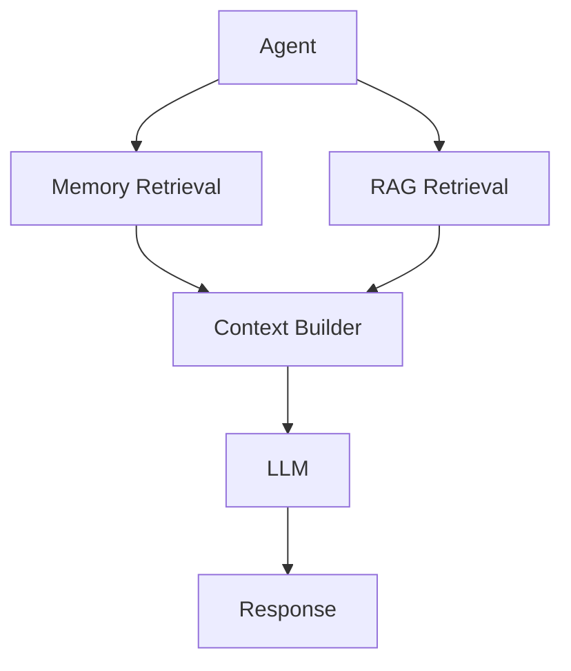

---

# 48. Persistence vs Memory

A useful distinction:

```text
Persistence
=
How state survives
```

while:

```text
Memory
=
What information the Agent can remember and use
```

Persistence is an infrastructure capability.

Memory is an application capability.

---

# 49. Durable Execution

Persistence enables durable workflows:

```text
Start
 ↓
Checkpoint
 ↓
Pause
 ↓
Resume
 ↓
Checkpoint
 ↓
Complete
```

This is especially useful for:

```text
Human Approval
External Events
Long-Running Tasks
Scheduled Work
```

---

# 50. Memory During Human Approval

Example:

```text
Agent
 ↓
Prepare Refund
 ↓
Checkpoint
 ↓
Human Approval
 ↓
Resume
```

The approval workflow needs the relevant state to remain available.

---

# 51. HITL + Persistence

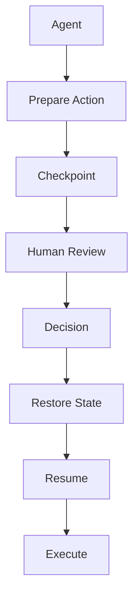

---

# 52. Memory During Agent Recovery

Suppose:

```text
Agent
 ↓
Tool A
 ↓
Checkpoint
 ↓
Process Crash
```

After recovery:

```text
Checkpoint
 ↓
Restore
 ↓
Continue
```

The Agent should not unnecessarily repeat completed work.

---

# 53. Checkpoint Frequency

More checkpoints:

```text
Better Recovery
+
More Storage
+
More Write Overhead
```

Fewer checkpoints:

```text
Lower Cost
+
Larger Recovery Window
```

Choose checkpoint strategy based on workflow requirements.

---

# 54. Checkpoint Granularity

Possible strategies:

```text
Every Node
Every Major Step
Before Side Effects
Before Human Approval
At Important State Transitions
```

High-risk workflows may require more durable boundaries.

---

# 55. Checkpoint Before Side Effects

For important operations:

```text
Prepare
 ↓
Checkpoint
 ↓
Execute
```

This provides a durable record of the intended transition.

The external operation still requires idempotency and reconciliation.

---

# 56. Persistence Storage

A production persistence layer may need:

```text
Durability
Consistency
Scalability
Availability
Encryption
Backup
Recovery
TTL
```

Possible storage categories:

```text
SQL
NoSQL
Key-Value
Managed Persistence
Object Storage
```

The correct choice depends on workload requirements.

---

# 57. Persistence Architecture

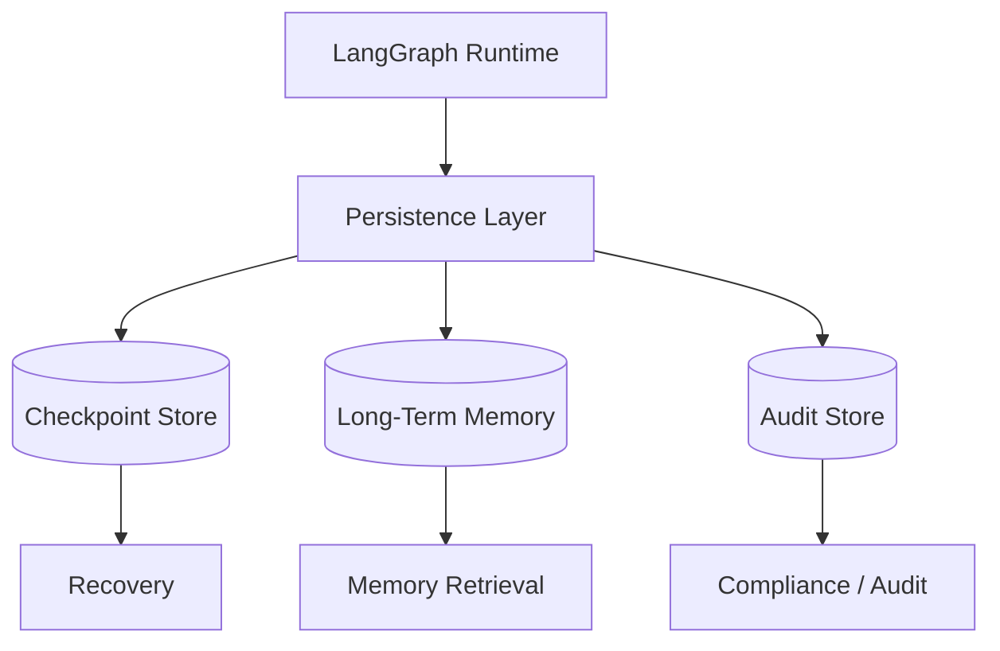

---

# 58. State Serialization

Checkpointed state must be serializable.

Avoid putting:

```text
Open Socket
Database Connection
File Handle
Thread Object
Runtime Object
```

directly into persistent Agent state.

Prefer:

```text
IDs
Structured Data
References
Serializable Results
```

---

# 59. State Size

Large state increases:

```text
Storage
Serialization
Network Transfer
Recovery Time
Latency
```

Prefer storing:

```text
Reference ID
```

instead of:

```text
Huge Payload
```

when possible.

Example:

```text
document_id = "DOC-1001"
```

rather than embedding the entire document in every checkpoint.

---

# 60. External State References

```text
Agent State
 ├── document_id
 ├── customer_id
 └── transaction_id

External Stores
 ├── Document Store
 ├── Customer DB
 └── Transaction DB
```

This keeps graph state manageable.

---

# 61. State Snapshot

A checkpoint can conceptually represent:

```text
Execution ID
Thread ID
Node
State
Timestamp
Version
```

Example:

```json
{
  "execution_id": "exec-100",
  "thread_id": "thread-101",
  "node": "tool_execution",
  "state_version": "v3",
  "timestamp": "2026-08-11T10:30:00Z"
}
```

---

# 62. State Versioning

Agent state schemas evolve.

Example:

```text
v1
 ├── query
 └── result

v2
 ├── query
 ├── plan
 └── result
```

Older checkpoints may need migration or compatibility handling.

---

# 63. State Migration

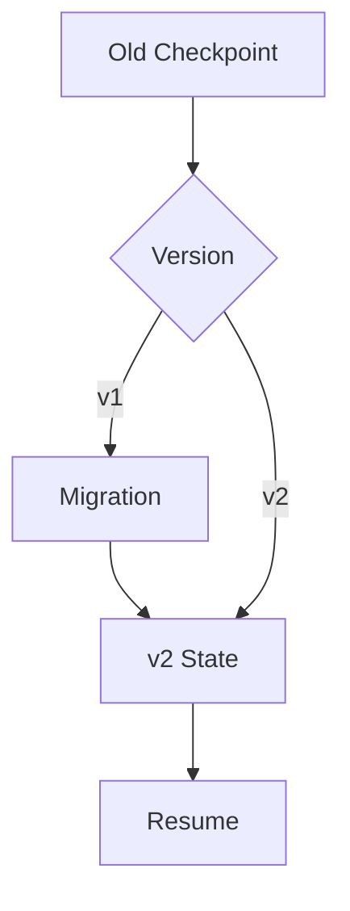

---

# 64. Workflow Version + State Version

Track both:

```text
Workflow Version
+
State Version
```

Example:

```text
workflow = customer-agent-v4
state = schema-v3
```

This improves recovery and debugging.

---

# 65. Memory Versioning

Long-term memories can also evolve.

Example:

```text
Memory Schema v1
 ↓
Memory Schema v2
```

Migration may be required when changing:

```text
Fields
Types
Metadata
Storage Model
```

---

# 66. Memory Lifecycle

A useful lifecycle:

```text
Capture
 ↓
Validate
 ↓
Store
 ↓
Retrieve
 ↓
Use
 ↓
Update
 ↓
Expire
 ↓
Delete
```

---

# 67. Memory Lifecycle Architecture

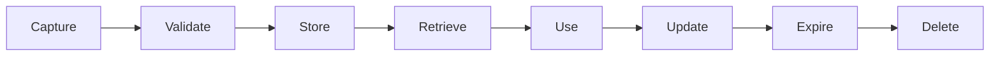

---

# 68. Memory Write Pipeline

```text
Agent Interaction
 ↓
Memory Candidate
 ↓
Validation
 ↓
Policy
 ↓
Store
```

---

# 69. Memory Read Pipeline

```text
Agent Request
 ↓
Memory Query
 ↓
Authorization
 ↓
Relevance
 ↓
Data Filtering
 ↓
Agent Context
```

---

# 70. Memory Write vs Read

Keep these policies separate.

```text
WRITE POLICY
 ↓
What may be stored?

READ POLICY
 ↓
What may be retrieved?
```

This gives stronger governance.

---

# 71. Memory Compression

Long-term memory can grow indefinitely.

Use:

```text
Summarization
Deduplication
Compaction
Expiration
Archival
```

---

# 72. Memory Deduplication

Example:

```text
Customer prefers email
Customer prefers email
Customer prefers email
```

Store:

```text
Customer prefers email
```

with metadata:

```text
Sources
Last Updated
Confidence
```

---

# 73. Memory Compaction

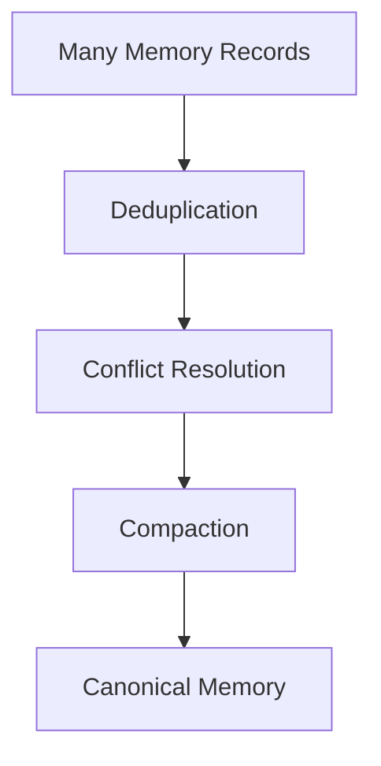

---

# 74. Memory Retrieval Ranking

If many memories match:

```text
Memory 1
Memory 2
Memory 3
...
```

rank based on:

```text
Relevance
Recency
Confidence
Importance
Source
```

---

# 75. Recency

Recent memory may be more useful.

Example:

```text
Old preference:
SMS

Recent preference:
Email
```

The latest explicit preference may deserve higher priority.

---

# 76. Importance

Some memories may be more important than others.

```text
Preferred language
 → High

Temporary request
 → Low
```

Use application-specific importance rules.

---

# 77. Memory Retrieval Architecture

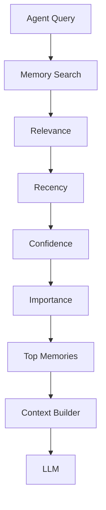

---

# 78. Memory and Context Windows

Memory does not mean sending all stored information to the model.

Instead:

```text
Large Memory Store
 ↓
Relevant Retrieval
 ↓
Small Context
 ↓
LLM
```

This is critical for scalability.

---

# 79. Memory and Cost

More memory in prompts means:

```text
More Tokens
 ↓
Higher Cost
 ↓
Higher Latency
```

Therefore memory retrieval should be selective.

---

# 80. Memory and Personalization

Memory can support:

```text
Preferences
Communication Style
Repeated Tasks
Known Context
Workflow History
```

But personalization must respect:

```text
Consent
Privacy
Access Control
Retention
```

---

# 81. Memory and Sensitive Data

Avoid storing sensitive information unnecessarily.

Examples:

```text
Passwords
Access Tokens
Secrets
Payment Credentials
Private Keys
```

These should generally be managed through dedicated secure systems rather than Agent memory.

---

# 82. Secrets vs Memory

Use:

```text
Secret Manager
```

for:

```text
API Keys
Passwords
Tokens
Certificates
```

Use:

```text
Memory
```

for appropriate contextual information.

Never use Agent memory as a substitute for a secrets-management system.

---

# 83. Memory Injection Risks

Stored memory can influence future Agent behavior.

If malicious content is stored:

```text
Malicious Memory
 ↓
Future Retrieval
 ↓
Agent
```

the Agent could be manipulated.

Therefore memory writes should be treated as a security boundary.

---

# 84. Memory Security Pipeline

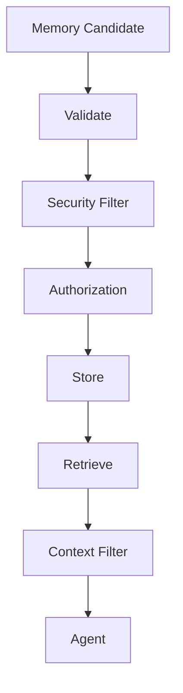

---

# 85. Memory Provenance and Trust

For each memory, consider:

```text
Source
Timestamp
Confidence
Author
Tenant
Classification
```

This helps prevent low-trust information from becoming authoritative.

---

# 86. Memory Audit

Track:

```text
Memory Created
Memory Read
Memory Updated
Memory Deleted
```

For sensitive applications:

```text
Who
What
When
Why
```

should be auditable according to organizational policy.

---

# 87. Memory Access Logging

Example:

```text
Memory Read

User: U-100
Tenant: T-20
Agent: SupportAgent
Memory ID: M-200
Purpose: Customer Support
Timestamp: ...
```

Avoid logging the sensitive memory content itself unless necessary and permitted.

---

# 88. Memory Availability

If the memory store becomes unavailable:

```text
Agent
 ↓
Memory
 ↓
Unavailable
```

The application should define:

```text
Fail Open?
Fail Closed?
Degrade Gracefully?
Use Session State Only?
```

For security-sensitive data, failing closed may be appropriate.

---

# 89. Memory Failure Strategy

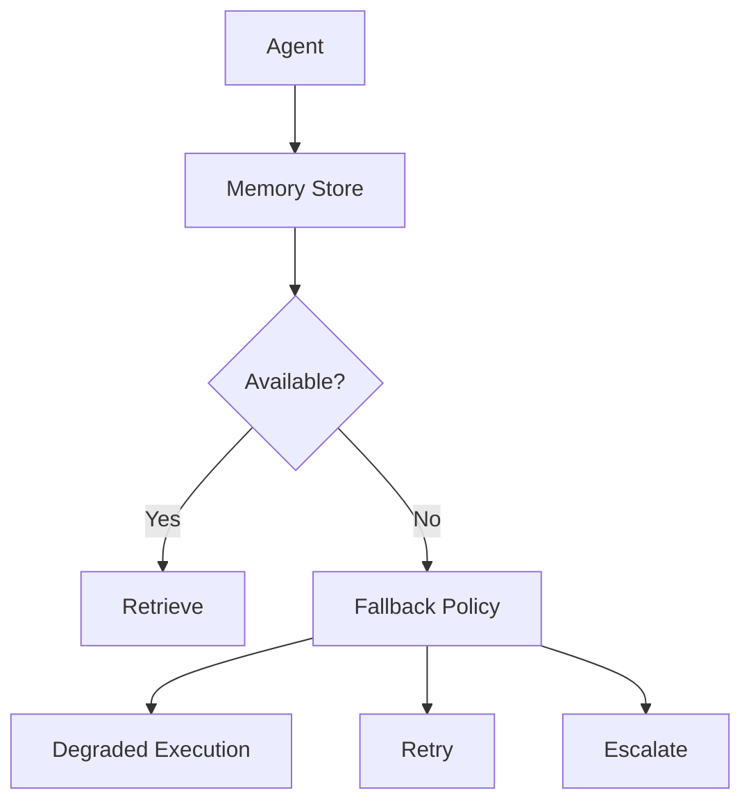

---

# 90. Persistence Failure

If checkpoint storage fails:

```text
Agent
 ↓
Checkpoint
 ↓
Storage Failure
```

For critical workflows:

```text
Do Not Continue Blindly
```

The application should determine whether execution can safely proceed without durable state.

---

# 91. Recovery Strategy

A robust system should define:

```text
Checkpoint Failure
 ↓
Retry
 ↓
Fallback
 ↓
Stop / Escalate
```

depending on workflow criticality.

---

# 92. Memory Backup

Production memory stores may require:

```text
Backup
Replication
Disaster Recovery
Restore Testing
```

Memory may contain important business context and should be treated according to its data classification.

---

# 93. Persistence High Availability

For critical workloads:

```text
Agent Runtime
 ↓
Persistence Layer
 ↓
Replicated Storage
```

Avoid making a single persistence instance the only recovery path.

---

# 94. Multi-Region Considerations

Global applications may require:

```text
Region A
 ↓
Memory / Checkpoints

Region B
 ↓
Memory / Checkpoints
```

Consider:

```text
Replication
Consistency
Latency
Data Residency
Failover
```

---

# 95. Memory Data Residency

Some enterprise data may need to remain within specific jurisdictions.

Therefore memory architecture should consider:

```text
Tenant Region
Data Classification
Regulatory Requirements
Storage Location
Backup Location
```

---

# 96. Memory Architecture for Enterprise Agents

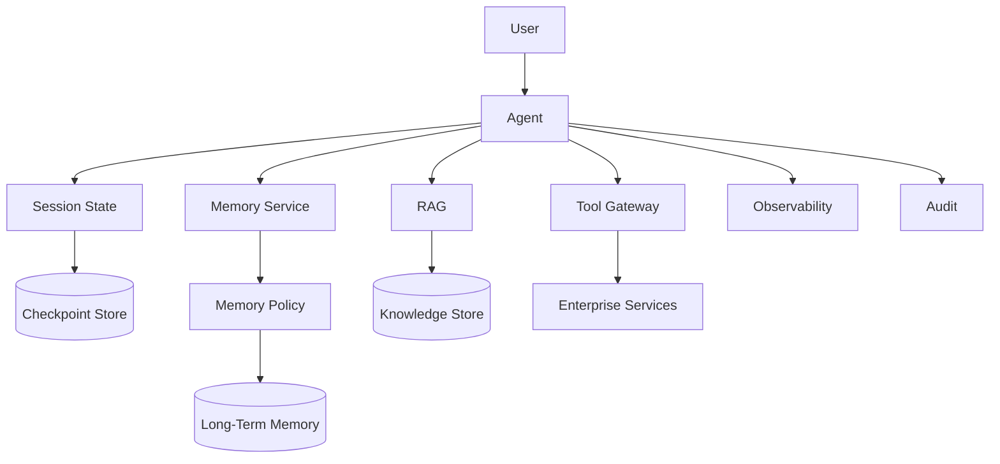

---

# 97. Memory Service

For larger platforms, memory can be exposed as a dedicated capability:

```text
Agent
 ↓
Memory Service
```

The service can centralize:

```text
Storage
Authorization
Retention
Search
Ranking
Audit
```

---

# 98. Memory Provider Abstraction

A framework-independent design can use:

```text
MemoryProvider
```

Example:

```java
public interface MemoryProvider {

    List<Memory> retrieve(
        String tenantId,
        String userId,
        String query
    );

    void store(
        String tenantId,
        String userId,
        Memory memory
    );
}
```

The implementation can then use different storage technologies.

---

# 99. Ports & Adapters Memory Architecture

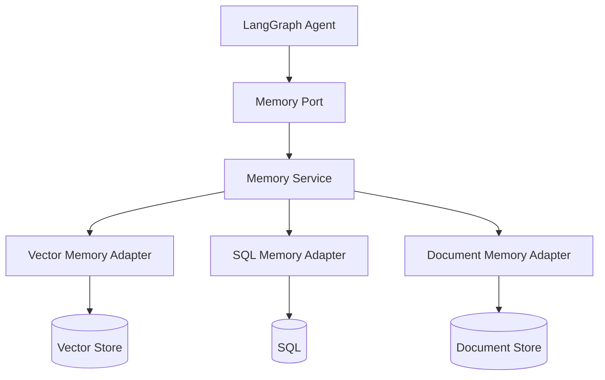

This avoids tightly coupling business logic to a particular memory technology.

---

# 100. Memory vs Checkpoint Store

These stores have different responsibilities.

### Checkpoint Store

```text
Execution State
Workflow Position
Recovery
Resume
```

### Long-Term Memory Store

```text
Persistent Knowledge
Preferences
Historical Context
```

Do not automatically treat them as the same system.

---

# 101. Example Architecture

```text
                 Agent
                   │
          ┌────────┴────────┐
          ↓                 ↓
   Checkpoint Store    Memory Service
          │                 │
          ↓                 ↓
   Execution State    Long-Term Memory
```

This separation improves architectural clarity.

---

# 102. Memory and Agent Identity

Memory should be scoped appropriately.

Possible scopes:

```text
Session
Thread
User
Customer
Tenant
Organization
Agent
```

Define the scope explicitly.

---

# 103. Memory Scope

Example:

```text
Session Memory
 ↓
One Conversation

User Memory
 ↓
Multiple Conversations

Tenant Memory
 ↓
Organization Context
```

The broader the scope, the stronger the access controls required.

---

# 104. Memory Scope Architecture

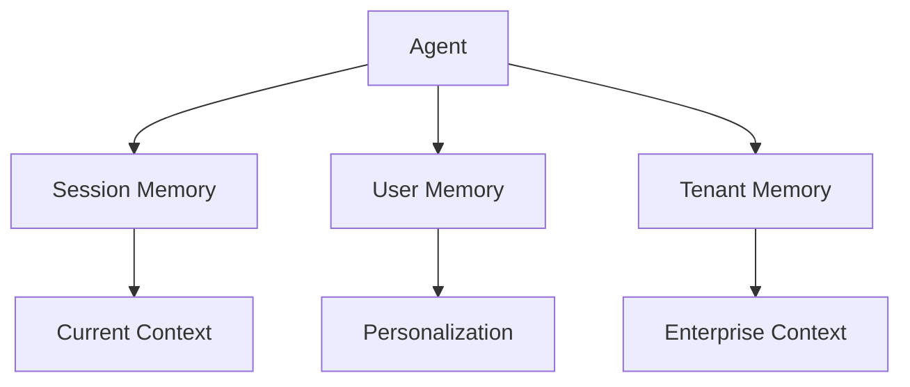

---

# 105. Cross-Agent Memory

Multiple Agents may share memory.

Example:

```text
Customer Agent
        ↓
     Memory
        ↑
Finance Agent
```

This can improve coordination but introduces:

```text
Authorization
Ownership
Consistency
Data Leakage
```

risks.

---

# 106. Shared Memory

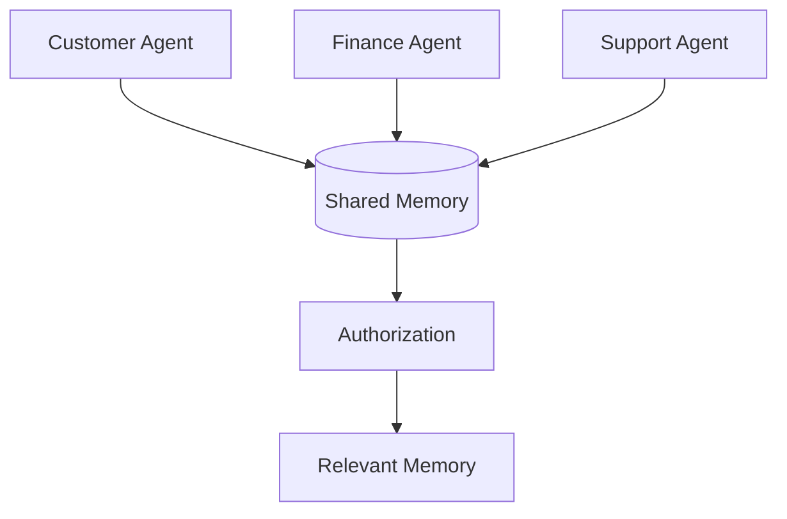

Shared memory should not imply unrestricted access.

---

# 107. Memory Consistency

If multiple Agents update the same memory:

```text
Agent A
 ↓
Memory Update

Agent B
 ↓
Memory Update
```

you may need:

```text
Versioning
Optimistic Locking
Conflict Resolution
Event Ordering
```

depending on the workload.

---

# 108. Concurrent Memory Updates

```mermaid
flowchart TD

    A[Agent A] --> B[Memory Update]

    C[Agent B] --> D[Memory Update]

    B --> E[(Memory Store)]

    D --> E

    E --> F[Conflict Detection]

    F --> G[Resolution]
```

---

# 109. Memory Event Model

Another approach is:

```text
Agent Event
 ↓
Memory Event
 ↓
Memory Processor
 ↓
Canonical Memory
```

This can improve auditability and asynchronous processing.

---

# 110. Event-Driven Memory

```mermaid
flowchart LR

    A[Agent] --> B[Memory Event]

    B --> C[Event Bus]

    C --> D[Memory Processor]

    D --> E[(Memory Store)]
```

This is useful when memory updates do not need to block Agent execution.

---

# 111. Memory Write Asynchronous Pattern

```text
Agent
 ↓
Response
```

while:

```text
Memory Event
 ↓
Async Processor
 ↓
Memory Store
```

This can reduce latency.

However, the application must tolerate eventual consistency.

---

# 112. Memory Consistency Trade-Off

### Synchronous

```text
Agent
 ↓
Store Memory
 ↓
Continue
```

Pros:

```text
Immediate Availability
```

Cons:

```text
Higher Latency
```

### Asynchronous

```text
Agent
 ↓
Publish Event
 ↓
Continue
```

Pros:

```text
Lower Latency
```

Cons:

```text
Eventual Consistency
```

---

# 113. Choosing Memory Strategy

| Requirement | Recommended Approach |
|---|---|
| Current execution | Graph State |
| Resume after failure | Checkpoint |
| Conversation context | Short-term memory |
| User preferences | Long-term memory |
| Enterprise knowledge | RAG |
| Secrets | Secret Manager |
| Large documents | External storage |
| Audit | Audit Store |

---

# 114. Common Memory Anti-Patterns

## Anti-Pattern 1 — Store Everything

```text
Every Message
Every API Response
Every Tool Result
Every Thought
```

Problems:

```text
Large State
High Cost
Privacy Risk
Poor Retrieval
```

---

# 115. Anti-Pattern 2 — Treat Memory as Truth

Memory can become:

```text
Stale
Incorrect
Conflicting
Outdated
```

Always consider:

```text
Source
Timestamp
Confidence
```

---

# 116. Anti-Pattern 3 — Store Secrets in Memory

Do not store:

```text
Passwords
API Keys
Tokens
Private Keys
```

Use a dedicated secrets-management system.

---

# 117. Anti-Pattern 4 — No Tenant Boundary

```text
Tenant A
 ↓
Shared Memory
 ↓
Tenant B
```

without authorization is a serious data isolation problem.

---

# 118. Anti-Pattern 5 — Unlimited Conversation History

```text
Message 1
Message 2
...
Message 10,000
```

will eventually become:

```text
Expensive
Slow
Context-Heavy
```

Use compaction and retrieval.

---

# 119. Anti-Pattern 6 — Memory Without Deletion

Persistent memory needs:

```text
Retention
Expiration
Deletion
Correction
```

---

# 120. Anti-Pattern 7 — Confusing Checkpoints and Memory

```text
Checkpoint
≠
Long-Term Memory
```

Checkpointing supports:

```text
Execution Recovery
```

Memory supports:

```text
Future Context
```

---

# 121. Anti-Pattern 8 — No Memory Provenance

Without provenance:

```text
Where did this fact come from?
```

becomes difficult to answer.

Use:

```text
Source
Timestamp
Confidence
```

where appropriate.

---

# 122. Production Checklist

## State

- [ ] Explicit state schema
- [ ] Minimal state
- [ ] Serializable state
- [ ] Clear ownership
- [ ] Versioning

## Persistence

- [ ] Checkpointing
- [ ] Durable storage
- [ ] Recovery
- [ ] Backup
- [ ] High availability

## Memory

- [ ] Short-term memory
- [ ] Long-term memory
- [ ] Memory scope
- [ ] Retrieval policy
- [ ] Write policy
- [ ] Retention

## Security

- [ ] Authentication
- [ ] Authorization
- [ ] Tenant isolation
- [ ] Encryption
- [ ] Data minimization
- [ ] Secret separation
- [ ] Audit

## Operations

- [ ] Memory metrics
- [ ] Checkpoint metrics
- [ ] Storage monitoring
- [ ] Cost monitoring
- [ ] Failure alerts
- [ ] Recovery testing

---

# 123. Key Takeaways

- LangGraph Agent workflows are state-driven.
- State represents information required by the current execution.
- Memory represents information that can be reused beyond the immediate step.
- Persistence allows state to survive process boundaries.
- Checkpoints enable recovery and resume.
- Thread identity helps isolate conversational or workflow state.
- Short-term memory supports current conversations and execution context.
- Long-term memory supports persistent preferences and historical context.
- Memory should be selectively written and retrieved.
- Not every interaction should become long-term memory.
- Memory should have explicit scope.
- Tenant isolation is essential for enterprise memory.
- Memory should have retention and deletion policies.
- Memory provenance helps identify where information originated.
- Memory can become stale or contradictory.
- Checkpoint storage and long-term memory storage have different responsibilities.
- Large state should be avoided when external references are sufficient.
- Long conversations require compaction, summarization, or selective retrieval.
- Sensitive secrets should never be treated as ordinary Agent memory.
- Memory retrieval should be authorization-aware.
- Persistence failures require explicit recovery strategies.
- State and memory schemas may need versioning.
- Production memory systems require observability, security, governance, and recovery.
- A robust architecture separates:

```text
Graph State
+
Checkpoint Persistence
+
Long-Term Memory
+
Knowledge Retrieval
+
Secure Enterprise Data
```

---

# 📝 Quick Revision Notes

## State

```text
Current Execution
 ↓
State
 ↓
Next Node
```

---

## Checkpoint

```text
State
 ↓
Checkpoint
 ↓
Persistent Store
 ↓
Recovery
```

---

## Short-Term Memory

```text
Current Conversation
+
Current Execution
```

---

## Long-Term Memory

```text
User
+
Preferences
+
Historical Context
```

---

## Memory Retrieval

```text
Query
 ↓
Memory Store
 ↓
Relevant Memories
 ↓
Authorization
 ↓
Context
 ↓
LLM
```

---

## Durable Agent

```text
Agent
 ↓
Checkpoint
 ↓
Process Failure
 ↓
Restore
 ↓
Resume
```

---

## Enterprise Memory

```text
Agent
 ↓
Memory Policy
 ↓
Authorization
 ↓
Tenant Isolation
 ↓
Memory Store
 ↓
Retrieval
```

---

# ❓ Interview Questions

## Beginner

1. What is memory in an AI Agent?
2. What is the difference between state and memory?
3. What is persistence?
4. What is checkpointing?
5. Why does an Agent need state?
6. What is short-term memory?
7. What is long-term memory?
8. What is a thread?
9. Why should Agent state be serializable?
10. Why should memory be scoped?

## Intermediate

11. How does LangGraph persist Agent state?
12. How does checkpointing enable Agent recovery?
13. How would you design conversation memory?
14. How would you prevent conversation history from growing indefinitely?
15. How would you implement memory summarization?
16. How would you implement long-term memory?
17. How would you protect memory across tenants?
18. How would you handle stale memory?
19. How would you handle conflicting memories?
20. How would you implement memory deletion?
21. How would you version Agent state?
22. How would you recover an Agent after process failure?
23. How would you separate checkpoints from long-term memory?
24. How would you monitor memory usage?

## Advanced

25. Design a production-grade Agent memory architecture.
26. How would you design memory for a multi-tenant Agent platform?
27. How would you handle concurrent memory updates?
28. How would you design memory provenance?
29. How would you prevent malicious content from becoming persistent memory?
30. How would you design memory retention and deletion?
31. How would you handle state schema migration?
32. How would you handle workflow version changes while executions are running?
33. How would you design multi-region Agent memory?
34. How would you design memory for a long-running Agent?
35. How would you separate session state, user memory, tenant memory, and enterprise knowledge?
36. How would you combine Agent memory with RAG?
37. How would you control memory-related token costs?
38. How would you design asynchronous memory writes?
39. How would you handle memory-store unavailability?
40. How would you design high-availability checkpoint persistence?
41. How would you protect memory from cross-tenant data leakage?
42. How would you evaluate whether a memory should be persisted?
43. How would you design a centralized enterprise Memory Service?
44. How would you implement memory conflict resolution?
45. How would you design a secure, observable, and compliant Agent memory platform?

---

# 🛠️ Practical Exercise

Build a **Conversational Customer Support Agent** with:

```text
Short-Term State
+
Checkpointing
+
Long-Term Customer Memory
```

The Agent should support:

```text
1. User conversation
2. Customer lookup
3. Customer preferences
4. Tool execution
5. Human approval
6. Process recovery
7. Memory updates
```

Architecture:

```mermaid
flowchart TD

    A[User] --> B[Agent]

    B --> C[Thread State]

    C --> D[(Checkpoint Store)]

    B --> E[Memory Retrieval]

    E --> F[(Customer Memory)]

    B --> G[Tool Gateway]

    G --> H[Enterprise Services]

    B --> I[Human Approval]

    I --> B

    B --> J[Final Response]

    B --> K[Observability]
```

---

# 🧪 Failure Simulation Exercise

Simulate:

```text
1. Process crash
2. Checkpoint store unavailable
3. Memory store unavailable
4. Stale memory
5. Conflicting memory
6. Large conversation
7. Duplicate memory
8. Cross-tenant access attempt
9. Memory deletion request
10. State schema version mismatch
```

For every scenario define:

```text
Detection
 ↓
Policy
 ↓
Recovery
 ↓
Final Outcome
```

---

# 🚀 Advanced Memory Exercise

Build a Memory Service supporting:

```text
Session Memory
User Memory
Tenant Memory
```

Each memory record should contain:

```text
Memory ID
Tenant ID
User ID
Scope
Content
Source
Timestamp
Confidence
Importance
Expiration
Version
```

Implement:

```text
Write
Read
Update
Delete
Search
Expire
Audit
```

---

# 🏢 Production Architecture Challenge

Design an enterprise Memory Platform supporting:

```text
1 Million Users
10,000+ Concurrent Agents
Multiple Tenants
Multiple Agent Types
Long-Running Workflows
Large Conversation Histories
```

Required capabilities:

```text
Checkpointing
Session State
Long-Term Memory
Memory Retrieval
Authorization
Tenant Isolation
Retention
Deletion
Versioning
Audit
Observability
Backup
Disaster Recovery
```

Architecture:

```mermaid
flowchart TB

    A[Agent Runtime] --> B[State Manager]

    B --> C[(Checkpoint Store)]

    A --> D[Memory Service]

    D --> E[Memory Policy]

    E --> F[Authorization]

    F --> G[(Long-Term Memory)]

    A --> H[RAG Platform]

    H --> I[(Knowledge Store)]

    A --> J[Tool Gateway]

    A --> K[Observability]

    A --> L[Audit]

    C --> M[Recovery]

    G --> N[Backup / DR]
```

---

# 🧠 Final Architecture Challenge

Design a **Multi-Tenant Enterprise Agent Memory Platform**.

Requirements:

```text
1. Multiple organizations
2. Multiple users per organization
3. Multiple conversations per user
4. Long-running Agent workflows
5. Human approval
6. Agent recovery
7. Long-term customer memory
8. Enterprise RAG
9. Strict tenant isolation
10. Data retention and deletion
```

Your architecture should answer:

```text
Where is current Agent state stored?

Where are checkpoints stored?

Where is long-term memory stored?

What is the scope of each memory?

How are tenants isolated?

How are memories authorized?

How is stale memory handled?

How are conflicting memories resolved?

How are memories deleted?

How are state versions migrated?

How does an Agent recover after a process crash?

How do you prevent duplicate side effects after recovery?

How do you control memory growth?

How do you control token costs?

How do you audit memory access?

How do you handle memory-store failure?

How do you perform disaster recovery?
```

---

# 📚 References & Further Reading

Recommended areas for further study:

- LangGraph State
- LangGraph Persistence
- LangGraph Checkpointing
- LangGraph Threads
- LangGraph Durable Execution
- LangGraph Memory
- Stateful Agent Workflows
- Long-Term Agent Memory
- Conversational Memory
- Memory Retrieval
- Memory Governance
- Data Retention
- Tenant Isolation
- Agent Security
- Agent Observability
- Distributed State Management
- Durable Workflow Architecture
- Idempotent Execution
- Enterprise Data Governance

> LangGraph persistence, checkpoint, state, thread, and memory APIs evolve over time. Verify the exact APIs and behavior against the official LangGraph documentation for the version used in your project.

---

## 🧭 Chapter Navigation

⬅️ **Previous:** [23. LangGraph Agent Workflows](23-langgraph-agent-workflows.md)

📚 **Part VIII Index:** [AI Engineering Frameworks & Tooling](index.md)

➡️ **Next:** [25. LangGraph Production Patterns ](25-langgraph-production-patterns.md)

---

> **Enterprise AI Engineering Handbook**
>
> *Building Production-Grade Enterprise AI Systems — One Chapter at a Time.*