# 25 — LangGraph Production Patterns

> Learn how to transform LangGraph prototypes into reliable, secure, observable, scalable, and maintainable production-grade Agent systems using enterprise architecture, durable execution, state management, resilience, security, observability, deployment, and operational best practices.

---

## 📖 Overview

Building a LangGraph Agent that works locally is only the beginning.

Production Agent systems must operate reliably under:

```text
High Concurrency
+
Failures
+
Long-Running Workflows
+
External Dependencies
+
Multiple Tenants
+
Security Constraints
+
Cost Constraints
+
Continuous Deployment
```

A production architecture therefore needs much more than:

```text
LLM
 ↓
Graph
 ↓
Tools
```

Instead:

```text
                    ┌─────────────────────┐
                    │       Clients       │
                    └──────────┬──────────┘
                               ↓
                    ┌─────────────────────┐
                    │     API Gateway     │
                    └──────────┬──────────┘
                               ↓
                    ┌─────────────────────┐
                    │   Agent Runtime     │
                    │     LangGraph       │
                    └──────────┬──────────┘
                               ↓
          ┌────────────────────┼────────────────────┐
          ↓                    ↓                    ↓
     State Store          Tool Gateway         LLM Gateway
          ↓                    ↓                    ↓
      Checkpoints         Enterprise APIs      Model Providers
          ↓                    ↓
       Recovery            External Systems
                              
          ┌────────────────────┼────────────────────┐
          ↓                    ↓                    ↓
    Observability           Security              Audit
          ↓                    ↓                    ↓
       Metrics              Policy             Compliance
```

The objective is to build Agent systems that are:

```text
Reliable
Observable
Secure
Scalable
Recoverable
Cost-Controlled
Maintainable
Governed
```

---

# 🎯 Learning Objectives

After completing this chapter, you will be able to:

- Design production-grade LangGraph architectures
- Separate Agent orchestration from enterprise capabilities
- Design durable Agent execution
- Apply checkpointing and recovery strategies
- Design scalable Agent runtimes
- Handle concurrency
- Design retry and timeout policies
- Implement idempotent execution
- Handle unknown external outcomes
- Design production tool gateways
- Apply security and authorization controls
- Implement tenant isolation
- Design Agent observability
- Monitor latency, cost, and reliability
- Design deployment strategies
- Version Agent workflows
- Handle state schema evolution
- Design high-availability Agent platforms
- Apply production testing strategies
- Design operational runbooks
- Identify common production anti-patterns

---

# 1. Prototype vs Production

A prototype may look like:

```text
User
 ↓
LLM
 ↓
Tool
 ↓
Response
```

A production system looks more like:

```text
User
 ↓
API Gateway
 ↓
Authentication
 ↓
Authorization
 ↓
Agent Runtime
 ↓
LangGraph
 ↓
Policy
 ↓
LLM / RAG / Tools
 ↓
State + Checkpoints
 ↓
Observability
 ↓
Audit
```

The architecture becomes significantly more important as Agent autonomy increases.

---

# 2. Production Agent Principles

A useful production mindset is:

```text
LLM
=
Probabilistic Decision Maker

Graph
=
Execution Orchestrator

Tools
=
Controlled Capabilities

State
=
Execution Context

Persistence
=
Durability

Policies
=
Deterministic Controls

Observability
=
Operational Visibility
```

---

# 3. Production Architecture

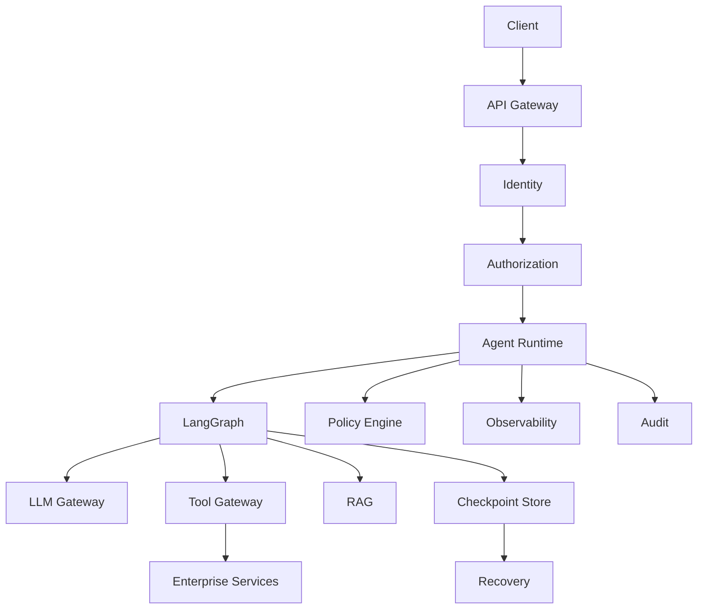

---

# 4. Separate Reasoning From Execution

Do not allow the LLM to directly control enterprise infrastructure.

Prefer:

```text
LLM
 ↓
Decision
 ↓
Graph
 ↓
Policy
 ↓
Tool
 ↓
Enterprise Service
```

instead of:

```text
LLM
 ↓
Direct Database
```

or:

```text
LLM
 ↓
Direct Cloud API
```

---

# 5. Ports & Adapters Architecture

A framework-independent architecture can use:

```text
Agent Graph
 ↓
Application Capability
 ↓
Capability Interface
 ↓
Adapter
 ↓
Enterprise Service
```

Example:

```text
LangGraph
 ↓
Payment Tool
 ↓
PaymentProvider
 ↓
AWS / Azure / Internal Adapter
 ↓
Payment Service
```

---

# 6. Production Layering

```text
┌──────────────────────────────────────┐
│             API Layer                │
├──────────────────────────────────────┤
│         Agent Orchestration          │
│              LangGraph               │
├──────────────────────────────────────┤
│          Policy / Guardrails         │
├──────────────────────────────────────┤
│        Capability / Tool Layer       │
├──────────────────────────────────────┤
│        Enterprise Services           │
├──────────────────────────────────────┤
│     Persistence / Observability      │
└──────────────────────────────────────┘
```

This reduces coupling and improves maintainability.

---

# 7. Stateless Agent Workers

Agent workers should ideally be horizontally scalable.

```text
             ┌── Worker 1
Request ─────┼── Worker 2
             ├── Worker 3
             └── Worker N
```

Persistent state should live outside the worker:

```text
Worker
 ↓
Checkpoint Store
```

This allows another worker to resume execution when necessary.

---

# 8. Horizontal Scaling

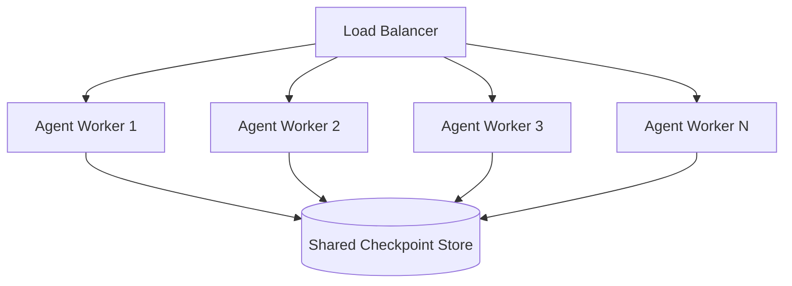

---

# 9. Scaling Considerations

Agent workloads can consume:

```text
CPU
Memory
Network
LLM Capacity
Tool Capacity
Storage
```

Scaling only the Agent runtime may not solve the bottleneck.

For example:

```text
Agent Workers ↑
        ↓
Tool Calls ↑
        ↓
Enterprise API Overloaded
```

Therefore scale the entire dependency chain.

---

# 10. Bottleneck Analysis

Monitor:

```text
Agent Runtime
LLM Provider
RAG
Vector Store
Tool Gateway
Database
External APIs
Checkpoint Store
```

A production system should identify which layer is actually limiting throughput.

---

# 11. Concurrency

Agent systems may execute many workflows simultaneously.

Example:

```text
Agent A → Tools
Agent B → Tools
Agent C → Tools
Agent D → Tools
```

Concurrency controls should exist at multiple levels:

```text
User
Tenant
Agent
Tool
Provider
Infrastructure
```

---

# 12. Concurrency Limits

Example:

```text
Tenant A
 └── Maximum 100 concurrent executions

Tool:
payment_api
 └── Maximum 20 concurrent calls
```

This protects downstream systems.

---

# 13. Backpressure

When downstream capacity is exhausted:

```text
Agent Requests
 ↓
Queue
 ↓
Controlled Processing
```

instead of:

```text
Agent Requests
 ↓
Unlimited Calls
 ↓
System Failure
```

---

# 14. Queue-Based Execution

Long-running tasks can use asynchronous execution:

```text
API
 ↓
Create Execution
 ↓
Queue
 ↓
Agent Worker
 ↓
LangGraph
```

The client can then query or subscribe to execution status.

---

# 15. Async Agent Architecture

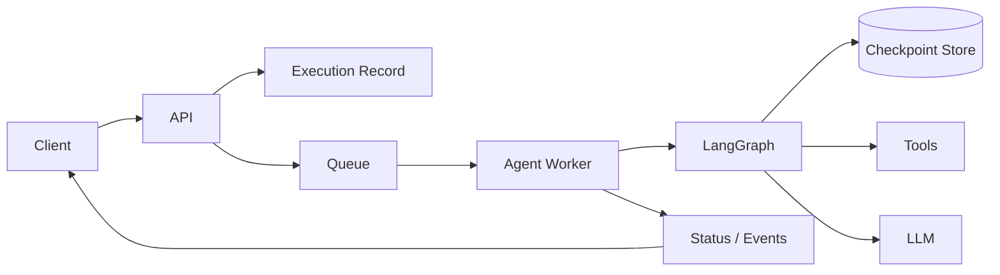

---

# 16. Synchronous vs Asynchronous Execution

| Pattern | Best For | Trade-off |
|---|---|---|
| Synchronous | Short tasks | Request timeout risk |
| Asynchronous | Long tasks | More operational complexity |
| Hybrid | Mixed workloads | Requires routing logic |

Use execution characteristics to determine the appropriate model.

---

# 17. Durable Execution

Production workflows may be interrupted by:

```text
Process Restart
Deployment
Worker Failure
Network Failure
Human Approval
External Event
```

Checkpointing allows:

```text
Save
 ↓
Pause
 ↓
Recover
 ↓
Resume
```

---

# 18. Durable Workflow Pattern

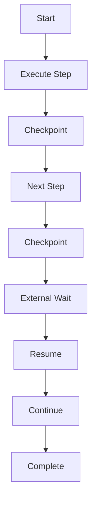

---

# 19. Checkpoint Strategy

Checkpointing too frequently can increase:

```text
Storage
Write Operations
Serialization Cost
```

Checkpointing too rarely can increase:

```text
Recovery Work
Repeated Execution
Risk of Lost Progress
```

Choose checkpoint boundaries deliberately.

---

# 20. Checkpoint Before Risky Actions

For important operations:

```text
Prepare
 ↓
Checkpoint
 ↓
Authorize
 ↓
Execute
```

This creates a durable execution boundary.

The external operation still requires idempotency and reconciliation.

---

# 21. Idempotency

Any side-effecting operation should be evaluated for idempotency.

Examples:

```text
Payment
Refund
Order Creation
Ticket Creation
Database Update
Email
```

Use:

```text
Execution ID
+
Tool Call ID
+
Idempotency Key
```

where appropriate.

---

# 22. Unknown Outcome

A critical distributed-systems scenario:

```text
Agent
 ↓
Payment API
 ↓
Request Sent
 ↓
Network Timeout
```

The result may be:

```text
UNKNOWN
```

not:

```text
FAILED
```

Blind retry can create duplicate side effects.

---

# 23. Reconciliation

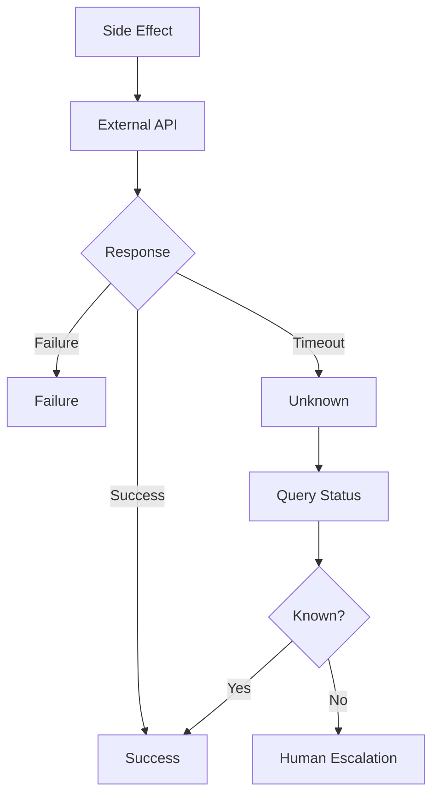

---

# 24. Retry Strategy

Retry only failures that are likely transient.

Potential candidates:

```text
Timeout
503
Temporary Network Failure
Rate Limit
```

Usually avoid automatic retries for:

```text
401
403
Invalid Input
Business Rule Violation
```

---

# 25. Exponential Backoff

A common strategy:

```text
Retry 1 → Short Delay
Retry 2 → Longer Delay
Retry 3 → Longer Delay
```

Add jitter where appropriate to avoid synchronized retry storms.

---

# 26. Circuit Breaker

If a downstream dependency is unhealthy:

```text
Agent
 ↓
Tool
 ↓
Circuit Breaker
 ↓
Service
```

The circuit can stop repeated requests when the dependency is failing.

---

# 27. Timeout Budget

Do not allow individual operations to consume the entire Agent runtime.

Example:

```text
Agent Budget = 60 seconds

LLM = 10 sec
Tool A = 5 sec
Tool B = 5 sec
RAG = 5 sec
```

The actual values must be based on workload and service-level objectives.

---

# 28. Cascading Failure

Consider:

```text
Agent Workers ↑
 ↓
Tool Calls ↑
 ↓
API Load ↑
 ↓
API Latency ↑
 ↓
Agent Timeouts ↑
 ↓
Retries ↑
 ↓
API Load ↑
```

This can create a feedback loop.

Controls include:

```text
Concurrency Limits
Timeouts
Backoff
Circuit Breakers
Queues
Budgets
```

---

# 29. Production Resilience Architecture

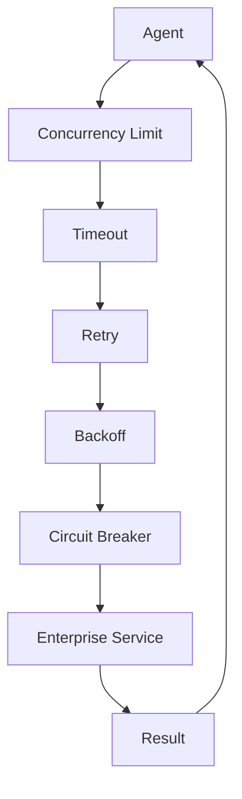

---

# 30. Agent Budget Management

An Agent may consume:

```text
LLM Tokens
Tool Calls
Execution Time
Search Requests
External API Calls
```

Define budgets:

```text
Token Budget
Tool Budget
Time Budget
Cost Budget
```

---

# 31. Budget Enforcement

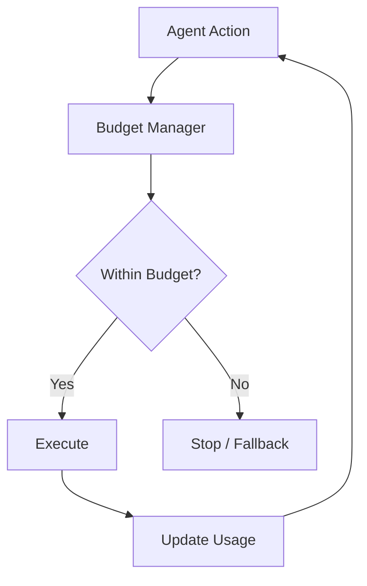

---

# 32. Cost Controls

Track:

```text
LLM Cost
Tool Cost
Search Cost
Compute Cost
Storage Cost
```

A useful metric is:

```text
Cost per Successful Task
```

rather than only:

```text
Cost per Request
```

---

# 33. Model Routing

Production systems may use different models:

```text
Simple Task
 ↓
Small / Lower-Cost Model

Complex Task
 ↓
Advanced Model
```

A model gateway can centralize:

```text
Provider Selection
Fallback
Rate Limits
Cost Controls
Observability
```

---

# 34. LLM Gateway

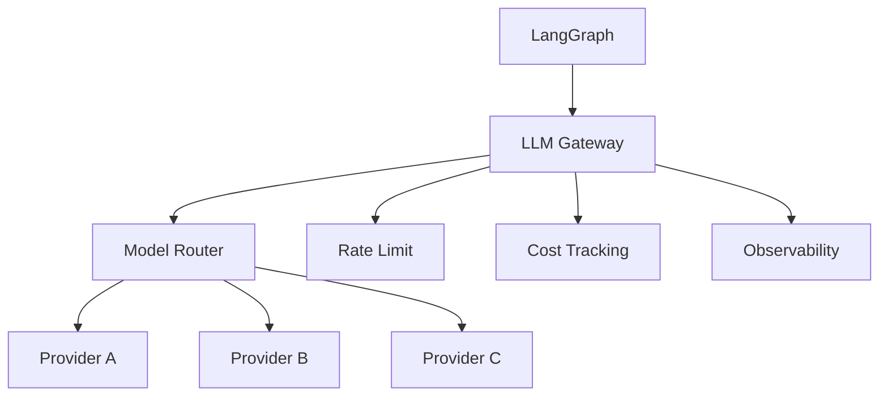

---

# 35. Model Fallback

If the primary provider is unavailable:

```text
Primary Model
 ↓
Failure
 ↓
Fallback Model
```

Fallback must consider:

```text
Capability
Context Window
Tool Support
Structured Output
Latency
Cost
Safety
```

A fallback model is not necessarily behaviorally equivalent.

---

# 36. Tool Gateway

Production Agents should generally access enterprise capabilities through a controlled boundary.

```text
Agent
 ↓
Tool Gateway
 ↓
Authentication
 ↓
Authorization
 ↓
Validation
 ↓
Rate Limit
 ↓
Enterprise Service
```

---

# 37. Tool Governance

Each production tool should have:

```text
Name
Version
Owner
Schema
Permission
Risk
Timeout
Rate Limit
SLA
Audit Policy
```

---

# 38. Risk-Based Execution

Example:

```text
Read Customer
 → Low Risk

Create Ticket
 → Medium Risk

Refund Payment
 → High Risk

Delete Account
 → Critical
```

Risk should influence:

```text
Authorization
Approval
Monitoring
Retry
Audit
```

---

# 39. Human-in-the-Loop

High-risk actions may require approval:

```text
Agent
 ↓
Risk Assessment
 ↓
Human Approval
 ↓
Tool
```

---

# 40. Production HITL

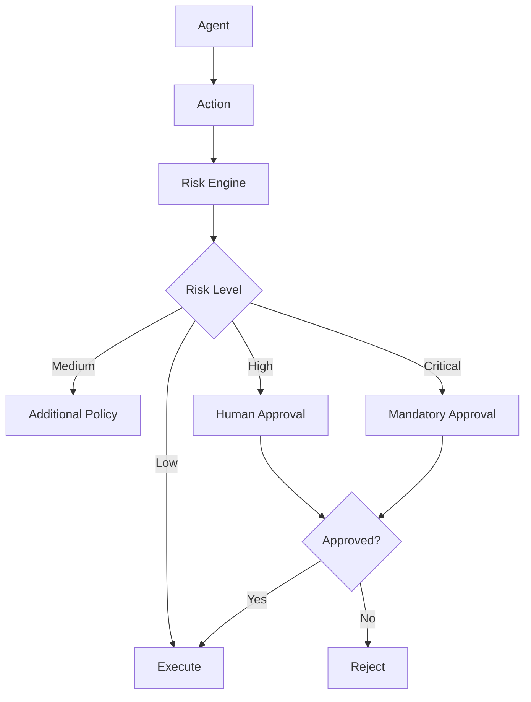

---

# 41. Security Architecture

Security should exist outside the LLM.

```text
User
 ↓
Identity
 ↓
Authorization
 ↓
Agent
 ↓
Policy
 ↓
Tool
```

The model should not be trusted to enforce access control.

---

# 42. Tenant Isolation

Every execution should carry tenant context:

```text
tenant_id
user_id
agent_id
execution_id
```

Tool calls and memory access should preserve this context.

---

# 43. Tenant-Aware Architecture

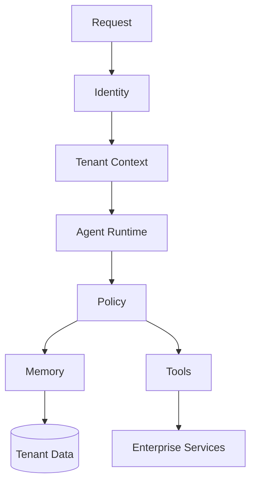

---

# 44. Prompt Injection

External data may contain malicious instructions.

Examples:

```text
Web Pages
Documents
Emails
Tool Results
Retrieved Content
```

Treat external content as:

```text
Untrusted Data
```

rather than trusted instructions.

---

# 45. Data Boundary

```text
External Data
 ↓
Validation
 ↓
Security Filtering
 ↓
Context Construction
 ↓
LLM
```

Do not allow retrieved content to silently override system policies.

---

# 46. Secrets

Never use Agent state as a secret store.

Use:

```text
Secret Manager
Vault
Managed Identity
Environment-Level Secret Injection
```

for:

```text
API Keys
Passwords
Tokens
Certificates
Private Keys
```

---

# 47. Observability

A production Agent requires visibility across:

```text
Graph
Nodes
LLM
Tools
RAG
State
Retries
Human Approval
Failures
Cost
```

---

# 48. Distributed Trace

A useful trace:

```text
Request
 ↓
Agent Execution
 ↓
Planner
 ↓
LLM
 ↓
Tool
 ↓
Enterprise API
 ↓
Tool Result
 ↓
LLM
 ↓
Final Response
```

Use a common correlation identifier.

---

# 49. Trace Context

Useful identifiers:

```text
Trace ID
Span ID
Tenant ID
User ID
Execution ID
Thread ID
Tool Call ID
```

Avoid putting sensitive information into identifiers or logs.

---

# 50. Metrics

Track:

```text
Task Success Rate
Execution Duration
P95 Latency
P99 Latency
LLM Calls
Tool Calls
Retry Rate
Failure Rate
Token Usage
Cost
Human Escalations
```

---

# 51. Agent SLOs

Example:

```text
Task Success ≥ Target

P95 Latency ≤ Target

Tool Failure Rate ≤ Target

Availability ≥ Target
```

The exact SLOs should be defined from business requirements.

---

# 52. Business Metrics

Technical metrics are not enough.

Track:

```text
Tasks Completed
Tasks Escalated
Customer Resolution Rate
Automation Rate
Human Intervention Rate
Cost per Successful Task
```

This connects Agent performance to business value.

---

# 53. Agent Evaluation

Evaluate at multiple levels:

```text
Model
 ↓
Prompt
 ↓
Tool Selection
 ↓
Workflow
 ↓
Task
 ↓
Business Outcome
```

---

# 54. Workflow Evaluation

Measure:

```text
Correct Path
Tool Accuracy
Plan Quality
Task Completion
Execution Efficiency
Safety
Cost
```

---

# 55. Regression Testing

Every workflow change can alter behavior.

Maintain evaluation datasets for:

```text
Normal Cases
Edge Cases
Failures
Security Cases
Long Context
Tool Failures
Ambiguous Requests
```

Run them before deployment.

---

# 56. Graph Path Testing

Test more than the happy path:

```text
A → B → C
```

Also:

```text
A → B → D
A → E
A → B → C → A
A → B → Failure
A → B → Human → C
```

---

# 57. Production Testing Pyramid

```text
                 E2E
                /   \
          Workflow   HITL
             /       \
       Integration   Security
          /             \
       Unit -------- Contract
```

Test the system at multiple levels.

---

# 58. Contract Testing

Contract-test:

```text
Tool Schemas
LLM Gateway
RAG Services
Enterprise APIs
State Schema
```

This reduces integration failures during deployments.

---

# 59. Chaos Testing

Simulate:

```text
LLM Failure
Tool Failure
Database Failure
Checkpoint Failure
Network Latency
Rate Limits
Worker Crash
Provider Outage
```

Verify:

```text
Recovery
Fallback
Escalation
Data Integrity
```

---

# 60. Deployment Architecture

A production Agent platform may use:

```text
Load Balancer
 ↓
Agent Runtime
 ↓
Container / Kubernetes
 ↓
Shared Persistence
```

The exact infrastructure depends on workload and cloud environment.

---

# 61. Containerized Agent Runtime

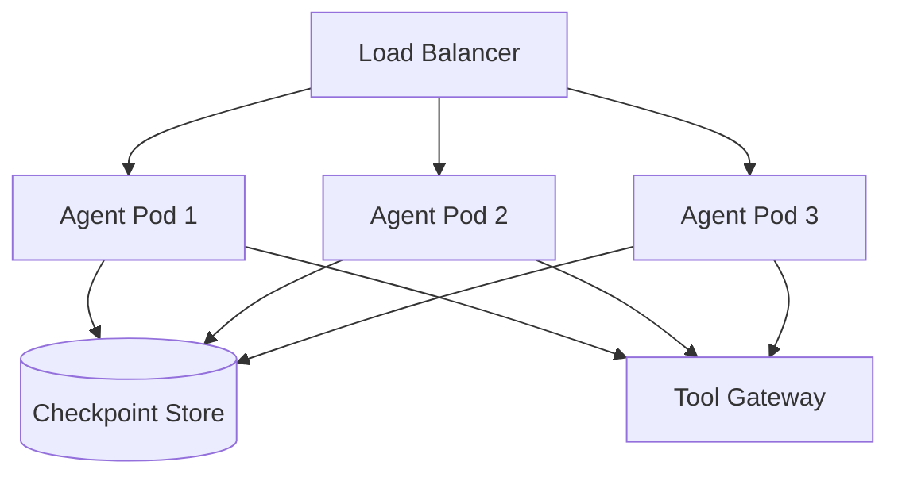

---

# 62. Autoscaling

Scale based on meaningful signals:

```text
Request Rate
Queue Depth
CPU
Memory
Execution Count
Latency
```

Agent workloads may be bursty, so queue depth can be especially useful for asynchronous execution.

---

# 63. Deployment Strategies

Common approaches:

```text
Rolling Deployment
Blue-Green
Canary
Shadow
A/B
```

For Agent systems, canary deployments are particularly useful because behavior can change even when the code change appears small.

---

# 64. Canary Deployment

```text
Production
 ├── v1 → 95%
 └── v2 → 5%
```

Compare:

```text
Success
Latency
Cost
Safety
Tool Usage
Escalations
```

before increasing traffic.

---

# 65. Workflow Versioning

Version:

```text
Graph Definition
Prompt
Model
Tool Schema
Policy
State Schema
```

Example:

```text
support-agent-v1
support-agent-v2
```

---

# 66. State Compatibility

A new workflow may not understand old checkpoints.

Therefore track:

```text
Workflow Version
+
State Version
```

Example:

```text
Workflow: v5
State: v3
```

Migration or compatibility logic may be required.

---

# 67. Rollback

If the new version causes:

```text
Failure ↑
Cost ↑
Latency ↑
Safety Issues
```

route new traffic back to the stable version.

For long-running executions, define whether they:

```text
Continue on Original Version
```

or:

```text
Migrate
```

---

# 68. Configuration Management

Externalize:

```text
Model Configuration
Tool Limits
Timeouts
Budgets
Feature Flags
Policy Thresholds
```

Do not hard-code production operational settings unnecessarily.

---

# 69. Feature Flags

Feature flags can control:

```text
New Model
New Tool
New Workflow Path
New Prompt
New Guardrail
```

Example:

```text
feature.agent_v2 = true
```

Use controlled rollout and monitoring.

---

# 70. Multi-Environment Strategy

Separate:

```text
Development
 ↓
Testing
 ↓
Staging
 ↓
Production
```

Avoid sharing sensitive production data with development environments.

---

# 71. Data Protection

Production Agent systems may process:

```text
PII
Financial Data
Business Data
Confidential Documents
Customer Conversations
```

Apply:

```text
Encryption
Access Control
Retention
Data Minimization
Audit
```

according to organizational and regulatory requirements.

---

# 72. Auditability

For important Agent actions record:

```text
Who
Which Tenant
Which Agent
Which Workflow Version
Which Tool
Which Action
When
Outcome
Approval
```

Do not blindly log sensitive prompts, tool arguments, or results.

---

# 73. Audit Architecture

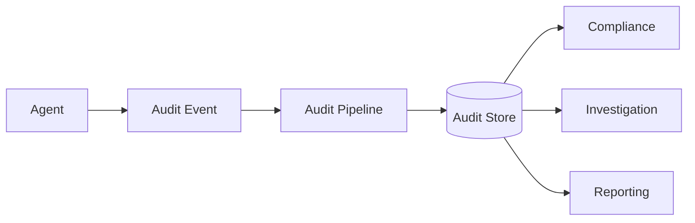

---

# 74. Data Minimization in Logs

Avoid:

```text
Full Customer Record
Full Payment Details
Secrets
Private Documents
```

when they are not required for troubleshooting or audit.

Prefer:

```text
Identifiers
Metadata
Status
Timing
Outcome
```

---

# 75. Disaster Recovery

Production Agent platforms should define:

```text
Backup
Replication
Recovery Point Objective
Recovery Time Objective
Failover
Restore Testing
```

for:

```text
Checkpoint Store
Memory Store
Audit Store
Configuration
```

as appropriate.

---

# 76. Recovery Objectives

### RPO

How much data can be lost?

```text
Last Checkpoint
```

### RTO

How quickly can execution be restored?

```text
Failure
 ↓
Recovery
```

Define targets according to business criticality.

---

# 77. High Availability

A production architecture should avoid single points of failure.

```text
Agent Worker
    +
Checkpoint Store
    +
Tool Gateway
    +
LLM Provider
```

Each critical dependency should have an availability strategy.

---

# 78. Multi-Provider Resilience

For critical systems:

```text
Agent
 ↓
LLM Gateway
 ├── Provider A
 ├── Provider B
 └── Provider C
```

Fallback must account for model compatibility.

---

# 79. RAG Resilience

If RAG is unavailable:

```text
Agent
 ↓
RAG
 ↓
Failure
```

possible strategies:

```text
Retry
Fallback Source
Degraded Response
Human Escalation
```

Do not fabricate an answer because a critical knowledge source is unavailable.

---

# 80. Tool Resilience

Tools should expose predictable failure states:

```text
SUCCESS
VALIDATION_ERROR
UNAUTHORIZED
RATE_LIMITED
TIMEOUT
UNAVAILABLE
UNKNOWN
```

The Agent workflow can then route each state appropriately.

---

# 81. Production State Machine

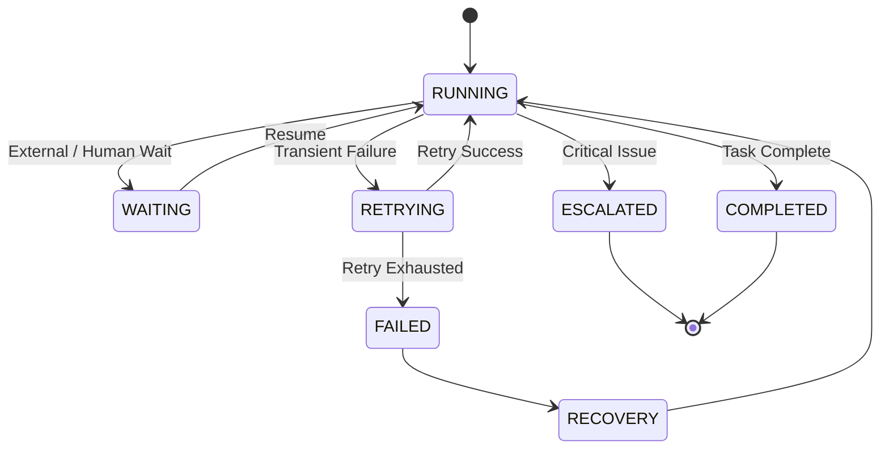

---

# 82. Operational Runbooks

Production teams should document:

```text
Agent Failure
LLM Outage
Tool Outage
Checkpoint Failure
Memory Failure
High Latency
Cost Spike
Security Incident
Queue Backlog
```

Each should have:

```text
Detection
Diagnosis
Mitigation
Recovery
Escalation
```

---

# 83. Example Incident

Suppose:

```text
P95 latency ↑ 300%
```

Investigate:

```text
Agent
 ↓
LLM Latency?
 ↓
RAG Latency?
 ↓
Tool Latency?
 ↓
Checkpoint Latency?
 ↓
Queue Backlog?
```

Distributed tracing should make the bottleneck visible.

---

# 84. Cost Spike Investigation

If:

```text
Agent Cost ↑ 5x
```

check:

```text
Iterations
LLM Calls
Token Usage
Tool Calls
Retries
Prompt Size
RAG Results
Model Routing
```

Cost increases often come from execution loops rather than simply higher traffic.

---

# 85. Runaway Agent Detection

Potential signals:

```text
High Iteration Count
High Tool Calls
High Token Usage
Long Runtime
Repeated Same Tool
Repeated Same State
```

Possible response:

```text
Stop
 ↓
Fallback
 ↓
Escalate
```

---

# 86. Duplicate Tool Detection

Detect:

```text
Same Execution
+
Same Tool
+
Same Arguments
+
Same Idempotency Key
```

This can help identify repeated execution and possible workflow bugs.

---

# 87. Agent Governance

Production governance should define:

```text
Approved Models
Approved Tools
Allowed Data
Risk Categories
Approval Requirements
Retention
Audit
Deployment Controls
```

---

# 88. Agent Registry

An enterprise platform may maintain:

```text
Agent Registry
 ├── Agent ID
 ├── Owner
 ├── Version
 ├── Tools
 ├── Models
 ├── Risk
 ├── Policies
 └── Status
```

This improves platform-level governance.

---

# 89. Agent Lifecycle

```text
Design
 ↓
Develop
 ↓
Evaluate
 ↓
Security Review
 ↓
Register
 ↓
Deploy
 ↓
Monitor
 ↓
Improve
 ↓
Version
 ↓
Retire
```

---

# 90. Production Anti-Patterns

## Anti-Pattern 1 — Unbounded Loops

```text
Agent → Tool → Agent → Tool → ...
```

### Fix

```text
Max Iterations
Max Tool Calls
Timeout
Budget
```

---

# 91. Anti-Pattern 2 — LLM-Enforced Security

```text
Prompt:
"Only use authorized tools."
```

This is not sufficient.

### Fix

```text
Deterministic Authorization
+
Policy Enforcement
```

---

# 92. Anti-Pattern 3 — No Checkpointing

```text
Long Workflow
 ↓
Worker Crash
 ↓
Everything Lost
```

### Fix

```text
Durable Checkpoints
```

---

# 93. Anti-Pattern 4 — Blind Retries

```text
Payment
 ↓
Timeout
 ↓
Retry
 ↓
Duplicate Payment
```

### Fix

```text
Idempotency
+
Reconciliation
```

---

# 94. Anti-Pattern 5 — Everything in State

```text
Huge Documents
+
Entire API Responses
+
All History
```

### Fix

```text
References
+
Selective Context
+
External Stores
```

---

# 95. Anti-Pattern 6 — No Observability

If production fails:

```text
"Why did the Agent do that?"
```

and you cannot answer it.

### Fix

```text
Trace
+
Metrics
+
Audit
```

---

# 96. Anti-Pattern 7 — Framework Coupling

Avoid:

```text
Business Logic
 ↓
Direct LangGraph API
 ↓
Enterprise Service
```

Prefer:

```text
LangGraph
 ↓
Application Capability
 ↓
Enterprise Service
```

---

# 97. Anti-Pattern 8 — No Workflow Versioning

A graph changes:

```text
v1 → v2
```

but existing executions continue using incompatible state.

### Fix

```text
Workflow Version
+
State Version
+
Migration Strategy
```

---

# 98. Anti-Pattern 9 — Treating All Tools Equally

```text
get_customer()
```

and:

```text
delete_account()
```

should not have identical controls.

### Fix

```text
Risk Classification
+
Policy
+
Approval
```

---

# 99. Anti-Pattern 10 — No Cost Controls

A workflow can repeatedly invoke:

```text
LLM
+
Search
+
Tools
```

without limits.

### Fix

```text
Token Budget
+
Tool Budget
+
Time Budget
+
Cost Budget
```

---

# 100. Production Reference Architecture

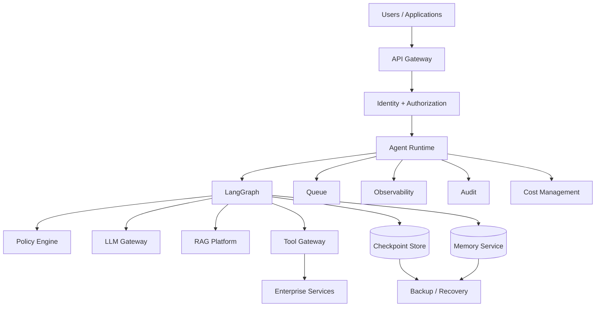

---

# 101. Production Request Flow

```text
1. Request
      ↓
2. Authentication
      ↓
3. Authorization
      ↓
4. Tenant Context
      ↓
5. Agent Execution
      ↓
6. Load / Budget Check
      ↓
7. LangGraph
      ↓
8. LLM / RAG / Tools
      ↓
9. Policy Enforcement
      ↓
10. State / Checkpoint
      ↓
11. Observability
      ↓
12. Response
```

---

# 102. Production Decision Hierarchy

A useful enterprise hierarchy is:

```text
Business Policy
       ↓
Security Policy
       ↓
Risk Policy
       ↓
Workflow
       ↓
Agent Decision
       ↓
Tool Execution
```

The LLM should operate within these boundaries.

---

# 103. Production Readiness Checklist

## Architecture

- [ ] Explicit graph
- [ ] Clear state schema
- [ ] Clear capability boundaries
- [ ] Externalized persistence
- [ ] Stateless/scalable workers
- [ ] Versioned workflows

## Reliability

- [ ] Checkpointing
- [ ] Retry
- [ ] Timeout
- [ ] Backoff
- [ ] Circuit breaker
- [ ] Idempotency
- [ ] Reconciliation
- [ ] Recovery

## Security

- [ ] Authentication
- [ ] Authorization
- [ ] Tenant isolation
- [ ] Tool allowlist
- [ ] Risk policies
- [ ] Secret management
- [ ] Data minimization

## Agent Controls

- [ ] Maximum iterations
- [ ] Maximum tool calls
- [ ] Token budget
- [ ] Runtime budget
- [ ] Cost budget
- [ ] Human approval

## Observability

- [ ] Distributed tracing
- [ ] Metrics
- [ ] Logs
- [ ] Audit
- [ ] Cost tracking
- [ ] Alerts

## Deployment

- [ ] CI/CD
- [ ] Environment separation
- [ ] Canary / blue-green strategy
- [ ] Rollback
- [ ] Workflow versioning
- [ ] State migration

## Operations

- [ ] Runbooks
- [ ] Incident response
- [ ] Disaster recovery
- [ ] Backup
- [ ] Restore testing
- [ ] Capacity planning

---

# 104. Key Takeaways

- Production LangGraph systems require more than graph construction.
- Agent orchestration should remain separate from enterprise capability execution.
- State should be explicit, minimal, serializable, and versioned.
- Checkpointing enables durable execution and recovery.
- Agent workers should be horizontally scalable where possible.
- External persistence allows workers to remain replaceable.
- Concurrency must be controlled across the entire dependency chain.
- Backpressure prevents downstream systems from being overwhelmed.
- Long-running tasks often benefit from asynchronous execution.
- Retries must distinguish transient failures from permanent failures.
- Side-effecting operations require idempotency.
- Unknown outcomes require reconciliation.
- Circuit breakers can protect unhealthy downstream dependencies.
- Agent loops require explicit limits.
- Token, tool, runtime, and cost budgets prevent runaway execution.
- LLM gateways can centralize model routing and resilience.
- Tool gateways provide a strong enterprise execution boundary.
- High-risk operations should have stronger authorization and potentially human approval.
- Security controls should be deterministic rather than prompt-based.
- Tenant context must propagate through state, memory, tools, and enterprise services.
- Observability should cover the complete execution path.
- Agent evaluation must include workflow and business outcomes, not only final responses.
- Workflow and state schemas should be versioned.
- Production deployments should support controlled rollout and rollback.
- Disaster recovery must include persistence and configuration dependencies.
- Operational runbooks are part of production readiness.
- The strongest production architecture combines:

```text
LLM Intelligence
+
Graph Orchestration
+
Deterministic Policies
+
Durable State
+
Enterprise Capabilities
+
Observability
+
Governance
```

---

# 📝 Quick Revision Notes

## Production Agent

```text
Request
 ↓
Identity
 ↓
Authorization
 ↓
Agent Runtime
 ↓
LangGraph
 ↓
Policy
 ↓
LLM / RAG / Tools
 ↓
Checkpoint
 ↓
Observability
 ↓
Response
```

---

## Reliable Agent

```text
Checkpoint
+
Timeout
+
Retry
+
Backoff
+
Circuit Breaker
+
Idempotency
+
Reconciliation
```

---

## Scalable Agent

```text
Load Balancer
 ↓
Agent Workers
 ↓
Shared Persistence
 ↓
Tool Gateway
 ↓
Enterprise Services
```

---

## Secure Agent

```text
Identity
 ↓
Tenant Context
 ↓
Authorization
 ↓
Policy
 ↓
Agent
 ↓
Tool
```

---

## Cost-Controlled Agent

```text
Token Budget
+
Tool Budget
+
Runtime Budget
+
Cost Budget
```

---

## Production Agent Lifecycle

```text
Design
 ↓
Develop
 ↓
Evaluate
 ↓
Secure
 ↓
Deploy
 ↓
Observe
 ↓
Optimize
 ↓
Version
 ↓
Retire
```

---

# ❓ Interview Questions

## Beginner

1. What makes a LangGraph Agent production-ready?
2. Why should Agent state be persisted?
3. What is durable execution?
4. Why are checkpoints important?
5. Why should Agent workers be horizontally scalable?
6. What is idempotency?
7. What is an unknown tool outcome?
8. Why are timeouts necessary?
9. What is a circuit breaker?
10. Why are Agent execution limits necessary?

## Intermediate

11. How would you design a scalable LangGraph runtime?
12. How would you persist Agent state?
13. How would you handle Agent worker failure?
14. How would you implement retry and backoff?
15. How would you prevent duplicate side effects?
16. How would you design a Tool Gateway?
17. How would you implement Agent budgets?
18. How would you implement Human-in-the-Loop?
19. How would you design Agent observability?
20. How would you version a LangGraph workflow?
21. How would you handle state schema changes?
22. How would you implement tenant isolation?
23. How would you design LLM provider fallback?
24. How would you test Agent workflows?

## Advanced

25. Design a production-grade LangGraph platform for 10,000 concurrent executions.
26. How would you prevent cascading failures in Agent systems?
27. How would you design durable execution across worker failures?
28. How would you reconcile unknown outcomes from side-effecting tools?
29. How would you design multi-tenant Agent infrastructure?
30. How would you implement Agent-level SLOs?
31. How would you design model routing across multiple providers?
32. How would you implement canary deployment for Agent workflows?
33. How would you migrate running workflows between versions?
34. How would you handle checkpoint schema evolution?
35. How would you design disaster recovery for Agent state?
36. How would you detect runaway Agent executions?
37. How would you control Agent cost at scale?
38. How would you protect enterprise systems from Agent-generated traffic spikes?
39. How would you design risk-based authorization for Agent tools?
40. How would you separate Agent reasoning from enterprise business logic?
41. How would you design an enterprise Agent registry?
42. How would you implement graph path regression testing?
43. How would you design observability for thousands of concurrent Agent workflows?
44. How would you design an Agent platform that supports multiple LLM providers?
45. What architectural boundaries should exist between LangGraph and enterprise systems?

---

# 🛠️ Practical Exercise

Build a **Production Customer Support Agent** with:

```text
LangGraph
+
RAG
+
Tools
+
Checkpointing
+
Memory
+
Human Approval
+
Observability
```

Requirements:

```text
1. Authenticate user
2. Resolve tenant
3. Load conversation state
4. Plan task
5. Retrieve enterprise knowledge
6. Execute tools
7. Validate results
8. Request approval for high-risk actions
9. Checkpoint progress
10. Recover from failures
11. Apply execution budgets
12. Produce final response
```

Architecture:

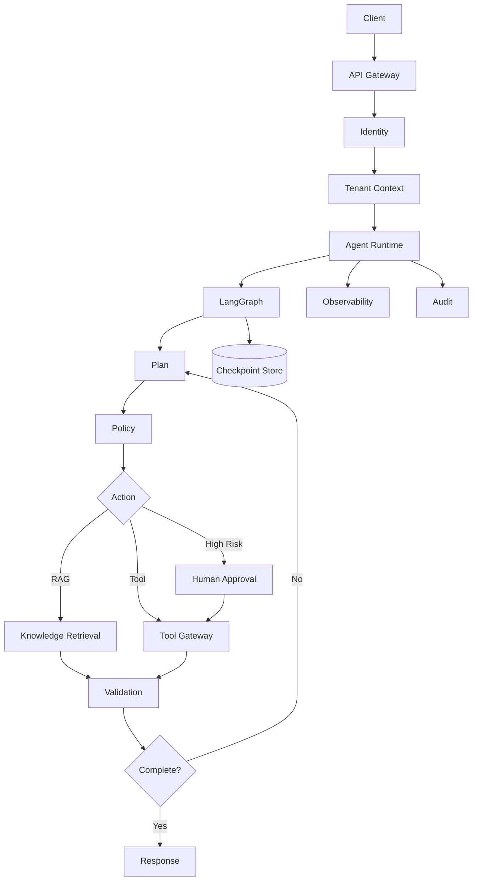

---

# 🧪 Failure Simulation Exercise

Simulate:

```text
1. LLM timeout
2. LLM provider outage
3. RAG unavailable
4. Tool timeout
5. Tool rate limit
6. Tool unknown outcome
7. Checkpoint failure
8. Worker crash
9. Memory failure
10. Human approval timeout
11. Budget exceeded
12. Maximum iterations exceeded
13. Database unavailable
14. Cross-tenant access attempt
15. Workflow version mismatch
```

For each scenario define:

```text
Detection
 ↓
State
 ↓
Policy
 ↓
Recovery
 ↓
Fallback
 ↓
Audit
```

---

# 🚀 Advanced Exercise

Build a **Multi-Tenant Enterprise Agent Runtime**.

Requirements:

```text
Multiple Tenants
Multiple Agents
Multiple Workflows
Multiple LLM Providers
100+ Tools
Long-Running Executions
Human Approval
RAG
Memory
```

Implement:

```text
Agent Registry
Workflow Registry
Tool Registry
Model Gateway
Tool Gateway
Policy Engine
Checkpoint Store
Memory Service
Observability
Audit
Cost Management
```

---

# 🏢 Production Architecture Challenge

Design an enterprise platform supporting:

```text
10,000+ concurrent executions
1,000+ Agent workflows
100+ tools
Multiple LLM providers
Multiple cloud environments
Multiple tenants
Long-running workflows
High-risk financial operations
```

Required:

```text
Horizontal Scaling
Durable Execution
Checkpointing
Queueing
Backpressure
Rate Limiting
Tool Governance
Model Routing
Human Approval
Tenant Isolation
Observability
Audit
Cost Controls
Disaster Recovery
```

Architecture:

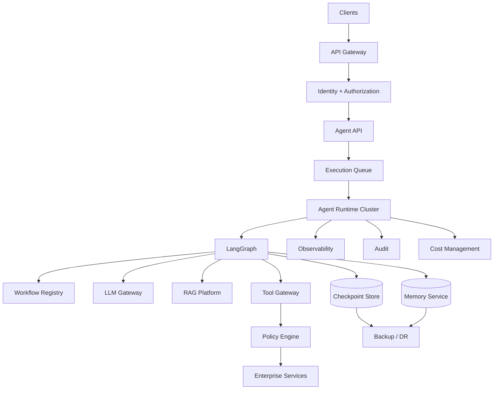

---

# 🧠 Final Architecture Challenge

Design a **Production Banking Agent Platform**.

The Agent must support:

```text
Customer Lookup
Transaction Search
Policy Retrieval
Payment
Refund
Account Update
Human Approval
```

The platform must guarantee:

```text
Tenant Isolation
Least Privilege
Idempotency
Durable Execution
Auditability
Observability
Cost Control
Disaster Recovery
```

Answer:

```text
Where does Agent state live?

Where are checkpoints stored?

How do workers scale horizontally?

How do you handle worker crashes?

How do you prevent infinite loops?

How do you control tool calls?

How do you control token usage?

How do you authorize tools?

How do you classify tool risk?

Where does Human-in-the-Loop occur?

How do you handle a payment timeout?

How do you reconcile an unknown payment outcome?

How do you prevent duplicate refunds?

How do you isolate tenants?

How do you version workflows?

How do you migrate state?

How do you deploy a new Agent version?

How do you roll back?

How do you observe Agent executions?

How do you detect runaway Agents?

How do you perform disaster recovery?
```

---

# 📚 References & Further Reading

Recommended areas for further study:

- LangGraph Production Architecture
- LangGraph Persistence
- LangGraph Checkpointing
- LangGraph Durable Execution
- LangGraph Agent Workflows
- LangGraph Tool Execution
- LangGraph Human-in-the-Loop
- LangGraph Subgraphs
- Agent Runtime Architecture
- Agent Reliability Engineering
- Distributed Systems
- Idempotent APIs
- Retry and Backoff
- Circuit Breakers
- Queue-Based Architecture
- Backpressure
- Multi-Tenant Architecture
- Agent Security
- Agent Observability
- Agent Evaluation
- AI Governance
- Model Gateways
- Tool Gateways
- Enterprise API Architecture
- Disaster Recovery
- SRE for AI Systems

> LangGraph APIs and deployment capabilities evolve over time. Verify the exact APIs, persistence mechanisms, execution semantics, and deployment recommendations against the official LangGraph documentation for the version used in your project.

---

## 🧭 Chapter Navigation

⬅️ **Previous:** [24. LangGraph Memory and Persistence](24-langgraph-memory-and-persistence.md)

📚 **Part VIII Index:** [AI Engineering Frameworks & Tooling](index.md)

➡️ **Next:** [26. LangGraph Limitations and Trade-offs](26-langgraph-limitations-and-tradeoffs.md)

---

> **Enterprise AI Engineering Handbook**
>
> *Building Production-Grade Enterprise AI Systems — One Chapter at a Time.*