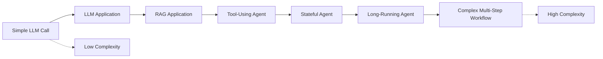
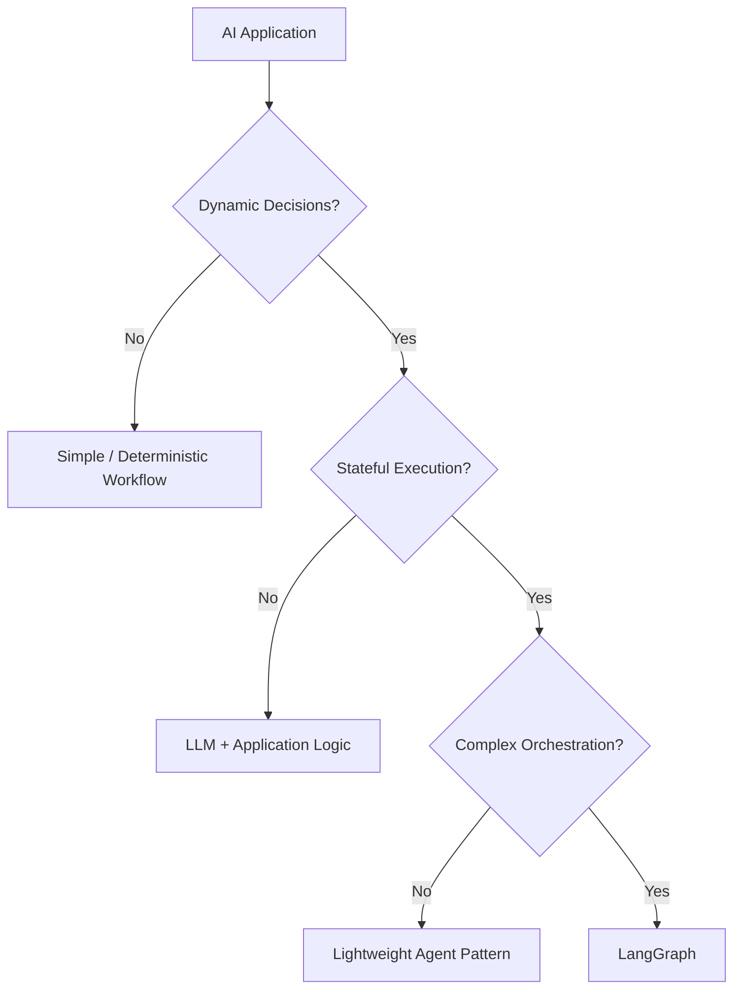
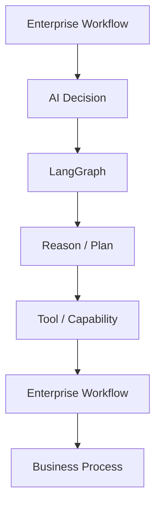
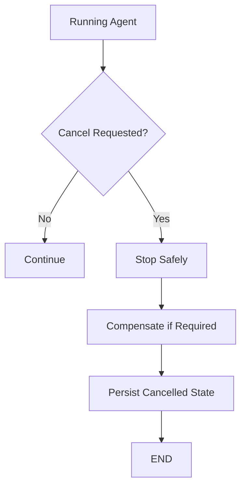
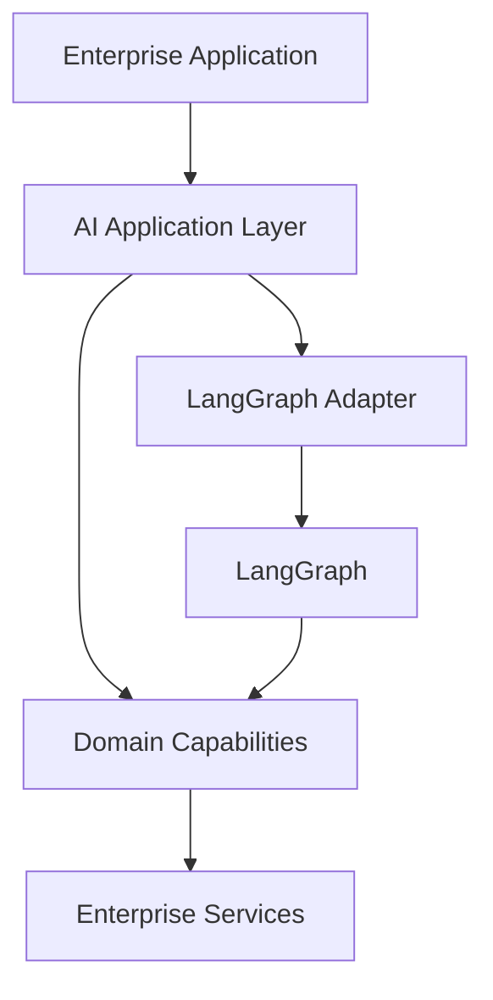
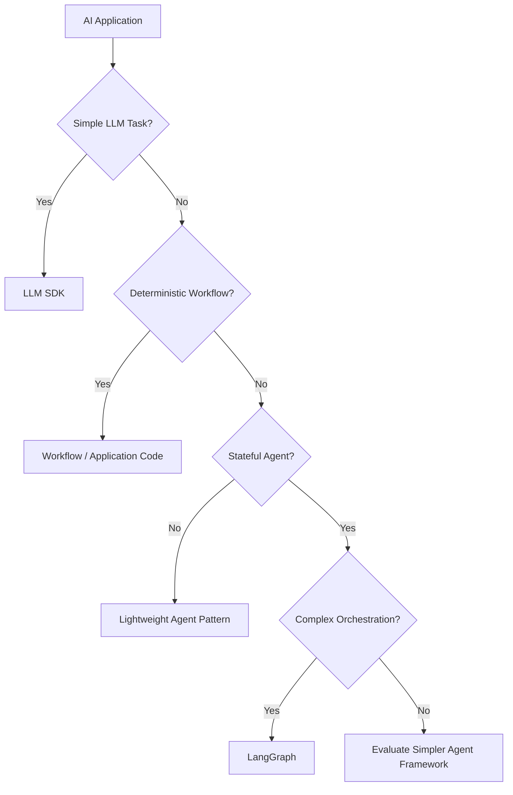
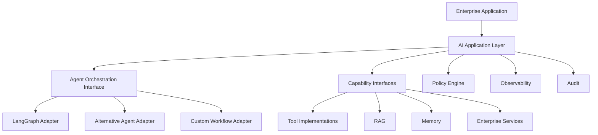

# 26 — LangGraph Limitations and Trade-offs

> Understand the architectural limitations, operational trade-offs, complexity, performance considerations, and enterprise challenges of LangGraph so that you can make informed decisions about when to use it, how to use it, and when a simpler or alternative architecture may be more appropriate.

---

## 📖 Overview

LangGraph provides a powerful graph-based model for building stateful AI workflows and Agents.

It is particularly useful when applications require:

```text
State
+
Conditional Routing
+
Loops
+
Tool Execution
+
Human-in-the-Loop
+
Checkpointing
+
Long-Running Workflows
```

However, flexibility introduces complexity.

A simple LLM application may require:

```text
Application
 ↓
LLM
 ↓
Response
```

A LangGraph-based Agent can introduce:

```text
Application
 ↓
Agent Runtime
 ↓
Graph
 ↓
State
 ↓
Routing
 ↓
Tools
 ↓
Persistence
 ↓
Checkpoints
 ↓
Observability
 ↓
Recovery
```

Therefore, LangGraph should not automatically be considered the best solution for every AI application.

The architectural decision should consider:

```text
Problem Complexity
+
Workflow Requirements
+
Operational Requirements
+
Team Expertise
+
Performance
+
Cost
+
Maintainability
```

---

# 🎯 Learning Objectives

After completing this chapter, you will be able to:

- Understand the major limitations of LangGraph
- Identify when LangGraph introduces unnecessary complexity
- Understand graph and state-management trade-offs
- Evaluate operational complexity
- Understand persistence and checkpointing trade-offs
- Evaluate scalability considerations
- Understand debugging challenges
- Evaluate Agent workflow complexity
- Understand framework coupling
- Compare deterministic workflows with Agent workflows
- Identify when simpler architectures are preferable
- Evaluate LangGraph for enterprise use cases
- Make architecture decisions based on requirements rather than framework popularity

---

# 1. The Fundamental Trade-off

The central trade-off is:

```text
More Control
      ↕
More Complexity
```

LangGraph provides explicit control over:

```text
State
Nodes
Edges
Routing
Execution
Persistence
Interruptions
```

But this also means developers must understand and manage more architectural concepts.

---

# 2. Simplicity vs Control

A simple application:

```text
Request
 ↓
LLM
 ↓
Response
```

may not need a graph framework.

A complex Agent:

```text
Request
 ↓
Plan
 ↓
Decision
 ↓
Tool
 ↓
Observation
 ↓
Validation
 ↓
Re-plan
 ↓
Human Approval
 ↓
Resume
```

benefits much more from explicit orchestration.

---

# 3. When LangGraph May Be Overkill

Avoid introducing LangGraph merely because:

```text
"We are building an LLM application."
```

For example:

```text
Simple Summarization
Simple Classification
Simple Extraction
Simple Chat Completion
Simple Prompt → Response
```

may be better implemented using:

```text
LLM SDK
+
Application Code
```

---

# 4. Architecture Complexity Curve



The framework becomes more valuable as execution complexity increases.

---

# 5. Graph Complexity

Graphs can become difficult to understand as the number of nodes and routes increases.

Example:

```text
Node A
 ├── B
 │    ├── C
 │    └── D
 ├── E
 │    ├── F
 │    └── G
 └── H
      ├── I
      └── J
```

Large graphs can become difficult to reason about.

---

# 6. Graph Spaghetti

A poorly designed graph may become:

```text
A → B → C
↑   ↓   ↓
D ← E → F
↓   ↑
G → H
```

This creates:

```text
Hidden Dependencies
Complex Routing
Hard Debugging
Difficult Testing
```

---

# 7. Graph Complexity Management

Prefer:

```text
Small Nodes
+
Clear Responsibilities
+
Meaningful Boundaries
+
Subgraphs
+
Explicit State
```

instead of:

```text
One Giant Graph
```

---

# 8. State Complexity

As workflows become more sophisticated:

```text
State
 ├── messages
 ├── plan
 ├── observations
 ├── tool_results
 ├── approvals
 ├── metadata
 ├── errors
 ├── budgets
 └── execution_status
```

The state itself can become difficult to manage.

---

# 9. State Coupling

If many nodes depend on the same fields:

```text
Node A → state.plan
Node B → state.plan
Node C → state.plan
Node D → state.plan
```

changes to:

```text
state.plan
```

can affect many parts of the workflow.

This creates state coupling.

---

# 10. State Design Trade-off

### Large State

Pros:

```text
Easy Access
Rich Context
```

Cons:

```text
Large Checkpoints
Higher Storage
Higher Serialization Cost
Higher Context Cost
```

### Small State

Pros:

```text
Efficient
Clear
Lower Cost
```

Cons:

```text
More External Lookups
More Coordination
```

---

# 11. State Should Not Become a Database

Avoid turning graph state into:

```text
Customer Database
Document Store
Cache
Audit Store
Memory Store
```

Graph state should primarily represent:

```text
Execution Context
```

rather than become the system of record.

---

# 12. Persistence Complexity

Checkpointing enables:

```text
Recovery
Resume
Long-Running Execution
Human Approval
```

but introduces:

```text
Storage
Serialization
Versioning
Migration
Retention
Backup
Recovery
```

requirements.

---

# 13. Checkpoint Trade-off

```text
Frequent Checkpoints
 ↓
Better Recovery
 ↓
Higher Write / Storage Cost
```

while:

```text
Fewer Checkpoints
 ↓
Lower Cost
 ↓
More Recovery Work
```

There is no universally correct checkpoint frequency.

---

# 14. State Serialization

Persistent state must be serializable.

This can become difficult when state contains:

```text
Large Objects
Complex Runtime Objects
External Connections
Non-Serializable Resources
Large Tool Results
```

Prefer:

```text
IDs
References
Structured Data
Serializable Results
```

---

# 15. State Versioning

Production systems evolve.

Example:

```text
State v1
 ↓
State v2
 ↓
State v3
```

Old checkpoints may not automatically work with new graph definitions.

Therefore:

```text
Workflow Version
+
State Version
+
Migration Strategy
```

may be required.

---

# 16. Long-Running Workflow Complexity

Long-running Agents introduce:

```text
Checkpointing
Resume
Interruptions
External Events
Human Approval
Timeouts
Retries
Idempotency
Reconciliation
```

The architecture becomes closer to:

```text
Distributed Workflow System
```

than a simple LLM application.

---

# 17. Agent Workflow Complexity

A workflow may begin as:

```text
Agent
 ↓
Tool
 ↓
Response
```

and evolve into:

```text
Planner
 ↓
Executor
 ↓
Observer
 ↓
Validator
 ↓
Re-planner
 ↓
Human
 ↓
Resume
 ↓
Executor
 ↓
Validator
```

At this point:

```text
Workflow Engineering
```

becomes as important as:

```text
Prompt Engineering
```

---

# 18. Debugging Complexity

Traditional applications often follow:

```text
Input
 ↓
Function
 ↓
Output
```

Agent workflows can involve:

```text
Input
 ↓
LLM Decision
 ↓
Routing
 ↓
Tool
 ↓
External API
 ↓
Observation
 ↓
LLM Decision
 ↓
Routing
 ↓
Tool
```

The same input may not always produce the same execution path.

---

# 19. Non-Determinism

LLMs introduce probabilistic behavior.

Two executions may produce:

```text
Request
 ↓
Tool A
```

and:

```text
Request
 ↓
Tool B
```

even when the input is identical.

This complicates:

```text
Testing
Debugging
Reproducibility
Performance Analysis
```

---

# 20. Reproducibility Trade-off

Traditional software often expects:

```text
Same Input
 →
Same Logic
 →
Same Output
```

Agent systems may behave more like:

```text
Same Input
 ↓
Model
 ↓
Different Reasoning Path
```

Production systems therefore need:

```text
Structured Outputs
Constraints
Validation
Evaluation
Tracing
```

to reduce undesirable variability.

---

# 21. Debugging Requirements

Production Agent debugging benefits from:

```text
Trace ID
Execution ID
Thread ID
Workflow Version
State Version
Node
LLM
Tool
Latency
Result
```

Without this information, debugging complex Agent behavior becomes difficult.

---

# 22. Observability Overhead

Detailed tracing improves visibility but can increase:

```text
Storage
Processing
Network Traffic
Operational Cost
```

Especially when recording:

```text
Large Prompts
Large Tool Results
Long Conversations
Multiple Iterations
```

---

# 23. Logging Trade-off

### Too Little Logging

```text
Cannot Debug
```

### Too Much Logging

```text
High Cost
Privacy Risk
Security Risk
Storage Growth
```

Use:

```text
Structured Logs
+
Sampling
+
Redaction
+
Metadata
```

where appropriate.

---

# 24. Tool Execution Complexity

Tools introduce external dependencies:

```text
Database
API
Search
Cloud Service
Enterprise System
```

Each adds:

```text
Latency
Failure Modes
Authentication
Authorization
Rate Limits
Retries
```

---

# 25. Tool Failure Propagation

Example:

```text
Agent
 ↓
Tool
 ↓
API Timeout
 ↓
Retry
 ↓
API Timeout
 ↓
Agent Retry
 ↓
Another Tool Retry
```

This can create cascading retries.

Use centralized policies where possible.

---

# 26. External Dependency Risk

LangGraph does not eliminate failures in:

```text
LLM Providers
Vector Databases
Enterprise APIs
Databases
Search Systems
Cloud Services
```

It orchestrates them.

The underlying distributed-systems problems still exist.

---

# 27. Idempotency Complexity

Checkpoint recovery may cause a workflow to revisit execution boundaries.

For side effects:

```text
Create Order
 ↓
Worker Failure
 ↓
Resume
 ↓
Create Order Again?
```

The system must answer:

```text
Was the original operation completed?
```

This requires:

```text
Idempotency
+
Reconciliation
```

---

# 28. Performance Trade-offs

Agent workflows may require multiple operations:

```text
LLM
 ↓
Tool
 ↓
LLM
 ↓
RAG
 ↓
LLM
 ↓
Tool
```

Compared with:

```text
LLM
 ↓
Response
```

latency can increase substantially.

---

# 29. Latency Composition

If:

```text
LLM = 1 sec
Tool = 500 ms
RAG = 300 ms
LLM = 1 sec
```

then sequential execution is approximately:

```text
1 + 0.5 + 0.3 + 1
=
2.8 seconds
```

before additional network and processing overhead.

For longer workflows, these delays accumulate.

---

# 30. Sequential Execution Trade-off

```text
A
 ↓
B
 ↓
C
 ↓
D
```

is simple but:

```text
Latency = A + B + C + D
```

Independent operations may benefit from parallel execution.

---

# 31. Parallel Execution Complexity

Parallel execution can reduce latency:

```text
A
├── B
├── C
└── D
```

but introduces:

```text
Concurrency
State Merging
Partial Failure
Ordering
Rate Limits
```

---

# 32. Parallel Failure

Suppose:

```text
Tool A → Success
Tool B → Success
Tool C → Failure
```

The workflow must decide:

```text
Continue?
Retry C?
Restart All?
Fallback?
Escalate?
```

Parallelism therefore increases coordination complexity.

---

# 33. Resource Consumption

A single Agent request can generate:

```text
Multiple LLM Calls
Multiple Tool Calls
Multiple RAG Queries
Multiple Retries
```

Therefore:

```text
1 User Request
≠
1 Backend Operation
```

This affects:

```text
Capacity Planning
Cost
Rate Limits
SLOs
```

---

# 34. Cost Unpredictability

Traditional API:

```text
1 Request
 →
Known Approximate Cost
```

Agent:

```text
1 Request
 ↓
LLM
 ↓
Tool
 ↓
LLM
 ↓
Tool
 ↓
LLM
 ↓
...
```

The number of operations may vary.

Use:

```text
Budgets
Maximum Iterations
Maximum Tool Calls
Token Limits
Cost Limits
```

---

# 35. Context Growth

Agent workflows may accumulate:

```text
Messages
Plans
Observations
Tool Results
Intermediate Data
```

Large context can cause:

```text
Higher Token Cost
Higher Latency
Context Window Pressure
Lower Signal-to-Noise Ratio
```

---

# 36. Context Management

Use:

```text
Summarization
Filtering
Windowing
Selective Retrieval
Structured State
External References
```

instead of passing every historical detail to every node.

---

# 37. Framework Abstraction Trade-off

LangGraph provides useful abstractions:

```text
Graph
State
Nodes
Edges
Persistence
Tools
Interrupts
```

But abstraction can hide implementation details.

When debugging complex production problems, engineers may need to understand:

```text
Framework
+
Runtime
+
Persistence
+
LLM
+
Network
+
Infrastructure
```

---

# 38. Framework Coupling

If business logic directly depends on LangGraph APIs:

```text
Business Logic
 ↓
LangGraph
```

migration becomes harder.

Prefer:

```text
LangGraph
 ↓
Application Layer
 ↓
Domain / Capability Layer
```

---

# 39. Portability Trade-off

An application deeply built around:

```text
LangGraph State
LangGraph Nodes
LangGraph Routing
LangGraph Persistence
```

may require engineering effort to migrate to:

```text
Another Agent Framework
Custom Workflow Engine
Cloud Workflow Platform
```

This is not necessarily a reason to avoid LangGraph.

It is a reason to define architectural boundaries.

---

# 40. Framework Lock-In

Potential lock-in areas:

```text
Graph Definition
State Schema
Persistence
Tool Integration
Execution Semantics
Observability
```

Reduce coupling through:

```text
Domain Interfaces
Capability Ports
Externalized State Contracts
Framework Adapters
```

---

# 41. Learning Curve

LangGraph introduces concepts such as:

```text
State
Nodes
Edges
Conditional Routing
Reducers
Checkpoints
Threads
Interrupts
Subgraphs
Persistence
```

Developers new to graph-based orchestration may require time to understand these concepts.

---

# 42. Team Skill Requirements

A production LangGraph team may need knowledge of:

```text
Python
LLMs
Agent Architecture
Distributed Systems
State Management
Databases
Cloud Infrastructure
Security
Observability
Testing
```

LangGraph does not replace the need for systems engineering expertise.

---

# 43. Operational Complexity

A production Agent platform may require:

```text
Agent Runtime
LLM Gateway
Tool Gateway
Checkpoint Store
Memory Store
RAG
Queue
Observability
Audit
Policy Engine
```

This can become a substantial platform.

---

# 44. Platform Cost

More components mean:

```text
More Infrastructure
+
More Monitoring
+
More Maintenance
+
More Failure Modes
```

The organization should justify this complexity through business value.

---

# 45. When Simpler Is Better

Consider simpler architectures for:

```text
Simple Chat
Simple RAG
Simple Extraction
Simple Classification
Single Tool Call
Fixed Workflow
Low Operational Requirements
```

Example:

```text
API
 ↓
LLM SDK
 ↓
Response
```

may be preferable to:

```text
API
 ↓
LangGraph
 ↓
State
 ↓
Checkpoint
 ↓
Agent
 ↓
Tool
```

if the problem does not require those capabilities.

---

# 46. LangGraph vs Deterministic Workflow

### Deterministic Workflow

```text
A → B → C → D
```

Best when:

```text
Steps Are Known
Rules Are Stable
Predictability Is Important
```

### Agent Workflow

```text
A → Decision → B/C/D
```

Best when:

```text
Runtime Decisions
Tool Selection
Adaptive Execution
```

are required.

---

# 47. Decision Framework



This is a decision aid, not a rigid rule.

---

# 48. LangGraph vs Custom Orchestration

A custom solution may provide:

```text
Maximum Control
```

but requires building:

```text
State Management
Routing
Persistence
Recovery
Interrupts
Observability
```

yourself.

LangGraph provides many of these abstractions.

The trade-off is:

```text
Framework Complexity
vs
Build-and-Maintain Complexity
```

---

# 49. Build vs Framework

```text
Build Yourself
 ↓
Maximum Control
+
Maximum Engineering Cost
```

versus:

```text
Use Framework
 ↓
Faster Development
+
Framework Constraints
```

The correct decision depends on the application's requirements.

---

# 50. LangGraph vs Workflow Engines

Some enterprise workflows may be better suited to dedicated workflow platforms.

Examples of requirements:

```text
Strong Durable Execution
Complex Scheduling
Compensation
Business Transactions
Long-Running Processes
High Operational Guarantees
```

A workflow engine may be more appropriate in some cases.

LangGraph can still serve as the AI decision layer within such architectures.

---

# 51. Hybrid Architecture

A strong enterprise pattern can be:

```text
Enterprise Workflow Engine
          ↓
      AI Decision
          ↓
       LangGraph
          ↓
      Tool / Action
          ↓
Enterprise Workflow Engine
```

This separates:

```text
Business Process Orchestration
```

from:

```text
AI Reasoning
```

---

# 52. Hybrid Architecture Diagram



---

# 53. Determinism vs Autonomy

More autonomy:

```text
More Flexibility
```

but potentially:

```text
More Variability
More Cost
More Risk
More Debugging Complexity
```

More deterministic control:

```text
More Predictability
```

but:

```text
Less Flexibility
```

---

# 54. Autonomy Spectrum

```text
Deterministic
     ↓
LLM-Assisted
     ↓
Tool-Using
     ↓
Stateful Agent
     ↓
Adaptive Agent
     ↓
Highly Autonomous Agent
```

As autonomy increases:

```text
Controls
+
Evaluation
+
Observability
+
Governance
```

must generally increase as well.

---

# 55. Security Trade-offs

Agent workflows create new attack surfaces:

```text
Prompt Injection
Tool Abuse
Data Leakage
Privilege Escalation
Malicious Tool Results
Memory Injection
```

LangGraph can help structure execution, but application-level security controls are still required.

---

# 56. Security Is Not Automatic

Using LangGraph does not automatically provide:

```text
Authorization
Tenant Isolation
Data Privacy
Secrets Management
Risk Management
Prompt Injection Protection
```

These must be designed explicitly.

---

# 57. Memory Trade-offs

Memory provides:

```text
Personalization
Context
Continuity
```

but introduces:

```text
Storage
Privacy
Retention
Stale Data
Conflicting Data
Security
```

Therefore:

```text
More Memory
≠
Better Agent
```

---

# 58. Tool Access Trade-offs

More tools provide:

```text
More Capabilities
```

but also:

```text
More Risk
More Routing Complexity
More Token Usage
More Latency
More Governance
```

Tool access should therefore follow:

```text
Least Privilege
```

---

# 59. Tool Selection Complexity

If an Agent has:

```text
5 Tools
```

selection is relatively manageable.

If it has:

```text
500 Tools
```

the model may face:

```text
Tool Discovery
Tool Selection
Schema Complexity
Token Overhead
Routing Errors
```

A Tool Registry or capability-based routing layer may become necessary.

---

# 60. Context Overhead From Tools

Tool descriptions and schemas consume model context.

Therefore:

```text
More Tools
 ↓
Larger Tool Context
 ↓
Higher Token Cost
+
Potential Selection Noise
```

Use dynamic tool availability where appropriate.

---

# 61. Observability Trade-offs

Detailed Agent traces are valuable.

But:

```text
More Tracing
 ↓
More Data
 ↓
More Storage
 ↓
More Cost
```

Sensitive data also creates privacy concerns.

Use:

```text
Sampling
Redaction
Metadata
Selective Payload Capture
```

where appropriate.

---

# 62. Testing Difficulty

Traditional tests often assert:

```text
Expected Output
```

Agent tests may need to evaluate:

```text
Expected Tool
Expected Arguments
Expected Path
Expected State
Expected Final Result
```

---

# 63. Agent Regression Testing

A small prompt or model change can alter:

```text
Tool Selection
Routing
Number of Iterations
Final Answer
```

Therefore maintain:

```text
Golden Datasets
Evaluation Sets
Security Tests
Workflow Tests
```

---

# 64. Model Dependency

Agent behavior depends partly on model capabilities.

Changing:

```text
Model A
 ↓
Model B
```

may affect:

```text
Tool Calling
Structured Output
Reasoning
Latency
Cost
Context Handling
```

Treat model changes as behavioral changes, not only infrastructure changes.

---

# 65. Provider Dependency

Different LLM providers may differ in:

```text
Tool Calling
Structured Output
Context Window
Latency
Rate Limits
Pricing
Safety Behavior
```

A provider abstraction can help, but perfect behavioral portability should not be assumed.

---

# 66. Model Fallback Limitations

Fallback from:

```text
Provider A
```

to:

```text
Provider B
```

may not preserve identical behavior.

Therefore test:

```text
Tool Selection
Structured Output
Workflow Success
Cost
Safety
```

across fallback models.

---

# 67. Human-in-the-Loop Trade-off

Human approval improves:

```text
Safety
Governance
Risk Control
```

but introduces:

```text
Latency
Operational Cost
Human Availability
Workflow Complexity
```

Use HITL selectively based on risk.

---

# 68. Long-Running Workflow Trade-off

Long-running Agents enable:

```text
Complex Tasks
Human Approval
External Events
Research
```

but require:

```text
Persistence
Recovery
Timeout
State Management
Monitoring
Cleanup
```

---

# 69. Cleanup Complexity

Long-running workflows may become:

```text
WAITING
WAITING
WAITING
```

indefinitely.

Define:

```text
TTL
Timeout
Cancellation
Escalation
Cleanup
```

---

# 70. Cancellation

Production Agent systems should support:

```text
Cancel Execution
```

for cases such as:

```text
User Cancellation
Timeout
Security Event
Budget Exceeded
Business Process Cancellation
```

---

# 71. Cancellation Architecture



---

# 72. Resource Cleanup

Cancellation should consider:

```text
Running Tools
Open Connections
Temporary Files
Queues
Locks
Reservations
```

Side effects may require compensation.

---

# 73. Multi-Agent Boundary

LangGraph can support sophisticated Agent workflows, but extremely complex multi-Agent architectures may create:

```text
Agent Coordination
Shared State
Message Passing
Conflict Resolution
```

complexity.

For simple tasks, multiple Agents may be unnecessary.

---

# 74. Multi-Agent Overhead

Instead of:

```text
Agent A
 ↓
Agent B
 ↓
Agent C
```

ask:

```text
Does one Agent need to coordinate all of this?
```

Additional Agents introduce:

```text
More LLM Calls
More State
More Latency
More Failure Modes
```

---

# 75. Operational Maturity

LangGraph can be used successfully in production, but the organization still needs:

```text
CI/CD
Monitoring
Security
Incident Management
Capacity Planning
Testing
Governance
```

A framework does not replace platform engineering.

---

# 76. Team Ownership

Define ownership for:

```text
Agent
Workflow
Tools
Models
Policies
Memory
Infrastructure
Observability
```

Without ownership, production Agent systems can become difficult to operate.

---

# 77. Cost of Ownership

Consider the total cost:

```text
Development
+
Infrastructure
+
LLM Usage
+
Tool Usage
+
Observability
+
Maintenance
+
Security
+
Operations
```

The framework should be evaluated against the total system cost, not only development speed.

---

# 78. Production Decision Matrix

| Requirement | LangGraph Fit |
|---|---|
| Simple LLM call | Low |
| Simple RAG | Low–Medium |
| Fixed workflow | Medium |
| Tool-using Agent | High |
| Stateful Agent | High |
| Conditional Agent workflow | High |
| Human-in-the-Loop | High |
| Long-running Agent | High |
| Complex graph orchestration | High |
| Simple extraction | Low |
| High-control enterprise workflow | Depends |
| Pure deterministic business process | Usually better with workflow engine |

These are architectural guidelines, not absolute rules.

---

# 79. When LangGraph Is a Strong Choice

LangGraph is particularly attractive when you need:

```text
Stateful Agents
+
Conditional Routing
+
Loops
+
Tool Execution
+
Human Approval
+
Checkpointing
+
Long-Running Execution
```

---

# 80. When LangGraph May Not Be the Best Choice

Consider alternatives when the application is primarily:

```text
Simple LLM Invocation
Simple Classification
Simple Extraction
Fixed Deterministic Workflow
Existing Workflow Platform
Extremely Lightweight Service
```

---

# 81. Decision Checklist

Ask:

```text
Do I need graph-based orchestration?

Do I need state?

Do I need checkpointing?

Do I need Human-in-the-Loop?

Do I need conditional execution?

Do I need iterative Agent loops?

Do I need durable execution?

Do I need complex tool orchestration?
```

If most answers are:

```text
No
```

LangGraph may be unnecessary.

---

# 82. Architecture Decision Record

Before adopting LangGraph, document:

```text
Problem
Requirements
Alternatives
Decision
Trade-offs
Operational Impact
Security Impact
Cost Impact
Migration Strategy
```

Example:

```text
Decision:
Use LangGraph for stateful Agent orchestration.

Reason:
The system requires conditional routing,
tool execution, checkpointing,
Human-in-the-Loop, and long-running workflows.
```

---

# 83. Recommended Enterprise Pattern

Use LangGraph as:

```text
AI Orchestration Layer
```

rather than:

```text
Entire Enterprise Application
```

Architecture:

```text
Enterprise Platform
       ↓
AI Orchestration
       ↓
LangGraph
       ↓
Capabilities
       ↓
Enterprise Systems
```

---

# 84. Framework Boundary



This architecture reduces framework lock-in.

---

# 85. Migration Strategy

If LangGraph must later be replaced:

```text
Current
 ↓
LangGraph Adapter
 ↓
Capability Interfaces
 ↓
Enterprise Services
```

replace:

```text
LangGraph Adapter
```

rather than:

```text
Entire Enterprise Application
```

---

# 86. Practical Architecture Principle

A useful principle is:

```text
Framework at the Edge
Domain at the Core
```

Keep:

```text
Business Rules
Domain Logic
Security Policies
Enterprise Capabilities
```

outside framework-specific orchestration where practical.

---

# 87. Production Evaluation Questions

Before production adoption:

```text
Can the team operate it?

Can the team debug it?

Can the team test it?

Can the system recover?

Can the system scale?

Can the system control cost?

Can security be enforced?

Can workflows be versioned?

Can the framework be replaced if required?
```

---

# 88. Final Decision Framework



---

# 89. Key Takeaways

- LangGraph provides powerful orchestration capabilities, but those capabilities introduce complexity.
- It should not be used automatically for every LLM application.
- Simple applications may be better served by direct LLM SDKs or application code.
- Graph complexity can become difficult to maintain.
- State should remain focused on execution context.
- Large state increases persistence and context costs.
- Checkpointing improves recovery but introduces persistence and versioning requirements.
- Long-running workflows require distributed-systems thinking.
- LLM non-determinism makes testing and debugging more challenging.
- Tool integrations introduce external failure modes.
- Agent workflows can produce significantly higher latency than simple LLM calls.
- Agent execution costs can be unpredictable without explicit budgets.
- Parallel execution can reduce latency but increases coordination complexity.
- Framework abstractions improve development speed but can create coupling.
- Business logic should not be tightly coupled to LangGraph.
- Ports & Adapters can reduce framework lock-in.
- LangGraph does not automatically provide security, authorization, privacy, or governance.
- Memory introduces privacy, retention, consistency, and security concerns.
- More tools increase capability but also increase routing complexity and risk.
- Human-in-the-Loop improves governance but adds latency and operational complexity.
- Multi-Agent architectures can introduce unnecessary coordination overhead.
- Dedicated workflow engines may be more appropriate for some deterministic business processes.
- Hybrid architectures can combine enterprise workflow engines with LangGraph AI decision layers.
- Production readiness depends as much on platform engineering as on the framework itself.
- The correct architectural question is not:

```text
"Can LangGraph do this?"
```

but:

```text
"Does LangGraph provide enough value to justify the complexity it introduces?"
```

---

# 📝 Quick Revision Notes

## Core Trade-off

```text
More Control
      ↕
More Complexity
```

---

## Use LangGraph When

```text
State
+
Routing
+
Loops
+
Tools
+
Persistence
+
HITL
```

are important.

---

## Avoid Overengineering

```text
Simple Task
 ↓
LLM SDK
```

rather than:

```text
Simple Task
 ↓
Complex Agent Graph
```

---

## Production Boundary

```text
Enterprise Application
 ↓
AI Orchestration
 ↓
LangGraph
 ↓
Capabilities
 ↓
Enterprise Services
```

---

## Framework Lock-In Protection

```text
Framework
 ↓
Adapter
 ↓
Capability Interface
 ↓
Enterprise Service
```

---

## Agent Complexity

```text
More Autonomy
 ↓
More Variability
 ↓
More Controls
 ↓
More Observability
 ↓
More Engineering
```

---

## Architecture Decision

```text
Requirements
 ↓
Complexity
 ↓
Alternatives
 ↓
Trade-offs
 ↓
Decision
```

---

# ❓ Interview Questions

## Beginner

1. What are the main limitations of LangGraph?
2. When would LangGraph be unnecessary?
3. Why can graph complexity become a problem?
4. What is state coupling?
5. Why can Agent workflows be difficult to debug?
6. Why are Agent costs less predictable than traditional APIs?
7. What is framework lock-in?
8. Why is checkpointing not free?
9. Why can too many tools become problematic?
10. What is the main trade-off of using LangGraph?

## Intermediate

11. When would you choose an LLM SDK instead of LangGraph?
12. When would you choose a deterministic workflow instead of LangGraph?
13. How would you prevent graph spaghetti?
14. How would you reduce state complexity?
15. How would you manage state schema evolution?
16. How does checkpointing affect operational complexity?
17. How would you handle non-deterministic Agent behavior?
18. How would you control Agent latency?
19. How would you control Agent costs?
20. How would you design framework-independent capabilities?
21. How would you reduce LangGraph coupling?
22. When would you use a workflow engine instead?
23. What are the trade-offs of parallel Agent execution?
24. What are the operational challenges of long-running Agents?

## Advanced

25. Design an architecture that uses LangGraph without coupling the domain layer to the framework.
26. How would you decide between LangGraph and a workflow engine?
27. How would you combine Temporal-like workflow orchestration with LangGraph-style AI reasoning?
28. How would you migrate an enterprise Agent away from LangGraph?
29. How would you handle state migration across workflow versions?
30. How would you prevent cascading failures in Agent workflows?
31. How would you design cost controls for highly autonomous Agents?
32. How would you evaluate the operational cost of adopting LangGraph?
33. How would you design a framework-neutral Tool Gateway?
34. How would you manage hundreds of tools available to an Agent?
35. How would you control context growth in a long-running Agent?
36. How would you handle unknown outcomes in durable Agent workflows?
37. How would you determine whether multi-Agent architecture is justified?
38. How would you design Agent observability without creating excessive logging cost?
39. How would you design a production Agent platform that supports multiple orchestration frameworks?
40. What architectural boundaries would you establish to prevent framework lock-in?
41. How would you evaluate LangGraph against a custom orchestration platform?
42. How would you determine whether LangGraph adds enough value to justify its complexity?
43. How would you design a hybrid enterprise workflow + LangGraph architecture?
44. What parts of an Agent system should remain framework-independent?
45. How would you build an Architecture Decision Record for adopting LangGraph?

---

# 🛠️ Practical Exercise

Take three applications:

### Application A

```text
Document Summarization
```

### Application B

```text
Customer Support Agent
```

### Application C

```text
Banking Transaction Workflow
```

Evaluate each against:

```text
State
Routing
Tools
Loops
Persistence
Human Approval
Risk
Long-Running Execution
```

Then decide:

```text
LLM SDK
Application Code
LangGraph
Workflow Engine
Hybrid Architecture
```

---

# 🧪 Architecture Comparison Exercise

Compare:

```text
Option A
LLM SDK

Option B
LangGraph

Option C
Deterministic Workflow Engine

Option D
Workflow Engine + LangGraph
```

Evaluate:

| Dimension | LLM SDK | LangGraph | Workflow Engine | Hybrid |
|---|---:|---:|---:|---:|
| Simple LLM Tasks | High | Medium | Low | Medium |
| Agent Routing | Low | High | Medium | High |
| Stateful Agents | Low | High | High | High |
| Tool Orchestration | Medium | High | Medium | High |
| Durable Execution | Low | High | High | High |
| Human Approval | Application-Driven | High | High | High |
| Deterministic Business Workflow | Medium | Medium | High | High |
| Framework Complexity | Low | Medium–High | High | High |
| Operational Complexity | Low | Medium–High | High | High |
| AI Reasoning | High | High | Low–Medium | High |

These ratings are architectural guidance rather than universal benchmarks.

---

# 🚀 Advanced Exercise

Build the same workflow using:

```text
1. Plain Python
2. LangGraph
3. A deterministic workflow engine
```

Measure:

```text
Code Complexity
State Management
Error Handling
Retry
Persistence
Recovery
Testing
Observability
Deployment
```

Then answer:

```text
Which solution is simplest?

Which is easiest to operate?

Which provides the most control?

Which is easiest to migrate?

Which provides the best Agent capabilities?

Which would you choose for production?
```

---

# 🏢 Production Architecture Challenge

Design an architecture where LangGraph is replaceable.

Requirements:

```text
Agent Reasoning
Tools
RAG
Memory
Human Approval
Durable Workflow
Multiple LLM Providers
Multiple Tenants
```

Architecture:



The goal is not necessarily to replace LangGraph.

The goal is to ensure:

```text
Framework Choice
≠
Domain Architecture
```

---

# 🧠 Final Architecture Challenge

You are designing an enterprise platform with:

```text
100+ Agent Workflows
500+ Tools
Multiple LLM Providers
Multiple Tenants
Long-Running Tasks
Human Approvals
Financial Operations
Strict Compliance
```

The architecture team asks:

> "Should we standardize everything on LangGraph?"

Your Architecture Decision Record must answer:

```text
What problems does LangGraph solve?

Which workflows genuinely require it?

Which workflows should remain deterministic?

Where should workflow orchestration live?

Where should AI reasoning live?

Where should business logic live?

Where should persistence live?

How do we prevent framework lock-in?

How do we handle state migration?

How do we handle long-running execution?

How do we control cost?

How do we handle provider failures?

How do we enforce authorization?

How do we observe Agent behavior?

How do we test non-deterministic workflows?

How do we perform disaster recovery?

What is the fallback architecture if LangGraph is replaced?
```

Final decision should be expressed as:

```text
Problem
 ↓
Requirements
 ↓
Options
 ↓
Trade-offs
 ↓
Architecture
 ↓
Decision
 ↓
Operational Plan
```

---

# 📚 References & Further Reading

Recommended areas for further study:

- LangGraph Architecture
- LangGraph State Management
- LangGraph Persistence
- LangGraph Checkpointing
- LangGraph Durable Execution
- LangGraph Human-in-the-Loop
- LangGraph Tool Execution
- LangGraph Subgraphs
- Agent Workflow Architecture
- Agent Reliability Engineering
- Distributed Systems
- Workflow Orchestration
- Durable Execution
- Idempotent APIs
- Circuit Breakers
- Retry and Backoff
- Agent Security
- Agent Observability
- Agent Evaluation
- AI Governance
- Enterprise Architecture
- Ports & Adapters
- Capability-Based Architecture
- Architecture Decision Records

> LangGraph capabilities and APIs evolve over time. Verify exact APIs, persistence behavior, deployment capabilities, and execution semantics against the official LangGraph documentation for the version used in your project.

---

## 🧭 Chapter Navigation

⬅️ **Previous:** [25. LangGraph Production Patterns](25-langgraph-production-patterns.md)

📚 **Part VIII Index:** [AI Engineering Frameworks & Tooling](index.md)


---

> **Enterprise AI Engineering Handbook**
>
> *Building Production-Grade Enterprise AI Systems — One Chapter at a Time.*