# Part VIII — AI Engineering Frameworks & Tooling

> Master the modern frameworks, orchestration platforms, SDKs, and development tools used to build, evaluate, deploy, and operate production-ready Enterprise AI applications.


---

## 📖 Overview

Modern AI applications extend far beyond calling Large Language Models through APIs. Building production-ready Enterprise AI systems requires a rich ecosystem of frameworks, orchestration platforms, SDKs, evaluation tools, and development utilities that simplify the creation, deployment, and operation of intelligent applications.

This module provides a production-focused introduction to the AI engineering ecosystem, covering the industry's leading frameworks and tooling for developing LLM-powered applications, Retrieval-Augmented Generation (RAG) pipelines, AI Agents, Agentic AI systems, and enterprise AI platforms.

Designed for software engineers, backend developers, cloud engineers, solution architects, and AI engineers, this module equips you with the practical knowledge required to select, integrate, and leverage the right frameworks for building scalable, maintainable, and production-ready AI systems.

---

## 🎯 Learning Outcomes

After completing this module, you will be able to:

- Understand the modern AI Engineering ecosystem
- Compare popular AI orchestration frameworks
- Build LLM applications using industry-standard SDKs
- Develop RAG applications using specialized frameworks
- Build AI Agents and Agentic AI systems using modern orchestration platforms
- Understand workflow orchestration and execution models
- Compare framework capabilities and trade-offs
- Select the appropriate framework for different enterprise use cases
- Design modular, maintainable, and scalable AI applications
- Apply production best practices when building Enterprise AI systems

---

## 🧭 Framework Ecosystem

The modern AI Engineering ecosystem can be viewed as multiple layers:

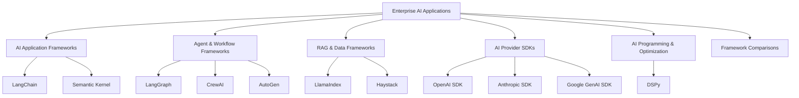

The objective is not simply to learn APIs.

The objective is to understand:

```text
Framework
   ↓
Abstractions
   ↓
Capabilities
   ↓
Architecture
   ↓
Production Trade-offs
```

---

# Section 1 — LangChain

> Build LLM-powered applications using LangChain's abstractions for models, prompts, tools, retrieval, agents, and application workflows.

| Chapter | Status |
|---|:---:|
| **[01. LangChain Fundamentals](01-langchain-fundamentals.md)** | ✅ |
| **[02. LangChain Models & Prompts](02-langchain-models-and-prompts.md)** | ✅ |
| **[03. LangChain Tools & Function Calling](03-langchain-tools-and-function-calling.md)** | ✅ |
| **[04. LangChain Retrieval & RAG](04-langchain-retrieval-and-rag.md)** | ✅ |
| **[05. LangChain Memory & State](05-langchain-memory-and-state.md)** | ✅ |
| **[06. LangChain Agents](06-langchain-agents.md)** | ✅ |
| **[07. LangChain Production Patterns](07-langchain-production-patterns.md)** | ✅ |
| **[08. LangChain Limitations & Trade-offs](08-langchain-limitations-and-tradeoffs.md)** | ✅ |

### LangChain Coverage

The LangChain section covers:

- LangChain architecture
- Core abstractions
- Model integration
- Prompt abstractions
- Message handling
- Tool integration
- Function calling
- Retrieval
- RAG pipelines
- Agent integration
- Memory and state
- Production patterns
- Framework limitations and trade-offs

### LangChain Architecture

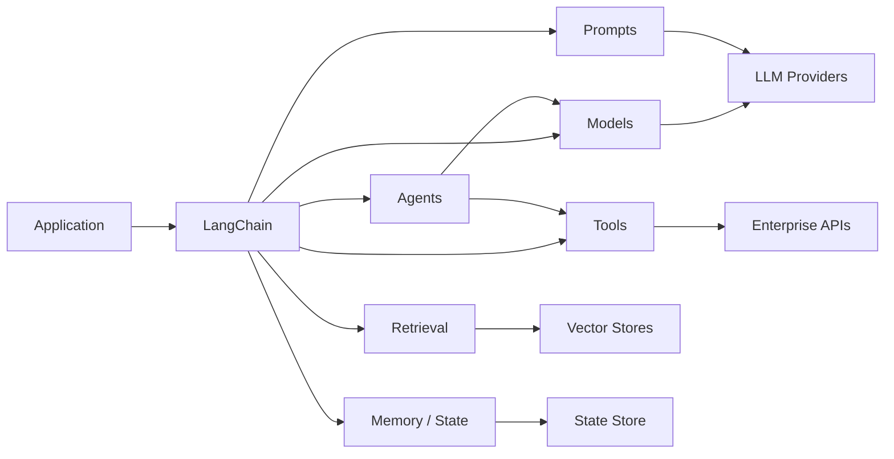

---

# Section 2 — LlamaIndex

> Build data-centric AI applications using LlamaIndex for document ingestion, indexing, retrieval, RAG, agents, and workflows.

| Chapter | Status |
|---|:---:|
| **[09. LlamaIndex Fundamentals](09-llamaindex-fundamentals.md)** | ✅ |
| **[10. LlamaIndex Data & Document Ingestion](10-llamaindex-data-and-document-ingestion.md)** | ✅ |
| **[11. LlamaIndex Indexes & Retrieval](11-llamaindex-indexes-and-retrieval.md)** | ✅ |
| **[12. LlamaIndex RAG Pipelines](12-llamaindex-rag-pipelines.md)** | ✅ |
| **[13. LlamaIndex Agents & Tools](13-llamaindex-agents-and-tools.md)** | ✅ |
| **[14. LlamaIndex Workflows](14-llamaindex-workflows.md)** | ✅ |
| **[15. LlamaIndex Production Patterns](15-llamaindex-production-patterns.md)** | ✅ |
| **[16. LlamaIndex Limitations & Trade-offs](16-llamaindex-limitations-and-tradeoffs.md)** | ✅ |

### LlamaIndex Coverage

The LlamaIndex section covers:

- LlamaIndex architecture
- Data ingestion
- Document processing
- Indexing
- Retrieval
- RAG pipelines
- Agents
- Tools
- Workflows
- Production architecture
- Framework limitations and trade-offs

### LlamaIndex Architecture

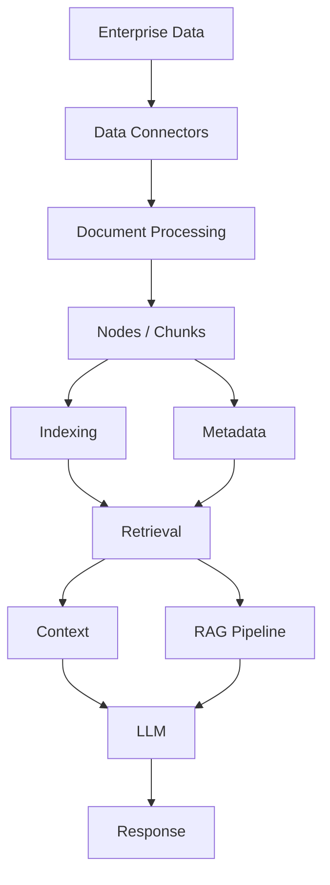

---

# Section 3 — LangGraph

> Build stateful, controllable, and production-oriented AI Agent workflows using graph-based orchestration.

| Chapter | Status |
|---|:---:|
| **[17. LangGraph Fundamentals](17-langgraph-fundamentals.md)** | ✅ |
| **[18. Graph-Based Agent Architecture](18-graph-based-agent-architecture.md)** | ✅ |
| **[19. LangGraph State & Checkpointing](19-langgraph-state-and-checkpointing.md)** | ✅ |
| **[20. LangGraph Nodes, Edges & Routing](20-langgraph-nodes-edges-and-routing.md)** | ✅ |
| **[21. LangGraph Human-in-the-Loop](21-langgraph-human-in-the-loop.md)** | ✅ |
| **[22. LangGraph Tool Execution](22-langgraph-tool-execution.md)** | ✅ |
| **[23. LangGraph Agent Workflows](23-langgraph-agent-workflows.md)** | ✅ |
| **[24. LangGraph Memory & Persistence](24-langgraph-memory-and-persistence.md)** | ✅ |
| **[25. LangGraph Production Patterns](25-langgraph-production-patterns.md)** | ✅ |
| **[26. LangGraph Limitations & Trade-offs](26-langgraph-limitations-and-tradeoffs.md)** | ✅ |

### LangGraph Coverage

The LangGraph section covers:

- Graph-based orchestration
- Agent state
- Nodes and edges
- Routing
- Conditional execution
- Checkpointing
- Persistence
- Human-in-the-loop workflows
- Tool execution
- Stateful Agent workflows
- Production deployment patterns
- Framework limitations and trade-offs

### LangGraph Architecture

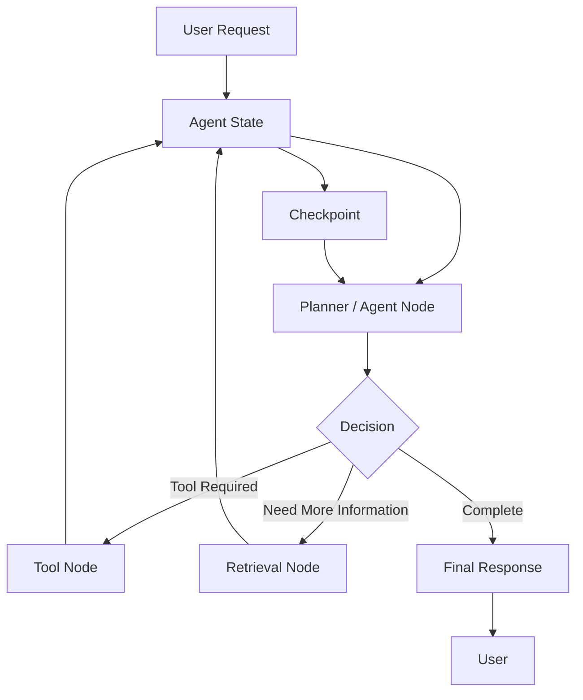

---

# Section 4 — Enterprise AI Frameworks

> Explore additional frameworks used for enterprise AI applications, Agent orchestration, multi-agent systems, and AI application development.

These frameworks are planned and will be developed later.

| Framework | Planned Coverage | Status |
|---|---|:---:|
| **Semantic Kernel** | Enterprise AI orchestration, plugins, memory, Agents, and workflows | 🚧 |
| **CrewAI** | Role-based Agents and multi-agent workflows | 🚧 |
| **AutoGen** | Conversational Agents and multi-agent orchestration | 🚧 |
| **Haystack** | Production RAG, pipelines, Agents, and retrieval systems | 🚧 |

### Planned Framework Relationship

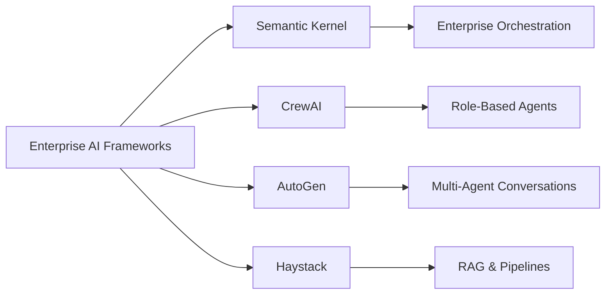

---

# Section 5 — AI Programming & Optimization

> Explore frameworks that approach AI application development from a programming, optimization, and declarative perspective.

| Framework | Planned Coverage | Status |
|---|---|:---:|
| **DSPy** | Declarative AI programming, prompt optimization, and LM pipelines | 🚧 |

### Planned DSPy Coverage

Topics will include:

- Declarative AI programming
- Signatures
- Modules
- Optimization
- Prompt optimization
- Demonstration optimization
- Evaluation-driven development
- Production considerations

---

# Section 6 — AI Provider SDKs

> Learn how to build AI applications directly using provider-native SDKs and APIs.

| SDK | Planned Coverage | Status |
|---|---|:---:|
| **OpenAI SDK** | Models, Responses, tools, structured outputs, Agents and APIs | 🚧 |
| **Anthropic SDK** | Claude APIs, tool use, messages, and application integration | 🚧 |
| **Google GenAI SDK** | Gemini models, multimodal AI, tools, and application integration | 🚧 |

### Provider SDK Architecture

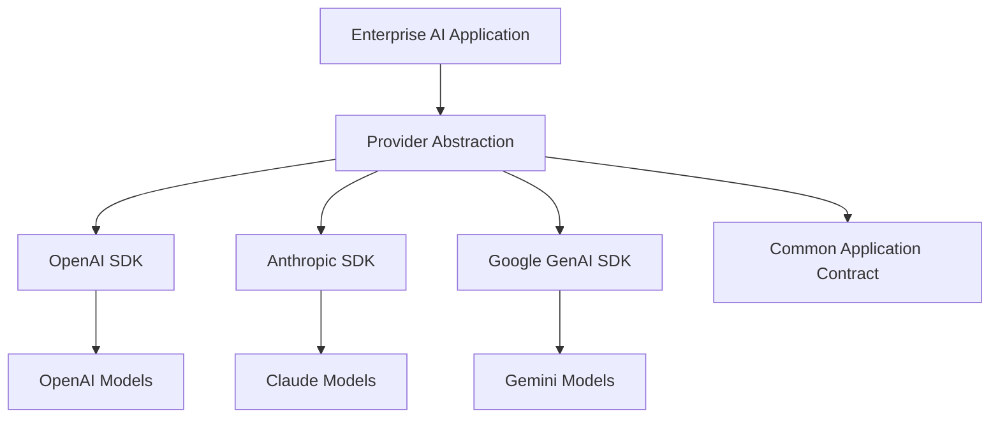

The SDK chapters will emphasize:

- Direct provider integration
- Authentication
- Model invocation
- Structured outputs
- Tool calling
- Streaming
- Error handling
- Retries
- Rate limits
- Observability
- Production integration
- Provider-specific capabilities

---

# Section 7 — AI Framework Comparisons

> Compare frameworks and SDKs from an enterprise architecture and production engineering perspective.

| Chapter | Status |
|---|:---:|
| **Framework Architecture Comparison** | 🚧 |
| **LangChain vs LlamaIndex vs LangGraph** | 🚧 |
| **AI Agent Framework Comparison** | 🚧 |
| **RAG Framework Comparison** | 🚧 |
| **Framework vs Direct SDK** | 🚧 |
| **AI Framework Selection Guide** | 🚧 |
| **Production AI Framework Architecture** | 🚧 |

### Framework Comparison Model

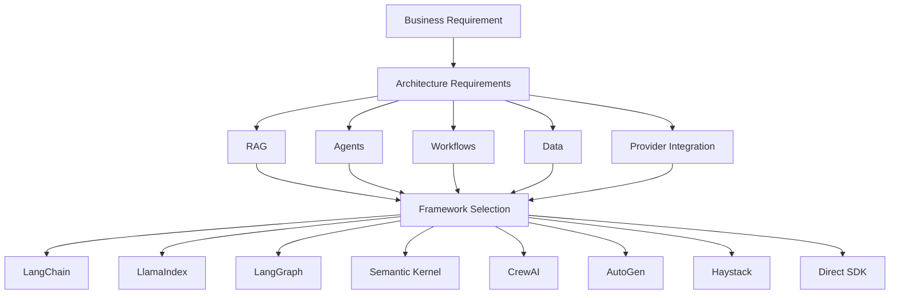

The comparison section will focus on:

- Architecture
- Abstractions
- Extensibility
- Integration
- RAG capabilities
- Agent capabilities
- Workflow orchestration
- State management
- Observability
- Evaluation
- Production readiness
- Performance
- Operational complexity
- Vendor / framework lock-in
- Enterprise adoption considerations

---

# 🏢 Enterprise Architecture Perspective

The purpose of Part VIII is not simply to teach framework APIs.

The goal is to understand how frameworks fit into a production Enterprise AI architecture.

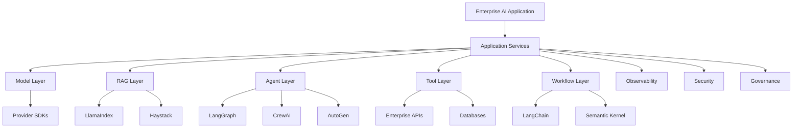

Framework selection should therefore be driven by:

```text
Business Requirements
        ↓
Architecture Requirements
        ↓
AI Capabilities
        ↓
Operational Requirements
        ↓
Framework / SDK Selection
```

---

# 🔄 Frameworks vs Direct SDKs

One of the important architectural questions covered later in this module will be:

```text
Should we use a framework?

        OR

Should we use the provider SDK directly?
```

Frameworks can provide:

- Higher-level abstractions
- Reusable components
- Workflow orchestration
- Tool integration
- Retrieval integration
- Agent abstractions
- Ecosystem integrations

Direct SDKs can provide:

- Lower abstraction overhead
- Direct access to provider capabilities
- Greater control
- Simpler dependency graphs
- Easier access to provider-specific features

The correct choice depends on the application's requirements.

---

# 🧩 Framework-Agnostic Architecture

Enterprise applications should avoid allowing framework-specific abstractions to leak unnecessarily throughout the entire business domain.

A conceptual architecture can be:

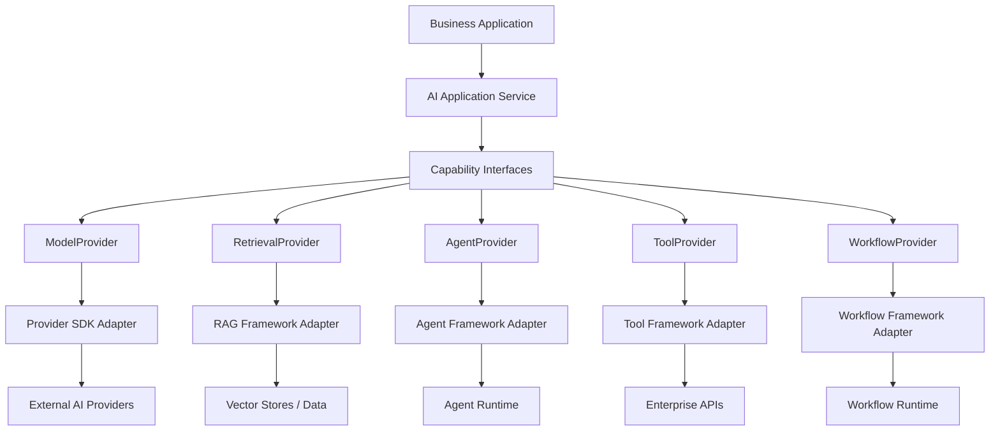

This approach can help maintain:

- Portability
- Testability
- Maintainability
- Replaceability
- Clear architectural boundaries

---

# 🏗️ Framework Abstraction Strategy

A production-oriented AI platform can separate:

```text
Business Logic
        ↓
AI Capabilities
        ↓
Framework Adapters
        ↓
Provider / Infrastructure
```

For example:

```text
Application
    ↓
LLMProvider
    ↓
OpenAIAdapter
    ↓
OpenAI SDK
```

Or:

```text
Application
    ↓
AgentProvider
    ↓
LangGraphAdapter
    ↓
LangGraph Runtime
```

This keeps framework-specific implementation details closer to the infrastructure boundary.

---

# 📊 Framework Selection Criteria

There is no universally "best" AI framework.

Selection should depend on:

| Consideration | Questions |
|---|---|
| Use Case | What are we building? |
| RAG | How complex is retrieval? |
| Agents | How complex is Agent execution? |
| Workflow | Do we need deterministic orchestration? |
| State | How much state must be persisted? |
| Integration | What enterprise systems are involved? |
| Scale | What production scale is required? |
| Observability | How deeply must execution be traced? |
| Governance | What security and compliance controls are required? |
| Portability | How important is framework independence? |
| Team Skills | What does the engineering team already know? |
| Operations | How complex is the resulting platform? |

---

# 🔬 Production Engineering Focus

Every framework chapter in this module should go beyond basic API usage.

Each framework note should cover:

## Architecture

```text
How is the framework structured?
```

## Core Abstractions

```text
What concepts does the framework introduce?
```

## Sample Code

Each note should contain practical implementation examples.

Example:

```python
from framework import Model

model = Model(
    model="example-model"
)

response = model.invoke(
    "Explain enterprise AI architecture."
)

print(response)
```

The exact API will depend on the framework being discussed.

---

## Mermaid Architecture

Framework notes should include architecture diagrams where they improve understanding.

Example:

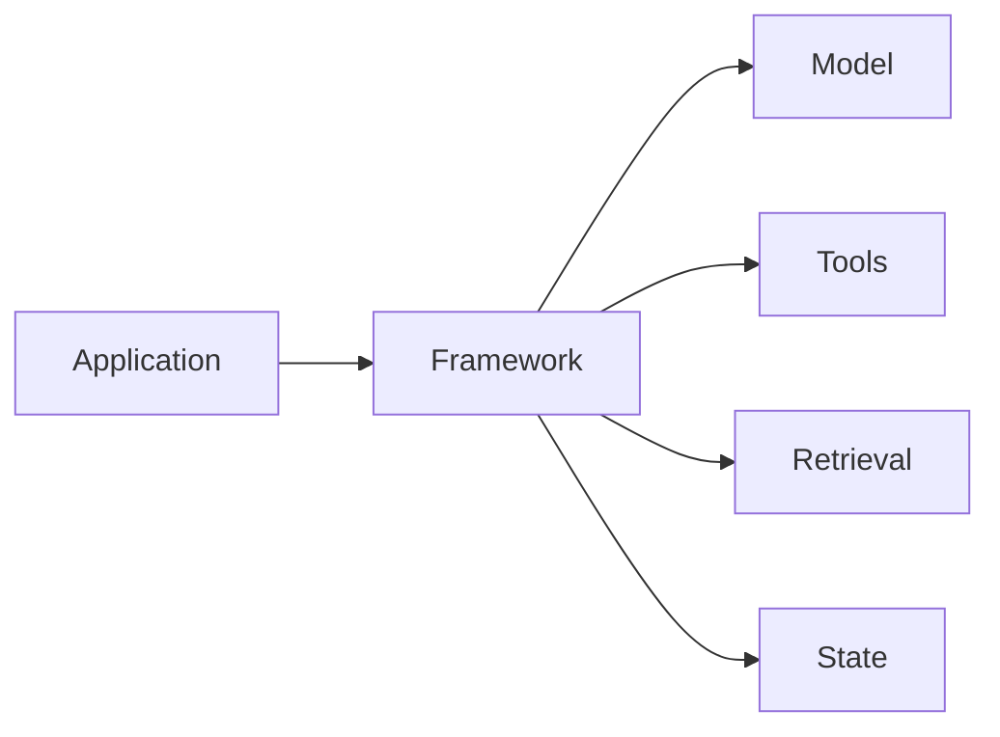

---

## Sample / Worked Example

Each major concept should include a realistic example such as:

```text
Customer Support Agent
        ↓
Retrieve Customer Context
        ↓
Call Order Service
        ↓
Generate Response
        ↓
Audit Interaction
```

---

## Graph / Visual Representation

Where useful, framework notes should include graphs or visual representations for:

- Execution flow
- State transitions
- Retrieval pipelines
- Agent workflows
- Tool invocation
- Framework architecture
- Performance characteristics
- Component relationships

---

## Text Flow

Simple concepts can use text diagrams when they communicate the architecture more clearly:

```text
Request
  ↓
Framework
  ↓
Prompt
  ↓
Model
  ↓
Tool
  ↓
Response
```

---

# 🧪 Testing & Evaluation

Framework chapters should also cover how the framework integrates with:

```text
Unit Testing
      ↓
Integration Testing
      ↓
AI Evaluation
      ↓
Regression Testing
      ↓
Production Monitoring
```

Where applicable, examples should demonstrate:

- Mock models
- Mock tools
- Deterministic tests
- Integration tests
- Evaluation datasets
- Output validation
- Failure testing

---

# ⚡ Performance & Optimization

Framework notes should address production performance where relevant.

Areas include:

- Latency
- Token usage
- Concurrency
- Streaming
- Batching
- Caching
- Connection reuse
- Async execution
- Retrieval performance
- Tool execution overhead
- Framework overhead

Example production flow:

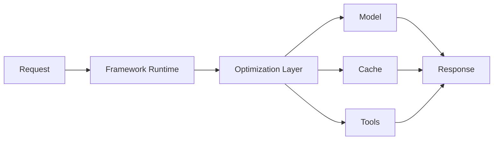

---

# ⚠️ Common Pitfalls

Framework notes should identify common problems such as:

- Excessive abstraction
- Framework lock-in
- Hidden network calls
- Uncontrolled retries
- Poor error handling
- State management issues
- Difficult debugging
- Dependency complexity
- Version compatibility problems
- Production observability gaps
- Excessive framework coupling

---

# 🧭 Relationship With Previous Parts

Part VIII builds on the engineering concepts covered earlier in the handbook.

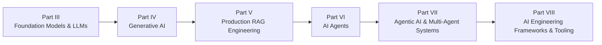

The distinction is important.

Earlier parts explain primarily:

```text
WHAT
+
WHY
```

Part VIII focuses more heavily on:

```text
HOW
```

using modern AI engineering frameworks and SDKs.

---

# 📚 Part VIII Technology Map

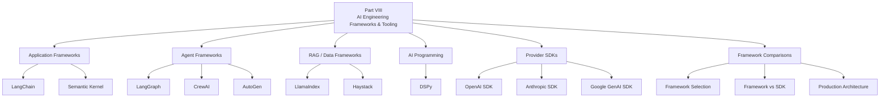

---

# 🚦 Current Development Status

## ✅ Completed

### LangChain

- LangChain Fundamentals
- LangChain Models & Prompts
- LangChain Tools & Function Calling
- LangChain Retrieval & RAG
- LangChain Memory & State
- LangChain Agents
- LangChain Production Patterns
- LangChain Limitations & Trade-offs

### LlamaIndex

- LlamaIndex Fundamentals
- LlamaIndex Data & Document Ingestion
- LlamaIndex Indexes & Retrieval
- LlamaIndex RAG Pipelines
- LlamaIndex Agents & Tools
- LlamaIndex Workflows
- LlamaIndex Production Patterns
- LlamaIndex Limitations & Trade-offs

### LangGraph

- LangGraph Fundamentals
- Graph-Based Agent Architecture
- LangGraph State & Checkpointing
- LangGraph Nodes, Edges & Routing
- LangGraph Human-in-the-Loop
- LangGraph Tool Execution
- LangGraph Agent Workflows
- LangGraph Memory & Persistence
- LangGraph Production Patterns
- LangGraph Limitations & Trade-offs

---

## 🚧 Planned

The following areas remain under development:

### Enterprise AI Frameworks

- Semantic Kernel
- CrewAI
- AutoGen
- Haystack

### AI Programming & Optimization

- DSPy

### Provider SDKs

- OpenAI SDK
- Anthropic SDK
- Google GenAI SDK

### Framework Comparisons

- Framework Architecture Comparison
- LangChain vs LlamaIndex vs LangGraph
- AI Agent Framework Comparison
- RAG Framework Comparison
- Framework vs Direct SDK
- AI Framework Selection Guide
- Production AI Framework Architecture

---

# 🏢 Enterprise AI Engineering Principle

Frameworks should be treated as **engineering tools**, not architectural dependencies that automatically define the entire system.

A strong enterprise architecture should follow:

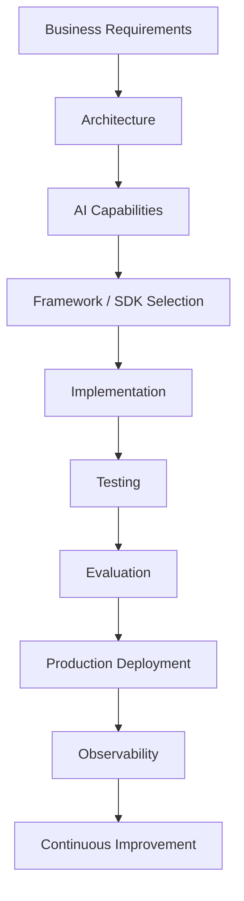

The framework should serve the architecture.

The architecture should not be forced to serve the framework.

---

# 🚀 Start Learning

The framework journey begins with the completed LangChain section:

➡️ **[01. LangChain Fundamentals](01-langchain-fundamentals.md)**

The completed learning path is:

```text
LangChain
    ↓
LlamaIndex
    ↓
LangGraph
```

The future learning path will continue with:

```text
Semantic Kernel
    ↓
CrewAI
    ↓
AutoGen
    ↓
DSPy
    ↓
Haystack
    ↓
OpenAI SDK
    ↓
Anthropic SDK
    ↓
Google GenAI SDK
    ↓
Framework Comparisons
```

---

## 🚧 Module Status

> **Status:** 🚧 **Under Active Development**

The roadmap for this module has been finalized, with the **LangChain, LlamaIndex, and LangGraph sections completed**.

The remaining frameworks, SDKs, and comparison chapters will be developed progressively.

### Each chapter will include

- 📖 Production-focused explanations
- 🏗️ Enterprise architecture diagrams
- 🔷 Mermaid architecture and workflow diagrams
- 💻 Sample implementation code
- 🧪 Testing and evaluation examples
- 📊 Graphs / visual representations where useful
- 🔄 Text-based execution flows where appropriate
- ⚡ Best practices & optimization techniques
- ⚠️ Common pitfalls & troubleshooting guidance
- 🏢 Enterprise architecture considerations
- ❓ Interview questions
- 📝 Quick revision notes
- 📚 References & further reading

---

> **Enterprise AI Engineering Handbook**  
> *Building Production-Grade Enterprise AI Systems — One Chapter at a Time.*