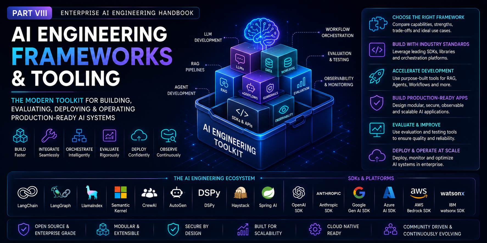

# Part VIII — AI Engineering Frameworks & Tooling

> Master the modern frameworks, orchestration platforms, SDKs, and development tools used to build, evaluate, deploy, and operate production-ready Enterprise AI applications.

---

## 📖 Overview

Modern AI applications extend far beyond calling Large Language Models through APIs. Building production-ready Enterprise AI systems requires a rich ecosystem of frameworks, orchestration platforms, SDKs, evaluation tools, and development utilities that simplify the creation, deployment, and operation of intelligent applications.

This module provides a production-focused introduction to the AI engineering ecosystem, covering the industry's leading frameworks and tooling for developing LLM-powered applications, Retrieval-Augmented Generation (RAG) pipelines, AI Agents, Agentic AI systems, and enterprise AI platforms.

Designed for software engineers, backend developers, cloud engineers, solution architects, and AI engineers, this module equips you with the practical knowledge required to select, integrate, and leverage the right frameworks for building scalable, maintainable, and production-ready AI systems.

---

## 🎯 Learning Outcomes

After completing this module, you will be able to:

- Understand the modern AI Engineering ecosystem
- Compare popular AI orchestration frameworks
- Build LLM applications using industry-standard SDKs
- Develop RAG applications using specialized frameworks
- Build AI Agents and Agentic AI systems using modern orchestration platforms
- Understand workflow orchestration and execution models
- Compare framework capabilities and trade-offs
- Select the appropriate framework for different enterprise use cases
- Design modular, maintainable, and scalable AI applications
- Apply production best practices when building Enterprise AI systems

---

## 🚧 Module Status

> **Status:** 🚧 **Under Active Development**

The roadmap for this module has been finalized, and content is currently being developed.

Each chapter will include:

- 📖 Production-focused explanations
- 🏗️ Enterprise architecture diagrams
- 💻 Hands-on implementation examples
- ⚡ Best practices & optimization techniques
- ⚠️ Common pitfalls & troubleshooting guidance
- ❓ Interview questions
- 📝 Quick revision notes
- 📚 References & further reading

New chapters will be published regularly as the handbook evolves.

---

> **Enterprise AI Engineering Handbook**  
> *Building Production-Grade Enterprise AI Systems — One Chapter at a Time.*