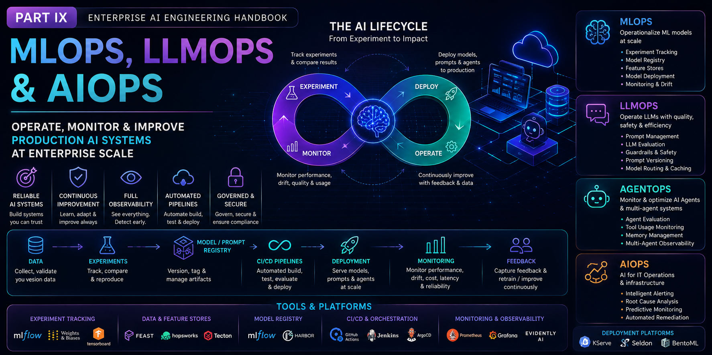

# Part IX — MLOps, LLMOps & AIOps

> Learn how production AI systems are deployed, monitored, governed, and continuously improved using modern MLOps, LLMOps, and AIOps practices.

---

## 📖 Overview

Building an AI model is only the beginning of the AI lifecycle. Enterprise AI systems must be deployed, monitored, governed, continuously improved, and operated reliably throughout their lifecycle.

This module provides a production-focused introduction to **MLOps**, **LLMOps**, and **AIOps**, covering the complete operational lifecycle of Machine Learning models, Foundation Models, Large Language Models (LLMs), AI Agents, and Agentic AI systems.

You'll learn how modern organizations automate model training, deployment, evaluation, monitoring, governance, prompt management, experiment tracking, CI/CD, continuous delivery, observability, and AI operations using industry best practices.

Designed for software engineers, cloud engineers, AI engineers, platform engineers, DevOps engineers, and solution architects, this module bridges the gap between AI development and enterprise-scale AI operations.

---

## 🎯 Learning Outcomes

After completing this module, you will be able to:

- Understand the principles of MLOps, LLMOps, and AIOps
- Design end-to-end AI lifecycle management pipelines
- Implement CI/CD pipelines for AI applications
- Track experiments and manage model versions
- Deploy and manage models in production
- Monitor model quality, drift, latency, and operational health
- Evaluate Large Language Models and AI Agents
- Implement prompt management and versioning
- Apply AI governance, security, and compliance best practices
- Build reliable, scalable, and production-ready AI platforms

---

## 🚧 Module Status

> **Status:** 🚧 **Under Active Development**

The roadmap for this module has been finalized, and content is currently being developed.

Each chapter will include:

- 📖 Production-focused explanations
- 🏗️ Enterprise architecture diagrams
- 💻 Hands-on implementation examples
- ⚡ Best practices & optimization techniques
- ⚠️ Common pitfalls & troubleshooting guidance
- ❓ Interview questions
- 📝 Quick revision notes
- 📚 References & further reading

New chapters will be published regularly as the handbook evolves.

---

> **Enterprise AI Engineering Handbook**  
> *Building Production-Grade Enterprise AI Systems — One Chapter at a Time.*