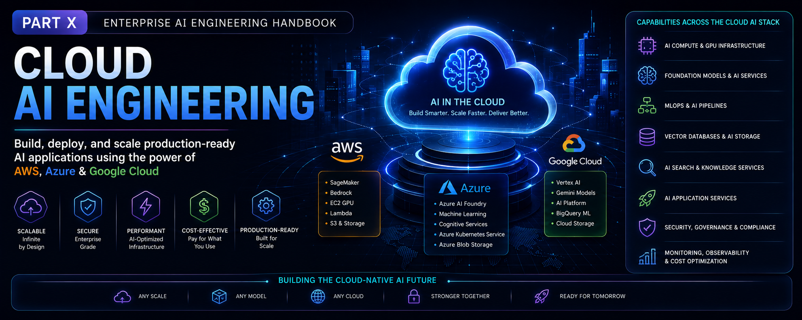

# Part X — Cloud AI Engineering

> Learn how to design, build, deploy, and operate production-ready AI applications using managed AI services across AWS, Microsoft Azure, and Google Cloud Platform.

---

## 📖 Overview

Cloud AI platforms have transformed the way organizations develop, deploy, and scale Artificial Intelligence solutions by providing managed infrastructure, foundation models, machine learning services, GPUs, serverless AI, and enterprise-grade security.

This module provides a production-focused introduction to Cloud AI Engineering, covering how modern AI systems are designed and implemented using cloud-native services from **Amazon Web Services (AWS)**, **Microsoft Azure**, and **Google Cloud Platform (GCP)**.

You'll learn how to leverage managed AI platforms, foundation model services, vector databases, GPU infrastructure, serverless AI, MLOps pipelines, and cloud-native architectures to build scalable, secure, and cost-efficient Enterprise AI solutions.

Designed for software engineers, backend developers, cloud engineers, solution architects, DevOps engineers, and AI engineers, this module bridges the gap between AI Engineering and cloud-native application development.

---

## 🎯 Learning Outcomes

After completing this module, you will be able to:

- Understand the Cloud AI ecosystem across AWS, Azure, and Google Cloud
- Compare AI services offered by major cloud providers
- Build AI applications using managed cloud AI platforms
- Deploy Machine Learning models and Foundation Models in the cloud
- Design cloud-native AI architectures
- Utilize GPUs, serverless computing, and managed AI infrastructure
- Implement cloud-native MLOps pipelines
- Secure enterprise AI workloads using cloud-native services
- Optimize AI workloads for scalability, reliability, and cost
- Design production-ready multi-cloud AI solutions

---

## 🚧 Module Status

> **Status:** 🚧 **Under Active Development**

The roadmap for this module has been finalized, and content is currently being developed.

Each chapter will include:

- 📖 Production-focused explanations
- 🏗️ Enterprise architecture diagrams
- 💻 Hands-on implementation examples
- ⚡ Best practices & optimization techniques
- ⚠️ Common pitfalls & troubleshooting guidance
- ❓ Interview questions
- 📝 Quick revision notes
- 📚 References & further reading

New chapters will be published regularly as the handbook evolves.

---

> **Enterprise AI Engineering Handbook**  
> *Building Production-Grade Enterprise AI Systems — One Chapter at a Time.*