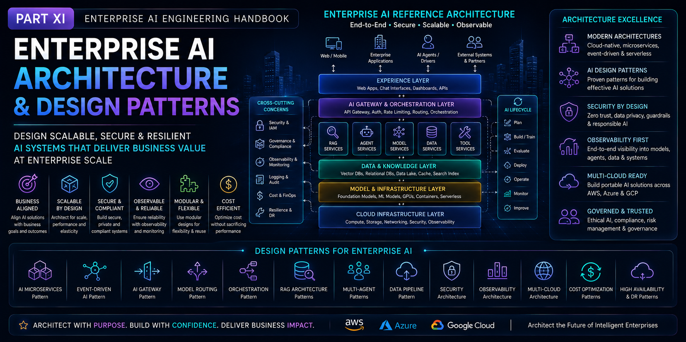

# Part XI — Enterprise AI Architecture & Design Patterns

> Master the principles, architecture patterns, and best practices required to design scalable, secure, resilient, and production-ready Enterprise AI systems.

---

## 📖 Overview

Building successful AI systems requires much more than selecting the right model or framework. Enterprise AI solutions must be designed as scalable, resilient, secure, observable, and maintainable distributed systems that integrate seamlessly with existing enterprise applications and cloud infrastructure.

This module provides a production-focused introduction to Enterprise AI Architecture and Design Patterns, covering the architectural principles, reference architectures, integration patterns, scalability strategies, governance models, and operational considerations required for designing modern AI-powered systems.

You'll learn how to architect end-to-end Enterprise AI platforms that combine Foundation Models, Retrieval-Augmented Generation (RAG), AI Agents, Agentic AI, cloud-native infrastructure, and MLOps into cohesive, production-ready solutions.

Designed for software architects, backend engineers, cloud architects, AI engineers, technical leads, and engineering managers, this module serves as the culmination of the Enterprise AI Engineering Handbook by bringing together concepts from all previous modules into complete enterprise-grade architectures.

---

## 🎯 Learning Outcomes

After completing this module, you will be able to:

- Understand Enterprise AI architecture principles
- Design scalable AI system architectures
- Apply modern AI design patterns
- Architect distributed AI applications
- Design event-driven AI systems
- Integrate Foundation Models, RAG, AI Agents, and cloud services
- Build secure, reliable, and observable AI platforms
- Apply governance, compliance, and responsible AI principles
- Optimize enterprise AI systems for scalability, resilience, and cost
- Design end-to-end production-ready Enterprise AI solutions

---

## 🚧 Module Status

> **Status:** 🚧 **Under Active Development**

The roadmap for this module has been finalized, and content is currently being developed.

Each chapter will include:

- 📖 Production-focused explanations
- 🏗️ Enterprise architecture diagrams
- 💻 Hands-on implementation examples
- ⚡ Best practices & optimization techniques
- ⚠️ Common pitfalls & troubleshooting guidance
- ❓ Interview questions
- 📝 Quick revision notes
- 📚 References & further reading

New chapters will be published regularly as the handbook evolves.

---

> **Enterprise AI Engineering Handbook**  
> *Building Production-Grade Enterprise AI Systems — One Chapter at a Time.*