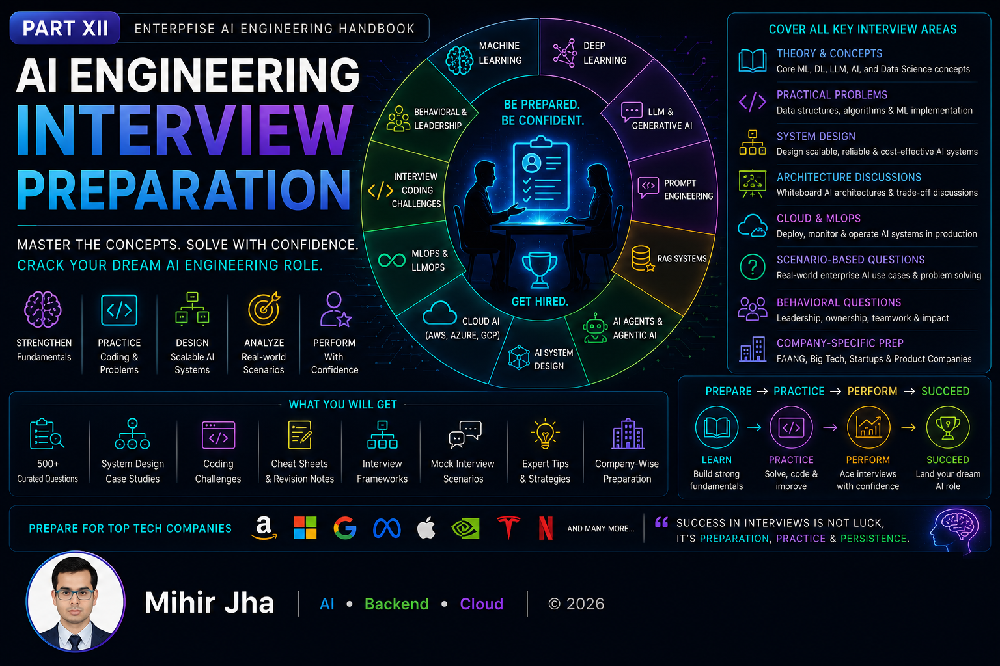

# Part XII — AI Engineering Interview Preparation

> Prepare for technical interviews with a structured, production-focused approach covering Machine Learning, Generative AI, RAG, AI Agents, Cloud AI, System Design, and Enterprise AI Engineering.

---

## 📖 Overview

Technical interviews for AI Engineering roles increasingly extend beyond Machine Learning algorithms and coding exercises. Modern AI Engineers are expected to understand Foundation Models, Large Language Models (LLMs), Retrieval-Augmented Generation (RAG), AI Agents, cloud-native AI architectures, MLOps, and enterprise-scale AI system design.

This module provides a comprehensive interview preparation guide for aspiring AI Engineers, Machine Learning Engineers, LLM Engineers, AI Architects, Cloud AI Engineers, and Solution Architects. It consolidates the concepts covered throughout this handbook into interview-oriented learning material, helping you strengthen both theoretical understanding and practical problem-solving skills.

Designed for software engineers, backend developers, cloud engineers, AI engineers, technical leads, and solution architects, this module prepares you for technical interviews at startups, product companies, consulting firms, and large technology organizations.

---

## 🎯 Learning Outcomes

After completing this module, you will be able to:

- Review Machine Learning fundamentals for interviews
- Master Deep Learning interview concepts
- Explain Foundation Models and Large Language Models confidently
- Answer Prompt Engineering and RAG interview questions
- Discuss AI Agent and Agentic AI architectures
- Design Enterprise AI systems during architecture interviews
- Explain Cloud AI services across AWS, Azure, and Google Cloud
- Apply MLOps, LLMOps, and AI governance concepts
- Solve AI System Design interview problems
- Prepare confidently for Enterprise AI Engineering interviews

---

## 🚧 Module Status

> **Status:** 🚧 **Under Active Development**

The roadmap for this module has been finalized, and content is currently being developed.

Each chapter will include:

- 📖 Production-focused interview explanations
- 🏗️ AI System Design interview case studies
- 💻 Hands-on coding challenges
- ⚡ Frequently asked interview questions
- 🧠 Architecture discussion scenarios
- 🎯 Behavioral and leadership interview guidance
- 📝 Quick revision sheets
- 📚 Curated learning resources

New chapters will be published regularly as the handbook evolves.

---

> **Enterprise AI Engineering Handbook**  
> *Building Production-Grade Enterprise AI Systems — One Chapter at a Time.*