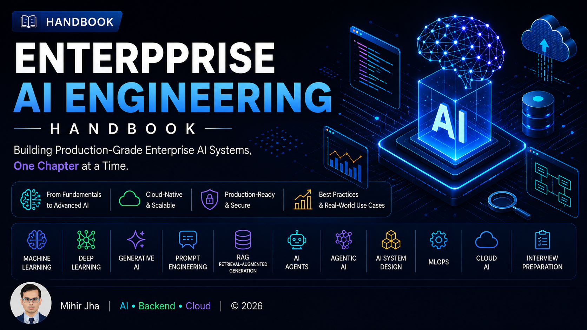
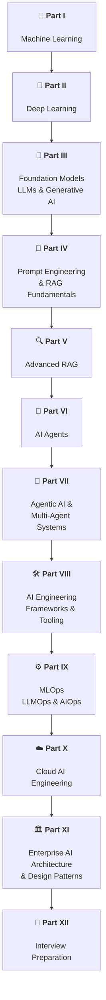

# 📘 Enterprise AI Engineering Handbook

  

> **A production-focused handbook for Backend Engineers, Cloud Engineers, Software Architects, and AI Engineers who want to design, build, deploy, and operate Enterprise AI systems.**

---

# 👋 Welcome

Welcome to the **Enterprise AI Engineering Handbook**.

This handbook is a comprehensive, production-oriented learning resource covering the complete Enterprise AI ecosystem—from Machine Learning fundamentals to Enterprise AI Agents, Agentic AI, MLOps, Cloud AI, and AI System Design.

Unlike traditional AI tutorials, this handbook focuses on **real-world engineering**, emphasizing scalable architectures, production best practices, enterprise security, observability, cloud-native deployments, and system design.

Whether you're preparing for interviews, building production AI applications, or transitioning into AI Engineering, this handbook provides a structured roadmap.

---

# 🎯 Who Is This Handbook For?

This handbook is designed for:

- Backend Engineers
- Java & Spring Boot Developers
- Cloud Engineers
- Software Architects
- AI / ML Engineers
- Full Stack Engineers
- DevOps & Platform Engineers
- Technical Leads
- Engineering Managers

---

# 📖 Table of Contents

---

# Part I — Machine Learning

Build a strong foundation in Machine Learning.

Topics include:

- Machine Learning Fundamentals
- Regression
- Classification
- Supervised Learning
- Unsupervised Learning
- Clustering
- Dimensionality Reduction
- Feature Engineering
- Model Evaluation & Validation
- Regularization Techniques
- Production Machine Learning

---

# Part II — Deep Learning

Master Deep Learning fundamentals and learn how modern neural networks are trained, optimized, evaluated, and applied to production AI systems.

Topics include:

- Deep Learning & Neural Network Fundamentals
- Mathematical Foundations, Activation & Loss Functions
- Forward Propagation, Backpropagation & Optimization
- Regularization, Generalization & Hyperparameter Tuning
- TensorFlow & Keras
- PyTorch & GPU-Accelerated Training
- Computer Vision & CNNs
- Transfer Learning, ResNet & Vision Transformers
- RNNs, LSTMs & GRUs
- Attention Mechanism & Positional Encoding
- Transformer Architecture & Applications
- Autoencoders & Representation Learning
- GANs & Diffusion Models
- Reinforcement Learning & Deep Q Networks
- Production Deep Learning Systems

---

# Part III — Foundation Models, Large Language Models & Generative AI

Understand modern Foundation Models, Large Language Models (LLMs), Generative AI, and the engineering workflows used to train, fine-tune, align, evaluate, and optimize them.

Topics include:

- Generative AI Fundamentals
- Language Understanding Fundamentals
- Word Embeddings & Language Modeling
- GPT & BERT Architectures
- Foundation Models & Large Language Models
- Hugging Face Transformers Ecosystem
- LLM Data Preparation
- Hugging Face Training Workflows
- Transformer Fine-Tuning
- Supervised Fine-Tuning (SFT)
- Parameter-Efficient Fine-Tuning (PEFT)
- LoRA & QLoRA
- Model Quantization
- LLM Generation Strategies
- LLM Evaluation
- Instruction Tuning
- Reward Modeling
- LLMs as Policies
- Reinforcement Learning from Human Feedback (RLHF)
- Proximal Policy Optimization (PPO)
- Direct Preference Optimization (DPO)
- Hugging Face TRL
- Production LLM Systems

---

# Part IV — Prompt Engineering & RAG Fundamentals

Learn how to effectively interact with Large Language Models (LLMs), design reliable prompts, and build foundational Retrieval-Augmented Generation (RAG) applications for enterprise use cases.

Topics include:

- Prompt Engineering Fundamentals
- Advanced Prompt Engineering & Prompt Design Patterns
- Zero-shot, One-shot & Few-shot Prompting
- Chain-of-Thought & ReAct
- Structured Outputs & Output Parsing
- Function Calling & Tool Calling
- Embeddings & Semantic Search
- Document Processing & Vectorization
- Document Chunking Strategies
- Vector Database Fundamentals
- Similarity Search
- RAG Pipeline Components
- Retrieval & Generation Pipelines
- Building Foundational RAG Applications
- RAG Evaluation Fundamentals
- Enterprise Generative AI Application Architecture
- Deploying AI Applications with Gradio
- Deploying AI Applications with Flask

---

# Part V — Advanced Retrieval-Augmented Generation

Build enterprise-grade Retrieval-Augmented Generation (RAG) systems — from advanced retrieval strategies to production-ready, scalable, observable, secure, and resilient RAG architectures.

Topics include:

- Core Retrieval Engineering
- VectorStore Retrieval
- Multi-Query Retrieval
- Self-Query Retrieval
- Parent-Document Retrieval
- Retriever Comparison
- Contextual Compression
- Ensemble Retrieval
- Multi-Vector Retrieval
- Time-Weighted Retrieval
- Hybrid Search
- HyDE Retrieval
- Router Retrieval
- Multi-Stage Retrieval
- Agentic Retrieval
- Re-ranking Techniques
- MMR & Diversity-Aware Retrieval
- Metadata-Aware Retrieval
- Advanced Query Rewriting
- LlamaIndex Retrieval Engineering
- LlamaIndex Indexes
- Vector Index Retrieval
- BM25 Retrieval
- Document Summary Retrieval
- Recursive Retrieval
- Query Fusion
- Auto-Merging Retrieval
- FAISS Fundamentals
- FAISS Indexes
- HNSW & Vector Index Selection
- FAISS vs ChromaDB vs Milvus
- Advanced RAG Architecture
- Graph RAG
- Knowledge Graphs for RAG
- SQL RAG
- Multimodal RAG
- Agentic RAG
- Prompt Assembly
- Context Selection & Context Engineering
- Response Validation
- Citation & Source Attribution
- Enterprise Response
- RAG Evaluation & Benchmarking
- RAG Observability
- RAG Performance Optimization
- RAG Cost Optimization
- Production Retrieval Architecture
- Building Production RAG Systems
- RAG Deployment Patterns
- RAG Caching Strategies
- Multi-Tenant RAG
- RAG Testing Frameworks
- RAG Failure Patterns

---

# Part VI — AI Agents

Learn how intelligent AI Agents are designed, built, secured, deployed, and operated as production-grade enterprise systems.

Topics include:

- Agent Fundamentals
- AI Assistants vs AI Workflows vs AI Agents
- Agent Architecture
- Agent Runtime & Execution
- Planning & Task Decomposition
- Agent Reasoning
- Agent Memory
- Tool Calling
- Function Calling
- Reflection & Self-Correction
- Agent Authorization
- Secrets Management
- Data Privacy
- Agent Sandboxing
- Agent Guardrails
- Agent Risk Management
- Agent Scaling & Resilience
- Agent Deployment
- Production Agent Deployment
- Agent Evaluation
- Agent Observability
- Production AI Agent Engineering

---

# Part VII — Agentic AI & Multi-Agent Systems

> 🚧 **Coming Soon**

Build enterprise-grade autonomous AI systems.

Planned topics include:

- Agentic AI Fundamentals
- Multi-Agent Systems
- Supervisor Pattern
- Hierarchical Agents
- Swarm Intelligence
- Collaborative Agents
- Human-in-the-Loop
- Long-Running Agents
- Agentic RAG
- Enterprise Agent Platforms

### Protocols

- Agent2Agent (A2A)
- Future Agent Protocols

---

# Part VIII — AI Engineering Frameworks & Tooling

> 🚧 **Coming Soon**

Build enterprise AI applications using modern AI frameworks.

Planned topics include:

- LangChain
- LangGraph
- LlamaIndex
- Semantic Kernel
- CrewAI
- AutoGen
- DSPy
- Haystack
- OpenAI SDK
- Anthropic SDK
- Google GenAI SDK
- AI Framework Comparisons

---

# Part IX — MLOps, LLMOps & AIOps

> 🚧 **Coming Soon**

Deploy, operate, monitor, and govern AI systems in production.

Planned topics include:

- Experiment Tracking
- Model Registry
- CI/CD
- Feature Stores
- Prompt Management
- Model Serving
- LLM Evaluation
- AI Monitoring
- Guardrails
- Continuous Training
- Continuous Fine-Tuning
- AI Governance

---

# Part X — Cloud AI Engineering

> 🚧 **Coming Soon**

Build cloud-native AI applications.

Planned topics include:

- AWS AI
- Azure AI
- Google Cloud AI
- AI Infrastructure
- GPU Computing
- Serverless AI
- Enterprise AI Platforms
- Cloud AI Architecture
- Multi-Cloud AI

---

# Part XI — Enterprise AI Architecture & Design Patterns

> 🚧 **Coming Soon**

Design scalable, secure, and production-ready Enterprise AI systems.

Planned topics include:

- AI Architecture Patterns
- AI System Design
- Scalable AI Systems
- Distributed AI
- Event-Driven AI
- AI Security
- AI Reliability
- AI Observability
- AI Infrastructure
- Enterprise Design Patterns

---

# Part XII — Interview Preparation

> 🚧 **Coming Soon**

Prepare for Enterprise AI interviews.

Planned topics include:

- AI Interview Questions
- AI System Design Interviews
- Architecture Discussions
- Coding Discussions
- Behavioral Interviews

---

# ⭐ What Makes This Handbook Different?

Unlike most AI learning resources, this handbook focuses on **Production AI Engineering**.

Every chapter includes:

- Enterprise Architecture Diagrams
- Production Workflows
- Real-World Enterprise Use Cases
- Multiple Code Examples
- Framework Comparisons
- Production Best Practices
- Common Mistakes
- Interview Questions
- Quick Revision Notes
- References
- Further Reading

---

## 🚀 Recommended Learning Path

---

# 🤝 Contributing

Contributions, corrections, suggestions, and improvements are welcome.

If you find an issue or would like to improve this handbook, please open an Issue or submit a Pull Request.

---

# 👨‍💻 Author

## Mihir Jha

**Software Architect | Enterprise AI Engineer | Cloud-Native & Multi-Cloud Solutions**

Passionate about designing intelligent, scalable, and resilient applications that combine **Cloud-Native Architecture**, **Generative AI**, and **Enterprise AI Engineering**.

If you're interested in **Enterprise AI Engineering**, **Cloud Architecture**, **Large Language Models (LLMs)**, **Retrieval-Augmented Generation (RAG)**, **AI Agents**, **Agentic AI**, or **Production AI Systems**, feel free to explore this repository, share your feedback, or connect with me.

---

## 🌐 Connect With Me

- 🌍 **Documentation Website**  
  [Enterprise AI Engineering Handbook](https://mihirkjha.github.io/enterprise-ai-engineering-handbook/)

- 💻 **GitHub**  
  [MihirKJha](https://github.com/MihirKJha)

- 💼 **LinkedIn**  
  [Mihir Jha](https://www.linkedin.com/in/mihirkrjha/)

- 📰 **Newsletter – Enterprise AI Engineering**  
  [Read on LinkedIn](https://www.linkedin.com/newsletters/enterprise-ai-engineering-7479222208079319041/)

---

## 📬 About the Newsletter

**Enterprise AI Engineering** is a technical newsletter where I share practical, production-focused insights on:

- Enterprise AI Engineering
- Cloud Architecture
- Backend Engineering
- Large Language Models (LLMs)
- Retrieval-Augmented Generation (RAG)
- AI Agents & Agentic AI
- MLOps & Cloud AI
- Production-Ready AI Systems
- AI System Design & Best Practices

---

⭐ **If you find this handbook useful, please consider giving it a ⭐ Star and sharing it with others.**

---

> **Building Production-Grade Enterprise AI Systems, One Chapter at a Time.**