# 📘 Enterprise AI Engineering Handbook

  

> **A production-focused handbook for Backend Engineers, Cloud Engineers, Software Architects, and AI Engineers who want to design, build, deploy, and operate Enterprise AI systems.**

---

# 👋 Welcome

Welcome to the **Enterprise AI Engineering Handbook**.

This handbook is a comprehensive, production-oriented learning resource covering the complete Enterprise AI ecosystem—from Machine Learning fundamentals to Enterprise AI Agents, Agentic AI, MLOps, Cloud AI, and AI System Design.

Unlike traditional AI tutorials, this handbook focuses on **real-world engineering**, emphasizing scalable architectures, production best practices, enterprise security, observability, cloud-native deployments, and system design.

Whether you're preparing for interviews, building production AI applications, or transitioning into AI Engineering, this handbook provides a structured roadmap.

---

# 🎯 Who Is This Handbook For?

This handbook is designed for:

- Backend Engineers
- Java & Spring Boot Developers
- Cloud Engineers
- Software Architects
- AI / ML Engineers
- Full Stack Engineers
- DevOps & Platform Engineers
- Technical Leads
- Engineering Managers

---

# 📖 Table of Contents

---

# Part I — Machine Learning

Build a strong foundation in Machine Learning.

Topics include:

- Machine Learning Fundamentals
- Regression
- Classification
- Supervised Learning
- Unsupervised Learning
- Clustering
- Dimensionality Reduction
- Feature Engineering
- Model Evaluation & Validation
- Regularization Techniques
- Production Machine Learning

---

# Part II — Deep Learning

Learn how modern neural networks power today's AI systems.

Topics include:

- Neural Network Fundamentals
- Deep Neural Networks
- TensorFlow & Keras
- PyTorch
- CNNs
- RNNs
- LSTMs & GRUs
- Attention Mechanism
- Transformer Architecture
- Transfer Learning
- Autoencoders
- Model Optimization
- Production Deep Learning

---

# Part III — Foundation Models, Large Language Models & Generative AI

Understand modern foundation models and Generative AI.

Topics include:

- Foundation Models
- Large Language Models (LLMs)
- Hugging Face Ecosystem
- Tokenization
- Embeddings
- Fine-Tuning
- PEFT
- LoRA
- Quantization
- Diffusion Models
- Generative Adversarial Networks (GANs)
- Vision Transformers (ViT)
- Multimodal AI
- Production LLM Systems

---

# Part IV — Prompt Engineering & RAG Fundamentals

Learn how to effectively use Large Language Models and build Retrieval-Augmented Generation (RAG) applications.

Topics include:

- Prompt Engineering Fundamentals
- Prompt Design Patterns
- Zero-shot Prompting
- Few-shot Prompting
- Chain of Thought
- ReAct
- Structured Outputs
- Function Calling
- Tool Calling
- Embeddings in Practice
- Vector Databases
- Chunking Strategies
- Basic Retrieval
- Basic RAG Pipeline

---

# Part V — Advanced Retrieval-Augmented Generation

Build enterprise-grade Retrieval-Augmented Generation systems.

Topics include:

- Hybrid Search
- Metadata Filtering
- Parent-Child Retrieval
- Multi-Vector Retrieval
- Multi-Query Retrieval
- Contextual Compression
- Re-ranking
- Graph RAG
- SQL RAG
- Knowledge Graphs
- Agentic RAG
- RAG Evaluation
- Performance Optimization
- Cost Optimization
- Production RAG Architectures

---

# Part VI — AI Agents

Learn how intelligent AI agents are designed and deployed.

Topics include:

- Agent Fundamentals
- Agent Architecture
- Planning
- Reasoning
- Memory
- Tool Calling
- Function Calling
- Reflection
- Self-Correction
- Agent Evaluation
- Observability
- Security
- Deployment
- Model Context Protocol (MCP)

---

# Part VII — Agentic AI & Multi-Agent Systems

> 🚧 **Coming Soon**

Build enterprise-grade autonomous AI systems.

Planned topics include:

- Agentic AI Fundamentals
- Multi-Agent Systems
- Supervisor Pattern
- Hierarchical Agents
- Swarm Intelligence
- Collaborative Agents
- Human-in-the-Loop
- Long-Running Agents
- Agentic RAG
- Enterprise Agent Platforms

### Protocols

- Agent2Agent (A2A)
- Future Agent Protocols

---

# Part VIII — AI Engineering Frameworks & Tooling

> 🚧 **Coming Soon**

Build enterprise AI applications using modern AI frameworks.

Planned topics include:

- LangChain
- LangGraph
- LlamaIndex
- Semantic Kernel
- CrewAI
- AutoGen
- DSPy
- Haystack
- OpenAI SDK
- Anthropic SDK
- Google GenAI SDK
- AI Framework Comparisons

---

# Part IX — MLOps, LLMOps & AIOps

> 🚧 **Coming Soon**

Deploy, operate, monitor, and govern AI systems in production.

Planned topics include:

- Experiment Tracking
- Model Registry
- CI/CD
- Feature Stores
- Prompt Management
- Model Serving
- LLM Evaluation
- AI Monitoring
- Guardrails
- Continuous Training
- Continuous Fine-Tuning
- AI Governance

---

# Part X — Cloud AI Engineering

> 🚧 **Coming Soon**

Build cloud-native AI applications.

Planned topics include:

- AWS AI
- Azure AI
- Google Cloud AI
- AI Infrastructure
- GPU Computing
- Serverless AI
- Enterprise AI Platforms
- Cloud AI Architecture
- Multi-Cloud AI

---

# Part XI — Enterprise AI Architecture & Design Patterns

> 🚧 **Coming Soon**

Design scalable, secure, and production-ready Enterprise AI systems.

Planned topics include:

- AI Architecture Patterns
- AI System Design
- Scalable AI Systems
- Distributed AI
- Event-Driven AI
- AI Security
- AI Reliability
- AI Observability
- AI Infrastructure
- Enterprise Design Patterns

---

# Part XII — Interview Preparation

> 🚧 **Coming Soon**

Prepare for Enterprise AI interviews.

Planned topics include:

- AI Interview Questions
- AI System Design Interviews
- Architecture Discussions
- Coding Discussions
- Behavioral Interviews

---

# ⭐ What Makes This Handbook Different?

Unlike most AI learning resources, this handbook focuses on **Production AI Engineering**.

Every chapter includes:

- Enterprise Architecture Diagrams
- Production Workflows
- Real-World Enterprise Use Cases
- Multiple Code Examples
- Framework Comparisons
- Production Best Practices
- Common Mistakes
- Interview Questions
- Quick Revision Notes
- References
- Further Reading

---

# 🚀 Recommended Learning Path

```mermaid
flowchart LR

subgraph F1["📚 Phase 1 — AI Foundations"]
    ML["Machine Learning"]
    DL["Deep Learning"]
end

subgraph F2["🧠 Phase 2 — Foundation Models"]
    FM["Foundation Models & LLMs"]
    PE["Prompt Engineering & RAG Fundamentals"]
    AR["Advanced RAG"]
end

subgraph F3["🤖 Phase 3 — Intelligent AI Systems"]
    AG["AI Agents"]
    AA["Agentic AI"]
end

subgraph F4["⚙️ Phase 4 — Enterprise AI Engineering"]
    FW["Frameworks & Tooling"]
    OPS["MLOps / LLMOps"]
    CLOUD["Cloud AI"]
    ARCH["Enterprise AI Architecture"]
end

subgraph F5["🎯 Phase 5 — Career Preparation"]
    INT["Interview Preparation"]
end

ML --> DL
DL --> FM
FM --> PE
PE --> AR
AR --> AG
AG --> AA
AA --> FW
FW --> OPS
OPS --> CLOUD
CLOUD --> ARCH
ARCH --> INT
```

---

# 🤝 Contributing

Contributions, corrections, suggestions, and improvements are welcome.

If you find an issue or would like to improve this handbook, please open an Issue or submit a Pull Request.

---

# 👨‍💻 Author

## Mihir Jha

**Software Architect | Enterprise AI Engineer | Cloud-Native & Multi-Cloud Solutions**

Passionate about designing intelligent, scalable, and resilient applications that combine **Cloud-Native Architecture**, **Generative AI**, and **Enterprise AI Engineering**.

If you're interested in **Enterprise AI Engineering**, **Cloud Architecture**, **Large Language Models (LLMs)**, **Retrieval-Augmented Generation (RAG)**, **AI Agents**, **Agentic AI**, or **Production AI Systems**, feel free to explore this repository, share your feedback, or connect with me.

---

## 🌐 Connect With Me

- 🌍 **Documentation Website**  
  [Enterprise AI Engineering Handbook](https://mihirkjha.github.io/enterprise-ai-engineering-handbook/)

- 💻 **GitHub**  
  [MihirKJha](https://github.com/MihirKJha)

- 💼 **LinkedIn**  
  [Mihir Jha](https://www.linkedin.com/in/mihirkrjha/)

- 📰 **Newsletter – Enterprise AI Engineering**  
  [Read on LinkedIn](https://www.linkedin.com/newsletters/enterprise-ai-engineering-7479222208079319041/)

---

## 📬 About the Newsletter

**Enterprise AI Engineering** is a technical newsletter where I share practical, production-focused insights on:

- Enterprise AI Engineering
- Cloud Architecture
- Backend Engineering
- Large Language Models (LLMs)
- Retrieval-Augmented Generation (RAG)
- AI Agents & Agentic AI
- MLOps & Cloud AI
- Production-Ready AI Systems
- AI System Design & Best Practices

---

⭐ **If you find this handbook useful, please consider giving it a ⭐ Star and sharing it with others.**

---

> **Building Production-Grade Enterprise AI Systems, One Chapter at a Time.**